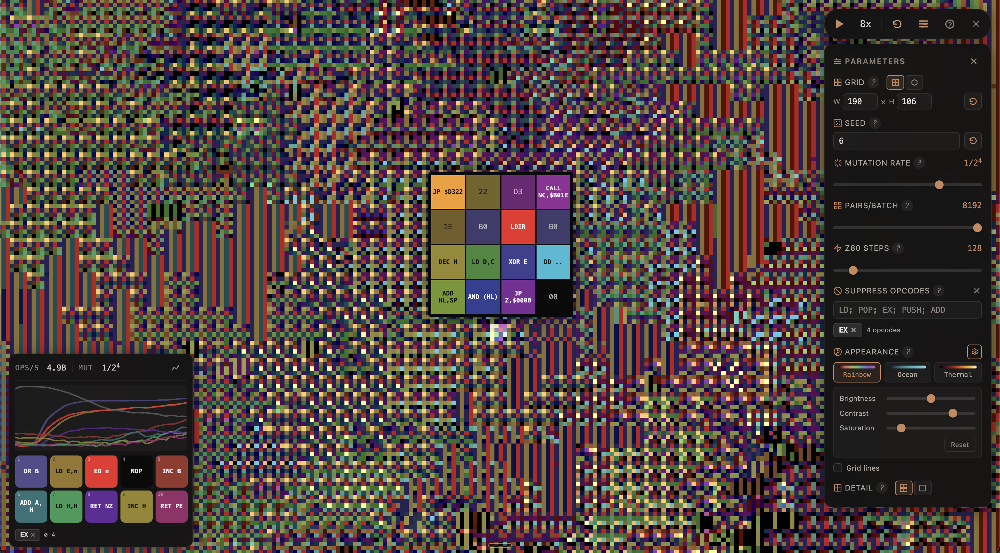

# Algocell

**Artificial life via Z80 machine code.** Watch self-replicating programs emerge from random bytes in a WebGPU-accelerated simulation running over 50 billion operations per second.



## What is it?

Algocell fills a grid of cells with random bytes. Each cell holds a short tape (16 bytes in square mode, 19 in hex). Every simulation step, the following happens thousands of times in parallel on the GPU:

1. A random cell and one of its neighbors are chosen
2. Their tapes are copied into a single contiguous buffer (Cell A's bytes, then Cell B's), forming a small wrapping address space
3. A fresh Z80 CPU — all registers set to zero, program counter at 0 — executes instructions from this buffer for up to 128 steps. It can read and write anywhere in the combined buffer, so Cell A's code can overwrite Cell B's bytes and vice versa
4. The modified buffer is split and written back to both cells

After all pairs are processed, random mutations replace a configurable number of bytes across the grid with new random values. No fitness function, no selection pressure — just execution and mutation.

Because all registers start at zero, many Z80 instructions end up writing zeros, flooding the grid with NOP (0x00). Eventually, by chance, a short sequence like `POP HL` + `EX (SP),HL` forms a self-copying loop that propagates itself into neighboring cells. Once a replicator appears, it spreads exponentially, displacing the NOPs. You can suppress dominant patterns to see if alternative replication strategies evolve.

## Features

- **WebGPU compute shaders** — entire simulation runs on GPU, including Z80 instruction decoding
- **Square and hexagonal grids** — hex mode produces more organic emergent behavior with 6 neighbors instead of 4
- **Configurable grid size** — from tiny experiments to large-scale ecosystems
- **Real-time frequency analysis** — live chart tracking the most common byte values (opcodes) over time
- **Opcode suppression** — block dominant replicators by treating their instructions as NOPs
- **Simple/Detailed view** — toggle between averaged cell colors and individual byte-level rendering
- **Appearance controls** — multiple colormaps, brightness/contrast/saturation adjustments, grid line toggle
- **Cell inspection** — hover any cell to see its full Z80 disassembly and byte layout
- **Mobile support** — touch-optimized with tap-to-inspect and responsive layout

## Getting started

```bash
npm install
npm run dev
```

Requires a browser with [WebGPU support](https://caniuse.com/webgpu) (Chrome 113+, Edge 113+, Firefox Nightly, Safari 18.2+).

## How it works

See "What is it?" above for the full mechanism. In short:

1. Initialize a grid of cells with random bytes
2. Each step, pick thousands of random neighbor pairs in parallel
3. For each pair: combine tapes → run a fresh Z80 CPU → write results back to both cells
4. Apply random mutations across the grid
5. Repeat — self-replicating programs emerge spontaneously

## Tech stack

- [SvelteKit](https://svelte.dev/) + TypeScript
- [WebGPU](https://www.w3.org/TR/webgpu/) compute and render shaders (WGSL)
- [Tailwind CSS](https://tailwindcss.com/)

## License

MIT
