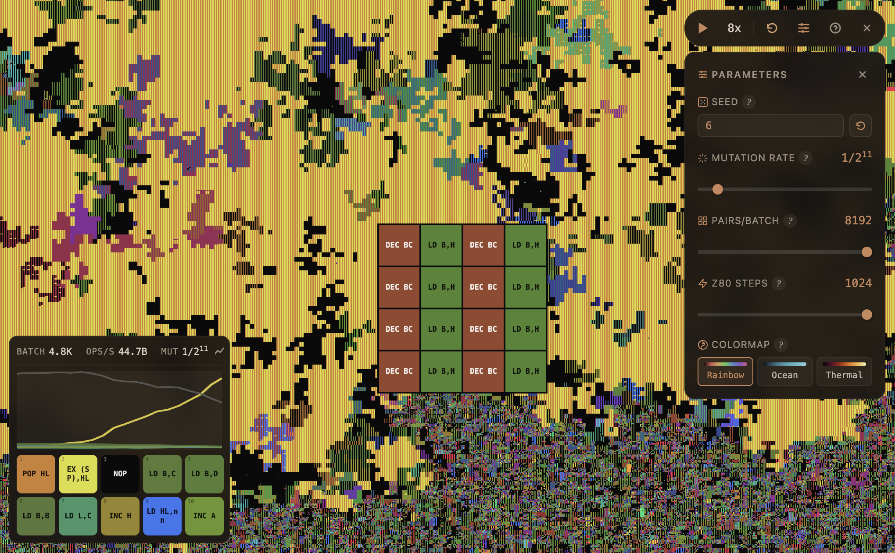

<p align="center">
  
</p>

<h1 align="center">Algocell</h1>

<p align="center">
  <strong>Artificial life emerging from random bytes — running entirely in your browser.</strong>
</p>

<p align="center">
  
  
  
  
  
</p>

<p align="center">
  <a href="https://neovand.github.io/algocell/"><strong>Try the live demo</strong></a>
</p>



Watch self-replicating Z80 programs spontaneously emerge from a grid of random bytes. A 200x200 grid of cells, each containing 16 random bytes, is continuously executed as Z80 machine code. Within seconds, self-replicating programs appear and compete for space — digital life from pure noise.

Based on [Hartley & Colton (2024)](https://arxiv.org/abs/2406.19108) and the [original Python/JAX implementation](https://github.com/znah/zff) by Alexander Mordvintsev. This version re-implements the simulation using WebGPU compute shaders, so it runs directly in the browser with no installation or GPU drivers required. At max settings on a MacBook Air M3, it reaches over 50 billion Z80 operations per second.

## How it works

1. **Grid**: 200x200 cells, each holding 16 bytes (640KB total)
2. **Each step**: Random adjacent cell pairs are selected. Their 32 bytes are concatenated and executed as a Z80 program for up to 1024 steps. The modified memory is written back.
3. **Mutation**: Random bytes are flipped at a configurable rate (default 1/2^4)
4. **Emergent behavior**: The Z80 CPU starts with all registers zeroed, so random code tends to write zeros — NOP (0x00) accumulates rapidly. Then self-replicating programs (typically `POP HL` + `EX (SP),HL` loops) emerge and outcompete the NOPs.

## Controls

| Key | Action |
|---|---|
| **Space** | Play / Pause |
| **R** | Reset simulation |
| **H** | Help / Guide |
| **1-8** | Set speed multiplier |
| **Scroll** | Zoom in/out |
| **Click + Drag** | Pan |
| **Hover** | Inspect cell (Z80 disassembly) |

## Parameters

- **Seed** — Random seed for initial grid state
- **Mutation Rate** — Probability of random byte flips (1/2^n, from 1/2 to 1/2^12)
- **Pairs/Batch** — Cell pairs evaluated per GPU dispatch (controls throughput vs. GPU load)
- **Z80 Steps** — CPU cycles per pair execution (16–1024, controls program complexity vs. speed)
- **Colormap** — Visual theme (Rainbow, Ocean, Thermal)

## Development

```bash
npm install
npm run dev
```

## Building

```bash
npm run build
```

Outputs a static site (via `@sveltejs/adapter-static`) that can be deployed anywhere.

## Credits

- Paper: *"Self-Replicating Programs in a Z80 Virtual Machine"* — Hartley & Colton (2024) ([arXiv:2406.19108](https://arxiv.org/abs/2406.19108))
- Original implementation: [znah/zff](https://github.com/znah/zff) by Alexander Mordvintsev
- Developed by [Neo Mohsenvand](https://github.com/NeoVand) with the help of [Claude Code](https://claude.ai)
