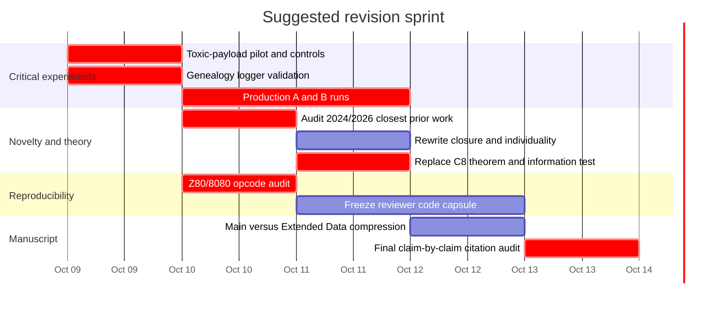

# Deep literature review: heredity, individuality, and digital primordial soups

The analysis below treats the experimental facts and claim labels C1–C8, together with experiments A and B, as given in the authors’ research brief. fileciteturn0file0 I have deliberately separated **prior art that genuinely threatens novelty** from material that is merely analogous. The strongest conclusion is that the paper can still make a distinctive contribution, but not safely under the broad proposition that “heredity can precede individuality” unless *individuality* is operationalized much more narrowly than it is in the transitions-in-individuality and organizational-closure literatures.

## Executive summary

- **The most serious novelty threat is the paper that created this experimental lineage.** Agüera y Arcas et al. already showed spontaneous self-replicator emergence from random BFF, Forth, Z80 and 8080-like programs under pairwise interaction without an explicit fitness function. Their abstract establishes the broad phenomenon unambiguously, and secondary descriptions of their Z80 experiments explicitly describe an early wave of stack-based copiers followed by LDIR/LDDR-based copiers. Thus “random Z80 soup first produces crude copiers and later block-copy replicators” is not safe as a new claim. Your defensible novelty is the **measured open→self-confined transition, its substrate determinants, its genealogy, and its regenerator/transmitter consequences**, not the architectural sequence in broad outline. citeturn21academia37turn21search15

- **Partner-dependent replication is also old in artificial chemistry.** In Stringmol, strings can require another string in order to be copied; the literature explicitly discusses replicators that are unable to reproduce by themselves and parasites that exploit others’ copying machinery. Cross-catalytic RNA systems likewise have two molecular species synthesize one another. These are real precedents for reproduction without organism-like autonomy, although neither establishes your specific spontaneous temporal sequence from partner-entering to execution-confined machine code. citeturn1search5turn6search3

- **The thesis “inheritance/evolution before strong individuality” has major conceptual precedents.** Woese’s Darwinian-threshold argument and Vetsigian, Woese and Goldenfeld’s communal-evolution model explicitly place a horizontally exchanging, weakly individualized regime before strongly vertical Darwinian lineages. Major-transitions theory, meanwhile, treats individuality itself as something that evolves. You therefore should not sell C1–C2 as the first demonstration that heredity can conceptually precede individuality; sell it as a **direct, mechanistically resolved transition in a substrate where the boundary can be observed instruction by instruction**. citeturn3search16turn3search1turn22search1

- **“Closure” is presently your most attackable theoretical word.** Montévil and Mossio’s closure of constraints is mutual organizational dependence among constraints; it is not confinement of the program counter. A Z80 replicator whose instruction pointer remains in its own tape can still write into a neighbour, rely on an externally supplied execution event, and depend on the soup for a target substrate. Call the measured property **execution confinement**, **control-flow confinement**, or, if you retain “closure,” “control-flow closure” and explicitly deny equivalence to organizational closure. citeturn4search0turn4search1

- **C5 is empirically interesting but Proposition 8 is probably elementary mathematics.** Forward overlapping `LDIR` propagates the first \(d\) source bytes periodically because bytes overwritten at distance \(d\) later become sources. That result is proved by a one-line induction. Fine–Wilf is relevant only when reasoning about *multiple simultaneous periods*; citing it as though it explains the LDIR result would make the theorem look more, not less, inflated. The interesting theorem within reach is the **general arbitrary-\(d\) periodic-fill theorem plus the mutation-induced stationary distribution over offsets**, not the divisible-\(d\) special case. citeturn14search0turn23search12

- **C8 Theorem 2 needs correction before a mathematically alert reviewer sees it.** If 128 instruction fetches remain inside \(L\le100\) byte addresses, the pigeonhole principle proves that an instruction address is fetched twice. It does **not** prove that the complete Z80 machine state cycles: memory, registers, stack, flags and counters can differ at the repeated program counter. Eventual periodicity follows only after pigeonholing the *entire finite machine state*. The paper should distinguish “revisited instruction address/control-flow loop” from “state-space cycle.”

- **Lemma 7 risks calling conditional entropy “information inflow.”** In general, \(H(Y\mid E)\) is residual uncertainty, not information transmitted from parent \(X\). The appropriate conditional information quantity is
  \[
  I(X;Y\mid E)=H(Y\mid E)-H(Y\mid X,E).
  \]
  Your existing quantity equals information supplied by \(X\) only under a checked condition such as \(H(Y\mid X,E)=0\), meaning the offspring is deterministic given focal tape and partner with no unmodelled noise. Bertschinger et al. provide a useful conditional-information vocabulary for autonomy; Krakauer et al. provide the broader information-theoretic individuality context. citeturn5search0turn3search4

- **Experiment A is potentially the paper’s most genuinely new biological result.** Core War supplies a remarkably close computational analogy—`DAT` data kills a process that executes it, and bombing an adversary’s execution path is canonical—but Core War warriors actively place weapons into shared memory. Your proposed effect is subtler: a **heritable, owner-unexecuted region becomes selectively enriched for bytes that are harmless to the carrier and harmful when a foreign executor enters it**. Selfish-DNA theory gives the essential adaptive-null warning; superinfection-exclusion systems give the strongest biological analogy and predict specificity, localization and escape/arms-race effects. citeturn23search11turn23search9turn7search0turn7search2turn8search7turn8search0

- **Experiment B should track a provenance DAG, not a conventional genealogy.** Because copying is partial, shifted and potentially chimeric, a tape can have multiple causal ancestors at the byte level. Avida’s line-of-descent methodology establishes the value of exact ancestry for mechanistic evolutionary reconstruction, while modern digital-evolution work distinguishes exact phylogeny tracking from compact hereditary-stratigraphy approximations. Since you can instrument every write, do not infer parenthood by sequence similarity when you can record it exactly. citeturn10search0turn10search1turn10academia39turn10academia42

- **There is one immediate hardware-review trap.** The reviewer’s claim that original 8080 silicon treats `CB` as a JMP alias, `D9` as RET, and `DD`, `ED`, `FD` as CALL aliases is consistent with later documentation of the 8080’s undocumented opcodes; those behaviours are, by definition, absent from Intel’s documented instruction set. On a Z80, those same bytes have different roles—`CB`, `DD`, `ED`, `FD` are prefix families and `D9` is `EXX`. Therefore an “8080-like” ablation must state its decoder exactly. If those aliases are omitted, call it **8080-like**, not an emulation of physical 8080 behaviour. citeturn15search47turn14search0turn16search0turn16search1

## Novelty threats and the must-cite literature

The right novelty claim is narrower than the current title but, in my view, stronger scientifically: **random-code heredity can initially be implemented by execution that crosses a candidate organismal boundary; later evolution can confine execution; the probability and consequences of that transition are controlled by substrate-level rules.** None of the verified prior work establishes that entire package.

| Prior work | Exact overlap with your paper | Threat | What to do |
|---|---|---:|---|
| **Agüera y Arcas et al. 2024, Computational Life** | Random BFF/Forth/Z80/8080-like soups; pairwise concatenation; spontaneous self-replicators; no explicit fitness landscape. Secondary descriptions of the Z80 section report an early stack-copy phase followed by LDIR/LDDR architectures. citeturn21academia37turn21search15 | **Serious to broad C1–C3 novelty** | Concede architectural continuity. Claim novelty for traced boundary crossing, quantitative open→confined succession, tar/literal-channel causal ablations, transmissible payloads and genealogy. Before resubmission, verify and cite the exact Z80 figure/page in the 2024 manuscript. |
| **Cicala et al. 2026, Co-evolution of self-replication and function in a digital primordial soup** | Uses the phrase **“digital primordial soup”**, random 32-byte Z80 programs and pairwise interactions. Environmental task pressure changes reproductive architecture; metabolic constraints promote conditional halting and block-copy replication. citeturn21academia35turn23academia50 | **Serious to phrase originality and broad C6** | Do not imply “environment shapes replicator architecture” is new. Your sharper result is that *by-product lethality* changes the regenerator/transmitter balance and perhaps selects an externally expressed payload defence. |
| **Knierim et al. 2026, BFF: Simple explanations for complex phenomena** | Shows simple mutation random walks can locate self-replicators at least as readily as pair-interaction soups, and ancestry caps affect takeover rather than initial appearance. citeturn21academia36 | **Partial to any causal story about why interaction creates life** | Avoid saying paired ecological dynamics are uniquely responsible for discovering replicators. C1–C7 can survive because they concern the architecture and succession *conditional on this soup*. |
| **Pargellis 1996; Greenbaum & Pargellis 2017** | Spontaneous digital self-replication from initially random opcode environments; later work deliberately removed strong memory encapsulation and studied self-organizing precursors. citeturn1search0turn1search2turn1search11 | **Serious to any “first spontaneous digital life” framing; partial otherwise** | Cite prominently in introduction. Contrast their question—spontaneous generation—with yours—what kind of reproducer appears first and how its boundary changes. |
| **Rasmussen et al. Coreworld** | Computational chemistry with local interactions and emergent cooperative structures from a noisy computational medium. citeturn2search1 | **Partial** | Historical precursor. Do not claim raw random-code soup as unprecedented. I did not verify a source supporting a stronger claim that Coreworld demonstrated your specific open→closed sequence. |
| **Fontana & Buss / AlChemy; Kruszewski & Mikolov** | Artificial chemistries can generate self-maintaining/self-reproducing organizations from reaction rules rather than hard-coded organism reproduction. citeturn1search13turn2academia41 | **Partial** | Use to position the paper as one member of a long “organization before conventional organisms” tradition, not as the origin of that idea. |
| **Stringmol** | Replication can require binding another string; organisms, parasites and copying relationships are interaction-defined rather than self-contained. Semantic closure later evolves in Stringmol. citeturn1search5turn1search8 | **Serious to broad C1 language; partial to C2** | Explicitly say partner-dependent digital replication is known. Your distinction is **spontaneous first replicators crossing a fixed tape boundary followed by measured confinement in the same substrate**. |
| **Lincoln & Joyce 2009** | Two RNA enzymes cross-catalyse one another’s synthesis and undergo sustained exponential amplification; replication is relational rather than autonomous self-copying. citeturn6search3 | **Serious conceptual precedent for C1/title** | Origin-of-life reviewers can legitimately use this against “heredity requires an individual first.” Cite it yourself and narrow the claim. |
| **Woese 2002; Vetsigian et al. 2006** | Early evolution proposed as communal and horizontally exchanging before the transition to strongly vertical lineages. citeturn3search16turn3search1 | **Serious to the broad thesis “heredity before individuality”** | Treat your system as an experimentally transparent *analogue of a proposed ordering*, not evidence that the ordering was historically true for terrestrial life. |
| **Fine & Wilf 1965** | Canonical theorem on periods of words. It does not discover your LDIR mechanism, but it makes strong claims of novelty about elementary periodicity risky. citeturn23search12turn23search2 | **Serious to mathematical novelty of C5 if oversold** | Frame Proposition 8 as a substrate lemma explaining an empirical switch. Strengthen it to arbitrary offsets and mutation dynamics. |
| **Core War / Redcode** | `DAT` terminates a process that executes it; bombing, scanners, imps and replicating “papers” exploit a shared executable memory. Recent Digital Red Queen work evolves Core War strategies with LLM-guided adversarial search. citeturn23search11turn23search9turn23search10 | **Partial to A** | Say “closest computational analogy,” not novelty killer: Core War bombs are active combat instructions; your proposed defence is a heritable *passive payload expressed when the opponent executes it*. |
| **Selfish DNA / Hsu bodyguard hypothesis** | Repetitive/noncoding sequence need not be organism-level adaptation; Hsu proposed constitutive heterochromatin as protective material, whereas selfish-DNA papers explicitly warn that genomic material may persist for its own propagation. citeturn9search1turn7search0turn7search2 | **Partial to C4/A interpretation** | Make “damage or neutral accumulation” the explicit null. Do not call payload zeros a defence until knockout and spatial-hazard tests establish function. |

**Phrase check.** The exact phrase “digital primordial soup” is already in the title of Cicala et al. 2026, so it has no priority value. citeturn21academia35 In the indexed searches performed here, I did **not** find an exact earlier title/thesis using “heredity before individuality” or “heredity precedes individuality.” That is not evidence of absence: adjacent ideas are explicit in communal-evolution, major-transitions and scaffolded-reproducer literatures. citeturn3search16turn22search3

I also did not locate a peer-reviewed or archival primary publication for **Nanopond** in this pass. It should not be cited from a hobby page or secondary compilation merely to complete a list. If there is a primary Nanopond technical report, it remains an unresolved bibliography item.

**Must-cite list, ranked by importance**

| Rank | Source | Why it needs to be in the paper |
|---:|---|---|
| 1 | Agüera y Arcas et al. 2024 citeturn21academia37 | Direct experimental ancestor and largest novelty constraint. |
| 2 | Cicala et al. 2026 citeturn21academia35 | Same Z80 lineage, exact “digital primordial soup” phrase, environment-dependent reproductive architecture. |
| 3 | Pargellis 1996, *The spontaneous generation of digital “Life”* citeturn1search0 | Canonical older spontaneous random-code digital-life precedent. |
| 4 | Greenbaum & Pargellis 2017 citeturn1search11 | Later Amoeba treatment explicitly relevant to unencapsulated/self-organizing reproduction. |
| 5 | Clark, Hickinbotham & Stepney 2017 citeturn1search8 | Stringmol and evolved semantic closure; closest digital-chemistry comparison for “closure.” |
| 6 | Godfrey-Smith 2009 citeturn3search2 | “Scaffolded reproducers” gives better vocabulary for the first pushers than “non-individual life.” |
| 7 | Woese 2002 citeturn3search16 | Major conceptual precedent for weakly individualized early evolution preceding strong vertical lineages. |
| 8 | Vetsigian, Woese & Goldenfeld 2006 citeturn3search1 | Formal/quantitative communal-evolution sequel to Woese. |
| 9 | Montévil & Mossio 2015 citeturn4search0 | Prevents misuse of “organizational closure.” |
| 10 | Lincoln & Joyce 2009 citeturn6search3 | Laboratory origin-of-life example of sustained cross-replication. |
| 11 | Knierim et al. 2026 citeturn21academia36 | Important contemporary critique of causal interpretations of Computational Life. |
| 12 | Krakauer et al. 2020 citeturn3search4 | Modern information-theoretic account of individuality. |
| 13 | Bertschinger et al. 2008 citeturn5search0 | Gives a computable conditional-information notion of autonomy. |
| 14 | Lenski et al. 2003 citeturn10search0 | Gold-standard use of exact digital ancestry and knockouts to reconstruct an evolutionary innovation. |
| 15 | Dolson et al. 2020 citeturn10search1 | Modern ancestry-based analyses for digital evolution. |
| 16 | Zaman et al. 2014 citeturn22search0 | Strong digital-evolution precedent linking antagonistic coevolution to complexity/evolvability. |
| 17 | Wilke et al. 2001 citeturn11search0 | Canonical warning that harsh mutational regimes can select robustness rather than maximal reproduction/evolvability. |
| 18 | Fine & Wilf 1965 citeturn23search12 | Correct mathematical context for periodicity without overselling Proposition 8. |
| 19 | Orgel & Crick 1980; Doolittle & Sapienza 1980 citeturn7search2turn7search0 | Essential non-adaptive null for payload sequence. |
| 20 | Bondy-Denomy et al. 2016 / Leavitt et al. 2024 citeturn8search7turn8search0 | Strong biological model for invader-specific defence, including low-cost defence and escape mutations. |

## Findings by workstream

The table gives the high-level answer; the text underneath concentrates on the highest-priority workstreams and on places where I think the manuscript should change.

| Workstream | Main conclusion | Immediate deliverable |
|---|---|---|
| **W1 — novelty** | Spontaneous random-code replication is old; partner-dependent replication is old; stack→block-copy architecture may already be described. The quantitative boundary transition and substrate rules remain defensible. citeturn21academia37turn1search0turn1search5 | Rewrite novelty paragraph around **boundary crossing, transition order and causal ablations**. |
| **W2 — individuality** | Pointer confinement is not accepted biological individuality or organizational closure. It is an excellent operational measure of **control-flow confinement**. citeturn4search0turn3search2 | Rename variable/claim; optionally add an information-autonomy analysis. |
| **W3 — prebiotic analogues** | Cross-replication and communal replication make C1 plausible but reduce philosophical novelty; parasite/spatial literature predicts pressure for localization/compartmentalization. citeturn6search3turn6search4turn6search9 | Cite as analogies, not evidence for Earth's historical trajectory. |
| **W4 — toxic payload** | Core War gives a near-mechanical analogue; selfish DNA supplies the null; superinfection exclusion gives the best adaptive comparison. citeturn23search11turn7search0turn8search7 | Run spatial hazard, semantic detoxification and damage-null controls tonight. |
| **W5 — genealogy** | Exact provenance beats sequence-based phylogeny because chimerism is intrinsic to the substrate. citeturn10search0turn10academia42 | Log byte-level provenance DAG and predeclare origin classes. |
| **W6 — switch/trade-off** | Proposition 8 is elementary; the general offset theorem and induced mutation Markov chain are more interesting. Harshness does not generally imply selection for evolvability. citeturn23search12turn11search0 | Strengthen theorem; avoid an “evolvability” explanation for C6 without direct evidence. |
| **W7 — rigorous theory** | Pigeonhole result must be weakened or state space expanded; recursion theorem gives existence, not emergence; conditional mutual information is preferable to conditional entropy. | Revise Theorem 2 and Lemma 7. |
| **W8 — critique/framing** | Successful high-profile digital-evolution papers lead with a general evolutionary question and use computation as an experiment, not as a claim to have reproduced life. citeturn13search1turn10search0turn11search0 | First paragraph should be about **when a heritable unit acquires a boundary**, not about digital life. |
| **W9 — CPU semantics** | 8080 aliases are undocumented; Z80 prefix and LDIR semantics matter materially. citeturn15search47turn14search0 | Publish exact decoder table and differential tests for all opcodes used by evolved replicators. |
| **W10 — Nature** | Central code must be available to editors/referees on request; Code Ocean is now available across Nature Portfolio; typical Nature article and Extended Data limits are tight. citeturn17search8turn19search7turn18search1 | Give reviewers an executable frozen environment and move mechanistic census figures to Extended Data. |

**W1 — closest prior work.** Tierra and Avida should be described primarily as contrasts. Their classic experiments generally begin with viable digital organisms or a designed reproduction mechanism rather than waiting for copying to arise from uniform random machine code. Pargellis is therefore much closer to the broad spontaneous-generation claim than Tierra/Avida. Coreworld and AlChemy are historically important because they make organization and reaction structure emergent properties of a computational medium, while Kruszewski and Mikolov show self-reproducing “metabolisms” arising in a combinatory-logic chemistry. citeturn1search0turn2search1turn1search13turn2academia41

The post-2024 literature I could verify contains **two especially important direct follow-ups**. Knierim et al. challenge the interpretation that pairwise soup dynamics are especially good at finding replicators. Cicala et al. extend the Z80 system to selected functional tasks and show that those demands change reproductive architecture. Both are 2026 arXiv preprints and therefore not yet peer-reviewed in the sources I verified. citeturn21academia36turn21academia35 I found no additional clearly scholarly 2024–2026 SUBLEQ/RISC-V/BFF follow-up with comparable direct relevance in the indexed search; that statement is a search result, not a guarantee of exhaustiveness.

One concern is unusually sharp: a contemporary secondary account of the original Computational Life experiments says the Z80 runs first produce **stack-based replicators** and later a wave exploiting `LDIR`/`LDDR`. citeturn21search15 That is close enough to C1–C2 that the final revision should quote and cite the exact original passage rather than rely on any summary. Until that is done, I would word novelty as:

> We show that the architectural succession previously observed in Z80 soups is a transition in **execution confinement**, quantify its frequency, and identify substrate properties that control whether it occurs.

That turns a threat into continuity.

**W2 — individuality and closure.** Maynard Smith and Szathmáry emphasize transitions in how hereditary information is organized and transmitted and the emergence of higher-level units whose parts may lose independent reproductive capacity. Michod models individuality as an evolved reorganization of fitness, cooperation and conflict. Neither framework says that any physically bounded copier is automatically an individual; rather, individuality is the outcome to be explained. citeturn22search3turn22search11turn22search1

Godfrey-Smith is particularly useful because his category of **scaffolded reproducers** accommodates entities whose reproduction depends on external machinery or circumstances. That seems much safer for your pushers than saying they constitute “heredity without individuals” as a settled ontological fact. citeturn3search2 Woese and Vetsigian et al., conversely, are the strongest support for the paper’s *ordering*: a communal evolutionary regime can precede strongly lineage-based Darwinian evolution. citeturn3search16turn3search1

Pointer confinement is defensible as an operational variable because it is exact, mechanistic and substrate-level. What it is **not** is Rosen/Mossio-style organizational closure. In closure-of-constraints theory, closure concerns a mutually sustaining network of constraints and functions. citeturn4search0 A confined `LDIR` copier can keep its PC inside its tape while causally writing the neighbouring tape, so even the physical causal boundary remains permeable.

I therefore recommend replacing sentences of the form “individuals become closed” with:

> “Execution becomes self-confined: the copying process no longer fetches instructions from the partner’s tape.”

Then reserve *individuality* for the interpretation:

> “We treat execution confinement as one operational dimension of individuality, not as a sufficient definition of a biological individual.”

An information-theoretic supplement is feasible from existing traces. Let \(X_t\) denote a coarse-grained focal-tape state, \(E_t\) the partner state and \(X_{t+1}\) the focal state after interaction. Bertschinger-style nontrivial autonomy can be operationalized as

\[
A = I(X_{t+1};X_t\mid E_t),
\]

while environmental determination can be measured as

\[
D = I(X_{t+1};E_t\mid X_t).
\]

Bertschinger et al. explicitly formulate autonomy in conditional-information terms, while Krakauer et al. develop a temporal-information conception of individuality. citeturn5search0turn3search4 Do **not** use all \(L\) bytes plus complete machine state naively: deterministic transitions will make these quantities huge and sample-hungry. Use a prespecified coarse graining—copying core, transmissible sites, culture score, or next-generation genotype class—and report robustness to that choice.

A particularly natural version for your existing culture assay is

\[
I(X_{\text{parent}};Y_{\text{2nd gen}}\mid E_{\text{partners}}),
\]

which asks how much information about the second-generation product is supplied specifically by the candidate parent after conditioning on its interaction environment.

**W3 — origin-of-life analogues.** Lincoln and Joyce’s cross-replicating RNA enzymes are the cleanest empirical warning against equating replication with individual autonomy: each enzyme catalyses production of its partner, and the system sustains amplification and evolutionary competition/recombination. citeturn6search3 Your first pushers are not chemically analogous in mechanism, but the logical structure—reproduction implemented relationally across entities—is close enough that an origin-of-life reviewer could invoke it.

Hypercycle and spatial-replicator work points in the other direction: once parasites appear, spatial self-organization or compartments can stabilize cooperative replicator systems. Boerlijst and Hogeweg showed spatial spiral structures protecting hypercycles against parasites; Takeuchi and Hogeweg directly compared spatial self-organization with compartmentalization as mechanisms of multilevel selection. citeturn6search4turn6search9 That literature gives you a principled biological interpretation of C2: **boundary formation can be a response to ecological conflict**, but your present data do not yet establish that mechanism.

Autocatalytic-set theory is useful mainly as a warning. RAF structure captures self-sustaining organization, but autocatalysis alone does not establish high-fidelity heredity or evolvability; Vasas, Szathmáry and Santos showed that self-sustaining autocatalytic networks can have severe evolvability limitations. citeturn6search16turn23search5 Thus C1 should stay about *measured heredity*, not merely autocatalytic persistence.

**W4 — toxic payload.** Core War is the striking prior-art analogy. In Redcode, `DAT` is data that kills a process when executed, and standard strategy includes bombing memory with lethal instructions while other strategies replicate, scan or run minimal imps through shared executable memory. citeturn23search11turn23search6 The 2026 Digital Red Queen project uses adversarial LLM-guided evolution to produce Core War programs employing self-replication, data bombing and multithreading; the web release and repository are useful contemporary context but, from the sources I verified, should not be presented as a peer-reviewed scientific precedent. citeturn23search9turn23search7

The difference that preserves novelty is important:

- A conventional Core War bomb is an action performed by an attacker.
- Your hypothesized zero is part of a **heritable region that the owner never executes**.
- Its phenotype appears when a **different executor enters the owner’s inherited memory**.
- Under the hypothesized mechanism, defence can therefore be almost uncoupled from owner-side execution cost.

That is much closer to an **interactor-dependent phenotype** than to a conventional program instruction.

Hsu’s 1975 “bodyguard” hypothesis is often invoked too loosely. The original proposal concerned constitutive heterochromatin as protective material; it is not a precedent for DNA that poisons an invading executor. citeturn9search1 Orgel–Crick and Doolittle–Sapienza are more important for you because they supply the skeptical null: non-executed sequence can proliferate without organism-level benefit. citeturn7search2turn7search0

Superinfection exclusion is a closer functional analogy. Prophage-encoded mechanisms can make a host refractory to subsequent phage infection, and modern work on P22 SieA identifies a specific block to superinfecting DNA entry plus escape mutations in the invading machinery. Related experimental work reports prophage-mediated phage defence that can carry little detectable host cost in the tested setting. citeturn8search0turn8search7 That literature predicts exactly the kinds of signatures you can test: specificity to invasion route, localization to the site of attack, dose dependence, and counter-adaptation by invaders.

I did not independently verify primary sources for restriction–modification, toxin–antitoxin, bacteriocin/spite or yeast “make–accumulate–consume” mechanisms during this pass. They are reasonable secondary analogies but I would not spend scarce Nature references on them unless experiment A works. Superinfection exclusion plus selfish DNA gives a cleaner adaptive-versus-neutral contrast.

Zaman et al. provide the digital coevolution precedent worth citing: Avida host–parasite coevolution increased evolved complexity, and mutational-neighbourhood analysis found more function-switching opportunities in hosts evolved with parasites. citeturn22search0turn22search4 That is a precedent for **antagonists changing genome architecture**, but it is not prior art for your proposed payload mechanism.

**W5 — genealogy.** Lenski et al. 2003 is the methodological model to imitate rhetorically: because every digital ancestor can be retained, they reconstructed the exact line of descent and performed genotype-level manipulations to identify steps underlying a complex innovation. citeturn10search0 Dolson et al. subsequently formalized ancestry-based metrics such as lineage length, phylogenetic richness, divergence and most-recent-common-ancestor depth. citeturn10search1 Modern hereditary-stratigraphy work is valuable when exact ancestry cannot be stored cheaply, but your proposed per-step log makes approximate stratigraphy unnecessary for the main analysis. citeturn10academia39turn10academia42

Your substrate is not naturally a tree. One encounter can overwrite separate byte ranges from different sources, and literal writes can synthesize bytes that match neither tape. The correct object is therefore a **directed acyclic provenance graph** whose nodes are tape states or copying events and whose edges carry contribution metadata.

For every memory write, record at minimum:

`time, focal cell, partner cell, destination index, writer PC, writer lineage, write type, source cell/index if copied, literal value if synthesized, mutation flag`.

Keep two notions separate:

1. **Genealogical ancestry:** a path of reproductive/copying events connects an earlier tape to a later tape.
2. **Material provenance:** which earlier byte or instruction causally supplied each later byte.

That distinction prevents a neutral payload byte from making an otherwise independently evolved closer look “descended from” an open copier in the mechanistic sense you care about.

Sequence matching at the best cyclic shift should be used only as a diagnostic check against the exact log, not as the primary parent rule. If you must analyze old runs without provenance, report best-shift identity plus a permutation-derived false-parent rate rather than a universal identity threshold.

**W6 — regenerate/transmit and the offset switch.** The forward-overlap result can be stated cleanly. Suppose an initial memory word is \(x_0,x_1,\ldots\) and a forward copy successively performs

\[
M[i+d]\leftarrow M[i],\qquad i=0,\ldots,n-1.
\]

For \(i<d\), destinations receive \(x_i\). For \(i\ge d\), \(M[i]\) was itself written at iteration \(i-d\), so induction gives

\[
M[i+d]=x_{i\bmod d}.
\]

Thus the copied region is tiled with period \(d\). This is the mechanism behind your special case. Zilog’s documented `LDIR` semantics—increment source and destination, decrement `BC`, and repeat while the count is non-zero—support this interpretation. citeturn14search0

Fine–Wilf says that if a sufficiently long word has periods \(p\) and \(q\), with length at least \(p+q-\gcd(p,q)\), then it also has period \(\gcd(p,q)\), with the bound essentially sharp. citeturn23search12turn23search1 It becomes relevant if you show that evolved tapes simultaneously satisfy two periodicity constraints. It is not needed to prove the one-offset overwrite lemma.

The most natural strengthening of C5 is therefore:

> **Overlap periodicity theorem.** A forward overlapping copy with displacement \(d>0\) makes every copied destination position depend only on its source-index residue modulo \(d\), up to boundary effects.

Your \(d\mid L\) proposition is then a corollary giving exact tiling of a length-\(L\) tape.

A second theorem is available essentially for free. If a point mutation replaces byte `XX` symmetrically among all 256 values and fitness is neutral with respect to the switch, then the stationary distribution on byte values is uniform. Consequently the induced offset distribution is

\[
\pi(d)=
\frac{\#\{x\in\{0,\ldots,255\}:x\bmod 2L=d\}}{256}.
\]

For \(2L\) not dividing 256, offsets are *not* exactly equally likely. That gives you an explicit mutation-only null for C6.

Be careful with the language of “evolvability.” Wilke et al.’s survival-of-the-flattest result demonstrates that high mutation can favour mutational robustness over the genotype with the highest raw replication rate. citeturn11search0 There is no general theorem that harsher environments favour more variation-transmitting genomes. If lethal tar favours transmitters because payload zeros directly protect them, that is ordinary first-order selection on a current phenotype and is conceptually much cleaner than second-order selection for evolvability.

Also reconsider **“self-repair.”** If regenerators overwrite their bodies during reproduction, that is unquestionably regeneration of sequence. It becomes strong “repair” only if a lesion introduced before an encounter is restored to the resident sequence without simply selecting an undamaged copy. A small lesion/restoration assay would make the term unassailable.

**W7 — theory.** The substrate offers better theory than high-level analogies. The strongest options are spelled out in the dedicated theory section below. Kleene’s recursion theorem proves the existence of self-referential programs in sufficiently expressive computable systems, but it says nothing about probability of spontaneous emergence, ecological success or open-versus-confined copying. That makes it background, not explanatory theory for C1–C3. citeturn12search49

**W8 — standard objections and successful framing.** The classic high-profile digital-evolution papers succeeded by posing a biological/evolutionary question first. Lenski et al. 1999 used digital organisms to examine general relationships among complexity, robustness and genetic interactions; Lenski et al. 2003 framed the origin of complex features as an evolutionary problem; Wilke et al. 2001 presented digital organisms as an experimental realization of a mutation-selection prediction. citeturn13search1turn10search0turn11search0

That is the template to copy. Do not lead with “we made life from random bytes.” Lead with:

> Heredity and individuality are often treated as arriving together, yet evolutionary theory allows them to become coupled in stages. We use executable digital matter because it lets us observe, instruction by instruction, when hereditary copying crosses or respects a candidate boundary.

One correction to the comparison list in the brief: Blount et al. 2008 is **wet-lab E. coli experimental evolution**, not digital evolution. It remains an excellent precedent for historical-contingency framing, but not evidence that ALife itself has reached PNAS.

The generic objections reviewers will make are predictable: the tape boundary is imposed; CPU conventions matter; registers are supplied; replication is operationally defined; machine code is not chemistry; and results may be architecture-specific. C3 and C7 are unusually valuable precisely because they address those objections experimentally. Do not hide these ablations in Extended Data.

**W9 — CPU facts.** The reviewer’s undocumented-8080 claim deserves a nuanced response. Intel’s official 8080 manuals document the ordinary instruction set and are the primary sources for defined semantics. citeturn16search0turn16search1 Later opcode documentation of 8080-compatible silicon reports the undocumented aliases:

| Byte | Reported original 8080 behaviour | Z80 meaning |
|---|---|---|
| `CB` | alternate unconditional `JMP` | bit/rotate prefix |
| `D9` | alternate `RET` | `EXX` |
| `DD` | alternate `CALL` | IX prefix |
| `ED` | alternate `CALL` | extended-instruction prefix |
| `FD` | alternate `CALL` | IY prefix |

The alias list is corroborated by later documentation of 8080-compatible hardware, but because these are **undocumented instructions**, I did not locate a contemporaneous Intel manual that promises these behaviours. citeturn15search47 That is exactly why the manuscript should define its “8080-like” semantics rather than assert unspecified silicon fidelity.

For Z80, the primary manual is directly relevant to C5. It states that `LDIR` moves the byte at `(HL)` to `(DE)`, increments both pointers, decrements `BC`, and, while `BC` remains non-zero, repeats by moving the PC back to the instruction; it also states that interrupts may be recognized between transfers. citeturn14search0 This raises a reproducibility issue that deserves one sentence in Methods: **what does “128 instructions” count for a repeating block instruction?** If the emulator call treats an entire `LDIR` as one instruction whereas physical execution re-fetches/repeats internally, the ecological resource represented by “128 instructions” is emulator-specific. State the rule explicitly.

Undocumented flag bits and exact refresh-register behaviour should not enter any theorem unless your emulator deliberately models them. The safest reproducibility test is a one-page table listing all opcodes present in every reported first/final replicator and whether their behaviour is (i) documented Z80, (ii) documented 8080, (iii) undocumented silicon behaviour, or (iv) simulator convention.

**W10 — Nature practicalities.** Nature’s current author guidance says custom code central to the main claims must be made available to editors and referees upon request, and central custom code requires a code-availability statement. Data necessary for peer review likewise has to be accessible when requested. citeturn17search8 Since 2024, Nature Portfolio journals have offered Code Ocean as an optional way to provide confidential executable capsules to referees; accepted capsules can become public and citable. citeturn19search7turn19search5 For this manuscript, a frozen emulator/container containing exact CPU semantics and one-command reproduction of the headline runs would directly answer a likely reviewer concern.

Current Nature guidance describes approximately 2,500 main-text words and four modest display items for a typical six-page Article, or roughly 4,300 words and five to six items for an eight-page paper, typically with up to about 50 references; online Methods are typically around 3,000 words but may be longer when necessary. citeturn18search1 Nature typically permits up to ten Extended Data display items. citeturn17search0turn17search15 The implication is strategic: keep **A/B, the open→confined transition and the strongest substrate ablation in the main displays**; census tables, opcode audits and exhaustive robustness panels belong in Extended Data.

## Reviewer attack surface

| Likely reviewer objection | Severity | Best response now |
|---|---:|---|
| **“Agüera y Arcas already showed the Z80 stack-copy to LDIR transition.”** citeturn21academia37turn21search15 | **Critical** | Concede the architectural observation and redefine novelty as *boundary-resolved transition + causal substrate rules + heredity consequences*. Cite exact prior passage. |
| **“Your ‘individuality’ is just a tape boundary that you imposed.”** | **Critical** | Agree that it is one operational dimension. Rename the variable **execution confinement** and show results are invariant to reasonable boundary definitions where possible. |
| **“Pointer confinement is not organizational closure.”** citeturn4search0 | **High** | Explicitly distinguish control-flow closure from closure of constraints. Do not cite autopoiesis/organizational closure as though equivalent. |
| **“Closed replicators still depend on neighbours, the scheduler and shared execution.”** | **High** | Yes. Say the result is a transition in *where copying instructions are executed*, not the emergence of complete thermodynamic or organizational autonomy. |
| **“You have not shown that the later closed population descends from the early open population.”** | **Critical until B is run** | Run experiment B. Until then use “open replicators appear before closed replicators,” not “open replicators evolve into closed replicators.” |
| **“C6 has a post-hoc mechanism after the preregistered explanation failed.”** | **Critical** | Say so transparently. Treat toxic payload as a new preregistered/confirmatory experiment with independent runs and causal knockouts. |
| **“Zero enrichment could be mutation/damage bias, not defence.”** citeturn7search0turn7search2 | **Critical for A** | Use empirical mutation-only null, \(p\)-dose response, hazard localization, contextual detoxification and sham interventions. |
| **“Your cycle theorem is mathematically wrong.”** | **High** | Replace “machine cycle” with “revisited instruction address,” or prove eventual periodicity over complete finite machine state. |
| **“Conditional entropy is not information flow.”** citeturn5search0 | **High** | Replace/augment \(H(Y\mid E)\) with \(I(X;Y\mid E)\); state precisely when they coincide. |
| **“The 8080 ablation is not an 8080, and emulator conventions create the effect.”** citeturn15search47turn16search0 | **High** | Publish opcode semantics; rerun key L=16 ablation with documented undocumented-alias behaviour if current implementation differs. Differential-test headline replicators. |

Two further concessions would strengthen credibility. First, **C1 is not “heredity without a system boundary.”** The tape boundary exists by construction; what is absent is confinement of execution to it. Second, **C4’s transmitter payload is not automatically a “genome.”** It is inherited non-executed information; calling it a genome becomes stronger if variants demonstrably affect fitness, which experiment A can supply.

## Recommendations for tonight’s experiments

**Experiment A — toxic payload**

The decisive experiment is not simply “are there more zeros?” It is: **does selection place lethal bytes specifically where foreign execution is likely, and does removing their lethality causally reduce carrier success without changing carrier execution?** Core War and superinfection-exclusion systems suggest localization and invasion-specificity; selfish-DNA theory demands a non-adaptive null. citeturn23search11turn8search0turn7search2

I would preregister four primary quantities before opening the new runs:

\[
Z = \text{zero frequency among transmitted, focal-unexecuted payload sites},
\]

\[
h_j=P(\text{a foreign PC first enters payload site }j),
\]

\[
\Delta W_{\text{detox}} =
W_{\text{native}}-W_{\text{detoxified}},
\]

and

\[
s = \Delta \log\frac{f}{1-f}
\]

per generation/transfer for native versus detoxified genotypes in competition.

The key design is:

| Test | Adaptive toxic-payload prediction | Damage/neutral prediction |
|---|---|---|
| **\(p\)-dose response** | Payload zero excess increases with lethality \(p\), especially where intrusion occurs. | Zero abundance tracks mutation/write biases more than \(p\). |
| **Spatial hazard map** | \(P(\text{zero at }j)\) rises with empirical foreign-entry hazard \(h_j\). | Little relationship after controlling for mutation exposure. |
| **Intrusion-off control** | Zero advantage disappears when foreign execution of payload is prevented. | Zero frequency/effect persists if produced by damage. |
| **Contextual detoxification** | Making payload zeros non-lethal to foreign fetches lowers carrier fitness specifically under lethal tar. | Little or no carrier-specific fitness loss. |
| **Sham intervention** | Equal number of neutral interventions at matched payload positions has much smaller effect. | Native and sham changes behave similarly. |
| **Benign ↔ lethal transplant** | Native zero-rich payload gains advantage after transfer to lethal environment; advantage collapses under benign tar. | Historical zero content remains but has no systematic environment-specific fitness effect. |
| **Entry-route evolution** | Intruders surviving zero-rich payloads shift entry locations or avoid lethal positions. | No coherent counter-adaptation. |

The most important control is a **semantic detoxification** in addition to sequence editing. Leave the genotype byte-for-byte unchanged but modify the emulator in the treatment so that a zero at a designated payload address does **not** halt when fetched by a foreign executor. Owner execution remains untouched. This intervention isolates the proposed causal edge

\[
\text{payload zero}\rightarrow\text{foreign halt}\rightarrow\text{carrier advantage}
\]

without introducing a replacement opcode that has its own side effects.

Then run the ecologically realistic sequence knockout as a second test. For every detoxified genotype, generate a sham in which the same number of payload sites are perturbed at sites matched for foreign-entry hazard and owner non-execution. Do not use only a single hand-picked evolved genotype; sample multiple independently evolved transmitter lineages.

Define “never executed payload” **before** testing zero enrichment, using traces from an unmanipulated partner panel. Otherwise site classification can become outcome-dependent.

For statistics, the site-level enrichment analysis should not treat thousands of positions from one lineage as independent replicates. Use world/lineage as the inferential unit. A suitable hierarchical model is

\[
\operatorname{logit}P(Z_{ij}=1)
=
\beta_0+\beta_1p_i+\beta_2h_{ij}
+\beta_3p_i h_{ij}
+u_{\text{world}}+u_{\text{lineage}},
\]

with a prespecified permutation or bootstrap over lineages/worlds as a robust companion. The key adaptive signature is \(\beta_3>0\): lethality amplifies the association between zeros and places where intruders actually execute.

For knockout fitness, estimate paired native–detox differences within the same ecological background and report effect sizes and confidence intervals, not only \(P\)-values. If population frequencies are measured repeatedly, use replicate-world trajectories or endpoint log odds rather than treating each lattice cell as a replicate.

A particularly strong three-way interaction would be

\[
\text{native/detox}\times p\times\text{intrusion enabled}.
\]

If the proposed mechanism is correct, the native advantage should peak at high \(p\) when intrusion is allowed and collapse when intrusion is disabled.

Do not yet call the effect **spite**. Costless harm can produce competitor suppression, but biological spite has inclusive-fitness conditions involving actor cost and recipient relatedness. “Invader-directed defence” is safer. Likewise, “extended phenotype” is an evocative analogy, but the experimentally important wording is more precise: **the phenotype of an inherited byte is realized in another tape’s execution process**.

**Experiment B — genealogy**

The genealogy experiment should answer two different questions that are currently conflated:

1. Do closed replicators appear temporally after open replicators?
2. Do closed replicators have causal ancestry in open replicators?

C2 presently establishes the first; only B can establish the second.

Record exact provenance rather than only a founder label. A founder label propagated wholesale will fail under chimeric copying. For each byte after an encounter, keep either its previous provenance or the causal write event that replaced it. A write event should identify whether the value came from:

- a copied source memory byte;
- a literal/immediate encoded in an executing instruction;
- a register value whose own provenance can be followed;
- mutation/noise.

This creates a provenance DAG rather than forcing a tree.

For every **first heritable closed origin** in each world, compute at least:

\[
F_{\text{open-core}}
=
\frac{\text{number of executed/copy-core bytes tracing to prior open lineages}}
{\text{number of executed/copy-core bytes}},
\]

and separately

\[
F_{\text{open-body}}
=
\frac{\text{all tape bytes tracing to prior open lineages}}{L}.
\]

The distinction matters. A closer carrying one neutral byte copied from an open population is genealogically touched by that population but did not mechanistically evolve its copying architecture from it.

A defensible preregistered classification is:

| Class | Decision rule |
|---|---|
| **Direct open descent** | There is an exact ancestry path from a heritable open replicator to the first closed replicator and \(F_{\text{open-core}}\ge0.5\), with no other lineage contributing ≥0.25 of the core. |
| **Recombinant open descent** | There is an open ancestry path and at least two ancestral lineages each contribute materially to the closed core, one being open. |
| **Independent closed origin** | No byte-level or reproductive path from any earlier open heritable lineage reaches the closed copying core before closure first appears. |
| **Incidental open ancestry** | Open ancestry occurs only in noncore/payload sequence or below the prespecified material threshold. |
| **Ambiguous** | Provenance is incomplete or classification changes qualitatively under reasonable thresholds. |

The 0.5 and 0.25 values are not laws of nature; preregister them and report sensitivity at 0.25, 0.5 and 0.75. The strongest result would not depend on the threshold.

The main null should be **exposure-adjusted**, because if 90% of writable source material in the population is open-derived, most future closers will acquire open ancestry by chance. Compare the observed open contribution to a null generated by shuffling founder/lineage labels among source tapes **within narrow time bins and spatial neighbourhoods while preserving the actual write graph**. This keeps the number and timing of copying events, local exposure, and population composition intact while breaking the special link between “open” history and eventual closure.

Report

\[
R=
\frac{P(\text{closed origin is open-derived})}
{P_{\text{null}}(\text{closed origin is open-derived})},
\]

with world-level confidence intervals.

The **seeded-closer positive control** should recover the known seeded ancestry with essentially zero false negatives. A **label-shuffle negative control** should reduce ancestry enrichment to the null expectation. Lenski et al.’s exact digital line-of-descent reconstruction is the right methodological precedent to cite for why this degree of causal reconstruction is legitimate in a digital system. citeturn10search0

Do not define descent from sequence identity alone. Convergent evolution is precisely what you are trying to distinguish from common ancestry, and the repeated/periodic architectures in C5 make convergence unusually likely.

**Tonight’s minimum viable order**

| Priority | Task | Method | Deliverable | Human/computational effort |
|---:|---|---|---|---|
| 1 | Provenance validation | Seeded closer + tiny manually traceable world | Provenance DAG passes known-answer tests | ~1–2 analyst-hours; cheap compute |
| 2 | A semantic knockout pilot | Native versus contextual detox versus sham on existing transmitter panel | Immediate causal effect on foreign halts | ~1 analyst-hour coding + encounter batch |
| 3 | A hazard map | Aggregate first foreign-entry addresses from traces | \(h_j\) map and zero–hazard association | ~1 analyst-hour; parallelizable |
| 4 | B production runs | Exact byte/write logging in independent worlds | Direct/recombinant/independent closure-origin counts | Dominated by simulation/storage |
| 5 | A population competition | Native/detox/sham across at least low and high \(p\) | Selection coefficients and interaction | Highest compute cost |
| 6 | Decoder audit | Enumerate evolved opcodes against Z80/8080 semantics | Reviewer-ready opcode table | <1 analyst-hour once tooling exists |

The two experiments should share infrastructure: the provenance logger can also identify **which foreign lineage entered which payload position and whether a zero caused its halt**, giving experiment A a causal interaction network rather than only aggregate enrichment.

## Theory leads that can become rigorous claims

The strongest theory available is local to the substrate. I would prefer five exact small results over a broad discussion of autopoiesis, quines or “information.”

| Result | Exact statement you can defend | Assumptions to state | Manuscript use |
|---|---|---|---|
| **Repeated-address lemma** | In a trace of \(T>L\) instruction fetches whose PCs all lie in an \(L\)-byte tape, at least one instruction address is fetched at least twice. | PC address takes only \(L\) possible values; \(T>L\). | Replace current C8 Theorem 2 if all you need is a control-flow revisit. |
| **Finite-state eventual-periodicity theorem** | For deterministic transition \(f:S\to S\) on finite state space \(S\), every trajectory enters a periodic orbit within at most \(|S|\) transitions. | Must include **all** causal machine state in \(S\): tape/memory, registers, flags, PC, stack, relevant emulator state; no random mutation/input during interval. | Use only if you truly want to say “cycle.” |
| **Overlap periodicity theorem** | Sequential writes \(M[i+d]\leftarrow M[i]\) cause the overlapping destination to repeat the initial \(d\)-symbol prefix by residue class modulo \(d\). | Forward copy, fixed \(d>0\), source read occurs after any earlier overwrites exactly as in LDIR. | Generalizes C5 and makes the mechanism obvious. |
| **Divisible-length corollary** | If \(d\mid L\), a length-\(L\) region produced by the overlap operation tiles a \(d\)-byte word exactly; if four residues are fixed by the copying core, up to \(d-4\) independent residues remain transmissible. | Need core placement to occupy four distinct seed positions and no other constraints. | Your current Proposition 8 becomes a corollary, not headline theorem. |
| **Fine–Wilf corollary** | If the same sufficiently long word has periods \(p,q\) and length at least \(p+q-\gcd(p,q)\), then it also has period \(\gcd(p,q)\). citeturn23search12 | Standard word-period definition. | Useful only for genomes with two empirically established periods. |
| **Neutral switch stationary law** | Under a symmetric irreducible substitution process on the 256 switch-byte alleles, uniform allele frequency is stationary; the offset stationary law is the push-forward under \(d=x\bmod2L\). | Switch neutral; mutation process symmetric; no linkage/frequency dependence affecting allele fitness. | Gives an explicit mutation-only null for C6. |
| **Conditional information identity** | \(I(X;Y\mid E)=H(Y\mid E)-H(Y\mid X,E)\). Hence \(H(Y\mid E)=I(X;Y\mid E)\) iff \(H(Y\mid X,E)=0\). | Correctly specified random variables; deterministic offspring given \(X,E\) for equality. | Fixes Lemma 7’s “information inflow” language. |
| **Recursion-theorem existence result** | For any effective transformation of program descriptions, a program exists whose behaviour is equivalent to applying that transformation to its own description. citeturn12search49 | Effective computability / acceptable numbering assumptions. | Background on self-reference only; it does not predict spontaneous appearance. |

The first correction is important enough to make explicit. Your present claim

> “128 instructions inside \(L\le100\) cells must revisit a cell, a cycle by pigeonhole”

contains two propositions:

\[
128>L \Rightarrow \exists i<j: PC_i=PC_j,
\]

which is correct, and

\[
PC_i=PC_j\Rightarrow S_i=S_j,
\]

which is false without additional assumptions. Repeat of a PC address is not repeat of a machine state. The Z80 can revisit the same opcode with different register contents, memory, flags or stack values.

A stronger and biologically useful substrate statement may be:

> **Any 128-fetch execution confined to a tape of at most 100 bytes necessarily reuses executable material.**

That is correct, easy to understand, and does the conceptual work you need without pretending to prove an orbit.

For C5, I would present the general overlap lemma diagrammatically and give the proof in Methods:

\[
\begin{array}{cccccccc}
a&b&c&d&e&f&g&h\\
 & &a&b&c&d&a&b\ldots
\end{array}
\]

for \(d=2\), making the feedback mechanism visible. Then the evolutionary punchline is not the induction; it is that **one byte chooses how much of the organism is regenerated versus left available to heredity**.

For C8’s information result, rename the present quantity until the conditioning assumptions are demonstrated. “Residual offspring entropy given partner” is always correct. “Information inflow from the focal replicator” is correct only after the decomposition above. Bertschinger’s autonomy framework supplies the relevant conditional-information precedent. citeturn5search0

Eigen-style error-threshold theory should be used cautiously. Error thresholds are model-dependent quasispecies results, not a universal theorem saying a genome above some mutation rate must lose heredity. Likewise, “survival of the flattest” is an experimentally demonstrated digital-evolution phenomenon under high mutation rates, not a universal prediction that harsh environments favour transmitters. citeturn11search0

## Framing, titles, unresolved questions, and revision plan

**Community-specific framing**

| Audience | What will interest them | What will make them reject the claim |
|---|---|---|
| **Origin of life** | A directly observable order between heredity, interaction dependence and boundary confinement; substrate conditions changing that order. | Implying digital code establishes how terrestrial life originated; ignoring cross-replication and communal-evolution precedents. citeturn6search3turn3search16 |
| **Evolutionary transitions** | A tractable case where a unit of heredity gains a stronger boundary and possibly converts interaction-dependent sequence into internally regenerated sequence. | Calling PC confinement a complete transition in individuality. citeturn22search1 |
| **Artificial life** | Mechanistic causal ablations, actual machine-code semantics, spontaneous emergence, lineage reconstruction. | Repackaging the 2024 Computational Life architecture without clearly isolating the new result. citeturn21academia37 |
| **Philosophy of biology** | A case separating reproduction, heredity, autonomy and boundary criteria. | Equating “closed” with autopoietic/organizational closure. citeturn4search0 |
| **Digital evolution** | Exact ancestry, mutational robustness/transmission trade-offs and causal knockout experiments. | Treating lattice cells or sites as independent statistical replicates and underusing exact ancestry. citeturn10search0turn10search1 |

**Recommended titles, all under 75 characters**

| Title | Characters | Assessment |
|---|---:|---|
| **Digital heredity can precede self-confined replication** | 54 | Best balance of result and caution. |
| **Open replication can precede self-confinement in digital code** | 61 | Most operationally faithful to C1–C3. |
| **Substrate rules govern open and self-confined digital replication** | 65 | Best if C3 becomes the organizing result. |
| **Heredity emerges before self-confinement in some digital soups** | 62 | Very cautious; “some” accurately reflects 47/80 rather than universality. |
| **From open copying to self-confined replication in digital code** | 62 | Good if genealogy confirms direct descent. Do not use “from” until B does. |

I would **not** use “Heredity can precede individuality” as the title unless the abstract immediately states that individuality is being operationalized as execution confinement. The title is intellectually attractive but invites the reviewer to judge you against Michod, Godfrey-Smith, Krakauer, Clarke, Pradeu and organizational-closure theory, where your binary PC criterion is intentionally much narrower. citeturn22search1turn3search2turn3search4turn4search0

A safer conceptual sentence is:

> “Heredity can precede one measurable component of computational individuality: confinement of the copying process to the inherited tape.”

That claim is both interesting and hard to dispute.

**Assumptions behind this review**

I assumed that “closed” means exactly what the brief says—no instruction fetch leaves the focal \(L\)-byte tape—and not that all reads/writes are confined. I assumed the reported 8080 system is intentionally an “8080-like subset” rather than a cycle-accurate Intel 8080 emulator. I also assume that the 128-instruction budget is imposed at the emulator API level; because `LDIR` repetition semantics are consequential, the exact accounting rule needs to be documented. These assumptions come from the supplied research description rather than independently inspected source code. fileciteturn0file0

**Unanswered questions that matter before resubmission**

The highest-priority unresolved literature question is the exact wording and figure location in Agüera y Arcas et al. 2024 describing the Z80 stack-replicator→LDIR/LDDR succession. The broad prior result is verified, but I did not re-open and page-audit the full arXiv PDF in this pass; secondary descriptions make the overlap strong enough that this should be treated as a serious issue now. citeturn21academia37turn21search15

It also remains unverified whether a primary archival Nanopond publication exists; whether there are additional 2025 ALife-proceedings papers directly extending BFF/SUBLEQ/RISC-V soups that were not indexed by the searches used here; and whether any book chapter has already used the exact philosophical framing “heredity before individuality.” Those are bibliography-completeness questions, not reasons to delay A or B.

For experiment A, the unanswered scientific question is whether zero enrichment remains after conditioning on **mutation/write exposure**. For B, it is whether ancestry is direct, recombinant or independent. For C6, the central unknown is whether tar changes transmitter frequency through the proposed intruder-mediated payload effect or another ecological mechanism.

For W9, the unresolved engineering question is not whether undocumented 8080 aliases are reported—they are—but whether your emulator implements them. citeturn15search47 That should be answered by the decoder, not by argument.

**Recommended source-verification and revision plan**

| Task | Method | Deliverable | Priority | Estimated analyst effort |
|---|---|---|---:|---:|
| Audit Agüera 2024 Z80 section line-by-line | Full PDF, figures, supplementary/code | Exact quotations/locations for stack and block-copy prior art | 1 | 1–2 h |
| Complete A/B tonight | Protocols above | Causal payload result + ancestry classification | 1 | Simulation-dependent |
| Audit CPU decoder | Automated 0–255 opcode table versus intended Z80/8080 semantics | Supplementary validation table | 1 | 1–2 h |
| Rewrite C8 theory | Formal proof check | Corrected repeated-address lemma, LDIR theorem, MI identity | 1 | 2–4 h |
| Targeted individuality reading | Godfrey-Smith, Michod, Krakauer, Mossio plus Clarke/Pradeu | One disciplined conceptual paragraph | 2 | 3–5 h |
| Final recent-literature search | arXiv, bioRxiv, ALife 2024–2026 proceedings, citation graph of 2406.19108 | “No missed direct follow-up” memo | 2 | 2–4 h |
| Reproducibility capsule | Freeze emulator, seeds, configs, analysis scripts, minimal datasets | Anonymous reviewer-accessible executable package | 2 | 4–8 h |
| Nature compression pass | Main/Extended Data allocation against current guide | Revision at journal scale | 3 | 2–3 h |

Nature currently requires central custom code to be available to editors/referees on request, and its Code Ocean arrangement can provide confidential executable access during peer review. citeturn17search8turn19search7 Given that your claims turn on low-level emulator semantics, an executable capsule is unusually valuable here.

**High-yield search queries for the final completeness audit**

| Purpose | Query terms |
|---|---|
| Direct Computational Life descendants | `"Computational Life" BFF Z80 Forth 2406.19108`, `"primordial soup" self-replicating programs Z80`, `BFF SUBLEQ RISC-V artificial life` |
| Boundary/order novelty | `"heredity before individuality"`, `"replication before individuality"`, `"scaffolded reproducer" origins life`, `"communal evolution" individuality heredity` |
| Toxic payload | `"Core War" DAT bomb evolved`, `superinfection exclusion cost escape mutation`, `"selfish DNA" defensive function`, `"noncoding DNA" bodyguard` |
| Genealogy | `digital evolution exact phylogeny ancestry provenance recombination`, `Avida line of descent knockout`, `hereditary stratigraphy phylogeny` |
| C5 mathematics | `"overlapping copy" periodic memory`, `LDIR overlap Z80`, `"Fine Wilf" periodic word`, `memmove overlap periodic fill` |
| Hardware | `Intel 8080 undocumented CB D9 DD ED FD`, `Z80 LDIR interrupt repeat refresh register`, `Z80 undocumented flags block instructions` |

The source order should remain: **original paper/manual → author preprint → primary experimental paper → peer-reviewed review → secondary explainer only when the primary text cannot settle the point.** In particular, do not let community opcode tables or blog posts carry W9 when a direct emulator test can establish your own semantics.

## Bibliography

Verification labels describe what was checked **in this research pass**, not the intrinsic quality of the paper. I have used **[abstract only]** conservatively where the bibliographic record/abstract, rather than the complete article, supplied the verified claim; **[cited secondhand]** where the particular fact was recovered through a review or secondary description.

1. Agüera y Arcas, B. *et al.* Computational life: how well-formed, self-replicating programs emerge from simple interaction. **arXiv:2406.19108** (2024). **[abstract only]** citeturn21academia37

2. Knierim, C., Versari, L., Obryk, R., Agüera y Arcas, B. & Saurous, R. A. BFF: simple explanations for complex phenomena. **arXiv:2607.01483** (2026). **[abstract only; preprint]** citeturn21academia36

3. Cicala, F. *et al.* Co-evolution of self-replication and function in a digital primordial soup. **arXiv:2607.09211** (2026). **[abstract only; preprint]** citeturn21academia35

4. Pargellis, A. N. The spontaneous generation of digital “Life”. *Physica D* **91**, 86–96 (1996). DOI: **10.1016/0167-2789(95)00268-5**. **[abstract only]** citeturn1search0

5. Pargellis, A. N. The evolution of self-replicating computer organisms. *Physica D* **98**, 111–127 (1996). DOI: **10.1016/0167-2789(96)00089-9**. **[abstract only]** citeturn1search2

6. Greenbaum, B. D. & Pargellis, A. N. Self-replicators emerge from a self-organizing prebiotic computer world. *Artificial Life* **23**, 318–342 (2017). DOI: **10.1162/ARTL_a_00234**. **[abstract only]** citeturn1search11

7. Rasmussen, S., Knudsen, C., Feldberg, R. & Hindsholm, M. The coreworld: emergence and evolution of cooperative structures in a computational chemistry. *Physica D* **42**, 111–134 (1990). DOI: **10.1016/0167-2789(90)90070-6**. **[abstract only]** citeturn2search1

8. Fontana, W. & Buss, L. W. What would be conserved if “the tape were played twice”? *Proc. Natl Acad. Sci. USA* **91**, 757–761 (1994). DOI: **10.1073/pnas.91.2.757**. **[abstract only]** citeturn1search13

9. Mathis, C. *et al.* Self-organization in computation & chemistry: return to AlChemy. **arXiv:2408.12137** (2024). **[abstract only; preprint]** citeturn1academia46

10. Kruszewski, G. & Mikolov, T. Emergence of self-reproducing metabolisms as recursive algorithms in an artificial chemistry. *Artificial Life* (2021). DOI: **10.1162/artl_a_00355**; arXiv:2103.08245. **[abstract only]** citeturn2academia41

11. Hickinbotham, S. *et al.* Maximizing the adjacent possible in automata chemistries. *Artificial Life* **22**, 49–75 (2016). DOI: **10.1162/ARTL_a_00180**. **[abstract only]** citeturn1search3

12. Clark, E. B., Hickinbotham, S. J. & Stepney, S. Semantic closure demonstrated by the evolution of a universal constructor architecture in an artificial chemistry. *J. R. Soc. Interface* **14**, 20161033 (2017). DOI: **10.1098/rsif.2016.1033**. **[abstract only]** citeturn1search8

13. Maynard Smith, J. & Szathmáry, E. *The Major Transitions in Evolution*. Oxford Univ. Press (1997 ed.). DOI: **10.1093/oso/9780198502944.001.0001**. **[cited secondhand]** citeturn22search3

14. Michod, R. E. Evolution of individuality during the transition from unicellular to multicellular life. *Proc. Natl Acad. Sci. USA* **104**, 8613–8618 (2007). DOI: **10.1073/pnas.0701489104**. **[abstract only]** citeturn22search1

15. Michod, R. E. Evolution of the individual. *Am. Nat.* **150**, S5–S21 (1997). DOI: **10.1086/286047**. **[abstract only]** citeturn22search11

16. Godfrey-Smith, P. *Darwinian Populations and Natural Selection*. Oxford Univ. Press (2009). DOI: **10.1093/acprof:osobl/9780199552047.001.0001**. **[cited secondhand]** citeturn3search2

17. Woese, C. R. On the evolution of cells. *Proc. Natl Acad. Sci. USA* **99**, 8742–8747 (2002). DOI: **10.1073/pnas.132266999**. **[abstract/relevant text only]** citeturn3search16

18. Vetsigian, K., Woese, C. & Goldenfeld, N. Collective evolution and the genetic code. *Proc. Natl Acad. Sci. USA* **103**, 10696–10701 (2006). DOI: **10.1073/pnas.0603780103**. **[abstract only]** citeturn3search1

19. Bertschinger, N., Olbrich, E., Ay, N. & Jost, J. Autonomy: an information theoretic perspective. *BioSystems* **91**, 331–345 (2008). DOI: **10.1016/j.biosystems.2007.05.018**. **[abstract/relevant definitions only]** citeturn5search0

20. Krakauer, D. C. *et al.* The information theory of individuality. *Theory Biosci.* **139**, 209–223 (2020). DOI: **10.1007/s12064-020-00313-7**. **[abstract only]** citeturn3search4

21. Montévil, M. & Mossio, M. Biological organisation as closure of constraints. *J. Theor. Biol.* **372**, 179–191 (2015). DOI: **10.1016/j.jtbi.2015.02.029**. **[abstract/relevant definition only]** citeturn4search0

22. Lincoln, T. A. & Joyce, G. F. Self-sustained replication of an RNA enzyme. *Science* **323**, 1229–1232 (2009). DOI: **10.1126/science.1167856**. **[abstract only]** citeturn6search3

23. Boerlijst, M. C. & Hogeweg, P. Spiral wave structure in pre-biotic evolution: hypercycles stable against parasites. *Physica D* **48**, 17–28 (1991). DOI: **10.1016/0167-2789(91)90049-F**. **[abstract only]** citeturn6search4

24. Takeuchi, N. & Hogeweg, P. Multilevel selection in models of prebiotic evolution II: a direct comparison of compartmentalization and spatial self-organization. *PLoS Comput. Biol.* **5**, e1000542 (2009). DOI: **10.1371/journal.pcbi.1000542**. **[abstract only]** citeturn6search9

25. Vasas, V., Szathmáry, E. & Santos, M. Lack of evolvability in self-sustaining autocatalytic networks constrains metabolism-first scenarios for the origin of life. *Proc. Natl Acad. Sci. USA* **107**, 1470–1475 (2010). DOI: **10.1073/pnas.0912628107**. **[abstract only]** citeturn6search16

26. Hsu, T. C. A possible function of constitutive heterochromatin: the bodyguard hypothesis. *Genetics* **79** Suppl., 137–150 (1975). PMID: **1150080**. **[abstract/bibliographic record only]** citeturn9search1

27. Orgel, L. E. & Crick, F. H. C. Selfish DNA: the ultimate parasite. *Nature* **284**, 604–607 (1980). DOI: **10.1038/284604a0**. **[abstract/bibliographic record only]** citeturn7search2

28. Doolittle, W. F. & Sapienza, C. Selfish genes, the phenotype paradigm and genome evolution. *Nature* **284**, 601–603 (1980). DOI: **10.1038/284601a0**. **[abstract/bibliographic record only]** citeturn7search0

29. Bondy-Denomy, J. *et al.* Prophages mediate defense against phage infection through diverse mechanisms. *ISME J.* **10**, 2854–2866 (2016). DOI: **10.1038/ismej.2016.79**. **[abstract only]** citeturn8search7

30. Leavitt, J. C. *et al.* Bacteriophage P22 SieA-mediated superinfection exclusion. *mBio* (2024). DOI: **10.1128/mbio.02169-23**. **[abstract only]** citeturn8search0

31. Zaman, L., Meyer, J. R., Devangam, S., Bryson, D. M., Lenski, R. E. & Ofria, C. Coevolution drives the emergence of complex traits and promotes evolvability. *PLoS Biol.* **12**, e1002023 (2014). DOI: **10.1371/journal.pbio.1002023**. **[abstract only]** citeturn22search0

32. Lenski, R. E. *et al.* The evolutionary origin of complex features. *Nature* **423**, 139–144 (2003). DOI: **10.1038/nature01568**. **[abstract/relevant figures only]** citeturn10search0

33. Dolson, E. L., Lalejini, A., Jorgensen, S. & Ofria, C. Interpreting the tape of life: ancestry-based analyses provide insights and intuition about evolutionary dynamics. *Artificial Life* **26**, 58–79 (2020). DOI: **10.1162/artl_a_00313**. **[abstract only]** citeturn10search1

34. Moreno, M. A., Rodriguez-Papa, S. & Dolson, E. Analysis of phylogeny tracking algorithms for serial and multiprocess applications. **arXiv:2403.00246** (2024). **[abstract only; preprint]** citeturn10academia39

35. Moreno, M. A., Ranjan, R., Dolson, E. & Zaman, L. A guide to tracking phylogenies in parallel and distributed agent-based evolution models. **arXiv:2405.10183** (2024). **[abstract only; preprint]** citeturn10academia42

36. Wilke, C. O. *et al.* Evolution of digital organisms at high mutation rates leads to survival of the flattest. *Nature* **412**, 331–333 (2001). DOI: **10.1038/35085569**. **[abstract only]** citeturn11search0

37. Fine, N. J. & Wilf, H. S. Uniqueness theorems for periodic functions. *Proc. Am. Math. Soc.* **16**, 109–114 (1965). DOI: **10.1090/S0002-9939-1965-0174934-9**. **[theorem statement verified]** citeturn23search12

38. Lenski, R. E., Ofria, C., Collier, T. C. & Adami, C. Genome complexity, robustness and genetic interactions in digital organisms. *Nature* (1999). DOI: **10.1038/23245**. **[abstract only]** citeturn13search1

39. Zilog. *Z80 CPU User Manual*, UM008011-0816 (2016). Relevant `LDIR`, prefix and register documentation verified in the manual text. **[full text read for relevant sections]** citeturn14search0

40. Intel Corporation. *8080 Assembly Language Programming Manual* (1974/1975) and *8080/8085 Assembly Language Programming Manual* (1977–1978). Smithsonian archival record and Intel manual copies. **[cited secondhand for opcode-table issue; primary manual identity verified]** citeturn16search1turn16search2

41. Sakana AI. *Digital Red Queen: Adversarial Program Evolution in Core War with LLMs* (2026), stable project page and code repository. **[full project page read; non-peer-reviewed]** citeturn23search9turn23search7

42. Nature. *Initial submission* — data and code availability, manuscript-length guidance and reviewer access requirements. Current author guidance, accessed October 2026. **[full text read for relevant sections]** citeturn17search8turn18search1

43. Nature. *Formatting guide* — figures, legends and Extended Data. Current guidance, accessed October 2026. **[full text read for relevant sections]** citeturn17search0turn18search2

44. Nature Portfolio. Code Ocean peer-review programme; Nature Geoscience describes portfolio-wide availability for confidential executable code review from July 2024. **[full text read]** citeturn19search7