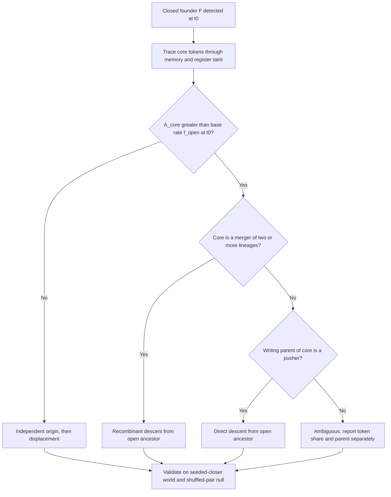

# Heredity before individuality in a Z80 soup: critical literature review for the Nature revision

The open-then-closed sequence you report has already been described in Z80 soups: anecdotally by Agüera y Arcas et al. (2024), and quantitatively over 100 seeds by Cicala et al. (2026, arXiv preprint). Your novelty therefore cannot rest on that sequence. It rests on four things nobody else has:
- the operational definition by instruction-pointer confinement, backed by full traces;
- the substrate determinants (a literal-write channel, tar lethality, and the threshold on the dial);
- the regenerator/transmitter dichotomy and its environment-set equilibrium;
- the substrate-level proofs.

## TL;DR
- **Serious novelty threat.** Cicala et al. (arXiv:2607.09211, v2 2 September 2026, not peer-reviewed) report Load–Push replicators dominating Z80 soups and then being replaced by LDIR replicators. They attribute this to a hierarchy of mutational robustness, not to individuality. Their canonical LDIR test genome is your `1e NN ed b0` core. Cite them prominently, and reposition C1/C2 as an explanation and operational definition of a known turnover rather than its discovery.
- **Your strongest contributions are C3, C4/C6 and the theory.** C3 is the substrate determinants, especially the lethality dial; C4/C6 is regenerate versus transmit, with an equilibrium set by the environment. Prior work touches these only tangentially: Cicala's unexecuted "trailing bytes", the protective non-functional head of long-tape Forth replicators, and BFF "zero-poisoning".
- **Tonight.**
  - Experiment A: the decisive controls are intruder-free mutation accumulation and detoxified-versus-sham knockouts. The closest prior art is Core War's DAT bombs and imp gates, not biology.
  - Experiment B: provenance must pass through registers (taint tracking). A descent verdict must beat the base rate of open-lineage material in the soup when each closer is born.

## 1. Executive summary: ten things you may not know

1. **The Z80 open-then-closed turnover is already in print twice.**
   - Agüera y Arcas et al. (2024): a "wave of stack based self-replicators" is followed by LDIR/LDDR copiers.\[1\]
   - Cicala et al. (2026): Load–Push → LDIR turnover quantified over 100 seeds at 32 bytes. When LDIR is blocked, slower LDD-loop replicators appear instead.\[2\]
2. **Cicala et al. offer a rival mechanism for C2: robustness, not closure.**
   - Their test ranks LDIR > LDD > Load–Push after 1, 4 and 8 successive one-byte mutations (n = 100 per group). They report bars only, with no percentages in the text.\[2\]
   - They say the transition persists without task pressure.\[2\]
   - Expect reviewers to ask why "closure" adds anything beyond "more robust replicators win".
3. **Your C5 core is their reference genome.**
   - Cicala et al. test `[0x1E, 0x20, 0xED, 0xB0]` padded with 28 random bytes. They state that the trailing region "does not affect replication".\[2\]
   - They never treat the first byte as an offset switch, and never derive the d − 4 count. Proposition 8 survives as analysis, not as discovery of the motif.
4. **The 8080 result clashes with the 2024 paper.** Agüera y Arcas et al. report the 8080 only "in the long-tape setting" (§3.3). There they found only two-byte repeated non-looping replicators such as `01 c5`, and "never seen a looping variant emerge in 8080". Your 20/20 open-then-closed result comes from a paired-tape soup, so state the difference in setting explicitly.
5. **The reviewer's 8080 opcode claim matches the standard opcode table.**
   - CB is an alternative JMP, D9 an alternative RET, and DD, ED and FD alternative CALLs. The bytes 08/10/18/20/28/30/38 are alternative NOPs.\[3\]\[4\]
   - An "8080-like subset" that decodes ED/CB/DD/FD as NOPs or traps is not an 8080. Either decode them faithfully or rename the ablation.
6. **Protective non-functional code has precedent.** In long-tape Forth (2024, §3.1.2), evolved replicators carry "a fairly long non-functional head followed by a relatively short functional replicating tail". In their example the tail is the last 7 instructions. The authors explain the head as protection against execution starting mid-replicator, traded off against copy efficiency. This is the closest published analogue to your C6 census and to Experiment A.
7. **BFF already has "lethal tar".** The first BFF replicator could copy zeros but not overwrite them, "which leads to zeros multiplying in the soup". The Fig. 2 annotation records "~14% of the soup are zeros" during this "zero-poisoning". A replicator with a structure "that can overwrite zeros" then took over. Frame lethal tar as a controlled, dialled version of this.
8. **"Digital primordial soup" is taken.** It is the title phrase of Cicala et al. (2026).\[5\]\[6\] Our search found no prior thesis titled "heredity before individuality", but the search was not exhaustive.
9. **Use "scaffolded reproducer", and avoid "closure".**
   - Godfrey-Smith's "scaffolded reproducers" (reproduced by machinery outside themselves) fits your pushers better than "non-individuals".
   - "Closure" has a technical meaning (closure of constraints) that pointer confinement does not satisfy.
10. **Random search may find replicators faster than interaction.** Knierim et al. (2026, arXiv:2607.01483, not peer-reviewed) find that in BFF, random-walk mutation finds self-replicators faster than paired interaction. Capping compositional "mergers" stops takeover but not emergence.\[7\] Expect the objection that "open first" simply reflects how easy pushers are to find.

## 2. Novelty threats, ranked

### Serious

**S1. Cicala et al. 2026, arXiv:2607.09211 [full text read; not peer-reviewed]. Threatens C1 and C2; partly C4 and C5.**
- **Overlap.**
  - Random 32-byte Z80 programs on 2D grids, executed in pairs over a 64-byte memory.\[2\]\[8\]
  - Load–Push replicators (for example `01 C5 01 C5`) appear first and "consume the entire 32-byte tape". LDIR replicators "reliably took over later" (§2.3).\[2\]
  - Their explanation: "The transition is intrinsically driven by differences in mutational robustness among the replicators" (§2.3).\[9\]
- **Differences that leave you room.**
  - They classify by byte-pattern matching, not traced execution, and say the list is "not an exhaustive list… nor a perfect search" (§4.4).\[2\]
  - Their ancestor-contribution matrix tracks niche of origin, not replicator type (§4.7, G = 2,000 seeds).\[2\] They make no claim either that LDIR descends from Load–Push or that it arises independently.
  - They note that "most of the dominant replicators we manually inspected reproduced asexually", and that "accidental recombination may have played a role".\[2\]
  - Their conventions differ from yours:
    - SP, A and F = 0xFF; HL, BC and E = 0; D = 0 during interaction (§4.1).\[2\]
    - A budget of 512 instructions, mutation at 1/64 per program per epoch, and 10⁶ epochs.\[2\]
  - Their text is internally inconsistent on BC. §4.4 says BC = 32, but their test replicator relies on BC = 0, which LDIR treats as 2¹⁶ iterations.\[2\]
- **How to answer.**
  - Concede the turnover.
  - Claim what they lack: (i) a trace-based definition (100/100 and 89/89); (ii) substrate contingency of the beginning (C3), since they never vary lethality or literal channels; (iii) the regenerator/transmitter split and its environment dependence (C6); (iv) descent analysis (Experiment B).
  - Run their robustness protocol on your classes, and test whether confinement predicts takeover after conditioning on robustness.

**S2. Agüera y Arcas et al. 2024, arXiv:2406.19108 [full text read; preprint]. Threatens C1 and C2; partly C3.**
- **Z80 results (§3.3).**
  - Setup: 16-byte programs, 256 steps, random AB/BA order.\[1\]
  - Stack copiers come first, because SP sits at the end of the address space and lets tape A write into tape B. Then "more robust self-replicators that use memory copy instructions" take over.\[1\]
- **Long-tape BFF (§2.4).** If the heads start at the PC, trivial non-looping replicators take over. The authors report, "anecdotally", that looping replicators need a head offset "somewhat larger than 8 to work (e.g., 12 or 16)". This is a substrate parameter that decides whether the beginning is looping or non-looping, a partial precedent for C3.
- **How to answer.** Their account is anecdotal, with no counts and no traces. They write only that "Most of the time" a stack-based ecosystem "eventually gets replaced" by LDIR/LDDR copiers. Present yours as the systematic, causal version, and reconcile the 8080 result.

### Partial

- **P1. Long-tape Forth's non-functional head (2024, §3.1.2).** Threatens C6 and Experiment A. Theirs protects against the owner's own random entry points;\[1\] yours concerns other organisms' execution under a lethal opcode. Cite it as the nearest precedent.
- **P2. BFF zero-poisoning (2024, Fig. 2).** Threatens C3. You add the dial and the open/closed outcome; cite it as motivation.
- **P3. Knierim et al. 2026 [full text read in part; not peer-reviewed].**
  - Their detector chains five executions against noise partners, keeps bytes that match in at least 3 of 9 runs, and declares a replicator at a score of 48 of 64. They call this threshold "somewhat arbitrary", with results stable above about 20.\[7\]
  - They note that "some self-replicators copy their functionality and most of their bytes but have some non-executed bytes".\[7\]
  - Action: benchmark your culture test against their detector, and add a random-walk baseline.
- **P4. Rasmussen et al. 1990, Coreworld [cited secondhand, via Agüera y Arcas et al. 2024 §1].** That summary says two-instruction MOV–SPL replicators "often take over". A seeded, more complex replicator fails to take over and goes extinct through mutations caused by its own copy mechanism. These replicators are plausibly "open". Read the original before citing specifics.
- **P5. Greenbaum & Pargellis 2017, Amoeba [abstract only].** A self-organisation phase (a biased opcode basis set, propagated building blocks) precedes replicators.\[10\] It is precedent for a pre-replicator stage.
- **P6. C G, LaBar, Hintze & Adami 2017 [abstract only].** Random Avida genomes contain rare replicators (6 in 10⁹ at L = 8).\[11\]\[12\] Evolvability depends on genomic architecture.\[13\] Relevant to C4 and to the base-rate reasoning in Experiment B.
- **P7. Hickinbotham, Stepney & Hogeweg 2021, Stringmol [abstract only].** Replicators co-evolve anti-parasite strategies that slow replication.\[14\]\[15\] Relevant to Experiment A.

### None or minimal
- **Tierra and Avida.** Both are seeded, but their parasites are the conceptual ancestors of your intruding executors.\[1\]
- **AlChemy, Fontana & Buss, and the Kruszewski & Mikolov combinator chemistry.** No template-copy overlap.
- **Not checked this session:** Nanopond, the original Stringmol origin papers, and RISC-V/SUBLEQ soup follow-ups from 2024–2026.

## 3. Must-cite list (ranked)

1. **Cicala et al. 2026**: same substrate, same turnover, robustness explanation. Omitting it would be fatal.
2. **Agüera y Arcas et al. 2024**: the BFF/Z80/8080 origin of this line, plus zero-poisoning, the long-tape looping threshold and protective Forth heads.
3. **Knierim et al. 2026**: the detector, the random-walk baseline and non-executed retained bytes.
4. **Godfrey-Smith 2009**: scaffolded reproducers and marginal Darwinian populations, the right vocabulary for C1.
5. **Woese 2002; Vetsigian, Woese & Goldenfeld 2006**: communal evolution before individuals, the best theoretical anchor.
6. **Maynard Smith & Szathmáry 1995**: the frame of major transitions.
7. **Krakauer et al. 2020**: a computable measure of individuality.\[16\]
8. **Lenski et al. 2003 (Nature)**: the template for knockouts and line-of-descent analysis.
9. **Wilke et al. 2001 (Nature)**: survival of the flattest, the frame for C4/C6.
10. **Zaman et al. 2014**: host–parasite coevolution in Avida, for Experiment A.\[17\]
11. **Montévil & Mossio 2015; Moreno & Mossio 2015**: what "closure" means.
12. **Rasmussen et al. 1990**: Coreworld.
13. **Greenbaum & Pargellis 2017; Pargellis 1996**: Amoeba.
14. **C G et al. 2017**: base rates of random replicators.
15. **Takeuchi, Hogeweg & Kaneko 2017**: genome-like versus catalyst-like symmetry breaking, a chemical analogue for C4.\[18\]
16. **Hickinbotham, Stepney & Hogeweg 2021**: parasitism shaping replication strategies.\[14\]
17. **Boerlijst & Hogeweg 1991; Takeuchi & Hogeweg 2008**: spatial rescue from parasites.
18. **Szathmáry & Demeter 1987; Eigen 1971**: the stochastic corrector and the error threshold.
19. **Hsu 1975**: the bodyguard hypothesis.\[19\]
20. **Dewdney 1984; Kumar et al. 2026**: Core War imps, DAT bombs, and evolution with LLMs.
21. **Moreno, Dolson & Ofria 2022; Dolson et al. 2024**: genealogy tooling.\[20\]
22. **Young, *The Undocumented Z80 Documented***: LDIR semantics.\[21\]
23. **Fine & Wilf 1965**: periodicity.
24. **Vasas, Szathmáry & Santos 2010**: limits on heredity in autocatalytic sets.
25. **Orgel & Crick 1980; Doolittle & Sapienza 1980**: selfish DNA, the rival to payload-as-defence.

## 4. Findings by workstream

### W1. Novelty threats and closest prior work

Columns: (a) neighbour-dependence first; (b) open→closed transition; (c) repair vs transmission; (d) environment-dependent selection; (e) functional unexecuted payload.

| System | (a) | (b) | (c) | (d) | (e) | Threat |
|---|---|---|---|---|---|---|
| Cicala 2026 (Z80) | Yes, Load–Push | Yes; LDD when LDIR is blocked | Implicit (trailing bytes) | Task pressure only | No | Serious |
| Agüera y Arcas 2024 | Z80 stack copiers | Z80 anecdote; BFF head offset | No | Zero-poisoning | Forth head | Serious/partial |
| Knierim 2026 (BFF) | n/a | No | Non-executed bytes noted | No | No | Partial |
| Coreworld 1990 | Likely | Not reported | No | Energy | No | Partial |
| Amoeba 1996/2017 | Not reported | No | No | Entropy injection | No | Partial |
| Avida origin 2017 | No | No | Architecture-dependent evolvability | No | No | Minimal |
| Stringmol 2021 | Parasites | No | Anti-parasite strategies | Yes | Not reported | Partial (A) |

Knierim et al., from the same group, partly walk back the 2024 claim that interaction is a powerful search operator.\[7\] That helps you: it moves the scientific interest from the moment of emergence to the ecology after it, which is where C2–C6 sit.

### W2. Individuality theory and its order relative to heredity

**Predict heredity before individuality.**
- **Woese 2002; Vetsigian, Woese & Goldenfeld 2006** [from memory; verify]. Before the "Darwinian threshold", evolution was communal and dominated by horizontal transfer, without stable lineages. Open pushers that need a partner and blur lineages are a digital instance.
- **Maynard Smith & Szathmáry; the stochastic corrector** [from memory]. Heredity of replicators precedes their integration into higher-level individuals. But in this tradition the earliest units are themselves replicators, so it would call your pushers replicators too.

**Predict or presuppose the reverse.**
- **Autopoiesis, closure of constraints (Moreno & Mossio; Montévil & Mossio), and Gánti's chemoton** [from memory]. Organisational closure comes first and heredity is added later. On these views your pushers are not candidates for life, and your "closed" replicators are not closed either: they maintain no constraints, and the environment supplies their registers and memory.
- **Vasas, Szathmáry & Santos 2010** [from memory]. Autocatalytic sets have only limited heredity.

**Would call open replicators Darwinian but not individuals.**
- **Godfrey-Smith 2009** [from memory]. His categories are simple, collective and scaffolded reproducers; populations of scaffolded reproducers are "marginal" Darwinian populations. Your pushers are scaffolded reproducers, and their scaffold is the partner's half of memory.
- **Clarke; Pradeu** [from memory]. Individuality criteria depend on purpose, which justifies an operational, evolutionary criterion.
- **Michod 1999** [from memory]. No new level of organisation forms here, so avoid "transition in individuality".

**Is pointer confinement a defensible analogue of closure?** As an operational boundary on causal influence during reproduction, yes. As organisational closure, no.
- **Avoid:** "closure" unqualified, "autonomy", "autopoietic", "organism".
- **Use:** "self-contained execution", "execution-confined", "scaffolded vs self-contained reproducer".

**A computable measure in the spirit of Krakauer et al. (2020) [abstract only]:**
1. Let S_t be the executing tape A, E_t the partner B, and S_{t+1} the offspring (the written half B).
2. Sample E_t from the empirical soup at the focal time, with at least 10⁴ encounters per genotype class.
3. Execution is deterministic, so H(S_{t+1}|S_t, E_t) = 0 and the total information equals H(S_{t+1}).
4. Split I(S_{t+1}; S_t, E_t) with a partial information decomposition (Bertschinger et al. 2014) into four parts: unique to self, unique to partner, redundant and synergistic.\[22\] Estimate per byte column with bias correction.
5. Predictions:
   - Pushers: dominated by partner-unique and synergistic information.
   - Regenerators: dominated by self-unique information.
   - Transmitters: intermediate in the payload columns.

This turns Lemma 7 into a graded individuality index.

### W3. Prebiotic chemistry analogues

- **Replication in trans.** In RNA-world models, template replication happens in trans, which makes it altruistic and exploitable by parasites (Colizzi & Hogeweg 2016) [snippet read].\[23\] Your pushers are the inverse case: they need the partner's memory as substrate, not its catalysis. Say so explicitly.
- **Spatial rescue.** Boerlijst & Hogeweg (1991) and Takeuchi & Hogeweg (2008) [secondhand]: travelling waves and spirals rescue replicators from parasites.\[23\]\[24\] Run a well-mixed control. If the open-then-closed sequence changes without space, the claim is about spatial ecology.
- **Symmetry breaking.** Takeuchi, Hogeweg & Kaneko (2017) [abstract only]: complementary strands split into a catalytic strand and a genome-like strand, driven by conflicting multilevel evolution.\[18\]\[25\] This is a chemical analogue of executed versus transmitted-but-unexecuted bytes (C4).
- **Laboratory replicators.**
  - Mizuuchi et al. (2022) [abstract only]: an RNA replicating through a self-encoded replicase evolves into a host–parasite network.\[24\]\[26\]
  - Spiegelman's Qβ (1965) [secondhand]: replication shrinks to a minimal template.
  - Cross-replicating ribozymes (Lincoln & Joyce 2009) [from memory; verify]: a sustained, heritable partner-dependent system.
  - A reviewer from origin-of-life research may point to these and say partner-dependence is not inferior. The answer: cross-replicators are mutually dependent pairs with joint heredity, whereas pushers use the partner as passive substrate.
- **Net reading.** Partner-dependent or enzyme-dependent copying is the norm in chemistry, and autonomous self-replication from scratch has not been demonstrated. The chemistry is therefore consistent with C1 by analogy, but it supplies no theorem.

### W4. Analogues for the toxic payload (Experiment A)

- **Core War [from memory].** The imp (`MOV 0, 1`) copies itself one cell ahead and runs into the copy: it is an open pusher. A DAT instruction kills any process that executes it. DAT bombs and imp gates are memory the owner never runs but that kills foreign processes. This is the closest prior art for Experiment A.
  - LLM-driven evolution of warriors: Kumar et al. (2026, arXiv:2601.03335) [abstract only]; it converges on a general-purpose strategy.\[27\]
  - Contrast: those warriors are designed or selected under explicit fitness, while yours would arise without a fitness function.
- **Bodyguard hypothesis.** Hsu (1975) [secondhand]: peripheral heterochromatin shields euchromatin from mutagens.\[19\]\[28\] Hsu's mechanism is passive absorption, yours is active lethality, so treat it as an analogy.\[29\]
- **Selfish DNA [from memory].** The rival framework: payload bytes may hitchhike in an exact copier rather than defend it. The decisive test is whether zero content responds to the presence of intruders, with mutation and tar held constant.
- **Superinfection exclusion; restriction–modification [from memory].** The resident blocks a second genome, and the benefit scales with encounter rate. Self-immunity is automatic in your system, because the owner's pointer never reaches its own payload.
- **Bacteriocins and spite [from memory].** Kerr et al. (2002, Nature): colicin producers, resistants and sensitives coexist on plates but not in flasks. Predictions: the toxic advantage is larger on the lattice than well-mixed, and it is frequency-dependent.
- **Make–accumulate–consume [from memory].** Yeast's ethanol is a by-product turned weapon, just as tar would become defence.
- **Extended phenotype (Dawkins 1982).** A phenotype expressed in another organism's execution is a textbook case.
- **Digital host–parasite systems.** Zaman et al. (2014) [abstract only]: coevolution with parasites produced more complex host traits.\[30\] Their key control was paired runs with and without parasites.\[31\]\[32\] Copy that design.

**Predictions to test tonight:**
- The payload advantage rises with intruder frequency.
- Zeros sit where intruder pointers actually arrive. Under fall-through, an intruder from A enters B at offset 0, which is B's code, not its payload. Measure entry points first.
- The effect is monotone in p, with an inflection near 0.1–0.3.
- The cost to the owner is zero.
- Intruders evolve to jump over zeros only when zeros are toxic.

### W5. Genealogy and causal methods (Experiment B)

- **Line of descent and knockouts.** Lenski et al. (2003) [from memory] traced the line of descent and knocked out mutations. Do the analogue: trace each closer founder back, then ask whether open-lineage bytes in its core were required.
- **Tracer tokens.** Agüera y Arcas et al. tag every byte with (epoch, position, char). Copy operations carry the tags, and mutations create new ones. This pinpointed the first BFF replicator, which emerged in "a complex rewrite event" from bytes mostly copied from another tape.\[1\]
  - The Z80 needs more: copies pass through registers (LD E,(HL); PUSH BC; LDIR). So the record needs **taint tracking**, in which register bytes inherit the token of their source. Immediates inherit the token of the code byte they were fetched from.
  - Without this, pushers' literal writes look like new bytes, and the analysis is biased towards "independent origin".
- **Tooling.**
  - Phylotrack: exact asexual phylogenies.\[20\]
  - Hereditary stratigraphy: approximate and decentralised.\[20\]
  - Moreno, Rodriguez-Papa & Dolson (2025): phylometrics carry signatures of ecology and spatial structure.\[33\]\[34\]
  - Use exact tokens rather than stratigraphy.
- **Recombination.** The "mergers" of Knierim et al. (consecutive copies of bytes not previously copied together, with depth and width) are a ready-made statistic for chimeras.\[7\]
- **Shifted copies.** Proposition 8 copies are shifted by d, so position-wise similarity underestimates relatedness. Tokens remove the problem. Otherwise use similarity at the best cyclic shift.

**Decision rule:**
1. A founder F is the first tape that passes the culture test and is execution-confined. Its core is the set of bytes executed in its traced encounters.
2. A_core is the fraction of core tokens whose ancestry, including register-mediated copies, passes through a pusher-lineage tape.
3. The base rate f_open(t₀) is the pusher-lineage share of all tokens in the soup at the founder's birth.
4. **Descent:** A_core > f_open(t₀) (one-sided permutation test across founders), and the writing parent of the core is a pusher.
5. **Recombinant descent:** the core is a merger of at least two lineages, one of them open.
6. **Independent origin:** A_core ≤ f_open, or the core tokens were born by mutation.

**Null models:**
- Shuffled partners, preserving the spatial schedule.
- The seeded-closer world, where the rule must recover known parentage at ≥95%.
- Base-rate draws from the soup at t₀.

**Pitfalls:**
- Survivorship: include closer origins that die out.
- Base rate: if pushers make up 90% of the soup, almost anything "descends" from them, so only the excess counts.
- Report the number of independent origins per world (C G et al. stress multiple origins).

### W6. The copy-offset switch and the regenerate/transmit trade-off

**Proposition 8 is largely elementary.**
- An overlapping forward copy with destination = source + d replicates the first d bytes periodically. This is the standard Z80 "LDIR fill" idiom, and the reason `memmove` differs from `memcpy`.
- The content is simple periodicity. Fine–Wilf matters only for a two-period statement: a body tiled with period d and then d′ has period gcd(d, d′) once its length is at least d + d′ − gcd(d, d′).
- Frame it as "a known fill idiom, recruited by evolution as a heritable switch". Cite Young: "LDIR is simply LDI + if BC is not 0, decrease PC by 2".\[35\]\[36\]

**A non-trivial theorem within reach: the one-mutation neighbourhood of the switch.**
- In `XX 5e ed b0` with registers zeroed, XX executes first, then LD E,(HL) loads byte 0 = XX, so DE = XX.
- XX keeps the mechanism only if it:
  - is a one-byte opcode;
  - does not change H, L or D;
  - does not transfer control;
  - leaves BC usable (BC = 0 means 2¹⁶ iterations, which "wraps harmlessly" until the budget runs out, according to Cicala et al.).\[2\]
- Enumerating all 256 values of XX gives the offsets reachable in one mutation. It splits them into regenerators (d ≤ 6) and transmitters (d ≥ 9).
- Restricting mutation to byte 0 gives a finite Markov chain. Its stationary distribution is the neutral expectation, against which C6's 0.03–0.37 (benign) and 0.55–0.87 (lethal) measure selection.

**Biological analogues.**
- Survival of the flattest (Wilke et al. 2001) [from memory]: robust, slower genotypes win at high mutation rates. Regenerators are "flat" with respect to mutations in the body.
- Robustness and evolvability (Wagner 2008) [from memory].
- The drift barrier (Lynch) [from memory]: regeneration acts as an anti-mutator for non-core sites.
- The Weismann barrier: transmitters carry an untranslated "germline" payload, while regenerators have no germ/soma split.

**Which theories predict that harshness favours transmitters?**
- Theories of fluctuating environments and stress-induced evolvability [from memory].
- Your census mechanism (junk protects against hijacking).
- The toxic payload.

Constant-environment robustness theory predicts the opposite at high mutational load. Present C6 as a test between them.

### W7. Theory to make claims rigorous
See Section 7.

### W8. Critiques of digital-soup claims and how successful papers answered them

**Standard objections:**
- a toy substrate;
- ad hoc replication criteria;
- dependence on conventions (registers, wrap-around, instruction budget);
- generality across instruction sets;
- the gap from digital to chemical life;
- "it is just the shortest program".

**Published responses:**
- Agüera y Arcas et al. test generality across BFF, Forth, Z80 and 8080, and bound it with the SUBLEQ counterexample.\[1\]\[37\]\[38\]
- Cicala et al. use many seeds (100 per condition; 2,000 for ancestry) and a control that blocks LDIR.\[2\]
- Lenski et al. (2003) answered "toy" objections with mechanism: knockouts and line-of-descent histories that read like genetics.
- In Wilke et al. (2001) and Blount, Borland & Lenski (2008), the first paragraph opens with a general biological question before introducing the system [paraphrase from memory; verify].

Open your paper with "Must the first evolvers be individuals?", citing Woese and Godfrey-Smith, and only then introduce the Z80.

### W9. Technical facts reviewers will check

- **8080 decoding.**
  - The pastraiser 8080 table lists CB as \*JMP a16, D9 as \*RET, and DD/ED/FD as \*CALL a16, with 08–38 (step 8) as \*NOP.\[3\] It adds that "All instructions marked by "*" are only alternative opcodes for existing instructions" [full text read; secondary].\[3\]
  - A classiccmp post reports undocumented 8080 opcodes as "by and large, no-ops or redundancies" [informal].\[39\]
  - **Not verified against an Intel datasheet.** Cite the Intel 8080 Microcomputer Systems User's Manual, or test on a cycle-accurate emulator.
  - Consequence: on a real 8080, ED is a 3-byte CALL that consumes `b0` and the next byte as an address. Report how your ablation decodes these seven bytes.
- **LDIR (Young v0.91) [snippets read].**
  - LDIR is LDI followed by PC −= 2 while BC ≠ 0.\[21\]
  - Interrupts are accepted between iterations, and R increases by 2 per iteration.\[21\]\[36\]
  - YF/XF come from bits 1 and 3 of (copied byte + A); PF = (BC ≠ 0); SF, ZF and CF are unchanged; HF is reset.\[36\]
  - **Critical:** if each repetition counts as one instruction, a 128-instruction budget limits one LDIR to about 125 bytes. That interacts with BC, with Proposition 8's tiling length, and with Theorem 2 (an LDIR re-fetches its own address). State how you count.
  - The YF/XF behaviour of an interrupted LDIR (taken from PC bits) is documented by emulator authors [secondary].\[40\] It is irrelevant if you raise no interrupts; say so.
- **Overlap.** On hardware, LDIR copies byte by byte in ascending order, so a forward overlap produces a periodic fill. This is consistent with Young.
- **R register.** If evolved code reads R, report whether R is zeroed with the other registers.

### W10. Positioning and Nature practicalities

**What each community needs:**
- **Origin of life:** a chemical reading of the "literal-write channel" and of "lethal by-products".
- **Transitions:** the Woese/Godfrey-Smith framing and a graded measure.
- **ALife:** the explicit delta over the 2024 and 2026 papers.
- **Philosophy of biology:** careful terms.

**Nature policies [full text read in part]:**
- Extended Data: "A maximum of ten Extended Data display items (figures and tables) is typically permitted". Supplementary Information should contain no figures.\[41\]
- Length, according to Nature's own formatting guide: a typical 6-page Article contains about 2,500 words and a typical 8-page Article about 4,300. Physical-sciences papers do not normally exceed 6 pages and biological papers 8. Methods typically do not exceed 3,000 words; that is a Methods guideline, not a main-text limit.
- Code: a "Code availability" statement is required.\[42\]\[43\]
- Code Ocean: a Nature Geoscience editorial states that authors "submitting primary research articles to any Nature Portfolio journal can share their code for peer review" through Code Ocean. Reviewers get confidential access, and the capsule is published with the paper.\[44\]\[45\]
- For round two, deposit a frozen capsule that regenerates every figure.

## 5. Reviewer attack surface

1. **"Shown before."** Concede the turnover. Counter with traces, C3, C4–C6, Experiment B and the theory.
2. **"Closure is just robustness."** Run the Cicala protocol on your classes, then regress takeover on confinement plus robustness. If confinement adds nothing, reframe C2 as "robustness selects confined replicators".
3. **"Open first is search ease."** Give base rates from random sampling and random walks for pushers versus closers. C3 helps: lethal tar changes the beginning without changing which programs exist.
4. **"Confinement is not individuality."** Concede the terminology, adopt "scaffolded reproducer", and add the information measure.
5. **"Conventions drive it."** C7 partly answers this. Add a budget sweep (64/128/256/512) and a no-wrap control. Note that the same turnover appears at SP = 0xFF with budget 512 (Cicala) and with 256 steps (Agüera y Arcas).\[1\]\[2\]
6. **"Your 8080 is not an 8080."** Fix the decoding and reconcile with the 2024 long-tape result.
7. **"Space, not substrate."** Add a well-mixed control.
8. **"A threshold of 0.3 is arbitrary."** Sweep 0.1–0.7 and report agreement with the Knierim detector, whose own threshold is "somewhat arbitrary".\[7\]
9. **"The theorems are trivial."** Concede that Theorem 2 is a pigeonhole argument. Add the offset-neighbourhood theorem and the neutral stationary distribution.
10. **"C6 is unexplained."** Report the failed pre-registered explanation honestly, and present Experiment A with a falsification criterion. Keep the toxic payload out of the abstract unless the knockouts succeed.

## 6. Recommendations for tonight's experiments

### Experiment A: the toxic payload

**Controls:**
1. **Intruder-free mutation accumulation (key).** Culture transmitters serially into partners whose pointer can never enter the transmitter. Keep the same mutation rate and tar. Equal accumulation of zeros supports the damage rival.
2. **Detoxified versus sham.**
   - Detoxified: every payload zero becomes a random non-halting non-zero byte.
   - Sham: the same number of random non-zero payload bytes are replaced.
   - Assays:
     - Encounter assays: survival of the transmitter's body per intrusion.
     - Population competitions from 50:50 and from 1%, with at least 20 worlds per arm.
3. **Halt substitution.** Under benign tar, replace payload zeros with 0x76 (HALT). If protection returns, the mechanism is "halt the intruder", not zero itself.
4. **Regenerator comparator.** A regenerator's junk is rewritten every generation, which makes it a neutral reference inside the same world.

**Statistics:**
- **Enrichment:** mixed model, zero ~ condition × p + (1|world), with a pre-specified odds ratio of at least 1.5 against the intruder-free control.
- **Dose-response:** isotonic or logistic fit over p ∈ {0, 0.05, 0.1, 0.2, 0.3, 0.5, 1}.
- **Position:** histogram intruder entry and first-touch offsets. Test zero enrichment at the payload offsets actually reached against a within-payload permutation null.
- **Frequency dependence:** initial pusher density of 1%, 10% and 50%.

**Decision:**
- Accept "defence" only if three things hold: enrichment exceeds the intruder-free control; detoxified falls below sham in both assays; and the effect scales with p.
- Accept "damage" if the intruder-free control matches.

### Experiment B: genealogy

- Implement per-byte provenance with register taint. Validate on the seeded-closer world (≥95% recovery) and on shuffled pairs (A_core should collapse to f_open).
- Report for each world:
  - the number of independent closer origins;
  - A_core against f_open(t₀);
  - the class of the writing parent;
  - merger status;
  - the fate of each origin.
- Decision: "descent" requires A_core > f_open at p < 0.05 (one-sided, Holm-corrected) and a pusher as writing parent. Give each category's share with a Wilson interval.
- **Prediction from the literature:** mixed outcomes, with many closers assembled from open-lineage material by rewrite events. This follows from the 2024 tracer case, where the first replicator emerged in "a complex rewrite event", and from Cicala's note on possible accidental recombination.\[1\]\[2\]

## 7. Theory leads

1. **Theorem 2, restated.**
   - *Statement:* a deterministic machine making k opcode fetches, all at addresses in a set of size m, fetches some address twice if k > m. This is a pigeonhole argument.
   - *Assumptions to check:* no early halt (lethal tar, 0x76, budget); opcode addresses, not operand bytes; LDIR repetitions counted as fetches.
   - *What it does not give:* a cycle of the full machine state.
   - *Strengthening:* if the confined code bytes are not modified during the encounter, a repeat of (PC, registers, flags) implies exact periodicity, which you can detect in traces.
2. **Offset-neighbourhood theorem (new).** An exact characterisation of which XX preserve `XX 5e ed b0` and the d each induces.
3. **Neutral stationary distribution.** For the chain on viable XX under byte-0 mutation, the stationary distribution is the neutral prediction for C6.
4. **Proposition 8 via periodicity.** w[i] = w[i mod d] over the copied length, and the d − 4 count follows. Cite Fine & Wilf only if you prove the two-offset result.
5. **Kleene's recursion theorem** [from memory]. For a total computable f there is an e with φ_e = φ_{f(e)}, so replicators exist in any acceptable programming system. That is an existence result, and a bounded 128-step Z80 is not an acceptable numbering, so use it as motivation only.
6. **Von Neumann's constructor** [from memory]. The description is used both interpreted and uninterpreted. Transmitted sites, copied but never executed, are exactly the uninterpreted use. Regenerators lack it.
7. **Information bounds** [from memory].
   - Eigen's threshold: a sequence of length ν persists only if ν < ln σ/(1 − q). This bounds the maintainable payload by per-site copy fidelity; test it.
   - Adami's per-site information: it should be high at core sites, zero at regenerator junk, and present in the transmitter payload only under selection. That gives a direct readout for Experiment A.

## 8. Framing and titles

**Framing.**
- Lead with the biological question: do the first evolvers have to be individuals? Cite Woese and Godfrey-Smith.
- Present the turnover as known (2024; 2026).
- State your contribution: when the turnover happens (C3), what self-containment buys (C4–C6), and whether closers descend from open replicators (Experiment B).
- Avoid "closure", binary "individuality", "first life", and "digital primordial soup" as if you coined it.

**Titles (at most 75 characters):**
1. "Neighbour-dependent copying precedes self-contained replication in code" (71)
2. "Machine-code replicators begin open and become self-confined" (60)
3. "Heritable copying before self-contained replicators in a Z80 soup" (65)
4. "Toxic by-products decide whether replication starts open or closed" (66)
5. "Substrate chemistry sets how digital replicators begin" (54)

Option 1 is the safest. Option 4 suits a paper centred on C3.

## 9. Caveats

- Classical references marked "from memory" were not verified this session; check their DOIs.
- The 8080 opcode facts come from a secondary table, not an Intel datasheet.
- The Cicala and Knierim papers are 2026 preprints. Cicala v2 differs from v1: the epoch count for the LDD no-task run changed from 10⁶ to 10⁷, and v1's caveat about "predefined computational semantics" was dropped.\[2\]\[9\] Cite the version you read.
- Nanopond, the original Stringmol papers, Fontana & Buss, and RISC-V/SUBLEQ follow-ups were not checked.

## Bibliography (Nature style)

1. Agüera y Arcas, B. et al. Computational life: how well-formed, self-replicating programs emerge from simple interaction. Preprint at https://arxiv.org/abs/2406.19108 (2024). [full text read]
2. Cicala, F. et al. Co-evolution of self-replication and function in a digital primordial soup. Preprint at https://arxiv.org/abs/2607.09211 (2026). [full text read]
3. Knierim, C. et al. BFF: simple explanations for complex phenomena. Preprint at https://arxiv.org/abs/2607.01483 (2026). [full text read, in part]
4. Rasmussen, S., Knudsen, C., Feldberg, R. & Hindsholm, M. The coreworld. *Physica D* **42**, 111–134 (1990). https://doi.org/10.1016/0167-2789(90)90070-6 [cited secondhand]
5. Pargellis, A. N. The evolution of self-replicating computer organisms. *Physica D* **98**, 111–127 (1996). [cited secondhand]
6. Greenbaum, B. & Pargellis, A. N. Self-replicators emerge from a self-organizing prebiotic computer world. *Artif. Life* **23**, 318–342 (2017). https://doi.org/10.1162/ARTL_a_00234 [abstract only]
7. C G, N., LaBar, T., Hintze, A. & Adami, C. Origin of life in a digital microcosm. *Phil. Trans. R. Soc. A* **375**, 20160350 (2017). https://doi.org/10.1098/rsta.2016.0350 [abstract only]
8. Ray, T. S. An approach to the synthesis of life. In *Artificial Life II* 371–408 (1991). [cited secondhand]
9. Ofria, C. & Wilke, C. O. Avida. *Artif. Life* **10**, 191–229 (2004). [cited secondhand]
10. Fontana, W. Algorithmic chemistry. In *Artificial Life II* (1990). [cited secondhand]
11. Kruszewski, G. & Mikolov, T. Emergence of self-reproducing metabolisms as recursive algorithms in an artificial chemistry. *Artif. Life* **27**, 277–299 (2022). [cited secondhand]
12. Hickinbotham, S. J., Stepney, S. & Hogeweg, P. Nothing in evolution makes sense except in the light of parasitism. *R. Soc. Open Sci.* **8**, 210441 (2021). https://doi.org/10.1098/rsos.210441 [abstract only]
13. Takeuchi, N., Hogeweg, P. & Kaneko, K. The origin of a primordial genome through spontaneous symmetry breaking. *Nat. Commun.* **8**, 250 (2017). https://doi.org/10.1038/s41467-017-00243-x [abstract only]
14. Takeuchi, N. & Hogeweg, P. Evolution of complexity in RNA-like replicator systems. *Biol. Direct* **3**, 11 (2008). https://doi.org/10.1186/1745-6150-3-11 [cited secondhand]
15. Mizuuchi, R., Furubayashi, T. & Ichihashi, N. Evolutionary transition from a single RNA replicator to a multiple replicator network. *Nat. Commun.* (2022). https://doi.org/10.1038/s41467-022-29113-x [abstract only]
16. Colizzi, E. S. & Hogeweg, P. Parasites sustain and enhance RNA-like replicators through spatial self-organisation. *PLoS Comput. Biol.* (2016). PMC4847872 [snippet read; authors from memory]
17. Spiegelman, S. et al. The synthesis of a self-propagating and infectious nucleic acid with a purified enzyme. *Proc. Natl Acad. Sci. USA* **54**, 919–927 (1965). [cited secondhand]
18. Lincoln, T. A. & Joyce, G. F. Self-sustained replication of an RNA enzyme. *Science* **323**, 1229–1232 (2009). [from memory; verify]
19. Krakauer, D., Bertschinger, N., Olbrich, E., Flack, J. C. & Ay, N. The information theory of individuality. *Theory Biosci.* **139**, 209–223 (2020). https://doi.org/10.1007/s12064-020-00313-7 [abstract only]
20. Bertschinger, N., Rauh, J., Olbrich, E., Jost, J. & Ay, N. Quantifying unique information. *Entropy* **16**, 2161–2183 (2014). https://doi.org/10.3390/e16042161 [cited secondhand]
21. Woese, C. R. On the evolution of cells. *Proc. Natl Acad. Sci. USA* **99**, 8742–8747 (2002). [from memory; verify]
22. Vetsigian, K., Woese, C. & Goldenfeld, N. Collective evolution and the genetic code. *Proc. Natl Acad. Sci. USA* **103**, 10696–10701 (2006). [from memory; verify]
23. Godfrey-Smith, P. *Darwinian Populations and Natural Selection* (Oxford Univ. Press, 2009). [from memory]
24. Maynard Smith, J. & Szathmáry, E. *The Major Transitions in Evolution* (Freeman, 1995). [from memory]
25. Michod, R. E. *Darwinian Dynamics* (Princeton Univ. Press, 1999). [from memory]
26. Moreno, A. & Mossio, M. *Biological Autonomy* (Springer, 2015). [from memory]
27. Montévil, M. & Mossio, M. Biological organisation as closure of constraints. *J. Theor. Biol.* **372**, 179–191 (2015). [from memory; verify]
28. Szathmáry, E. & Demeter, L. Group selection of early replicators and the origin of life. *J. Theor. Biol.* **128**, 463–486 (1987). [from memory]
29. Vasas, V., Szathmáry, E. & Santos, M. Lack of evolvability in self-sustaining autocatalytic networks. *Proc. Natl Acad. Sci. USA* **107**, 1470–1475 (2010). [from memory]
30. Boerlijst, M. C. & Hogeweg, P. Spiral wave structure in pre-biotic evolution. *Physica D* **48**, 17–28 (1991). [from memory]
31. Lenski, R. E., Ofria, C., Pennock, R. T. & Adami, C. The evolutionary origin of complex features. *Nature* **423**, 139–144 (2003). https://doi.org/10.1038/nature01568 [cited secondhand]
32. Wilke, C. O. et al. Evolution of digital organisms at high mutation rates leads to survival of the flattest. *Nature* **412**, 331–333 (2001). https://doi.org/10.1038/35085569 [from memory]
33. Blount, Z. D., Borland, C. Z. & Lenski, R. E. Historical contingency and the evolution of a key innovation. *Proc. Natl Acad. Sci. USA* **105**, 7899–7906 (2008). https://doi.org/10.1073/pnas.0803151105 [from memory]
34. Zaman, L. et al. Coevolution drives the emergence of complex traits and promotes evolvability. *PLoS Biol.* **12**, e1002023 (2014). https://doi.org/10.1371/journal.pbio.1002023 [abstract only]
35. Hsu, T. C. A possible function of constitutive heterochromatin: the bodyguard hypothesis. *Genetics* **79** (Suppl.), 137–150 (1975). [cited secondhand]
36. Doolittle, W. F. & Sapienza, C. Selfish genes, the phenotype paradigm and genome evolution. *Nature* **284**, 601–603 (1980). [from memory]
37. Orgel, L. E. & Crick, F. H. C. Selfish DNA: the ultimate parasite. *Nature* **284**, 604–607 (1980). [from memory]
38. Kerr, B., Riley, M. A., Feldman, M. W. & Bohannan, B. J. M. Local dispersal promotes biodiversity in a real-life game of rock–paper–scissors. *Nature* **418**, 171–174 (2002). [from memory]
39. Dawkins, R. *The Extended Phenotype* (Oxford Univ. Press, 1982). [from memory]
40. Dewdney, A. K. Computer recreations (Core War). *Sci. Am.* **250**(5) (1984). [from memory; verify]
41. Kumar, A. et al. Digital Red Queen: adversarial program evolution in Core War with LLMs. Preprint at https://arxiv.org/abs/2601.03335 (2026). [abstract only]
42. Moreno, M. A., Dolson, E. & Ofria, C. Hereditary stratigraphy. In *Proc. ALIFE 2022* 64 (2022). https://doi.org/10.1162/isal_a_00550 [abstract only]
43. Dolson, E., Rodriguez-Papa, S. & Moreno, M. A. Phylotrack. *J. Open Source Softw.* (2024). [abstract only]
44. Moreno, M. A., Rodriguez-Papa, S. & Dolson, E. Ecology, spatial structure, and selection pressure induce strong signatures in phylogenetic structure. *Artif. Life* **31**, 129 (2025). https://arxiv.org/abs/2405.07245 [abstract only]
45. Young, S. *The Undocumented Z80 Documented* v0.91 (2005). http://www.myquest.nl/z80undocumented/z80-documented-v0.91.pdf [snippets read]
46. Intel 8080 opcode table. https://pastraiser.com/cpu/i8080/i8080_opcodes.html [full text read; secondary]
47. Fine, N. J. & Wilf, H. S. Uniqueness theorems for periodic functions. *Proc. Am. Math. Soc.* **16**, 109–114 (1965). [from memory]
48. Nature. Formatting guide. https://www.nature.com/nature/for-authors/formatting-guide [full text read, in part]
49. Nature Portfolio. Reporting standards and availability of data, materials, code and protocols. https://www.nature.com/nature-portfolio/editorial-policies/reporting-standards [full text read, in part]
50. Facilitating code peer review. *Nat. Geosci.* (2024). https://doi.org/10.1038/s41561-024-01523-0 [abstract only]

## Sources

1. <https://arxiv.org/pdf/2406.19108>
2. <https://arxiv.org/html/2607.09211v2>
3. [Intel 8080 OPCODES](https://pastraiser.com/cpu/i8080/i8080_opcodes.html)
4. [Undocumented 8080 opcodes](https://groups.google.com/g/comp.os.cpm/c/TV739zw_UOw)
5. [Coevolution of self-replication and function in a digital primordial soup](https://arxiv.org/pdf/2607.09211)
6. [Coevolution of self-replication and function in a digital primordial soup](https://arxiv.org/abs/2607.09211)
7. [BFF: Simple explanations for complex phenomena](https://arxiv.org/html/2607.01483v1)
8. [(PDF) Computational Life: How Well-formed, Self-replicating Programs Emerge from Simple Interaction](https://www.researchgate.net/publication/381770386_Computational_Life_How_Well-formed_Self-replicating_Programs_Emerge_from_Simple_Interaction)
9. [Co-evolution of self-replication and function in a digital primordial soup](https://arxiv.org/html/2607.09211v1)
10. [Self-Replicators Emerge from a Self-Organizing Prebiotic Computer World - PubMed](https://pubmed.ncbi.nlm.nih.gov/28786722)
11. [Origin of life in a digital microcosm - Journals](https://royalsocietypublishing.org/doi/pdf/10.1098/rsta.2016.0350)
12. [Information-Theoretic Considerations Concerning the Origin of Life](https://www.researchgate.net/publication/265295383_Information-Theoretic_Considerations_Concerning_the_Origin_of_Life)
13. [Origin of life in a digital microcosm](https://arxiv.org/pdf/1701.03993)
14. [Nothing in evolution makes sense except in the light of parasitism: evolution of complex replication strategies](https://royalsocietypublishing.org/rsos/article/8/8/210441/96415/Nothing-in-evolution-makes-sense-except-in-the)
15. [evolution of complex replication strategies](https://dspace.library.uu.nl/server/api/core/bitstreams/ad5c6dff-e8f6-4f41-a511-5f399de230ad/content)
16. [What is an individual? Information Theory may provide the answer](https://www.sciencedaily.com/releases/2020/04/200416091951.htm)
17. [Frontiers](https://www.frontiersin.org/journals/ecology-and-evolution/articles/10.3389/fevo.2021.739047/full)
18. [The origin of a primordial genome through spontaneous symmetry breaking](https://www.nature.com/articles/s41467-017-00243-x)
19. [Influence of the Presence of B Chromosomes on DNA Damage in Crepis capillaris](https://journals.plos.org/plosone/article?id=10.1371%2Fjournal.pone.0087337)
20. [(PDF) Phylotrack: C++ and Python libraries for in silico phylogenetic tracking](https://www.researchgate.net/publication/380607583_Phylotrack_C_and_Python_libraries_for_in_silico_phylogenetic_tracking)
21. [The Undocumented Z80 Documented Sean Young Version 0.9, 14th June, 2005](https://cpctech.cpcwiki.de/docs/z80.pdf)
22. [Biological Information](https://arxiv.org/pdf/2010.16193)
23. [Parasites Sustain and Enhance RNA-Like Replicators through Spatial Self-Organisation](https://www.ncbi.nlm.nih.gov/pmc/articles/PMC4847872/)
24. [Plausible pathway for a host-parasite molecular replication network to increase its complexity through Darwinian evolution](https://journals.plos.org/ploscompbiol/article?id=10.1371%2Fjournal.pcbi.1010709)
25. [Conceptualizing the origin of life in terms of evolution](https://royalsocietypublishing.org/rsta/article/375/2109/20160346/58822/Conceptualizing-the-origin-of-life-in-terms-of)
26. [Evolutionary transition from a single RNA replicator to a multiple replicator network](https://www.ncbi.nlm.nih.gov/pmc/articles/PMC8933500/)
27. [Digital Red Queen: Adversarial Program Evolution in Core War with LLMs](https://doi.org/10.1145/3795095.3805116)
28. [Heterochromatin and Heterochromatic Regions](https://www.clinicsearchonline.org/article/heterochromatin-and-heterochromatic-regions)
29. [Protection of the genome and central protein-coding sequences by non-coding DNA against DNA damage from radiation - ScienceDirect](https://www.sciencedirect.com/science/article/abs/pii/S1383574215000253)
30. [(PDF) Coevolution Drives the Emergence of Complex Traits and Promotes Evolvability](https://www.researchgate.net/publication/269767016_Coevolution_Drives_the_Emergence_of_Complex_Traits_and_Promotes_Evolvability)
31. [Coevolution Drives the Emergence of Complex Traits and Promotes Evolvability](https://journals.plos.org/plosbiology/article?id=10.1371%2Fjournal.pbio.1002023)
32. [Frontiersin](https://www.frontiersin.org/journals/ecology-and-evolution/articles/10.3389/fevo.2021.739047/xml)
33. [Ecology, Spatial Structure, and Selection Pressure Induce Strong Signatures in Phylogenetic Structure](https://direct.mit.edu/artl/article/31/2/129/130570/Ecology-Spatial-Structure-and-Selection-Pressure)
34. [Ecology, Spatial Structure, and Selection Pressure Induce Strong Signatures in Phylogenetic Structure](https://arxiv.org/pdf/2405.07245)
35. [The Undocumented Z80 Documented Sean Young Version 0.6, 20th November, 2003](https://raine.1emulation.com/archive/dev/z80-documented.pdf)
36. [The Undocumented Z80 Documented Sean Young Version 0.91, 18th September, 2005](http://www.myquest.nl/z80undocumented/z80-documented-v0.91.pdf)
37. [Computational Life: Emergence of Self-Replicators](https://www.emergentmind.com/papers/2406.19108)
38. [Computational Life: How Well-formed, Self-replicating Programs Emerge from Simple Interaction (arXiv:2406.19108v2) - ScienceStack](https://www.sciencestack.ai/paper/2406.19108)
39. ['Re: Undocumented 8080 instructions?' - MARC](https://marc.info/?l=classiccmp&m=129330052104334)
40. [Undocumented Flags](https://github.com/hoglet67/Z80Decoder/wiki/Undocumented-Flags)
41. [Formatting guide](https://www.nature.com/nature/for-authors/formatting-guide)
42. [Reporting standards and availability of data, materials, code and protocols](https://www.nature.com/nature-portfolio/editorial-policies/reporting-standards)
43. [Submission guidelines](https://www.nature.com/npjoceansustain/for-authors-and-referees/submission-guidelines)
44. [Facilitating code peer review](https://www.nature.com/articles/s41561-024-01523-0)
45. [An ocean of code](https://www.nature.com/articles/s41567-025-02808-w)
