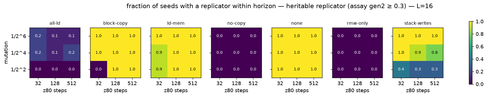
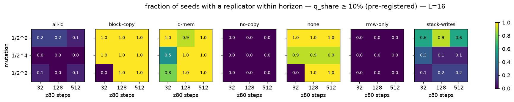

# Instruction-set ablation atlas — results

Batches: runs/stageA. Pre-registration: experiments/PLAN.md. All emergence numbers below use the heritability assay (`t_rep`, gen2 ≥ 0.3) unless marked; the pre-registered occupancy measure (`tq_10`) is in cells.csv.

## Hypothesis verdicts

**H1 (block copy dispensable early):** at 128 steps / 1/16: none 10/10 (median 500), block-copy 10/10 (median 500), ratio 1.00 → supported at the default settings. Exception: at 32 steps / 1/4 block-copy emerges in 0/10 seeds vs none 10/10.

**H2 (stack is the early bottleneck, >10× delay):** at 128 steps / 1/16: stack-writes 9/10, median t_rep 50500 vs 500 (×101.0) → supported; mechanism part: see zoo (LDIR expected).

**H3 (no-copy leaves no replicator):** 0 heritable emergences in 90 no-copy runs across all budgets/mutations → supported.

**H4/H5 (budget strongest; mutation non-monotone), unablated median t_rep (steps × mutation):**

steps   32   128  512
k                    
2     82500 1250  500
4     12250  500 1000
6     10500 1000  500

## Emergence grid — L = 16

| ablation | 32 steps · 1/2^2 | 32 steps · 1/2^4 | 32 steps · 1/2^6 | 128 steps · 1/2^2 | 128 steps · 1/2^4 | 128 steps · 1/2^6 | 512 steps · 1/2^2 | 512 steps · 1/2^4 | 512 steps · 1/2^6 |
|---|---|---|---|---|---|---|---|---|---|
| all-ld | 0/10 (median t_rep –) | 2/10 (median t_rep 48250) | 2/10 (median t_rep 176000) | 0/10 (median t_rep –) | 1/10 (median t_rep 18500) | 1/10 (median t_rep 3500) | 0/10 (median t_rep –) | 2/10 (median t_rep 126250) | 1/10 (median t_rep 133500) |
| block-copy | 0/10 (median t_rep –) | 10/10 (median t_rep 20000) | 10/10 (median t_rep 14250) | 10/10 (median t_rep 1500) | 10/10 (median t_rep 500) | 10/10 (median t_rep 1250) | 10/10 (median t_rep 500) | 10/10 (median t_rep 750) | 10/10 (median t_rep 1500) |
| ld-mem | 9/10 (median t_rep 144500) | 9/10 (median t_rep 102500) | 10/10 (median t_rep 14250) | 10/10 (median t_rep 1000) | 10/10 (median t_rep 1500) | 10/10 (median t_rep 2750) | 10/10 (median t_rep 500) | 10/10 (median t_rep 500) | 10/10 (median t_rep 1500) |
| no-copy | 0/10 (median t_rep –) | 0/10 (median t_rep –) | 0/10 (median t_rep –) | 0/10 (median t_rep –) | 0/10 (median t_rep –) | 0/10 (median t_rep –) | 0/10 (median t_rep –) | 0/10 (median t_rep –) | 0/10 (median t_rep –) |
| none | 10/10 (median t_rep 82500) | 10/10 (median t_rep 12250) | 10/10 (median t_rep 10500) | 10/10 (median t_rep 1250) | 10/10 (median t_rep 500) | 10/10 (median t_rep 1000) | 10/10 (median t_rep 500) | 10/10 (median t_rep 1000) | 10/10 (median t_rep 500) |
| rmw-only | 0/10 (median t_rep –) | 0/10 (median t_rep –) | 0/10 (median t_rep –) | 0/10 (median t_rep –) | 0/10 (median t_rep –) | 0/10 (median t_rep –) | 0/10 (median t_rep –) | 0/10 (median t_rep –) | 0/10 (median t_rep –) |
| stack-writes | 4/10 (median t_rep 71000) | 10/10 (median t_rep 33250) | 10/10 (median t_rep 19500) | 3/10 (median t_rep 26500) | 9/10 (median t_rep 50500) | 10/10 (median t_rep 29500) | 3/10 (median t_rep 35000) | 8/10 (median t_rep 60250) | 10/10 (median t_rep 41500) |

## Succession (census takeover times, final family)

| label        |   tape |   steps |   k |   n | final                   |   stack_takeover_n |   stack_takeover_med |   ldir_takeover_n |   ldir_takeover_med |   ldir_invasion_med_steps |   stack_plateau_med |
|:-------------|-------:|--------:|----:|----:|:------------------------|-------------------:|---------------------:|------------------:|--------------------:|--------------------------:|--------------------:|
| all-ld       |     16 |      32 |   2 |  10 | none:6, ldir:4          |                  1 |                20500 |                 4 |               76750 |                     83000 |                 nan |
| all-ld       |     16 |      32 |   4 |  10 | none:8, ldir:2          |                  1 |                66000 |                 2 |               36250 |                      1500 |                 nan |
| all-ld       |     16 |      32 |   6 |  10 | none:8, ldir:2          |                  0 |                  nan |                 2 |              176500 |                      1250 |                 nan |
| all-ld       |     16 |     128 |   2 |  10 | none:9, ex_sp:1         |                  1 |               257000 |                 1 |              254000 |                       nan |                 nan |
| all-ld       |     16 |     128 |   4 |  10 | none:8, ldir:2          |                  0 |                  nan |                 2 |                9000 |                      2750 |                 nan |
| all-ld       |     16 |     128 |   6 |  10 | none:9, ldir:1          |                  0 |                  nan |                 1 |                1000 |                      2500 |                 nan |
| all-ld       |     16 |     512 |   2 |  10 | none:9, ldir:1          |                  0 |                  nan |                 1 |               53500 |                       nan |                 nan |
| all-ld       |     16 |     512 |   4 |  10 | none:7, ldir:3          |                  0 |                  nan |                 3 |                7500 |                      2500 |                 nan |
| all-ld       |     16 |     512 |   6 |  10 | none:9, ldir:1          |                  0 |                  nan |                 1 |              134000 |                       500 |                 nan |
| block-copy   |     16 |      32 |   2 |  10 | none:10                 |                  0 |                  nan |                 0 |                 nan |                       nan |                 nan |
| block-copy   |     16 |      32 |   4 |  10 | push:9, none:1          |                 10 |                21250 |                 0 |                 nan |                       nan |                   0 |
| block-copy   |     16 |      32 |   6 |  10 | push:10                 |                 10 |                18250 |                 0 |                 nan |                       nan |                   1 |
| block-copy   |     16 |     128 |   2 |  10 | ex_sp:8, none:2         |                 10 |                20250 |                 0 |                 nan |                       nan |                   1 |
| block-copy   |     16 |     128 |   4 |  10 | ex_sp:10                |                 10 |                 7500 |                 0 |                 nan |                       nan |                   0 |
| block-copy   |     16 |     128 |   6 |  10 | push:6, ex_sp:4         |                 10 |                22000 |                 0 |                 nan |                       nan |                   0 |
| block-copy   |     16 |     512 |   2 |  10 | push:10                 |                 10 |                 1500 |                 0 |                 nan |                       nan |                   0 |
| block-copy   |     16 |     512 |   4 |  10 | ex_sp:10                |                 10 |                 1500 |                 0 |                 nan |                       nan |                   1 |
| block-copy   |     16 |     512 |   6 |  10 | push:6, ex_sp:4         |                 10 |                 2250 |                 0 |                 nan |                       nan |                   1 |
| ld-mem       |     16 |      32 |   2 |  10 | ldir:10                 |                  2 |                37500 |                10 |               77250 |                     64500 |                 nan |
| ld-mem       |     16 |      32 |   4 |  10 | ldir:9, none:1          |                  2 |               128750 |                 9 |               98500 |                      1500 |                 nan |
| ld-mem       |     16 |      32 |   6 |  10 | push:9, ldir:1          |                  9 |                21000 |                 1 |                2000 |                      1000 |                   1 |
| ld-mem       |     16 |     128 |   2 |  10 | ldir:8, ex_sp:1, push:1 |                 10 |                 5750 |                 8 |               55500 |                     10000 |                   0 |
| ld-mem       |     16 |     128 |   4 |  10 | ex_sp:9, ldir:1         |                 10 |                 6250 |                 1 |                9000 |                      2000 |                   0 |
| ld-mem       |     16 |     128 |   6 |  10 | ex_sp:6, ldir:4         |                  8 |                15250 |                 4 |               12250 |                      1500 |                   1 |
| ld-mem       |     16 |     512 |   2 |  10 | push:9, ldir:1          |                 10 |                 1500 |                 1 |               81000 |                       nan |                   0 |
| ld-mem       |     16 |     512 |   4 |  10 | ex_sp:10                |                 10 |                 1500 |                 0 |                 nan |                       nan |                   1 |
| ld-mem       |     16 |     512 |   6 |  10 | ex_sp:10                |                 10 |                 3250 |                 0 |                 nan |                       nan |                   0 |
| no-copy      |     16 |      32 |   2 |  10 | none:10                 |                  0 |                  nan |                 0 |                 nan |                       nan |                 nan |
| no-copy      |     16 |      32 |   4 |  10 | none:10                 |                  0 |                  nan |                 0 |                 nan |                       nan |                 nan |
| no-copy      |     16 |      32 |   6 |  10 | none:10                 |                  0 |                  nan |                 0 |                 nan |                       nan |                 nan |
| no-copy      |     16 |     128 |   2 |  10 | none:10                 |                  0 |                  nan |                 0 |                 nan |                       nan |                 nan |
| no-copy      |     16 |     128 |   4 |  10 | none:10                 |                  0 |                  nan |                 0 |                 nan |                       nan |                 nan |
| no-copy      |     16 |     128 |   6 |  10 | none:10                 |                  0 |                  nan |                 0 |                 nan |                       nan |                 nan |
| no-copy      |     16 |     512 |   2 |  10 | none:10                 |                  0 |                  nan |                 0 |                 nan |                       nan |                 nan |
| no-copy      |     16 |     512 |   4 |  10 | none:10                 |                  0 |                  nan |                 0 |                 nan |                       nan |                 nan |
| no-copy      |     16 |     512 |   6 |  10 | none:10                 |                  0 |                  nan |                 0 |                 nan |                       nan |                 nan |
| none         |     16 |      32 |   2 |  10 | ldir:10                 |                  0 |                  nan |                10 |               74250 |                       nan |                 nan |
| none         |     16 |      32 |   4 |  10 | ldir:10                 |                  7 |                12500 |                10 |               56500 |                      2000 |                   0 |
| none         |     16 |      32 |   6 |  10 | push:7, ldir:3          |                  8 |                11750 |                 3 |               56000 |                      1500 |                   1 |
| none         |     16 |     128 |   2 |  10 | ldir:9, ex_sp:1         |                  7 |                17000 |                 9 |               24000 |                     47500 |                   0 |
| none         |     16 |     128 |   4 |  10 | ex_sp:8, ldir:2         |                  9 |                 8500 |                 2 |               25250 |                      2500 |                   0 |
| none         |     16 |     128 |   6 |  10 | push:4, ldir:3, ex_sp:3 |                  9 |                16000 |                 3 |               21000 |                      1000 |                   0 |
| none         |     16 |     512 |   2 |  10 | push:9, ldir:1          |                 10 |                 1750 |                 1 |              271500 |                       nan |                   0 |
| none         |     16 |     512 |   4 |  10 | ex_sp:9, ldir:1         |                  9 |                 2000 |                 1 |                1500 |                      1500 |                   1 |
| none         |     16 |     512 |   6 |  10 | push:5, ex_sp:3, ldir:2 |                  9 |                 1000 |                 2 |               34750 |                      1250 |                   1 |
| rmw-only     |     16 |      32 |   2 |  10 | none:10                 |                  0 |                  nan |                 0 |                 nan |                       nan |                 nan |
| rmw-only     |     16 |      32 |   4 |  10 | none:10                 |                  0 |                  nan |                 0 |                 nan |                       nan |                 nan |
| rmw-only     |     16 |      32 |   6 |  10 | none:10                 |                  0 |                  nan |                 0 |                 nan |                       nan |                 nan |
| rmw-only     |     16 |     128 |   2 |  10 | none:10                 |                  0 |                  nan |                 0 |                 nan |                       nan |                 nan |
| rmw-only     |     16 |     128 |   4 |  10 | none:10                 |                  0 |                  nan |                 0 |                 nan |                       nan |                 nan |
| rmw-only     |     16 |     128 |   6 |  10 | none:10                 |                  0 |                  nan |                 0 |                 nan |                       nan |                 nan |
| rmw-only     |     16 |     512 |   2 |  10 | none:10                 |                  0 |                  nan |                 0 |                 nan |                       nan |                 nan |
| rmw-only     |     16 |     512 |   4 |  10 | none:10                 |                  0 |                  nan |                 0 |                 nan |                       nan |                 nan |
| rmw-only     |     16 |     512 |   6 |  10 | none:10                 |                  0 |                  nan |                 0 |                 nan |                       nan |                 nan |
| stack-writes |     16 |      32 |   2 |  10 | ldir:10                 |                  0 |                  nan |                10 |                5250 |                     62000 |                 nan |
| stack-writes |     16 |      32 |   4 |  10 | ldir:10                 |                  0 |                  nan |                10 |               12000 |                      1250 |                 nan |
| stack-writes |     16 |      32 |   6 |  10 | ldir:10                 |                  0 |                  nan |                10 |               20000 |                      1000 |                 nan |
| stack-writes |     16 |     128 |   2 |  10 | ldir:10                 |                  0 |                  nan |                10 |               24000 |                       nan |                 nan |
| stack-writes |     16 |     128 |   4 |  10 | ldir:10                 |                  0 |                  nan |                10 |               36250 |                      1500 |                 nan |
| stack-writes |     16 |     128 |   6 |  10 | ldir:10                 |                  0 |                  nan |                10 |               30250 |                      1000 |                 nan |
| stack-writes |     16 |     512 |   2 |  10 | ldir:10                 |                  0 |                  nan |                10 |               21750 |                     85500 |                 nan |
| stack-writes |     16 |     512 |   4 |  10 | ldir:10                 |                  0 |                  nan |                10 |               31500 |                      1500 |                 nan |
| stack-writes |     16 |     512 |   6 |  10 | ldir:10                 |                  0 |                  nan |                10 |               42250 |                      1500 |                 nan |

## Replicator zoo — runs/stageA

## all-ld · L=16 · 32 steps · mutation 1/2^2
**final** (4 seeds)
- 1× `d1 e0 ed b0 88 22 36 33 07 11 29 79 97 19 00 6e` — POP rr ; RET PO ; LDIR
- 1× `d1 e0 ed b0 16 02 04 c1 a0 6f 14 ae fd 8c 95 7a` — POP rr ; RET PO ; LDIR ; POP rr
- 1× `d1 e0 ed b0 dd 82 b4 b0 d3 c2 3c cd 29 22 53 3e` — POP rr ; RET PO ; LDIR ; CALL nn
- 1× `cb db c2 c4 ed b0 88 00 cb db c2 c4 ed b0 88 00` — JP NZ,nn×2

## all-ld · L=16 · 32 steps · mutation 1/2^4
**first** (2 seeds)
- 1× `d1 a8 d1 06 c9 25 ed b0 d1 a8 d1 06 c9 25 ed b0` — POP rr×2 ; RET ; LDIR ; POP rr×2 ; RET ; LDIR
- 1× `cb d3 ed b0 cb d3 ed b0 cb d3 ed b0 cb d3 ed b0` — LDIR×4

**final** (2 seeds)
- 1× `d1 e0 ed b0 f6 02 d5 e9 4d e0 7e 47 bb e1 ed 00` — POP rr ; RET PO ; LDIR ; PUSH rr ; JP (HL) ; RET PO ; POP rr
- 1× `0e 15 62 cb db 7b ed b0 0e 15 62 cb db 7b ed b0` — LDIR×2

## all-ld · L=16 · 32 steps · mutation 1/2^6
**first** (2 seeds)
- 1× `f1 a7 d1 b0 f1 a7 d1 b0 d1 04 68 ed b0 27 5c 04` — POP rr×5 ; LDIR
- 1× `b0 b0 70 00 d1 70 93 9b d1 d1 b1 70 d1 ed b0 2c` — POP rr×4 ; LDIR

**final** (2 seeds)
- 1× `d1 e8 d1 28 eb ed b0 e1 d1 e8 d1 28 eb ed b0 e1` — POP rr ; RET PE ; POP rr ; JR Z,d ; LDIR ; POP rr×2 ; RET PE ; POP rr ; JR Z,d ; LDIR ; POP rr
- 1× `c1 a4 a1 c8 d1 ed b0 57 c1 a4 a1 c8 d1 ed b0 57` — POP rr ; RET Z ; POP rr ; LDIR ; POP rr ; RET Z ; POP rr ; LDIR

## all-ld · L=16 · 128 steps · mutation 1/2^2
**final** (1 seeds)
- 1× `cb e3 f2 46 e4 18 4e d3 55 4b aa ed b0 f9 70 00` — JP P,nn ; JR d ; LDIR

## all-ld · L=16 · 128 steps · mutation 1/2^4
**first** (1 seeds)
- 1× `d1 c0 31 88 eb ed b0 85 d1 c0 31 88 eb ed b0 85` — POP rr ; RET NZ ; EX rr,rr ; LDIR ; POP rr ; RET NZ ; EX rr,rr ; LDIR

**final** (2 seeds)
- 1× `1d e1 31 d0 5a 8d 4c 1c 5c 76 a3 50 d0 19 ed b8` — POP rr ; RET NC×2 ; LDDR
- 1× `19 50 5a f1 c3 e7 58 d1 ed b0 dc d0 ce 42 1f 18` — POP rr ; JP nn ; POP rr ; LDIR ; CALL C,nn ; JR d

## all-ld · L=16 · 128 steps · mutation 1/2^6
**first** (1 seeds)
- 1× `e1 c8 e1 8b f3 8b ed b8 e1 c8 e1 8b f3 8b ed b8` — POP rr ; RET Z ; POP rr ; LDDR ; POP rr ; RET Z ; POP rr ; LDDR

**final** (1 seeds)
- 1× `00 41 00 41 00 41 00 41 00 41 00 41 00 01 00 41` — (no write instructions)

## all-ld · L=16 · 512 steps · mutation 1/2^2
**final** (1 seeds)
- 1× `d1 c0 94 28 8d e6 ed b0 d1 c0 94 28 8d e6 ed b0` — POP rr ; RET NZ ; JR Z,d ; POP rr ; RET NZ ; JR Z,d

## all-ld · L=16 · 512 steps · mutation 1/2^4
**first** (2 seeds)
- 1× `1d e1 19 e8 c9 c6 ed b8 1d e1 19 e8 c9 c6 ed b8` — POP rr ; RET PE ; RET ; POP rr ; RET PE ; RET
- 1× `08 33 c3 e5 fa d1 ed b0 08 33 c3 e5 fa d1 ed b0` — EX rr,rr' ; JP nn ; POP rr ; LDIR ; EX rr,rr' ; JP nn ; POP rr ; LDIR

**final** (3 seeds)
- 1× `9f e1 8b c8 73 c6 ed b8 9f e1 8b c8 73 c6 ed b8` — POP rr ; RET Z ; POP rr ; RET Z
- 1× `90 33 c3 e5 3c d1 ed b0 42 60 12 89 88 bb 00 00` — JP nn ; POP rr ; LDIR
- 1× `b0 56 33 87 d1 c3 ad e5 1b ec e7 74 fd ed b0 ba` — POP rr ; JP nn ; CALL PE,nn ; LDIR

## all-ld · L=16 · 512 steps · mutation 1/2^6
**first** (1 seeds)
- 1× `1b 01 00 01 00 93 00 e2 00 01 00 01 ed b0 00 01` — JP PO,nn ; LDIR

**final** (1 seeds)
- 1× `1b 01 00 01 00 93 00 e2 00 01 00 01 ed b0 00 01` — JP PO,nn ; LDIR

## block-copy · L=16 · 32 steps · mutation 1/2^4
**first** (10 seeds)
- 10× `e5 2a e5 2a e5 2a e5 2a e5 2a e5 2a e5 2a e5 2a` — PUSH rr ; LD rr,(nn) ; PUSH rr ; LD rr,(nn) ; PUSH rr ; LD rr,(nn) ; PUSH rr ; LD rr,(nn)

**final** (10 seeds)
- 9× `e5 2a e5 2a e5 2a e5 2a e5 2a e5 2a e5 00 00 2a` — PUSH rr ; LD rr,(nn) ; PUSH rr ; LD rr,(nn) ; PUSH rr ; LD rr,(nn) ; PUSH rr ; LD rr,(nn)
- 1× `21 e5 21 e5 21 e5 21 e5 21 e5 21 e5 21 e5 21 e5` — LD rr,nn ; PUSH rr ; LD rr,nn ; PUSH rr ; LD rr,nn ; PUSH rr ; LD rr,nn ; PUSH rr

## block-copy · L=16 · 32 steps · mutation 1/2^6
**first** (10 seeds)
- 5× `e5 2a e5 2a e5 2a e5 2a e5 2a e5 2a e5 2a e5 2a` — PUSH rr ; LD rr,(nn) ; PUSH rr ; LD rr,(nn) ; PUSH rr ; LD rr,(nn) ; PUSH rr ; LD rr,(nn)
- 5× `01 c5 01 c5 01 c5 01 c5 01 c5 01 c5 01 c5 01 c5` — LD rr,nn ; PUSH rr ; LD rr,nn ; PUSH rr ; LD rr,nn ; PUSH rr ; LD rr,nn ; PUSH rr

**final** (10 seeds)
- 6× `00 04 00 04 00 04 00 04 00 04 00 04 00 04 00 00` — (no write instructions)
- 4× `21 e5 21 e5 21 e5 21 e5 21 e5 21 e5 21 e5 21 e5` — LD rr,nn ; PUSH rr ; LD rr,nn ; PUSH rr ; LD rr,nn ; PUSH rr ; LD rr,nn ; PUSH rr

## block-copy · L=16 · 128 steps · mutation 1/2^2
**first** (10 seeds)
- 10× `11 d5 11 d5 11 d5 11 d5 11 d5 11 d5 11 d5 11 d5` — LD rr,nn ; PUSH rr ; LD rr,nn ; PUSH rr ; LD rr,nn ; PUSH rr ; LD rr,nn ; PUSH rr

**final** (10 seeds)
- 10× `01 c5 01 c5 01 c5 01 c5 01 c5 01 c5 01 c5 01 c5` — LD rr,nn ; PUSH rr ; LD rr,nn ; PUSH rr ; LD rr,nn ; PUSH rr ; LD rr,nn ; PUSH rr

## block-copy · L=16 · 128 steps · mutation 1/2^4
**first** (10 seeds)
- 10× `01 c5 01 c5 01 c5 01 c5 01 c5 01 c5 01 c5 01 c5` — LD rr,nn ; PUSH rr ; LD rr,nn ; PUSH rr ; LD rr,nn ; PUSH rr ; LD rr,nn ; PUSH rr

**final** (10 seeds)
- 10× `01 c5 01 c5 01 c5 01 c5 01 c5 01 c5 01 c5 01 c5` — LD rr,nn ; PUSH rr ; LD rr,nn ; PUSH rr ; LD rr,nn ; PUSH rr ; LD rr,nn ; PUSH rr

## block-copy · L=16 · 128 steps · mutation 1/2^6
**first** (10 seeds)
- 10× `11 d5 11 d5 11 d5 11 d5 11 d5 11 d5 11 d5 11 d5` — LD rr,nn ; PUSH rr ; LD rr,nn ; PUSH rr ; LD rr,nn ; PUSH rr ; LD rr,nn ; PUSH rr

**final** (10 seeds)
- 7× `00 40 00 40 00 40 00 40 00 40 00 40 00 40 00 40` — (no write instructions)
- 3× `21 e5 21 e5 21 e5 21 e5 21 e5 21 e5 21 e5 21 e5` — LD rr,nn ; PUSH rr ; LD rr,nn ; PUSH rr ; LD rr,nn ; PUSH rr ; LD rr,nn ; PUSH rr

## block-copy · L=16 · 512 steps · mutation 1/2^2
**first** (10 seeds)
- 10× `11 d5 11 d5 11 d5 11 d5 11 d5 11 d5 11 d5 11 d5` — LD rr,nn ; PUSH rr ; LD rr,nn ; PUSH rr ; LD rr,nn ; PUSH rr ; LD rr,nn ; PUSH rr

**final** (10 seeds)
- 10× `01 c5 01 c5 01 c5 01 c5 01 c5 01 c5 01 c5 01 c5` — LD rr,nn ; PUSH rr ; LD rr,nn ; PUSH rr ; LD rr,nn ; PUSH rr ; LD rr,nn ; PUSH rr

## block-copy · L=16 · 512 steps · mutation 1/2^4
**first** (10 seeds)
- 10× `11 d5 11 d5 11 d5 11 d5 11 d5 11 d5 11 d5 11 d5` — LD rr,nn ; PUSH rr ; LD rr,nn ; PUSH rr ; LD rr,nn ; PUSH rr ; LD rr,nn ; PUSH rr

**final** (10 seeds)
- 10× `01 c5 01 c5 01 c5 01 c5 01 c5 01 c5 01 c5 01 c5` — LD rr,nn ; PUSH rr ; LD rr,nn ; PUSH rr ; LD rr,nn ; PUSH rr ; LD rr,nn ; PUSH rr

## block-copy · L=16 · 512 steps · mutation 1/2^6
**first** (10 seeds)
- 10× `21 e5 21 e5 21 e5 21 e5 21 e5 21 e5 21 e5 21 e5` — LD rr,nn ; PUSH rr ; LD rr,nn ; PUSH rr ; LD rr,nn ; PUSH rr ; LD rr,nn ; PUSH rr

**final** (10 seeds)
- 10× `21 e5 21 e5 21 e5 21 e5 21 e5 21 e5 21 e5 21 e5` — LD rr,nn ; PUSH rr ; LD rr,nn ; PUSH rr ; LD rr,nn ; PUSH rr ; LD rr,nn ; PUSH rr

## ld-mem · L=16 · 32 steps · mutation 1/2^2
**first** (9 seeds)
- 4× `1e 64 ed b0 1e 64 ed b0 1e 64 ed b0 1e 64 ed b0` — LD E,n ; LDIR ; LD E,n ; LDIR ; LD E,n ; LDIR ; LD E,n ; LDIR
- 3× `b0 1e 04 ed b0 1e 04 ed b0 1e 04 ed b0 1e 04 ed` — LD E,n ; LDIR ; LD E,n ; LDIR ; LD E,n ; LDIR ; LD E,n
- 2× `b0 f5 d1 ed b0 f5 d1 ed b0 f5 d1 ed b0 f5 d1 ed` — PUSH rr ; POP rr ; LDIR ; PUSH rr ; POP rr ; LDIR ; PUSH rr ; POP rr ; LDIR ; PUSH rr ; POP rr

**final** (10 seeds)
- 4× `b0 1e 64 ed b0 1e 64 ed b0 1e 64 ed b0 1e 64 ed` — LD E,n ; LDIR ; LD E,n ; LDIR ; LD E,n ; LDIR ; LD E,n
- 2× `1e 04 ed b0 1e 04 ed b0 1e 04 ed b0 1e 04 ed b0` — LD E,n ; LDIR ; LD E,n ; LDIR ; LD E,n ; LDIR ; LD E,n ; LDIR
- 2× `b0 f5 d1 ed b0 f5 d1 ed b0 f5 d1 ed b0 f5 d1 ed` — PUSH rr ; POP rr ; LDIR ; PUSH rr ; POP rr ; LDIR ; PUSH rr ; POP rr ; LDIR ; PUSH rr ; POP rr
- 1× `d1 e0 ed b0 42 02 15 00 d8 2f 9a 3b 42 27 61 69` — POP rr ; RET PO ; LDIR ; RET C
- 1× `2e c8 eb ed b0 ab 78 77 2e c8 eb ed b0 ab 78 77` — LD L,n ; EX rr,rr ; LDIR ; LD L,n ; EX rr,rr ; LDIR

## ld-mem · L=16 · 32 steps · mutation 1/2^4
**first** (9 seeds)
- 3× `1e c4 ed b0 1e c4 ed b0 1e c4 ed b0 1e c4 ed b0` — LD E,n ; LDIR ; LD E,n ; LDIR ; LD E,n ; LDIR ; LD E,n ; LDIR
- 1× `cb d3 ed b0 cb d3 ed b0 cb d3 ed b0 cb d3 ed b0` — LDIR×4
- 1× `e2 e2 11 e8 41 aa ed b0 e2 e2 11 e8 41 aa ed b0` — JP PO,nn ; RET PE ; LDIR ; JP PO,nn ; RET PE ; LDIR
- 1× `1e 68 c3 63 d5 bd ed b0 1e 68 c3 63 d5 bd ed b0` — LD E,n ; JP nn ; LDIR ; LD E,n ; JP nn ; LDIR
- 1× `cb db ed b0 1d 00 29 0e cb db ed b0 1d 00 29 0e` — LDIR ; LD C,n×2
- 1× `b0 1e 24 ed b0 1e 24 ed b0 1e 24 ed b0 1e 24 ed` — LD E,n ; LDIR ; LD E,n ; LDIR ; LD E,n ; LDIR ; LD E,n

**final** (9 seeds)
- 5× `1e 64 ed b0 1e 64 ed b0 1e 64 ed b0 1e 64 ed b0` — LD E,n ; LDIR ; LD E,n ; LDIR ; LD E,n ; LDIR ; LD E,n ; LDIR
- 1× `c2 e2 11 48 e0 ed b0 4a c2 e2 11 48 e0 ed b0 4a` — JP NZ,nn ; RET PO ; LDIR ; JP NZ,nn ; RET PO ; LDIR
- 1× `11 50 b0 c3 a7 11 98 ee 63 07 81 02 ed b0 0c fc` — LD rr,nn ; JP nn ; LDIR ; CALL M,nn
- 1× `cb d3 ed b0 cb d3 ed b0 cb d3 ed b0 cb d3 ed b0` — LDIR×4
- 1× `11 c8 a9 c2 85 ed b0 89 11 c8 a9 c2 85 ed b0 89` — LD rr,nn ; JP NZ,nn ; LD rr,nn ; JP NZ,nn

## ld-mem · L=16 · 32 steps · mutation 1/2^6
**first** (10 seeds)
- 9× `01 c5 01 c5 01 c5 01 c5 01 c5 01 c5 01 c5 01 c5` — LD rr,nn ; PUSH rr ; LD rr,nn ; PUSH rr ; LD rr,nn ; PUSH rr ; LD rr,nn ; PUSH rr
- 1× `00 e1 a8 d0 dd 28 b7 d5 1d 2d a4 ed b8 01 00 00` — POP rr ; RET NC ; JR Z,d ; PUSH rr ; LDDR ; LD rr,nn

**final** (10 seeds)
- 9× `01 c5 01 c5 01 c5 01 c5 01 c5 01 c5 01 c5 01 c5` — LD rr,nn ; PUSH rr ; LD rr,nn ; PUSH rr ; LD rr,nn ; PUSH rr ; LD rr,nn ; PUSH rr
- 1× `00 e1 a8 d0 dd 28 b7 d5 1d 2d a4 ed b8 01 00 00` — POP rr ; RET NC ; JR Z,d ; PUSH rr ; LDDR ; LD rr,nn

## ld-mem · L=16 · 128 steps · mutation 1/2^2
**first** (10 seeds)
- 10× `01 c5 01 c5 01 c5 01 c5 01 c5 01 c5 01 c5 01 c5` — LD rr,nn ; PUSH rr ; LD rr,nn ; PUSH rr ; LD rr,nn ; PUSH rr ; LD rr,nn ; PUSH rr

**final** (10 seeds)
- 10× `01 c5 01 c5 01 c5 01 c5 01 c5 01 c5 01 c5 01 c5` — LD rr,nn ; PUSH rr ; LD rr,nn ; PUSH rr ; LD rr,nn ; PUSH rr ; LD rr,nn ; PUSH rr

## ld-mem · L=16 · 128 steps · mutation 1/2^4
**first** (10 seeds)
- 10× `01 c5 01 c5 01 c5 01 c5 01 c5 01 c5 01 c5 01 c5` — LD rr,nn ; PUSH rr ; LD rr,nn ; PUSH rr ; LD rr,nn ; PUSH rr ; LD rr,nn ; PUSH rr

**final** (10 seeds)
- 10× `01 c5 01 c5 01 c5 01 c5 01 c5 01 c5 01 c5 01 c5` — LD rr,nn ; PUSH rr ; LD rr,nn ; PUSH rr ; LD rr,nn ; PUSH rr ; LD rr,nn ; PUSH rr

## ld-mem · L=16 · 128 steps · mutation 1/2^6
**first** (10 seeds)
- 9× `01 c5 01 c5 01 c5 01 c5 01 c5 01 c5 01 c5 01 c5` — LD rr,nn ; PUSH rr ; LD rr,nn ; PUSH rr ; LD rr,nn ; PUSH rr ; LD rr,nn ; PUSH rr
- 1× `00 b0 d1 b0 d1 b0 ed b0 10 00 00 50 00 10 50 00` — POP rr×2 ; LDIR ; DJNZ d×2

**final** (10 seeds)
- 8× `01 c5 01 c5 01 c5 01 c5 01 c5 01 c5 01 c5 01 c5` — LD rr,nn ; PUSH rr ; LD rr,nn ; PUSH rr ; LD rr,nn ; PUSH rr ; LD rr,nn ; PUSH rr
- 1× `1d e1 19 d0 94 c9 49 de 8f ed b8 4a 3d f1 0c ba` — POP rr ; RET NC ; RET ; LDDR ; POP rr
- 1× `00 b0 d1 b0 d1 b0 ed b0 10 00 00 50 00 10 50 00` — POP rr×2 ; LDIR ; DJNZ d×2

## ld-mem · L=16 · 512 steps · mutation 1/2^2
**first** (10 seeds)
- 10× `01 c5 01 c5 01 c5 01 c5 01 c5 01 c5 01 c5 01 c5` — LD rr,nn ; PUSH rr ; LD rr,nn ; PUSH rr ; LD rr,nn ; PUSH rr ; LD rr,nn ; PUSH rr

**final** (10 seeds)
- 10× `01 c5 01 c5 01 c5 01 c5 01 c5 01 c5 01 c5 01 c5` — LD rr,nn ; PUSH rr ; LD rr,nn ; PUSH rr ; LD rr,nn ; PUSH rr ; LD rr,nn ; PUSH rr

## ld-mem · L=16 · 512 steps · mutation 1/2^4
**first** (10 seeds)
- 10× `01 c5 01 c5 01 c5 01 c5 01 c5 01 c5 01 c5 01 c5` — LD rr,nn ; PUSH rr ; LD rr,nn ; PUSH rr ; LD rr,nn ; PUSH rr ; LD rr,nn ; PUSH rr

**final** (10 seeds)
- 10× `01 c5 01 c5 01 c5 01 c5 01 c5 01 c5 01 c5 01 c5` — LD rr,nn ; PUSH rr ; LD rr,nn ; PUSH rr ; LD rr,nn ; PUSH rr ; LD rr,nn ; PUSH rr

## ld-mem · L=16 · 512 steps · mutation 1/2^6
**first** (10 seeds)
- 10× `01 c5 01 c5 01 c5 01 c5 01 c5 01 c5 01 c5 01 c5` — LD rr,nn ; PUSH rr ; LD rr,nn ; PUSH rr ; LD rr,nn ; PUSH rr ; LD rr,nn ; PUSH rr

**final** (10 seeds)
- 10× `01 c5 01 c5 01 c5 01 c5 01 c5 01 c5 01 c5 01 c5` — LD rr,nn ; PUSH rr ; LD rr,nn ; PUSH rr ; LD rr,nn ; PUSH rr ; LD rr,nn ; PUSH rr

## none · L=16 · 32 steps · mutation 1/2^2
**first** (10 seeds)
- 9× `44 5e ed b0 44 5e ed b0 44 5e ed b0 44 5e ed b0` — LD E,(HL) ; LDIR ; LD E,(HL) ; LDIR ; LD E,(HL) ; LDIR ; LD E,(HL) ; LDIR
- 1× `1e 44 ed b0 1e 44 ed b0 1e 44 ed b0 1e 44 ed b0` — LD E,n ; LDIR ; LD E,n ; LDIR ; LD E,n ; LDIR ; LD E,n ; LDIR

**final** (10 seeds)
- 8× `04 5e ed b0 04 5e ed b0 04 5e ed b0 04 5e ed b0` — LD E,(HL) ; LDIR ; LD E,(HL) ; LDIR ; LD E,(HL) ; LDIR ; LD E,(HL) ; LDIR
- 1× `d1 e0 ed b0 c3 02 27 b9 c0 be b9 07 b9 10 01 91` — POP rr ; RET PO ; LDIR ; JP nn ; RET NZ ; DJNZ d
- 1× `d1 e0 ed b0 95 02 de fa 00 68 00 7e d0 96 00 19` — POP rr ; RET PO ; LDIR ; LD (BC),A ; LD A,(HL) ; RET NC

## none · L=16 · 32 steps · mutation 1/2^4
**first** (10 seeds)
- 7× `e5 2a e5 2a e5 2a e5 2a e5 2a e5 2a e5 2a e5 2a` — PUSH rr ; LD rr,(nn) ; PUSH rr ; LD rr,(nn) ; PUSH rr ; LD rr,(nn) ; PUSH rr ; LD rr,(nn)
- 1× `b8 eb 68 21 48 21 9d ed b8 eb 68 21 48 21 9d ed` — EX rr,rr ; LD rr,nn ; LDDR ; EX rr,rr ; LD rr,nn
- 1× `58 47 96 5f 96 ed b0 94 58 47 96 5f 96 ed b0 94` — LDIR×2
- 1× `84 5e ed b0 84 5e ed b0 84 5e ed b0 84 5e ed b0` — LD E,(HL) ; LDIR ; LD E,(HL) ; LDIR ; LD E,(HL) ; LDIR ; LD E,(HL) ; LDIR

**final** (10 seeds)
- 4× `21 e5 21 e5 21 e5 21 e5 21 e5 21 e5 21 e5 21 e5` — LD rr,nn ; PUSH rr ; LD rr,nn ; PUSH rr ; LD rr,nn ; PUSH rr ; LD rr,nn ; PUSH rr
- 2× `e5 2a e5 2a e5 2a e5 2a e5 2a e5 2a e5 00 00 2a` — PUSH rr ; LD rr,(nn) ; PUSH rr ; LD rr,(nn) ; PUSH rr ; LD rr,(nn) ; PUSH rr ; LD rr,(nn)
- 1× `b0 1e 44 ed b0 1e 44 ed b0 1e 44 ed b0 1e 44 ed` — LD E,n ; LDIR ; LD E,n ; LDIR ; LD E,n ; LDIR ; LD E,n
- 1× `64 5e ed b0 64 5e ed b0 64 5e ed b0 64 5e ed b0` — LD E,(HL) ; LDIR ; LD E,(HL) ; LDIR ; LD E,(HL) ; LDIR ; LD E,(HL) ; LDIR
- 1× `00 00 00 41 00 41 00 41 00 41 00 41 00 01 00 00` — LD rr,nn
- 1× `00 03 00 03 00 03 00 03 00 03 00 03 00 03 00 00` — (no write instructions)

## none · L=16 · 32 steps · mutation 1/2^6
**first** (10 seeds)
- 5× `e5 2a e5 2a e5 2a e5 2a e5 2a e5 2a e5 2a e5 2a` — PUSH rr ; LD rr,(nn) ; PUSH rr ; LD rr,(nn) ; PUSH rr ; LD rr,(nn) ; PUSH rr ; LD rr,(nn)
- 4× `01 c5 01 c5 01 c5 01 c5 01 c5 01 c5 01 c5 01 c5` — LD rr,nn ; PUSH rr ; LD rr,nn ; PUSH rr ; LD rr,nn ; PUSH rr ; LD rr,nn ; PUSH rr
- 1× `b8 00 63 97 21 68 30 ed b8 00 63 97 21 68 30 ed` — LD rr,nn ; LDDR ; LD rr,nn

**final** (10 seeds)
- 5× `00 05 00 05 00 05 00 05 00 05 00 05 00 05 00 00` — (no write instructions)
- 2× `21 e5 21 e5 21 e5 21 e5 21 e5 21 e5 21 e5 21 e5` — LD rr,nn ; PUSH rr ; LD rr,nn ; PUSH rr ; LD rr,nn ; PUSH rr ; LD rr,nn ; PUSH rr
- 2× `00 41 00 41 00 41 00 41 00 41 00 41 00 01 00 00` — LD rr,nn
- 1× `b8 00 eb 97 21 68 30 ed b8 00 eb 97 21 68 30 ed` — EX rr,rr ; LD rr,nn ; LDDR ; EX rr,rr ; LD rr,nn

## none · L=16 · 128 steps · mutation 1/2^2
**first** (10 seeds)
- 10× `11 d5 11 d5 11 d5 11 d5 11 d5 11 d5 11 d5 11 d5` — LD rr,nn ; PUSH rr ; LD rr,nn ; PUSH rr ; LD rr,nn ; PUSH rr ; LD rr,nn ; PUSH rr

**final** (10 seeds)
- 10× `01 c5 01 c5 01 c5 01 c5 01 c5 01 c5 01 c5 01 c5` — LD rr,nn ; PUSH rr ; LD rr,nn ; PUSH rr ; LD rr,nn ; PUSH rr ; LD rr,nn ; PUSH rr

## none · L=16 · 128 steps · mutation 1/2^4
**first** (10 seeds)
- 10× `11 d5 11 d5 11 d5 11 d5 11 d5 11 d5 11 d5 11 d5` — LD rr,nn ; PUSH rr ; LD rr,nn ; PUSH rr ; LD rr,nn ; PUSH rr ; LD rr,nn ; PUSH rr

**final** (10 seeds)
- 9× `01 c5 01 c5 01 c5 01 c5 01 c5 01 c5 01 c5 01 c5` — LD rr,nn ; PUSH rr ; LD rr,nn ; PUSH rr ; LD rr,nn ; PUSH rr ; LD rr,nn ; PUSH rr
- 1× `1b e1 19 f0 9b c6 ed b8 40 78 25 53 97 cb 40 d9` — POP rr ; RET P ; EXX

## none · L=16 · 128 steps · mutation 1/2^6
**first** (10 seeds)
- 9× `01 c5 01 c5 01 c5 01 c5 01 c5 01 c5 01 c5 01 c5` — LD rr,nn ; PUSH rr ; LD rr,nn ; PUSH rr ; LD rr,nn ; PUSH rr ; LD rr,nn ; PUSH rr
- 1× `00 e1 00 d0 dd 28 b7 60 73 ed b8 c5 27 00 00 00` — POP rr ; RET NC ; JR Z,d ; LD (HL),E ; LDDR ; PUSH rr

**final** (10 seeds)
- 5× `00 40 00 40 00 40 00 40 00 40 00 40 00 40 00 40` — (no write instructions)
- 4× `01 c5 01 c5 01 c5 01 c5 01 c5 01 c5 01 c5 01 c5` — LD rr,nn ; PUSH rr ; LD rr,nn ; PUSH rr ; LD rr,nn ; PUSH rr ; LD rr,nn ; PUSH rr
- 1× `00 e1 00 d0 dd 28 b7 60 73 ed b8 c5 27 00 00 00` — POP rr ; RET NC ; JR Z,d ; LD (HL),E ; LDDR ; PUSH rr

## none · L=16 · 512 steps · mutation 1/2^2
**first** (10 seeds)
- 10× `01 c5 01 c5 01 c5 01 c5 01 c5 01 c5 01 c5 01 c5` — LD rr,nn ; PUSH rr ; LD rr,nn ; PUSH rr ; LD rr,nn ; PUSH rr ; LD rr,nn ; PUSH rr

**final** (10 seeds)
- 10× `01 c5 01 c5 01 c5 01 c5 01 c5 01 c5 01 c5 01 c5` — LD rr,nn ; PUSH rr ; LD rr,nn ; PUSH rr ; LD rr,nn ; PUSH rr ; LD rr,nn ; PUSH rr

## none · L=16 · 512 steps · mutation 1/2^4
**first** (10 seeds)
- 10× `01 c5 01 c5 01 c5 01 c5 01 c5 01 c5 01 c5 01 c5` — LD rr,nn ; PUSH rr ; LD rr,nn ; PUSH rr ; LD rr,nn ; PUSH rr ; LD rr,nn ; PUSH rr

**final** (10 seeds)
- 9× `01 c5 01 c5 01 c5 01 c5 01 c5 01 c5 01 c5 01 c5` — LD rr,nn ; PUSH rr ; LD rr,nn ; PUSH rr ; LD rr,nn ; PUSH rr ; LD rr,nn ; PUSH rr
- 1× `b8 e1 af c8 3e a7 01 ed b8 e1 af c8 3e a7 01 ed` — POP rr ; RET Z ; LD A,n ; LD rr,nn ; POP rr ; RET Z ; LD A,n ; LD rr,nn

## none · L=16 · 512 steps · mutation 1/2^6
**first** (10 seeds)
- 9× `01 c5 01 c5 01 c5 01 c5 01 c5 01 c5 01 c5 01 c5` — LD rr,nn ; PUSH rr ; LD rr,nn ; PUSH rr ; LD rr,nn ; PUSH rr ; LD rr,nn ; PUSH rr
- 1× `00 e1 07 d0 73 84 b7 60 a4 ed b8 2f 23 00 7c 00` — POP rr ; RET NC ; LD (HL),E ; LDDR

**final** (10 seeds)
- 9× `01 c5 01 c5 01 c5 01 c5 01 c5 01 c5 01 c5 01 c5` — LD rr,nn ; PUSH rr ; LD rr,nn ; PUSH rr ; LD rr,nn ; PUSH rr ; LD rr,nn ; PUSH rr
- 1× `00 e1 07 d0 a1 28 b7 60 73 ed b8 e1 00 5d f6 00` — POP rr ; RET NC ; JR Z,d ; LD (HL),E ; LDDR ; POP rr

## stack-writes · L=16 · 32 steps · mutation 1/2^2
**first** (4 seeds)
- 3× `1e c4 ed b0 1e c4 ed b0 1e c4 ed b0 1e c4 ed b0` — LD E,n ; LDIR ; LD E,n ; LDIR ; LD E,n ; LDIR ; LD E,n ; LDIR
- 1× `84 5e ed b0 84 5e ed b0 84 5e ed b0 84 5e ed b0` — LD E,(HL) ; LDIR ; LD E,(HL) ; LDIR ; LD E,(HL) ; LDIR ; LD E,(HL) ; LDIR

**final** (10 seeds)
- 4× `28 75 5e ed b0 9c af d9 28 75 5e ed b0 9c af d9` — JR Z,d ; LD E,(HL) ; LDIR ; JR Z,d ; LD E,(HL) ; LDIR
- 4× `44 5e ed b0 44 5e ed b0 44 5e ed b0 44 5e ed b0` — LD E,(HL) ; LDIR ; LD E,(HL) ; LDIR ; LD E,(HL) ; LDIR ; LD E,(HL) ; LDIR
- 1× `68 df 5e b4 54 ed b0 46 68 df 5e b4 54 ed b0 46` — LD E,(HL) ; LDIR ; LD B,(HL) ; LD E,(HL) ; LDIR ; LD B,(HL)
- 1× `1e 64 ed b0 1e 64 ed b0 1e 64 ed b0 1e 64 ed b0` — LD E,n ; LDIR ; LD E,n ; LDIR ; LD E,n ; LDIR ; LD E,n ; LDIR

## stack-writes · L=16 · 32 steps · mutation 1/2^4
**first** (10 seeds)
- 4× `e4 5e ed b0 e4 5e ed b0 e4 5e ed b0 e4 5e ed b0` — LD E,(HL) ; LDIR ; LD E,(HL) ; LDIR ; LD E,(HL) ; LDIR ; LD E,(HL) ; LDIR
- 3× `1e 44 ed b0 1e 44 ed b0 1e 44 ed b0 1e 44 ed b0` — LD E,n ; LDIR ; LD E,n ; LDIR ; LD E,n ; LDIR ; LD E,n ; LDIR
- 1× `cb d3 ed b0 cb d3 ed b0 cb d3 ed b0 cb d3 ed b0` — LDIR×4
- 1× `11 88 fb aa c3 ed b0 dc 11 88 fb aa c3 ed b0 dc` — LD rr,nn ; JP nn ; LD rr,nn ; JP nn
- 1× `28 15 b6 9c 5f ed b0 ce 28 15 b6 9c 5f ed b0 ce` — JR Z,d ; LDIR×2

**final** (10 seeds)
- 2× `1e a4 ed b0 1e a4 ed b0 1e a4 ed b0 1e a4 ed b0` — LD E,n ; LDIR ; LD E,n ; LDIR ; LD E,n ; LDIR ; LD E,n ; LDIR
- 1× `90 5e e2 4d e9 9f 54 00 40 84 fe ed fd 60 ed b0` — LD E,(HL) ; JP PO,nn ; LDIR
- 1× `b0 5e c3 4e 47 ef cc 10 db 8c 15 f1 c6 5c ed b0` — LD E,(HL) ; JP nn ; DJNZ d ; LDIR
- 1× `28 2c 5e ed b0 95 36 26 28 2c 5e ed b0 95 36 26` — JR Z,d ; LD E,(HL) ; LDIR ; LD (HL),n ; JR Z,d ; LD E,(HL) ; LDIR ; LD (HL),n
- 1× `28 db 5e 0c 06 01 ed b0 28 db 5e 0c 06 01 ed b0` — JR Z,d ; LD E,(HL) ; LD B,n ; LDIR ; JR Z,d ; LD E,(HL) ; LD B,n ; LDIR
- 1× `b0 5e ca 2e 0d 56 ff 32 ed 72 20 05 3f f2 ed b0` — LD E,(HL) ; JP Z,nn ; LD D,(HL) ; LD (nn),A ; JR NZ,d ; JP P,nn

## stack-writes · L=16 · 32 steps · mutation 1/2^6
**first** (10 seeds)
- 2× `a7 11 b0 b0 ce f7 b0 b0 b0 00 00 fb ec 53 ed b0` — LD rr,nn ; LDIR
- 1× `b0 00 f0 fa 11 a9 4c c2 5e 5a b0 5e 49 ed b0 2f` — JP M,nn ; JP NZ,nn ; LD E,(HL) ; LDIR
- 1× `b0 b0 1e 88 49 ed b0 00 b0 b0 1e 88 49 ed b0 00` — LD E,n ; LDIR ; LD E,n ; LDIR
- 1× `00 ff 47 00 47 00 01 b0 0c 56 aa 59 ed b0 ff 00` — LD rr,nn ; LD D,(HL) ; LDIR
- 1× `00 cf 00 cf ff f2 a6 25 81 fd 1e b0 f8 ed b0 00` — JP P,nn ; LD E,n ; LDIR
- 1× `90 da 42 a1 5e cd 14 29 ed b0 b0 dc 82 50 c3 00` — JP C,nn ; LD E,(HL) ; LDIR ; JP nn

**final** (10 seeds)
- 1× `b0 e8 ff c9 44 d4 85 fa aa 68 b0 5e 49 ed b0 ff` — JP M,nn ; LD E,(HL) ; LDIR
- 1× `b0 ae 1e 88 f4 ed b0 00 b0 ae 1e 88 f4 ed b0 00` — LD E,n ; LDIR ; LD E,n ; LDIR
- 1× `1e 04 ed b0 1e 04 ed b0 1e 04 ed b0 1e 04 ed b0` — LD E,n ; LDIR ; LD E,n ; LDIR ; LD E,n ; LDIR ; LD E,n ; LDIR
- 1× `11 10 2d c3 0b 43 14 09 60 a0 cf 60 9c 93 ed b0` — LD rr,nn ; JP nn ; LDIR
- 1× `28 11 5e ed b0 5f 24 6a 28 11 5e ed b0 5f 24 6a` — JR Z,d ; LD E,(HL) ; LDIR ; JR Z,d ; LD E,(HL) ; LDIR
- 1× `90 f8 5e f2 ad 99 d6 6a 87 b6 58 18 3c ba ed b0` — LD E,(HL) ; JP P,nn ; JR d ; LDIR

## stack-writes · L=16 · 128 steps · mutation 1/2^2
**first** (3 seeds)
- 2× `84 5e ed b0 84 5e ed b0 84 5e ed b0 84 5e ed b0` — LD E,(HL) ; LDIR ; LD E,(HL) ; LDIR ; LD E,(HL) ; LDIR ; LD E,(HL) ; LDIR
- 1× `b0 1e a4 ed b0 1e a4 ed b0 1e a4 ed b0 1e a4 ed` — LD E,n ; LDIR ; LD E,n ; LDIR ; LD E,n ; LDIR ; LD E,n

**final** (10 seeds)
- 2× `b0 1e 64 ed b0 1e 64 ed b0 1e 64 ed b0 1e 64 ed` — LD E,n ; LDIR ; LD E,n ; LDIR ; LD E,n ; LDIR ; LD E,n
- 1× `50 5e c3 4d 9b d8 6d 6b af 51 41 79 7c d0 ed b0` — LD E,(HL) ; JP nn ; LDIR
- 1× `50 6b 5e c3 aa f2 aa 8b 20 78 ed b0 ec c4 0e a8` — LD E,(HL) ; JP nn ; JR NZ,d ; LDIR ; LD C,n
- 1× `50 5e f2 ae 96 34 94 2f b6 3d a6 44 64 90 ed b0` — LD E,(HL) ; JP P,nn ; INC (HL) ; LDIR
- 1× `d0 5e c3 ae 06 10 11 dd ba fa e2 fa 2c 6c ed b0` — LD E,(HL) ; JP nn ; DJNZ d ; JP M,nn ; LDIR
- 1× `50 5e c3 2d a0 5f 17 a4 70 83 3d 99 53 24 ed b0` — LD E,(HL) ; JP nn ; LD (HL),B ; LDIR

## stack-writes · L=16 · 128 steps · mutation 1/2^4
**first** (9 seeds)
- 3× `64 5e ed b0 64 5e ed b0 64 5e ed b0 64 5e ed b0` — LD E,(HL) ; LDIR ; LD E,(HL) ; LDIR ; LD E,(HL) ; LDIR ; LD E,(HL) ; LDIR
- 2× `1e a4 ed b0 1e a4 ed b0 1e a4 ed b0 1e a4 ed b0` — LD E,n ; LDIR ; LD E,n ; LDIR ; LD E,n ; LDIR ; LD E,n ; LDIR
- 1× `a8 5e d2 46 2d 6b ed b0 a8 5e d2 46 2d 6b ed b0` — LD E,(HL) ; JP NC,nn ; LDIR ; LD E,(HL) ; JP NC,nn ; LDIR
- 1× `b0 11 88 00 8b ed b0 2a b0 11 88 00 8b ed b0 2a` — LD rr,nn ; LDIR ; LD rr,(nn) ; LDIR ; LD rr,(nn)
- 1× `e8 5e c3 05 2e ed b0 17 e8 5e c3 05 2e ed b0 17` — LD E,(HL) ; JP nn ; LDIR ; LD E,(HL) ; JP nn ; LDIR
- 1× `1e a8 6f ed b0 f6 25 c3 1e a8 6f ed b0 f6 25 c3` — LD E,n ; LDIR ; JP nn ; LDIR ; JP nn

**final** (10 seeds)
- 2× `1e 84 ed b0 1e 84 ed b0 1e 84 ed b0 1e 84 ed b0` — LD E,n ; LDIR ; LD E,n ; LDIR ; LD E,n ; LDIR ; LD E,n ; LDIR
- 1× `28 2d 5e ed b0 00 c4 97 28 2d 5e ed b0 00 c4 97` — JR Z,d ; LD E,(HL) ; LDIR ; JR Z,d ; LD E,(HL) ; LDIR
- 1× `b0 5e c3 4b 93 2e cb 14 ce fd 59 f1 f8 8e ed b0` — LD E,(HL) ; JP nn ; LD L,n ; LDIR
- 1× `11 f0 7b 0c ae dd 4b fa 5f b4 28 e3 83 4b ed b0` — LD rr,nn ; JP M,nn ; JR Z,d ; LDIR
- 1× `28 9a 5e ed b0 c3 fc 26 28 9a 5e ed b0 c3 fc 26` — JR Z,d ; LD E,(HL) ; LDIR ; JP nn ; JR Z,d ; LD E,(HL) ; LDIR ; JP nn
- 1× `90 5e c3 ac 4b 7e fd 73 87 20 dc a3 ed b0 fa 98` — LD E,(HL) ; JP nn ; LD A,(HL) ; LD (IY+d),E ; JR NZ,d ; LDIR ; JP M,nn

## stack-writes · L=16 · 128 steps · mutation 1/2^6
**first** (10 seeds)
- 2× `b0 00 5e 3d 84 ed b0 90 5e 3d 84 ed b0 b0 d6 f5` — LD E,(HL) ; LDIR ; LD E,(HL) ; LDIR
- 1× `b0 ff 00 00 b8 1e 88 ed b0 ff 00 00 b8 1e 88 ed` — LD E,n ; LDIR ; LD E,n
- 1× `e8 26 b0 d2 07 21 71 54 0b 40 7a 56 5f a7 ed b0` — LD H,n ; JP NC,nn ; LD (HL),C ; LD D,(HL) ; LDIR
- 1× `00 ea 17 17 86 11 b0 43 ed b0 64 cd b0 17 17 ad` — JP PE,nn ; LD rr,nn ; LDIR
- 1× `11 b0 80 2f ff 3d ed b0 ca d2 ff 3d ed b0 86 b0` — LD rr,nn ; LDIR ; JP Z,nn ; LDIR
- 1× `b0 5e b0 fd b1 b0 fd b0 b1 b0 fd b0 ed b0 8e 9f` — LD E,(HL) ; LDIR

**final** (10 seeds)
- 1× `c8 68 5e c2 a4 ed b0 53 c8 68 5e c2 a4 ed b0 53` — LD E,(HL) ; JP NZ,nn ; LD E,(HL) ; JP NZ,nn
- 1× `b0 ff 00 00 b8 1e 88 ed b0 ff 00 00 b8 1e 88 ed` — LD E,n ; LDIR ; LD E,n
- 1× `08 00 1d 5e 52 c4 ed b0 08 00 1d 5e 52 c4 ed b0` — LD E,(HL) ; LDIR ; LD E,(HL) ; LDIR
- 1× `e8 26 b0 d2 07 21 71 54 0b 40 7a 56 5f a7 ed b0` — LD H,n ; JP NC,nn ; LD (HL),C ; LD D,(HL) ; LDIR
- 1× `00 ea 17 17 86 11 b0 43 ed b0 64 cd b0 17 17 ad` — JP PE,nn ; LD rr,nn ; LDIR
- 1× `11 b0 96 2f ff 3d ed b0 48 d2 d2 97 ed 2e 86 16` — LD rr,nn ; LDIR ; JP NC,nn ; LD D,n

## stack-writes · L=16 · 512 steps · mutation 1/2^2
**first** (3 seeds)
- 1× `b0 1e 04 ed b0 1e 04 ed b0 1e 04 ed b0 1e 04 ed` — LD E,n ; LDIR ; LD E,n ; LDIR ; LD E,n ; LDIR ; LD E,n
- 1× `1e 64 ed b0 1e 64 ed b0 1e 64 ed b0 1e 64 ed b0` — LD E,n ; LDIR ; LD E,n ; LDIR ; LD E,n ; LDIR ; LD E,n ; LDIR
- 1× `84 5e ed b0 84 5e ed b0 84 5e ed b0 84 5e ed b0` — LD E,(HL) ; LDIR ; LD E,(HL) ; LDIR ; LD E,(HL) ; LDIR ; LD E,(HL) ; LDIR

**final** (9 seeds)
- 2× `b0 1e 04 ed b0 1e 04 ed b0 1e 04 ed b0 1e 04 ed` — LD E,n ; LDIR ; LD E,n ; LDIR ; LD E,n ; LDIR ; LD E,n
- 2× `cb db 49 ed b0 89 cd 6b cb db 49 ed b0 89 cd 6b` — LDIR×2
- 1× `50 5e c3 4e ed fb 25 f3 e4 3e 16 8d 9b ae ed b0` — LD E,(HL) ; JP nn ; LD A,n ; LDIR
- 1× `d0 5e d2 c5 f5 90 ec ea d7 29 6b 64 69 3d ed b0` — LD E,(HL) ; JP NC,nn ; JP PE,nn ; LDIR
- 1× `28 0d 5e ed b0 a5 1f e0 28 0d 5e ed b0 a5 1f e0` — JR Z,d ; LD E,(HL) ; LDIR ; JR Z,d ; LD E,(HL) ; LDIR
- 1× `b0 5e c3 6e 9d 5f 81 a4 a2 83 61 1f 0c 0c ed b0` — LD E,(HL) ; JP nn ; LDIR

## stack-writes · L=16 · 512 steps · mutation 1/2^4
**first** (8 seeds)
- 4× `04 5e ed b0 04 5e ed b0 04 5e ed b0 04 5e ed b0` — LD E,(HL) ; LDIR ; LD E,(HL) ; LDIR ; LD E,(HL) ; LDIR ; LD E,(HL) ; LDIR
- 1× `a8 5e 00 ed b0 68 5f b4 a8 5e 00 ed b0 68 5f b4` — LD E,(HL) ; LDIR ; LD E,(HL) ; LDIR
- 1× `04 ed b0 5e 04 ed b0 5e 04 ed b0 5e 04 ed b0 5e` — LDIR ; LD E,(HL) ; LDIR ; LD E,(HL) ; LDIR ; LD E,(HL) ; LDIR ; LD E,(HL)
- 1× `94 01 e3 10 58 e7 43 bc 80 6d 1a 95 d2 ed b0 82` — LD rr,nn ; LD A,(DE) ; JP NC,nn
- 1× `1d 11 68 94 e2 e6 ed b0 1d 11 68 94 e2 e6 ed b0` — LD rr,nn ; JP PO,nn ; LD rr,nn ; JP PO,nn

**final** (10 seeds)
- 1× `50 5e c3 ee 81 a2 25 6c bb 3b da c3 a5 a6 ed b0` — LD E,(HL) ; JP nn ; JP C,nn ; LDIR
- 1× `1e 30 f2 6d b3 02 59 38 4b 88 c1 98 b2 ed b0 20` — LD E,n ; JP P,nn ; LD (BC),A ; JR C,d ; LDIR ; JR NZ,d
- 1× `1e 70 c3 ee 94 be ea db 60 6e c8 79 34 73 ed b0` — LD E,n ; JP nn ; JP PE,nn ; LD L,(HL) ; INC (HL) ; LD (HL),E ; LDIR
- 1× `90 5e c3 2e ef ca 0f cd 62 97 2b bf 00 66 ed b0` — LD E,(HL) ; JP nn ; JP Z,nn ; LD H,(HL) ; LDIR
- 1× `64 5e ed b0 64 5e ed b0 64 5e ed b0 64 5e ed b0` — LD E,(HL) ; LDIR ; LD E,(HL) ; LDIR ; LD E,(HL) ; LDIR ; LD E,(HL) ; LDIR
- 1× `90 7a 5e c3 09 cf 25 e4 ac a5 d3 30 d2 ed b0 c1` — LD E,(HL) ; JP nn ; JP NC,nn

## stack-writes · L=16 · 512 steps · mutation 1/2^6
**first** (10 seeds)
- 1× `b0 5e d6 10 d4 d2 29 6b ff ed b0 5e d6 10 d4 d2` — LD E,(HL) ; JP NC,nn ; LDIR ; LD E,(HL) ; JP NC,nn
- 1× `ee b0 5f f9 ed b0 3b 5c fb b5 35 bf ff 59 a6 fa` — LD SP,HL ; LDIR ; DEC (HL) ; JP M,nn
- 1× `1e b0 00 00 94 27 f7 31 90 00 00 ed b0 00 ca 3e` — LD E,n ; LD rr,nn ; LDIR ; JP Z,nn
- 1× `09 09 1e b0 ed ed b0 ed b0 01 eb c1 2a f1 09 09` — LD E,n ; LDIR ; LD rr,nn ; LD rr,(nn)
- 1× `b0 44 f5 5e c4 c9 b0 42 f8 bf 00 43 fd ed b0 00` — LD E,(HL) ; LDIR
- 1× `7f 7c 41 37 ed fd 11 b0 11 ed b0 35 ed b0 35 ff` — LD rr,nn ; LDIR ; DEC (HL) ; LDIR ; DEC (HL)

**final** (10 seeds)
- 1× `b0 5e d6 10 d4 d2 29 6b ff ed b0 5e d6 10 d4 d2` — LD E,(HL) ; JP NC,nn ; LDIR ; LD E,(HL) ; JP NC,nn
- 1× `ee b0 5f 00 ed b0 3b 26 fb b5 35 ee ff 59 a6 fa` — LDIR ; LD H,n ; DEC (HL) ; JP M,nn
- 1× `1e b0 00 00 94 27 f7 31 90 00 00 ed b0 00 dc 3e` — LD E,n ; LD rr,nn ; LDIR ; LD A,n
- 1× `11 f0 15 c3 ed c5 47 57 4a 84 c9 09 5f ed b0 69` — LD rr,nn ; JP nn ; LDIR
- 1× `b0 44 f5 5e c4 c9 b0 42 f8 bf 00 43 fd ed b0 00` — LD E,(HL) ; LDIR
- 1× `11 90 81 d2 6d 7c 7d 2f 08 a0 5d 08 cc 60 ed b0` — LD rr,nn ; JP NC,nn ; LDIR
