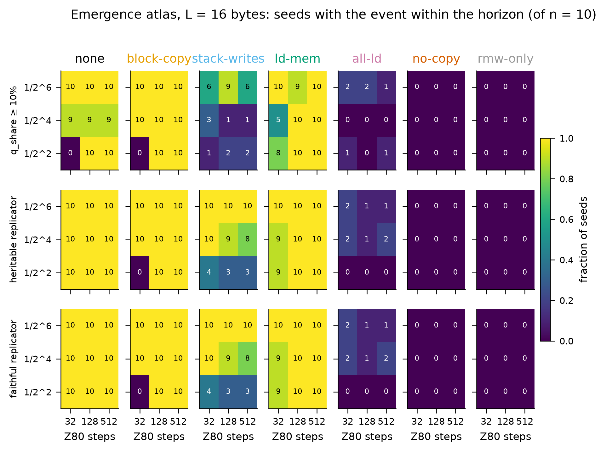
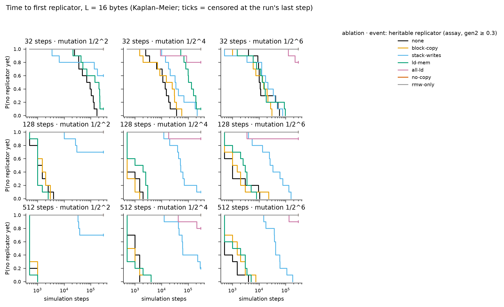

# Instruction-set ablation atlas — results

Batches: runs/stageA. Pre-registration and change log: `experiments/PLAN.md`; review: `experiments/REVIEW.md`. Emergence events: `tq_10` = quasispecies occupancy ≥ 10% (pre-registered primary; fires on zero-byte floods as well as replicators); `t_rep` = first top-3 exemplar with share ≥ 0.5% that is heritable (assay gen2 ≥ 0.3); `t_faith` = additionally ≥ 50% of partners became ≥ 75% copies. Times are Kaplan–Meier medians censored at each run's last step; sampling is every 500 steps, so 500 is the resolution floor.

## Pre-registered hypotheses

**H1 — block copy is dispensable early (L = 16, 128 steps, 1/16).** none 10/10 (KM median 500), block-copy 10/10 (KM median 500); Fisher two-sided p = 1. The pre-registered acceptance region (median ratio within [0.5, 2]) cannot be resolved: both medians sit at the first or second 500-step sample, so the test is only 'no difference detectable at 500-step resolution'. At 32 steps · 1/4 (one of 9 cells, exploratory): block-copy 0/10 vs none 10/10, Fisher two-sided p = 1.1e-05.

**H2 — removing the stack-writing arm delays emergence > 10× and switches the mechanism (L = 16, 128 steps, 1/16).** stack-writes 9/10, KM median 50,500 vs none 500 (ratio 101×); first-replicator mechanisms under the ablation: block-copy:9. Caveat (review): the arm removes 46 opcodes of which 24 write nothing (POP, RET, EX DE,HL, EXX), so the delay is 'stack+exchange+return removed', not 'stack writes removed'; Stage D separates the two.

**H3 — no-copy leaves no replicator.** Heritable replicators (t_rep): 0 in 90 no-copy runs; rmw-only: 0 in 90. By the pre-registered occupancy event tq_10 as well: 0 crossings. The assay outcome (t_rep) was adopted after 19 runs were read (PLAN change log) and is the measure used here.

**H4 — the step budget is the strongest knob (unablated, L = 16).** KM median t_rep (steps × mutation):

|   k |     32 |   128 |   512 |
|----:|-------:|------:|------:|
|   2 | 70,500 | 1,000 |   500 |
|   4 | 11,000 |   500 | 1,000 |
|   6 | 10,000 | 1,000 |   500 |

Seed-paired budget contrast: 1/2^2: 128 steps faster than 32 steps in 10, slower in 0, tied in 0 of 10 seeds (sign test p = 0.002); 1/2^4: 128 steps faster than 32 steps in 10, slower in 0, tied in 0 of 10 seeds (sign test p = 0.002); 1/2^6: 128 steps faster than 32 steps in 9, slower in 1, tied in 0 of 10 seeds (sign test p = 0.021).

**H5 — mutation is non-monotone (unablated, L = 16).** Seed-paired contrasts between adjacent mutation rates: 32 steps: 1/2^2 faster than 1/2^4 in 0, slower in 10, tied in 0 of 10 seeds (sign test p = 0.002); 1/2^4 faster than 1/2^6 in 6, slower in 4, tied in 0 of 10 seeds (sign test p = 0.75). 128 steps: 1/2^2 faster than 1/2^4 in 1, slower in 6, tied in 3 of 10 seeds (sign test p = 0.12); 1/2^4 faster than 1/2^6 in 6, slower in 1, tied in 3 of 10 seeds (sign test p = 0.12). 512 steps: 1/2^2 faster than 1/2^4 in 5, slower in 0, tied in 5 of 10 seeds (sign test p = 0.062); 1/2^4 faster than 1/2^6 in 2, slower in 5, tied in 3 of 10 seeds (sign test p = 0.45). The 'too low' side (k ≥ 8) was not run; a minimum cannot be claimed from k ∈ {2, 4, 6}.

## Emergence grids

### L = 16

| ablation | 32 steps · 1/2^2 | 32 steps · 1/2^4 | 32 steps · 1/2^6 | 128 steps · 1/2^2 | 128 steps · 1/2^4 | 128 steps · 1/2^6 | 512 steps · 1/2^2 | 512 steps · 1/2^4 | 512 steps · 1/2^6 |
|---|---|---|---|---|---|---|---|---|---|
| all-ld | 1/10 · **0/10** (NR) · 0/10 | 0/10 · **2/10** (NR) · 2/10 | 2/10 · **2/10** (NR) · 2/10 | 0/10 · **0/10** (NR) · 0/10 | 0/10 · **1/10** (NR) · 1/10 | 2/10 · **1/10** (NR) · 1/10 | 1/10 · **0/10** (NR) · 0/10 | 0/10 · **2/10** (NR) · 2/10 | 1/10 · **1/10** (NR) · 1/10 |
| block-copy | 0/10 · **0/10** (NR) · 0/10 | 10/10 · **10/10** (15,000) · 10/10 | 10/10 · **10/10** (13,500) · 10/10 | 10/10 · **10/10** (1,500) · 10/10 | 10/10 · **10/10** (500) · 10/10 | 10/10 · **10/10** (1,000) · 10/10 | 10/10 · **10/10** (500) · 10/10 | 10/10 · **10/10** (500) · 10/10 | 10/10 · **10/10** (1,500) · 10/10 |
| ld-mem | 8/10 · **9/10** (144,500) · 9/10 | 5/10 · **9/10** (102,500) · 9/10 | 10/10 · **10/10** (13,000) · 10/10 | 10/10 · **10/10** (1,000) · 10/10 | 10/10 · **10/10** (1,000) · 10/10 | 9/10 · **10/10** (2,500) · 10/10 | 10/10 · **10/10** (500) · 10/10 | 10/10 · **10/10** (500) · 10/10 | 10/10 · **10/10** (1,000) · 10/10 |
| no-copy | 0/10 · **0/10** (NR) · 0/10 | 0/10 · **0/10** (NR) · 0/10 | 0/10 · **0/10** (NR) · 0/10 | 0/10 · **0/10** (NR) · 0/10 | 0/10 · **0/10** (NR) · 0/10 | 0/10 · **0/10** (NR) · 0/10 | 0/10 · **0/10** (NR) · 0/10 | 0/10 · **0/10** (NR) · 0/10 | 0/10 · **0/10** (NR) · 0/10 |
| none | 0/10 · **10/10** (70,500) · 10/10 | 9/10 · **10/10** (11,000) · 10/10 | 10/10 · **10/10** (10,000) · 10/10 | 10/10 · **10/10** (1,000) · 10/10 | 9/10 · **10/10** (500) · 10/10 | 10/10 · **10/10** (1,000) · 10/10 | 10/10 · **10/10** (500) · 10/10 | 9/10 · **10/10** (1,000) · 10/10 | 10/10 · **10/10** (500) · 10/10 |
| rmw-only | 0/10 · **0/10** (NR) · 0/10 | 0/10 · **0/10** (NR) · 0/10 | 0/10 · **0/10** (NR) · 0/10 | 0/10 · **0/10** (NR) · 0/10 | 0/10 · **0/10** (NR) · 0/10 | 0/10 · **0/10** (NR) · 0/10 | 0/10 · **0/10** (NR) · 0/10 | 0/10 · **0/10** (NR) · 0/10 | 0/10 · **0/10** (NR) · 0/10 |
| stack-writes | 1/10 · **4/10** (NR) · 4/10 | 3/10 · **10/10** (32,000) · 10/10 | 6/10 · **10/10** (17,500) · 10/10 | 2/10 · **3/10** (NR) · 3/10 | 1/10 · **9/10** (50,500) · 9/10 | 9/10 · **10/10** (26,000) · 10/10 | 2/10 · **3/10** (NR) · 3/10 | 1/10 · **8/10** (61,500) · 8/10 | 6/10 · **10/10** (41,500) · 10/10 |

Each cell: seeds reaching q_share ≥ 10% (pre-registered) · **seeds with a heritable replicator** (KM median step, NR = not reached within the horizon) · seeds with a faithful replicator.

## Succession (census takeover times, family at 300k steps and at the last step)

| label        |   tape |   steps |   k |   n |   stopped_early |   last_step_min | final_at_last           | family_300k             |   stack_takeover_n |   stack_takeover_med |   ldir_takeover_n |   ldir_takeover_med |   ldir_invasions_complete |   ldir_invasions_censored |   ldir_invasion_med_steps |
|:-------------|-------:|--------:|----:|----:|----------------:|----------------:|:------------------------|:------------------------|-------------------:|---------------------:|------------------:|--------------------:|--------------------------:|--------------------------:|--------------------------:|
| all-ld       |     16 |      32 |   2 |  10 |               0 |          300000 | none:6, ldir:4          | none:6, ldir:4          |                  1 |                20500 |                 4 |               76750 |                         1 |                         3 |                     83000 |
| all-ld       |     16 |      32 |   4 |  10 |               0 |          300000 | none:8, ldir:2          | none:8, ldir:2          |                  1 |                66000 |                 2 |               36250 |                         2 |                         0 |                      1500 |
| all-ld       |     16 |      32 |   6 |  10 |               0 |          300000 | none:8, ldir:2          | none:8, ldir:2          |                  0 |                  nan |                 2 |              176500 |                         2 |                         0 |                      1250 |
| all-ld       |     16 |     128 |   2 |  10 |               0 |          300000 | none:9, ex_sp:1         | none:9, ex_sp:1         |                  1 |               257000 |                 1 |              254000 |                         0 |                         1 |                       nan |
| all-ld       |     16 |     128 |   4 |  10 |               0 |          300000 | none:8, ldir:2          | none:8, ldir:2          |                  0 |                  nan |                 2 |                9000 |                         2 |                         0 |                      2750 |
| all-ld       |     16 |     128 |   6 |  10 |               0 |          300000 | none:9, ldir:1          | none:9, ldir:1          |                  0 |                  nan |                 1 |                1000 |                         1 |                         0 |                      2500 |
| all-ld       |     16 |     512 |   2 |  10 |               0 |          300000 | none:9, ldir:1          | none:9, ldir:1          |                  0 |                  nan |                 1 |               53500 |                         0 |                         1 |                       nan |
| all-ld       |     16 |     512 |   4 |  10 |               0 |          300000 | none:7, ldir:3          | none:7, ldir:3          |                  0 |                  nan |                 3 |                7500 |                         3 |                         0 |                      2500 |
| all-ld       |     16 |     512 |   6 |  10 |               1 |          136500 | none:9, ldir:1          | none:9                  |                  0 |                  nan |                 1 |              134000 |                         1 |                         0 |                       500 |
| block-copy   |     16 |      32 |   2 |  10 |               0 |          300000 | none:10                 | none:10                 |                  0 |                  nan |                 0 |                 nan |                         0 |                         0 |                       nan |
| block-copy   |     16 |      32 |   4 |  10 |               0 |          300000 | push:9, none:1          | push:9, none:1          |                 10 |                21250 |                 0 |                 nan |                         0 |                         0 |                       nan |
| block-copy   |     16 |      32 |   6 |  10 |               0 |          300000 | push:10                 | push:10                 |                 10 |                18250 |                 0 |                 nan |                         0 |                         0 |                       nan |
| block-copy   |     16 |     128 |   2 |  10 |               0 |          300000 | ex_sp:8, none:2         | ex_sp:8, none:2         |                 10 |                23000 |                 0 |                 nan |                         0 |                         0 |                       nan |
| block-copy   |     16 |     128 |   4 |  10 |              10 |           15000 | ex_sp:10                | (no run reached 300k)   |                 10 |                 9750 |                 0 |                 nan |                         0 |                         0 |                       nan |
| block-copy   |     16 |     128 |   6 |  10 |               9 |           15500 | push:6, ex_sp:4         | push:1                  |                 10 |                22000 |                 0 |                 nan |                         0 |                         0 |                       nan |
| block-copy   |     16 |     512 |   2 |  10 |               0 |          300000 | push:10                 | push:10                 |                 10 |                 1500 |                 0 |                 nan |                         0 |                         0 |                       nan |
| block-copy   |     16 |     512 |   4 |  10 |              10 |           36500 | ex_sp:10                | (no run reached 300k)   |                 10 |                 1500 |                 0 |                 nan |                         0 |                         0 |                       nan |
| block-copy   |     16 |     512 |   6 |  10 |               4 |            9000 | push:6, ex_sp:4         | push:6                  |                 10 |                 2250 |                 0 |                 nan |                         0 |                         0 |                       nan |
| ld-mem       |     16 |      32 |   2 |  10 |               2 |           27500 | ldir:10                 | ldir:8                  |                  2 |                37500 |                10 |               77250 |                         3 |                         7 |                     64500 |
| ld-mem       |     16 |      32 |   4 |  10 |               2 |          179000 | ldir:9, none:1          | ldir:7, none:1          |                  2 |               129000 |                 9 |               98500 |                         9 |                         0 |                      1500 |
| ld-mem       |     16 |      32 |   6 |  10 |               1 |            4000 | push:9, ldir:1          | push:9                  |                  9 |                21000 |                 1 |                2000 |                         1 |                         0 |                      1000 |
| ld-mem       |     16 |     128 |   2 |  10 |               0 |          300000 | ldir:8, ex_sp:1, push:1 | ldir:8, ex_sp:1, push:1 |                 10 |                 6000 |                 8 |               55500 |                         2 |                         6 |                     10000 |
| ld-mem       |     16 |     128 |   4 |  10 |               9 |           10500 | ex_sp:9, ldir:1         | ldir:1                  |                 10 |                 6250 |                 1 |                9000 |                         1 |                         0 |                      2000 |
| ld-mem       |     16 |     128 |   6 |  10 |               8 |           16000 | ex_sp:6, ldir:4         | ldir:2                  |                  8 |                15250 |                 4 |               12250 |                         4 |                         0 |                      1500 |
| ld-mem       |     16 |     512 |   2 |  10 |               1 |           85000 | push:9, ldir:1          | push:9                  |                 10 |                 1500 |                 1 |               81000 |                         0 |                         1 |                       nan |
| ld-mem       |     16 |     512 |   4 |  10 |               8 |            8000 | ex_sp:10                | ex_sp:2                 |                 10 |                 1500 |                 0 |                 nan |                         0 |                         0 |                       nan |
| ld-mem       |     16 |     512 |   6 |  10 |              10 |            9500 | ex_sp:10                | (no run reached 300k)   |                 10 |                 3500 |                 0 |                 nan |                         0 |                         0 |                       nan |
| no-copy      |     16 |      32 |   2 |  10 |               0 |          300000 | none:10                 | none:10                 |                  0 |                  nan |                 0 |                 nan |                         0 |                         0 |                       nan |
| no-copy      |     16 |      32 |   4 |  10 |               0 |          300000 | none:10                 | none:10                 |                  0 |                  nan |                 0 |                 nan |                         0 |                         0 |                       nan |
| no-copy      |     16 |      32 |   6 |  10 |               0 |          300000 | none:10                 | none:10                 |                  0 |                  nan |                 0 |                 nan |                         0 |                         0 |                       nan |
| no-copy      |     16 |     128 |   2 |  10 |               0 |          300000 | none:10                 | none:10                 |                  0 |                  nan |                 0 |                 nan |                         0 |                         0 |                       nan |
| no-copy      |     16 |     128 |   4 |  10 |               0 |          300000 | none:10                 | none:10                 |                  0 |                  nan |                 0 |                 nan |                         0 |                         0 |                       nan |
| no-copy      |     16 |     128 |   6 |  10 |               0 |          300000 | none:10                 | none:10                 |                  0 |                  nan |                 0 |                 nan |                         0 |                         0 |                       nan |
| no-copy      |     16 |     512 |   2 |  10 |               0 |          300000 | none:10                 | none:10                 |                  0 |                  nan |                 0 |                 nan |                         0 |                         0 |                       nan |
| no-copy      |     16 |     512 |   4 |  10 |               0 |          300000 | none:10                 | none:10                 |                  0 |                  nan |                 0 |                 nan |                         0 |                         0 |                       nan |
| no-copy      |     16 |     512 |   6 |  10 |               0 |          300000 | none:10                 | none:10                 |                  0 |                  nan |                 0 |                 nan |                         0 |                         0 |                       nan |
| none         |     16 |      32 |   2 |  10 |               0 |          300000 | ldir:10                 | ldir:10                 |                  0 |                  nan |                10 |               74250 |                         0 |                        10 |                       nan |
| none         |     16 |      32 |   4 |  10 |               0 |          300000 | ldir:10                 | ldir:10                 |                  7 |                12500 |                10 |               56500 |                        10 |                         0 |                      2000 |
| none         |     16 |      32 |   6 |  10 |               0 |          300000 | push:7, ldir:3          | push:7, ldir:3          |                  8 |                11750 |                 3 |               56000 |                         3 |                         0 |                      1500 |
| none         |     16 |     128 |   2 |  10 |               1 |          126000 | ldir:9, ex_sp:1         | ldir:8, ex_sp:1         |                  7 |                17500 |                 9 |               24000 |                         1 |                         8 |                     47500 |
| none         |     16 |     128 |   4 |  10 |               8 |            9000 | ex_sp:8, ldir:2         | ldir:2                  |                  9 |                 8500 |                 2 |               25250 |                         2 |                         0 |                      2500 |
| none         |     16 |     128 |   6 |  10 |               8 |           14500 | push:4, ldir:3, ex_sp:3 | ldir:2                  |                  9 |                16000 |                 3 |               21000 |                         3 |                         0 |                      1000 |
| none         |     16 |     512 |   2 |  10 |               0 |          300000 | push:9, ldir:1          | push:9, ldir:1          |                 10 |                 1750 |                 1 |              271500 |                         0 |                         1 |                       nan |
| none         |     16 |     512 |   4 |  10 |               9 |           16500 | ex_sp:9, ldir:1         | ldir:1                  |                  9 |                 2000 |                 1 |                1500 |                         1 |                         0 |                      1500 |
| none         |     16 |     512 |   6 |  10 |               3 |           15500 | push:5, ex_sp:3, ldir:2 | push:5, ldir:2          |                  9 |                 1000 |                 2 |               34750 |                         2 |                         0 |                      1250 |
| rmw-only     |     16 |      32 |   2 |  10 |               0 |          300000 | none:10                 | none:10                 |                  0 |                  nan |                 0 |                 nan |                         0 |                         0 |                       nan |
| rmw-only     |     16 |      32 |   4 |  10 |               0 |          300000 | none:10                 | none:10                 |                  0 |                  nan |                 0 |                 nan |                         0 |                         0 |                       nan |
| rmw-only     |     16 |      32 |   6 |  10 |               0 |          300000 | none:10                 | none:10                 |                  0 |                  nan |                 0 |                 nan |                         0 |                         0 |                       nan |
| rmw-only     |     16 |     128 |   2 |  10 |               0 |          300000 | none:10                 | none:10                 |                  0 |                  nan |                 0 |                 nan |                         0 |                         0 |                       nan |
| rmw-only     |     16 |     128 |   4 |  10 |               0 |          300000 | none:10                 | none:10                 |                  0 |                  nan |                 0 |                 nan |                         0 |                         0 |                       nan |
| rmw-only     |     16 |     128 |   6 |  10 |               0 |          300000 | none:10                 | none:10                 |                  0 |                  nan |                 0 |                 nan |                         0 |                         0 |                       nan |
| rmw-only     |     16 |     512 |   2 |  10 |               0 |          300000 | none:10                 | none:10                 |                  0 |                  nan |                 0 |                 nan |                         0 |                         0 |                       nan |
| rmw-only     |     16 |     512 |   4 |  10 |               0 |          300000 | none:10                 | none:10                 |                  0 |                  nan |                 0 |                 nan |                         0 |                         0 |                       nan |
| rmw-only     |     16 |     512 |   6 |  10 |               0 |          300000 | none:10                 | none:10                 |                  0 |                  nan |                 0 |                 nan |                         0 |                         0 |                       nan |
| stack-writes |     16 |      32 |   2 |  10 |               0 |          300000 | ldir:10                 | ldir:10                 |                  0 |                  nan |                10 |                5250 |                         1 |                         9 |                     62000 |
| stack-writes |     16 |      32 |   4 |  10 |               2 |          102500 | ldir:10                 | ldir:8                  |                  0 |                  nan |                10 |               12000 |                        10 |                         0 |                      1250 |
| stack-writes |     16 |      32 |   6 |  10 |               1 |          268000 | ldir:10                 | ldir:9                  |                  0 |                  nan |                10 |               20000 |                        10 |                         0 |                      1000 |
| stack-writes |     16 |     128 |   2 |  10 |               1 |           37000 | ldir:10                 | ldir:9                  |                  0 |                  nan |                10 |               24000 |                         0 |                        10 |                       nan |
| stack-writes |     16 |     128 |   4 |  10 |               1 |           49500 | ldir:10                 | ldir:9                  |                  0 |                  nan |                10 |               36250 |                        10 |                         0 |                      1500 |
| stack-writes |     16 |     128 |   6 |  10 |               2 |           27500 | ldir:10                 | ldir:8                  |                  0 |                  nan |                10 |               30250 |                        10 |                         0 |                      1000 |
| stack-writes |     16 |     512 |   2 |  10 |               1 |           38500 | ldir:10                 | ldir:9                  |                  0 |                  nan |                10 |               21750 |                         3 |                         7 |                     85500 |
| stack-writes |     16 |     512 |   4 |  10 |               0 |          300000 | ldir:10                 | ldir:10                 |                  0 |                  nan |                10 |               31500 |                        10 |                         0 |                      1500 |
| stack-writes |     16 |     512 |   6 |  10 |               0 |          300000 | ldir:10                 | ldir:10                 |                  0 |                  nan |                10 |               42250 |                        10 |                         0 |                      1500 |

## Replicator zoo — runs/stageA

## all-ld · L=16 · 32 steps · mutation 1/2^2
**final** (4 seeds)
- 1× `d1 e0 ed b0 88 22 36 33 07 11 29 79 97 19 00 6e` — POP rr ; RET PO ; LDIR
- 1× `d1 e0 ed b0 16 02 04 c1 a0 6f 14 ae fd 8c 95 7a` — POP rr ; RET PO ; LDIR ; POP rr
- 1× `d1 e0 ed b0 dd 82 b4 b0 d3 c2 3c cd 29 22 53 3e` — POP rr ; RET PO ; LDIR ; CALL nn
- 1× `cb dd eb ed b0 76 8c 58 cb dd eb ed b0 76 8c 58` — [ADC A,H ; SET 3,L ; EX rr,rr ; LDIR ; HALT] ×2

## all-ld · L=16 · 32 steps · mutation 1/2^4
**first** (2 seeds)
- 1× `d1 a8 d1 06 c9 25 ed b0 d1 a8 d1 06 c9 25 ed b0` — [DEC H ; LDIR ; POP rr ; XOR B ; POP rr ; RET] ×2
- 1× `cb d3 ed b0 cb d3 ed b0 cb d3 ed b0 cb d3 ed b0` — [LDIR ; SET 2,E] ×4

**final** (2 seeds)
- 1× `d1 e0 ed b0 f6 02 d5 e9 4d e0 7e 47 bb e1 ed 00` — POP rr ; RET PO ; LDIR ; PUSH rr ; JP (HL) ; RET PO ; POP rr
- 1× `0e 15 62 cb db 7b ed b0 0e 15 62 cb db 7b ed b0` — [DEC D ; SET 3,E ; LDIR] ×2

## all-ld · L=16 · 32 steps · mutation 1/2^6
**first** (2 seeds)
- 1× `f1 a7 d1 b0 f1 a7 d1 b0 d1 04 68 ed b0 27 5c 04` — POP rr×5 ; LDIR
- 1× `b0 b0 70 00 d1 70 93 9b d1 d1 b1 70 d1 ed b0 2c` — POP rr×4 ; LDIR

**final** (2 seeds)
- 1× `d1 c0 9a 70 57 6b 0c f3 dd 2e e3 ed b0 b1 0f 8b` — POP rr ; RET NZ ; EX (SP),rr ; LDIR
- 1× `56 a4 c1 d0 d1 ed b0 ce 97 75 d9 27 4d 00 33 e1` — POP rr ; RET NC ; POP rr ; LDIR ; EXX ; POP rr

## all-ld · L=16 · 128 steps · mutation 1/2^2
**final** (1 seeds)
- 1× `cb e3 f2 46 e4 18 4e d3 55 4b aa ed b0 f9 70 00` — JP P,nn ; JR d ; LDIR

## all-ld · L=16 · 128 steps · mutation 1/2^4
**first** (1 seeds)
- 1× `d1 c0 31 88 eb ed b0 85 d1 c0 31 88 eb ed b0 85` — [ADC A,B ; EX rr,rr ; LDIR ; ADD A,L ; POP rr ; RET NZ] ×2

**final** (2 seeds)
- 1× `1d e1 31 d0 5a 8d 4c 1c 5c 76 a3 50 d0 19 ed b8` — POP rr ; RET NC×2 ; LDDR
- 1× `19 50 5a f1 c3 e7 58 d1 ed b0 dc d0 ce 42 1f 18` — POP rr ; JP nn ; POP rr ; LDIR ; CALL C,nn ; JR d

## all-ld · L=16 · 128 steps · mutation 1/2^6
**first** (1 seeds)
- 1× `e1 c8 e1 8b f3 8b ed b8 e1 c8 e1 8b f3 8b ed b8` — [ADC A,E ; DI ; ADC A,E ; LDDR ; POP rr ; RET Z ; POP rr] ×2

**final** (1 seeds)
- 1× `1b e1 19 70 f0 ea 84 ea cd 7e ed b8 7c 31 96 85` — POP rr ; RET P ; JP PE,nn ; CALL nn

## all-ld · L=16 · 512 steps · mutation 1/2^2
**final** (1 seeds)
- 1× `d1 c0 c3 88 e5 e6 ed b0 d1 c0 c3 88 e5 e6 ed b0` — [AND n ; OR B ; POP rr ; RET NZ ; JP nn] ×2

## all-ld · L=16 · 512 steps · mutation 1/2^4
**first** (2 seeds)
- 1× `1d e1 19 e8 c9 c6 ed b8 1d e1 19 e8 c9 c6 ed b8` — [ADD A,n ; CP B ; DEC E ; POP rr ; ADD HL,DE ; RET PE ; RET] ×2
- 1× `08 33 c3 e5 fa d1 ed b0 08 33 c3 e5 fa d1 ed b0` — [EX rr,rr' ; INC SP ; JP nn ; POP rr ; LDIR] ×2

**final** (3 seeds)
- 1× `9f e1 8b c8 73 c6 ed b8 9f e1 8b c8 73 c6 ed b8` — [ADC A,E ; RET Z ; ADD A,n ; CP B ; SBC A,A ; POP rr] ×2
- 1× `90 33 c3 e5 3c d1 ed b0 42 60 12 89 88 bb 00 00` — JP nn ; POP rr ; LDIR
- 1× `b0 56 33 87 d1 c3 ad e5 1b ec e7 74 fd ed b0 ba` — POP rr ; JP nn ; CALL PE,nn ; LDIR

## all-ld · L=16 · 512 steps · mutation 1/2^6
**first** (1 seeds)
- 1× `1b 01 00 01 00 93 00 e2 00 01 00 01 ed b0 00 01` — JP PO,nn ; LDIR

**final** (1 seeds)
- 1× `1b 0b 00 96 5a 93 0a e2 00 6c 30 37 ed b0 00 9d` — JP PO,nn ; JR NC,d ; LDIR

## block-copy · L=16 · 32 steps · mutation 1/2^4
**first** (10 seeds)
- 10× `e5 2a e5 2a e5 2a e5 2a e5 2a e5 2a e5 2a e5 2a` — [LD rr,(nn) ; PUSH rr] ×8

**final** (10 seeds)
- 10× `21 e5 21 e5 21 e5 21 e5 21 e5 21 e5 21 e5 21 e5` — [LD rr,nn ; PUSH rr] ×8

## block-copy · L=16 · 32 steps · mutation 1/2^6
**first** (10 seeds)
- 5× `e5 2a e5 2a e5 2a e5 2a e5 2a e5 2a e5 2a e5 2a` — [LD rr,(nn) ; PUSH rr] ×8
- 5× `01 c5 01 c5 01 c5 01 c5 01 c5 01 c5 01 c5 01 c5` — [LD rr,nn ; PUSH rr] ×8

**final** (10 seeds)
- 10× `21 e5 21 e5 21 e5 21 e5 21 e5 21 e5 21 e5 21 e5` — [LD rr,nn ; PUSH rr] ×8

## block-copy · L=16 · 128 steps · mutation 1/2^2
**first** (10 seeds)
- 10× `11 d5 11 d5 11 d5 11 d5 11 d5 11 d5 11 d5 11 d5` — [LD rr,nn ; PUSH rr] ×8

**final** (10 seeds)
- 4× `ad e3 21 e3 21 c0 ad c0 ad e3 21 e3 21 c0 ad c0` — [EX (SP),rr ; LD rr,nn ; RET NZ ; XOR L ; RET NZ ; XOR L] ×2
- 4× `c8 e3 21 e3 21 81 c8 81 c8 e3 21 e3 21 81 c8 81` — [ADD A,C ; RET Z ; ADD A,C ; RET Z ; EX (SP),rr ; LD rr,nn] ×2
- 2× `21 e5 21 e5 21 e5 21 e5 21 e5 21 e5 21 e5 21 e5` — [LD rr,nn ; PUSH rr] ×8

## block-copy · L=16 · 128 steps · mutation 1/2^4
**first** (10 seeds)
- 10× `01 c5 01 c5 01 c5 01 c5 01 c5 01 c5 01 c5 01 c5` — [LD rr,nn ; PUSH rr] ×8

**final** (10 seeds)
- 4× `ad e3 21 e3 21 e0 ad e0 ad e3 21 e3 21 e0 ad e0` — [EX (SP),rr ; LD rr,nn ; RET PO ; XOR L ; RET PO ; XOR L] ×2
- 2× `ae e3 21 e3 21 e0 ae e0 ae e3 21 e3 21 e0 ae e0` — [EX (SP),rr ; LD rr,nn ; RET PO ; XOR (HL) ; RET PO ; XOR (HL)] ×2
- 1× `60 e3 21 e3 21 c9 60 c9 60 e3 21 e3 21 c9 60 c9` — [EX (SP),rr ; LD rr,nn ; RET ; LD r,r ; RET ; LD r,r] ×2
- 1× `ad e3 21 e3 21 c0 ad c0 ad e3 21 e3 21 c0 ad c0` — [EX (SP),rr ; LD rr,nn ; RET NZ ; XOR L ; RET NZ ; XOR L] ×2
- 1× `ac e3 21 e3 21 c0 ac c0 ac e3 21 e3 21 c0 ac c0` — [EX (SP),rr ; LD rr,nn ; RET NZ ; XOR H ; RET NZ ; XOR H] ×2
- 1× `ae e3 21 e3 21 c0 ae c0 ae e3 21 e3 21 c0 ae c0` — [EX (SP),rr ; LD rr,nn ; RET NZ ; XOR (HL) ; RET NZ ; XOR (HL)] ×2

## block-copy · L=16 · 128 steps · mutation 1/2^6
**first** (10 seeds)
- 10× `11 d5 11 d5 11 d5 11 d5 11 d5 11 d5 11 d5 11 d5` — [LD rr,nn ; PUSH rr] ×8

**final** (10 seeds)
- 6× `e5 2a e5 2a e5 2a e5 2a e5 2a e5 2a e5 2a e5 2a` — [LD rr,(nn) ; PUSH rr] ×8
- 1× `92 e3 21 e3 21 e0 92 e0 92 e3 21 e3 21 e0 92 e0` — [EX (SP),rr ; LD rr,nn ; RET PO ; SUB D ; RET PO ; SUB D] ×2
- 1× `4a e3 21 e3 21 e0 4a e0 4a e3 21 e3 21 e0 4a e0` — [EX (SP),rr ; LD rr,nn ; RET PO ; LD r,r ; RET PO ; LD r,r] ×2
- 1× `8b e3 21 e3 21 e0 8b e0 8b e3 21 e3 21 e0 8b e0` — [ADC A,E ; EX (SP),rr ; LD rr,nn ; RET PO ; ADC A,E ; RET PO] ×2
- 1× `2f e3 21 e3 21 e0 2f e0 2f e3 21 e3 21 e0 2f e0` — [CPL ; EX (SP),rr ; LD rr,nn ; RET PO ; CPL ; RET PO] ×2

## block-copy · L=16 · 512 steps · mutation 1/2^2
**first** (10 seeds)
- 10× `11 d5 11 d5 11 d5 11 d5 11 d5 11 d5 11 d5 11 d5` — [LD rr,nn ; PUSH rr] ×8

**final** (10 seeds)
- 10× `01 c5 01 c5 01 c5 01 c5 01 c5 01 c5 01 c5 01 c5` — [LD rr,nn ; PUSH rr] ×8

## block-copy · L=16 · 512 steps · mutation 1/2^4
**first** (10 seeds)
- 10× `11 d5 11 d5 11 d5 11 d5 11 d5 11 d5 11 d5 11 d5` — [LD rr,nn ; PUSH rr] ×8

**final** (10 seeds)
- 8× `c8 e3 21 e3 21 81 c8 81 c8 e3 21 e3 21 81 c8 81` — [ADD A,C ; RET Z ; ADD A,C ; RET Z ; EX (SP),rr ; LD rr,nn] ×2
- 1× `00 e3 21 e3 21 c0 00 c0 00 e3 21 e3 21 c0 00 c0` — [EX (SP),rr ; LD rr,nn ; RET NZ ; NOP ; RET NZ ; NOP] ×2
- 1× `b6 e3 21 e3 21 e0 b6 e0 b6 e3 21 e3 21 e0 b6 e0` — [EX (SP),rr ; LD rr,nn ; RET PO ; OR (HL) ; RET PO ; OR (HL)] ×2

## block-copy · L=16 · 512 steps · mutation 1/2^6
**first** (10 seeds)
- 10× `21 e5 21 e5 21 e5 21 e5 21 e5 21 e5 21 e5 21 e5` — [LD rr,nn ; PUSH rr] ×8

**final** (10 seeds)
- 6× `e5 2a e5 2a e5 2a e5 2a e5 2a e5 2a e5 2a e5 2a` — [LD rr,(nn) ; PUSH rr] ×8
- 1× `9b e3 21 e3 21 e0 9b e0 9b e3 21 e3 21 e0 9b e0` — [EX (SP),rr ; LD rr,nn ; RET PO ; SBC A,E ; RET PO ; SBC A,E] ×2
- 1× `bf e3 21 e3 21 e0 bf e0 bf e3 21 e3 21 e0 bf e0` — [CP A ; EX (SP),rr ; LD rr,nn ; RET PO ; CP A ; RET PO] ×2
- 1× `95 e3 21 e3 21 e0 95 e0 95 e3 21 e3 21 e0 95 e0` — [EX (SP),rr ; LD rr,nn ; RET PO ; SUB L ; RET PO ; SUB L] ×2
- 1× `90 e3 21 e3 21 e0 90 e0 90 e3 21 e3 21 e0 90 e0` — [EX (SP),rr ; LD rr,nn ; RET PO ; SUB B ; RET PO ; SUB B] ×2

## ld-mem · L=16 · 32 steps · mutation 1/2^2
**first** (9 seeds)
- 7× `1e 64 ed b0 1e 64 ed b0 1e 64 ed b0 1e 64 ed b0` — [LD r,n ; LDIR] ×4
- 2× `b0 f5 d1 ed b0 f5 d1 ed b0 f5 d1 ed b0 f5 d1 ed` — [LDIR ; PUSH rr ; POP rr] ×4

**final** (10 seeds)
- 2× `b0 f5 d1 ed b0 f5 d1 ed b0 f5 d1 ed b0 f5 d1 ed` — [LDIR ; PUSH rr ; POP rr] ×4
- 1× `1e 08 f2 63 ed b0 fe 3e 1e 08 f2 63 ed b0 fe 3e` — [CP n ; LD r,n ; JP P,nn ; OR B] ×2
- 1× `1e a8 c2 c4 ed b0 b5 0e 1e a8 c2 c4 ed b0 b5 0e` — [JP NZ,nn ; OR B ; OR L ; LD r,n ; XOR B] ×2
- 1× `d1 c0 cb f0 6d 8b ba 37 b4 e2 57 ed b0 42 47 dd` — POP rr ; RET NZ ; JP PO,nn
- 1× `1e 08 28 5a ed b0 1f 76 1e 08 28 5a ed b0 1f 76` — [HALT ; LD r,n ; JR Z,d ; LDIR ; RRA] ×2
- 1× `b0 1e 44 ed b0 1e 44 ed b0 1e 44 ed b0 1e 44 ed` — [LD r,n ; LDIR] ×4

## ld-mem · L=16 · 32 steps · mutation 1/2^4
**first** (9 seeds)
- 4× `1e c4 ed b0 1e c4 ed b0 1e c4 ed b0 1e c4 ed b0` — [LD r,n ; LDIR] ×4
- 1× `cb d3 ed b0 cb d3 ed b0 cb d3 ed b0 cb d3 ed b0` — [LDIR ; SET 2,E] ×4
- 1× `e2 e2 11 e8 41 aa ed b0 e2 e2 11 e8 41 aa ed b0` — [JP PO,nn ; RET PE ; LD r,r ; XOR D ; LDIR] ×2
- 1× `1e 68 c3 63 d5 bd ed b0 1e 68 c3 63 d5 bd ed b0` — [CP L ; LDIR ; LD r,n ; JP nn] ×2
- 1× `cb db ed b0 1d 00 29 0e cb db ed b0 1d 00 29 0e` — [ADD HL,HL ; LD r,n ; IN A,(n) ; OR B ; DEC E ; NOP] ×2
- 1× `11 88 5e d4 c5 ed b0 76 11 88 5e d4 c5 ed b0 76` — [CALL NC,nn ; OR B ; HALT ; LD rr,nn] ×2

**final** (9 seeds)
- 3× `b0 1e 44 ed b0 1e 44 ed b0 1e 44 ed b0 1e 44 ed` — [LD r,n ; LDIR] ×4
- 1× `1e e8 4f e4 05 ed b0 69 1e e8 4f e4 05 ed b0 69` — [CALL PO,nn ; OR B ; LD r,r ; LD r,n ; LD r,r] ×2
- 1× `c2 e2 11 48 e0 ed b0 4a c2 e2 11 48 e0 ed b0 4a` — [JP NZ,nn ; LD r,r ; RET PO ; LDIR ; LD r,r] ×2
- 1× `11 50 b0 c3 a7 11 98 ee 63 07 81 02 ed b0 0c fc` — LD rr,nn ; JP nn ; LDIR ; CALL M,nn
- 1× `cb d3 ed b0 cb d3 ed b0 cb d3 ed b0 cb d3 ed b0` — [LDIR ; SET 2,E] ×4
- 1× `1e 50 c3 8e 2c 22 6f fa ad 40 7d 93 b4 5d ed b0` — LD r,n ; JP nn ; JP M,nn ; LDIR

## ld-mem · L=16 · 32 steps · mutation 1/2^6
**first** (10 seeds)
- 9× `01 c5 01 c5 01 c5 01 c5 01 c5 01 c5 01 c5 01 c5` — [LD rr,nn ; PUSH rr] ×8
- 1× `00 e1 a8 d0 dd 28 b7 d5 1d 2d a4 ed b8 01 00 00` — POP rr ; RET NC ; JR Z,d ; PUSH rr ; LDDR ; LD rr,nn

**final** (10 seeds)
- 9× `01 c5 01 c5 01 c5 01 c5 01 c5 01 c5 01 c5 01 c5` — [LD rr,nn ; PUSH rr] ×8
- 1× `94 e1 a8 d0 1b 28 6d d5 1d 2d a4 ed b8 01 00 7c` — POP rr ; RET NC ; JR Z,d ; PUSH rr ; LDDR ; LD rr,nn

## ld-mem · L=16 · 128 steps · mutation 1/2^2
**first** (10 seeds)
- 10× `01 c5 01 c5 01 c5 01 c5 01 c5 01 c5 01 c5 01 c5` — [LD rr,nn ; PUSH rr] ×8

**final** (10 seeds)
- 1× `1e 90 c2 6b 9c ed 16 d8 d2 e7 4f ed b0 a9 be b3` — LD r,n ; JP NZ,nn ; RET C ; JP NC,nn ; LDIR
- 1× `ad e3 21 e3 21 c0 ad c0 ad e3 21 e3 21 c0 ad c0` — [EX (SP),rr ; LD rr,nn ; RET NZ ; XOR L ; RET NZ ; XOR L] ×2
- 1× `11 08 ed a0 d2 01 fb 11 11 08 ed a0 d2 01 fb 11` — [JP NC,nn ; LD rr,nn ; LDI] ×2
- 1× `11 b0 2a c3 eb 8d f0 ae 0d 77 fe ed b0 0e 16 ed` — LD rr,nn ; JP nn ; RET P ; LD r,n
- 1× `1e 50 c3 eb 6f 89 e9 de 01 61 e1 ed b0 e9 00 22` — LD r,n ; JP nn ; JP (HL) ; POP rr ; LDIR ; JP (HL)
- 1× `01 c5 01 c5 01 c5 01 c5 01 c5 01 c5 01 c5 01 c5` — [LD rr,nn ; PUSH rr] ×8

## ld-mem · L=16 · 128 steps · mutation 1/2^4
**first** (10 seeds)
- 10× `01 c5 01 c5 01 c5 01 c5 01 c5 01 c5 01 c5 01 c5` — [LD rr,nn ; PUSH rr] ×8

**final** (10 seeds)
- 4× `ad e3 21 e3 21 e0 ad e0 ad e3 21 e3 21 e0 ad e0` — [EX (SP),rr ; LD rr,nn ; RET PO ; XOR L ; RET PO ; XOR L] ×2
- 2× `ac e3 21 e3 21 c0 ac c0 ac e3 21 e3 21 c0 ac c0` — [EX (SP),rr ; LD rr,nn ; RET NZ ; XOR H ; RET NZ ; XOR H] ×2
- 2× `ae e3 21 e3 21 e0 ae e0 ae e3 21 e3 21 e0 ae e0` — [EX (SP),rr ; LD rr,nn ; RET PO ; XOR (HL) ; RET PO ; XOR (HL)] ×2
- 1× `ad e3 21 e3 21 c0 ad c0 ad e3 21 e3 21 c0 ad c0` — [EX (SP),rr ; LD rr,nn ; RET NZ ; XOR L ; RET NZ ; XOR L] ×2
- 1× `1e b0 c3 6d 5d 43 5d ea 75 58 85 42 48 ed b0 80` — LD r,n ; JP nn ; JP PE,nn ; LDIR

## ld-mem · L=16 · 128 steps · mutation 1/2^6
**first** (10 seeds)
- 9× `01 c5 01 c5 01 c5 01 c5 01 c5 01 c5 01 c5 01 c5` — [LD rr,nn ; PUSH rr] ×8
- 1× `00 b0 d1 b0 d1 b0 ed b0 10 00 00 50 00 10 50 00` — POP rr×2 ; LDIR ; DJNZ d×2

**final** (10 seeds)
- 2× `34 e3 21 e3 21 c9 34 c9 34 e3 21 e3 21 c9 34 c9` — [EX (SP),rr ; LD rr,nn ; RET ; INC (HL) ; RET ; INC (HL)] ×2
- 2× `b0 1e 24 ed b0 1e 24 ed b0 1e 24 ed b0 1e 24 ed` — [LD r,n ; LDIR] ×4
- 2× `00 e3 21 e3 21 e0 00 e0 00 e3 21 e3 21 e0 00 e0` — [EX (SP),rr ; LD rr,nn ; RET PO ; NOP ; RET PO ; NOP] ×2
- 1× `1d e1 19 d0 94 c9 49 de 8f ed b8 4a 3d f1 0c ba` — POP rr ; RET NC ; RET ; LDDR ; POP rr
- 1× `00 e3 21 e3 21 c0 00 c0 00 e3 21 e3 21 c0 00 c0` — [EX (SP),rr ; LD rr,nn ; RET NZ ; NOP ; RET NZ ; NOP] ×2
- 1× `74 e3 21 e3 21 e0 74 e0 74 e3 21 e3 21 e0 74 e0` — [EX (SP),rr ; LD rr,nn ; RET PO ; RET PO] ×2

## ld-mem · L=16 · 512 steps · mutation 1/2^2
**first** (10 seeds)
- 10× `01 c5 01 c5 01 c5 01 c5 01 c5 01 c5 01 c5 01 c5` — [LD rr,nn ; PUSH rr] ×8

**final** (10 seeds)
- 9× `21 e5 21 e5 21 e5 21 e5 21 e5 21 e5 21 e5 21 e5` — [LD rr,nn ; PUSH rr] ×8
- 1× `b0 1e 84 ed b0 1e 84 ed b0 1e 84 ed b0 1e 84 ed` — [LD r,n ; LDIR] ×4

## ld-mem · L=16 · 512 steps · mutation 1/2^4
**first** (10 seeds)
- 10× `01 c5 01 c5 01 c5 01 c5 01 c5 01 c5 01 c5 01 c5` — [LD rr,nn ; PUSH rr] ×8

**final** (10 seeds)
- 4× `c8 e3 21 e3 21 81 c8 81 c8 e3 21 e3 21 81 c8 81` — [ADD A,C ; RET Z ; ADD A,C ; RET Z ; EX (SP),rr ; LD rr,nn] ×2
- 3× `b5 e3 21 e3 21 e8 b5 e8 b5 e3 21 e3 21 e8 b5 e8` — [EX (SP),rr ; LD rr,nn ; RET PE ; OR L ; RET PE ; OR L] ×2
- 1× `49 e3 21 e3 21 e0 49 e0 49 e3 21 e3 21 e0 49 e0` — [EX (SP),rr ; LD rr,nn ; RET PO ; LD r,r ; RET PO ; LD r,r] ×2
- 1× `00 e3 21 e3 21 c0 00 c0 00 e3 21 e3 21 c0 00 c0` — [EX (SP),rr ; LD rr,nn ; RET NZ ; NOP ; RET NZ ; NOP] ×2
- 1× `13 e3 21 e3 21 c0 13 c0 13 e3 21 e3 21 c0 13 c0` — [EX (SP),rr ; LD rr,nn ; RET NZ ; INC DE ; RET NZ ; INC DE] ×2

## ld-mem · L=16 · 512 steps · mutation 1/2^6
**first** (10 seeds)
- 10× `01 c5 01 c5 01 c5 01 c5 01 c5 01 c5 01 c5 01 c5` — [LD rr,nn ; PUSH rr] ×8

**final** (10 seeds)
- 3× `12 e3 21 e3 21 e0 12 e0 12 e3 21 e3 21 e0 12 e0` — [EX (SP),rr ; LD rr,nn ; RET PO ; RET PO] ×2
- 3× `00 e3 21 e3 21 e0 00 e0 00 e3 21 e3 21 e0 00 e0` — [EX (SP),rr ; LD rr,nn ; RET PO ; NOP ; RET PO ; NOP] ×2
- 2× `14 e3 21 e3 21 e0 14 e0 14 e3 21 e3 21 e0 14 e0` — [EX (SP),rr ; LD rr,nn ; RET PO ; INC D ; RET PO ; INC D] ×2
- 1× `8b e3 21 e3 21 e0 8b e0 8b e3 21 e3 21 e0 8b e0` — [ADC A,E ; EX (SP),rr ; LD rr,nn ; RET PO ; ADC A,E ; RET PO] ×2
- 1× `41 e3 21 e3 21 e0 41 e0 41 e3 21 e3 21 e0 41 e0` — [EX (SP),rr ; LD rr,nn ; RET PO ; LD r,r ; RET PO ; LD r,r] ×2

## none · L=16 · 32 steps · mutation 1/2^2
**first** (10 seeds)
- 3× `44 5e ed b0 44 5e ed b0 44 5e ed b0 44 5e ed b0` — [LD r,(HL) ; LDIR ; LD r,r] ×4
- 3× `a4 5e ed b0 a4 5e ed b0 a4 5e ed b0 a4 5e ed b0` — [AND H ; LD r,(HL) ; LDIR] ×4
- 1× `84 5e ed b0 84 5e ed b0 84 5e ed b0 84 5e ed b0` — [ADD A,H ; LD r,(HL) ; LDIR] ×4
- 1× `1e 44 ed b0 1e 44 ed b0 1e 44 ed b0 1e 44 ed b0` — [LD r,n ; LDIR] ×4
- 1× `24 5e ed b0 24 5e ed b0 24 5e ed b0 24 5e ed b0` — [INC H ; LD r,(HL) ; LDIR] ×4
- 1× `04 5e ed b0 04 5e ed b0 04 5e ed b0 04 5e ed b0` — [INC B ; LD r,(HL) ; LDIR] ×4

**final** (10 seeds)
- 3× `04 5e ed b0 04 5e ed b0 04 5e ed b0 04 5e ed b0` — [INC B ; LD r,(HL) ; LDIR] ×4
- 3× `44 5e ed b0 44 5e ed b0 44 5e ed b0 44 5e ed b0` — [LD r,(HL) ; LDIR ; LD r,r] ×4
- 1× `d1 e0 ed b0 c3 02 27 b9 c0 be b9 07 b9 10 01 91` — POP rr ; RET PO ; LDIR ; JP nn ; RET NZ ; DJNZ d
- 1× `84 5e ed b0 84 5e ed b0 84 5e ed b0 84 5e ed b0` — [ADD A,H ; LD r,(HL) ; LDIR] ×4
- 1× `d1 e0 ed b0 95 02 de fa 00 68 00 7e d0 96 00 19` — POP rr ; RET PO ; LDIR ; LD (BC),r ; LD r,(HL) ; RET NC
- 1× `24 5e ed b0 24 5e ed b0 24 5e ed b0 24 5e ed b0` — [INC H ; LD r,(HL) ; LDIR] ×4

## none · L=16 · 32 steps · mutation 1/2^4
**first** (10 seeds)
- 7× `e5 2a e5 2a e5 2a e5 2a e5 2a e5 2a e5 2a e5 2a` — [LD rr,(nn) ; PUSH rr] ×8
- 1× `b8 eb 68 21 48 21 9d ed b8 eb 68 21 48 21 9d ed` — [EX rr,rr ; LD r,r ; LD rr,nn ; SBC A,L ; LDDR] ×2
- 1× `58 47 96 5f 96 ed b0 94 58 47 96 5f 96 ed b0 94` — [LD r,r ; LD r,r ; SUB (HL) ; LD r,r ; SUB (HL) ; LDIR ; SUB H] ×2
- 1× `84 5e ed b0 84 5e ed b0 84 5e ed b0 84 5e ed b0` — [ADD A,H ; LD r,(HL) ; LDIR] ×4

**final** (10 seeds)
- 3× `44 5e ed b0 44 5e ed b0 44 5e ed b0 44 5e ed b0` — [LD r,(HL) ; LDIR ; LD r,r] ×4
- 2× `a4 5e ed b0 a4 5e ed b0 a4 5e ed b0 a4 5e ed b0` — [AND H ; LD r,(HL) ; LDIR] ×4
- 2× `24 5e ed b0 24 5e ed b0 24 5e ed b0 24 5e ed b0` — [INC H ; LD r,(HL) ; LDIR] ×4
- 1× `04 5e ed b0 04 5e ed b0 04 5e ed b0 04 5e ed b0` — [INC B ; LD r,(HL) ; LDIR] ×4
- 1× `28 92 5e ed b0 7a 49 00 28 92 5e ed b0 7a 49 00` — [JR Z,d ; LD r,(HL) ; LDIR ; LD r,r ; LD r,r ; NOP] ×2
- 1× `b0 f5 d1 ed b0 f5 d1 ed b0 f5 d1 ed b0 f5 d1 ed` — [LDIR ; PUSH rr ; POP rr] ×4

## none · L=16 · 32 steps · mutation 1/2^6
**first** (10 seeds)
- 5× `e5 2a e5 2a e5 2a e5 2a e5 2a e5 2a e5 2a e5 2a` — [LD rr,(nn) ; PUSH rr] ×8
- 4× `01 c5 01 c5 01 c5 01 c5 01 c5 01 c5 01 c5 01 c5` — [LD rr,nn ; PUSH rr] ×8
- 1× `b8 00 63 97 21 68 30 ed b8 00 63 97 21 68 30 ed` — [LD r,r ; SUB A ; LD rr,nn ; LDDR ; NOP] ×2

**final** (10 seeds)
- 7× `21 e5 21 e5 21 e5 21 e5 21 e5 21 e5 21 e5 21 e5` — [LD rr,nn ; PUSH rr] ×8
- 1× `26 f2 c3 21 68 2f ed b8 26 f2 c3 21 68 2f ed b8` — [CPL ; LDDR ; LD r,n ; JP nn] ×2
- 1× `d1 08 fd 99 d1 ed b0 be d1 08 fd 99 d1 ed b0 be` — [CP (HL) ; POP rr ; EX rr,rr' ; SBC A,C ; POP rr ; LDIR] ×2
- 1× `c8 5e ed b0 b8 f3 79 d4 c8 5e ed b0 b8 f3 79 d4` — [CALL NC,nn ; LDIR ; CP B ; DI ; LD r,r] ×2

## none · L=16 · 128 steps · mutation 1/2^2
**first** (10 seeds)
- 10× `11 d5 11 d5 11 d5 11 d5 11 d5 11 d5 11 d5 11 d5` — [LD rr,nn ; PUSH rr] ×8

**final** (10 seeds)
- 2× `a4 5e ed b0 a4 5e ed b0 a4 5e ed b0 a4 5e ed b0` — [AND H ; LD r,(HL) ; LDIR] ×4
- 1× `04 5e ed b0 04 5e ed b0 04 5e ed b0 04 5e ed b0` — [INC B ; LD r,(HL) ; LDIR] ×4
- 1× `c8 e3 21 e3 21 81 c8 81 c8 e3 21 e3 21 81 c8 81` — [ADD A,C ; RET Z ; ADD A,C ; RET Z ; EX (SP),rr ; LD rr,nn] ×2
- 1× `28 21 5e ed b0 51 dc ee 28 21 5e ed b0 51 dc ee` — [CALL C,nn ; LD rr,nn ; OR B ; LD r,r] ×2
- 1× `28 f0 5e ed b0 ea 15 dd 28 f0 5e ed b0 ea 15 dd` — [JP PE,nn ; JR Z,d ; LD r,(HL) ; LDIR] ×2
- 1× `6b cb db ac ed b0 db 57 6b cb db ac ed b0 db 57` — [IN A,(n) ; LD r,r ; SET 3,E ; XOR H ; LDIR] ×2

## none · L=16 · 128 steps · mutation 1/2^4
**first** (10 seeds)
- 10× `11 d5 11 d5 11 d5 11 d5 11 d5 11 d5 11 d5 11 d5` — [LD rr,nn ; PUSH rr] ×8

**final** (10 seeds)
- 5× `ad e3 21 e3 21 e0 ad e0 ad e3 21 e3 21 e0 ad e0` — [EX (SP),rr ; LD rr,nn ; RET PO ; XOR L ; RET PO ; XOR L] ×2
- 1× `1b e1 19 f0 9b c6 ed b8 40 78 25 53 97 cb 40 d9` — POP rr ; RET P ; EXX
- 1× `ad e3 21 e3 21 c0 ad c0 ad e3 21 e3 21 c0 ad c0` — [EX (SP),rr ; LD rr,nn ; RET NZ ; XOR L ; RET NZ ; XOR L] ×2
- 1× `ac e3 21 e3 21 c0 ac c0 ac e3 21 e3 21 c0 ac c0` — [EX (SP),rr ; LD rr,nn ; RET NZ ; XOR H ; RET NZ ; XOR H] ×2
- 1× `ae e3 21 e3 21 e0 ae e0 ae e3 21 e3 21 e0 ae e0` — [EX (SP),rr ; LD rr,nn ; RET PO ; XOR (HL) ; RET PO ; XOR (HL)] ×2
- 1× `28 f2 5e ed b0 1c 43 97 28 f2 5e ed b0 1c 43 97` — [INC E ; LD r,r ; SUB A ; JR Z,d ; LD r,(HL) ; LDIR] ×2

## none · L=16 · 128 steps · mutation 1/2^6
**first** (10 seeds)
- 9× `01 c5 01 c5 01 c5 01 c5 01 c5 01 c5 01 c5 01 c5` — [LD rr,nn ; PUSH rr] ×8
- 1× `00 e1 00 d0 dd 28 b7 60 73 ed b8 c5 27 00 00 00` — POP rr ; RET NC ; JR Z,d ; LD (HL),r ; LDDR ; PUSH rr

**final** (10 seeds)
- 4× `e5 2a e5 2a e5 2a e5 2a e5 2a e5 2a e5 2a e5 2a` — [LD rr,(nn) ; PUSH rr] ×8
- 3× `00 e3 21 e3 21 e0 00 e0 00 e3 21 e3 21 e0 00 e0` — [EX (SP),rr ; LD rr,nn ; RET PO ; NOP ; RET PO ; NOP] ×2
- 1× `5e e1 19 d0 e0 e9 ab b0 dd ed b8 00 91 01 4b e1` — LD r,(HL) ; POP rr ; RET NC ; RET PO ; JP (HL) ; LDDR ; LD rr,nn
- 1× `b0 1e 04 ed b0 1e 04 ed b0 1e 04 ed b0 1e 04 ed` — [LD r,n ; LDIR] ×4
- 1× `04 5e ed b0 04 5e ed b0 04 5e ed b0 04 5e ed b0` — [INC B ; LD r,(HL) ; LDIR] ×4

## none · L=16 · 512 steps · mutation 1/2^2
**first** (10 seeds)
- 10× `01 c5 01 c5 01 c5 01 c5 01 c5 01 c5 01 c5 01 c5` — [LD rr,nn ; PUSH rr] ×8

**final** (10 seeds)
- 9× `01 c5 01 c5 01 c5 01 c5 01 c5 01 c5 01 c5 01 c5` — [LD rr,nn ; PUSH rr] ×8
- 1× `28 6e 5e ed b0 2c fe 10 28 6e 5e ed b0 2c fe 10` — [CP n ; JR Z,d ; LD r,(HL) ; LDIR ; INC L] ×2

## none · L=16 · 512 steps · mutation 1/2^4
**first** (10 seeds)
- 10× `01 c5 01 c5 01 c5 01 c5 01 c5 01 c5 01 c5 01 c5` — [LD rr,nn ; PUSH rr] ×8

**final** (10 seeds)
- 5× `c8 e3 21 e3 21 81 c8 81 c8 e3 21 e3 21 81 c8 81` — [ADD A,C ; RET Z ; ADD A,C ; RET Z ; EX (SP),rr ; LD rr,nn] ×2
- 2× `b5 e3 21 e3 21 e8 b5 e8 b5 e3 21 e3 21 e8 b5 e8` — [EX (SP),rr ; LD rr,nn ; RET PE ; OR L ; RET PE ; OR L] ×2
- 1× `b8 e1 af c8 3e a7 01 ed b8 e1 af c8 3e a7 01 ed` — [LD r,n ; LD rr,nn ; POP rr ; XOR A ; RET Z] ×2
- 1× `b6 e3 21 e3 21 e0 b6 e0 b6 e3 21 e3 21 e0 b6 e0` — [EX (SP),rr ; LD rr,nn ; RET PO ; OR (HL) ; RET PO ; OR (HL)] ×2
- 1× `00 e3 21 e3 21 c0 00 c0 00 e3 21 e3 21 c0 00 c0` — [EX (SP),rr ; LD rr,nn ; RET NZ ; NOP ; RET NZ ; NOP] ×2

## none · L=16 · 512 steps · mutation 1/2^6
**first** (10 seeds)
- 9× `01 c5 01 c5 01 c5 01 c5 01 c5 01 c5 01 c5 01 c5` — [LD rr,nn ; PUSH rr] ×8
- 1× `00 e1 07 d0 73 84 b7 60 a4 ed b8 2f 23 00 7c 00` — POP rr ; RET NC ; LD (HL),r ; LDDR

**final** (10 seeds)
- 5× `e5 2a e5 2a e5 2a e5 2a e5 2a e5 2a e5 2a e5 2a` — [LD rr,(nn) ; PUSH rr] ×8
- 1× `5e e1 19 f0 14 ed 96 73 2e e0 7b 18 db ed b8 3e` — LD r,(HL) ; POP rr ; RET P ; LD (HL),r ; LD r,n ; JR d ; LDDR ; LD r,n
- 1× `53 e3 21 e3 21 c0 53 c0 53 e3 21 e3 21 c0 53 c0` — [EX (SP),rr ; LD rr,nn ; RET NZ ; LD r,r ; RET NZ ; LD r,r] ×2
- 1× `00 e3 21 e3 21 e0 00 e0 00 e3 21 e3 21 e0 00 e0` — [EX (SP),rr ; LD rr,nn ; RET PO ; NOP ; RET PO ; NOP] ×2
- 1× `1e 70 78 d2 8b 6b 39 86 e1 41 3a ed b0 bc 8a 00` — LD r,n ; JP NC,nn ; POP rr ; LD r,(nn)
- 1× `84 e3 21 e3 21 e0 84 e0 84 e3 21 e3 21 e0 84 e0` — [ADD A,H ; EX (SP),rr ; LD rr,nn ; RET PO ; ADD A,H ; RET PO] ×2

## stack-writes · L=16 · 32 steps · mutation 1/2^2
**first** (4 seeds)
- 3× `1e c4 ed b0 1e c4 ed b0 1e c4 ed b0 1e c4 ed b0` — [LD r,n ; LDIR] ×4
- 1× `84 5e ed b0 84 5e ed b0 84 5e ed b0 84 5e ed b0` — [ADD A,H ; LD r,(HL) ; LDIR] ×4

**final** (10 seeds)
- 2× `44 5e ed b0 44 5e ed b0 44 5e ed b0 44 5e ed b0` — [LD r,(HL) ; LDIR ; LD r,r] ×4
- 2× `a4 5e ed b0 a4 5e ed b0 a4 5e ed b0 a4 5e ed b0` — [AND H ; LD r,(HL) ; LDIR] ×4
- 1× `28 75 5e ed b0 9c af d9 28 75 5e ed b0 9c af d9` — [JR Z,d ; LD r,(HL) ; LDIR ; SBC A,H ; XOR A] ×2
- 1× `28 72 5e ed b0 7b 8d e4 28 72 5e ed b0 7b 8d e4` — [ADC A,L ; JR Z,d ; LD r,(HL) ; LDIR ; LD r,r] ×2
- 1× `68 df 5e b4 54 ed b0 46 68 df 5e b4 54 ed b0 46` — [LD r,(HL) ; LD r,r ; LD r,(HL) ; OR H ; LD r,r ; LDIR] ×2
- 1× `24 5e ed b0 24 5e ed b0 24 5e ed b0 24 5e ed b0` — [INC H ; LD r,(HL) ; LDIR] ×4

## stack-writes · L=16 · 32 steps · mutation 1/2^4
**first** (10 seeds)
- 3× `1e 44 ed b0 1e 44 ed b0 1e 44 ed b0 1e 44 ed b0` — [LD r,n ; LDIR] ×4
- 2× `e4 5e ed b0 e4 5e ed b0 e4 5e ed b0 e4 5e ed b0` — [LD r,(HL) ; LDIR] ×4
- 1× `cb d3 ed b0 cb d3 ed b0 cb d3 ed b0 cb d3 ed b0` — [LDIR ; SET 2,E] ×4
- 1× `64 5e ed b0 64 5e ed b0 64 5e ed b0 64 5e ed b0` — [LD r,(HL) ; LDIR ; LD r,r] ×4
- 1× `84 5e ed b0 84 5e ed b0 84 5e ed b0 84 5e ed b0` — [ADD A,H ; LD r,(HL) ; LDIR] ×4
- 1× `11 88 fb aa c3 ed b0 dc 11 88 fb aa c3 ed b0 dc` — [JP nn ; LD rr,nn ; XOR D] ×2

**final** (10 seeds)
- 2× `1e a4 ed b0 1e a4 ed b0 1e a4 ed b0 1e a4 ed b0` — [LD r,n ; LDIR] ×4
- 1× `90 5e e2 4d e9 9f 54 00 40 84 fe ed fd 60 ed b0` — LD r,(HL) ; JP PO,nn ; LDIR
- 1× `b0 5e c3 4e 47 ef cc 10 db 8c 15 f1 c6 5c ed b0` — LD r,(HL) ; JP nn ; DJNZ d ; LDIR
- 1× `28 2c 5e ed b0 95 36 26 28 2c 5e ed b0 95 36 26` — [JR Z,d ; LD r,(HL) ; LDIR ; SUB L ; LD (HL),n] ×2
- 1× `28 db 5e 0c 06 01 ed b0 28 db 5e 0c 06 01 ed b0` — [INC C ; LD r,n ; LDIR ; JR Z,d ; LD r,(HL)] ×2
- 1× `b0 5e ca 2e 0d 56 ff 32 ed 72 20 05 3f f2 ed b0` — LD r,(HL) ; JP Z,nn ; LD r,(HL) ; LD (nn),r ; JR NZ,d ; JP P,nn

## stack-writes · L=16 · 32 steps · mutation 1/2^6
**first** (10 seeds)
- 2× `a7 11 b0 b0 ce f7 b0 b0 b0 00 00 fb ec 53 ed b0` — LD rr,nn ; LDIR
- 1× `b0 00 f0 fa 11 a9 4c c2 5e 5a b0 5e 49 ed b0 2f` — JP M,nn ; JP NZ,nn ; LD r,(HL) ; LDIR
- 1× `b0 b0 1e 88 49 ed b0 00 b0 b0 1e 88 49 ed b0 00` — [LD r,n ; LD r,r ; LDIR ; NOP ; OR B ; OR B] ×2
- 1× `00 ff 47 00 47 00 01 b0 0c 56 aa 59 ed b0 ff 00` — LD rr,nn ; LD r,(HL) ; LDIR
- 1× `00 cf 00 cf ff f2 a6 25 81 fd 1e b0 f8 ed b0 00` — JP P,nn ; LD r,n ; LDIR
- 1× `90 da 42 a1 5e cd 14 29 ed b0 b0 dc 82 50 c3 00` — JP C,nn ; LD r,(HL) ; LDIR ; JP nn

**final** (10 seeds)
- 1× `90 c3 ab 72 b4 0a 25 e7 c4 4d 1e e1 5e ed b0 70` — JP nn ; LD r,(BC) ; LD r,n ; LD r,(HL) ; LDIR ; LD (HL),r
- 1× `f0 5e f2 ce aa 68 82 c3 f4 20 c2 1d 81 bd ed b0` — LD r,(HL) ; JP P,nn ; JP nn ; JP NZ,nn ; LDIR
- 1× `1e 04 ed b0 1e 04 ed b0 1e 04 ed b0 1e 04 ed b0` — [LD r,n ; LDIR] ×4
- 1× `11 10 2d c3 0b 43 14 09 60 a0 cf 60 9c 93 ed b0` — LD rr,nn ; JP nn ; LDIR
- 1× `28 11 5e ed b0 5f 24 6a 28 11 5e ed b0 5f 24 6a` — [INC H ; LD r,r ; JR Z,d ; LD r,(HL) ; LDIR ; LD r,r] ×2
- 1× `90 f8 5e f2 ad 99 d6 6a 87 b6 58 18 3c ba ed b0` — LD r,(HL) ; JP P,nn ; JR d ; LDIR

## stack-writes · L=16 · 128 steps · mutation 1/2^2
**first** (3 seeds)
- 1× `84 5e ed b0 84 5e ed b0 84 5e ed b0 84 5e ed b0` — [ADD A,H ; LD r,(HL) ; LDIR] ×4
- 1× `b0 1e a4 ed b0 1e a4 ed b0 1e a4 ed b0 1e a4 ed` — [LD r,n ; LDIR] ×4
- 1× `04 5e ed b0 04 5e ed b0 04 5e ed b0 04 5e ed b0` — [INC B ; LD r,(HL) ; LDIR] ×4

**final** (10 seeds)
- 1× `b0 5e c3 e9 29 69 f2 cb ae e5 50 b7 90 ed b0 3f` — LD r,(HL) ; JP nn ; JP P,nn ; LDIR
- 1× `50 5e c3 4d 9b d8 6d 6b af 51 41 79 7c d0 ed b0` — LD r,(HL) ; JP nn ; LDIR
- 1× `50 6b 5e c3 aa f2 aa 8b 20 78 ed b0 ec c4 0e a8` — LD r,(HL) ; JP nn ; JR NZ,d ; LDIR ; LD r,n
- 1× `b0 1e a4 ed b0 1e a4 ed b0 1e a4 ed b0 1e a4 ed` — [LD r,n ; LDIR] ×4
- 1× `50 5e f2 ae 96 34 94 2f b6 3d a6 44 64 90 ed b0` — LD r,(HL) ; JP P,nn ; INC (HL) ; LDIR
- 1× `d0 5e c3 ae 06 10 11 dd ba fa e2 fa 2c 6c ed b0` — LD r,(HL) ; JP nn ; DJNZ d ; JP M,nn ; LDIR

## stack-writes · L=16 · 128 steps · mutation 1/2^4
**first** (9 seeds)
- 2× `1e a4 ed b0 1e a4 ed b0 1e a4 ed b0 1e a4 ed b0` — [LD r,n ; LDIR] ×4
- 1× `64 5e ed b0 64 5e ed b0 64 5e ed b0 64 5e ed b0` — [LD r,(HL) ; LDIR ; LD r,r] ×4
- 1× `a8 5e d2 46 2d 6b ed b0 a8 5e d2 46 2d 6b ed b0` — [JP NC,nn ; LD r,r ; LDIR ; XOR B ; LD r,(HL)] ×2
- 1× `b0 11 88 00 8b ed b0 2a b0 11 88 00 8b ed b0 2a` — [ADC A,B ; NOP ; ADC A,E ; LDIR ; LD rr,(nn)] ×2
- 1× `84 5e ed b0 84 5e ed b0 84 5e ed b0 84 5e ed b0` — [ADD A,H ; LD r,(HL) ; LDIR] ×4
- 1× `e8 5e c3 05 2e ed b0 17 e8 5e c3 05 2e ed b0 17` — [JP nn ; LDIR ; RLA ; LD r,(HL)] ×2

**final** (10 seeds)
- 2× `1e 84 ed b0 1e 84 ed b0 1e 84 ed b0 1e 84 ed b0` — [LD r,n ; LDIR] ×4
- 1× `28 2d 5e ed b0 00 c4 97 28 2d 5e ed b0 00 c4 97` — [JR Z,d ; LD r,(HL) ; LDIR ; NOP ; SUB A] ×2
- 1× `b0 5e c3 4b 93 2e cb 14 ce fd 59 f1 f8 8e ed b0` — LD r,(HL) ; JP nn ; LD r,n ; LDIR
- 1× `11 f0 7b 0c ae dd 4b fa 5f b4 28 e3 83 4b ed b0` — LD rr,nn ; JP M,nn ; JR Z,d ; LDIR
- 1× `28 9a 5e ed b0 c3 fc 26 28 9a 5e ed b0 c3 fc 26` — [JP nn ; JR Z,d ; LD r,(HL) ; LDIR] ×2
- 1× `90 5e c3 ac 4b 7e fd 73 87 20 dc a3 ed b0 fa 98` — LD r,(HL) ; JP nn ; LD r,(HL) ; LD (IY+d),r ; JR NZ,d ; LDIR ; JP M,nn

## stack-writes · L=16 · 128 steps · mutation 1/2^6
**first** (10 seeds)
- 1× `b0 00 5e 3d 84 ed b0 90 5e 3d 84 ed b0 b0 d6 f5` — (LD r,(HL) ; LDIR)×2
- 1× `b0 ff 00 00 b8 1e 88 ed b0 ff 00 00 b8 1e 88 ed` — [CP B ; LD r,n ; LDIR ; NOP ; NOP] ×2
- 1× `08 00 1d 5e 52 c4 ed b0 08 00 1d 5e 52 c4 ed b0` — [DEC E ; LD r,(HL) ; LD r,r ; LDIR ; NOP] ×2
- 1× `e8 26 b0 d2 07 21 71 54 0b 40 7a 56 5f a7 ed b0` — LD r,n ; JP NC,nn ; LD (HL),r ; LD r,(HL) ; LDIR
- 1× `00 ea 17 17 86 11 b0 43 ed b0 64 cd b0 17 17 ad` — JP PE,nn ; LD rr,nn ; LDIR
- 1× `11 b0 80 2f ff 3d ed b0 ca d2 ff 3d ed b0 86 b0` — LD rr,nn ; LDIR ; JP Z,nn ; LDIR

**final** (10 seeds)
- 1× `f0 1d 8a 5e c3 29 d6 7e 84 00 a6 32 69 b9 ed b0` — LD r,(HL) ; JP nn ; LD r,(HL) ; LD (nn),r ; LDIR
- 1× `b0 ff 00 00 b8 1e 88 ed b0 ff 00 00 b8 1e 88 ed` — [CP B ; LD r,n ; LDIR ; NOP ; NOP] ×2
- 1× `28 db 5e ed b0 db 41 2a 28 db 5e ed b0 db 41 2a` — [IN A,(n) ; LD rr,(nn) ; LD r,(HL) ; LDIR] ×2
- 1× `a6 26 b0 d2 07 21 31 54 eb b3 7a fb 5f a7 ed b0` — LD r,n ; JP NC,nn ; LD rr,nn ; LDIR
- 1× `98 c3 25 26 10 11 90 ec ed b0 09 3c 74 6e 34 94` — JP nn ; DJNZ d ; LDIR ; LD (HL),r ; LD r,(HL) ; INC (HL)
- 1× `11 10 31 c3 2e 55 00 66 40 bb 98 18 2c c0 ed b0` — LD rr,nn ; JP nn ; LD r,(HL) ; JR d ; LDIR

## stack-writes · L=16 · 512 steps · mutation 1/2^2
**first** (3 seeds)
- 2× `b0 1e 04 ed b0 1e 04 ed b0 1e 04 ed b0 1e 04 ed` — [LD r,n ; LDIR] ×4
- 1× `84 5e ed b0 84 5e ed b0 84 5e ed b0 84 5e ed b0` — [ADD A,H ; LD r,(HL) ; LDIR] ×4

**final** (9 seeds)
- 1× `50 5e c3 4e ed fb 25 f3 e4 3e 16 8d 9b ae ed b0` — LD r,(HL) ; JP nn ; LD r,n ; LDIR
- 1× `b0 1e e4 ed b0 1e e4 ed b0 1e e4 ed b0 1e e4 ed` — [LD r,n ; LDIR] ×4
- 1× `d0 5e d2 c5 f5 90 ec ea d7 29 6b 64 69 3d ed b0` — LD r,(HL) ; JP NC,nn ; JP PE,nn ; LDIR
- 1× `90 5e c3 e9 97 38 dd 15 1a ed b0 b3 f4 fd 49 e8` — LD r,(HL) ; JP nn ; JR C,d ; LD r,(DE) ; LDIR
- 1× `28 0d 5e ed b0 a5 1f e0 28 0d 5e ed b0 a5 1f e0` — [AND L ; RRA ; JR Z,d ; LD r,(HL) ; LDIR] ×2
- 1× `cb db 49 ed b0 89 cd 6b cb db 49 ed b0 89 cd 6b` — [ADC A,C ; LD r,r ; SET 3,E ; LD r,r ; LDIR] ×2

## stack-writes · L=16 · 512 steps · mutation 1/2^4
**first** (8 seeds)
- 1× `a8 5e 00 ed b0 68 5f b4 a8 5e 00 ed b0 68 5f b4` — [LD r,(HL) ; NOP ; LDIR ; LD r,r ; LD r,r ; OR H ; XOR B] ×2
- 1× `04 ed b0 5e 04 ed b0 5e 04 ed b0 5e 04 ed b0 5e` — [INC B ; LDIR ; LD r,(HL)] ×4
- 1× `94 01 e3 10 58 e7 43 bc 80 6d 1a 95 d2 ed b0 82` — LD rr,nn ; LD r,(DE) ; JP NC,nn
- 1× `04 5e ed b0 04 5e ed b0 04 5e ed b0 04 5e ed b0` — [INC B ; LD r,(HL) ; LDIR] ×4
- 1× `e4 5e ed b0 e4 5e ed b0 e4 5e ed b0 e4 5e ed b0` — [LD r,(HL) ; LDIR] ×4
- 1× `1d 11 68 94 e2 e6 ed b0 1d 11 68 94 e2 e6 ed b0` — [DEC E ; LD rr,nn ; JP PO,nn ; OR B] ×2

**final** (10 seeds)
- 1× `50 5e c3 ee 81 a2 25 6c bb 3b da c3 a5 a6 ed b0` — LD r,(HL) ; JP nn ; JP C,nn ; LDIR
- 1× `1e 30 f2 6d b3 02 59 38 4b 88 c1 98 b2 ed b0 20` — LD r,n ; JP P,nn ; LD (BC),r ; JR C,d ; LDIR ; JR NZ,d
- 1× `1e 70 c3 ee 94 be ea db 60 6e c8 79 34 73 ed b0` — LD r,n ; JP nn ; JP PE,nn ; LD r,(HL) ; INC (HL) ; LD (HL),r ; LDIR
- 1× `90 5e c3 2e ef ca 0f cd 62 97 2b bf 00 66 ed b0` — LD r,(HL) ; JP nn ; JP Z,nn ; LD r,(HL) ; LDIR
- 1× `64 5e ed b0 64 5e ed b0 64 5e ed b0 64 5e ed b0` — [LD r,(HL) ; LDIR ; LD r,r] ×4
- 1× `90 7a 5e c3 09 cf 25 e4 ac a5 d3 30 d2 ed b0 c1` — LD r,(HL) ; JP nn ; JP NC,nn

## stack-writes · L=16 · 512 steps · mutation 1/2^6
**first** (10 seeds)
- 1× `b0 5e d6 10 d4 d2 29 6b ff ed b0 5e d6 10 d4 d2` — LD r,(HL) ; JP NC,nn ; LDIR ; LD r,(HL) ; JP NC,nn
- 1× `ee b0 5f f9 ed b0 3b 5c fb b5 35 bf ff 59 a6 fa` — LD SP,HL ; LDIR ; DEC (HL) ; JP M,nn
- 1× `1e b0 00 00 94 27 f7 31 90 00 00 ed b0 00 ca 3e` — LD r,n ; LD rr,nn ; LDIR ; JP Z,nn
- 1× `09 09 1e b0 ed ed b0 ed b0 01 eb c1 2a f1 09 09` — LD r,n ; LDIR ; LD rr,nn ; LD rr,(nn)
- 1× `b0 44 f5 5e c4 c9 b0 42 f8 bf 00 43 fd ed b0 00` — LD r,(HL) ; LDIR
- 1× `7f 7c 41 37 ed fd 11 b0 11 ed b0 35 ed b0 35 ff` — LD rr,nn ; (LDIR ; DEC (HL))×2

**final** (10 seeds)
- 1× `f0 5e cf c3 e9 20 01 df d0 ed b0 c4 02 7d 31 b6` — LD r,(HL) ; JP nn ; LD rr,nn ; LDIR ; LD (BC),r ; LD rr,nn
- 1× `00 00 11 b0 7a c3 06 9c a3 9f ae 74 0e ff ed b0` — LD rr,nn ; JP nn ; LD (HL),r ; LD r,n ; LDIR
- 1× `50 d2 4c 11 f9 c4 cf 36 6d 72 4b 45 bd 5e ed b0` — JP NC,nn ; LD SP,HL ; LD (HL),n ; LD (HL),r ; LD r,(HL) ; LDIR
- 1× `11 f0 15 c3 ed c5 47 57 4a 84 c9 09 5f ed b0 69` — LD rr,nn ; JP nn ; LDIR
- 1× `50 58 04 04 5e d2 4e 48 83 20 05 8f 7f 5a ed b0` — LD r,(HL) ; JP NC,nn ; JR NZ,d ; LDIR
- 1× `11 90 81 d2 6d 7c 7d 2f 08 a0 5d 08 cc 60 ed b0` — LD rr,nn ; JP NC,nn ; LDIR
