# Instruction-set ablation atlas — results

Batches: runs/stageB. Pre-registration: experiments/PLAN.md. All emergence numbers below use the heritability assay (`t_rep`, gen2 ≥ 0.3) unless marked; the pre-registered occupancy measure (`tq_10`) is in cells.csv.

## Hypothesis verdicts

## Emergence grid — L = 4

| ablation | 128 steps · 1/2^4 | 512 steps · 1/2^4 |
|---|---|---|
| block-copy | 0/10 (median t_rep –) | 0/10 (median t_rep –) |
| no-copy | 0/10 (median t_rep –) | 0/10 (median t_rep –) |
| none | 0/10 (median t_rep –) | 1/10 (median t_rep 50500) |
| stack-writes | 0/10 (median t_rep –) | 0/10 (median t_rep –) |

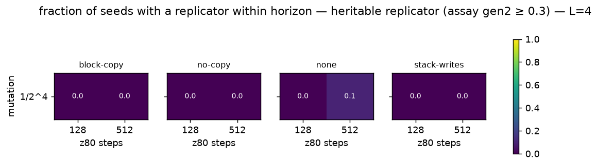

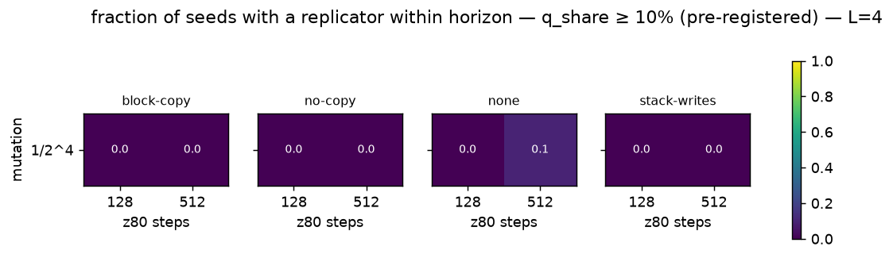

## Emergence grid — L = 9

| ablation | 128 steps · 1/2^4 | 512 steps · 1/2^4 |
|---|---|---|
| block-copy | 0/10 (median t_rep –) | 0/10 (median t_rep –) |
| no-copy | 0/10 (median t_rep –) | 0/10 (median t_rep –) |
| none | 4/10 (median t_rep 34750) | 1/10 (median t_rep 133500) |
| stack-writes | 9/10 (median t_rep 92000) | 10/10 (median t_rep 98250) |

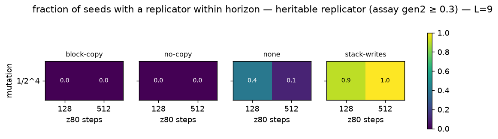

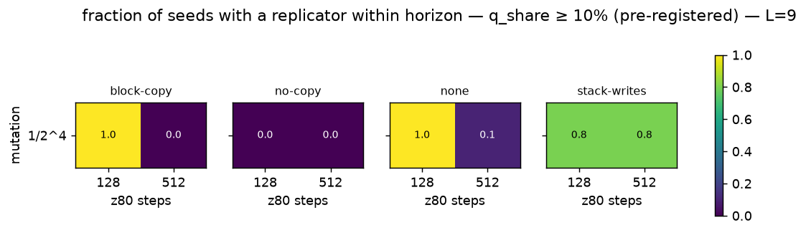

## Emergence grid — L = 25

| ablation | 128 steps · 1/2^4 | 512 steps · 1/2^4 |
|---|---|---|
| block-copy | 10/10 (median t_rep 1000) | 10/10 (median t_rep 500) |
| no-copy | 0/10 (median t_rep –) | 0/10 (median t_rep –) |
| none | 10/10 (median t_rep 1500) | 10/10 (median t_rep 500) |
| stack-writes | 10/10 (median t_rep 11750) | 10/10 (median t_rep 27250) |

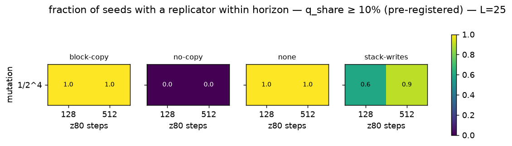

## Emergence grid — L = 36

| ablation | 128 steps · 1/2^4 | 512 steps · 1/2^4 |
|---|---|---|
| block-copy | 10/10 (median t_rep 500) | 10/10 (median t_rep 500) |
| no-copy | 0/10 (median t_rep –) | 0/10 (median t_rep –) |
| none | 10/10 (median t_rep 500) | 10/10 (median t_rep 500) |
| stack-writes | 10/10 (median t_rep 18000) | 10/10 (median t_rep 26750) |

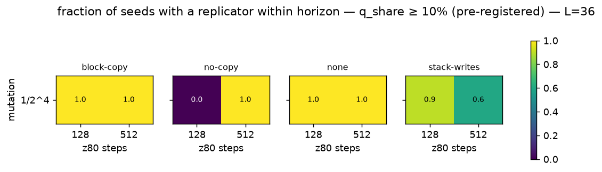

## Emergence grid — L = 49

| ablation | 128 steps · 1/2^4 | 512 steps · 1/2^4 |
|---|---|---|
| block-copy | 10/10 (median t_rep 1500) | 10/10 (median t_rep 500) |
| no-copy | 0/10 (median t_rep –) | 0/10 (median t_rep –) |
| none | 10/10 (median t_rep 1500) | 10/10 (median t_rep 500) |
| stack-writes | 6/10 (median t_rep 16250) | 10/10 (median t_rep 52500) |

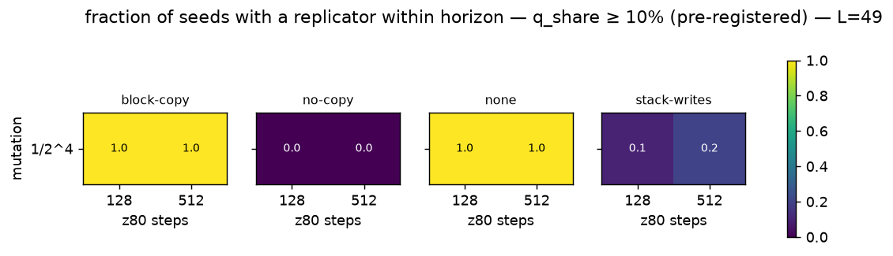

## Emergence grid — L = 64

| ablation | 128 steps · 1/2^4 | 512 steps · 1/2^4 |
|---|---|---|
| block-copy | 10/10 (median t_rep 1000) | 10/10 (median t_rep 500) |
| no-copy | 0/10 (median t_rep –) | 0/10 (median t_rep –) |
| none | 10/10 (median t_rep 1000) | 10/10 (median t_rep 500) |
| stack-writes | 10/10 (median t_rep 26750) | 10/10 (median t_rep 19250) |

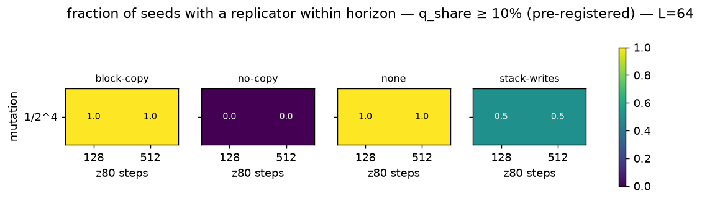

## Emergence grid — L = 81

| ablation | 128 steps · 1/2^4 | 512 steps · 1/2^4 |
|---|---|---|
| block-copy | 10/10 (median t_rep 1250) | 10/10 (median t_rep 500) |
| no-copy | 0/10 (median t_rep –) | 0/10 (median t_rep –) |
| none | 10/10 (median t_rep 1500) | 10/10 (median t_rep 500) |
| stack-writes | 7/10 (median t_rep 18500) | 9/10 (median t_rep 6500) |

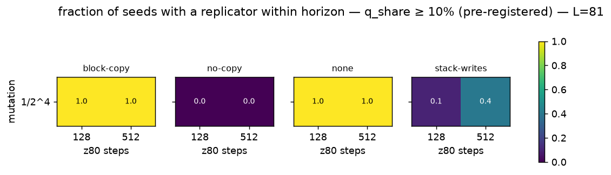

## Emergence grid — L = 100

| ablation | 128 steps · 1/2^4 | 512 steps · 1/2^4 |
|---|---|---|
| block-copy | 10/10 (median t_rep 1500) | 10/10 (median t_rep 500) |
| no-copy | 0/10 (median t_rep –) | 0/10 (median t_rep –) |
| none | 10/10 (median t_rep 1500) | 10/10 (median t_rep 500) |
| stack-writes | 10/10 (median t_rep 16500) | 10/10 (median t_rep 5250) |

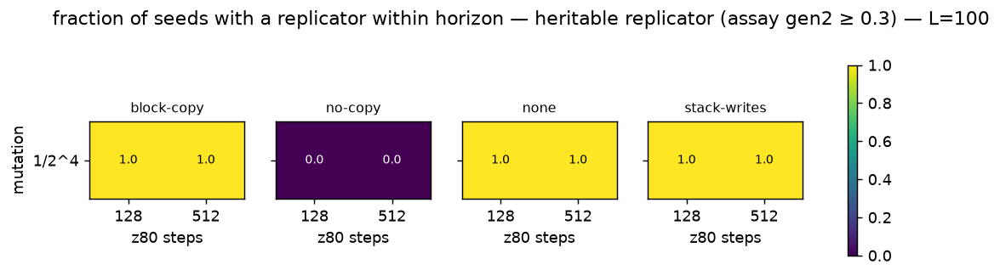

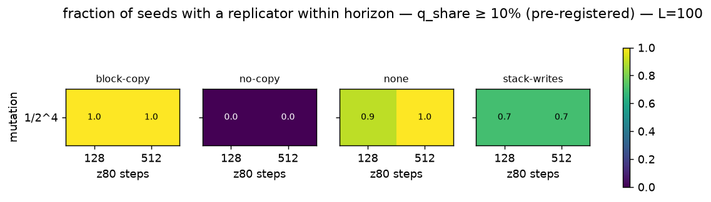

## Succession (census takeover times, final family)

| label        |   tape |   steps |   k |   n | final          |   stack_takeover_n |   stack_takeover_med |   ldir_takeover_n |   ldir_takeover_med |   ldir_invasion_med_steps |   stack_plateau_med |
|:-------------|-------:|--------:|----:|----:|:---------------|-------------------:|---------------------:|------------------:|--------------------:|--------------------------:|--------------------:|
| block-copy   |      4 |     128 |   4 |  10 | none:10        |                  0 |                  nan |                 0 |                 nan |                       nan |                 nan |
| block-copy   |      4 |     512 |   4 |  10 | none:10        |                  0 |                  nan |                 0 |                 nan |                       nan |                 nan |
| block-copy   |      9 |     128 |   4 |  10 | none:10        |                  0 |                  nan |                 0 |                 nan |                       nan |                 nan |
| block-copy   |      9 |     512 |   4 |  10 | none:10        |                  0 |                  nan |                 0 |                 nan |                       nan |                 nan |
| block-copy   |     25 |     128 |   4 |  10 | push:10        |                 10 |                 2000 |                 0 |                 nan |                       nan |                   1 |
| block-copy   |     25 |     512 |   4 |  10 | push:10        |                 10 |                 2000 |                 0 |                 nan |                       nan |                   0 |
| block-copy   |     36 |     128 |   4 |  10 | push:10        |                 10 |                 1500 |                 0 |                 nan |                       nan |                   1 |
| block-copy   |     36 |     512 |   4 |  10 | push:10        |                 10 |                 2500 |                 0 |                 nan |                       nan |                   1 |
| block-copy   |     49 |     128 |   4 |  10 | push:10        |                 10 |                 1500 |                 0 |                 nan |                       nan |                   1 |
| block-copy   |     49 |     512 |   4 |  10 | push:10        |                 10 |                  500 |                 0 |                 nan |                       nan |                   1 |
| block-copy   |     64 |     128 |   4 |  10 | push:10        |                 10 |                 2000 |                 0 |                 nan |                       nan |                   1 |
| block-copy   |     64 |     512 |   4 |  10 | push:10        |                 10 |                  500 |                 0 |                 nan |                       nan |                   1 |
| block-copy   |     81 |     128 |   4 |  10 | push:10        |                 10 |                 1500 |                 0 |                 nan |                       nan |                   1 |
| block-copy   |     81 |     512 |   4 |  10 | push:10        |                 10 |                  500 |                 0 |                 nan |                       nan |                   1 |
| block-copy   |    100 |     128 |   4 |  10 | push:10        |                 10 |                 3000 |                 0 |                 nan |                       nan |                   1 |
| block-copy   |    100 |     512 |   4 |  10 | push:10        |                 10 |                 1000 |                 0 |                 nan |                       nan |                   1 |
| no-copy      |      4 |     128 |   4 |  10 | none:10        |                  0 |                  nan |                 0 |                 nan |                       nan |                 nan |
| no-copy      |      4 |     512 |   4 |  10 | none:10        |                  0 |                  nan |                 0 |                 nan |                       nan |                 nan |
| no-copy      |      9 |     128 |   4 |  10 | none:10        |                  0 |                  nan |                 0 |                 nan |                       nan |                 nan |
| no-copy      |      9 |     512 |   4 |  10 | none:10        |                  0 |                  nan |                 0 |                 nan |                       nan |                 nan |
| no-copy      |     25 |     128 |   4 |  10 | none:10        |                  0 |                  nan |                 0 |                 nan |                       nan |                 nan |
| no-copy      |     25 |     512 |   4 |  10 | none:10        |                  0 |                  nan |                 0 |                 nan |                       nan |                 nan |
| no-copy      |     36 |     128 |   4 |  10 | flooded:10     |                  0 |                  nan |                 0 |                 nan |                       nan |                 nan |
| no-copy      |     36 |     512 |   4 |  10 | flooded:10     |                  0 |                  nan |                 0 |                 nan |                       nan |                 nan |
| no-copy      |     49 |     128 |   4 |  10 | flooded:10     |                  0 |                  nan |                 0 |                 nan |                       nan |                 nan |
| no-copy      |     49 |     512 |   4 |  10 | flooded:10     |                  0 |                  nan |                 0 |                 nan |                       nan |                 nan |
| no-copy      |     64 |     128 |   4 |  10 | flooded:10     |                  0 |                  nan |                 0 |                 nan |                       nan |                 nan |
| no-copy      |     64 |     512 |   4 |  10 | flooded:10     |                  0 |                  nan |                 0 |                 nan |                       nan |                 nan |
| no-copy      |     81 |     128 |   4 |  10 | flooded:10     |                  0 |                  nan |                 0 |                 nan |                       nan |                 nan |
| no-copy      |     81 |     512 |   4 |  10 | flooded:10     |                  0 |                  nan |                 0 |                 nan |                       nan |                 nan |
| no-copy      |    100 |     128 |   4 |  10 | flooded:10     |                  0 |                  nan |                 0 |                 nan |                       nan |                 nan |
| no-copy      |    100 |     512 |   4 |  10 | flooded:10     |                  0 |                  nan |                 0 |                 nan |                       nan |                 nan |
| none         |      4 |     128 |   4 |  10 | none:10        |                  0 |                  nan |                 0 |                 nan |                       nan |                 nan |
| none         |      4 |     512 |   4 |  10 | none:10        |                  0 |                  nan |                 0 |                 nan |                       nan |                 nan |
| none         |      9 |     128 |   4 |  10 | none:6, ldir:4 |                  0 |                  nan |                 4 |               37250 |                     14500 |                 nan |
| none         |      9 |     512 |   4 |  10 | none:9, ldir:1 |                  0 |                  nan |                 1 |              136000 |                       nan |                 nan |
| none         |     25 |     128 |   4 |  10 | push:10        |                 10 |                 2000 |                 0 |                 nan |                       nan |                   1 |
| none         |     25 |     512 |   4 |  10 | push:8, ldir:2 |                 10 |                 1750 |                 2 |              172750 |                      1500 |                   0 |
| none         |     36 |     128 |   4 |  10 | push:10        |                 10 |                 1500 |                 0 |                 nan |                       nan |                   1 |
| none         |     36 |     512 |   4 |  10 | push:7, ldir:3 |                 10 |                 2500 |                 3 |               85500 |                      1500 |                   1 |
| none         |     49 |     128 |   4 |  10 | push:9, ldir:1 |                 10 |                 1500 |                 1 |              188500 |                      1000 |                   1 |
| none         |     49 |     512 |   4 |  10 | push:10        |                 10 |                  500 |                 0 |                 nan |                       nan |                   1 |
| none         |     64 |     128 |   4 |  10 | push:10        |                 10 |                 1750 |                 0 |                 nan |                       nan |                   1 |
| none         |     64 |     512 |   4 |  10 | push:10        |                 10 |                  750 |                 0 |                 nan |                       nan |                   1 |
| none         |     81 |     128 |   4 |  10 | push:9, ldir:1 |                  9 |                 2000 |                 1 |                1500 |                      2000 |                   1 |
| none         |     81 |     512 |   4 |  10 | push:10        |                 10 |                  500 |                 0 |                 nan |                       nan |                   1 |
| none         |    100 |     128 |   4 |  10 | push:5, ldir:5 |                  6 |                 3000 |                 5 |                2500 |                      1000 |                   1 |
| none         |    100 |     512 |   4 |  10 | push:10        |                 10 |                 1000 |                 0 |                 nan |                       nan |                   1 |
| stack-writes |      4 |     128 |   4 |  10 | none:10        |                  0 |                  nan |                 0 |                 nan |                       nan |                 nan |
| stack-writes |      4 |     512 |   4 |  10 | none:10        |                  0 |                  nan |                 0 |                 nan |                       nan |                 nan |
| stack-writes |      9 |     128 |   4 |  10 | ldir:9, none:1 |                  0 |                  nan |                 9 |               93500 |                      4500 |                 nan |
| stack-writes |      9 |     512 |   4 |  10 | ldir:10        |                  0 |                  nan |                10 |               90750 |                      5500 |                 nan |
| stack-writes |     25 |     128 |   4 |  10 | ldir:10        |                  0 |                  nan |                10 |                8750 |                      1250 |                 nan |
| stack-writes |     25 |     512 |   4 |  10 | ldir:10        |                  1 |               132000 |                10 |               27750 |                      1250 |                 nan |
| stack-writes |     36 |     128 |   4 |  10 | ldir:10        |                  1 |                22500 |                10 |               13250 |                      1500 |                 nan |
| stack-writes |     36 |     512 |   4 |  10 | ldir:10        |                  1 |                65500 |                10 |               27000 |                      1000 |                 nan |
| stack-writes |     49 |     128 |   4 |  10 | ldir:10        |                  0 |                  nan |                10 |                4500 |                      1000 |                 nan |
| stack-writes |     49 |     512 |   4 |  10 | ldir:10        |                  4 |                38000 |                10 |               41250 |                      1250 |                 nan |
| stack-writes |     64 |     128 |   4 |  10 | ldir:10        |                  3 |                18500 |                10 |               14000 |                      1000 |                 nan |
| stack-writes |     64 |     512 |   4 |  10 | ldir:10        |                  4 |                15000 |                10 |               14250 |                      1000 |                 nan |
| stack-writes |     81 |     128 |   4 |  10 | ldir:10        |                  1 |                84500 |                10 |                2250 |                      1000 |                 nan |
| stack-writes |     81 |     512 |   4 |  10 | ldir:10        |                  2 |                73000 |                10 |                8000 |                      1000 |                 nan |
| stack-writes |    100 |     128 |   4 |  10 | ldir:10        |                  1 |                 1500 |                10 |                1000 |                       500 |                 nan |
| stack-writes |    100 |     512 |   4 |  10 | ldir:10        |                  1 |                 5500 |                10 |                4750 |                      1250 |                 nan |

## Replicator zoo — runs/stageB

## block-copy · L=25 · 128 steps · mutation 1/2^4
**first** (10 seeds)
- 6× `c5 01 c5 01 c5 01 c5 01 c5 01 c5 01 c5 01 c5 01 c5 01 c5 01 c5 01 c5 01 c5` — PUSH rr ; LD rr,nn ; PUSH rr ; LD rr,nn ; PUSH rr ; LD rr,nn ; PUSH rr ; LD rr,nn ; PUSH rr ; LD rr,nn ; PUSH rr ; LD rr,nn ; PUSH rr
- 4× `01 c5 01 c5 01 c5 01 c5 01 c5 01 c5 01 c5 01 c5 01 c5 01 c5 01 c5 01 c5 01` — LD rr,nn ; PUSH rr ; LD rr,nn ; PUSH rr ; LD rr,nn ; PUSH rr ; LD rr,nn ; PUSH rr ; LD rr,nn ; PUSH rr ; LD rr,nn ; PUSH rr ; LD rr,nn

**final** (10 seeds)
- 10× `c5 01 c5 01 c5 01 c5 01 c5 01 c5 01 c5 01 c5 01 c5 01 c5 01 c5 01 c5 01 c5` — PUSH rr ; LD rr,nn ; PUSH rr ; LD rr,nn ; PUSH rr ; LD rr,nn ; PUSH rr ; LD rr,nn ; PUSH rr ; LD rr,nn ; PUSH rr ; LD rr,nn ; PUSH rr

## block-copy · L=25 · 512 steps · mutation 1/2^4
**first** (10 seeds)
- 5× `e5 21 e5 21 e5 21 e5 21 e5 21 e5 21 e5 21 e5 21 e5 21 e5 21 e5 21 e5 21 e5` — PUSH rr ; LD rr,nn ; PUSH rr ; LD rr,nn ; PUSH rr ; LD rr,nn ; PUSH rr ; LD rr,nn ; PUSH rr ; LD rr,nn ; PUSH rr ; LD rr,nn ; PUSH rr
- 5× `01 c5 01 c5 01 c5 01 c5 01 c5 01 c5 01 c5 01 c5 01 c5 01 c5 01 c5 01 c5 01` — LD rr,nn ; PUSH rr ; LD rr,nn ; PUSH rr ; LD rr,nn ; PUSH rr ; LD rr,nn ; PUSH rr ; LD rr,nn ; PUSH rr ; LD rr,nn ; PUSH rr ; LD rr,nn

**final** (10 seeds)
- 10× `e5 21 e5 21 e5 21 e5 21 e5 21 e5 21 e5 21 e5 21 e5 21 e5 21 e5 21 e5 21 e5` — PUSH rr ; LD rr,nn ; PUSH rr ; LD rr,nn ; PUSH rr ; LD rr,nn ; PUSH rr ; LD rr,nn ; PUSH rr ; LD rr,nn ; PUSH rr ; LD rr,nn ; PUSH rr

## block-copy · L=36 · 128 steps · mutation 1/2^4
**first** (10 seeds)
- 10× `11 d5 11 d5 11 d5 11 d5 11 d5 11 d5 11 d5 11 d5 11 d5 11 d5 11 d5 11 d5 11 d5 11 d5 11 d5 11 d5 11 d5 11 d5` — LD rr,nn ; PUSH rr ; LD rr,nn ; PUSH rr ; LD rr,nn ; PUSH rr ; LD rr,nn ; PUSH rr ; LD rr,nn ; PUSH rr ; LD rr,nn ; PUSH rr ; LD rr,nn ; PUSH rr ; LD rr,nn ; PUSH rr ; LD rr,nn ; PUSH rr

**final** (10 seeds)
- 10× `01 c5 01 c5 01 c5 01 c5 01 c5 01 c5 01 c5 01 c5 01 c5 01 c5 01 c5 01 c5 01 c5 01 c5 01 c5 01 c5 01 c5 01 c5` — LD rr,nn ; PUSH rr ; LD rr,nn ; PUSH rr ; LD rr,nn ; PUSH rr ; LD rr,nn ; PUSH rr ; LD rr,nn ; PUSH rr ; LD rr,nn ; PUSH rr ; LD rr,nn ; PUSH rr ; LD rr,nn ; PUSH rr ; LD rr,nn ; PUSH rr

## block-copy · L=36 · 512 steps · mutation 1/2^4
**first** (10 seeds)
- 10× `01 c5 01 c5 01 c5 01 c5 01 c5 01 c5 01 c5 01 c5 01 c5 01 c5 01 c5 01 c5 01 c5 01 c5 01 c5 01 c5 01 c5 01 c5` — LD rr,nn ; PUSH rr ; LD rr,nn ; PUSH rr ; LD rr,nn ; PUSH rr ; LD rr,nn ; PUSH rr ; LD rr,nn ; PUSH rr ; LD rr,nn ; PUSH rr ; LD rr,nn ; PUSH rr ; LD rr,nn ; PUSH rr ; LD rr,nn ; PUSH rr

**final** (4 seeds)
- 4× `11 d5 11 d5 11 d5 11 d5 11 d5 11 d5 11 d5 11 d5 11 d5 11 d5 11 d5 11 d5 11 d5 11 d5 11 d5 11 d5 11 d5 11 d5` — LD rr,nn ; PUSH rr ; LD rr,nn ; PUSH rr ; LD rr,nn ; PUSH rr ; LD rr,nn ; PUSH rr ; LD rr,nn ; PUSH rr ; LD rr,nn ; PUSH rr ; LD rr,nn ; PUSH rr ; LD rr,nn ; PUSH rr ; LD rr,nn ; PUSH rr

## block-copy · L=49 · 128 steps · mutation 1/2^4
**first** (10 seeds)
- 10× `01 c5 01 c5 01 c5 01 c5 01 c5 01 c5 01 c5 01 c5 01 c5 01 c5 01 c5 01 c5 01 c5 01 c5 01 c5 01 c5 01 c5 01 c5 01 c5 01 c5 01 c5 01 c5 01 c5 01 c5 01` — LD rr,nn ; PUSH rr ; LD rr,nn ; PUSH rr ; LD rr,nn ; PUSH rr ; LD rr,nn ; PUSH rr ; LD rr,nn ; PUSH rr ; LD rr,nn ; PUSH rr ; LD rr,nn ; PUSH rr ; LD rr,nn ; PUSH rr ; LD rr,nn ; PUSH rr ; LD rr,nn ; PUSH rr ; LD rr,nn ; PUSH rr ; LD rr,nn ; PUSH rr ; LD rr,nn

**final** (10 seeds)
- 9× `c5 01 c5 01 c5 01 c5 01 c5 01 c5 01 c5 01 c5 01 c5 01 c5 01 c5 01 c5 01 c5 01 c5 01 c5 01 c5 01 c5 01 c5 01 c5 01 c5 01 c5 01 c5 01 c5 01 c5 01 c5` — PUSH rr ; LD rr,nn ; PUSH rr ; LD rr,nn ; PUSH rr ; LD rr,nn ; PUSH rr ; LD rr,nn ; PUSH rr ; LD rr,nn ; PUSH rr ; LD rr,nn ; PUSH rr ; LD rr,nn ; PUSH rr ; LD rr,nn ; PUSH rr ; LD rr,nn ; PUSH rr ; LD rr,nn ; PUSH rr ; LD rr,nn ; PUSH rr ; LD rr,nn ; PUSH rr
- 1× `01 c5 01 c5 01 c5 01 c5 01 c5 01 c5 01 c5 01 c5 01 c5 01 c5 01 c5 01 c5 01 c5 01 c5 01 c5 01 c5 01 c5 01 c5 01 c5 01 c5 01 c5 01 c5 01 c5 01 c5 01` — LD rr,nn ; PUSH rr ; LD rr,nn ; PUSH rr ; LD rr,nn ; PUSH rr ; LD rr,nn ; PUSH rr ; LD rr,nn ; PUSH rr ; LD rr,nn ; PUSH rr ; LD rr,nn ; PUSH rr ; LD rr,nn ; PUSH rr ; LD rr,nn ; PUSH rr ; LD rr,nn ; PUSH rr ; LD rr,nn ; PUSH rr ; LD rr,nn ; PUSH rr ; LD rr,nn

## block-copy · L=49 · 512 steps · mutation 1/2^4
**first** (10 seeds)
- 7× `01 c5 01 c5 01 c5 01 c5 01 c5 01 c5 01 c5 01 c5 01 c5 01 c5 01 c5 01 c5 01 c5 01 c5 01 c5 01 c5 01 c5 01 c5 01 c5 01 c5 01 c5 01 c5 01 c5 01 c5 01` — LD rr,nn ; PUSH rr ; LD rr,nn ; PUSH rr ; LD rr,nn ; PUSH rr ; LD rr,nn ; PUSH rr ; LD rr,nn ; PUSH rr ; LD rr,nn ; PUSH rr ; LD rr,nn ; PUSH rr ; LD rr,nn ; PUSH rr ; LD rr,nn ; PUSH rr ; LD rr,nn ; PUSH rr ; LD rr,nn ; PUSH rr ; LD rr,nn ; PUSH rr ; LD rr,nn
- 3× `c5 01 c5 01 c5 01 c5 01 c5 01 c5 01 c5 01 c5 01 c5 01 c5 01 c5 01 c5 01 c5 01 c5 01 c5 01 c5 01 c5 01 c5 01 c5 01 c5 01 c5 01 c5 01 c5 01 c5 01 c5` — PUSH rr ; LD rr,nn ; PUSH rr ; LD rr,nn ; PUSH rr ; LD rr,nn ; PUSH rr ; LD rr,nn ; PUSH rr ; LD rr,nn ; PUSH rr ; LD rr,nn ; PUSH rr ; LD rr,nn ; PUSH rr ; LD rr,nn ; PUSH rr ; LD rr,nn ; PUSH rr ; LD rr,nn ; PUSH rr ; LD rr,nn ; PUSH rr ; LD rr,nn ; PUSH rr

**final** (10 seeds)
- 10× `01 c5 01 c5 01 c5 01 c5 01 c5 01 c5 01 c5 01 c5 01 c5 01 c5 01 c5 01 c5 01 c5 01 c5 01 c5 01 c5 01 c5 01 c5 01 c5 01 c5 01 c5 01 c5 01 c5 01 c5 01` — LD rr,nn ; PUSH rr ; LD rr,nn ; PUSH rr ; LD rr,nn ; PUSH rr ; LD rr,nn ; PUSH rr ; LD rr,nn ; PUSH rr ; LD rr,nn ; PUSH rr ; LD rr,nn ; PUSH rr ; LD rr,nn ; PUSH rr ; LD rr,nn ; PUSH rr ; LD rr,nn ; PUSH rr ; LD rr,nn ; PUSH rr ; LD rr,nn ; PUSH rr ; LD rr,nn

## block-copy · L=64 · 128 steps · mutation 1/2^4
**first** (10 seeds)
- 10× `01 c5 01 c5 01 c5 01 c5 01 c5 01 c5 01 c5 01 c5 01 c5 01 c5 01 c5 01 c5 01 c5 01 c5 01 c5 01 c5 01 c5 01 c5 01 c5 01 c5 01 c5 01 c5 01 c5 01 c5 01 c5 01 c5 01 c5 01 c5 01 c5 01 c5 01 c5 01 c5` — LD rr,nn ; PUSH rr ; LD rr,nn ; PUSH rr ; LD rr,nn ; PUSH rr ; LD rr,nn ; PUSH rr ; LD rr,nn ; PUSH rr ; LD rr,nn ; PUSH rr ; LD rr,nn ; PUSH rr ; LD rr,nn ; PUSH rr ; LD rr,nn ; PUSH rr ; LD rr,nn ; PUSH rr ; LD rr,nn ; PUSH rr ; LD rr,nn ; PUSH rr ; LD rr,nn ; PUSH rr ; LD rr,nn ; PUSH rr ; LD rr,nn ; PUSH rr ; LD rr,nn ; PUSH rr

**final** (10 seeds)
- 10× `01 c5 01 c5 01 c5 01 c5 01 c5 01 c5 01 c5 01 c5 01 c5 01 c5 01 c5 01 c5 01 c5 01 c5 01 c5 01 c5 01 c5 01 c5 01 c5 01 c5 01 c5 01 c5 01 c5 01 c5 01 c5 01 c5 01 c5 01 c5 01 c5 01 c5 01 c5 01 c5` — LD rr,nn ; PUSH rr ; LD rr,nn ; PUSH rr ; LD rr,nn ; PUSH rr ; LD rr,nn ; PUSH rr ; LD rr,nn ; PUSH rr ; LD rr,nn ; PUSH rr ; LD rr,nn ; PUSH rr ; LD rr,nn ; PUSH rr ; LD rr,nn ; PUSH rr ; LD rr,nn ; PUSH rr ; LD rr,nn ; PUSH rr ; LD rr,nn ; PUSH rr ; LD rr,nn ; PUSH rr ; LD rr,nn ; PUSH rr ; LD rr,nn ; PUSH rr ; LD rr,nn ; PUSH rr

## block-copy · L=64 · 512 steps · mutation 1/2^4
**first** (10 seeds)
- 10× `01 c5 01 c5 01 c5 01 c5 01 c5 01 c5 01 c5 01 c5 01 c5 01 c5 01 c5 01 c5 01 c5 01 c5 01 c5 01 c5 01 c5 01 c5 01 c5 01 c5 01 c5 01 c5 01 c5 01 c5 01 c5 01 c5 01 c5 01 c5 01 c5 01 c5 01 c5 01 c5` — LD rr,nn ; PUSH rr ; LD rr,nn ; PUSH rr ; LD rr,nn ; PUSH rr ; LD rr,nn ; PUSH rr ; LD rr,nn ; PUSH rr ; LD rr,nn ; PUSH rr ; LD rr,nn ; PUSH rr ; LD rr,nn ; PUSH rr ; LD rr,nn ; PUSH rr ; LD rr,nn ; PUSH rr ; LD rr,nn ; PUSH rr ; LD rr,nn ; PUSH rr ; LD rr,nn ; PUSH rr ; LD rr,nn ; PUSH rr ; LD rr,nn ; PUSH rr ; LD rr,nn ; PUSH rr

**final** (10 seeds)
- 10× `21 e5 21 e5 21 e5 21 e5 21 e5 21 e5 21 e5 21 e5 21 e5 21 e5 21 e5 21 e5 21 e5 21 e5 21 e5 21 e5 21 e5 21 e5 21 e5 21 e5 21 e5 21 e5 21 e5 21 e5 21 e5 21 e5 21 e5 21 e5 21 e5 21 e5 21 e5 21 e5` — LD rr,nn ; PUSH rr ; LD rr,nn ; PUSH rr ; LD rr,nn ; PUSH rr ; LD rr,nn ; PUSH rr ; LD rr,nn ; PUSH rr ; LD rr,nn ; PUSH rr ; LD rr,nn ; PUSH rr ; LD rr,nn ; PUSH rr ; LD rr,nn ; PUSH rr ; LD rr,nn ; PUSH rr ; LD rr,nn ; PUSH rr ; LD rr,nn ; PUSH rr ; LD rr,nn ; PUSH rr ; LD rr,nn ; PUSH rr ; LD rr,nn ; PUSH rr ; LD rr,nn ; PUSH rr

## block-copy · L=81 · 128 steps · mutation 1/2^4
**first** (10 seeds)
- 10× `c5 01 c5 01 c5 01 c5 01 c5 01 c5 01 c5 01 c5 01 c5 01 c5 01 c5 01 c5 01 c5 01 c5 01 c5 01 c5 01 c5 01 c5 01 c5 01 c5 01 c5 01 c5 01 c5 01 c5 01 c5 01 c5 01 c5 01 c5 01 c5 01 c5 01 c5 01 c5 01 c5 01 c5 01 c5 01 c5 01 c5 01 c5 01 c5 01 00 00 01` — PUSH rr ; LD rr,nn ; PUSH rr ; LD rr,nn ; PUSH rr ; LD rr,nn ; PUSH rr ; LD rr,nn ; PUSH rr ; LD rr,nn ; PUSH rr ; LD rr,nn ; PUSH rr ; LD rr,nn ; PUSH rr ; LD rr,nn ; PUSH rr ; LD rr,nn ; PUSH rr ; LD rr,nn ; PUSH rr ; LD rr,nn ; PUSH rr ; LD rr,nn ; PUSH rr ; LD rr,nn ; PUSH rr ; LD rr,nn ; PUSH rr ; LD rr,nn ; PUSH rr ; LD rr,nn ; PUSH rr ; LD rr,nn ; PUSH rr ; LD rr,nn ; PUSH rr ; LD rr,nn ; PUSH rr ; LD rr,nn×2

## block-copy · L=81 · 512 steps · mutation 1/2^4
**first** (10 seeds)
- 6× `c5 01 c5 01 c5 01 c5 01 c5 01 c5 01 c5 01 c5 01 c5 01 c5 01 c5 01 c5 01 c5 01 c5 01 c5 01 c5 01 c5 01 c5 01 c5 01 c5 01 c5 01 c5 01 c5 01 c5 01 c5 01 c5 01 c5 01 c5 01 c5 01 c5 01 c5 01 c5 01 c5 01 c5 01 c5 01 c5 01 c5 01 c5 01 c5 01 c5 01 c5` — PUSH rr ; LD rr,nn ; PUSH rr ; LD rr,nn ; PUSH rr ; LD rr,nn ; PUSH rr ; LD rr,nn ; PUSH rr ; LD rr,nn ; PUSH rr ; LD rr,nn ; PUSH rr ; LD rr,nn ; PUSH rr ; LD rr,nn ; PUSH rr ; LD rr,nn ; PUSH rr ; LD rr,nn ; PUSH rr ; LD rr,nn ; PUSH rr ; LD rr,nn ; PUSH rr ; LD rr,nn ; PUSH rr ; LD rr,nn ; PUSH rr ; LD rr,nn ; PUSH rr ; LD rr,nn ; PUSH rr ; LD rr,nn ; PUSH rr ; LD rr,nn ; PUSH rr ; LD rr,nn ; PUSH rr ; LD rr,nn ; PUSH rr
- 4× `21 e5 21 e5 21 e5 21 e5 21 e5 21 e5 21 e5 21 e5 21 e5 21 e5 21 e5 21 e5 21 e5 21 e5 21 e5 21 e5 21 e5 21 e5 21 e5 21 e5 21 e5 21 e5 21 e5 21 e5 21 e5 21 e5 21 e5 21 e5 21 e5 21 e5 21 e5 21 e5 21 e5 21 e5 21 e5 21 e5 21 e5 21 e5 21 e5 21 e5 21` — LD rr,nn ; PUSH rr ; LD rr,nn ; PUSH rr ; LD rr,nn ; PUSH rr ; LD rr,nn ; PUSH rr ; LD rr,nn ; PUSH rr ; LD rr,nn ; PUSH rr ; LD rr,nn ; PUSH rr ; LD rr,nn ; PUSH rr ; LD rr,nn ; PUSH rr ; LD rr,nn ; PUSH rr ; LD rr,nn ; PUSH rr ; LD rr,nn ; PUSH rr ; LD rr,nn ; PUSH rr ; LD rr,nn ; PUSH rr ; LD rr,nn ; PUSH rr ; LD rr,nn ; PUSH rr ; LD rr,nn ; PUSH rr ; LD rr,nn ; PUSH rr ; LD rr,nn ; PUSH rr ; LD rr,nn ; PUSH rr ; LD rr,nn

**final** (10 seeds)
- 10× `c5 01 c5 01 c5 01 c5 01 c5 01 c5 01 c5 01 c5 01 c5 01 c5 01 c5 01 c5 01 c5 01 c5 01 c5 01 c5 01 c5 01 c5 01 c5 01 c5 01 c5 01 c5 01 c5 01 c5 01 c5 01 c5 01 c5 01 c5 01 c5 01 c5 01 c5 01 c5 01 c5 01 c5 01 c5 01 c5 01 c5 01 c5 01 c5 01 c5 01 c5` — PUSH rr ; LD rr,nn ; PUSH rr ; LD rr,nn ; PUSH rr ; LD rr,nn ; PUSH rr ; LD rr,nn ; PUSH rr ; LD rr,nn ; PUSH rr ; LD rr,nn ; PUSH rr ; LD rr,nn ; PUSH rr ; LD rr,nn ; PUSH rr ; LD rr,nn ; PUSH rr ; LD rr,nn ; PUSH rr ; LD rr,nn ; PUSH rr ; LD rr,nn ; PUSH rr ; LD rr,nn ; PUSH rr ; LD rr,nn ; PUSH rr ; LD rr,nn ; PUSH rr ; LD rr,nn ; PUSH rr ; LD rr,nn ; PUSH rr ; LD rr,nn ; PUSH rr ; LD rr,nn ; PUSH rr ; LD rr,nn ; PUSH rr

## block-copy · L=100 · 128 steps · mutation 1/2^4
**first** (10 seeds)
- 10× `01 c5 01 c5 01 c5 01 c5 01 c5 01 c5 01 c5 01 c5 01 c5 01 c5 01 c5 01 c5 01 c5 01 c5 01 c5 01 c5 01 c5 01 c5 01 c5 01 c5 01 c5 01 c5 01 c5 01 c5 01 c5 01 c5 01 c5 01 c5 01 c5 01 c5 01 c5 01 c5 01 c5 01 c5 01 c5 01 c5 01 c5 01 c5 01 c5 01 c5 01 c5 01 c5 01 c5 01 c5 01 c5 01 c5 01 c5 01 c5 01 c5 01 c5` — LD rr,nn ; PUSH rr ; LD rr,nn ; PUSH rr ; LD rr,nn ; PUSH rr ; LD rr,nn ; PUSH rr ; LD rr,nn ; PUSH rr ; LD rr,nn ; PUSH rr ; LD rr,nn ; PUSH rr ; LD rr,nn ; PUSH rr ; LD rr,nn ; PUSH rr ; LD rr,nn ; PUSH rr ; LD rr,nn ; PUSH rr ; LD rr,nn ; PUSH rr ; LD rr,nn ; PUSH rr ; LD rr,nn ; PUSH rr ; LD rr,nn ; PUSH rr ; LD rr,nn ; PUSH rr ; LD rr,nn ; PUSH rr ; LD rr,nn ; PUSH rr ; LD rr,nn ; PUSH rr ; LD rr,nn ; PUSH rr ; LD rr,nn ; PUSH rr ; LD rr,nn ; PUSH rr ; LD rr,nn ; PUSH rr ; LD rr,nn ; PUSH rr ; LD rr,nn ; PUSH rr

**final** (10 seeds)
- 9× `01 c5 01 c5 01 c5 01 c5 01 c5 01 c5 01 c5 01 c5 01 c5 01 c5 01 c5 01 c5 01 c5 01 c5 01 c5 01 c5 01 c5 01 c5 01 c5 01 c5 01 c5 01 c5 01 c5 01 c5 01 c5 01 c5 01 c5 01 c5 01 c5 01 c5 01 c5 01 c5 01 c5 01 c5 01 c5 01 c5 01 c5 01 c5 01 c5 01 c5 01 c5 01 c5 01 c5 01 c5 01 c5 01 c5 01 c5 01 c5 01 c5 01 c5` — LD rr,nn ; PUSH rr ; LD rr,nn ; PUSH rr ; LD rr,nn ; PUSH rr ; LD rr,nn ; PUSH rr ; LD rr,nn ; PUSH rr ; LD rr,nn ; PUSH rr ; LD rr,nn ; PUSH rr ; LD rr,nn ; PUSH rr ; LD rr,nn ; PUSH rr ; LD rr,nn ; PUSH rr ; LD rr,nn ; PUSH rr ; LD rr,nn ; PUSH rr ; LD rr,nn ; PUSH rr ; LD rr,nn ; PUSH rr ; LD rr,nn ; PUSH rr ; LD rr,nn ; PUSH rr ; LD rr,nn ; PUSH rr ; LD rr,nn ; PUSH rr ; LD rr,nn ; PUSH rr ; LD rr,nn ; PUSH rr ; LD rr,nn ; PUSH rr ; LD rr,nn ; PUSH rr ; LD rr,nn ; PUSH rr ; LD rr,nn ; PUSH rr ; LD rr,nn ; PUSH rr
- 1× `c2 c5 01 c5 01 c5 01 c5 c2 c5 c2 c5 01 c5 01 c5 01 c5 c2 c5 c2 c5 01 c5 01 c5 01 c5 c2 c5 c2 c5 01 c5 01 c5 01 c5 c2 c5 c2 c5 01 c5 01 c5 01 c5 c2 c5 c2 c5 01 c5 01 c5 01 c5 c2 c5 c2 c5 01 c5 01 c5 01 c5 c2 c5 c2 c5 01 c5 01 c5 01 c5 c2 c5 c2 c5 01 c5 01 c5 01 c5 c2 c5 c2 c5 01 c5 01 c5 01 00 00 c5` — JP NZ,nn ; PUSH rr ; LD rr,nn ; PUSH rr ; JP NZ,nn ; PUSH rr ; LD rr,nn ; PUSH rr ; LD rr,nn ; PUSH rr ; JP NZ,nn ; PUSH rr ; LD rr,nn ; PUSH rr ; JP NZ,nn ; PUSH rr ; LD rr,nn ; PUSH rr ; LD rr,nn ; PUSH rr ; JP NZ,nn ; PUSH rr ; LD rr,nn ; PUSH rr ; JP NZ,nn ; PUSH rr ; LD rr,nn ; PUSH rr ; LD rr,nn ; PUSH rr ; JP NZ,nn ; PUSH rr ; LD rr,nn ; PUSH rr ; JP NZ,nn ; PUSH rr ; LD rr,nn ; PUSH rr ; LD rr,nn ; PUSH rr ; JP NZ,nn ; PUSH rr ; LD rr,nn ; PUSH rr ; JP NZ,nn ; PUSH rr ; LD rr,nn ; PUSH rr ; LD rr,nn ; PUSH rr

## block-copy · L=100 · 512 steps · mutation 1/2^4
**first** (10 seeds)
- 10× `01 c5 01 c5 01 c5 01 c5 01 c5 01 c5 01 c5 01 c5 01 c5 01 c5 01 c5 01 c5 01 c5 01 c5 01 c5 01 c5 01 c5 01 c5 01 c5 01 c5 01 c5 01 c5 01 c5 01 c5 01 c5 01 c5 01 c5 01 c5 01 c5 01 c5 01 c5 01 c5 01 c5 01 c5 01 c5 01 c5 01 c5 01 c5 01 c5 01 c5 01 c5 01 c5 01 c5 01 c5 01 c5 01 c5 01 c5 01 c5 01 c5 01 c5` — LD rr,nn ; PUSH rr ; LD rr,nn ; PUSH rr ; LD rr,nn ; PUSH rr ; LD rr,nn ; PUSH rr ; LD rr,nn ; PUSH rr ; LD rr,nn ; PUSH rr ; LD rr,nn ; PUSH rr ; LD rr,nn ; PUSH rr ; LD rr,nn ; PUSH rr ; LD rr,nn ; PUSH rr ; LD rr,nn ; PUSH rr ; LD rr,nn ; PUSH rr ; LD rr,nn ; PUSH rr ; LD rr,nn ; PUSH rr ; LD rr,nn ; PUSH rr ; LD rr,nn ; PUSH rr ; LD rr,nn ; PUSH rr ; LD rr,nn ; PUSH rr ; LD rr,nn ; PUSH rr ; LD rr,nn ; PUSH rr ; LD rr,nn ; PUSH rr ; LD rr,nn ; PUSH rr ; LD rr,nn ; PUSH rr ; LD rr,nn ; PUSH rr ; LD rr,nn ; PUSH rr

**final** (10 seeds)
- 10× `11 d5 11 d5 11 d5 11 d5 11 d5 11 d5 11 d5 11 d5 11 d5 11 d5 11 d5 11 d5 11 d5 11 d5 11 d5 11 d5 11 d5 11 d5 11 d5 11 d5 11 d5 11 d5 11 d5 11 d5 11 d5 11 d5 11 d5 11 d5 11 d5 11 d5 11 d5 11 d5 11 d5 11 d5 11 d5 11 d5 11 d5 11 d5 11 d5 11 d5 11 d5 11 d5 11 d5 11 d5 11 d5 11 d5 11 d5 11 d5 11 d5 11 d5` — LD rr,nn ; PUSH rr ; LD rr,nn ; PUSH rr ; LD rr,nn ; PUSH rr ; LD rr,nn ; PUSH rr ; LD rr,nn ; PUSH rr ; LD rr,nn ; PUSH rr ; LD rr,nn ; PUSH rr ; LD rr,nn ; PUSH rr ; LD rr,nn ; PUSH rr ; LD rr,nn ; PUSH rr ; LD rr,nn ; PUSH rr ; LD rr,nn ; PUSH rr ; LD rr,nn ; PUSH rr ; LD rr,nn ; PUSH rr ; LD rr,nn ; PUSH rr ; LD rr,nn ; PUSH rr ; LD rr,nn ; PUSH rr ; LD rr,nn ; PUSH rr ; LD rr,nn ; PUSH rr ; LD rr,nn ; PUSH rr ; LD rr,nn ; PUSH rr ; LD rr,nn ; PUSH rr ; LD rr,nn ; PUSH rr ; LD rr,nn ; PUSH rr ; LD rr,nn ; PUSH rr

## no-copy · L=100 · 128 steps · mutation 1/2^4
**final** (3 seeds)
- 3× `cd bb cd bb cd bb cd bb cd bb cd bb cd bb cd bb cd bb cd bb cd bb cd bb cd bb cd bb cd bb cd bb cd bb cd bb cd bb cd bb cd bb cd bb cd bb cd bb cd bb cd bb cd bb cd bb cd bb cd bb cd bb cd bb cd bb cd bb cd bb cd bf cd bf cd bf cd bf cd bf cd bf cd bf cd bf cd bf cd bf cd bf cd bf cd bf cd bf cd bf` — CALL nn×25

## none · L=4 · 512 steps · mutation 1/2^4
**first** (1 seeds)
- 1× `54 5e ed b0` — LD E,(HL) ; LDIR

**final** (1 seeds)
- 1× `bc 5e ed b0` — LD E,(HL) ; LDIR

## none · L=9 · 128 steps · mutation 1/2^4
**first** (4 seeds)
- 2× `62 14 ed b0 ed b0 62 14 ed` — LDIR×2
- 1× `c6 d1 c1 d1 e2 ed b0 9e de` — POP rr×2 ; JP PO,nn
- 1× `1d ed b0 1d ed b0 1d ed b0` — LDIR×3

**final** (4 seeds)
- 3× `00 39 00 39 00 39 00 39 00` — (no write instructions)
- 1× `1d ed b0 1d ed b0 1d ed b0` — LDIR×3

## none · L=9 · 512 steps · mutation 1/2^4
**first** (1 seeds)
- 1× `1d ed b0 1d ed b0 1d ed b0` — LDIR×3

**final** (1 seeds)
- 1× `1d ed b0 1d ed b0 1d ed b0` — LDIR×3

## none · L=25 · 128 steps · mutation 1/2^4
**first** (10 seeds)
- 7× `d5 11 d5 11 d5 11 d5 11 d5 11 d5 11 d5 11 d5 11 d5 11 d5 11 d5 11 d5 11 d5` — PUSH rr ; LD rr,nn ; PUSH rr ; LD rr,nn ; PUSH rr ; LD rr,nn ; PUSH rr ; LD rr,nn ; PUSH rr ; LD rr,nn ; PUSH rr ; LD rr,nn ; PUSH rr
- 3× `21 e5 21 e5 21 e5 21 e5 21 e5 21 e5 21 e5 21 e5 21 e5 21 e5 21 e5 21 e5 21` — LD rr,nn ; PUSH rr ; LD rr,nn ; PUSH rr ; LD rr,nn ; PUSH rr ; LD rr,nn ; PUSH rr ; LD rr,nn ; PUSH rr ; LD rr,nn ; PUSH rr ; LD rr,nn

**final** (10 seeds)
- 9× `c5 01 c5 01 c5 01 c5 01 c5 01 c5 01 c5 01 c5 01 c5 01 c5 01 c5 01 c5 01 c5` — PUSH rr ; LD rr,nn ; PUSH rr ; LD rr,nn ; PUSH rr ; LD rr,nn ; PUSH rr ; LD rr,nn ; PUSH rr ; LD rr,nn ; PUSH rr ; LD rr,nn ; PUSH rr
- 1× `01 c5 01 c5 01 c5 01 c5 01 c5 01 c5 01 c5 01 c5 01 c5 01 c5 01 c5 01 c5 01` — LD rr,nn ; PUSH rr ; LD rr,nn ; PUSH rr ; LD rr,nn ; PUSH rr ; LD rr,nn ; PUSH rr ; LD rr,nn ; PUSH rr ; LD rr,nn ; PUSH rr ; LD rr,nn

## none · L=25 · 512 steps · mutation 1/2^4
**first** (10 seeds)
- 6× `21 e5 21 e5 21 e5 21 e5 21 e5 21 e5 21 e5 21 e5 21 e5 21 e5 21 e5 21 e5 21` — LD rr,nn ; PUSH rr ; LD rr,nn ; PUSH rr ; LD rr,nn ; PUSH rr ; LD rr,nn ; PUSH rr ; LD rr,nn ; PUSH rr ; LD rr,nn ; PUSH rr ; LD rr,nn
- 4× `c5 01 c5 01 c5 01 c5 01 c5 01 c5 01 c5 01 c5 01 c5 01 c5 01 c5 01 c5 01 c5` — PUSH rr ; LD rr,nn ; PUSH rr ; LD rr,nn ; PUSH rr ; LD rr,nn ; PUSH rr ; LD rr,nn ; PUSH rr ; LD rr,nn ; PUSH rr ; LD rr,nn ; PUSH rr

**final** (10 seeds)
- 10× `e5 21 e5 21 e5 21 e5 21 e5 21 e5 21 e5 21 e5 21 e5 21 e5 21 e5 21 e5 21 e5` — PUSH rr ; LD rr,nn ; PUSH rr ; LD rr,nn ; PUSH rr ; LD rr,nn ; PUSH rr ; LD rr,nn ; PUSH rr ; LD rr,nn ; PUSH rr ; LD rr,nn ; PUSH rr

## none · L=36 · 128 steps · mutation 1/2^4
**first** (10 seeds)
- 10× `11 d5 11 d5 11 d5 11 d5 11 d5 11 d5 11 d5 11 d5 11 d5 11 d5 11 d5 11 d5 11 d5 11 d5 11 d5 11 d5 11 d5 11 d5` — LD rr,nn ; PUSH rr ; LD rr,nn ; PUSH rr ; LD rr,nn ; PUSH rr ; LD rr,nn ; PUSH rr ; LD rr,nn ; PUSH rr ; LD rr,nn ; PUSH rr ; LD rr,nn ; PUSH rr ; LD rr,nn ; PUSH rr ; LD rr,nn ; PUSH rr

**final** (10 seeds)
- 10× `01 c5 01 c5 01 c5 01 c5 01 c5 01 c5 01 c5 01 c5 01 c5 01 c5 01 c5 01 c5 01 c5 01 c5 01 c5 01 c5 01 c5 01 c5` — LD rr,nn ; PUSH rr ; LD rr,nn ; PUSH rr ; LD rr,nn ; PUSH rr ; LD rr,nn ; PUSH rr ; LD rr,nn ; PUSH rr ; LD rr,nn ; PUSH rr ; LD rr,nn ; PUSH rr ; LD rr,nn ; PUSH rr ; LD rr,nn ; PUSH rr

## none · L=36 · 512 steps · mutation 1/2^4
**first** (10 seeds)
- 10× `01 c5 01 c5 01 c5 01 c5 01 c5 01 c5 01 c5 01 c5 01 c5 01 c5 01 c5 01 c5 01 c5 01 c5 01 c5 01 c5 01 c5 01 c5` — LD rr,nn ; PUSH rr ; LD rr,nn ; PUSH rr ; LD rr,nn ; PUSH rr ; LD rr,nn ; PUSH rr ; LD rr,nn ; PUSH rr ; LD rr,nn ; PUSH rr ; LD rr,nn ; PUSH rr ; LD rr,nn ; PUSH rr ; LD rr,nn ; PUSH rr

**final** (5 seeds)
- 5× `11 d5 11 d5 11 d5 11 d5 11 d5 11 d5 11 d5 11 d5 11 d5 11 d5 11 d5 11 d5 11 d5 11 d5 11 d5 11 d5 11 d5 11 d5` — LD rr,nn ; PUSH rr ; LD rr,nn ; PUSH rr ; LD rr,nn ; PUSH rr ; LD rr,nn ; PUSH rr ; LD rr,nn ; PUSH rr ; LD rr,nn ; PUSH rr ; LD rr,nn ; PUSH rr ; LD rr,nn ; PUSH rr ; LD rr,nn ; PUSH rr

## none · L=49 · 128 steps · mutation 1/2^4
**first** (10 seeds)
- 10× `01 c5 01 c5 01 c5 01 c5 01 c5 01 c5 01 c5 01 c5 01 c5 01 c5 01 c5 01 c5 01 c5 01 c5 01 c5 01 c5 01 c5 01 c5 01 c5 01 c5 01 c5 01 c5 01 c5 01 c5 01` — LD rr,nn ; PUSH rr ; LD rr,nn ; PUSH rr ; LD rr,nn ; PUSH rr ; LD rr,nn ; PUSH rr ; LD rr,nn ; PUSH rr ; LD rr,nn ; PUSH rr ; LD rr,nn ; PUSH rr ; LD rr,nn ; PUSH rr ; LD rr,nn ; PUSH rr ; LD rr,nn ; PUSH rr ; LD rr,nn ; PUSH rr ; LD rr,nn ; PUSH rr ; LD rr,nn

**final** (10 seeds)
- 9× `c5 01 c5 01 c5 01 c5 01 c5 01 c5 01 c5 01 c5 01 c5 01 c5 01 c5 01 c5 01 c5 01 c5 01 c5 01 c5 01 c5 01 c5 01 c5 01 c5 01 c5 01 c5 01 c5 01 c5 01 c5` — PUSH rr ; LD rr,nn ; PUSH rr ; LD rr,nn ; PUSH rr ; LD rr,nn ; PUSH rr ; LD rr,nn ; PUSH rr ; LD rr,nn ; PUSH rr ; LD rr,nn ; PUSH rr ; LD rr,nn ; PUSH rr ; LD rr,nn ; PUSH rr ; LD rr,nn ; PUSH rr ; LD rr,nn ; PUSH rr ; LD rr,nn ; PUSH rr ; LD rr,nn ; PUSH rr
- 1× `11 d5 11 d5 11 d5 11 d5 11 d5 11 d5 11 d5 11 d5 11 d5 11 d5 11 d5 11 d5 11 d5 11 d5 11 d5 11 d5 11 d5 11 d5 11 d5 11 d5 11 d5 11 d5 11 d5 11 d5 11` — LD rr,nn ; PUSH rr ; LD rr,nn ; PUSH rr ; LD rr,nn ; PUSH rr ; LD rr,nn ; PUSH rr ; LD rr,nn ; PUSH rr ; LD rr,nn ; PUSH rr ; LD rr,nn ; PUSH rr ; LD rr,nn ; PUSH rr ; LD rr,nn ; PUSH rr ; LD rr,nn ; PUSH rr ; LD rr,nn ; PUSH rr ; LD rr,nn ; PUSH rr ; LD rr,nn

## none · L=49 · 512 steps · mutation 1/2^4
**first** (10 seeds)
- 7× `01 c5 01 c5 01 c5 01 c5 01 c5 01 c5 01 c5 01 c5 01 c5 01 c5 01 c5 01 c5 01 c5 01 c5 01 c5 01 c5 01 c5 01 c5 01 c5 01 c5 01 c5 01 c5 01 c5 01 c5 01` — LD rr,nn ; PUSH rr ; LD rr,nn ; PUSH rr ; LD rr,nn ; PUSH rr ; LD rr,nn ; PUSH rr ; LD rr,nn ; PUSH rr ; LD rr,nn ; PUSH rr ; LD rr,nn ; PUSH rr ; LD rr,nn ; PUSH rr ; LD rr,nn ; PUSH rr ; LD rr,nn ; PUSH rr ; LD rr,nn ; PUSH rr ; LD rr,nn ; PUSH rr ; LD rr,nn
- 3× `c5 01 c5 01 c5 01 c5 01 c5 01 c5 01 c5 01 c5 01 c5 01 c5 01 c5 01 c5 01 c5 01 c5 01 c5 01 c5 01 c5 01 c5 01 c5 01 c5 01 c5 01 c5 01 c5 01 c5 01 c5` — PUSH rr ; LD rr,nn ; PUSH rr ; LD rr,nn ; PUSH rr ; LD rr,nn ; PUSH rr ; LD rr,nn ; PUSH rr ; LD rr,nn ; PUSH rr ; LD rr,nn ; PUSH rr ; LD rr,nn ; PUSH rr ; LD rr,nn ; PUSH rr ; LD rr,nn ; PUSH rr ; LD rr,nn ; PUSH rr ; LD rr,nn ; PUSH rr ; LD rr,nn ; PUSH rr

**final** (8 seeds)
- 8× `01 c5 01 c5 01 c5 01 c5 01 c5 01 c5 01 c5 01 c5 01 c5 01 c5 01 c5 01 c5 01 c5 01 c5 01 c5 01 c5 01 c5 01 c5 01 c5 01 c5 01 c5 01 c5 01 c5 01 c5 01` — LD rr,nn ; PUSH rr ; LD rr,nn ; PUSH rr ; LD rr,nn ; PUSH rr ; LD rr,nn ; PUSH rr ; LD rr,nn ; PUSH rr ; LD rr,nn ; PUSH rr ; LD rr,nn ; PUSH rr ; LD rr,nn ; PUSH rr ; LD rr,nn ; PUSH rr ; LD rr,nn ; PUSH rr ; LD rr,nn ; PUSH rr ; LD rr,nn ; PUSH rr ; LD rr,nn

## none · L=64 · 128 steps · mutation 1/2^4
**first** (10 seeds)
- 10× `21 e5 21 e5 21 e5 21 e5 21 e5 21 e5 21 e5 21 e5 21 e5 21 e5 21 e5 21 e5 21 e5 21 e5 21 e5 21 e5 21 e5 21 e5 21 e5 21 e5 21 e5 21 e5 21 e5 21 e5 21 e5 21 e5 21 e5 21 e5 21 e5 21 e5 21 e5 21 e5` — LD rr,nn ; PUSH rr ; LD rr,nn ; PUSH rr ; LD rr,nn ; PUSH rr ; LD rr,nn ; PUSH rr ; LD rr,nn ; PUSH rr ; LD rr,nn ; PUSH rr ; LD rr,nn ; PUSH rr ; LD rr,nn ; PUSH rr ; LD rr,nn ; PUSH rr ; LD rr,nn ; PUSH rr ; LD rr,nn ; PUSH rr ; LD rr,nn ; PUSH rr ; LD rr,nn ; PUSH rr ; LD rr,nn ; PUSH rr ; LD rr,nn ; PUSH rr ; LD rr,nn ; PUSH rr

**final** (10 seeds)
- 10× `21 e5 21 e5 21 e5 21 e5 21 e5 21 e5 21 e5 21 e5 21 e5 21 e5 21 e5 21 e5 21 e5 21 e5 21 e5 21 e5 21 e5 21 e5 21 e5 21 e5 21 e5 21 e5 21 e5 21 e5 21 e5 21 e5 21 e5 21 e5 21 e5 21 e5 21 e5 21 e5` — LD rr,nn ; PUSH rr ; LD rr,nn ; PUSH rr ; LD rr,nn ; PUSH rr ; LD rr,nn ; PUSH rr ; LD rr,nn ; PUSH rr ; LD rr,nn ; PUSH rr ; LD rr,nn ; PUSH rr ; LD rr,nn ; PUSH rr ; LD rr,nn ; PUSH rr ; LD rr,nn ; PUSH rr ; LD rr,nn ; PUSH rr ; LD rr,nn ; PUSH rr ; LD rr,nn ; PUSH rr ; LD rr,nn ; PUSH rr ; LD rr,nn ; PUSH rr ; LD rr,nn ; PUSH rr

## none · L=64 · 512 steps · mutation 1/2^4
**first** (10 seeds)
- 10× `11 d5 11 d5 11 d5 11 d5 11 d5 11 d5 11 d5 11 d5 11 d5 11 d5 11 d5 11 d5 11 d5 11 d5 11 d5 11 d5 11 d5 11 d5 11 d5 11 d5 11 d5 11 d5 11 d5 11 d5 11 d5 11 d5 11 d5 11 d5 11 d5 11 d5 11 d5 11 d5` — LD rr,nn ; PUSH rr ; LD rr,nn ; PUSH rr ; LD rr,nn ; PUSH rr ; LD rr,nn ; PUSH rr ; LD rr,nn ; PUSH rr ; LD rr,nn ; PUSH rr ; LD rr,nn ; PUSH rr ; LD rr,nn ; PUSH rr ; LD rr,nn ; PUSH rr ; LD rr,nn ; PUSH rr ; LD rr,nn ; PUSH rr ; LD rr,nn ; PUSH rr ; LD rr,nn ; PUSH rr ; LD rr,nn ; PUSH rr ; LD rr,nn ; PUSH rr ; LD rr,nn ; PUSH rr

**final** (10 seeds)
- 10× `11 d5 11 d5 11 d5 11 d5 11 d5 11 d5 11 d5 11 d5 11 d5 11 d5 11 d5 11 d5 11 d5 11 d5 11 d5 11 d5 11 d5 11 d5 11 d5 11 d5 11 d5 11 d5 11 d5 11 d5 11 d5 11 d5 11 d5 11 d5 11 d5 11 d5 11 d5 11 d5` — LD rr,nn ; PUSH rr ; LD rr,nn ; PUSH rr ; LD rr,nn ; PUSH rr ; LD rr,nn ; PUSH rr ; LD rr,nn ; PUSH rr ; LD rr,nn ; PUSH rr ; LD rr,nn ; PUSH rr ; LD rr,nn ; PUSH rr ; LD rr,nn ; PUSH rr ; LD rr,nn ; PUSH rr ; LD rr,nn ; PUSH rr ; LD rr,nn ; PUSH rr ; LD rr,nn ; PUSH rr ; LD rr,nn ; PUSH rr ; LD rr,nn ; PUSH rr ; LD rr,nn ; PUSH rr

## none · L=81 · 128 steps · mutation 1/2^4
**first** (10 seeds)
- 10× `c5 01 c5 01 c5 01 c5 01 c5 01 c5 01 c5 01 c5 01 c5 01 c5 01 c5 01 c5 01 c5 01 c5 01 c5 01 c5 01 c5 01 c5 01 c5 01 c5 01 c5 01 c5 01 c5 01 c5 01 c5 01 c5 01 c5 01 c5 01 c5 01 c5 01 c5 01 c5 01 c5 01 c5 01 c5 01 c5 01 c5 01 c5 01 c5 01 00 00 01` — PUSH rr ; LD rr,nn ; PUSH rr ; LD rr,nn ; PUSH rr ; LD rr,nn ; PUSH rr ; LD rr,nn ; PUSH rr ; LD rr,nn ; PUSH rr ; LD rr,nn ; PUSH rr ; LD rr,nn ; PUSH rr ; LD rr,nn ; PUSH rr ; LD rr,nn ; PUSH rr ; LD rr,nn ; PUSH rr ; LD rr,nn ; PUSH rr ; LD rr,nn ; PUSH rr ; LD rr,nn ; PUSH rr ; LD rr,nn ; PUSH rr ; LD rr,nn ; PUSH rr ; LD rr,nn ; PUSH rr ; LD rr,nn ; PUSH rr ; LD rr,nn ; PUSH rr ; LD rr,nn ; PUSH rr ; LD rr,nn×2

**final** (1 seeds)
- 1× `c5 01 c5 01 c5 01 c5 01 c5 01 c5 01 c5 01 c5 01 c5 01 c5 01 c5 01 c5 01 c5 01 c5 01 c5 01 c5 01 c5 c5 01 c5 01 c5 01 c5 01 c5 01 c5 01 c5 01 c5 01 c5 01 c5 01 c5 01 c5 01 c5 01 c5 01 c5 01 c5 01 c5 01 c5 01 c5 01 c5 01 c5 01 c5 01 c5 01 c5 01` — PUSH rr ; LD rr,nn ; PUSH rr ; LD rr,nn ; PUSH rr ; LD rr,nn ; PUSH rr ; LD rr,nn ; PUSH rr ; LD rr,nn ; PUSH rr ; LD rr,nn ; PUSH rr ; LD rr,nn ; PUSH rr ; LD rr,nn ; PUSH rr×2 ; LD rr,nn ; PUSH rr ; LD rr,nn ; PUSH rr ; LD rr,nn ; PUSH rr ; LD rr,nn ; PUSH rr ; LD rr,nn ; PUSH rr ; LD rr,nn ; PUSH rr ; LD rr,nn ; PUSH rr ; LD rr,nn ; PUSH rr ; LD rr,nn ; PUSH rr ; LD rr,nn ; PUSH rr ; LD rr,nn ; PUSH rr ; LD rr,nn

## none · L=81 · 512 steps · mutation 1/2^4
**first** (10 seeds)
- 8× `c5 01 c5 01 c5 01 c5 01 c5 01 c5 01 c5 01 c5 01 c5 01 c5 01 c5 01 c5 01 c5 01 c5 01 c5 01 c5 01 c5 01 c5 01 c5 01 c5 01 c5 01 c5 01 c5 01 c5 01 c5 01 c5 01 c5 01 c5 01 c5 01 c5 01 c5 01 c5 01 c5 01 c5 01 c5 01 c5 01 c5 01 c5 01 c5 01 c5 01 c5` — PUSH rr ; LD rr,nn ; PUSH rr ; LD rr,nn ; PUSH rr ; LD rr,nn ; PUSH rr ; LD rr,nn ; PUSH rr ; LD rr,nn ; PUSH rr ; LD rr,nn ; PUSH rr ; LD rr,nn ; PUSH rr ; LD rr,nn ; PUSH rr ; LD rr,nn ; PUSH rr ; LD rr,nn ; PUSH rr ; LD rr,nn ; PUSH rr ; LD rr,nn ; PUSH rr ; LD rr,nn ; PUSH rr ; LD rr,nn ; PUSH rr ; LD rr,nn ; PUSH rr ; LD rr,nn ; PUSH rr ; LD rr,nn ; PUSH rr ; LD rr,nn ; PUSH rr ; LD rr,nn ; PUSH rr ; LD rr,nn ; PUSH rr
- 2× `01 c5 01 c5 01 c5 01 c5 01 c5 01 c5 01 c5 01 c5 01 c5 01 c5 01 c5 01 c5 01 c5 01 c5 01 c5 01 c5 01 c5 01 c5 01 c5 01 c5 01 c5 01 c5 01 c5 01 c5 01 c5 01 c5 01 c5 01 c5 01 c5 01 c5 01 c5 01 c5 01 c5 01 c5 01 c5 01 c5 01 c5 01 c5 01 c5 01 c5 01` — LD rr,nn ; PUSH rr ; LD rr,nn ; PUSH rr ; LD rr,nn ; PUSH rr ; LD rr,nn ; PUSH rr ; LD rr,nn ; PUSH rr ; LD rr,nn ; PUSH rr ; LD rr,nn ; PUSH rr ; LD rr,nn ; PUSH rr ; LD rr,nn ; PUSH rr ; LD rr,nn ; PUSH rr ; LD rr,nn ; PUSH rr ; LD rr,nn ; PUSH rr ; LD rr,nn ; PUSH rr ; LD rr,nn ; PUSH rr ; LD rr,nn ; PUSH rr ; LD rr,nn ; PUSH rr ; LD rr,nn ; PUSH rr ; LD rr,nn ; PUSH rr ; LD rr,nn ; PUSH rr ; LD rr,nn ; PUSH rr ; LD rr,nn

**final** (10 seeds)
- 10× `c5 01 c5 01 c5 01 c5 01 c5 01 c5 01 c5 01 c5 01 c5 01 c5 01 c5 01 c5 01 c5 01 c5 01 c5 01 c5 01 c5 01 c5 01 c5 01 c5 01 c5 01 c5 01 c5 01 c5 01 c5 01 c5 01 c5 01 c5 01 c5 01 c5 01 c5 01 c5 01 c5 01 c5 01 c5 01 c5 01 c5 01 c5 01 c5 01 c5 01 c5` — PUSH rr ; LD rr,nn ; PUSH rr ; LD rr,nn ; PUSH rr ; LD rr,nn ; PUSH rr ; LD rr,nn ; PUSH rr ; LD rr,nn ; PUSH rr ; LD rr,nn ; PUSH rr ; LD rr,nn ; PUSH rr ; LD rr,nn ; PUSH rr ; LD rr,nn ; PUSH rr ; LD rr,nn ; PUSH rr ; LD rr,nn ; PUSH rr ; LD rr,nn ; PUSH rr ; LD rr,nn ; PUSH rr ; LD rr,nn ; PUSH rr ; LD rr,nn ; PUSH rr ; LD rr,nn ; PUSH rr ; LD rr,nn ; PUSH rr ; LD rr,nn ; PUSH rr ; LD rr,nn ; PUSH rr ; LD rr,nn ; PUSH rr

## none · L=100 · 128 steps · mutation 1/2^4
**first** (10 seeds)
- 8× `01 c5 01 c5 01 c5 01 c5 01 c5 01 c5 01 c5 01 c5 01 c5 01 c5 01 c5 01 c5 01 c5 01 c5 01 c5 01 c5 01 c5 01 c5 01 c5 01 c5 01 c5 01 c5 01 c5 01 c5 01 c5 01 c5 01 c5 01 c5 01 c5 01 c5 01 c5 01 c5 01 c5 01 c5 01 c5 01 c5 01 c5 01 c5 01 c5 01 c5 01 c5 01 c5 01 c5 01 c5 01 c5 01 c5 01 c5 01 c5 01 c5 01 c5` — LD rr,nn ; PUSH rr ; LD rr,nn ; PUSH rr ; LD rr,nn ; PUSH rr ; LD rr,nn ; PUSH rr ; LD rr,nn ; PUSH rr ; LD rr,nn ; PUSH rr ; LD rr,nn ; PUSH rr ; LD rr,nn ; PUSH rr ; LD rr,nn ; PUSH rr ; LD rr,nn ; PUSH rr ; LD rr,nn ; PUSH rr ; LD rr,nn ; PUSH rr ; LD rr,nn ; PUSH rr ; LD rr,nn ; PUSH rr ; LD rr,nn ; PUSH rr ; LD rr,nn ; PUSH rr ; LD rr,nn ; PUSH rr ; LD rr,nn ; PUSH rr ; LD rr,nn ; PUSH rr ; LD rr,nn ; PUSH rr ; LD rr,nn ; PUSH rr ; LD rr,nn ; PUSH rr ; LD rr,nn ; PUSH rr ; LD rr,nn ; PUSH rr ; LD rr,nn ; PUSH rr
- 1× `b0 57 46 14 11 00 c1 ed b0 57 46 14 11 00 c1 ed b0 57 46 14 11 00 c1 ed b0 57 46 14 11 00 c1 ed b0 57 46 14 11 00 c1 ed b0 57 46 14 11 00 c1 ed b0 57 46 14 11 00 c1 ed b0 57 46 14 11 00 c1 ed b0 57 46 14 11 00 c1 ed b0 57 46 14 11 00 c1 ed b0 57 46 14 11 00 c1 ed b0 57 46 14 11 00 c1 ed b0 57 46 14` — LD B,(HL) ; LD rr,nn ; LDIR ; LD B,(HL) ; LD rr,nn ; LDIR ; LD B,(HL) ; LD rr,nn ; LDIR ; LD B,(HL) ; LD rr,nn ; LDIR ; LD B,(HL) ; LD rr,nn ; LDIR ; LD B,(HL) ; LD rr,nn ; LDIR ; LD B,(HL) ; LD rr,nn ; LDIR ; LD B,(HL) ; LD rr,nn ; LDIR ; LD B,(HL) ; LD rr,nn ; LDIR ; LD B,(HL) ; LD rr,nn ; LDIR ; LD B,(HL) ; LD rr,nn ; LDIR ; LD B,(HL) ; LD rr,nn ; LDIR ; LD B,(HL)
- 1× `1d b8 1d 1d 8f 8e 1d b8 3d bf 57 ed b0 9f 03 51 03 51 f0 51 1d b8 1d 1d 8f 8e 1d b8 3d bf 57 ed b0 9f 03 51 03 51 f0 51 1d b8 1d 1d 8f 8e 1d b8 3d bf 57 ed b0 9f 03 51 03 51 f0 51 1d b8 1d 1d 8f 8e 1d b8 3d bf 57 ed b0 9f 03 51 03 51 f0 51 1d b8 1d 1d 8f 8e 1d b8 3d bf 57 ed b0 9f 03 51 03 51 f0 51` — LDIR ; RET P ; LDIR ; RET P ; LDIR ; RET P ; LDIR ; RET P ; LDIR ; RET P

**final** (7 seeds)
- 5× `01 c5 01 c5 01 c5 01 c5 01 c5 01 c5 01 c5 01 c5 01 c5 01 c5 01 c5 01 c5 01 c5 01 c5 01 c5 01 c5 01 c5 01 c5 01 c5 01 c5 01 c5 01 c5 01 c5 01 c5 01 c5 01 c5 01 c5 01 c5 01 c5 01 c5 01 c5 01 c5 01 c5 01 c5 01 c5 01 c5 01 c5 01 c5 01 c5 01 c5 01 c5 01 c5 01 c5 01 c5 01 c5 01 c5 01 c5 01 c5 01 c5 01 c5` — LD rr,nn ; PUSH rr ; LD rr,nn ; PUSH rr ; LD rr,nn ; PUSH rr ; LD rr,nn ; PUSH rr ; LD rr,nn ; PUSH rr ; LD rr,nn ; PUSH rr ; LD rr,nn ; PUSH rr ; LD rr,nn ; PUSH rr ; LD rr,nn ; PUSH rr ; LD rr,nn ; PUSH rr ; LD rr,nn ; PUSH rr ; LD rr,nn ; PUSH rr ; LD rr,nn ; PUSH rr ; LD rr,nn ; PUSH rr ; LD rr,nn ; PUSH rr ; LD rr,nn ; PUSH rr ; LD rr,nn ; PUSH rr ; LD rr,nn ; PUSH rr ; LD rr,nn ; PUSH rr ; LD rr,nn ; PUSH rr ; LD rr,nn ; PUSH rr ; LD rr,nn ; PUSH rr ; LD rr,nn ; PUSH rr ; LD rr,nn ; PUSH rr ; LD rr,nn ; PUSH rr
- 1× `11 22 2e ed b0 f9 6a 9c 72 01 11 22 2e ed b0 f9 6a 9c 72 01 11 22 2e ed b0 f9 6a 9c 72 01 11 22 2e ed b0 f9 6a 9c 72 01 11 22 2e ed b0 f9 6a 9c 72 01 11 22 2e ed b0 f9 6a 9c 72 01 11 22 2e ed b0 f9 6a 9c 72 01 11 22 2e ed b0 f9 6a 9c 72 01 11 22 2e ed b0 f9 6a 9c 72 01 11 22 2e ed b0 f9 6a 9c 72 01` — LD rr,nn ; LDIR ; LD SP,HL ; LD (HL),D ; LD rr,nn ; LD L,n ; LD SP,HL ; LD (HL),D ; LD rr,nn ; LD L,n ; LD SP,HL ; LD (HL),D ; LD rr,nn ; LD L,n ; LD SP,HL ; LD (HL),D ; LD rr,nn ; LD L,n ; LD SP,HL ; LD (HL),D ; LD rr,nn ; LD L,n ; LD SP,HL ; LD (HL),D ; LD rr,nn ; LD L,n ; LD SP,HL ; LD (HL),D ; LD rr,nn ; LD L,n ; LD SP,HL ; LD (HL),D ; LD rr,nn ; LD L,n ; LD SP,HL ; LD (HL),D ; LD rr,nn ; LD L,n ; LD SP,HL ; LD (HL),D ; LD rr,nn
- 1× `1e d2 85 65 ed b0 0f 56 67 a9 1e d2 85 65 ed b0 0f 56 67 a9 1e d2 85 65 ed b0 0f 56 67 a9 1e d2 85 65 ed b0 0f 56 67 a9 1e d2 85 65 ed b0 0f 56 67 a9 1e d2 85 65 ed b0 0f 56 67 a9 1e d2 85 65 ed b0 0f 56 67 a9 1e d2 85 65 ed b0 0f 56 67 a9 1e d2 85 65 ed b0 0f 56 67 a9 1e d2 85 65 ed b0 0f 56 67 a9` — LD E,n ; LDIR ; LD D,(HL) ; LD E,n ; LDIR ; LD D,(HL) ; LD E,n ; LDIR ; LD D,(HL) ; LD E,n ; LDIR ; LD D,(HL) ; LD E,n ; LDIR ; LD D,(HL) ; LD E,n ; LDIR ; LD D,(HL) ; LD E,n ; LDIR ; LD D,(HL) ; LD E,n ; LDIR ; LD D,(HL) ; LD E,n ; LDIR ; LD D,(HL) ; LD E,n ; LDIR ; LD D,(HL)

## none · L=100 · 512 steps · mutation 1/2^4
**first** (10 seeds)
- 10× `01 c5 01 c5 01 c5 01 c5 01 c5 01 c5 01 c5 01 c5 01 c5 01 c5 01 c5 01 c5 01 c5 01 c5 01 c5 01 c5 01 c5 01 c5 01 c5 01 c5 01 c5 01 c5 01 c5 01 c5 01 c5 01 c5 01 c5 01 c5 01 c5 01 c5 01 c5 01 c5 01 c5 01 c5 01 c5 01 c5 01 c5 01 c5 01 c5 01 c5 01 c5 01 c5 01 c5 01 c5 01 c5 01 c5 01 c5 01 c5 01 c5 01 c5` — LD rr,nn ; PUSH rr ; LD rr,nn ; PUSH rr ; LD rr,nn ; PUSH rr ; LD rr,nn ; PUSH rr ; LD rr,nn ; PUSH rr ; LD rr,nn ; PUSH rr ; LD rr,nn ; PUSH rr ; LD rr,nn ; PUSH rr ; LD rr,nn ; PUSH rr ; LD rr,nn ; PUSH rr ; LD rr,nn ; PUSH rr ; LD rr,nn ; PUSH rr ; LD rr,nn ; PUSH rr ; LD rr,nn ; PUSH rr ; LD rr,nn ; PUSH rr ; LD rr,nn ; PUSH rr ; LD rr,nn ; PUSH rr ; LD rr,nn ; PUSH rr ; LD rr,nn ; PUSH rr ; LD rr,nn ; PUSH rr ; LD rr,nn ; PUSH rr ; LD rr,nn ; PUSH rr ; LD rr,nn ; PUSH rr ; LD rr,nn ; PUSH rr ; LD rr,nn ; PUSH rr

**final** (10 seeds)
- 9× `01 c5 01 c5 01 c5 01 c5 01 c5 01 c5 01 c5 01 c5 01 c5 01 c5 01 c5 01 c5 01 c5 01 c5 01 c5 01 c5 01 c5 01 c5 01 c5 01 c5 01 c5 01 c5 01 c5 01 c5 01 c5 01 c5 01 c5 01 c5 01 c5 01 c5 01 c5 01 c5 01 c5 01 c5 01 c5 01 c5 01 c5 01 c5 01 c5 01 c5 01 c5 01 c5 01 c5 01 c5 01 c5 01 c5 01 c5 01 c5 01 c5 01 c5` — LD rr,nn ; PUSH rr ; LD rr,nn ; PUSH rr ; LD rr,nn ; PUSH rr ; LD rr,nn ; PUSH rr ; LD rr,nn ; PUSH rr ; LD rr,nn ; PUSH rr ; LD rr,nn ; PUSH rr ; LD rr,nn ; PUSH rr ; LD rr,nn ; PUSH rr ; LD rr,nn ; PUSH rr ; LD rr,nn ; PUSH rr ; LD rr,nn ; PUSH rr ; LD rr,nn ; PUSH rr ; LD rr,nn ; PUSH rr ; LD rr,nn ; PUSH rr ; LD rr,nn ; PUSH rr ; LD rr,nn ; PUSH rr ; LD rr,nn ; PUSH rr ; LD rr,nn ; PUSH rr ; LD rr,nn ; PUSH rr ; LD rr,nn ; PUSH rr ; LD rr,nn ; PUSH rr ; LD rr,nn ; PUSH rr ; LD rr,nn ; PUSH rr ; LD rr,nn ; PUSH rr
- 1× `01 c5 01 c5 01 c5 01 c5 01 c5 01 c5 01 c5 01 c5 01 c5 01 c5 01 c5 01 c5 01 c5 01 c5 01 c5 01 c5 01 c5 01 c5 01 c5 01 c5 01 c5 01 c5 01 c5 01 c5 01 c5 01 c5 01 c5 01 c5 01 c5 01 c5 01 c5 01 c5 01 c5 01 c5 01 c5 01 c5 01 c5 01 c5 01 c5 01 c5 01 c5 01 c5 01 c5 01 00 00 c5 01 c5 01 c5 01 c5 01 c5 01 c5` — LD rr,nn ; PUSH rr ; LD rr,nn ; PUSH rr ; LD rr,nn ; PUSH rr ; LD rr,nn ; PUSH rr ; LD rr,nn ; PUSH rr ; LD rr,nn ; PUSH rr ; LD rr,nn ; PUSH rr ; LD rr,nn ; PUSH rr ; LD rr,nn ; PUSH rr ; LD rr,nn ; PUSH rr ; LD rr,nn ; PUSH rr ; LD rr,nn ; PUSH rr ; LD rr,nn ; PUSH rr ; LD rr,nn ; PUSH rr ; LD rr,nn ; PUSH rr ; LD rr,nn ; PUSH rr ; LD rr,nn ; PUSH rr ; LD rr,nn ; PUSH rr ; LD rr,nn ; PUSH rr ; LD rr,nn ; PUSH rr ; LD rr,nn ; PUSH rr ; LD rr,nn ; PUSH rr ; LD rr,nn ; PUSH rr ; LD rr,nn ; PUSH rr ; LD rr,nn

## stack-writes · L=9 · 128 steps · mutation 1/2^4
**first** (9 seeds)
- 7× `1d ed b0 1d ed b0 1d ed b0` — LDIR×3
- 2× `99 5e c3 6d 7f 4a ed b0 6c` — LD E,(HL) ; JP nn ; LDIR

**final** (9 seeds)
- 6× `1d ed b0 1d ed b0 1d ed b0` — LDIR×3
- 2× `99 5e c3 6d 7f 4a ed b0 6c` — LD E,(HL) ; JP nn ; LDIR
- 1× `cf 85 ec 5e f2 ed b0 99 f2` — LD E,(HL) ; JP P,nn×2

## stack-writes · L=9 · 512 steps · mutation 1/2^4
**first** (10 seeds)
- 7× `1d ed b0 1d ed b0 1d ed b0` — LDIR×3
- 1× `b0 1d ed b0 1d ed b0 1d ed` — LDIR×2
- 1× `ab 5e cf 16 5a ed b0 74 6f` — LD E,(HL) ; LD D,n ; LDIR ; LD (HL),H
- 1× `cf 0b 8e c2 a9 5e ed b0 ec` — JP NZ,nn ; LDIR

**final** (10 seeds)
- 6× `1d ed b0 1d ed b0 1d ed b0` — LDIR×3
- 1× `b0 1d ed b0 1d ed b0 1d ed` — LDIR×2
- 1× `ab 5e ff 16 5a ed b0 67 c3` — LD E,(HL) ; LD D,n ; LDIR ; JP nn
- 1× `bd cf b4 5e ca ed b0 b8 d2` — LD E,(HL) ; JP Z,nn ; JP NC,nn
- 1× `bd 46 eb 5e d2 ed b0 7e 14` — LD B,(HL) ; LD E,(HL) ; JP NC,nn ; LD A,(HL)

## stack-writes · L=25 · 128 steps · mutation 1/2^4
**first** (10 seeds)
- 6× `04 1d e3 ed b0 04 1d e3 ed b0 04 1d e3 ed b0 04 1d e3 ed b0 04 1d e3 ed b0` — LDIR×5
- 1× `ff aa 5e ed b0 ff aa 5e ed b0 ff aa 5e ed b0 ff aa 5e ed b0 ff aa 5e ed b0` — LD E,(HL) ; LDIR ; LD E,(HL) ; LDIR ; LD E,(HL) ; LDIR ; LD E,(HL) ; LDIR ; LD E,(HL) ; LDIR
- 1× `9c 1d ed b0 2e 9c 1d ed b0 2e 9c 1d ed b0 2e 9c 1d ed b0 2e 9c 1d ed b0 2e` — LDIR ; LD L,n ; LDIR ; LD L,n ; LDIR ; LD L,n ; LDIR ; LD L,n ; LDIR ; LD L,n
- 1× `14 ed b0 b0 b0 b0 b0 b0 14 ed b0 b0 b0 b0 14 ed b0 b0 14 ed b0 b0 b0 b0 b0` — LDIR×4
- 1× `f2 1d ed b0 d3 f2 1d ed b0 d3 f2 1d ed b0 d3 f2 1d ed b0 d3 f2 1d ed b0 d3` — JP P,nn ; LDIR×4

**final** (10 seeds)
- 4× `59 1d e3 ed b0 59 1d e3 ed b0 59 1d e3 ed b0 59 1d e3 ed b0 59 1d e3 ed b0` — LDIR×5
- 1× `1d ed b0 7b 18 1d ed b0 7b 18 1d ed b0 7b 18 1d ed b0 7b 18 1d ed b0 7b 18` — LDIR ; JR d ; LDIR ; JR d ; LDIR ; JR d ; LDIR ; JR d ; LDIR ; JR d
- 1× `ff aa 5e ed b0 ff aa 5e ed b0 ff aa 5e ed b0 ff aa 5e ed b0 ff aa 5e ed b0` — LD E,(HL) ; LDIR ; LD E,(HL) ; LDIR ; LD E,(HL) ; LDIR ; LD E,(HL) ; LDIR ; LD E,(HL) ; LDIR
- 1× `c3 1d ed b0 c4 c3 1d ed b0 c4 c3 1d ed b0 c4 c3 1d ed b0 c4 c3 1d ed b0 c4` — JP nn×5
- 1× `f2 1d ed b0 af f2 1d ed b0 af f2 1d ed b0 af f2 1d ed b0 af f2 1d ed b0 af` — JP P,nn×5
- 1× `b0 2c 55 42 ed b0 2c 55 42 ed b0 2c 55 42 ed b0 2c 55 42 ed b0 2c 55 42 ed` — LDIR×4

## stack-writes · L=25 · 512 steps · mutation 1/2^4
**first** (10 seeds)
- 6× `1d f1 ed b0 f1 1d f1 ed b0 f1 1d f1 ed b0 f1 1d f1 ed b0 f1 1d f1 ed b0 f1` — LDIR×5
- 1× `1d ed b0 9b c2 1d ed b0 9b c2 1d ed b0 9b c2 1d ed b0 9b c2 1d ed b0 9b c2` — LDIR ; JP NZ,nn×5
- 1× `4a b3 e2 07 0a 15 47 ec 15 86 8e 8f 1c 8c e9 59 bf cb 00 ed b0 41 1f ef aa` — JP PO,nn ; JP (HL) ; LDIR
- 1× `b0 b0 c2 0a b0 b0 16 0a 99 ed b0 b0 c2 0a b0 b0 16 0a 99 ed b0 b0 c2 0a b0` — JP NZ,nn ; LD D,n ; LDIR ; JP NZ,nn ; LD D,n ; LDIR ; JP NZ,nn
- 1× `00 00 b0 c1 d2 7f 0e 00 ca 00 93 e1 ed 5b 7f 0e 00 68 00 00 57 e1 ed b0 d9` — JP NC,nn ; JP Z,nn ; LD rr,(nn) ; LDIR

**final** (10 seeds)
- 5× `1d 80 48 ed b0 1d 80 48 ed b0 1d 80 48 ed b0 1d 80 48 ed b0 1d 80 48 ed b0` — LDIR×5
- 2× `c2 1d ed b0 92 c2 1d ed b0 92 c2 1d ed b0 92 c2 1d ed b0 92 c2 1d ed b0 92` — JP NZ,nn×5
- 1× `e2 1d ed b0 1d e2 1d ed b0 1d e2 1d ed b0 1d e2 1d ed b0 1d e2 1d ed b0 1d` — JP PO,nn×5
- 1× `d2 1d ed b0 ec d2 1d ed b0 ec d2 1d ed b0 ec d2 1d ed b0 ec d2 1d ed b0 ec` — JP NC,nn×5
- 1× `4a b3 e2 07 0a 15 47 ec 15 7a 8e 89 1c 8c e9 45 6d cb f1 ed b0 41 33 ef df` — JP PO,nn ; JP (HL) ; LDIR

## stack-writes · L=36 · 128 steps · mutation 1/2^4
**first** (10 seeds)
- 2× `b0 1e dc ed b0 1e dc ed b0 1e dc ed b0 1e dc ed b0 1e dc ed b0 1e dc ed b0 1e dc ed b0 1e dc ed b0 1e dc ed` — LD E,n ; LDIR ; LD E,n ; LDIR ; LD E,n ; LDIR ; LD E,n ; LDIR ; LD E,n ; LDIR ; LD E,n ; LDIR ; LD E,n ; LDIR ; LD E,n ; LDIR ; LD E,n
- 1× `f9 1e fc 05 06 30 50 05 03 ed b0 64 f9 1e fc 05 06 30 50 05 03 ed b0 64 f9 1e fc 05 06 30 50 05 03 ed b0 64` — LD SP,HL ; LD E,n ; LD B,n ; LDIR ; LD SP,HL ; LD E,n ; LD B,n ; LDIR ; LD SP,HL ; LD E,n ; LD B,n ; LDIR
- 1× `9c 5e ed b8 9c 5e ed b8 9c 5e ed b8 9c 5e ed b8 9c 5e ed b8 9c 5e ed b8 9c 5e ed b8 9c 5e ed b8 9c 5e ed b8` — LD E,(HL) ; LDDR ; LD E,(HL) ; LDDR ; LD E,(HL) ; LDDR ; LD E,(HL) ; LDDR ; LD E,(HL) ; LDDR ; LD E,(HL) ; LDDR ; LD E,(HL) ; LDDR ; LD E,(HL) ; LDDR ; LD E,(HL) ; LDDR
- 1× `b0 13 e3 79 db b0 b0 11 24 c0 a9 ed b0 13 e3 79 db b0 b0 11 24 c0 a9 ed b0 13 e3 79 db b0 b0 11 24 c0 a9 ed` — LD rr,nn ; LDIR ; LD rr,nn ; LDIR ; LD rr,nn
- 1× `b0 45 11 de 63 ed b0 45 11 de 63 ed b0 45 11 de 63 ed b0 45 11 de 63 ed b0 45 11 de 63 ed b0 45 11 de 63 ed` — LD rr,nn ; LDIR ; LD rr,nn ; LDIR ; LD rr,nn ; LDIR ; LD rr,nn ; LDIR ; LD rr,nn ; LDIR ; LD rr,nn
- 1× `99 5e 56 57 ec 41 ed b0 1d 99 5e 56 57 ec 41 ed b0 1d 99 5e 56 57 ec 41 ed b0 1d 99 5e 56 57 ec 41 ed b0 1d` — LD E,(HL) ; LD D,(HL) ; LDIR ; LD E,(HL) ; LD D,(HL) ; LDIR ; LD E,(HL) ; LD D,(HL) ; LDIR ; LD E,(HL) ; LD D,(HL) ; LDIR

**final** (10 seeds)
- 3× `b0 1e 4c ed b0 1e 4c ed b0 1e 4c ed b0 1e 4c ed b0 1e 4c ed b0 1e 4c ed b0 1e 4c ed b0 1e 4c ed b0 1e 4c ed` — LD E,n ; LDIR ; LD E,n ; LDIR ; LD E,n ; LDIR ; LD E,n ; LDIR ; LD E,n ; LDIR ; LD E,n ; LDIR ; LD E,n ; LDIR ; LD E,n ; LDIR ; LD E,n
- 3× `94 5e ed b0 94 5e ed b0 94 5e ed b0 94 5e ed b0 94 5e ed b0 94 5e ed b0 94 5e ed b0 94 5e ed b0 94 5e ed b0` — LD E,(HL) ; LDIR ; LD E,(HL) ; LDIR ; LD E,(HL) ; LDIR ; LD E,(HL) ; LDIR ; LD E,(HL) ; LDIR ; LD E,(HL) ; LDIR ; LD E,(HL) ; LDIR ; LD E,(HL) ; LDIR ; LD E,(HL) ; LDIR
- 2× `b0 11 1e 8a 8b ed b0 11 1e 8a 8b ed b0 11 1e 8a 8b ed b0 11 1e 8a 8b ed b0 11 1e 8a 8b ed b0 11 1e 8a 8b ed` — LD rr,nn ; LDIR ; LD rr,nn ; LDIR ; LD rr,nn ; LDIR ; LD rr,nn ; LDIR ; LD rr,nn ; LDIR ; LD rr,nn
- 1× `8e 5f c0 08 7d ed b8 48 28 63 5f ed 1e 31 57 72 8e 8e 8e 5f c0 08 7d ed b8 48 28 63 5f ed 1e 31 57 72 8e 8e` — LDDR ; JR Z,d ; LD rr,nn ; LDDR ; JR Z,d ; LD rr,nn
- 1× `1e dc ed b0 1e dc ed b0 1e dc ed b0 1e dc ed b0 1e dc ed b0 1e dc ed b0 1e dc ed b0 1e dc ed b0 1e dc ed b0` — LD E,n ; LDIR ; LD E,n ; LDIR ; LD E,n ; LDIR ; LD E,n ; LDIR ; LD E,n ; LDIR ; LD E,n ; LDIR ; LD E,n ; LDIR ; LD E,n ; LDIR ; LD E,n ; LDIR

## stack-writes · L=36 · 512 steps · mutation 1/2^4
**first** (10 seeds)
- 2× `11 4e 63 ed b0 8a 11 4e 63 ed b0 8a 11 4e 63 ed b0 8a 11 4e 63 ed b0 8a 11 4e 63 ed b0 8a 11 4e 63 ed b0 8a` — LD rr,nn ; LDIR ; LD rr,nn ; LDIR ; LD rr,nn ; LDIR ; LD rr,nn ; LDIR ; LD rr,nn ; LDIR ; LD rr,nn ; LDIR
- 1× `e4 9c 8f 00 5e d1 fc ed b0 d3 39 e3 e4 9c 8f 00 5e d1 fc ed b0 d3 39 e3 e4 9c 8f 00 5e d1 fc ed b0 d3 39 e3` — LD E,(HL) ; LDIR ; LD E,(HL) ; LDIR ; LD E,(HL) ; LDIR
- 1× `4e ad 59 ed b0 3e 4e ad 59 ed b0 3e 4e ad 59 ed b0 3e 4e ad 59 ed b0 3e 4e ad 59 ed b0 3e 4e ad 59 ed b0 3e` — LD C,(HL) ; LDIR ; LD A,n ; LDIR ; LD A,n ; LDIR ; LD A,n ; LDIR ; LD A,n ; LDIR ; LD A,n ; LDIR ; LD A,n
- 1× `16 9b b4 ed b0 b0 16 b8 16 9b b4 ed b0 b0 16 b8 16 9b b4 ed b0 b0 16 b8 16 9b b4 ed b0 b0 16 b8 16 9b b4 ed` — LD D,n ; LDIR ; LD D,n×2 ; LDIR ; LD D,n×2 ; LDIR ; LD D,n×2 ; LDIR ; LD D,n×2
- 1× `ff 1e 06 ed b0 77 ff 1e 06 ed b0 77 ff 1e 06 ed b0 77 ff 1e 06 ed b0 77 ff 1e 06 ed b0 77 ff 1e 06 ed b0 77` — LD E,n ; LDIR ; LD (HL),A ; LD E,n ; LDIR ; LD (HL),A ; LD E,n ; LDIR ; LD (HL),A ; LD E,n ; LDIR ; LD (HL),A ; LD E,n ; LDIR ; LD (HL),A ; LD E,n ; LDIR ; LD (HL),A
- 1× `06 3e 5e ed b0 91 06 3e 5e ed b0 91 06 3e 5e ed b0 91 06 3e 5e ed b0 91 06 3e 5e ed b0 91 06 3e 5e ed b0 91` — LD B,n ; LD E,(HL) ; LDIR ; LD B,n ; LD E,(HL) ; LDIR ; LD B,n ; LD E,(HL) ; LDIR ; LD B,n ; LD E,(HL) ; LDIR ; LD B,n ; LD E,(HL) ; LDIR ; LD B,n ; LD E,(HL) ; LDIR

**final** (10 seeds)
- 3× `14 14 ed b0 14 14 ed b0 14 14 ed b0 14 14 ed b0 14 14 ed b0 14 14 ed b0 14 14 ed b0 14 14 ed b0 14 14 ed b0` — LDIR×9
- 2× `1e 94 ed b0 1e 94 ed b0 1e 94 ed b0 1e 94 ed b0 1e 94 ed b0 1e 94 ed b0 1e 94 ed b0 1e 94 ed b0 1e 94 ed b0` — LD E,n ; LDIR ; LD E,n ; LDIR ; LD E,n ; LDIR ; LD E,n ; LDIR ; LD E,n ; LDIR ; LD E,n ; LDIR ; LD E,n ; LDIR ; LD E,n ; LDIR ; LD E,n ; LDIR
- 1× `11 4e fa ed b8 8f 1b 79 06 87 4f e7 37 64 94 1d 11 52 11 4e fa ed b8 8f 1b 79 06 87 4f e7 37 64 94 1d 11 52` — LD rr,nn ; LDDR ; LD B,n ; LD rr,nn ; LD C,(HL) ; JP M,nn ; LD B,n ; LD rr,nn
- 1× `11 f6 8a ed b0 48 11 f6 8a ed b0 48 11 f6 8a ed b0 48 11 f6 8a ed b0 48 11 f6 8a ed b0 48 11 f6 8a ed b0 48` — LD rr,nn ; LDIR ; LD rr,nn ; LDIR ; LD rr,nn ; LDIR ; LD rr,nn ; LDIR ; LD rr,nn ; LDIR ; LD rr,nn ; LDIR
- 1× `fe 00 56 ed fe ed b0 b5 fe 00 56 ed fe ed b0 b5 fe 00 56 ed fe ed b0 b5 fe 00 56 ed fe ed b0 b5 fe 00 56 ed` — LD D,(HL) ; LDIR ; LD D,(HL) ; LDIR ; LD D,(HL) ; LDIR ; LD D,(HL) ; LDIR ; LD D,(HL)
- 1× `cb fa b0 ed b0 fa b0 fa cb fa b0 ed b0 fa b0 fa cb fa b0 ed b0 fa b0 fa cb fa b0 ed b0 fa b0 fa cb fa b0 ed` — LDIR ; JP M,nn ; LDIR ; JP M,nn ; LDIR ; JP M,nn ; LDIR ; JP M,nn

## stack-writes · L=49 · 128 steps · mutation 1/2^4
**first** (6 seeds)
- 3× `1e cb 6a f3 ed b0 b0 1e cb 6a f3 ed b0 b0 1e cb 6a f3 ed b0 b0 1e cb 6a f3 ed b0 b0 1e cb 6a f3 ed b0 b0 1e cb 6a f3 ed b0 b0 1e cb 6a f3 ed b0 b0` — LD E,n ; LDIR ; LD E,n ; LDIR ; LD E,n ; LDIR ; LD E,n ; LDIR ; LD E,n ; LDIR ; LD E,n ; LDIR ; LD E,n ; LDIR
- 1× `b0 b0 b0 b0 b0 b0 1e 00 bb 15 ed b0 b0 b0 b0 b0 b0 1e 00 bb 15 ed b0 b0 b0 b0 b0 b0 b0 1e 00 bb 15 ed b0 b0 b0 b0 b0 b0 b0 1e 00 bb 15 ed b0 b0 b0` — LD E,n ; LDIR ; LD E,n ; LDIR ; LD E,n ; LDIR ; LD E,n ; LDIR
- 1× `07 00 5e 73 ed b0 c2 07 00 5e 73 ed b0 c2 07 00 5e 73 ed b0 c2 07 00 5e 73 ed b0 c2 07 00 5e 73 ed b0 c2 07 00 5e 73 ed b0 c2 07 00 5e 73 ed b0 c2` — LD E,(HL) ; LD (HL),E ; LDIR ; JP NZ,nn ; LD E,(HL) ; LD (HL),E ; LDIR ; JP NZ,nn ; LD E,(HL) ; LD (HL),E ; LDIR ; JP NZ,nn ; LD E,(HL) ; LD (HL),E ; LDIR ; JP NZ,nn ; LD E,(HL) ; LD (HL),E ; LDIR ; JP NZ,nn ; LD E,(HL) ; LD (HL),E ; LDIR ; JP NZ,nn ; LD E,(HL) ; LD (HL),E ; LDIR ; JP NZ,nn
- 1× `11 69 00 f1 cc ed b0 11 69 00 f1 cc ed b0 11 69 00 f1 cc ed b0 11 69 00 f1 cc ed b0 11 69 00 f1 cc ed b0 11 69 00 f1 cc ed b0 11 69 00 f1 cc ed b0` — LD rr,nn ; LDIR ; LD rr,nn ; LDIR ; LD rr,nn ; LDIR ; LD rr,nn ; LDIR ; LD rr,nn ; LDIR ; LD rr,nn ; LDIR ; LD rr,nn ; LDIR

**final** (9 seeds)
- 5× `1e 5d 15 ed 15 ed b0 1e 5d 15 ed 15 ed b0 1e 5d 15 ed 15 ed b0 1e 5d 15 ed 15 ed b0 1e 5d 15 ed 15 ed b0 1e 5d 15 ed 15 ed b0 1e 5d 15 ed 15 ed b0` — LD E,n ; LDIR ; LD E,n ; LDIR ; LD E,n ; LDIR ; LD E,n ; LDIR ; LD E,n ; LDIR ; LD E,n ; LDIR ; LD E,n ; LDIR
- 1× `b0 1b 9d d0 16 16 ed b0 1b 9d d0 16 16 ed b0 1b 9d d0 16 16 ed b0 1b 9d d0 16 16 ed b0 1b 9d d0 16 16 ed b0 1b 9d d0 16 16 ed b0 1b 9d d0 16 16 ed` — LD D,n ; LDIR ; LD D,n ; LDIR ; LD D,n ; LDIR ; LD D,n ; LDIR ; LD D,n ; LDIR ; LD D,n ; LDIR ; LD D,n
- 1× `c0 00 ea f1 25 00 f8 ef 14 d4 db ef 11 be 00 18 bc 47 0a 53 f4 21 11 ea 40 ed b8 b2 98 71 3f 1b a2 27 c3 22 d6 bd 7c 00 00 2f 92 00 aa 26 6e 1d e5` — JP PE,nn ; LD rr,nn ; JR d ; LD A,(BC) ; LD rr,nn ; LDDR ; LD (HL),C ; JP nn ; LD H,n
- 1× `24 bf 1b 24 b1 ed b8 d1 9d 18 00 b8 0b ed 8b bf 1b 24 b1 ed 1c d1 2b ff 03 8b bf 1b 24 b1 ed 1c d1 ff 9a 06 bc 42 cb ff 4b fe ca ff bf ff 57 8c c6` — LDDR ; JR d ; LD B,n
- 1× `8d 21 39 5c 48 55 ed 9c 2e 61 20 bc 2b 45 54 21 0d 5c d1 d6 ed 9c 2e 3a bc 9e 45 54 21 0d 5c d1 55 00 45 3a b8 a6 77 ed b8 a6 77 0c 07 21 81 8d 81` — LD rr,nn ; LD L,n ; JR NZ,d ; LD rr,nn ; LD L,n ; LD rr,nn ; LD A,(nn) ; LD (HL),A ; LDDR ; LD (HL),A ; LD rr,nn

## stack-writes · L=49 · 512 steps · mutation 1/2^4
**first** (10 seeds)
- 2× `97 1e cb 88 ed b0 12 97 1e cb 88 ed b0 12 97 1e cb 88 ed b0 12 97 1e cb 88 ed b0 12 97 1e cb 88 ed b0 12 97 1e cb 88 ed b0 12 97 1e cb 88 ed b0 12` — LD E,n ; LDIR ; LD (DE),A ; LD E,n ; LDIR ; LD (DE),A ; LD E,n ; LDIR ; LD (DE),A ; LD E,n ; LDIR ; LD (DE),A ; LD E,n ; LDIR ; LD (DE),A ; LD E,n ; LDIR ; LD (DE),A ; LD E,n ; LDIR ; LD (DE),A
- 1× `1e 07 b0 b0 ed b0 98 1e 07 b0 b0 ed b0 98 1e 07 b0 b0 ed b0 98 1e 07 b0 b0 ed b0 98 1e 07 b0 b0 ed b0 98 1e 07 b0 b0 ed b0 98 1e 07 b0 b0 ed b0 98` — LD E,n ; LDIR ; LD E,n ; LDIR ; LD E,n ; LDIR ; LD E,n ; LDIR ; LD E,n ; LDIR ; LD E,n ; LDIR ; LD E,n ; LDIR
- 1× `b0 1e 07 45 d6 99 ed b0 1e 07 45 d6 99 ed b0 1e 07 45 d6 99 ed b0 1e 07 45 d6 99 ed b0 1e 07 45 d6 99 ed b0 1e 07 45 d6 99 ed b0 1e 07 45 d6 99 ed` — LD E,n ; LDIR ; LD E,n ; LDIR ; LD E,n ; LDIR ; LD E,n ; LDIR ; LD E,n ; LDIR ; LD E,n ; LDIR ; LD E,n
- 1× `11 1f b0 8d ed b0 f9 11 1f b0 8d ed b0 f9 11 1f b0 8d ed b0 f9 11 1f b0 8d ed b0 f9 11 1f b0 8d ed b0 f9 11 1f b0 8d ed b0 f9 11 1f b0 8d ed b0 f9` — LD rr,nn ; LDIR ; LD SP,HL ; LD rr,nn ; LDIR ; LD SP,HL ; LD rr,nn ; LDIR ; LD SP,HL ; LD rr,nn ; LDIR ; LD SP,HL ; LD rr,nn ; LDIR ; LD SP,HL ; LD rr,nn ; LDIR ; LD SP,HL ; LD rr,nn ; LDIR ; LD SP,HL
- 1× `07 1a 5f ed b0 3a 00 07 1a 5f ed b0 3a 00 07 1a 5f ed b0 3a 00 07 1a 5f ed b0 3a 00 07 1a 5f ed b0 3a 00 07 1a 5f ed b0 3a 00 07 1a 5f ed b0 3a 00` — LD A,(DE) ; LDIR ; LD A,(nn) ; LD A,(DE) ; LDIR ; LD A,(nn) ; LD A,(DE) ; LDIR ; LD A,(nn) ; LD A,(DE) ; LDIR ; LD A,(nn) ; LD A,(DE) ; LDIR ; LD A,(nn) ; LD A,(DE) ; LDIR ; LD A,(nn) ; LD A,(DE) ; LDIR ; LD A,(nn)
- 1× `69 5e ed b0 b0 03 e9 69 5e ed b0 b0 03 e9 69 5e ed b0 b0 03 e9 69 5e ed b0 b0 03 e9 69 5e ed b0 b0 03 e9 69 5e ed b0 b0 03 e9 69 5e ed b0 b0 03 e9` — LD E,(HL) ; LDIR ; JP (HL) ; LD E,(HL) ; LDIR ; JP (HL) ; LD E,(HL) ; LDIR ; JP (HL) ; LD E,(HL) ; LDIR ; JP (HL) ; LD E,(HL) ; LDIR ; JP (HL) ; LD E,(HL) ; LDIR ; JP (HL) ; LD E,(HL) ; LDIR ; JP (HL)

**final** (10 seeds)
- 2× `00 54 1e cb ed b0 c6 00 54 1e cb ed b0 c6 00 54 1e cb ed b0 c6 00 54 1e cb ed b0 c6 00 54 1e cb ed b0 c6 00 54 1e cb ed b0 c6 00 54 1e cb ed b0 c6` — LD E,n ; LDIR ; LD E,n ; LDIR ; LD E,n ; LDIR ; LD E,n ; LDIR ; LD E,n ; LDIR ; LD E,n ; LDIR ; LD E,n ; LDIR
- 2× `cb e3 11 e3 b0 ed b0 cb e3 11 e3 b0 ed b0 cb e3 11 e3 b0 ed b0 cb e3 11 e3 b0 ed b0 cb e3 11 e3 b0 ed b0 cb e3 11 e3 b0 ed b0 cb e3 11 e3 b0 ed b0` — LD rr,nn ; LDIR ; LD rr,nn ; LDIR ; LD rr,nn ; LDIR ; LD rr,nn ; LDIR ; LD rr,nn ; LDIR ; LD rr,nn ; LDIR ; LD rr,nn ; LDIR
- 1× `00 9e 72 c9 1e 93 c9 d1 53 00 70 00 41 9e 93 00 93 68 d3 00 ed b0 93 00 93 72 d0 93 93 91 00 05 fe d3 9e c8 b7 6e 5f 3f 57 8d 93 18 93 41 93 00 5f` — LD (HL),D ; LD E,n ; LD (HL),B ; LDIR ; LD (HL),D ; LD L,(HL) ; JR d
- 1× `1e 07 ed b0 1e 83 1c 1e 07 ed b0 1e 83 1c 1e 07 ed b0 1e 83 1c 1e 07 ed b0 1e 83 1c 1e 07 ed b0 1e 83 1c 1e 07 ed b0 1e 83 1c 1e 07 ed b0 1e 83 1c` — LD E,n ; LDIR ; LD E,n×2 ; LDIR ; LD E,n×2 ; LDIR ; LD E,n×2 ; LDIR ; LD E,n×2 ; LDIR ; LD E,n×2 ; LDIR ; LD E,n×2 ; LDIR ; LD E,n
- 1× `1e cb ed b0 d4 57 1e 1e cb ed b0 d4 57 1e 1e cb ed b0 d4 57 1e 1e cb ed b0 d4 57 1e 1e cb ed b0 d4 57 1e 1e cb ed b0 d4 57 1e 1e cb ed b0 d4 57 1e` — LD E,n ; LDIR ; LD E,n×7
- 1× `07 5e ed b0 87 4b a0 07 5e ed b0 87 4b a0 07 5e ed b0 87 4b a0 07 5e ed b0 87 4b a0 07 5e ed b0 87 4b a0 07 5e ed b0 87 4b a0 07 5e ed b0 87 4b a0` — LD E,(HL) ; LDIR ; LD E,(HL) ; LDIR ; LD E,(HL) ; LDIR ; LD E,(HL) ; LDIR ; LD E,(HL) ; LDIR ; LD E,(HL) ; LDIR ; LD E,(HL) ; LDIR

## stack-writes · L=64 · 128 steps · mutation 1/2^4
**first** (10 seeds)
- 2× `67 cb db 88 dc ed b0 c8 67 cb db 88 dc ed b0 c8 67 cb db 88 dc ed b0 c8 67 cb db 88 dc ed b0 c8 67 cb db 88 dc ed b0 c8 67 cb db 88 dc ed b0 c8 67 cb db 88 dc ed b0 c8 67 cb db 88 dc ed b0 c8` — LDIR×8
- 1× `00 bc 6a 1e b0 ff ff ff b0 47 fd ff ff ed b0 ff 00 bc 6a 1e b0 ff ff ff b0 47 fd ff ff ed b0 ff 00 bc 6a 1e b0 ff ff ff b0 47 fd ff ff ed b0 ff 00 bc 6a 1e b0 ff ff ff b0 47 fd ff ff ed b0 ff` — LD E,n ; LDIR ; LD E,n ; LDIR ; LD E,n ; LDIR ; LD E,n ; LDIR
- 1× `56 9e 39 11 b0 01 e0 3d ef 2c ed 94 ed b0 b0 3b 56 9e 39 11 b0 01 e0 3d ef 2c ed 94 ed b0 b0 3b 56 9e 39 11 b0 01 e0 3d ef 2c ed 94 ed b0 b0 3b 56 9e 39 11 b0 01 e0 3d ef 2c ed 94 ed b0 b0 3b` — LD D,(HL) ; LD rr,nn ; LDIR ; LD D,(HL) ; LD rr,nn ; LDIR ; LD D,(HL) ; LD rr,nn ; LDIR ; LD D,(HL) ; LD rr,nn ; LDIR
- 1× `84 ff c3 10 84 55 01 8b cc 2f d3 41 fb bc 00 00 04 00 cb ed ed b8 25 e6 fe f5 31 ff 91 ff 2d 77 84 ff c3 10 84 55 01 8b cc 2f d3 41 fb bc 00 00 04 00 cb ed ed b8 25 e6 fe f5 31 ff 91 ff 2d 77` — JP nn ; LD rr,nn ; LDDR ; LD rr,nn ; LD (HL),A ; JP nn ; LD rr,nn ; LDDR ; LD rr,nn ; LD (HL),A
- 1× `11 88 8e 40 6c ed b0 38 11 88 8e 40 6c ed b0 38 11 88 8e 40 6c ed b0 38 11 88 8e 40 6c ed b0 38 11 88 8e 40 6c ed b0 38 11 88 8e 40 6c ed b0 38 11 88 8e 40 6c ed b0 38 11 88 8e 40 6c ed b0 38` — LD rr,nn ; LDIR ; JR C,d ; LDIR ; JR C,d ; LDIR ; JR C,d ; LDIR ; JR C,d ; LDIR ; JR C,d ; LDIR ; JR C,d ; LDIR ; JR C,d ; LDIR ; JR C,d
- 1× `a3 3b 75 47 cb e5 ed b8 3d 02 83 ca 1f fb 6b da a3 3b 75 47 cb e5 ed b8 3d 02 83 ca 1f fb 6b da a3 3b 75 47 cb e5 ed b8 3d 02 83 ca 1f fb 6b da a3 3b 75 47 cb e5 ed b8 3d 02 83 ca 1f fb 6b da` — LD (HL),L ; LDDR ; LD (BC),A ; JP Z,nn ; JP C,nn ; LD (HL),L ; LDDR ; LD (BC),A ; JP Z,nn ; JP C,nn ; LD (HL),L ; LDDR ; LD (BC),A ; JP Z,nn ; JP C,nn ; LD (HL),L ; LDDR ; LD (BC),A ; JP Z,nn ; JP C,nn

**final** (10 seeds)
- 4× `04 5e ed b0 04 5e ed b0 04 5e ed b0 04 5e ed b0 04 5e ed b0 04 5e ed b0 04 5e ed b0 04 5e ed b0 04 5e ed b0 04 5e ed b0 04 5e ed b0 04 5e ed b0 04 5e ed b0 04 5e ed b0 04 5e ed b0 04 5e ed b0` — LD E,(HL) ; LDIR ; LD E,(HL) ; LDIR ; LD E,(HL) ; LDIR ; LD E,(HL) ; LDIR ; LD E,(HL) ; LDIR ; LD E,(HL) ; LDIR ; LD E,(HL) ; LDIR ; LD E,(HL) ; LDIR ; LD E,(HL) ; LDIR ; LD E,(HL) ; LDIR ; LD E,(HL) ; LDIR ; LD E,(HL) ; LDIR ; LD E,(HL) ; LDIR ; LD E,(HL) ; LDIR ; LD E,(HL) ; LDIR ; LD E,(HL) ; LDIR
- 2× `1e 04 ed b0 1e 04 ed b0 1e 04 ed b0 1e 04 ed b0 1e 04 ed b0 1e 04 ed b0 1e 04 ed b0 1e 04 ed b0 1e 04 ed b0 1e 04 ed b0 1e 04 ed b0 1e 04 ed b0 1e 04 ed b0 1e 04 ed b0 1e 04 ed b0 1e 04 ed b0` — LD E,n ; LDIR ; LD E,n ; LDIR ; LD E,n ; LDIR ; LD E,n ; LDIR ; LD E,n ; LDIR ; LD E,n ; LDIR ; LD E,n ; LDIR ; LD E,n ; LDIR ; LD E,n ; LDIR ; LD E,n ; LDIR ; LD E,n ; LDIR ; LD E,n ; LDIR ; LD E,n ; LDIR ; LD E,n ; LDIR ; LD E,n ; LDIR ; LD E,n ; LDIR
- 1× `cb f3 04 0f ed b0 5e f0 b1 a9 0c 75 b4 42 18 b5 75 dc d3 e9 55 99 3c af f1 38 db 0f 09 90 93 e0 74 35 0c 01 a5 aa 9a ce c1 01 4d 70 a1 fc e8 e3 c2 57 a9 a4 36 3d dc 61 93 a4 bd 21 a4 16 f8 04` — LDIR ; LD E,(HL) ; LD (HL),L ; JR d ; LD (HL),L ; JR C,d ; LD (HL),H ; DEC (HL) ; LD rr,nn×2 ; JP NZ,nn ; LD (HL),n ; LD rr,nn
- 1× `60 11 08 94 ed b0 96 fd 60 11 08 94 ed b0 96 fd 60 11 08 94 ed b0 96 fd 60 11 08 94 ed b0 96 fd 60 11 08 94 ed b0 96 fd 60 11 08 94 ed b0 96 fd 60 11 08 94 ed b0 96 fd 60 11 08 94 ed b0 96 fd` — LD rr,nn ; LDIR ; LD rr,nn ; LDIR ; LD rr,nn ; LDIR ; LD rr,nn ; LDIR ; LD rr,nn ; LDIR ; LD rr,nn ; LDIR ; LD rr,nn ; LDIR ; LD rr,nn ; LDIR
- 1× `08 5e d1 ed b0 04 b0 a2 08 5e d1 ed b0 04 b0 a2 08 5e d1 ed b0 04 b0 a2 08 5e d1 ed b0 04 b0 a2 08 5e d1 ed b0 04 b0 a2 08 5e d1 ed b0 04 b0 a2 08 5e d1 ed b0 04 b0 a2 08 5e d1 ed b0 04 b0 a2` — LD E,(HL) ; LDIR ; LD E,(HL) ; LDIR ; LD E,(HL) ; LDIR ; LD E,(HL) ; LDIR ; LD E,(HL) ; LDIR ; LD E,(HL) ; LDIR ; LD E,(HL) ; LDIR ; LD E,(HL) ; LDIR
- 1× `4c bc 71 b1 d9 c0 cb e5 ed b8 0b 2c 18 f5 87 f8 4c bc 71 b1 d9 c0 cb e5 ed b8 0b 2c 18 f5 87 f8 4c bc 71 b1 d9 c0 cb e5 ed b8 0b 2c 18 f5 87 f8 4c bc 71 b1 d9 c0 cb e5 ed b8 0b 2c 18 f5 87 f8` — LD (HL),C ; LDDR ; JR d ; LD (HL),C ; LDDR ; JR d ; LD (HL),C ; LDDR ; JR d ; LD (HL),C ; LDDR ; JR d

## stack-writes · L=64 · 512 steps · mutation 1/2^4
**first** (10 seeds)
- 1× `11 10 ef 10 00 00 c8 ed b0 92 53 00 72 72 72 72 11 10 ef 10 00 00 c8 ed b0 92 53 00 72 72 72 72 11 10 ef 10 00 00 c8 ed b0 92 53 00 72 72 72 72 11 10 ef 10 00 00 c8 ed b0 92 53 00 72 72 72 72` — LD rr,nn ; DJNZ d ; LDIR ; LD (HL),D×4 ; LD rr,nn ; DJNZ d ; LDIR ; LD (HL),D×4 ; LD rr,nn ; DJNZ d ; LDIR ; LD (HL),D×4 ; LD rr,nn ; DJNZ d ; LDIR ; LD (HL),D×4
- 1× `ee 94 cc 2e 10 95 1f 5d aa 6c eb 25 ed b0 73 24 ee 94 cc 2e 10 95 1f 5d aa 6c eb 25 ed b0 73 24 ee 94 cc 2e 10 95 1f 5d aa 6c eb 25 ed b0 73 24 ee 94 cc 2e 10 95 1f 5d aa 6c eb 25 ed b0 73 24` — LD L,n ; LDIR ; LD (HL),E ; LD L,n ; LDIR ; LD (HL),E ; LD L,n ; LDIR ; LD (HL),E ; LD L,n ; LDIR ; LD (HL),E
- 1× `29 a3 cb e5 09 ed b8 29 6f 2b cf 62 98 a0 16 67 29 a3 cb e5 09 ed b8 29 6f 2b cf 62 98 a0 16 67 29 a3 cb e5 09 ed b8 29 6f 2b cf 62 98 a0 16 67 29 a3 cb e5 09 ed b8 29 6f 2b cf 62 98 a0 16 67` — LDDR ; LD D,n ; LDDR ; LD D,n ; LDDR ; LD D,n ; LDDR ; LD D,n
- 1× `01 08 50 cc cb eb 02 41 00 60 c4 cc ea 90 1f 40 ee b0 e3 6d b0 d5 f5 ea 90 1f 40 ed b0 e3 6d b0 01 08 50 cc cb eb 02 41 00 60 c4 cc ea 90 1f 40 ee b0 e3 6d b0 d5 f5 ea 90 1f 40 ed b0 e3 6d b0` — LD rr,nn ; LD (BC),A ; JP PE,nn×2 ; LDIR ; LD rr,nn ; LD (BC),A ; JP PE,nn×2 ; LDIR
- 1× `b0 11 88 ba 95 ed b0 ca b0 11 88 ba 95 ed b0 ca b0 11 88 ba 95 ed b0 ca b0 11 88 ba 95 ed b0 ca b0 11 88 ba 95 ed b0 ca b0 11 88 ba 95 ed b0 ca b0 11 88 ba 95 ed b0 ca b0 11 88 ba 95 ed b0 ca` — LD rr,nn ; LDIR ; JP Z,nn ; LDIR ; JP Z,nn ; LDIR ; JP Z,nn ; LDIR ; JP Z,nn ; LDIR ; JP Z,nn ; LDIR ; JP Z,nn ; LDIR ; JP Z,nn ; LDIR ; JP Z,nn
- 1× `cb e3 1a ed b0 f3 8e f5 59 c3 f6 1f a7 76 71 0e cb e3 1a ed b0 f3 8e f5 59 c3 f6 1f a7 76 71 0e cb e3 1a ed b0 f3 8e f5 59 c3 f6 1f a7 76 71 0e cb e3 1a ed b0 f3 8e f5 59 c3 f6 1f a7 76 71 0e` — LD A,(DE) ; LDIR ; JP nn ; LD (HL),C ; LD C,n ; LD A,(DE) ; LDIR ; JP nn ; LD (HL),C ; LD C,n ; LD A,(DE) ; LDIR ; JP nn ; LD (HL),C ; LD C,n ; LD A,(DE) ; LDIR ; JP nn ; LD (HL),C ; LD C,n

**final** (10 seeds)
- 2× `5d cb dd 84 ed b8 7d a9 5d cb dd 84 ed b8 7d a9 5d cb dd 84 ed b8 7d a9 5d cb dd 84 ed b8 7d a9 5d cb dd 84 ed b8 7d a9 5d cb dd 84 ed b8 7d a9 5d cb dd 84 ed b8 7d a9 5d cb dd 84 ed b8 7d a9` — LDDR×8
- 1× `11 10 ef 10 00 00 c8 ed b0 92 53 00 72 72 72 72 11 10 ef 10 00 00 c8 ed b0 92 53 00 72 72 72 72 11 10 ef 10 00 00 c8 ed b0 92 53 00 72 72 72 72 11 10 ef 10 00 00 c8 ed b0 92 53 00 72 72 72 72` — LD rr,nn ; DJNZ d ; LDIR ; LD (HL),D×4 ; LD rr,nn ; DJNZ d ; LDIR ; LD (HL),D×4 ; LD rr,nn ; DJNZ d ; LDIR ; LD (HL),D×4 ; LD rr,nn ; DJNZ d ; LDIR ; LD (HL),D×4
- 1× `84 5e ed b0 84 5e ed b0 84 5e ed b0 84 5e ed b0 84 5e ed b0 84 5e ed b0 84 5e ed b0 84 5e ed b0 84 5e ed b0 84 5e ed b0 84 5e ed b0 84 5e ed b0 84 5e ed b0 84 5e ed b0 84 5e ed b0 84 5e ed b0` — LD E,(HL) ; LDIR ; LD E,(HL) ; LDIR ; LD E,(HL) ; LDIR ; LD E,(HL) ; LDIR ; LD E,(HL) ; LDIR ; LD E,(HL) ; LDIR ; LD E,(HL) ; LDIR ; LD E,(HL) ; LDIR ; LD E,(HL) ; LDIR ; LD E,(HL) ; LDIR ; LD E,(HL) ; LDIR ; LD E,(HL) ; LDIR ; LD E,(HL) ; LDIR ; LD E,(HL) ; LDIR ; LD E,(HL) ; LDIR ; LD E,(HL) ; LDIR
- 1× `cb d3 ed b0 cb d3 ed b0 cb d3 ed b0 cb d3 ed b0 cb d3 ed b0 cb d3 ed b0 cb d3 ed b0 cb d3 ed b0 cb d3 ed b0 cb d3 ed b0 cb d3 ed b0 cb d3 ed b0 cb d3 ed b0 cb d3 ed b0 cb d3 ed b0 cb d3 ed b0` — LDIR×16
- 1× `b0 0f c4 11 08 61 ed b0 b0 0f c4 11 08 61 ed b0 b0 0f c4 11 08 61 ed b0 b0 0f c4 11 08 61 ed b0 b0 0f c4 11 08 61 ed b0 b0 0f c4 11 08 61 ed b0 b0 0f c4 11 08 61 ed b0 b0 0f c4 11 08 61 ed b0` — LD rr,nn ; LDIR ; LD rr,nn ; LDIR ; LD rr,nn ; LDIR ; LD rr,nn ; LDIR ; LD rr,nn ; LDIR ; LD rr,nn ; LDIR ; LD rr,nn ; LDIR ; LD rr,nn ; LDIR
- 1× `f3 00 6b 63 4b 65 ff b6 e0 15 6d cb eb ec ed b0 f0 9a f2 f2 5d 5c 95 3a 87 33 5a d3 f4 43 37 d3 f3 00 6b 63 4b 65 ff b6 e0 15 6d cb eb ec ed b0 f0 9a f2 f2 5d 5c 95 3a 87 33 5a d3 f4 43 37 d3` — LDIR ; JP P,nn ; LD A,(nn) ; LDIR ; JP P,nn ; LD A,(nn)

## stack-writes · L=81 · 128 steps · mutation 1/2^4
**first** (7 seeds)
- 1× `85 11 37 41 b5 ed b0 4c 1e 85 11 37 41 b5 ed b0 4c 1e 85 11 37 41 b5 ed b0 4c 1e 85 11 37 41 b5 ed b0 4c 1e 85 11 37 41 b5 ed b0 4c 1e 85 11 37 41 b5 ed b0 4c 1e 85 11 37 41 b5 ed b0 4c 1e 85 11 37 41 b5 ed b0 4c 1e 85 11 37 41 b5 ed b0 4c 1e` — LD rr,nn ; LDIR ; LD E,n ; LD rr,nn ; LDIR ; LD E,n ; LD rr,nn ; LDIR ; LD E,n ; LD rr,nn ; LDIR ; LD E,n ; LD rr,nn ; LDIR ; LD E,n ; LD rr,nn ; LDIR ; LD E,n ; LD rr,nn ; LDIR ; LD E,n ; LD rr,nn ; LDIR ; LD E,n ; LD rr,nn ; LDIR ; LD E,n
- 1× `6c 86 e8 1e bd a7 e0 ed b0 48 86 89 e7 f8 e5 a9 98 63 6c 86 6c 31 5b aa 05 7c a9 6c 86 e8 1e bd a7 e0 ed b0 48 86 89 e7 f8 e5 a9 98 63 6c 86 6c 31 5b aa 05 7c a9 6c 86 e8 1e bd a7 e0 ed b0 48 86 89 e7 f8 e5 a9 98 63 6c 86 6c 31 5b aa 05 7c a9` — LD E,n ; LDIR ; LD rr,nn ; LD E,n ; LDIR ; LD rr,nn ; LD E,n ; LDIR ; LD rr,nn
- 1× `a8 14 14 be 13 ed b0 43 45 50 26 5b 3b 00 8f d1 23 ea 02 d1 1b 6d 4c 38 cb 01 01 a8 14 14 be 13 ed b0 43 45 50 26 5b 3b 00 8f d1 23 ea 02 d1 1b 6d 4c 38 cb 01 01 a8 14 14 be 13 ed b0 43 45 50 26 5b 3b 00 8f d1 23 ea 02 d1 1b 6d 4c 38 cb 01 01` — LDIR ; LD H,n ; JP PE,nn ; JR C,d ; LD rr,nn ; LDIR ; LD H,n ; JP PE,nn ; JR C,d ; LD rr,nn ; LDIR ; LD H,n ; JP PE,nn ; JR C,d ; LD rr,nn
- 1× `1e ab ed b0 18 12 00 4c c1 1e ab ed b0 18 12 00 4c c1 1e ab ed b0 18 12 00 4c c1 1e ab ed b0 18 12 00 4c c1 1e ab ed b0 18 12 00 4c c1 1e ab ed b0 18 12 00 4c c1 1e ab ed b0 18 12 00 4c c1 1e ab ed b0 18 12 00 4c c1 1e ab ed b0 18 12 00 4c c1` — LD E,n ; LDIR ; JR d ; LD E,n ; LDIR ; JR d ; LD E,n ; LDIR ; JR d ; LD E,n ; LDIR ; JR d ; LD E,n ; LDIR ; JR d ; LD E,n ; LDIR ; JR d ; LD E,n ; LDIR ; JR d ; LD E,n ; LDIR ; JR d ; LD E,n ; LDIR ; JR d
- 1× `7d 07 22 9f b0 2c 56 ed b0 7d 07 22 9f b0 2c 56 ed b0 7d 07 22 9f b0 2c 56 ed b0 7d 07 22 9f b0 2c 56 ed b0 7d 07 22 9f b0 2c 56 ed b0 7d 07 22 9f b0 2c 56 ed b0 7d 07 22 9f b0 2c 56 ed b0 7d 07 22 9f b0 2c 56 ed b0 7d 07 22 9f b0 2c 56 ed b0` — LD (nn),rr ; LD D,(HL) ; LDIR ; LD (nn),rr ; LD D,(HL) ; LDIR ; LD (nn),rr ; LD D,(HL) ; LDIR ; LD (nn),rr ; LD D,(HL) ; LDIR ; LD (nn),rr ; LD D,(HL) ; LDIR ; LD (nn),rr ; LD D,(HL) ; LDIR ; LD (nn),rr ; LD D,(HL) ; LDIR ; LD (nn),rr ; LD D,(HL) ; LDIR ; LD (nn),rr ; LD D,(HL) ; LDIR
- 1× `82 3e 84 07 19 5f d5 ed b0 82 3e 84 07 19 5f d5 ed b0 82 3e 84 07 19 5f d5 ed b0 82 3e 84 07 19 5f d5 ed b0 82 3e 84 07 19 5f d5 ed b0 82 3e 84 07 19 5f d5 ed b0 82 3e 84 07 19 5f d5 ed b0 82 3e 84 07 19 5f d5 ed b0 82 3e 84 07 19 5f d5 ed b0` — LD A,n ; LDIR ; LD A,n ; LDIR ; LD A,n ; LDIR ; LD A,n ; LDIR ; LD A,n ; LDIR ; LD A,n ; LDIR ; LD A,n ; LDIR ; LD A,n ; LDIR ; LD A,n ; LDIR

**final** (10 seeds)
- 2× `1e ab ed b0 cd 48 37 43 a4 1e ab ed b0 cd 48 37 43 a4 1e ab ed b0 cd 48 37 43 a4 1e ab ed b0 cd 48 37 43 a4 1e ab ed b0 cd 48 37 43 a4 1e ab ed b0 cd 48 37 43 a4 1e ab ed b0 cd 48 37 43 a4 1e ab ed b0 cd 48 37 43 a4 1e ab ed b0 cd 48 37 43 a4` — LD E,n ; LDIR ; LD E,n ; LDIR ; LD E,n ; LDIR ; LD E,n ; LDIR ; LD E,n ; LDIR ; LD E,n ; LDIR ; LD E,n ; LDIR ; LD E,n ; LDIR ; LD E,n ; LDIR
- 1× `11 d9 92 4a ed b0 76 74 bf 11 d9 92 4a ed b0 76 74 bf 11 d9 92 4a ed b0 76 74 bf 11 d9 92 4a ed b0 76 74 bf 11 d9 92 4a ed b0 76 74 bf 11 d9 92 4a ed b0 76 74 bf 11 d9 92 4a ed b0 76 74 bf 11 d9 92 4a ed b0 76 74 bf 11 d9 92 4a ed b0 76 74 bf` — LD rr,nn ; LDIR ; LD (HL),H ; LD rr,nn ; LDIR ; LD (HL),H ; LD rr,nn ; LDIR ; LD (HL),H ; LD rr,nn ; LDIR ; LD (HL),H ; LD rr,nn ; LDIR ; LD (HL),H ; LD rr,nn ; LDIR ; LD (HL),H ; LD rr,nn ; LDIR ; LD (HL),H ; LD rr,nn ; LDIR ; LD (HL),H ; LD rr,nn ; LDIR ; LD (HL),H
- 1× `2e 4b 15 ed b8 d1 00 7f 60 4b 15 ed b8 44 53 2e 07 4b ed f5 f7 80 97 27 aa b8 a5 80 80 2e e1 00 2e 4b 15 ed b8 d1 00 2e 4b 15 ed b8 d1 00 2e 4b 15 ed b8 d1 00 2e 4b 15 ed b8 d1 00 2e 4b 15 ed b8 d1 00 2e 4b 15 ed b8 d1 00 2e 4b 15 ed b8 d1 00` — LD L,n ; LDDR×2 ; LD L,n×3 ; LDDR ; LD L,n ; LDDR ; LD L,n ; LDDR ; LD L,n ; LDDR ; LD L,n ; LDDR ; LD L,n ; LDDR ; LD L,n ; LDDR
- 1× `4b 6e 15 fe 15 ed b8 4b 6e 15 fe 15 ed b8 4b 6e 15 fe 15 ed b8 4b 6e 15 fe 15 ed b8 4b 6e 15 fe 15 6e 15 fe 15 ed b8 4b 6e 15 fe 15 ed b8 4b 6e 15 fe 15 ed b8 4b 6e 15 fe 15 ed b8 4b 6e 15 fe 15 ed b8 4b 6e 15 fe 15 ed b8 4b 6e 15 fe 15 ed b8` — LD L,(HL) ; LDDR ; LD L,(HL) ; LDDR ; LD L,(HL) ; LDDR ; LD L,(HL) ; LDDR ; LD L,(HL)×2 ; LDDR ; LD L,(HL) ; LDDR ; LD L,(HL) ; LDDR ; LD L,(HL) ; LDDR ; LD L,(HL) ; LDDR ; LD L,(HL) ; LDDR ; LD L,(HL) ; LDDR
- 1× `14 14 13 ed b0 97 2c 3d 58 65 e6 96 c5 9d ba 9e cd 89 9f 68 00 58 51 12 58 58 58 14 14 13 ed b0 97 2c 3d 58 65 e6 96 c5 9d ba 9e cd 89 9f 68 00 58 51 12 58 58 58 14 14 13 ed b0 97 2c 3d 58 65 e6 96 c5 9d ba 9e cd 89 9f 68 00 58 51 12 58 58 58` — LDIR ; LD (DE),A ; LDIR ; LD (DE),A ; LDIR ; LD (DE),A
- 1× `ed e6 ae 15 21 71 82 ed b8 dc aa 62 fb 41 83 11 3d a9 dd 22 de 00 74 aa 20 c4 00 ed e6 ae 15 21 71 82 ed b8 dc aa 62 fb 41 83 11 3d a9 dd 22 de 00 74 aa 20 c4 00 ed e6 ae 15 21 71 82 ed b8 dc aa 62 fb 41 83 11 3d a9 dd 22 de 00 74 aa 20 c4 00` — LD rr,nn ; LDDR ; LD rr,nn ; LD (nn),rr ; LD (HL),H ; JR NZ,d ; LD rr,nn ; LDDR ; LD rr,nn ; LD (nn),rr ; LD (HL),H ; JR NZ,d ; LD rr,nn ; LDDR ; LD rr,nn ; LD (nn),rr ; LD (HL),H ; JR NZ,d

## stack-writes · L=81 · 512 steps · mutation 1/2^4
**first** (9 seeds)
- 1× `16 45 ed b0 a2 b0 16 45 ed b0 a2 b0 16 45 ed b0 a2 b0 16 45 ed b0 a2 b0 16 45 ed b0 a2 b0 16 45 ed b0 a2 b0 16 45 ed b0 a2 b0 16 45 ed b0 a2 b0 16 45 ed b0 a2 b0 16 45 ed b0 a2 b0 16 45 ed b0 a2 b0 16 45 ed b0 a2 b0 16 45 ed b0 a2 b0 16 45 ed` — LD D,n ; LDIR ; LD D,n ; LDIR ; LD D,n ; LDIR ; LD D,n ; LDIR ; LD D,n ; LDIR ; LD D,n ; LDIR ; LD D,n ; LDIR ; LD D,n ; LDIR ; LD D,n ; LDIR ; LD D,n ; LDIR ; LD D,n ; LDIR ; LD D,n ; LDIR ; LD D,n ; LDIR ; LD D,n
- 1× `b0 13 b0 13 b0 b0 b0 13 b0 13 b0 13 b0 13 b0 b0 13 c3 00 b0 00 16 b0 00 b0 ed b0 b0 13 b0 13 b0 b0 b0 13 b0 13 b0 13 b0 13 b0 b0 13 c3 00 b0 00 16 b0 00 b0 ed b0 b0 13 b0 13 b0 b0 b0 13 b0 13 b0 13 b0 13 b0 b0 13 c3 00 b0 00 16 b0 00 b0 ed b0` — JP nn ; LD D,n ; LDIR ; JP nn ; LD D,n ; LDIR ; JP nn ; LD D,n ; LDIR
- 1× `cd 7f 1e ab ed b0 00 5b a5 cd 7f 1e ab ed b0 00 5b a5 cd 7f 1e ab ed b0 00 5b a5 cd 7f 1e ab ed b0 00 5b a5 cd 7f 1e ab ed b0 00 5b a5 cd 7f 1e ab ed b0 00 5b a5 cd 7f 1e ab ed b0 00 5b a5 cd 7f 1e ab ed b0 00 5b a5 cd 7f 1e ab ed b0 00 5b a5` — LD E,n ; LDIR ; LD E,n ; LDIR ; LD E,n ; LDIR ; LD E,n ; LDIR ; LD E,n ; LDIR ; LD E,n ; LDIR ; LD E,n ; LDIR ; LD E,n ; LDIR ; LD E,n ; LDIR
- 1× `d0 d0 fd ea ee 3c 27 2b 51 27 3e ee 9f c4 a3 ff 16 02 ed b0 00 00 00 00 00 b9 27 d0 d0 fd ea ee 3c 27 2b 51 27 3e ee 9f c4 a3 ff 16 02 ed b0 00 00 00 00 00 b9 27 d0 d0 fd ea ee 3c 27 2b 51 27 3e ee 9f c4 a3 ff 16 02 ed b0 00 00 00 00 00 b9 27` — JP PE,nn ; LD A,n ; LD D,n ; LDIR ; JP PE,nn ; LD A,n ; LD D,n ; LDIR ; JP PE,nn ; LD A,n ; LD D,n ; LDIR
- 1× `ab b0 5e b0 5e 4c ed b0 0c ab b0 5e b0 5e 4c ed b0 0c ab b0 5e b0 5e 4c ed b0 0c ab b0 5e b0 5e 4c ed b0 0c ab b0 5e b0 5e 4c ed b0 0c ab b0 5e b0 5e 4c ed b0 0c ab b0 5e b0 5e 4c ed b0 0c ab b0 5e b0 5e 4c ed b0 0c ab b0 5e b0 5e 4c ed b0 0c` — LD E,(HL)×2 ; LDIR ; LD E,(HL)×2 ; LDIR ; LD E,(HL)×2 ; LDIR ; LD E,(HL)×2 ; LDIR ; LD E,(HL)×2 ; LDIR ; LD E,(HL)×2 ; LDIR ; LD E,(HL)×2 ; LDIR ; LD E,(HL)×2 ; LDIR ; LD E,(HL)×2 ; LDIR
- 1× `b0 b0 b0 b0 b0 56 ed b0 58 b0 b0 b0 b0 b0 56 ed b0 b0 58 b0 b0 b0 b0 b0 b0 56 ed b0 58 b0 b0 b0 b0 b0 b0 56 ed b0 b0 58 b0 b0 b0 b0 b0 b0 56 ed b0 58 b0 b0 b0 b0 b0 56 ed b0 b0 58 b0 b0 b0 b0 b0 56 ed b0 58 b0 b0 b0 b0 b0 b0 56 ed b0 b0 58 b0` — LD D,(HL) ; LDIR ; LD D,(HL) ; LDIR ; LD D,(HL) ; LDIR ; LD D,(HL) ; LDIR ; LD D,(HL) ; LDIR ; LD D,(HL) ; LDIR ; LD D,(HL) ; LDIR ; LD D,(HL) ; LDIR

**final** (10 seeds)
- 2× `e0 1e 09 ec b0 b3 ed b0 9d e0 1e 09 ec b0 b3 ed b0 9d e0 1e 09 ec b0 b3 ed b0 9d e0 1e 09 ec b0 b3 ed b0 9d e0 1e 09 ec b0 b3 ed b0 9d e0 1e 09 ec b0 b3 ed b0 9d e0 1e 09 ec b0 b3 ed b0 9d e0 1e 09 ec b0 b3 ed b0 9d e0 1e 09 ec b0 b3 ed b0 9d` — LD E,n ; LDIR ; LD E,n ; LDIR ; LD E,n ; LDIR ; LD E,n ; LDIR ; LD E,n ; LDIR ; LD E,n ; LDIR ; LD E,n ; LDIR ; LD E,n ; LDIR ; LD E,n ; LDIR
- 1× `16 45 ed b0 2f 5c 16 45 ed b0 2f 5c 16 45 ed b0 2f 5c 16 45 ed b0 2f 5c 16 45 ed b0 2f 5c 16 45 ed b0 2f 5c 16 45 ed b0 2f 5c 16 45 ed b0 2f 5c 16 45 ed b0 2f 5c 16 45 ed b0 2f 5c 16 45 ed b0 2f 5c 16 45 ed b0 2f 5c 16 45 ed b0 2f 5c 16 45 ed` — LD D,n ; LDIR ; LD D,n ; LDIR ; LD D,n ; LDIR ; LD D,n ; LDIR ; LD D,n ; LDIR ; LD D,n ; LDIR ; LD D,n ; LDIR ; LD D,n ; LDIR ; LD D,n ; LDIR ; LD D,n ; LDIR ; LD D,n ; LDIR ; LD D,n ; LDIR ; LD D,n ; LDIR ; LD D,n
- 1× `b0 13 b0 13 b0 b0 b0 13 b0 13 b0 13 b0 13 b0 b0 13 c3 00 b0 00 16 b0 00 b0 ed b0 b0 13 b0 13 b0 b0 b0 13 b0 13 b0 13 b0 13 b0 b0 13 c3 00 b0 00 16 b0 00 b0 ed b0 b0 13 b0 13 b0 b0 b0 13 b0 13 b0 13 b0 13 b0 b0 13 c3 00 b0 00 16 b0 00 b0 ed b0` — JP nn ; LD D,n ; LDIR ; JP nn ; LD D,n ; LDIR ; JP nn ; LD D,n ; LDIR
- 1× `b0 13 16 c8 20 a1 ed b0 af b0 13 16 c8 20 a1 ed b0 af b0 13 16 c8 20 a1 ed b0 af b0 13 16 c8 20 a1 ed b0 af b0 13 16 c8 20 a1 ed b0 af b0 13 16 c8 20 a1 ed b0 af b0 13 16 c8 20 a1 ed b0 af b0 13 16 c8 20 a1 ed b0 af b0 13 16 c8 20 a1 ed b0 af` — LD D,n ; JR NZ,d ; LDIR ; LD D,n ; JR NZ,d ; LDIR ; LD D,n ; JR NZ,d ; LDIR ; LD D,n ; JR NZ,d ; LDIR ; LD D,n ; JR NZ,d ; LDIR ; LD D,n ; JR NZ,d ; LDIR ; LD D,n ; JR NZ,d ; LDIR ; LD D,n ; JR NZ,d ; LDIR ; LD D,n ; JR NZ,d ; LDIR
- 1× `ab 1c 3f 5e 8f 81 ed b0 59 ab 1c 3f 5e 8f 81 ed b0 59 ab 1c 3f 5e 8f 81 ed b0 59 ab 1c 3f 5e 8f 81 ed b0 59 ab 1c 3f 5e 8f 81 ed b0 59 ab 1c 3f 5e 8f 81 ed b0 59 ab 1c 3f 5e 8f 81 ed b0 59 ab 1c 3f 5e 8f 81 ed b0 59 ab 1c 3f 5e 8f 81 ed b0 59` — LD E,(HL) ; LDIR ; LD E,(HL) ; LDIR ; LD E,(HL) ; LDIR ; LD E,(HL) ; LDIR ; LD E,(HL) ; LDIR ; LD E,(HL) ; LDIR ; LD E,(HL) ; LDIR ; LD E,(HL) ; LDIR ; LD E,(HL) ; LDIR
- 1× `ed b0 b0 b0 b0 b0 b0 b0 b0 b0 b0 b0 b0 b0 b0 b0 b0 b0 b0 56 ed b0 b0 b0 b0 b0 b0 b0 b0 b0 b0 b0 b0 b0 b0 b0 b0 b0 b0 b0 b0 b0 b0 b0 b0 56 ed b0 b0 b0 b0 b0 b0 b0 b0 b0 b0 b0 b0 b0 b0 b0 b0 b0 b0 b0 b0 56 ed b0 b0 b0 b0 b0 b0 b0 b0 b0 b0 b0 b0` — LDIR ; LD D,(HL) ; LDIR ; LD D,(HL) ; LDIR ; LD D,(HL) ; LDIR

## stack-writes · L=100 · 128 steps · mutation 1/2^4
**first** (10 seeds)
- 1× `36 36 1c 64 56 08 09 ed b0 a7 1b 52 b1 5e d8 c8 5c a9 36 0a c4 53 68 a8 ea 36 36 1c 64 56 08 09 ed b0 a7 1b 52 b1 5e d8 c8 5c a9 36 0a c4 53 68 a8 ea 36 36 1c 64 56 08 09 ed b0 a7 1b 52 b1 5e d8 c8 5c a9 36 0a c4 53 68 a8 ea 36 36 1c 64 56 08 09 ed b0 a7 1b 52 b1 5e d8 c8 5c a9 36 0a c4 53 68 a8 ea` — LD (HL),n ; LD D,(HL) ; LDIR ; LD E,(HL) ; LD (HL),n ; JP PE,nn ; LD D,(HL) ; LDIR ; LD E,(HL) ; LD (HL),n ; JP PE,nn ; LD D,(HL) ; LDIR ; LD E,(HL) ; LD (HL),n ; JP PE,nn ; LD D,(HL) ; LDIR ; LD E,(HL) ; LD (HL),n ; JP PE,nn
- 1× `81 ed b1 a5 8c ed b8 01 00 81 ed b1 a5 8c ed b8 01 00 81 ed b1 b1 a5 8c ed b8 01 00 81 ed b1 a5 8c ed b8 01 00 81 ed b1 a5 8c ed b8 01 00 81 ed b1 a5 8c ed b8 01 00 81 ed b1 a5 8c ed b8 01 00 81 ed b1 a5 8c ed b8 01 00 81 ed b1 a5 8c ed b8 01 00 81 ed b1 a5 8c ed b8 01 00 81 ed b1 a5 8c ed b8 01 00` — LDDR ; LD rr,nn ; LDDR ; LD rr,nn ; LDDR ; LD rr,nn ; LDDR ; LD rr,nn ; LDDR ; LD rr,nn ; LDDR ; LD rr,nn ; LDDR ; LD rr,nn ; LDDR ; LD rr,nn ; LDDR ; LD rr,nn ; LDDR ; LD rr,nn ; LDDR ; LD rr,nn
- 1× `c1 a6 3f 54 56 e1 ed b0 c1 a6 3f 54 56 e1 ed b0 c1 a6 3f 54 56 e1 ed b0 c1 a6 3f 54 56 e1 ed b0 c1 a6 3f 54 56 e1 ed b0 c1 a6 3f 54 56 e1 ed b0 c1 a6 3f 54 56 e1 ed b0 c1 a6 3f 54 56 e1 ed b0 c1 a6 3f 54 56 e1 ed b0 c1 a6 3f 54 56 e1 ed b0 c1 a6 3f 54 56 e1 ed b0 c1 a6 3f 54 56 e1 ed b0 c1 a6 3f 54` — LD D,(HL) ; LDIR ; LD D,(HL) ; LDIR ; LD D,(HL) ; LDIR ; LD D,(HL) ; LDIR ; LD D,(HL) ; LDIR ; LD D,(HL) ; LDIR ; LD D,(HL) ; LDIR ; LD D,(HL) ; LDIR ; LD D,(HL) ; LDIR ; LD D,(HL) ; LDIR ; LD D,(HL) ; LDIR ; LD D,(HL) ; LDIR
- 1× `15 be 67 15 be fc 1c 9a ed b0 a5 00 00 6b 07 45 fe 18 15 8a 72 f4 33 ec 67 15 be 67 15 be fc 1c 9a ed b0 a5 00 00 6b 07 45 fe 18 15 8a 72 f4 33 ec 67 15 be 67 15 be fc 1c 9a ed b0 a5 00 00 6b 07 45 fe 18 15 8a 72 f4 33 ec 67 15 be 67 15 be fc 1c 9a ed b0 a5 00 00 6b 07 45 fe 18 15 8a 72 f4 33 ec 67` — LDIR ; LD (HL),D ; LDIR ; LD (HL),D ; LDIR ; LD (HL),D ; LDIR ; LD (HL),D
- 1× `dd cf 7e 5d 6b 2c 0e d1 1d a8 00 f1 3b 1e 15 37 ed b0 ff 57 dd cf 7e 5d 6b 2c 0e d1 1d a8 00 f1 3b 1e 15 37 ed b0 ff 57 dd cf 7e 5d 6b 2c 0e d1 1d a8 00 f1 3b 1e 15 37 ed b0 ff 57 dd cf 7e 5d 6b 2c 0e d1 1d a8 00 f1 3b 1e 15 37 ed b0 ff 57 dd cf 7e 5d 6b 2c 0e d1 1d a8 00 f1 3b 1e 15 37 ed b0 ff 57` — LD A,(HL) ; LD C,n ; LD E,n ; LDIR ; LD A,(HL) ; LD C,n ; LD E,n ; LDIR ; LD A,(HL) ; LD C,n ; LD E,n ; LDIR ; LD A,(HL) ; LD C,n ; LD E,n ; LDIR ; LD A,(HL) ; LD C,n ; LD E,n ; LDIR
- 1× `16 2b ed b0 6f ba 69 8a 16 2b ed b0 6f ba 69 8a 16 2b ed b0 6f ba 69 8a 16 2b ed b0 6f ba 69 8a 16 2b ed b0 6f ba 69 8a 16 2b ed b0 6f ba 69 8a 16 2b ed b0 6f ba 69 8a 16 2b ed b0 6f ba 69 8a 16 2b ed b0 6f ba 69 8a 16 2b ed b0 6f ba 69 8a 16 2b ed b0 6f ba 69 8a 16 2b ed b0 6f ba 69 8a 16 2b ed b0` — LD D,n ; LDIR ; LD D,n ; LDIR ; LD D,n ; LDIR ; LD D,n ; LDIR ; LD D,n ; LDIR ; LD D,n ; LDIR ; LD D,n ; LDIR ; LD D,n ; LDIR ; LD D,n ; LDIR ; LD D,n ; LDIR ; LD D,n ; LDIR ; LD D,n ; LDIR ; LD D,n ; LDIR

**final** (4 seeds)
- 1× `a8 0a 40 64 56 ed b0 a2 a8 0a 40 64 56 ed b0 a2 a8 0a 40 64 56 ed b0 a2 a8 0a 40 64 56 ed b0 a2 a8 0a 40 64 56 ed b0 a2 a8 0a 40 64 56 ed b0 a2 a8 0a 40 64 56 ed b0 a2 a8 0a 40 64 56 ed b0 a2 a8 0a 40 64 56 ed b0 a2 a8 0a 40 64 56 ed b0 a2 a8 0a 40 64 56 ed b0 a2 a8 0a 40 64 56 ed b0 a2 a8 0a 40 64` — LD A,(BC) ; LD D,(HL) ; LDIR ; LD A,(BC) ; LD D,(HL) ; LDIR ; LD A,(BC) ; LD D,(HL) ; LDIR ; LD A,(BC) ; LD D,(HL) ; LDIR ; LD A,(BC) ; LD D,(HL) ; LDIR ; LD A,(BC) ; LD D,(HL) ; LDIR ; LD A,(BC) ; LD D,(HL) ; LDIR ; LD A,(BC) ; LD D,(HL) ; LDIR ; LD A,(BC) ; LD D,(HL) ; LDIR ; LD A,(BC) ; LD D,(HL) ; LDIR ; LD A,(BC) ; LD D,(HL) ; LDIR ; LD A,(BC) ; LD D,(HL) ; LDIR ; LD A,(BC)
- 1× `81 ed b1 a5 8c ed b8 01 00 81 ed b1 a5 8c ed b8 01 00 81 ed b1 a5 8c ed b8 01 00 81 ed b1 a5 8c ed b8 01 00 00 81 ed b1 a5 8c ed b8 01 00 81 ed b1 a5 8c ed b8 01 00 81 ed b1 a5 8c ed b8 01 00 81 ed b1 a5 8c ed b8 01 00 81 ed b1 a5 8c ed b8 01 00 81 ed b1 a5 8c ed b8 01 00 81 ed b1 a5 8c ed b8 01 00` — LDDR ; LD rr,nn ; LDDR ; LD rr,nn ; LDDR ; LD rr,nn ; LDDR ; LD rr,nn ; LDDR ; LD rr,nn ; LDDR ; LD rr,nn ; LDDR ; LD rr,nn ; LDDR ; LD rr,nn ; LDDR ; LD rr,nn ; LDDR ; LD rr,nn ; LDDR ; LD rr,nn
- 1× `13 15 15 ed b0 39 80 00 24 9f 65 0e 7e b0 8b ed 98 62 c8 f1 0e 34 ca 33 47 13 15 15 ed b0 39 80 00 24 9f 65 0e 7e b0 8b ed 98 62 c8 f1 0e 34 ca 33 47 13 15 15 ed b0 39 80 00 24 9f 65 0e 7e b0 8b ed 98 62 c8 f1 0e 34 ca 33 47 13 15 15 ed b0 39 80 00 24 9f 65 0e 7e b0 8b ed 98 62 c8 f1 0e 34 ca 33 47` — LDIR ; LD C,n×2 ; JP Z,nn ; LDIR ; LD C,n×2 ; JP Z,nn ; LDIR ; LD C,n×2 ; JP Z,nn ; LDIR ; LD C,n×2 ; JP Z,nn
- 1× `7e b9 11 32 eb ed b0 66 1f de 7e b9 11 32 eb ed b0 66 1f de 7e b9 11 32 eb ed b0 66 1f de 7e b9 11 32 eb ed b0 66 1f de 7e b9 11 32 eb ed b0 66 1f de 7e b9 11 32 eb ed b0 66 1f de 7e b9 11 32 eb ed b0 66 1f de 7e b9 11 32 eb ed b0 66 1f de 7e b9 11 32 eb ed b0 66 1f de 7e b9 11 32 eb ed b0 66 1f de` — LD A,(HL) ; LD rr,nn ; LDIR ; LD H,(HL) ; LD rr,nn ; LDIR ; LD H,(HL) ; LD rr,nn ; LDIR ; LD H,(HL) ; LD rr,nn ; LDIR ; LD H,(HL) ; LD rr,nn ; LDIR ; LD H,(HL) ; LD rr,nn ; LDIR ; LD H,(HL) ; LD rr,nn ; LDIR ; LD H,(HL) ; LD rr,nn ; LDIR ; LD H,(HL) ; LD rr,nn ; LDIR ; LD H,(HL) ; LD rr,nn ; LDIR ; LD H,(HL)

## stack-writes · L=100 · 512 steps · mutation 1/2^4
**first** (10 seeds)
- 1× `00 15 ef 77 ff 15 ef d6 63 be 61 1c ee ce ed b0 ed b0 08 41 aa fa 46 b0 08 00 15 ef 77 ff 15 ef d6 63 be 61 1c ee ce ed b0 ed b0 08 41 aa fa 46 b0 08 00 15 ef 77 ff 15 ef d6 63 be 61 1c ee ce ed b0 ed b0 08 41 aa fa 46 b0 08 00 15 ef 77 ff 15 ef d6 63 be 61 1c ee ce ed b0 ed b0 08 41 aa fa 46 b0 08` — LD (HL),A ; LDIR×2 ; JP M,nn ; LD (HL),A ; LDIR×2 ; JP M,nn ; LD (HL),A ; LDIR×2 ; JP M,nn ; LD (HL),A ; LDIR×2 ; JP M,nn
- 1× `0a fd 07 5d 5e b0 b0 9d ed b0 0a fd 07 5d 5e b0 b0 9d ed b0 0a fd 07 5d 5e b0 b0 9d ed b0 0a fd 07 5d 5e b0 b0 9d ed b0 0a fd 07 5d 5e b0 b0 9d ed b0 0a fd 07 5d 5e b0 b0 9d ed b0 0a fd 07 5d 5e b0 b0 9d ed b0 0a fd 07 5d 5e b0 b0 9d ed b0 0a fd 07 5d 5e b0 b0 9d ed b0 0a fd 07 5d 5e b0 b0 9d ed b0` — LD A,(BC) ; LD E,(HL) ; LDIR ; LD A,(BC) ; LD E,(HL) ; LDIR ; LD A,(BC) ; LD E,(HL) ; LDIR ; LD A,(BC) ; LD E,(HL) ; LDIR ; LD A,(BC) ; LD E,(HL) ; LDIR ; LD A,(BC) ; LD E,(HL) ; LDIR ; LD A,(BC) ; LD E,(HL) ; LDIR ; LD A,(BC) ; LD E,(HL) ; LDIR ; LD A,(BC) ; LD E,(HL) ; LDIR ; LD A,(BC) ; LD E,(HL) ; LDIR
- 1× `a8 22 b7 a3 56 b9 ed b0 a8 22 b7 a3 56 b9 ed b0 a8 22 b7 a3 56 b9 ed b0 a8 22 b7 a3 56 b9 ed b0 a8 22 b7 a3 56 b9 ed b0 a8 22 b7 a3 56 b9 ed b0 a8 22 b7 a3 56 b9 ed b0 a8 22 b7 a3 56 b9 ed b0 a8 22 b7 a3 56 b9 ed b0 a8 22 b7 a3 56 b9 ed b0 a8 22 b7 a3 56 b9 ed b0 a8 22 b7 a3 56 b9 ed b0 a8 22 b7 a3` — LD (nn),rr ; LD D,(HL) ; LDIR ; LD (nn),rr ; LD D,(HL) ; LDIR ; LD (nn),rr ; LD D,(HL) ; LDIR ; LD (nn),rr ; LD D,(HL) ; LDIR ; LD (nn),rr ; LD D,(HL) ; LDIR ; LD (nn),rr ; LD D,(HL) ; LDIR ; LD (nn),rr ; LD D,(HL) ; LDIR ; LD (nn),rr ; LD D,(HL) ; LDIR ; LD (nn),rr ; LD D,(HL) ; LDIR ; LD (nn),rr ; LD D,(HL) ; LDIR ; LD (nn),rr ; LD D,(HL) ; LDIR ; LD (nn),rr ; LD D,(HL) ; LDIR ; LD (nn),rr
- 1× `26 26 26 ed b8 6b 44 26 26 26 26 ed 4e 6b 44 26 26 26 26 ed 4e 6b 44 26 26 26 26 ed 4e 6b 44 26 26 26 26 ed 4e 6b 44 26 26 26 26 ed 4e 6b 44 26 26 26 26 ed 4e 6b 44 26 26 26 26 ed b8 6b 44 26 26 26 26 ed 4e 6b 44 26 26 26 26 ed 4e 6b 44 26 26 26 26 ed 4e 6b 44 26 26 26 26 ed 4e 6b 44 26 26 26 26 ed` — LD H,n×16 ; LDDR ; LD H,n×10
- 1× `af e1 88 e1 e1 48 1e e1 e1 94 e4 b0 af e1 e1 ed b0 af e1 e1 e1 e1 e1 e1 ef af e1 88 e1 e1 48 1e e1 e1 94 e4 b0 af e1 e1 ed b0 af e1 e1 e1 e1 e1 e1 ef af e1 88 e1 e1 48 1e e1 e1 94 e4 b0 af e1 e1 ed b0 af e1 e1 e1 e1 e1 e1 ef af e1 88 e1 e1 48 1e e1 e1 94 e4 b0 af e1 e1 ed b0 af e1 e1 e1 e1 e1 e1 ef` — LD E,n ; LDIR ; LD E,n ; LDIR ; LD E,n ; LDIR ; LD E,n ; LDIR
- 1× `eb 8e 8e 80 be 21 86 1c 01 cd d5 8c c8 09 ed b0 b1 ab 51 c9 eb 8e 8e 80 be 21 86 1c 01 cd d5 8c c8 09 ed b0 b1 ab 51 c9 eb 8e 8e 80 be 21 86 1c 01 cd d5 8c c8 09 ed b0 b1 ab 51 c9 eb 8e 8e 80 be 21 86 1c 01 cd d5 8c c8 09 ed b0 b1 ab 51 c9 eb 8e 8e 80 be 21 86 1c 01 cd d5 8c c8 09 ed b0 b1 ab 51 c9` — LD rr,nn×2 ; LDIR ; LD rr,nn×2 ; LDIR ; LD rr,nn×2 ; LDIR ; LD rr,nn×2 ; LDIR ; LD rr,nn×2 ; LDIR

**final** (10 seeds)
- 1× `ef 08 15 15 1c ed b0 7f a7 b7 95 15 67 15 70 7f 20 95 95 27 67 15 67 a2 23 ef 08 15 15 1c ed b0 7f a7 b7 95 15 67 15 70 7f 20 95 95 27 67 15 67 a2 23 ef 08 15 15 1c ed b0 7f a7 b7 95 15 67 15 70 7f 20 95 95 27 67 15 67 a2 23 ef 08 15 15 1c ed b0 7f a7 b7 95 15 67 15 70 7f 20 95 95 27 67 15 67 a2 23` — LDIR ; LD (HL),B ; JR NZ,d ; LDIR ; LD (HL),B ; JR NZ,d ; LDIR ; LD (HL),B ; JR NZ,d ; LDIR ; LD (HL),B ; JR NZ,d
- 1× `0a fd 07 5d 5e b0 b0 9d ed b0 0a fd 07 5d 5e b0 b0 9d ed b0 0a fd 07 5d 5e b0 b0 9d ed b0 0a fd 07 5d 5e b0 b0 9d ed b0 0a fd 07 5d 5e b0 b0 9d ed b0 0a fd 07 5d 5e b0 b0 9d ed b0 0a fd 07 5d 5e b0 b0 9d ed b0 0a fd 07 5d 5e b0 b0 9d ed b0 0a fd 07 5d 5e b0 b0 9d ed b0 0a fd 07 5d 5e b0 b0 9d ed b0` — LD A,(BC) ; LD E,(HL) ; LDIR ; LD A,(BC) ; LD E,(HL) ; LDIR ; LD A,(BC) ; LD E,(HL) ; LDIR ; LD A,(BC) ; LD E,(HL) ; LDIR ; LD A,(BC) ; LD E,(HL) ; LDIR ; LD A,(BC) ; LD E,(HL) ; LDIR ; LD A,(BC) ; LD E,(HL) ; LDIR ; LD A,(BC) ; LD E,(HL) ; LDIR ; LD A,(BC) ; LD E,(HL) ; LDIR ; LD A,(BC) ; LD E,(HL) ; LDIR
- 1× `56 b9 ed b0 a8 22 b7 a3 56 b9 ed b0 a8 22 b7 a3 56 b9 ed b0 a8 22 b7 a3 56 b9 ed b0 a8 22 b7 a3 56 b9 ed b0 a8 22 b7 a3 56 b9 ed b0 a8 22 b7 a3 56 b9 ed b0 a8 22 b7 a3 56 b9 ed b0 a8 22 b7 a3 56 b9 ed b0 a8 22 b7 a3 56 b9 ed b0 a8 22 b7 a3 56 b9 ed b0 a8 22 b7 a3 56 b9 ed b0 a8 22 b7 a3 56 b9 ed b0` — LD D,(HL) ; LDIR ; LD (nn),rr ; LD D,(HL) ; LDIR ; LD (nn),rr ; LD D,(HL) ; LDIR ; LD (nn),rr ; LD D,(HL) ; LDIR ; LD (nn),rr ; LD D,(HL) ; LDIR ; LD (nn),rr ; LD D,(HL) ; LDIR ; LD (nn),rr ; LD D,(HL) ; LDIR ; LD (nn),rr ; LD D,(HL) ; LDIR ; LD (nn),rr ; LD D,(HL) ; LDIR ; LD (nn),rr ; LD D,(HL) ; LDIR ; LD (nn),rr ; LD D,(HL) ; LDIR ; LD (nn),rr ; LD D,(HL) ; LDIR ; LD (nn),rr ; LD D,(HL) ; LDIR
- 1× `48 f4 52 08 fe f1 52 7d 95 a3 22 66 a6 08 37 00 8e f8 ed 1c a3 88 f1 94 37 00 6d 1c a3 88 f1 94 37 00 6d 1c 26 3f 43 6d c9 ed b8 36 34 38 ad 27 c8 41 76 f9 7f 3f 48 f4 52 08 fe f1 52 7d 95 a3 22 66 a6 08 37 00 8e f8 ed 1c a3 88 f1 94 37 00 6d 1c 26 3f 43 6d c9 ed b8 36 34 38 ad 27 c8 41 76 f9 7f 3f` — LD (nn),rr ; LD H,n ; LDDR ; LD (HL),n ; JR C,d ; LD SP,HL ; LD (nn),rr ; LD H,n ; LDDR ; LD (HL),n ; JR C,d ; LD SP,HL
- 1× `b0 1e cd a0 ed b0 1e cd a0 ed b0 1e cd a0 ed b0 1e cd a0 ed b0 1e cd a0 ed b0 1e cd a0 ed b0 1e cd a0 ed b0 1e cd a0 ed b0 1e cd a0 ed b0 1e cd a0 ed b0 1e cd a0 ed b0 1e cd a0 ed b0 1e cd a0 ed b0 1e cd a0 ed b0 1e cd a0 ed b0 1e cd a0 ed b0 1e cd a0 ed b0 1e cd a0 ed b0 1e cd a0 ed b0 1e cd a0 ed` — LD E,n ; LDIR ; LD E,n ; LDIR ; LD E,n ; LDIR ; LD E,n ; LDIR ; LD E,n ; LDIR ; LD E,n ; LDIR ; LD E,n ; LDIR ; LD E,n ; LDIR ; LD E,n ; LDIR ; LD E,n ; LDIR ; LD E,n ; LDIR ; LD E,n ; LDIR ; LD E,n ; LDIR ; LD E,n ; LDIR ; LD E,n ; LDIR ; LD E,n ; LDIR ; LD E,n ; LDIR ; LD E,n ; LDIR ; LD E,n ; LDIR ; LD E,n
- 1× `b0 8e 8e 80 00 21 86 1c 01 cd d5 8c c8 09 ed b0 b1 ab 51 c9 b0 8e 8e 80 00 21 86 1c 01 cd d5 8c c8 09 ed b0 b1 ab 51 c9 b0 8e 8e 80 00 21 86 1c 01 cd d5 8c c8 09 ed b0 b1 ab 51 c9 b0 8e 8e 80 00 21 86 1c 01 cd d5 8c c8 09 ed b0 b1 ab 51 c9 b0 8e 8e 80 00 21 86 1c 01 cd d5 8c c8 09 ed b0 b1 ab 51 c9` — LD rr,nn×2 ; LDIR ; LD rr,nn×2 ; LDIR ; LD rr,nn×2 ; LDIR ; LD rr,nn×2 ; LDIR ; LD rr,nn×2 ; LDIR
