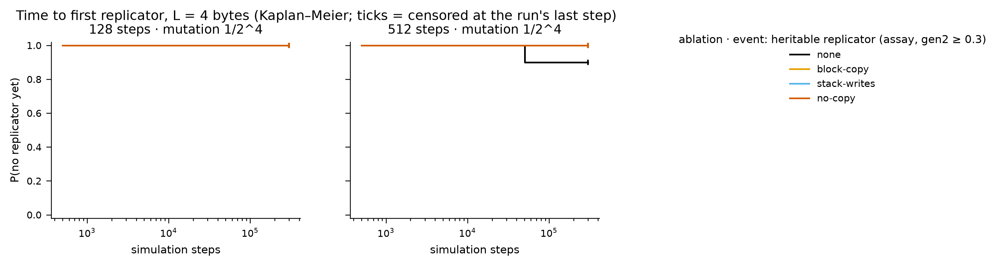
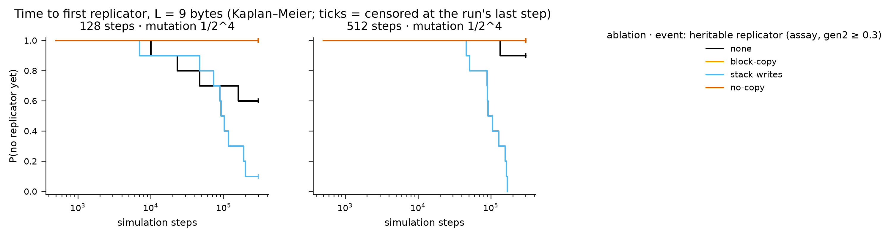
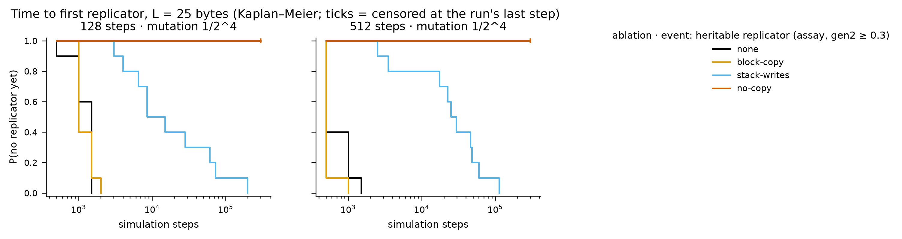
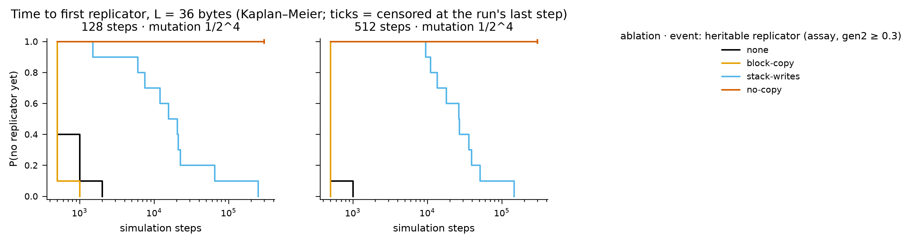
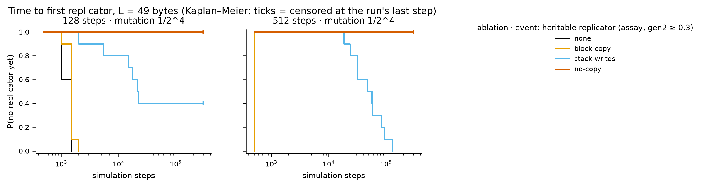
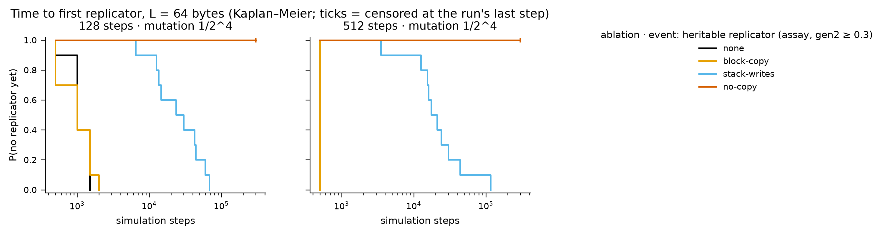
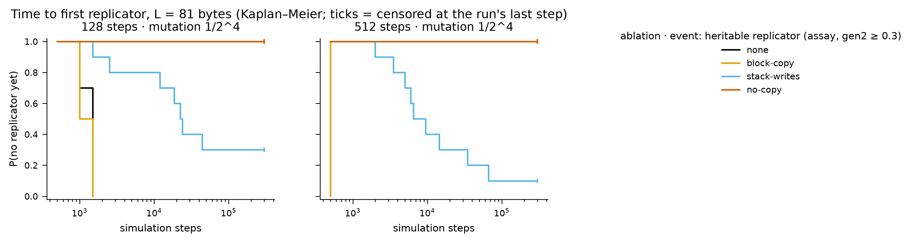
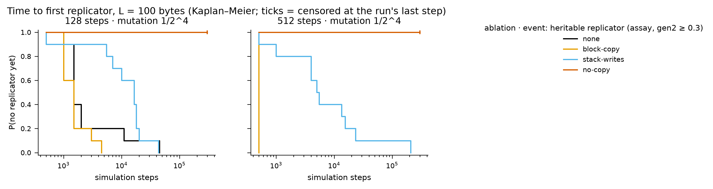

# Instruction-set ablation atlas — results

Batches: runs/stageB. Pre-registration and change log: `experiments/PLAN.md`; review: `experiments/REVIEW.md`. Emergence events: `tq_10` = quasispecies occupancy ≥ 10% (pre-registered primary; fires on zero-byte floods as well as replicators); `t_rep` = first top-3 exemplar with share ≥ 0.5% that is heritable (assay gen2 ≥ 0.3); `t_faith` = additionally ≥ 50% of partners became ≥ 75% copies. Times are Kaplan–Meier medians censored at each run's last step; sampling is every 500 steps, so 500 is the resolution floor.

## Pre-registered hypotheses

**H3 — no-copy leaves no replicator.** Heritable replicators (t_rep): 0 in 160 no-copy runs. By the pre-registered occupancy event tq_10 the letter of H3 is REFUTED: 10 no-copy runs crossed q_share ≥ 10%, all on zero-byte floods, not replicators. The assay outcome (t_rep) was adopted after 19 runs were read (PLAN change log) and is the measure used here.

**H6 — emergence time grows with L; large organisms have more free tape; more mechanism classes at large L (unablated, 128 steps, 1/16).** L=4: 0/10 (NR; faithful 0), L=9: 4/10 (NR; faithful 4), L=25: 10/10 (1,500; faithful 10), L=36: 10/10 (500; faithful 10), L=49: 10/10 (1,500; faithful 10), L=64: 10/10 (1,000; faithful 10), L=81: 10/10 (1,500; faithful 10), L=100: 10/10 (1,500; faithful 8). Time to emergence does not grow with L above 16 at 500-step resolution (first clause not supported); the free-tape and complexity clauses are addressed in the size-axis analysis (tiling), with the confounds listed in REVIEW.md §4 (per-byte mutation ∝ 1/L, steps per byte, parity-driven early stop) still open until the control arms run.

## Emergence grids

### L = 4

| ablation | 128 steps · 1/2^4 | 512 steps · 1/2^4 |
|---|---|---|
| block-copy | 0/10 · **0/10** (NR) · 0/10 | 0/10 · **0/10** (NR) · 0/10 |
| no-copy | 0/10 · **0/10** (NR) · 0/10 | 0/10 · **0/10** (NR) · 0/10 |
| none | 0/10 · **0/10** (NR) · 0/10 | 1/10 · **1/10** (NR) · 1/10 |
| stack-writes | 0/10 · **0/10** (NR) · 0/10 | 0/10 · **0/10** (NR) · 0/10 |

Each cell: seeds reaching q_share ≥ 10% (pre-registered) · **seeds with a heritable replicator** (KM median step, NR = not reached within the horizon) · seeds with a faithful replicator.

### L = 9

| ablation | 128 steps · 1/2^4 | 512 steps · 1/2^4 |
|---|---|---|
| block-copy | 10/10 · **0/10** (NR) · 0/10 | 0/10 · **0/10** (NR) · 0/10 |
| no-copy | 0/10 · **0/10** (NR) · 0/10 | 0/10 · **0/10** (NR) · 0/10 |
| none | 10/10 · **4/10** (NR) · 4/10 | 1/10 · **1/10** (NR) · 1/10 |
| stack-writes | 8/10 · **9/10** (92,000) · 9/10 | 8/10 · **10/10** (91,500) · 10/10 |

Each cell: seeds reaching q_share ≥ 10% (pre-registered) · **seeds with a heritable replicator** (KM median step, NR = not reached within the horizon) · seeds with a faithful replicator.

### L = 25

| ablation | 128 steps · 1/2^4 | 512 steps · 1/2^4 |
|---|---|---|
| block-copy | 10/10 · **10/10** (1,000) · 10/10 | 10/10 · **10/10** (500) · 10/10 |
| no-copy | 0/10 · **0/10** (NR) · 0/10 | 0/10 · **0/10** (NR) · 0/10 |
| none | 10/10 · **10/10** (1,500) · 10/10 | 10/10 · **10/10** (500) · 10/10 |
| stack-writes | 6/10 · **10/10** (8,500) · 10/10 | 9/10 · **10/10** (25,000) · 10/10 |

Each cell: seeds reaching q_share ≥ 10% (pre-registered) · **seeds with a heritable replicator** (KM median step, NR = not reached within the horizon) · seeds with a faithful replicator.

### L = 36

| ablation | 128 steps · 1/2^4 | 512 steps · 1/2^4 |
|---|---|---|
| block-copy | 10/10 · **10/10** (500) · 10/10 | 10/10 · **10/10** (500) · 10/10 |
| no-copy | 0/10 · **0/10** (NR) · 0/10 | 10/10 · **0/10** (NR) · 0/10 |
| none | 10/10 · **10/10** (500) · 10/10 | 10/10 · **10/10** (500) · 10/10 |
| stack-writes | 9/10 · **10/10** (15,500) · 10/10 | 6/10 · **10/10** (26,500) · 10/10 |

Each cell: seeds reaching q_share ≥ 10% (pre-registered) · **seeds with a heritable replicator** (KM median step, NR = not reached within the horizon) · seeds with a faithful replicator.

### L = 49

| ablation | 128 steps · 1/2^4 | 512 steps · 1/2^4 |
|---|---|---|
| block-copy | 10/10 · **10/10** (1,500) · 10/10 | 10/10 · **10/10** (500) · 10/10 |
| no-copy | 0/10 · **0/10** (NR) · 0/10 | 0/10 · **0/10** (NR) · 0/10 |
| none | 10/10 · **10/10** (1,500) · 10/10 | 10/10 · **10/10** (500) · 10/10 |
| stack-writes | 1/10 · **6/10** (21,500) · 6/10 | 2/10 · **10/10** (48,000) · 10/10 |

Each cell: seeds reaching q_share ≥ 10% (pre-registered) · **seeds with a heritable replicator** (KM median step, NR = not reached within the horizon) · seeds with a faithful replicator.

### L = 64

| ablation | 128 steps · 1/2^4 | 512 steps · 1/2^4 |
|---|---|---|
| block-copy | 10/10 · **10/10** (1,000) · 10/10 | 10/10 · **10/10** (500) · 10/10 |
| no-copy | 0/10 · **0/10** (NR) · 0/10 | 0/10 · **0/10** (NR) · 0/10 |
| none | 10/10 · **10/10** (1,000) · 10/10 | 10/10 · **10/10** (500) · 10/10 |
| stack-writes | 5/10 · **10/10** (23,500) · 10/10 | 5/10 · **10/10** (17,500) · 10/10 |

Each cell: seeds reaching q_share ≥ 10% (pre-registered) · **seeds with a heritable replicator** (KM median step, NR = not reached within the horizon) · seeds with a faithful replicator.

### L = 81

| ablation | 128 steps · 1/2^4 | 512 steps · 1/2^4 |
|---|---|---|
| block-copy | 10/10 · **10/10** (1,000) · 10/10 | 10/10 · **10/10** (500) · 10/10 |
| no-copy | 0/10 · **0/10** (NR) · 0/10 | 0/10 · **0/10** (NR) · 0/10 |
| none | 10/10 · **10/10** (1,500) · 10/10 | 10/10 · **10/10** (500) · 10/10 |
| stack-writes | 1/10 · **7/10** (22,500) · 2/10 | 4/10 · **9/10** (6,500) · 9/10 |

Each cell: seeds reaching q_share ≥ 10% (pre-registered) · **seeds with a heritable replicator** (KM median step, NR = not reached within the horizon) · seeds with a faithful replicator.

### L = 100

| ablation | 128 steps · 1/2^4 | 512 steps · 1/2^4 |
|---|---|---|
| block-copy | 10/10 · **10/10** (1,500) · 10/10 | 10/10 · **10/10** (500) · 10/10 |
| no-copy | 0/10 · **0/10** (NR) · 0/10 | 0/10 · **0/10** (NR) · 0/10 |
| none | 9/10 · **10/10** (1,500) · 8/10 | 10/10 · **10/10** (500) · 10/10 |
| stack-writes | 7/10 · **10/10** (16,500) · 0/10 | 7/10 · **10/10** (5,000) · 10/10 |

Each cell: seeds reaching q_share ≥ 10% (pre-registered) · **seeds with a heritable replicator** (KM median step, NR = not reached within the horizon) · seeds with a faithful replicator.

## Succession (census takeover times, family at 300k steps and at the last step)

| label        |   tape |   steps |   k |   n |   stopped_early |   last_step_min | final_at_last   | family_300k           |   stack_takeover_n |   stack_takeover_med |   ldir_takeover_n |   ldir_takeover_med |   ldir_invasions_complete |   ldir_invasions_censored |   ldir_invasion_med_steps |
|:-------------|-------:|--------:|----:|----:|----------------:|----------------:|:----------------|:----------------------|-------------------:|---------------------:|------------------:|--------------------:|--------------------------:|--------------------------:|--------------------------:|
| block-copy   |      4 |     128 |   4 |  10 |               0 |          300000 | none:10         | none:10               |                  0 |                  nan |                 0 |                 nan |                         0 |                         0 |                       nan |
| block-copy   |      4 |     512 |   4 |  10 |               0 |          300000 | none:10         | none:10               |                  0 |                  nan |                 0 |                 nan |                         0 |                         0 |                       nan |
| block-copy   |      9 |     128 |   4 |  10 |               0 |          300000 | none:10         | none:10               |                  0 |                  nan |                 0 |                 nan |                         0 |                         0 |                       nan |
| block-copy   |      9 |     512 |   4 |  10 |               0 |          300000 | none:10         | none:10               |                  0 |                  nan |                 0 |                 nan |                         0 |                         0 |                       nan |
| block-copy   |     25 |     128 |   4 |  10 |               0 |          300000 | push:10         | push:10               |                 10 |                 2000 |                 0 |                 nan |                         0 |                         0 |                       nan |
| block-copy   |     25 |     512 |   4 |  10 |               0 |          300000 | push:10         | push:10               |                 10 |                 2000 |                 0 |                 nan |                         0 |                         0 |                       nan |
| block-copy   |     36 |     128 |   4 |  10 |              10 |            3500 | push:10         | (no run reached 300k) |                 10 |                 1500 |                 0 |                 nan |                         0 |                         0 |                       nan |
| block-copy   |     36 |     512 |   4 |  10 |               0 |          300000 | push:10         | push:10               |                 10 |                 2500 |                 0 |                 nan |                         0 |                         0 |                       nan |
| block-copy   |     49 |     128 |   4 |  10 |               0 |          300000 | push:10         | push:10               |                 10 |                 1500 |                 0 |                 nan |                         0 |                         0 |                       nan |
| block-copy   |     49 |     512 |   4 |  10 |               0 |          300000 | push:10         | push:10               |                 10 |                  500 |                 0 |                 nan |                         0 |                         0 |                       nan |
| block-copy   |     64 |     128 |   4 |  10 |               5 |            4000 | push:10         | push:5                |                 10 |                 2000 |                 0 |                 nan |                         0 |                         0 |                       nan |
| block-copy   |     64 |     512 |   4 |  10 |              10 |            2500 | push:10         | (no run reached 300k) |                 10 |                  500 |                 0 |                 nan |                         0 |                         0 |                       nan |
| block-copy   |     81 |     128 |   4 |  10 |               0 |          300000 | push:10         | push:10               |                 10 |                 1500 |                 0 |                 nan |                         0 |                         0 |                       nan |
| block-copy   |     81 |     512 |   4 |  10 |               2 |            3000 | push:10         | push:8                |                 10 |                  500 |                 0 |                 nan |                         0 |                         0 |                       nan |
| block-copy   |    100 |     128 |   4 |  10 |              10 |            4500 | push:10         | (no run reached 300k) |                 10 |                 3000 |                 0 |                 nan |                         0 |                         0 |                       nan |
| block-copy   |    100 |     512 |   4 |  10 |              10 |            2500 | push:10         | (no run reached 300k) |                 10 |                 1000 |                 0 |                 nan |                         0 |                         0 |                       nan |
| no-copy      |      4 |     128 |   4 |  10 |               0 |          300000 | none:10         | none:10               |                  0 |                  nan |                 0 |                 nan |                         0 |                         0 |                       nan |
| no-copy      |      4 |     512 |   4 |  10 |               0 |          300000 | none:10         | none:10               |                  0 |                  nan |                 0 |                 nan |                         0 |                         0 |                       nan |
| no-copy      |      9 |     128 |   4 |  10 |               0 |          300000 | none:10         | none:10               |                  0 |                  nan |                 0 |                 nan |                         0 |                         0 |                       nan |
| no-copy      |      9 |     512 |   4 |  10 |               0 |          300000 | none:10         | none:10               |                  0 |                  nan |                 0 |                 nan |                         0 |                         0 |                       nan |
| no-copy      |     25 |     128 |   4 |  10 |               0 |          300000 | none:10         | none:10               |                  0 |                  nan |                 0 |                 nan |                         0 |                         0 |                       nan |
| no-copy      |     25 |     512 |   4 |  10 |               0 |          300000 | none:10         | none:10               |                  0 |                  nan |                 0 |                 nan |                         0 |                         0 |                       nan |
| no-copy      |     36 |     128 |   4 |  10 |               0 |          300000 | flooded:10      | flooded:10            |                  0 |                  nan |                 0 |                 nan |                         0 |                         0 |                       nan |
| no-copy      |     36 |     512 |   4 |  10 |               0 |          300000 | flooded:10      | flooded:10            |                  0 |                  nan |                 0 |                 nan |                         0 |                         0 |                       nan |
| no-copy      |     49 |     128 |   4 |  10 |               0 |          300000 | flooded:10      | flooded:10            |                  0 |                  nan |                 0 |                 nan |                         0 |                         0 |                       nan |
| no-copy      |     49 |     512 |   4 |  10 |               0 |          300000 | flooded:10      | flooded:10            |                  0 |                  nan |                 0 |                 nan |                         0 |                         0 |                       nan |
| no-copy      |     64 |     128 |   4 |  10 |               0 |          300000 | flooded:10      | flooded:10            |                  0 |                  nan |                 0 |                 nan |                         0 |                         0 |                       nan |
| no-copy      |     64 |     512 |   4 |  10 |               0 |          300000 | flooded:10      | flooded:10            |                  0 |                  nan |                 0 |                 nan |                         0 |                         0 |                       nan |
| no-copy      |     81 |     128 |   4 |  10 |               0 |          300000 | flooded:10      | flooded:10            |                  0 |                  nan |                 0 |                 nan |                         0 |                         0 |                       nan |
| no-copy      |     81 |     512 |   4 |  10 |               0 |          300000 | flooded:10      | flooded:10            |                  0 |                  nan |                 0 |                 nan |                         0 |                         0 |                       nan |
| no-copy      |    100 |     128 |   4 |  10 |               0 |          300000 | flooded:10      | flooded:10            |                  0 |                  nan |                 0 |                 nan |                         0 |                         0 |                       nan |
| no-copy      |    100 |     512 |   4 |  10 |               0 |          300000 | flooded:10      | flooded:10            |                  0 |                  nan |                 0 |                 nan |                         0 |                         0 |                       nan |
| none         |      4 |     128 |   4 |  10 |               0 |          300000 | none:10         | none:10               |                  0 |                  nan |                 0 |                 nan |                         0 |                         0 |                       nan |
| none         |      4 |     512 |   4 |  10 |               0 |          300000 | none:10         | none:10               |                  0 |                  nan |                 0 |                 nan |                         0 |                         1 |                       nan |
| none         |      9 |     128 |   4 |  10 |               3 |           52500 | none:6, ldir:4  | none:6, ldir:1        |                  0 |                  nan |                 4 |               37250 |                         2 |                         2 |                     14500 |
| none         |      9 |     512 |   4 |  10 |               1 |          139500 | none:9, ldir:1  | none:9                |                  0 |                  nan |                 1 |              136000 |                         0 |                         1 |                       nan |
| none         |     25 |     128 |   4 |  10 |               0 |          300000 | push:10         | push:10               |                 10 |                 2000 |                 0 |                 nan |                         0 |                         0 |                       nan |
| none         |     25 |     512 |   4 |  10 |               0 |          300000 | push:8, ldir:2  | push:8, ldir:2        |                 10 |                 1750 |                 2 |              172750 |                         2 |                         0 |                      1500 |
| none         |     36 |     128 |   4 |  10 |              10 |            3500 | push:10         | (no run reached 300k) |                 10 |                 1500 |                 0 |                 nan |                         0 |                         0 |                       nan |
| none         |     36 |     512 |   4 |  10 |               4 |           11000 | push:7, ldir:3  | push:5, ldir:1        |                 10 |                 2500 |                 3 |               85500 |                         3 |                         0 |                      1500 |
| none         |     49 |     128 |   4 |  10 |               0 |          300000 | push:9, ldir:1  | push:9, ldir:1        |                 10 |                 1500 |                 1 |              188500 |                         1 |                         0 |                      1000 |
| none         |     49 |     512 |   4 |  10 |               0 |          300000 | push:10         | push:10               |                 10 |                  500 |                 0 |                 nan |                         0 |                         0 |                       nan |
| none         |     64 |     128 |   4 |  10 |               2 |            4500 | push:10         | push:8                |                 10 |                 1750 |                 0 |                 nan |                         0 |                         0 |                       nan |
| none         |     64 |     512 |   4 |  10 |              10 |            3000 | push:10         | (no run reached 300k) |                 10 |                  750 |                 0 |                 nan |                         0 |                         0 |                       nan |
| none         |     81 |     128 |   4 |  10 |               0 |          300000 | push:9, ldir:1  | push:9, ldir:1        |                  9 |                 2000 |                 1 |                1500 |                         1 |                         0 |                      2000 |
| none         |     81 |     512 |   4 |  10 |               4 |            3000 | push:10         | push:6                |                 10 |                  500 |                 0 |                 nan |                         0 |                         0 |                       nan |
| none         |    100 |     128 |   4 |  10 |               7 |            4500 | push:5, ldir:5  | ldir:3                |                  6 |                 3000 |                 5 |                2500 |                         5 |                         0 |                      1000 |
| none         |    100 |     512 |   4 |  10 |              10 |            2500 | push:10         | (no run reached 300k) |                 10 |                 1000 |                 0 |                 nan |                         0 |                         0 |                       nan |
| stack-writes |      4 |     128 |   4 |  10 |               0 |          300000 | none:10         | none:10               |                  0 |                  nan |                 0 |                 nan |                         0 |                         0 |                       nan |
| stack-writes |      4 |     512 |   4 |  10 |               0 |          300000 | none:10         | none:10               |                  0 |                  nan |                 0 |                 nan |                         0 |                         0 |                       nan |
| stack-writes |      9 |     128 |   4 |  10 |               5 |           11500 | ldir:9, none:1  | ldir:4, none:1        |                  0 |                  nan |                 9 |               93500 |                         4 |                         5 |                      4500 |
| stack-writes |      9 |     512 |   4 |  10 |               7 |           52000 | ldir:10         | ldir:3                |                  0 |                  nan |                10 |               90750 |                         3 |                         7 |                      5500 |
| stack-writes |     25 |     128 |   4 |  10 |               2 |           74500 | ldir:10         | ldir:8                |                  0 |                  nan |                10 |                8750 |                        10 |                         0 |                      1250 |
| stack-writes |     25 |     512 |   4 |  10 |               0 |          300000 | ldir:10         | ldir:10               |                  1 |               132000 |                10 |               27750 |                        10 |                         0 |                      1250 |
| stack-writes |     36 |     128 |   4 |  10 |               9 |           18000 | ldir:10         | ldir:1                |                  1 |                22500 |                10 |               13250 |                        10 |                         0 |                      1500 |
| stack-writes |     36 |     512 |   4 |  10 |               6 |           28500 | ldir:10         | ldir:4                |                  1 |                65500 |                10 |               27000 |                        10 |                         0 |                      1000 |
| stack-writes |     49 |     128 |   4 |  10 |               0 |          300000 | ldir:10         | ldir:10               |                  0 |                  nan |                10 |                4500 |                        10 |                         0 |                      1000 |
| stack-writes |     49 |     512 |   4 |  10 |               0 |          300000 | ldir:10         | ldir:10               |                  4 |                38000 |                10 |               41250 |                        10 |                         0 |                      1250 |
| stack-writes |     64 |     128 |   4 |  10 |               5 |          118500 | ldir:10         | ldir:5                |                  3 |                18500 |                10 |               14000 |                        10 |                         0 |                      1000 |
| stack-writes |     64 |     512 |   4 |  10 |               3 |          155000 | ldir:10         | ldir:7                |                  4 |                15000 |                10 |               14250 |                        10 |                         0 |                      1000 |
| stack-writes |     81 |     128 |   4 |  10 |               0 |          300000 | ldir:10         | ldir:10               |                  1 |                84500 |                10 |                2250 |                        10 |                         0 |                      1000 |
| stack-writes |     81 |     512 |   4 |  10 |               1 |            7500 | ldir:10         | ldir:9                |                  2 |                73000 |                10 |                8000 |                        10 |                         0 |                      1000 |
| stack-writes |    100 |     128 |   4 |  10 |               3 |           64000 | ldir:10         | ldir:7                |                  1 |                 1500 |                10 |                1000 |                        10 |                         0 |                       500 |
| stack-writes |    100 |     512 |   4 |  10 |               5 |            6500 | ldir:10         | ldir:5                |                  1 |                 5500 |                10 |                4750 |                        10 |                         0 |                      1250 |

## Replicator zoo — runs/stageB

## block-copy · L=25 · 128 steps · mutation 1/2^4
**first** (10 seeds)
- 10× `01 c5 01 c5 01 c5 01 c5 01 c5 01 c5 01 c5 01 c5 01 c5 01 c5 …` — [LD rr,nn ; PUSH rr] ×12.5

**final** (10 seeds)
- 10× `c5 01 c5 01 c5 01 c5 01 c5 01 c5 01 c5 01 c5 01 c5 01 c5 01 …` — [LD rr,nn ; PUSH rr] ×12.5

## block-copy · L=25 · 512 steps · mutation 1/2^4
**first** (10 seeds)
- 10× `e5 21 e5 21 e5 21 e5 21 e5 21 e5 21 e5 21 e5 21 e5 21 e5 21 …` — [LD rr,nn ; PUSH rr] ×12.5

**final** (10 seeds)
- 10× `e5 21 e5 21 e5 21 e5 21 e5 21 e5 21 e5 21 e5 21 e5 21 e5 21 …` — [LD rr,nn ; PUSH rr] ×12.5

## block-copy · L=36 · 128 steps · mutation 1/2^4
**first** (10 seeds)
- 10× `11 d5 11 d5 11 d5 11 d5 11 d5 11 d5 11 d5 11 d5 11 d5 11 d5 …` — [LD rr,nn ; PUSH rr] ×18

**final** (10 seeds)
- 7× `01 c5 01 c5 01 c5 01 c5 01 c5 01 c5 01 c5 01 c5 01 c5 01 c5 …` — [LD rr,nn ; PUSH rr] ×18
- 3× `11 d5 11 10 f0 d5 11 d5 11 d5 11 d5 11 d5 11 d5 11 10 f0 d5 …` — [DJNZ d ; PUSH rr ; LD rr,nn ; PUSH rr ; LD rr,nn ; PUSH rr ; LD rr,nn] ×2.57143

## block-copy · L=36 · 512 steps · mutation 1/2^4
**first** (10 seeds)
- 10× `01 c5 01 c5 01 c5 01 c5 01 c5 01 c5 01 c5 01 c5 01 c5 01 c5 …` — [LD rr,nn ; PUSH rr] ×18

**final** (10 seeds)
- 10× `11 d5 11 d5 11 d5 11 d5 11 d5 11 d5 11 d5 11 d5 11 d5 11 d5 …` — [LD rr,nn ; PUSH rr] ×18

## block-copy · L=49 · 128 steps · mutation 1/2^4
**first** (10 seeds)
- 10× `01 c5 01 c5 01 c5 01 c5 01 c5 01 c5 01 c5 01 c5 01 c5 01 c5 …` — [LD rr,nn ; PUSH rr] ×24.5

**final** (10 seeds)
- 10× `e5 21 e5 21 e5 21 e5 21 e5 21 e5 21 e5 21 e5 21 e5 21 e5 21 …` — [LD rr,nn ; PUSH rr] ×24.5

## block-copy · L=49 · 512 steps · mutation 1/2^4
**first** (10 seeds)
- 10× `c5 01 c5 01 c5 01 c5 01 c5 01 c5 01 c5 01 c5 01 c5 01 c5 01 …` — [LD rr,nn ; PUSH rr] ×24.5

**final** (10 seeds)
- 7× `e5 2a e5 2a e5 2a e5 2a e5 2a e5 2a e5 2a e5 2a e5 2a e5 2a …` — [LD rr,(nn) ; PUSH rr] ×24.5
- 3× `e5 21 e5 21 e5 21 e5 21 e5 21 e5 21 e5 21 e5 21 e5 21 e5 21 …` — [LD rr,nn ; PUSH rr] ×24.5

## block-copy · L=64 · 128 steps · mutation 1/2^4
**first** (10 seeds)
- 10× `01 c5 01 c5 01 c5 01 c5 01 c5 01 c5 01 c5 01 c5 01 c5 01 c5 …` — [LD rr,nn ; PUSH rr] ×32

**final** (10 seeds)
- 8× `21 e5 21 e5 21 e5 21 e5 21 e5 21 e5 21 e5 21 e5 21 e5 21 e5 …` — [LD rr,nn ; PUSH rr] ×32
- 1× `01 c5 01 c5 01 c5 01 c5 01 18 f0 c5 01 c5 01 c5 01 c5 01 c5 …` — [JR d ; PUSH rr ; LD rr,nn ; PUSH rr ; LD rr,nn ; PUSH rr ; LD rr,nn] ×4.57143
- 1× `01 c5 01 c5 01 c5 01 c5 01 30 f0 c5 01 c5 01 c5 01 c5 01 c5 …` — [JR NC,d ; PUSH rr ; LD rr,nn ; PUSH rr ; LD rr,nn ; PUSH rr ; LD rr,nn] ×4.57143

## block-copy · L=64 · 512 steps · mutation 1/2^4
**first** (10 seeds)
- 10× `01 c5 01 c5 01 c5 01 c5 01 c5 01 c5 01 c5 01 c5 01 c5 01 c5 …` — [LD rr,nn ; PUSH rr] ×32

**final** (10 seeds)
- 10× `21 e5 21 e5 21 e5 21 e5 21 e5 21 e5 21 e5 21 e5 21 e5 21 e5 …` — [LD rr,nn ; PUSH rr] ×32

## block-copy · L=81 · 128 steps · mutation 1/2^4
**first** (10 seeds)
- 10× `c5 01 c5 01 c5 01 c5 01 c5 01 c5 01 c5 01 c5 01 c5 01 c5 01 …` — [LD rr,nn ; PUSH rr] ×40.5

**final** (10 seeds)
- 10× `c5 01 c5 01 c5 01 c5 01 c5 01 c5 01 c5 01 c5 01 c5 01 c5 01 …` — [LD rr,nn ; PUSH rr] ×40.5

## block-copy · L=81 · 512 steps · mutation 1/2^4
**first** (10 seeds)
- 10× `c5 01 c5 01 c5 01 c5 01 c5 01 c5 01 c5 01 c5 01 c5 01 c5 01 …` — [LD rr,nn ; PUSH rr] ×40.5

**final** (10 seeds)
- 9× `21 e5 21 e5 21 e5 21 e5 21 e5 21 e5 21 e5 21 e5 21 e5 21 e5 …` — [LD rr,nn ; PUSH rr] ×40.5
- 1× `c5 01 c5 01 c5 01 c5 01 c5 01 c5 01 18 f0 c5 01 c5 01 c5 01 …` — [JR d ; PUSH rr ; LD rr,nn ; PUSH rr ; LD rr,nn ; PUSH rr ; LD rr,nn] ×5.78571

## block-copy · L=100 · 128 steps · mutation 1/2^4
**first** (10 seeds)
- 10× `01 c5 01 c5 01 c5 01 c5 01 c5 01 c5 01 c5 01 c5 01 c5 01 c5 …` — [LD rr,nn ; PUSH rr] ×50

**final** (10 seeds)
- 8× `c2 c5 01 c5 01 c5 01 c5 c2 c5 c2 c5 01 c5 01 c5 01 c5 c2 c5 …` — [JP NZ,nn ; PUSH rr ; LD rr,nn ; PUSH rr ; JP NZ,nn ; PUSH rr ; LD rr,nn ; PUSH rr ; LD rr,nn ; PUSH rr] ×10
- 1× `01 c5 d2 c5 01 c5 01 c5 d2 c5 01 c5 01 c5 d2 c5 01 c5 01 c5 …` — [JP NC,nn ; PUSH rr ; LD rr,nn ; PUSH rr ; LD rr,nn ; PUSH rr] ×16.6667
- 1× `01 c5 e2 c5 01 c5 01 c5 e2 c5 01 c5 01 c5 e2 c5 01 c5 01 c5 …` — [JP PO,nn ; PUSH rr ; LD rr,nn ; PUSH rr ; LD rr,nn ; PUSH rr] ×16.6667

## block-copy · L=100 · 512 steps · mutation 1/2^4
**first** (10 seeds)
- 10× `01 c5 01 c5 01 c5 01 c5 01 c5 01 c5 01 c5 01 c5 01 c5 01 c5 …` — [LD rr,nn ; PUSH rr] ×50

**final** (10 seeds)
- 7× `c2 c5 01 c5 01 c5 01 c5 c2 c5 c2 c5 01 c5 01 c5 01 c5 c2 c5 …` — [JP NZ,nn ; PUSH rr ; LD rr,nn ; PUSH rr ; JP NZ,nn ; PUSH rr ; LD rr,nn ; PUSH rr ; LD rr,nn ; PUSH rr] ×10
- 3× `01 c5 01 c5 01 c5 01 c5 01 c5 01 c5 01 c5 01 c5 01 c5 01 c5 …` — [LD rr,nn ; PUSH rr] ×50

## none · L=4 · 512 steps · mutation 1/2^4
**first** (1 seeds)
- 1× `54 5e ed b0` — LD r,(HL) ; LDIR

**final** (1 seeds)
- 1× `6c 5e ed b0` — LD r,(HL) ; LDIR

## none · L=9 · 128 steps · mutation 1/2^4
**first** (4 seeds)
- 2× `b0 1d ed b0 1d ed b0 1d ed` — [DEC E ; LDIR] ×3
- 1× `62 14 ed b0 ed b0 62 14 ed` — LDIR×2
- 1× `c6 d1 c1 d1 e2 ed b0 9e de` — POP rr×2 ; JP PO,nn

**final** (4 seeds)
- 1× `1c 9c 6f c3 56 14 ed b0 34` — JP nn ; LDIR ; INC (HL)
- 1× `c6 d1 c1 d1 fa ed b0 74 c6` — POP rr×2 ; JP M,nn ; LD (HL),r
- 1× `a7 46 1e bd c3 ed b0 da 10` — LD r,(HL) ; LD r,n ; JP nn ; JP C,nn
- 1× `1d ed b0 1d ed b0 1d ed b0` — [DEC E ; LDIR] ×3

## none · L=9 · 512 steps · mutation 1/2^4
**first** (1 seeds)
- 1× `1d ed b0 1d ed b0 1d ed b0` — [DEC E ; LDIR] ×3

**final** (1 seeds)
- 1× `1d ed b0 1d ed b0 1d ed b0` — [DEC E ; LDIR] ×3

## none · L=25 · 128 steps · mutation 1/2^4
**first** (10 seeds)
- 10× `d5 11 d5 11 d5 11 d5 11 d5 11 d5 11 d5 11 d5 11 d5 11 d5 11 …` — [LD rr,nn ; PUSH rr] ×12.5

**final** (10 seeds)
- 10× `d5 11 d5 11 d5 11 d5 11 d5 11 d5 11 d5 11 d5 11 d5 11 d5 11 …` — [LD rr,nn ; PUSH rr] ×12.5

## none · L=25 · 512 steps · mutation 1/2^4
**first** (10 seeds)
- 10× `21 e5 21 e5 21 e5 21 e5 21 e5 21 e5 21 e5 21 e5 21 e5 21 e5 …` — [LD rr,nn ; PUSH rr] ×12.5

**final** (10 seeds)
- 8× `c5 01 c5 01 c5 01 c5 01 c5 01 c5 01 c5 01 c5 01 c5 01 c5 01 …` — [LD rr,nn ; PUSH rr] ×12.5
- 1× `08 1d ed b0 3b 08 1d ed b0 3b 08 1d ed b0 3b 08 1d ed b0 3b …` — [DEC E ; LDIR ; DEC SP ; EX rr,rr'] ×5
- 1× `eb 1d ed b0 b0 eb 1d ed b0 b0 eb 1d ed b0 b0 eb 1d ed b0 b0 …` — [DEC E ; LDIR ; OR B ; EX rr,rr] ×5

## none · L=36 · 128 steps · mutation 1/2^4
**first** (10 seeds)
- 10× `11 d5 11 d5 11 d5 11 d5 11 d5 11 d5 11 d5 11 d5 11 d5 11 d5 …` — [LD rr,nn ; PUSH rr] ×18

**final** (10 seeds)
- 9× `01 c5 01 c5 01 c5 01 c5 01 c5 01 c5 01 c5 01 c5 01 c5 01 c5 …` — [LD rr,nn ; PUSH rr] ×18
- 1× `01 c5 01 c5 01 c5 01 c5 01 18 f0 c5 01 c5 01 c5 01 c5 01 c5 …` — [JR d ; PUSH rr ; LD rr,nn ; PUSH rr ; LD rr,nn ; PUSH rr ; LD rr,nn] ×2.57143

## none · L=36 · 512 steps · mutation 1/2^4
**first** (10 seeds)
- 10× `01 c5 01 c5 01 c5 01 c5 01 c5 01 c5 01 c5 01 c5 01 c5 01 c5 …` — [LD rr,nn ; PUSH rr] ×18

**final** (8 seeds)
- 5× `01 c5 01 c5 01 c5 01 c5 01 c5 01 c5 01 c5 01 c5 01 c5 01 c5 …` — [LD rr,nn ; PUSH rr] ×18
- 1× `b0 f9 1e 96 ca ed b0 f9 1e 96 ca ed b0 f9 1e 96 ca ed b0 f9 …` — [JP Z,nn ; LD SP,HL ; LD r,n] ×6
- 1× `11 ed b0 ed 11 ed b0 ed 11 ed b0 ed 11 ed b0 ed 11 ed b0 ed …` — [LDIR ; NOP (ED)] ×9
- 1× `1e 94 ed b0 1e 94 ed b0 1e 94 ed b0 1e 94 ed b0 1e 94 ed b0 …` — [LD r,n ; LDIR] ×9

## none · L=49 · 128 steps · mutation 1/2^4
**first** (10 seeds)
- 10× `01 c5 01 c5 01 c5 01 c5 01 c5 01 c5 01 c5 01 c5 01 c5 01 c5 …` — [LD rr,nn ; PUSH rr] ×24.5

**final** (10 seeds)
- 9× `c5 01 c5 01 c5 01 c5 01 c5 01 c5 01 c5 01 c5 01 c5 01 c5 01 …` — [LD rr,nn ; PUSH rr] ×24.5
- 1× `11 d9 15 ed b0 3c 0f 11 d9 15 ed b0 3c 0f 11 d9 15 ed b0 3c …` — [INC A ; RRCA ; LD rr,nn ; LDIR] ×7

## none · L=49 · 512 steps · mutation 1/2^4
**first** (10 seeds)
- 10× `c5 01 c5 01 c5 01 c5 01 c5 01 c5 01 c5 01 c5 01 c5 01 c5 01 …` — [LD rr,nn ; PUSH rr] ×24.5

**final** (10 seeds)
- 6× `e5 2a e5 2a e5 2a e5 2a e5 2a e5 2a e5 2a e5 2a e5 2a e5 2a …` — [LD rr,(nn) ; PUSH rr] ×24.5
- 4× `d5 11 d5 11 d5 11 d5 11 d5 11 d5 11 d5 11 d5 11 d5 11 d5 11 …` — [LD rr,nn ; PUSH rr] ×24.5

## none · L=64 · 128 steps · mutation 1/2^4
**first** (10 seeds)
- 10× `21 e5 21 e5 21 e5 21 e5 21 e5 21 e5 21 e5 21 e5 21 e5 21 e5 …` — [LD rr,nn ; PUSH rr] ×32

**final** (10 seeds)
- 10× `21 e5 21 e5 21 e5 21 e5 21 e5 21 e5 21 e5 21 e5 21 e5 21 e5 …` — [LD rr,nn ; PUSH rr] ×32

## none · L=64 · 512 steps · mutation 1/2^4
**first** (10 seeds)
- 10× `11 d5 11 d5 11 d5 11 d5 11 d5 11 d5 11 d5 11 d5 11 d5 11 d5 …` — [LD rr,nn ; PUSH rr] ×32

**final** (10 seeds)
- 10× `11 d5 11 d5 11 d5 11 d5 11 d5 11 d5 11 d5 11 d5 11 d5 11 d5 …` — [LD rr,nn ; PUSH rr] ×32

## none · L=81 · 128 steps · mutation 1/2^4
**first** (10 seeds)
- 10× `c5 01 c5 01 c5 01 c5 01 c5 01 c5 01 c5 01 c5 01 c5 01 c5 01 …` — [LD rr,nn ; PUSH rr] ×40.5

**final** (10 seeds)
- 9× `e5 21 e5 21 e5 21 e5 21 e5 21 e5 21 e5 21 e5 21 e5 21 e5 21 …` — [LD rr,nn ; PUSH rr] ×40.5
- 1× `4b 4b d8 ed 91 2e 4b 15 ed b8 21 91 2e 4b 4b d8 ed b8 21 91 …` — RET C ; LD r,n ; LDDR ; LD rr,nn ; RET C ; LDDR ; LD rr,nn ; RET NZ ; RST 38×2 ; LD (HL),r ; (LD r,n ; RET C)×6 ; LD r,n

## none · L=81 · 512 steps · mutation 1/2^4
**first** (10 seeds)
- 10× `c5 01 c5 01 c5 01 c5 01 c5 01 c5 01 c5 01 c5 01 c5 01 c5 01 …` — [LD rr,nn ; PUSH rr] ×40.5

**final** (10 seeds)
- 8× `01 c5 01 c5 01 c5 01 01 c5 01 c5 01 c5 01 c5 01 c5 01 c5 01 …` — [LD rr,nn ; PUSH rr] ×40.5
- 2× `c5 01 c5 01 c5 01 c5 01 c5 01 c5 01 18 f0 c5 01 c5 01 c5 01 …` — [JR d ; PUSH rr ; LD rr,nn ; PUSH rr ; LD rr,nn ; PUSH rr ; LD rr,nn] ×5.78571

## none · L=100 · 128 steps · mutation 1/2^4
**first** (10 seeds)
- 8× `01 c5 01 c5 01 c5 01 c5 01 c5 01 c5 01 c5 01 c5 01 c5 01 c5 …` — [LD rr,nn ; PUSH rr] ×50
- 1× `b0 57 46 14 11 00 c1 ed b0 57 46 14 11 00 c1 ed b0 57 46 14 …` — [INC D ; LD rr,nn ; LDIR ; LD r,r ; LD r,(HL)] ×12.5
- 1× `1d b8 1d 1d 8f 8e 1d b8 3d bf 57 ed b0 9f 03 51 03 51 f0 51 …` — [ADC A,(HL) ; DEC E ; CP B ; DEC A ; CP A ; LD r,r ; LDIR ; SBC A,A ; INC BC ; LD r,r ; INC BC ; LD r,r ; RET P ; LD r,r ; DEC E ; CP B ; DEC E ; DEC E ; ADC A,A] ×5

**final** (5 seeds)
- 5× `c2 c5 01 c5 01 c5 01 c5 c2 c5 c2 c5 01 c5 01 c5 01 c5 c2 c5 …` — [JP NZ,nn ; PUSH rr ; LD rr,nn ; PUSH rr ; JP NZ,nn ; PUSH rr ; LD rr,nn ; PUSH rr ; LD rr,nn ; PUSH rr] ×10

## none · L=100 · 512 steps · mutation 1/2^4
**first** (10 seeds)
- 10× `01 c5 01 c5 01 c5 01 c5 01 c5 01 c5 01 c5 01 c5 01 c5 01 c5 …` — [LD rr,nn ; PUSH rr] ×50

**final** (10 seeds)
- 7× `c2 c5 01 c5 01 c5 01 c5 c2 c5 c2 c5 01 c5 01 c5 01 c5 c2 c5 …` — [JP NZ,nn ; PUSH rr ; LD rr,nn ; PUSH rr ; JP NZ,nn ; PUSH rr ; LD rr,nn ; PUSH rr ; LD rr,nn ; PUSH rr] ×10
- 3× `11 d5 11 d5 11 d5 11 d5 11 d5 11 d5 11 d5 11 d5 11 d5 11 d5 …` — [LD rr,nn ; PUSH rr] ×50

## stack-writes · L=9 · 128 steps · mutation 1/2^4
**first** (9 seeds)
- 7× `1d ed b0 1d ed b0 1d ed b0` — [DEC E ; LDIR] ×3
- 2× `99 5e c3 6d 7f 4a ed b0 6c` — LD r,(HL) ; JP nn ; LDIR

**final** (9 seeds)
- 5× `1d ed b0 1d ed b0 1d ed b0` — [DEC E ; LDIR] ×3
- 1× `e1 ad b6 5e c3 ed b0 85 40` — LD r,(HL) ; JP nn
- 1× `87 38 37 5e d2 ed b0 bf 6e` — JR C,d ; LD r,(HL) ; JP NC,nn ; LD r,(HL)
- 1× `cf 85 ec 5e f2 ed b0 99 f2` — LD r,(HL) ; JP P,nn×2
- 1× `ab 92 69 5e ca ed b0 bc 41` — LD r,(HL) ; JP Z,nn

## stack-writes · L=9 · 512 steps · mutation 1/2^4
**first** (10 seeds)
- 8× `1d ed b0 1d ed b0 1d ed b0` — [DEC E ; LDIR] ×3
- 1× `ab 5e cf 16 5a ed b0 74 6f` — LD r,(HL) ; LD r,n ; LDIR ; LD (HL),r
- 1× `cf 0b 8e c2 a9 5e ed b0 ec` — JP NZ,nn ; LDIR

**final** (10 seeds)
- 7× `1d ed b0 1d ed b0 1d ed b0` — [DEC E ; LDIR] ×3
- 1× `ab 7b d5 5e ca ed b0 f6 44` — LD r,(HL) ; JP Z,nn
- 1× `bd cf b4 5e ca ed b0 b8 d2` — LD r,(HL) ; JP Z,nn ; JP NC,nn
- 1× `bd 46 eb 5e d2 ed b0 7e 14` — LD r,(HL)×2 ; JP NC,nn ; LD r,(HL)

## stack-writes · L=25 · 128 steps · mutation 1/2^4
**first** (10 seeds)
- 1× `04 1d e3 ed b0 04 1d e3 ed b0 04 1d e3 ed b0 04 1d e3 ed b0 …` — [DEC E ; LDIR ; INC B] ×5
- 1× `1d ed b0 64 1d 1d ed b0 64 1d 1d ed b0 64 1d 1d ed b0 64 1d …` — [DEC E ; DEC E ; LDIR ; LD r,r] ×5
- 1× `ff aa 5e ed b0 ff aa 5e ed b0 ff aa 5e ed b0 ff aa 5e ed b0 …` — [LD r,(HL) ; LDIR ; XOR D] ×5
- 1× `27 1d 83 ed b0 27 1d 83 ed b0 27 1d 83 ed b0 27 1d 83 ed b0 …` — [ADD A,E ; LDIR ; DAA ; DEC E] ×5
- 1× `9c 1d ed b0 2e 9c 1d ed b0 2e 9c 1d ed b0 2e 9c 1d ed b0 2e …` — [DEC E ; LDIR ; LD r,n] ×5
- 1× `1d e3 b7 ed b0 1d e3 b7 ed b0 1d e3 b7 ed b0 1d e3 b7 ed b0 …` — [DEC E ; OR A ; LDIR] ×5

**final** (10 seeds)
- 4× `1d ed b0 1d ed 1d ed b0 1d ed 1d ed b0 1d ed 1d ed b0 1d ed …` — [DEC E ; NOP (ED) ; LDIR] ×5
- 1× `1d ed b0 7b 18 1d ed b0 7b 18 1d ed b0 7b 18 1d ed b0 7b 18 …` — [JR d ; LDIR ; LD r,r] ×5
- 1× `c3 1d ed b0 c4 c3 1d ed b0 c4 c3 1d ed b0 c4 c3 1d ed b0 c4 …` — [JP nn ; OR B] ×5
- 1× `b0 ba 1d ed b0 b0 ba 1d ed b0 b0 ba 1d ed b0 b0 ba 1d ed b0 …` — [CP D ; DEC E ; LDIR ; OR B] ×5
- 1× `b0 a8 23 55 ed b0 a8 23 55 ed b0 a8 23 55 ed b0 a8 23 55 ed …` — [INC HL ; LD r,r ; LDIR ; XOR B] ×5
- 1× `14 1b ed b0 14 14 1b ed b0 14 14 1b ed b0 14 14 1b ed b0 14 …` — [DEC DE ; LDIR ; INC D ; INC D] ×5

## stack-writes · L=25 · 512 steps · mutation 1/2^4
**first** (10 seeds)
- 1× `1d f1 ed b0 f1 1d f1 ed b0 f1 1d f1 ed b0 f1 1d f1 ed b0 f1 …` — [DEC E ; LDIR] ×5
- 1× `1d 80 48 ed b0 1d 80 48 ed b0 1d 80 48 ed b0 1d 80 48 ed b0 …` — [ADD A,B ; LD r,r ; LDIR ; DEC E] ×5
- 1× `1d ed b0 c4 ed 1d ed b0 c4 ed 1d ed b0 c4 ed 1d ed b0 c4 ed …` — [LDIR ; NOP (ED)] ×5
- 1× `1d ed b0 9b c2 1d ed b0 9b c2 1d ed b0 9b c2 1d ed b0 9b c2 …` — [JP NZ,nn ; OR B ; SBC A,E] ×5
- 1× `b0 1d ed b0 1d b0 1d ed b0 1d b0 1d ed b0 1d b0 1d ed b0 1d …` — [DEC E ; LDIR ; DEC E ; OR B] ×5
- 1× `a7 1d ed b0 a7 a7 1d ed b0 a7 a7 1d ed b0 a7 a7 1d ed b0 a7 …` — [AND A ; AND A ; DEC E ; LDIR] ×5

**final** (10 seeds)
- 5× `1d ed b0 1d ed 1d ed b0 1d ed 1d ed b0 1d ed 1d ed b0 1d ed …` — [DEC E ; NOP (ED) ; LDIR] ×5
- 1× `1d ed b0 0a 13 1d ed b0 0a 13 1d ed b0 0a 13 1d ed b0 0a 13 …` — [DEC E ; LDIR ; LD r,(BC) ; INC DE] ×5
- 1× `d2 1d ed b0 85 d2 1d ed b0 85 d2 1d ed b0 85 d2 1d ed b0 85 …` — [ADD A,L ; JP NC,nn ; OR B] ×5
- 1× `f2 1d ed b0 1f f2 1d ed b0 1f f2 1d ed b0 1f f2 1d ed b0 1f …` — [JP P,nn ; OR B ; RRA] ×5
- 1× `59 69 1d ed b0 59 69 1d ed b0 59 69 1d ed b0 59 69 1d ed b0 …` — [DEC E ; LDIR ; LD r,r ; LD r,r] ×5
- 1× `d2 1d ed b0 94 d2 1d ed b0 94 d2 1d ed b0 94 d2 1d ed b0 94 …` — [JP NC,nn ; OR B ; SUB H] ×5

## stack-writes · L=36 · 128 steps · mutation 1/2^4
**first** (10 seeds)
- 2× `b0 1e dc ed b0 1e dc ed b0 1e dc ed b0 1e dc ed b0 1e dc ed …` — [LD r,n ; LDIR] ×9
- 1× `f9 1e fc 05 06 30 50 05 03 ed b0 64 f9 1e fc 05 06 30 50 05 …` — [DEC B ; INC BC ; LDIR ; LD r,r ; LD SP,HL ; LD r,n ; DEC B ; LD r,n ; LD r,r] ×3
- 1× `9c 5e ed b8 9c 5e ed b8 9c 5e ed b8 9c 5e ed b8 9c 5e ed b8 …` — [LD r,(HL) ; LDDR ; SBC A,H] ×9
- 1× `b0 13 e3 79 db b0 b0 11 24 c0 a9 ed b0 13 e3 79 db b0 b0 11 …` — [IN A,(n) ; OR B ; LD rr,nn ; XOR C ; LDIR ; INC DE ; LD r,r] ×3
- 1× `b0 45 11 de 63 ed b0 45 11 de 63 ed b0 45 11 de 63 ed b0 45 …` — [LD r,r ; LD rr,nn ; LDIR] ×6
- 1× `99 5e 56 57 ec 41 ed b0 1d 99 5e 56 57 ec 41 ed b0 1d 99 5e …` — [DEC E ; SBC A,C ; LD r,(HL) ; LD r,(HL) ; LD r,r ; LD r,r ; LDIR] ×4

**final** (10 seeds)
- 6× `1e 4c ed b0 1e 4c ed b0 1e 4c ed b0 1e 4c ed b0 1e 4c ed b0 …` — [LD r,n ; LDIR] ×9
- 2× `94 5e ed b0 94 5e ed b0 94 5e ed b0 94 5e ed b0 94 5e ed b0 …` — [LD r,(HL) ; LDIR ; SUB H] ×9
- 1× `8e 5f c0 08 7d ed b8 48 28 63 5f ed 1e 31 57 72 8e 8e 8e 5f …` — [ADC A,(HL) ; ADC A,(HL) ; ADC A,(HL) ; LD r,r ; LD r,r ; LDDR ; LD r,r ; JR Z,d ; LD r,r ; NOP (ED) ; LD rr,nn] ×2
- 1× `04 5e ed b0 04 5e ed b0 04 5e ed b0 04 5e ed b0 04 5e ed b0 …` — [INC B ; LD r,(HL) ; LDIR] ×9

## stack-writes · L=36 · 512 steps · mutation 1/2^4
**first** (10 seeds)
- 1× `e4 9c 8f 00 5e d1 fc ed b0 d3 39 e3 e4 9c 8f 00 5e d1 fc ed …` — [ADC A,A ; NOP ; LD r,(HL) ; LDIR ; OUT (n),A ; SBC A,H] ×3
- 1× `11 4e 63 ed b0 8a 11 4e 63 ed b0 8a 11 4e 63 ed b0 8a 11 4e …` — [ADC A,D ; LD rr,nn ; LDIR] ×6
- 1× `4e ad 59 ed b0 3e 4e ad 59 ed b0 3e 4e ad 59 ed b0 3e 4e ad …` — [LD r,n ; XOR L ; LD r,r ; LDIR] ×6
- 1× `16 9b b4 ed b0 b0 16 b8 16 9b b4 ed b0 b0 16 b8 16 9b b4 ed …` — [LD r,n ; LD r,n ; OR H ; LDIR ; OR B] ×4.5
- 1× `11 f6 8a ed b0 d9 11 f6 8a ed b0 d9 11 f6 8a ed b0 d9 11 f6 …` — [LD rr,nn ; LDIR] ×6
- 1× `ff 1e 06 ed b0 77 ff 1e 06 ed b0 77 ff 1e 06 ed b0 77 ff 1e …` — [LD (HL),r ; LD r,n ; LDIR] ×6

**final** (10 seeds)
- 3× `1e 94 ed b0 1e 94 ed b0 1e 94 ed b0 1e 94 ed b0 1e 94 ed b0 …` — [LD r,n ; LDIR] ×9
- 3× `14 14 ed b0 14 14 ed b0 14 14 ed b0 14 14 ed b0 14 14 ed b0 …` — [INC D ; INC D ; LDIR] ×9
- 2× `cb d3 ed b0 cb d3 ed b0 cb d3 ed b0 cb d3 ed b0 cb d3 ed b0 …` — [LDIR ; SET 2,E] ×9
- 1× `11 4e fa ed b8 8f 1b 79 06 87 4f e7 37 64 94 1d 11 52 11 4e …` — [ADC A,A ; DEC DE ; LD r,r ; LD r,n ; LD r,r ; SCF ; LD r,r ; SUB H ; DEC E ; LD rr,nn ; LD r,(HL) ; JP M,nn] ×2
- 1× `94 5e ed b0 94 5e ed b0 94 5e ed b0 94 5e ed b0 94 5e ed b0 …` — [LD r,(HL) ; LDIR ; SUB H] ×9

## stack-writes · L=49 · 128 steps · mutation 1/2^4
**first** (6 seeds)
- 1× `b0 b0 b0 b0 b0 b0 1e 00 bb 15 ed b0 b0 b0 b0 b0 b0 1e 00 bb …` — (LD r,n ; LDIR)×4
- 1× `07 00 5e 73 ed b0 c2 07 00 5e 73 ed b0 c2 07 00 5e 73 ed b0 …` — [JP NZ,nn ; LD r,(HL) ; LD (HL),r ; LDIR] ×7
- 1× `1e cb 6a f3 ed b0 b0 1e cb 6a f3 ed b0 b0 1e cb 6a f3 ed b0 …` — [DI ; LDIR ; OR B ; LD r,n ; LD r,r] ×7
- 1× `bb cc 1e cb ed b0 b0 bb cc 1e cb ed b0 b0 bb cc 1e cb ed b0 …` — [CP E ; LD r,n ; LDIR ; OR B] ×7
- 1× `11 69 00 f1 cc ed b0 11 69 00 f1 cc ed b0 11 69 00 f1 cc ed …` — [LD rr,nn ; LDIR] ×7
- 1× `1e cb d1 08 7a ed b0 1e cb d1 08 7a ed b0 1e cb d1 08 7a ed …` — [LD r,n ; LD r,r ; LDIR] ×7

**final** (8 seeds)
- 1× `1e 5d 15 ed 15 ed b0 1e 5d 15 ed 15 ed b0 1e 5d 15 ed 15 ed …` — [DEC D ; NOP (ED) ; LDIR ; LD r,n] ×7
- 1× `b0 1b 9d d0 16 16 ed b0 1b 9d d0 16 16 ed b0 1b 9d d0 16 16 …` — [DEC DE ; SBC A,L ; LD r,n ; LDIR] ×7
- 1× `1e 69 ed b0 94 ed 49 1e 69 ed b0 94 ed 49 1e 69 ed b0 94 ed …` — [LD r,n ; LDIR ; SUB H ; OUT (C),C] ×7
- 1× `fd 1e cb ed b0 f3 b0 fd 1e cb ed b0 f3 b0 fd 1e cb ed b0 f3 …` — [DI ; OR B ; LD r,n ; LDIR] ×7
- 1× `c0 00 ea f1 25 00 f8 ef 14 d4 db ef 11 be 00 18 bc 47 0a 53 …` — JP PE,nn ; LD rr,nn ; JR d ; LD r,(BC) ; LD rr,nn ; LDDR ; LD (HL),r ; JP nn ; LD r,n
- 1× `bb 1e 07 ed b0 9e 8c bb 1e 07 ed b0 9e 8c bb 1e 07 ed b0 9e …` — [ADC A,H ; CP E ; LD r,n ; LDIR ; SBC A,(HL)] ×7

## stack-writes · L=49 · 512 steps · mutation 1/2^4
**first** (10 seeds)
- 1× `1e 07 b0 b0 ed b0 98 1e 07 b0 b0 ed b0 98 1e 07 b0 b0 ed b0 …` — [LD r,n ; OR B ; OR B ; LDIR ; SBC A,B] ×7
- 1× `b0 1e 07 45 d6 99 ed b0 1e 07 45 d6 99 ed b0 1e 07 45 d6 99 …` — [LD r,n ; LD r,r ; SUB n ; LDIR] ×7
- 1× `11 1f b0 8d ed b0 f9 11 1f b0 8d ed b0 f9 11 1f b0 8d ed b0 …` — [ADC A,L ; LDIR ; LD SP,HL ; LD rr,nn] ×7
- 1× `97 1e cb 88 ed b0 12 97 1e cb 88 ed b0 12 97 1e cb 88 ed b0 …` — [ADC A,B ; LDIR ; LD (DE),r ; SUB A ; LD r,n] ×7
- 1× `07 1a 5f ed b0 3a 00 07 1a 5f ed b0 3a 00 07 1a 5f ed b0 3a …` — [LD r,(DE) ; LD r,r ; LDIR ; LD r,(nn)] ×7
- 1× `1e 07 9e ed b0 12 f5 1e 07 9e ed b0 12 f5 1e 07 9e ed b0 12 …` — [LD (DE),r ; LD r,n ; SBC A,(HL) ; LDIR] ×7

**final** (10 seeds)
- 1× `69 1e 69 ed b0 b9 b8 69 1e 69 ed b0 b9 b8 69 1e 69 ed b0 b9 …` — [CP B ; LD r,r ; LD r,n ; LDIR ; CP C] ×7
- 1× `00 54 1e cb ed b0 c6 00 54 1e cb ed b0 c6 00 54 1e cb ed b0 …` — [ADD A,n ; LD r,r ; LD r,n ; LDIR] ×7
- 1× `cb e3 11 e3 b0 ed b0 cb e3 11 e3 b0 ed b0 cb e3 11 e3 b0 ed …` — [LD rr,nn ; LDIR ; SET 4,E] ×7
- 1× `1e 07 ed b0 4f 6b b0 1e 07 ed b0 4f 6b b0 1e 07 ed b0 4f 6b …` — [LD r,n ; LDIR ; LD r,r ; LD r,r ; OR B] ×7
- 1× `1e 07 ed b0 1e 83 1c 1e 07 ed b0 1e 83 1c 1e 07 ed b0 1e 83 …` — [INC E ; LD r,n ; LDIR ; LD r,n] ×7
- 1× `1e cb ed b0 d4 57 1e 1e cb ed b0 d4 57 1e 1e cb ed b0 d4 57 …` — [LD r,n ; SET 5,L ; OR B ; LD r,r] ×7

## stack-writes · L=64 · 128 steps · mutation 1/2^4
**first** (10 seeds)
- 1× `67 cb db 88 dc ed b0 c8 67 cb db 88 dc ed b0 c8 67 cb db 88 …` — [ADC A,B ; LDIR ; LD r,r ; SET 3,E] ×8
- 1× `00 bc 6a 1e b0 ff ff ff b0 47 fd ff ff ed b0 ff 00 bc 6a 1e …` — [CP H ; LD r,r ; LD r,n ; OR B ; LD r,r ; LDIR ; NOP] ×4
- 1× `56 9e 39 11 b0 01 e0 3d ef 2c ed 94 ed b0 b0 3b 56 9e 39 11 …` — [ADD HL,SP ; LD rr,nn ; DEC A ; INC L ; NOP (ED) ; LDIR ; OR B ; DEC SP ; LD r,(HL) ; SBC A,(HL)] ×4
- 1× `84 ff c3 10 84 55 01 8b cc 2f d3 41 fb bc 00 00 04 00 cb ed …` — [ADD A,H ; JP nn ; LD r,r ; LD rr,nn ; CPL ; OUT (n),A ; EI ; CP H ; NOP ; NOP ; INC B ; NOP ; SET 5,L ; LDDR ; DEC H ; AND n ; LD rr,nn ; DEC L ; LD (HL),r] ×2
- 1× `11 88 8e 40 6c ed b0 38 11 88 8e 40 6c ed b0 38 11 88 8e 40 …` — [ADC A,(HL) ; LD r,r ; LD r,r ; LDIR ; JR C,d ; ADC A,B] ×8
- 1× `a3 3b 75 47 cb e5 ed b8 3d 02 83 ca 1f fb 6b da a3 3b 75 47 …` — [ADD A,E ; JP Z,nn ; LD r,r ; JP C,nn ; LD (HL),r ; LD r,r ; SET 4,L ; LDDR ; DEC A ; LD (BC),r] ×4

**final** (10 seeds)
- 4× `04 5e ed b0 04 5e ed b0 04 5e ed b0 04 5e ed b0 04 5e ed b0 …` — [INC B ; LD r,(HL) ; LDIR] ×16
- 2× `1e 04 ed b0 1e 04 ed b0 1e 04 ed b0 1e 04 ed b0 1e 04 ed b0 …` — [LD r,n ; LDIR] ×16
- 1× `cb f3 04 0f ed b0 5e f0 b1 a9 0c 75 b4 42 18 b5 75 dc d3 e9 …` — LDIR ; LD r,(HL) ; LD (HL),r ; JR d ; LD (HL),r ; JR C,d ; LD (HL),r ; DEC (HL) ; LD rr,nn×2 ; JP NZ,nn ; LD (HL),n ; LD rr,nn
- 1× `60 11 08 94 ed b0 96 fd 60 11 08 94 ed b0 96 fd 60 11 08 94 …` — [LD r,r ; LD rr,nn ; LDIR ; SUB (HL)] ×8
- 1× `08 5e d1 ed b0 04 b0 a2 08 5e d1 ed b0 04 b0 a2 08 5e d1 ed …` — [AND D ; LD r,(HL) ; LDIR ; INC B ; OR B] ×8
- 1× `4c bc 71 b1 d9 c0 cb e5 ed b8 0b 2c 18 f5 87 f8 4c bc 71 b1 …` — [ADD A,A ; LD r,r ; CP H ; LD (HL),r ; OR C ; SET 4,L ; LDDR ; DEC BC ; INC L ; JR d] ×4

## stack-writes · L=64 · 512 steps · mutation 1/2^4
**first** (10 seeds)
- 1× `11 10 ef 10 00 00 c8 ed b0 92 53 00 72 72 72 72 11 10 ef 10 …` — [DJNZ d ; NOP ; LDIR ; SUB D ; LD r,r ; NOP ; LD (HL),r ; LD (HL),r ; LD (HL),r ; LD (HL),r ; LD rr,nn] ×4
- 1× `ee 94 cc 2e 10 95 1f 5d aa 6c eb 25 ed b0 73 24 ee 94 cc 2e …` — [DEC H ; LDIR ; LD (HL),r ; INC H ; XOR n ; LD r,n ; SUB L ; RRA ; LD r,r ; XOR D ; LD r,r] ×4
- 1× `29 a3 cb e5 09 ed b8 29 6f 2b cf 62 98 a0 16 67 29 a3 cb e5 …` — [ADD HL,BC ; LDDR ; ADD HL,HL ; LD r,r ; DEC HL ; LD r,r ; SBC A,B ; AND B ; LD r,n ; ADD HL,HL ; AND E ; SET 4,L] ×4
- 1× `01 08 50 cc cb eb 02 41 00 60 c4 cc ea 90 1f 40 ee b0 e3 6d …` — [JP PE,nn ; LD r,r ; LDIR ; LD r,r ; OR B ; LD rr,nn ; SET 5,E ; LD (BC),r ; LD r,r ; NOP ; LD r,r ; JP PE,nn ; LD r,r ; XOR n ; LD r,r ; OR B] ×2
- 1× `b0 11 88 ba 95 ed b0 ca b0 11 88 ba 95 ed b0 ca b0 11 88 ba …` — [ADC A,B ; CP D ; SUB L ; LDIR ; JP Z,nn] ×8
- 1× `cb e3 1a ed b0 f3 8e f5 59 c3 f6 1f a7 76 71 0e cb e3 1a ed …` — [ADC A,(HL) ; LD r,r ; JP nn ; AND A ; HALT ; LD (HL),r ; LD r,n ; LD r,(DE) ; LDIR ; DI] ×4

**final** (10 seeds)
- 2× `84 5e ed b0 84 5e ed b0 84 5e ed b0 84 5e ed b0 84 5e ed b0 …` — [ADD A,H ; LD r,(HL) ; LDIR] ×16
- 1× `d7 11 08 a1 ed b0 66 24 d7 11 08 a1 ed b0 66 24 d7 11 08 a1 …` — [INC H ; LD rr,nn ; LDIR ; LD r,(HL)] ×8
- 1× `5d cb dd 84 ed b8 7d a9 5d cb dd 84 ed b8 7d a9 5d cb dd 84 …` — [ADD A,H ; LDDR ; LD r,r ; XOR C ; LD r,r ; SET 3,L] ×8
- 1× `cb d3 ed b0 cb d3 ed b0 cb d3 ed b0 cb d3 ed b0 cb d3 ed b0 …` — [LDIR ; SET 2,E] ×16
- 1× `b0 0f c4 11 08 61 ed b0 b0 0f c4 11 08 61 ed b0 b0 0f c4 11 …` — [LD rr,nn ; LDIR ; OR B ; RRCA] ×8
- 1× `cb e3 d9 ed b0 0a 98 2b 14 6c e9 df eb 73 08 a6 cb e3 d9 ed …` — [AND (HL) ; SET 4,E ; LDIR ; LD r,(BC) ; SBC A,B ; DEC HL ; INC D ; LD r,r ; JP (HL) ; LD (HL),r] ×4

## stack-writes · L=81 · 128 steps · mutation 1/2^4
**first** (7 seeds)
- 1× `85 11 37 41 b5 ed b0 4c 1e 85 11 37 41 b5 ed b0 4c 1e 85 11 …` — [LD r,n ; LD rr,nn ; OR L ; LDIR ; LD r,r] ×9
- 1× `6c 86 e8 1e bd a7 e0 ed b0 48 86 89 e7 f8 e5 a9 98 63 6c 86 …` — [ADC A,C ; XOR C ; SBC A,B ; LD r,r ; LD r,r ; ADD A,(HL) ; LD r,r ; LD rr,nn ; DEC B ; LD r,r ; XOR C ; LD r,r ; ADD A,(HL) ; LD r,n ; AND A ; LDIR ; LD r,r ; ADD A,(HL)] ×3
- 1× `a8 14 14 be 13 ed b0 43 45 50 26 5b 3b 00 8f d1 23 ea 02 d1 …` — [ADC A,A ; INC HL ; JP PE,nn ; DEC DE ; LD r,r ; LD r,r ; JR C,d ; LD rr,nn ; INC D ; INC D ; CP (HL) ; INC DE ; LDIR ; LD r,r ; LD r,r ; LD r,r ; LD r,n ; DEC SP ; NOP] ×3
- 1× `1e ab ed b0 18 12 00 4c c1 1e ab ed b0 18 12 00 4c c1 1e ab …` — [JR d ; NOP ; LD r,r ; LD r,n ; LDIR] ×9
- 1× `7d 07 22 9f b0 2c 56 ed b0 7d 07 22 9f b0 2c 56 ed b0 7d 07 …` — [INC L ; LD r,(HL) ; LDIR ; LD r,r ; RLCA ; LD (nn),rr] ×9
- 1× `82 3e 84 07 19 5f d5 ed b0 82 3e 84 07 19 5f d5 ed b0 82 3e …` — [ADD A,D ; LD r,n ; RLCA ; ADD HL,DE ; LD r,r ; LDIR] ×9

**final** (4 seeds)
- 1× `2e 4b 15 ed b8 d1 00 7f 60 4b 15 ed b8 44 53 2e 07 4b ed f5 …` — LD r,n ; LDDR×2 ; LD r,n×3 ; (LDDR ; LD r,n)×6 ; LDDR
- 1× `4b 6e 15 fe 15 ed b8 4b 6e 15 fe 15 ed b8 4b 6e 15 fe 15 ed …` — [CP n ; LDDR ; LD r,r ; LD r,(HL) ; DEC D] ×11.5714
- 1× `14 14 13 ed b0 97 2c 3d 58 65 e6 96 c5 9d ba 9e cd 89 9f 68 …` — [ADC A,C ; SBC A,A ; LD r,r ; NOP ; LD r,r ; LD r,r ; LD (DE),r ; LD r,r ; LD r,r ; LD r,r ; INC D ; INC D ; INC DE ; LDIR ; SUB A ; INC L ; DEC A ; LD r,r ; LD r,r ; AND n ; SBC A,L ; CP D ; SBC A,(HL)] ×3
- 1× `ed e6 ae 15 21 71 82 ed b8 dc aa 62 fb 41 83 11 3d a9 dd 22 …` — [ADD A,E ; LD rr,nn ; LD (nn),rr ; LD (HL),r ; XOR D ; JR NZ,d ; NOP ; NOP (ED) ; XOR (HL) ; DEC D ; LD rr,nn ; LDDR ; XOR D ; LD r,r ; EI ; LD r,r] ×3

## stack-writes · L=81 · 512 steps · mutation 1/2^4
**first** (9 seeds)
- 1× `16 45 ed b0 a2 b0 16 45 ed b0 a2 b0 16 45 ed b0 a2 b0 16 45 …` — [AND D ; OR B ; LD r,n ; LDIR] ×13.5
- 1× `b0 13 b0 13 b0 b0 b0 13 b0 13 b0 13 b0 13 b0 b0 13 c3 00 b0 …` — [INC DE ; JP nn ; NOP ; LD r,n ; NOP ; OR B ; LDIR ; OR B ; INC DE ; OR B ; INC DE ; OR B ; OR B ; OR B ; INC DE ; OR B ; INC DE ; OR B ; INC DE ; OR B ; INC DE ; OR B ; OR B] ×3
- 1× `cd 7f 1e ab ed b0 00 5b a5 cd 7f 1e ab ed b0 00 5b a5 cd 7f …` — [AND L ; LD r,r ; LD r,n ; LDIR ; NOP ; LD r,r] ×9
- 1× `d0 d0 fd ea ee 3c 27 2b 51 27 3e ee 9f c4 a3 ff 16 02 ed b0 …` — [AND E ; LD r,n ; LDIR ; NOP ; NOP ; NOP ; NOP ; NOP ; CP C ; DAA ; JP PE,nn ; DAA ; DEC HL ; LD r,r ; DAA ; LD r,n ; SBC A,A] ×3
- 1× `ab b0 5e b0 5e 4c ed b0 0c ab b0 5e b0 5e 4c ed b0 0c ab b0 …` — [INC C ; XOR E ; OR B ; LD r,(HL) ; OR B ; LD r,(HL) ; LD r,r ; LDIR] ×9
- 1× `b0 b0 b0 b0 b0 56 ed b0 58 b0 b0 b0 b0 b0 56 ed b0 b0 58 b0 …` — (LD r,(HL) ; LDIR)×8

**final** (10 seeds)
- 1× `16 45 ed b0 ef 5a 16 45 ed b0 ef 5a 16 45 ed b0 ef 5a 16 45 …` — [LD r,n ; LDIR ; LD r,r] ×13.5
- 1× `00 11 05 64 ed b0 00 00 11 00 11 05 64 ed b0 00 00 11 00 11 …` — [DEC B ; LD r,r ; LDIR ; NOP ; NOP ; LD rr,nn] ×9
- 1× `e0 1e 09 ec b0 b3 ed b0 9d e0 1e 09 ec b0 b3 ed b0 9d e0 1e …` — [LD r,n ; OR B ; OR E ; LDIR ; SBC A,L] ×9
- 1× `af 13 16 26 ed b0 ac ed 97 af 13 16 26 ed b0 ac ed 97 af 13 …` — [INC DE ; LD r,n ; LDIR ; XOR H ; NOP (ED) ; XOR A] ×9
- 1× `ab 1c 3f 5e 8f 81 ed b0 59 ab 1c 3f 5e 8f 81 ed b0 59 ab 1c …` — [ADC A,A ; ADD A,C ; LDIR ; LD r,r ; XOR E ; INC E ; CCF ; LD r,(HL)] ×9
- 1× `62 56 ed b0 b0 b0 b0 b0 b0 b0 b0 b0 b0 b0 b0 b0 b0 b0 b0 b0 …` — [LD r,(HL) ; LDIR ; OR B ; OR B ; OR B ; OR B ; OR B ; OR B ; OR B ; OR B ; OR B ; OR B ; OR B ; OR B ; OR B ; OR B ; OR B ; OR B ; LD r,r] ×4.05

## stack-writes · L=100 · 128 steps · mutation 1/2^4
**first** (10 seeds)
- 1× `36 36 1c 64 56 08 09 ed b0 a7 1b 52 b1 5e d8 c8 5c a9 36 0a …` — [ADD HL,BC ; LDIR ; AND A ; DEC DE ; LD r,r ; OR C ; LD r,(HL) ; LD r,r ; XOR C ; LD (HL),n ; LD r,r ; LD r,r ; XOR B ; JP PE,nn ; INC E ; LD r,r ; LD r,(HL)] ×4
- 1× `81 ed b1 a5 8c ed b8 01 00 81 ed b1 a5 8c ed b8 01 00 81 ed …` — [ADC A,H ; LDDR ; LD rr,nn ; CPIR ; AND L] ×11.1111
- 1× `c1 a6 3f 54 56 e1 ed b0 c1 a6 3f 54 56 e1 ed b0 c1 a6 3f 54 …` — [AND (HL) ; CCF ; LD r,r ; LD r,(HL) ; LDIR] ×12.5
- 1× `15 be 67 15 be fc 1c 9a ed b0 a5 00 00 6b 07 45 fe 18 15 8a …` — [ADC A,D ; LD (HL),r ; INC SP ; LD r,r ; DEC D ; CP (HL) ; LD r,r ; DEC D ; CP (HL) ; INC E ; SBC A,D ; LDIR ; AND L ; NOP ; NOP ; LD r,r ; RLCA ; LD r,r ; CP n ; DEC D] ×4
- 1× `dd cf 7e 5d 6b 2c 0e d1 1d a8 00 f1 3b 1e 15 37 ed b0 ff 57 …` — [DEC E ; XOR B ; NOP ; DEC SP ; LD r,n ; SCF ; LDIR ; LD r,r ; LD r,(HL) ; LD r,r ; LD r,r ; INC L ; LD r,n] ×5
- 1× `16 2b ed b0 6f ba 69 8a 16 2b ed b0 6f ba 69 8a 16 2b ed b0 …` — [ADC A,D ; LD r,n ; LDIR ; LD r,r ; CP D ; LD r,r] ×12.5

## stack-writes · L=100 · 512 steps · mutation 1/2^4
**first** (10 seeds)
- 1× `00 15 ef 77 ff 15 ef d6 63 be 61 1c ee ce ed b0 ed b0 08 41 …` — [CP (HL) ; LD r,r ; INC E ; XOR n ; LDIR ; LDIR ; LD r,r ; XOR D ; JP M,nn ; NOP ; DEC D ; LD (HL),r ; DEC D ; SUB n] ×4
- 1× `0a fd 07 5d 5e b0 b0 9d ed b0 0a fd 07 5d 5e b0 b0 9d ed b0 …` — [LD r,(BC) ; RLCA ; LD r,r ; LD r,(HL) ; OR B ; OR B ; SBC A,L ; LDIR] ×10
- 1× `a8 22 b7 a3 56 b9 ed b0 a8 22 b7 a3 56 b9 ed b0 a8 22 b7 a3 …` — [CP C ; LDIR ; XOR B ; LD (nn),rr ; LD r,(HL)] ×12.5
- 1× `26 26 26 ed b8 6b 44 26 26 26 26 ed 4e 6b 44 26 26 26 26 ed …` — [LD r,n ; LD r,n ; LDDR ; LD r,r ; LD r,r] ×12.5
- 1× `af e1 88 e1 e1 48 1e e1 e1 94 e4 b0 af e1 e1 ed b0 af e1 e1 …` — [ADC A,B ; LD r,r ; LD r,n ; SUB H ; OR B ; XOR A ; LDIR ; XOR A ; XOR A] ×4
- 1× `eb 8e 8e 80 be 21 86 1c 01 cd d5 8c c8 09 ed b0 b1 ab 51 c9 …` — [ADC A,(HL) ; ADC A,(HL) ; ADD A,B ; CP (HL) ; LD rr,nn ; LD rr,nn ; ADC A,H ; ADD HL,BC ; LDIR ; OR C ; XOR E ; LD r,r] ×5

**final** (10 seeds)
- 4× `1e 04 ed b0 1e 04 ed b0 1e 04 ed b0 1e 04 ed b0 1e 04 ed b0 …` — [LD r,n ; LDIR] ×25
- 1× `ef 08 15 15 1c ed b0 7f a7 b7 95 15 67 15 70 7f 20 95 95 27 …` — [AND A ; OR A ; SUB L ; DEC D ; LD r,r ; DEC D ; LD (HL),r ; LD r,r ; JR NZ,d ; SUB L ; DAA ; LD r,r ; DEC D ; LD r,r ; AND D ; INC HL ; DEC D ; DEC D ; INC E ; LDIR ; LD r,r] ×4
- 1× `0a fd 07 5d 5e b0 b0 9d ed b0 0a fd 07 5d 5e b0 b0 9d ed b0 …` — [LD r,(BC) ; RLCA ; LD r,r ; LD r,(HL) ; OR B ; OR B ; SBC A,L ; LDIR] ×10
- 1× `0e 6b 65 26 26 ed fc 06 0e 6b 65 26 26 ed b8 06 0e 6b 65 26 …` — [LD r,n ; LD r,r ; LD r,r ; LD r,n ; NOP (ED)] ×12.5
- 1× `56 ed b0 8d 5d 43 87 88 56 ed b0 8d 5d 43 87 88 56 ed b0 8d …` — [ADC A,B ; LD r,(HL) ; LDIR ; ADC A,L ; LD r,r ; LD r,r ; ADD A,A] ×12.5
- 1× `52 01 74 0a 58 ed b0 9e 59 61 52 01 74 0a 58 ed b0 9e 59 61 …` — [LD r,r ; LD r,r ; LD r,r ; LD rr,nn ; LD r,r ; LDIR ; SBC A,(HL)] ×10
