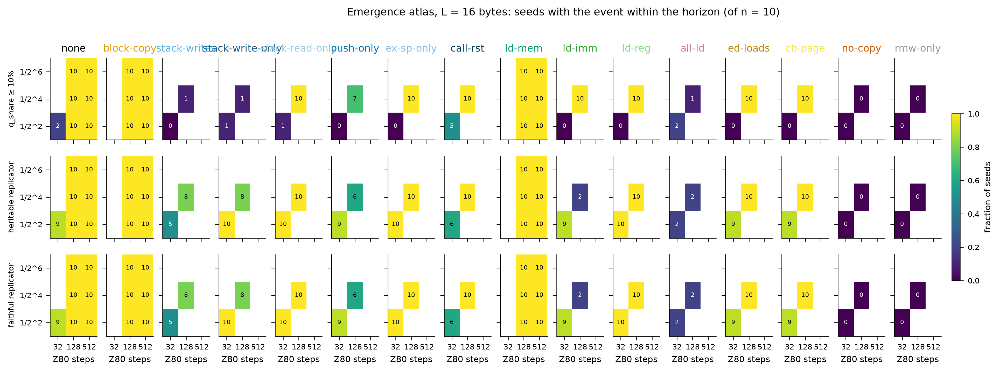
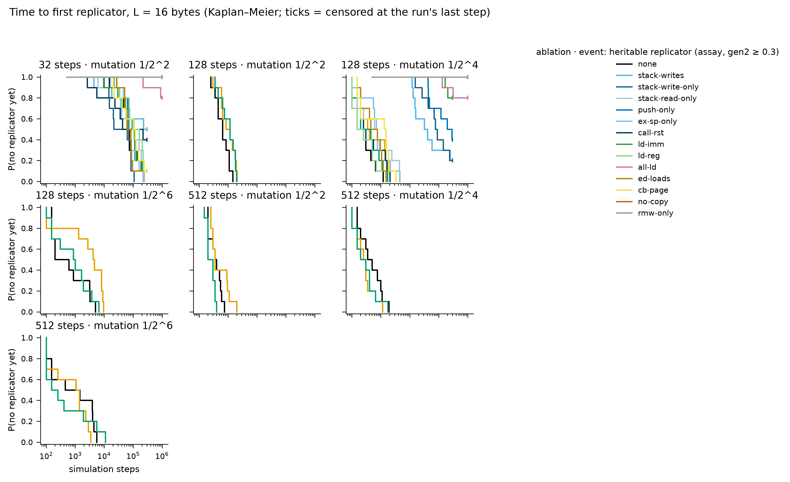
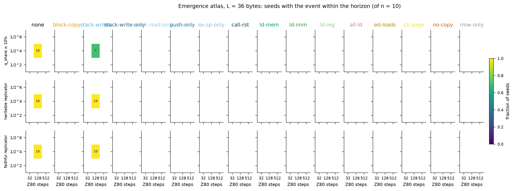
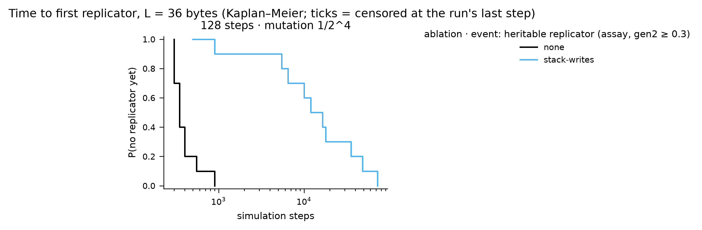
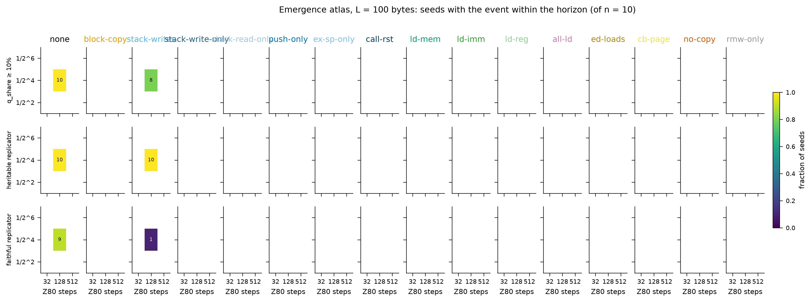
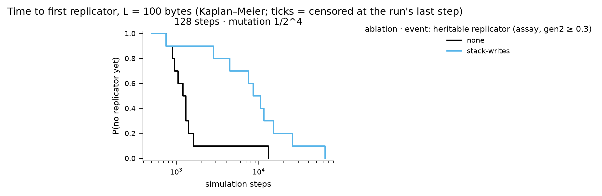

# Instruction-set ablation atlas — results

Batches: runs/stageC. Pre-registration and change log: `experiments/PLAN.md`; review: `experiments/REVIEW.md`. Emergence events: `tq_10` = quasispecies occupancy ≥ 10% (pre-registered primary; fires on zero-byte floods as well as replicators); `t_rep` = first top-3 exemplar with share ≥ 0.5% that is heritable (assay gen2 ≥ 0.3); `t_faith` = additionally ≥ 50% of partners became ≥ 75% copies. Times are Kaplan–Meier medians censored at each run's last step; sampling is every 500 steps, so 500 is the resolution floor.

## Pre-registered hypotheses

**H1 — block copy is dispensable early (L = 16, 128 steps, 1/16).** none 10/10 (KM median 200), block-copy 10/10 (KM median 350); Fisher two-sided p = 1. The pre-registered acceptance region (median ratio within [0.5, 2]) cannot be resolved: both medians sit at the first or second 500-step sample, so the test is only 'no difference detectable at 500-step resolution'.

**H2 — removing the stack-writing arm delays emergence > 10× and switches the mechanism (L = 16, 128 steps, 1/16).** stack-writes 8/10, KM median 32,000 vs none 200 (ratio 160×); first-replicator mechanisms under the ablation: block-copy:5, -:2, ld-mem:1. Caveat (review): the arm removes 46 opcodes of which 24 write nothing (POP, RET, EX DE,HL, EXX), so the delay is 'stack+exchange+return removed', not 'stack writes removed'; Stage D separates the two.

**H3 — no-copy leaves no replicator.** Heritable replicators (t_rep): 0 in 20 no-copy runs; rmw-only: 0 in 20. By the pre-registered occupancy event tq_10 as well: 0 crossings. The assay outcome (t_rep) was adopted after 19 runs were read (PLAN change log) and is the measure used here.

**H4 — the step budget is the strongest knob (unablated, L = 16).** KM median t_rep (steps × mutation):

|   k | 32     |   128 |   512 |
|----:|:-------|------:|------:|
|   2 | 68,500 |   650 |   350 |
|   4 | NR     |   200 |   350 |
|   6 | NR     |   200 |   450 |

Seed-paired budget contrast: 1/2^2: 128 steps faster than 32 steps in 10, slower in 0, tied in 0 of 10 seeds (sign test p = 0.002); 1/2^4: 128 steps faster than 32 steps in 0, slower in 0, tied in 0 of 0 seeds (sign test p = nan); 1/2^6: 128 steps faster than 32 steps in 0, slower in 0, tied in 0 of 0 seeds (sign test p = nan).

**H5 — mutation is non-monotone (unablated, L = 16).** Seed-paired contrasts between adjacent mutation rates: 32 steps: . 128 steps: 1/2^2 faster than 1/2^4 in 1, slower in 9, tied in 0 of 10 seeds (sign test p = 0.021); 1/2^4 faster than 1/2^6 in 5, slower in 4, tied in 1 of 10 seeds (sign test p = 1). 512 steps: 1/2^2 faster than 1/2^4 in 6, slower in 3, tied in 1 of 10 seeds (sign test p = 0.51); 1/2^4 faster than 1/2^6 in 5, slower in 5, tied in 0 of 10 seeds (sign test p = 1). The 'too low' side (k ≥ 8) was not run; a minimum cannot be claimed from k ∈ {2, 4, 6}.

## Emergence grids

### L = 16

| ablation | 32 steps · 1/2^2 | 32 steps · 1/2^4 | 32 steps · 1/2^6 | 128 steps · 1/2^2 | 128 steps · 1/2^4 | 128 steps · 1/2^6 | 512 steps · 1/2^2 | 512 steps · 1/2^4 | 512 steps · 1/2^6 |
|---|---|---|---|---|---|---|---|---|---|
| all-ld | 2/10 · **2/10** (NR) · 2/10 | – | – | – | 1/10 · **2/10** (NR) · 2/10 | – | – | – | – |
| block-copy | – | – | – | 10/10 · **10/10** (850) · 10/10 | 10/10 · **10/10** (350) · 10/10 | 10/10 · **10/10** (4,100) · 10/10 | 10/10 · **10/10** (350) · 10/10 | 10/10 · **10/10** (250) · 10/10 | 10/10 · **10/10** (1,050) · 10/10 |
| call-rst | 5/10 · **6/10** (42,500) · 6/10 | – | – | – | 10/10 · **10/10** (250) · 10/10 | – | – | – | – |
| cb-page | 0/10 · **9/10** (99,000) · 9/10 | – | – | – | 10/10 · **10/10** (1,300) · 10/10 | – | – | – | – |
| ed-loads | 0/10 · **9/10** (60,500) · 9/10 | – | – | – | 10/10 · **10/10** (450) · 10/10 | – | – | – | – |
| ex-sp-only | 0/10 · **10/10** (74,000) · 10/10 | – | – | – | 10/10 · **10/10** (700) · 10/10 | – | – | – | – |
| ld-imm | 0/10 · **9/10** (67,500) · 9/10 | – | – | – | 10/10 · **2/10** (NR) · 2/10 | – | – | – | – |
| ld-mem | – | – | – | 10/10 · **10/10** (1,150) · 10/10 | 10/10 · **10/10** (200) · 10/10 | 10/10 · **10/10** (850) · 10/10 | 10/10 · **10/10** (200) · 10/10 | 10/10 · **10/10** (200) · 10/10 | 10/10 · **10/10** (150) · 10/10 |
| ld-reg | 0/10 · **10/10** (104,500) · 10/10 | – | – | – | 10/10 · **10/10** (150) · 10/10 | – | – | – | – |
| no-copy | 0/10 · **0/10** (NR) · 0/10 | – | – | – | 0/10 · **0/10** (NR) · 0/10 | – | – | – | – |
| none | 2/10 · **9/10** (68,500) · 9/10 | – | – | 10/10 · **10/10** (650) · 10/10 | 10/10 · **10/10** (200) · 10/10 | 10/10 · **10/10** (200) · 10/10 | 10/10 · **10/10** (350) · 10/10 | 10/10 · **10/10** (350) · 10/10 | 10/10 · **10/10** (450) · 10/10 |
| push-only | 0/10 · **9/10** (93,000) · 9/10 | – | – | – | 7/10 · **6/10** (198,500) · 6/10 | – | – | – | – |
| rmw-only | 0/10 · **0/10** (NR) · 0/10 | – | – | – | 0/10 · **0/10** (NR) · 0/10 | – | – | – | – |
| stack-read-only | 1/10 · **10/10** (98,000) · 10/10 | – | – | – | 10/10 · **10/10** (600) · 10/10 | – | – | – | – |
| stack-write-only | 1/10 · **10/10** (21,500) · 10/10 | – | – | – | 1/10 · **8/10** (76,500) · 8/10 | – | – | – | – |
| stack-writes | 0/10 · **5/10** (228,000) · 5/10 | – | – | – | 1/10 · **8/10** (32,000) · 8/10 | – | – | – | – |

Each cell: seeds reaching q_share ≥ 10% (pre-registered) · **seeds with a heritable replicator** (KM median step, NR = not reached within the horizon) · seeds with a faithful replicator.

### L = 36

| ablation | 128 steps · 1/2^4 |
|---|---|
| none | 10/10 · **10/10** (350) · 10/10 |
| stack-writes | 7/10 · **10/10** (12,000) · 10/10 |

Each cell: seeds reaching q_share ≥ 10% (pre-registered) · **seeds with a heritable replicator** (KM median step, NR = not reached within the horizon) · seeds with a faithful replicator.

### L = 100

| ablation | 128 steps · 1/2^4 |
|---|---|
| none | 10/10 · **10/10** (1,200) · 9/10 |
| stack-writes | 8/10 · **10/10** (8,500) · 1/10 |

Each cell: seeds reaching q_share ≥ 10% (pre-registered) · **seeds with a heritable replicator** (KM median step, NR = not reached within the horizon) · seeds with a faithful replicator.

## Succession (census takeover times, family at 300k steps and at the last step)

| label            |   tape |   steps |   k |   n |   stopped_early |   last_step_min | final_at_last           | family_300k             |   stack_takeover_n |   stack_takeover_med |   ldir_takeover_n |   ldir_takeover_med |   ldir_invasions_complete |   ldir_invasions_censored |   ldir_invasion_med_steps |
|:-----------------|-------:|--------:|----:|----:|----------------:|----------------:|:------------------------|:------------------------|-------------------:|---------------------:|------------------:|--------------------:|--------------------------:|--------------------------:|--------------------------:|
| all-ld           |     16 |      32 |   2 |  10 |               0 |         1000000 | ldir:9, none:1          | none:6, ldir:4          |                  3 |               492000 |                 9 |              492000 |                         2 |                         7 |                    210000 |
| all-ld           |     16 |     128 |   4 |  10 |               0 |         1000000 | none:6, ldir:4          | none:6, ldir:4          |                  0 |                  nan |                 4 |              203500 |                         4 |                         0 |                      2000 |
| block-copy       |     16 |     128 |   2 |  10 |               0 |          300000 | none:6, ex_sp:4         | none:6, ex_sp:4         |                 10 |                14500 |                 0 |                 nan |                         0 |                         0 |                       nan |
| block-copy       |     16 |     128 |   4 |  10 |               0 |          300000 | ex_sp:10                | ex_sp:10                |                 10 |                 4575 |                 0 |                 nan |                         0 |                         0 |                       nan |
| block-copy       |     16 |     128 |   6 |  10 |               0 |          300000 | ex_sp:6, push:4         | ex_sp:6, push:4         |                 10 |                35000 |                 0 |                 nan |                         0 |                         0 |                       nan |
| block-copy       |     16 |     512 |   2 |  10 |               0 |          300000 | push:10                 | push:10                 |                 10 |                 1750 |                 0 |                 nan |                         0 |                         0 |                       nan |
| block-copy       |     16 |     512 |   4 |  10 |               0 |          300000 | ex_sp:10                | ex_sp:10                |                 10 |                 1150 |                 0 |                 nan |                         0 |                         0 |                       nan |
| block-copy       |     16 |     512 |   6 |  10 |               0 |          300000 | push:7, ex_sp:3         | push:7, ex_sp:3         |                 10 |                 1825 |                 0 |                 nan |                         0 |                         0 |                       nan |
| call-rst         |     16 |      32 |   2 |  10 |               0 |          300000 | ldir:10                 | ldir:10                 |                  3 |                46000 |                10 |               21000 |                         1 |                         9 |                     92000 |
| call-rst         |     16 |     128 |   4 |  10 |               0 |          300000 | ldir:9, ex_sp:1         | ldir:9, ex_sp:1         |                  1 |               145500 |                10 |               25500 |                        10 |                         0 |                      1750 |
| cb-page          |     16 |      32 |   2 |  10 |               0 |          300000 | ldir:9, none:1          | ldir:9, none:1          |                  0 |                  nan |                 9 |               93000 |                         0 |                         9 |                       nan |
| cb-page          |     16 |     128 |   4 |  10 |               0 |          300000 | ex_sp:10                | ex_sp:10                |                 10 |                 7000 |                 0 |                 nan |                         0 |                         0 |                       nan |
| ed-loads         |     16 |      32 |   2 |  10 |               0 |          300000 | ldir:10                 | ldir:10                 |                  0 |                  nan |                10 |               65250 |                         0 |                        10 |                       nan |
| ed-loads         |     16 |     128 |   4 |  10 |               0 |          300000 | ex_sp:9, ldir:1         | ex_sp:9, ldir:1         |                 10 |                 4325 |                 1 |               53500 |                         1 |                         0 |                      1500 |
| ex-sp-only       |     16 |      32 |   2 |  10 |               0 |          300000 | ldir:10                 | ldir:10                 |                  0 |                  nan |                10 |               68750 |                         0 |                        10 |                       nan |
| ex-sp-only       |     16 |     128 |   4 |  10 |               0 |          300000 | ldir:8, none:2          | ldir:8, none:2          |                  8 |                 9750 |                 8 |              116750 |                         8 |                         0 |                      2625 |
| ld-imm           |     16 |      32 |   2 |  10 |               0 |          300000 | ldir:9, none:1          | ldir:9, none:1          |                  0 |                  nan |                 9 |               61000 |                         0 |                         9 |                       nan |
| ld-imm           |     16 |     128 |   4 |  10 |               0 |          300000 | none:7, ldir:3          | none:7, ldir:3          |                  0 |                  nan |                 3 |              168500 |                         3 |                         0 |                      1000 |
| ld-mem           |     16 |     128 |   2 |  10 |               0 |          300000 | ldir:7, ex_sp:3         | ldir:7, ex_sp:3         |                  9 |                 9000 |                 7 |               68000 |                         2 |                         5 |                     42000 |
| ld-mem           |     16 |     128 |   4 |  10 |               0 |          300000 | ex_sp:10                | ex_sp:10                |                 10 |                 5225 |                 0 |                 nan |                         0 |                         0 |                       nan |
| ld-mem           |     16 |     128 |   6 |  10 |               0 |          300000 | ex_sp:9, ldir:1         | ex_sp:9, ldir:1         |                 10 |                21250 |                 1 |               53500 |                         1 |                         0 |                      1000 |
| ld-mem           |     16 |     512 |   2 |  10 |               0 |          300000 | push:10                 | push:10                 |                 10 |                 1175 |                 0 |                 nan |                         0 |                         0 |                       nan |
| ld-mem           |     16 |     512 |   4 |  10 |               0 |          300000 | ex_sp:10                | ex_sp:10                |                 10 |                 1275 |                 0 |                 nan |                         0 |                         0 |                       nan |
| ld-mem           |     16 |     512 |   6 |  10 |               0 |          300000 | ex_sp:8, ldir:2         | ex_sp:8, ldir:2         |                  9 |                 1000 |                 2 |                4950 |                         2 |                         0 |                      6125 |
| ld-reg           |     16 |      32 |   2 |  10 |               0 |          300000 | ldir:10                 | ldir:10                 |                  0 |                  nan |                10 |              124000 |                         3 |                         7 |                     28500 |
| ld-reg           |     16 |     128 |   4 |  10 |               0 |          300000 | ex_sp:6, ldir:4         | ex_sp:6, ldir:4         |                 10 |                 2725 |                 4 |               13250 |                         4 |                         0 |                      1750 |
| no-copy          |     16 |      32 |   2 |  10 |               0 |         1000000 | none:10                 | none:10                 |                  0 |                  nan |                 0 |                 nan |                         0 |                         0 |                       nan |
| no-copy          |     16 |     128 |   4 |  10 |               0 |         1000000 | none:10                 | none:10                 |                  0 |                  nan |                 0 |                 nan |                         0 |                         0 |                       nan |
| none             |     16 |      32 |   2 |  10 |               0 |          300000 | ldir:9, none:1          | ldir:9, none:1          |                  0 |                  nan |                 9 |               64000 |                         0 |                         9 |                       nan |
| none             |     16 |     128 |   2 |  10 |               0 |          300000 | ldir:8, ex_sp:2         | ldir:8, ex_sp:2         |                  9 |                15000 |                 8 |               63750 |                         0 |                         8 |                       nan |
| none             |     16 |     128 |   4 |  10 |               0 |          300000 | ex_sp:9, ldir:1         | ex_sp:9, ldir:1         |                 10 |                 4200 |                 1 |               38500 |                         1 |                         0 |                     23000 |
| none             |     16 |     128 |   6 |  10 |               0 |          300000 | ex_sp:8, ldir:2         | ex_sp:8, ldir:2         |                 10 |                14750 |                 2 |              130750 |                         2 |                         0 |                      1500 |
| none             |     16 |     512 |   2 |  10 |               0 |          300000 | push:10                 | push:10                 |                 10 |                 1525 |                 0 |                 nan |                         0 |                         0 |                       nan |
| none             |     16 |     512 |   4 |  10 |               0 |          300000 | ex_sp:9, ldir:1         | ex_sp:9, ldir:1         |                 10 |                 1625 |                 1 |              116500 |                         1 |                         0 |                      2000 |
| none             |     16 |     512 |   6 |  10 |               0 |          300000 | push:6, ex_sp:3, ldir:1 | push:6, ex_sp:3, ldir:1 |                 10 |                 4175 |                 1 |              260000 |                         1 |                         0 |                      5500 |
| none             |     36 |     128 |   4 |  10 |               0 |          300000 | push:10                 | push:10                 |                 10 |                 1000 |                 0 |                 nan |                         0 |                         0 |                       nan |
| none             |    100 |     128 |   4 |  10 |               0 |          300000 | push:7, ldir:3          | push:7, ldir:3          |                 10 |                 2500 |                 3 |                1700 |                         3 |                         0 |                      1350 |
| push-only        |     16 |      32 |   2 |  10 |               0 |          300000 | ldir:9, none:1          | ldir:9, none:1          |                  0 |                  nan |                 9 |               75500 |                         3 |                         6 |                    205500 |
| push-only        |     16 |     128 |   4 |  10 |               0 |          300000 | ldir:8, none:2          | ldir:8, none:2          |                  0 |                  nan |                 8 |               68500 |                         7 |                         1 |                      1500 |
| rmw-only         |     16 |      32 |   2 |  10 |               0 |         1000000 | none:10                 | none:10                 |                  0 |                  nan |                 0 |                 nan |                         0 |                         0 |                       nan |
| rmw-only         |     16 |     128 |   4 |  10 |               0 |         1000000 | none:10                 | none:10                 |                  0 |                  nan |                 0 |                 nan |                         0 |                         0 |                       nan |
| stack-read-only  |     16 |      32 |   2 |  10 |               0 |          300000 | ldir:10                 | ldir:10                 |                  0 |                  nan |                10 |               97750 |                         0 |                        10 |                       nan |
| stack-read-only  |     16 |     128 |   4 |  10 |               0 |          300000 | ldir:10                 | ldir:10                 |                  2 |                33000 |                10 |               32500 |                        10 |                         0 |                      2500 |
| stack-write-only |     16 |      32 |   2 |  10 |               0 |          300000 | ldir:10                 | ldir:10                 |                  0 |                  nan |                10 |               10500 |                         1 |                         9 |                    250000 |
| stack-write-only |     16 |     128 |   4 |  10 |               0 |          300000 | ldir:10                 | ldir:10                 |                  0 |                  nan |                10 |               66500 |                        10 |                         0 |                      1500 |
| stack-writes     |     16 |      32 |   2 |  10 |               0 |          300000 | ldir:10                 | ldir:10                 |                  0 |                  nan |                10 |                6500 |                         0 |                        10 |                       nan |
| stack-writes     |     16 |     128 |   4 |  10 |               0 |          300000 | ldir:10                 | ldir:10                 |                  0 |                  nan |                10 |               18000 |                        10 |                         0 |                      1500 |
| stack-writes     |     36 |     128 |   4 |  10 |               0 |          300000 | ldir:10                 | ldir:10                 |                  0 |                  nan |                10 |               11250 |                        10 |                         0 |                      1200 |
| stack-writes     |    100 |     128 |   4 |  10 |               0 |          300000 | ldir:10                 | ldir:10                 |                  1 |                 1850 |                10 |                1050 |                        10 |                         0 |                       775 |

## Replicator zoo — runs/stageC

## all-ld · L=16 · 32 steps · mutation 1/2^2
**first** (2 seeds)
- 1× `cb d3 ed b0 cb d3 ed b0 cb d3 ed b0 cb d3 ed b0` — [LDIR ; SET 2,E] ×4
- 1× `b0 f5 d1 ed b0 f5 d1 ed b0 f5 d1 ed b0 f5 d1 ed` — [LDIR ; PUSH rr ; POP rr] ×4

**final** (9 seeds)
- 1× `d1 e0 ed b0 97 02 28 32 61 f1 10 13 c8 e7 78 f9` — POP rr ; RET PO ; LDIR ; JR Z,d ; POP rr ; DJNZ d ; RET Z ; RST 20
- 1× `cb db d2 e4 ed b0 55 7f cb db d2 e4 ed b0 55 7f` — [JP NC,nn ; OR B ; SET 3,E] ×2
- 1× `d1 e0 ed b0 da 62 38 01 0d 01 00 00 6d 00 50 65` — POP rr ; RET PO ; LDIR ; JP C,nn
- 1× `d1 e0 ed b0 9d a1 9d 42 4d 61 0a 11 97 ff 1e 7f` — POP rr ; RET PO ; LDIR ; RST 38
- 1× `d1 e0 ed b0 bb 82 8f 26 9b 82 f6 60 39 01 1c b3` — POP rr ; RET PO ; LDIR
- 1× `b0 f5 d1 ed b0 f5 d1 ed b0 f5 d1 ed b0 f5 d1 ed` — [LDIR ; PUSH rr ; POP rr] ×4

## all-ld · L=16 · 128 steps · mutation 1/2^4
**first** (2 seeds)
- 1× `d9 cb db ed b0 76 e3 78 d9 cb db ed b0 76 e3 78` — [EX (SP),rr ; EXX ; SET 3,E ; LDIR ; HALT] ×2
- 1× `d1 00 27 c8 0c c6 ed b0 d1 00 27 c8 0c c6 ed b0` — [ADD A,n ; OR B ; POP rr ; NOP ; DAA ; RET Z ; INC C] ×2

**final** (4 seeds)
- 1× `d1 d1 74 1d c3 09 d7 50 72 ed b0 4d d1 57 d7 1d` — POP rr×2 ; JP nn ; LDIR ; POP rr ; RST 10
- 1× `4b 28 ed b0 53 c2 35 aa d1 f0 3c 59 58 43 3d b4` — JR Z,d ; JP NZ,nn ; POP rr ; RET P
- 1× `d1 c0 a1 88 da e6 ed b0 d1 c0 a1 88 da e6 ed b0` — [ADC A,B ; JP C,nn ; OR B ; POP rr ; RET NZ ; AND C] ×2
- 1× `d1 90 d1 c3 8b 84 66 3e 7d 53 c6 ed b0 38 19 da` — POP rr×2 ; JP nn ; JR C,d ; JP C,nn

## block-copy · L=16 · 128 steps · mutation 1/2^2
**first** (10 seeds)
- 10× `11 d5 11 d5 11 d5 11 d5 11 d5 11 d5 11 d5 11 d5` — [LD rr,nn ; PUSH rr] ×8

**final** (10 seeds)
- 6× `21 e5 21 e5 21 e5 21 e5 21 e5 21 e5 21 e5 21 e5` — [LD rr,nn ; PUSH rr] ×8
- 2× `c8 e3 21 e3 21 81 c8 81 c8 e3 21 e3 21 81 c8 81` — [ADD A,C ; RET Z ; ADD A,C ; RET Z ; EX (SP),rr ; LD rr,nn] ×2
- 1× `ae e3 21 e3 21 e0 ae e0 ae e3 21 e3 21 e0 ae e0` — [EX (SP),rr ; LD rr,nn ; RET PO ; XOR (HL) ; RET PO ; XOR (HL)] ×2
- 1× `ad e3 21 e3 21 c0 ad c0 ad e3 21 e3 21 c0 ad c0` — [EX (SP),rr ; LD rr,nn ; RET NZ ; XOR L ; RET NZ ; XOR L] ×2

## block-copy · L=16 · 128 steps · mutation 1/2^4
**first** (10 seeds)
- 10× `01 c5 01 c5 01 c5 01 c5 01 c5 01 c5 01 c5 01 c5` — [LD rr,nn ; PUSH rr] ×8

**final** (10 seeds)
- 10× `ad e3 21 e3 21 c0 ad c0 ad e3 21 e3 21 c0 ad c0` — [EX (SP),rr ; LD rr,nn ; RET NZ ; XOR L ; RET NZ ; XOR L] ×2

## block-copy · L=16 · 128 steps · mutation 1/2^6
**first** (10 seeds)
- 10× `21 e5 21 e5 21 e5 21 e5 21 e5 21 e5 21 e5 21 e5` — [LD rr,nn ; PUSH rr] ×8

**final** (10 seeds)
- 5× `ad e3 21 e3 21 c0 ad c0 ad e3 21 e3 21 c0 ad c0` — [EX (SP),rr ; LD rr,nn ; RET NZ ; XOR L ; RET NZ ; XOR L] ×2
- 4× `e5 2a e5 2a e5 2a e5 2a e5 2a e5 2a e5 2a e5 2a` — [LD rr,(nn) ; PUSH rr] ×8
- 1× `ae e3 21 e3 21 e0 ae e0 ae e3 21 e3 21 e0 ae e0` — [EX (SP),rr ; LD rr,nn ; RET PO ; XOR (HL) ; RET PO ; XOR (HL)] ×2

## block-copy · L=16 · 512 steps · mutation 1/2^2
**first** (10 seeds)
- 10× `01 c5 01 c5 01 c5 01 c5 01 c5 01 c5 01 c5 01 c5` — [LD rr,nn ; PUSH rr] ×8

**final** (10 seeds)
- 10× `01 c5 01 c5 01 c5 01 c5 01 c5 01 c5 01 c5 01 c5` — [LD rr,nn ; PUSH rr] ×8

## block-copy · L=16 · 512 steps · mutation 1/2^4
**first** (10 seeds)
- 10× `01 c5 01 c5 01 c5 01 c5 01 c5 01 c5 01 c5 01 c5` — [LD rr,nn ; PUSH rr] ×8

**final** (10 seeds)
- 8× `c8 e3 21 e3 21 81 c8 81 c8 e3 21 e3 21 81 c8 81` — [ADD A,C ; RET Z ; ADD A,C ; RET Z ; EX (SP),rr ; LD rr,nn] ×2
- 1× `b5 e3 21 e3 21 e8 b5 e8 b5 e3 21 e3 21 e8 b5 e8` — [EX (SP),rr ; LD rr,nn ; RET PE ; OR L ; RET PE ; OR L] ×2
- 1× `5a e3 21 e3 21 c0 5a c0 5a e3 21 e3 21 c0 5a c0` — [EX (SP),rr ; LD rr,nn ; RET NZ ; LD r,r ; RET NZ ; LD r,r] ×2

## block-copy · L=16 · 512 steps · mutation 1/2^6
**first** (10 seeds)
- 10× `11 d5 11 d5 11 d5 11 d5 11 d5 11 d5 11 d5 11 d5` — [LD rr,nn ; PUSH rr] ×8

**final** (10 seeds)
- 7× `e5 2a e5 2a e5 2a e5 2a e5 2a e5 2a e5 2a e5 2a` — [LD rr,(nn) ; PUSH rr] ×8
- 1× `c8 e3 21 e3 21 81 c8 81 c8 e3 21 e3 21 81 c8 81` — [ADD A,C ; RET Z ; ADD A,C ; RET Z ; EX (SP),rr ; LD rr,nn] ×2
- 1× `5e e3 21 e3 21 e0 5e e0 5e e3 21 e3 21 e0 5e e0` — [EX (SP),rr ; LD rr,nn ; RET PO ; LD r,(HL) ; RET PO ; LD r,(HL)] ×2
- 1× `f3 e3 21 e3 21 c0 f3 c0 f3 e3 21 e3 21 c0 f3 c0` — [DI ; EX (SP),rr ; LD rr,nn ; RET NZ ; DI ; RET NZ] ×2

## call-rst · L=16 · 32 steps · mutation 1/2^2
**first** (6 seeds)
- 4× `e5 2a e5 2a e5 2a e5 2a e5 2a e5 2a e5 2a e5 2a` — [LD rr,(nn) ; PUSH rr] ×8
- 1× `b0 f5 d1 ed b0 f5 d1 ed b0 f5 d1 ed b0 f5 d1 ed` — [LDIR ; PUSH rr ; POP rr] ×4
- 1× `1e c4 ed b0 1e c4 ed b0 1e c4 ed b0 1e c4 ed b0` — [LD r,n ; LDIR] ×4

**final** (10 seeds)
- 3× `b0 f5 d1 ed b0 f5 d1 ed b0 f5 d1 ed b0 f5 d1 ed` — [LDIR ; PUSH rr ; POP rr] ×4
- 2× `24 5e ed b0 24 5e ed b0 24 5e ed b0 24 5e ed b0` — [INC H ; LD r,(HL) ; LDIR] ×4
- 1× `e4 5e ed b0 e4 5e ed b0 e4 5e ed b0 e4 5e ed b0` — [LD r,(HL) ; LDIR] ×4
- 1× `28 a4 5e ed b0 69 26 85 28 a4 5e ed b0 69 26 85` — [JR Z,d ; LD r,(HL) ; LDIR ; LD r,r ; LD r,n] ×2
- 1× `28 22 5e ed b0 d2 f4 8b 28 22 5e ed b0 d2 f4 8b` — [JP NC,nn ; JR Z,d ; LD r,(HL) ; LDIR] ×2
- 1× `04 5e ed b0 04 5e ed b0 04 5e ed b0 04 5e ed b0` — [INC B ; LD r,(HL) ; LDIR] ×4

## call-rst · L=16 · 128 steps · mutation 1/2^4
**first** (10 seeds)
- 10× `01 c5 01 c5 01 c5 01 c5 01 c5 01 c5 01 c5 01 c5` — [LD rr,nn ; PUSH rr] ×8

**final** (10 seeds)
- 1× `e2 e2 11 68 3d ed b0 51 e2 e2 11 68 3d ed b0 51` — [DEC A ; LDIR ; LD r,r ; JP PO,nn ; LD r,r] ×2
- 1× `28 e4 5e ed b0 2c bb 41 28 e4 5e ed b0 2c bb 41` — [CP E ; LD r,r ; JR Z,d ; LD r,(HL) ; LDIR ; INC L] ×2
- 1× `f0 5e c3 ce 82 f2 68 b6 e1 46 2c 1a 05 f0 ed b0` — LD r,(HL) ; JP nn ; JP P,nn ; POP rr ; LD r,(HL) ; LD r,(DE) ; LDIR
- 1× `cb d3 ed b0 cb d3 ed b0 cb d3 ed b0 cb d3 ed b0` — [LDIR ; SET 2,E] ×4
- 1× `cb e3 c3 0b e2 fa 29 f6 a9 43 22 ed b0 d4 9b 00` — JP nn ; JP M,nn ; LD (nn),rr
- 1× `11 90 bd c3 8e ed bb ea 8d ce eb b6 a2 dd ed b0` — LD rr,nn ; JP nn ; JP PE,nn ; EX rr,rr ; LDIR

## cb-page · L=16 · 32 steps · mutation 1/2^2
**first** (9 seeds)
- 4× `44 5e ed b0 44 5e ed b0 44 5e ed b0 44 5e ed b0` — [LD r,(HL) ; LDIR ; LD r,r] ×4
- 2× `04 5e ed b0 04 5e ed b0 04 5e ed b0 04 5e ed b0` — [INC B ; LD r,(HL) ; LDIR] ×4
- 2× `24 5e ed b0 24 5e ed b0 24 5e ed b0 24 5e ed b0` — [INC H ; LD r,(HL) ; LDIR] ×4
- 1× `1e 84 ed b0 1e 84 ed b0 1e 84 ed b0 1e 84 ed b0` — [LD r,n ; LDIR] ×4

**final** (9 seeds)
- 5× `44 5e ed b0 44 5e ed b0 44 5e ed b0 44 5e ed b0` — [LD r,(HL) ; LDIR ; LD r,r] ×4
- 3× `24 5e ed b0 24 5e ed b0 24 5e ed b0 24 5e ed b0` — [INC H ; LD r,(HL) ; LDIR] ×4
- 1× `04 5e ed b0 04 5e ed b0 04 5e ed b0 04 5e ed b0` — [INC B ; LD r,(HL) ; LDIR] ×4

## cb-page · L=16 · 128 steps · mutation 1/2^4
**first** (10 seeds)
- 10× `01 c5 01 c5 01 c5 01 c5 01 c5 01 c5 01 c5 01 c5` — [LD rr,nn ; PUSH rr] ×8

**final** (10 seeds)
- 9× `ad e3 21 e3 21 c0 ad c0 ad e3 21 e3 21 c0 ad c0` — [EX (SP),rr ; LD rr,nn ; RET NZ ; XOR L ; RET NZ ; XOR L] ×2
- 1× `c8 e3 21 e3 21 81 c8 81 c8 e3 21 e3 21 81 c8 81` — [ADD A,C ; RET Z ; ADD A,C ; RET Z ; EX (SP),rr ; LD rr,nn] ×2

## ed-loads · L=16 · 32 steps · mutation 1/2^2
**first** (9 seeds)
- 4× `24 5e ed b0 24 5e ed b0 24 5e ed b0 24 5e ed b0` — [INC H ; LD r,(HL) ; LDIR] ×4
- 2× `04 5e ed b0 04 5e ed b0 04 5e ed b0 04 5e ed b0` — [INC B ; LD r,(HL) ; LDIR] ×4
- 2× `44 5e ed b0 44 5e ed b0 44 5e ed b0 44 5e ed b0` — [LD r,(HL) ; LDIR ; LD r,r] ×4
- 1× `a4 5e ed b0 a4 5e ed b0 a4 5e ed b0 a4 5e ed b0` — [AND H ; LD r,(HL) ; LDIR] ×4

**final** (10 seeds)
- 6× `44 5e ed b0 44 5e ed b0 44 5e ed b0 44 5e ed b0` — [LD r,(HL) ; LDIR ; LD r,r] ×4
- 2× `a4 5e ed b0 a4 5e ed b0 a4 5e ed b0 a4 5e ed b0` — [AND H ; LD r,(HL) ; LDIR] ×4
- 1× `d1 e0 ed b0 1f a2 f9 1f f4 0e 7c 9b 27 9f 43 a3` — POP rr ; RET PO ; LDIR ; LD SP,HL ; CALL P,nn
- 1× `d1 e0 f8 b0 7d 4a 90 ac d1 3f ed b0 d1 e0 f8 b0` — POP rr ; RET PO ; RET M ; POP rr ; LDIR ; POP rr ; RET PO ; RET M

## ed-loads · L=16 · 128 steps · mutation 1/2^4
**first** (10 seeds)
- 10× `01 c5 01 c5 01 c5 01 c5 01 c5 01 c5 01 c5 01 c5` — [LD rr,nn ; PUSH rr] ×8

**final** (10 seeds)
- 9× `ad e3 21 e3 21 c0 ad c0 ad e3 21 e3 21 c0 ad c0` — [EX (SP),rr ; LD rr,nn ; RET NZ ; XOR L ; RET NZ ; XOR L] ×2
- 1× `28 1b 5e ed b0 27 c1 c5 28 1b 5e ed b0 27 c1 c5` — [DAA ; POP rr ; PUSH rr ; JR Z,d ; LD r,(HL) ; LDIR] ×2

## ex-sp-only · L=16 · 32 steps · mutation 1/2^2
**first** (10 seeds)
- 4× `04 5e ed b0 04 5e ed b0 04 5e ed b0 04 5e ed b0` — [INC B ; LD r,(HL) ; LDIR] ×4
- 4× `64 5e ed b0 64 5e ed b0 64 5e ed b0 64 5e ed b0` — [LD r,(HL) ; LDIR ; LD r,r] ×4
- 1× `a4 5e ed b0 a4 5e ed b0 a4 5e ed b0 a4 5e ed b0` — [AND H ; LD r,(HL) ; LDIR] ×4
- 1× `24 5e ed b0 24 5e ed b0 24 5e ed b0 24 5e ed b0` — [INC H ; LD r,(HL) ; LDIR] ×4

**final** (10 seeds)
- 3× `04 5e ed b0 04 5e ed b0 04 5e ed b0 04 5e ed b0` — [INC B ; LD r,(HL) ; LDIR] ×4
- 2× `24 5e ed b0 24 5e ed b0 24 5e ed b0 24 5e ed b0` — [INC H ; LD r,(HL) ; LDIR] ×4
- 2× `84 5e ed b0 84 5e ed b0 84 5e ed b0 84 5e ed b0` — [ADD A,H ; LD r,(HL) ; LDIR] ×4
- 1× `a4 5e ed b0 a4 5e ed b0 a4 5e ed b0 a4 5e ed b0` — [AND H ; LD r,(HL) ; LDIR] ×4
- 1× `44 5e ed b0 44 5e ed b0 44 5e ed b0 44 5e ed b0` — [LD r,(HL) ; LDIR ; LD r,r] ×4
- 1× `d1 c0 ed b0 f3 c2 f8 f8 00 00 22 34 a6 8e 00 00` — POP rr ; RET NZ ; LDIR ; JP NZ,nn ; LD (nn),rr

## ex-sp-only · L=16 · 128 steps · mutation 1/2^4
**first** (10 seeds)
- 10× `21 e5 21 e5 21 e5 21 e5 21 e5 21 e5 21 e5 21 e5` — [LD rr,nn ; PUSH rr] ×8

**final** (10 seeds)
- 2× `01 c5 01 c5 01 c5 01 c5 01 c5 01 c5 01 c5 01 c5` — [LD rr,nn ; PUSH rr] ×8
- 1× `d2 21 48 f0 ed b8 58 5c d2 21 48 f0 ed b8 58 5c` — [JP NC,nn ; RET P ; LDDR ; LD r,r ; LD r,r] ×2
- 1× `44 5e ed b0 44 5e ed b0 44 5e ed b0 44 5e ed b0` — [LD r,(HL) ; LDIR ; LD r,r] ×4
- 1× `84 5e ed b0 84 5e ed b0 84 5e ed b0 84 5e ed b0` — [ADD A,H ; LD r,(HL) ; LDIR] ×4
- 1× `b0 8c 5e c3 6b 7e ba e7 5a 14 23 ed b0 8f 24 de` — LD r,(HL) ; JP nn ; RST 20 ; LDIR
- 1× `d1 88 d1 e2 e5 ed b0 b2 d1 88 d1 e2 e5 ed b0 b2` — [ADC A,B ; POP rr ; JP PO,nn ; OR B ; OR D ; POP rr] ×2

## ld-imm · L=16 · 32 steps · mutation 1/2^2
**first** (9 seeds)
- 3× `44 5e ed b0 44 5e ed b0 44 5e ed b0 44 5e ed b0` — [LD r,(HL) ; LDIR ; LD r,r] ×4
- 2× `24 5e ed b0 24 5e ed b0 24 5e ed b0 24 5e ed b0` — [INC H ; LD r,(HL) ; LDIR] ×4
- 2× `04 5e ed b0 04 5e ed b0 04 5e ed b0 04 5e ed b0` — [INC B ; LD r,(HL) ; LDIR] ×4
- 1× `a4 5e ed b0 a4 5e ed b0 a4 5e ed b0 a4 5e ed b0` — [AND H ; LD r,(HL) ; LDIR] ×4
- 1× `84 5e ed b0 84 5e ed b0 84 5e ed b0 84 5e ed b0` — [ADD A,H ; LD r,(HL) ; LDIR] ×4

**final** (9 seeds)
- 3× `04 5e ed b0 04 5e ed b0 04 5e ed b0 04 5e ed b0` — [INC B ; LD r,(HL) ; LDIR] ×4
- 2× `64 5e ed b0 64 5e ed b0 64 5e ed b0 64 5e ed b0` — [LD r,(HL) ; LDIR ; LD r,r] ×4
- 2× `24 5e ed b0 24 5e ed b0 24 5e ed b0 24 5e ed b0` — [INC H ; LD r,(HL) ; LDIR] ×4
- 2× `84 5e ed b0 84 5e ed b0 84 5e ed b0 84 5e ed b0` — [ADD A,H ; LD r,(HL) ; LDIR] ×4

## ld-imm · L=16 · 128 steps · mutation 1/2^4
**first** (2 seeds)
- 1× `84 5e ed b0 84 5e ed b0 84 5e ed b0 84 5e ed b0` — [ADD A,H ; LD r,(HL) ; LDIR] ×4
- 1× `a4 5e ed b0 a4 5e ed b0 a4 5e ed b0 a4 5e ed b0` — [AND H ; LD r,(HL) ; LDIR] ×4

**final** (3 seeds)
- 1× `28 de 5e ed b0 75 77 ff 28 de 5e ed b0 75 77 ff` — [JR Z,d ; LD r,(HL) ; LDIR ; LD (HL),r ; LD (HL),r ; RST 38] ×2
- 1× `28 02 5e ed b0 de 80 e6 28 02 5e ed b0 de 80 e6` — [AND n ; LD (BC),r ; LD r,(HL) ; LDIR ; SBC A,n] ×2
- 1× `00 c3 c6 48 b1 c9 2a a9 ef 70 ed b8 c2 01 00 00` — JP nn ; RET ; LD rr,(nn) ; LD (HL),r ; LDDR ; JP NZ,nn

## ld-mem · L=16 · 128 steps · mutation 1/2^2
**first** (10 seeds)
- 10× `01 c5 01 c5 01 c5 01 c5 01 c5 01 c5 01 c5 01 c5` — [LD rr,nn ; PUSH rr] ×8

**final** (10 seeds)
- 3× `ad e3 21 e3 21 c0 ad c0 ad e3 21 e3 21 c0 ad c0` — [EX (SP),rr ; LD rr,nn ; RET NZ ; XOR L ; RET NZ ; XOR L] ×2
- 1× `1d 83 e2 c0 9a ed b0 be 6d f6 78 00 00 e7 00 4d` — JP PO,nn ; LDIR ; RST 20
- 1× `b0 1e 84 ed b0 1e 84 ed b0 1e 84 ed b0 1e 84 ed` — [LD r,n ; LDIR] ×4
- 1× `11 70 28 c3 2b 8f b9 c3 6d eb ad ed b0 a2 ea 12` — LD rr,nn ; JP nn×2 ; LDIR ; JP PE,nn
- 1× `6b cb db 1f ed b0 c0 2f 6b cb db 1f ed b0 c0 2f` — [CPL ; LD r,r ; SET 3,E ; RRA ; LDIR ; RET NZ] ×2
- 1× `1e b0 c3 2b ff 84 93 ec 7a f2 4c ed b0 8c 53 95` — LD r,n ; JP nn ; CALL PE,nn ; LDIR

## ld-mem · L=16 · 128 steps · mutation 1/2^4
**first** (10 seeds)
- 10× `01 c5 01 c5 01 c5 01 c5 01 c5 01 c5 01 c5 01 c5` — [LD rr,nn ; PUSH rr] ×8

**final** (10 seeds)
- 10× `ad e3 21 e3 21 c0 ad c0 ad e3 21 e3 21 c0 ad c0` — [EX (SP),rr ; LD rr,nn ; RET NZ ; XOR L ; RET NZ ; XOR L] ×2

## ld-mem · L=16 · 128 steps · mutation 1/2^6
**first** (10 seeds)
- 10× `01 c5 01 c5 01 c5 01 c5 01 c5 01 c5 01 c5 01 c5` — [LD rr,nn ; PUSH rr] ×8

**final** (10 seeds)
- 6× `ad e3 21 e3 21 c0 ad c0 ad e3 21 e3 21 c0 ad c0` — [EX (SP),rr ; LD rr,nn ; RET NZ ; XOR L ; RET NZ ; XOR L] ×2
- 3× `ac e3 21 e3 21 c0 ac c0 ac e3 21 e3 21 c0 ac c0` — [EX (SP),rr ; LD rr,nn ; RET NZ ; XOR H ; RET NZ ; XOR H] ×2
- 1× `11 10 f6 c3 6b 01 f0 cd eb ea f3 ed b0 4a 00 71` — LD rr,nn ; JP nn ; RET P ; CALL nn ; LDIR

## ld-mem · L=16 · 512 steps · mutation 1/2^2
**first** (10 seeds)
- 10× `01 c5 01 c5 01 c5 01 c5 01 c5 01 c5 01 c5 01 c5` — [LD rr,nn ; PUSH rr] ×8

**final** (10 seeds)
- 10× `21 e5 21 e5 21 e5 21 e5 21 e5 21 e5 21 e5 21 e5` — [LD rr,nn ; PUSH rr] ×8

## ld-mem · L=16 · 512 steps · mutation 1/2^4
**first** (10 seeds)
- 10× `01 c5 01 c5 01 c5 01 c5 01 c5 01 c5 01 c5 01 c5` — [LD rr,nn ; PUSH rr] ×8

**final** (10 seeds)
- 5× `c8 e3 21 e3 21 81 c8 81 c8 e3 21 e3 21 81 c8 81` — [ADD A,C ; RET Z ; ADD A,C ; RET Z ; EX (SP),rr ; LD rr,nn] ×2
- 2× `22 e3 21 e3 21 c0 22 c0 22 e3 21 e3 21 c0 22 c0` — [EX (SP),rr ; LD rr,nn ; RET NZ ; RET NZ] ×2
- 2× `b5 e3 21 e3 21 e8 b5 e8 b5 e3 21 e3 21 e8 b5 e8` — [EX (SP),rr ; LD rr,nn ; RET PE ; OR L ; RET PE ; OR L] ×2
- 1× `6d e3 21 e3 21 c0 6d c0 6d e3 21 e3 21 c0 6d c0` — [EX (SP),rr ; LD rr,nn ; RET NZ ; LD r,r ; RET NZ ; LD r,r] ×2

## ld-mem · L=16 · 512 steps · mutation 1/2^6
**first** (10 seeds)
- 9× `01 c5 01 c5 01 c5 01 c5 01 c5 01 c5 01 c5 01 c5` — [LD rr,nn ; PUSH rr] ×8
- 1× `1e 50 ed 50 ed 50 ed 50 ed 50 ed b0 75 0b 00 86` — LD r,n ; LDIR

**final** (10 seeds)
- 4× `c8 e3 21 e3 21 81 c8 81 c8 e3 21 e3 21 81 c8 81` — [ADD A,C ; RET Z ; ADD A,C ; RET Z ; EX (SP),rr ; LD rr,nn] ×2
- 2× `e8 e3 21 e3 21 a1 e8 a1 e8 e3 21 e3 21 a1 e8 a1` — [AND C ; RET PE ; AND C ; RET PE ; EX (SP),rr ; LD rr,nn] ×2
- 1× `2e 30 eb 6c 9c ee 51 f6 d2 fa 6d 36 26 ed b0 0c` — LD r,n ; EX rr,rr ; JP M,nn ; LD r,n
- 1× `1e 90 d2 ea 92 d8 6b d3 57 58 ed b0 27 7d f4 e7` — LD r,n ; JP NC,nn ; RET C ; LDIR ; CALL P,nn
- 1× `0f e3 21 e3 21 c0 0f c0 0f e3 21 e3 21 c0 0f c0` — [EX (SP),rr ; LD rr,nn ; RET NZ ; RRCA ; RET NZ ; RRCA] ×2
- 1× `35 e3 21 e3 21 c9 35 c9 35 e3 21 e3 21 c9 35 c9` — [DEC (HL) ; EX (SP),rr ; LD rr,nn ; RET ; DEC (HL) ; RET] ×2

## ld-reg · L=16 · 32 steps · mutation 1/2^2
**first** (10 seeds)
- 3× `84 5e ed b0 84 5e ed b0 84 5e ed b0 84 5e ed b0` — [ADD A,H ; LD r,(HL) ; LDIR] ×4
- 3× `64 5e ed b0 64 5e ed b0 64 5e ed b0 64 5e ed b0` — [LD r,(HL) ; LDIR] ×4
- 2× `a4 5e ed b0 a4 5e ed b0 a4 5e ed b0 a4 5e ed b0` — [AND H ; LD r,(HL) ; LDIR] ×4
- 2× `24 5e ed b0 24 5e ed b0 24 5e ed b0 24 5e ed b0` — [INC H ; LD r,(HL) ; LDIR] ×4

**final** (10 seeds)
- 5× `44 5e ed b0 44 5e ed b0 44 5e ed b0 44 5e ed b0` — [LD r,(HL) ; LDIR] ×4
- 1× `c8 6e eb ed b0 82 99 76 c8 6e eb ed b0 82 99 76` — [ADD A,D ; SBC A,C ; HALT ; RET Z ; LD r,(HL) ; EX rr,rr ; LDIR] ×2
- 1× `24 5e ed b0 24 5e ed b0 24 5e ed b0 24 5e ed b0` — [INC H ; LD r,(HL) ; LDIR] ×4
- 1× `c8 6e eb ed b0 97 87 b8 c8 6e eb ed b0 97 87 b8` — [ADD A,A ; CP B ; RET Z ; LD r,(HL) ; EX rr,rr ; LDIR ; SUB A] ×2
- 1× `04 5e ed b0 04 5e ed b0 04 5e ed b0 04 5e ed b0` — [INC B ; LD r,(HL) ; LDIR] ×4
- 1× `c8 6e eb ed b0 cc f4 7b c8 6e eb ed b0 cc f4 7b` — [CALL Z,nn ; RET Z ; LD r,(HL) ; EX rr,rr ; LDIR] ×2

## ld-reg · L=16 · 128 steps · mutation 1/2^4
**first** (10 seeds)
- 10× `01 c5 01 c5 01 c5 01 c5 01 c5 01 c5 01 c5 01 c5` — [LD rr,nn ; PUSH rr] ×8

**final** (10 seeds)
- 6× `ad e3 21 e3 21 c0 ad c0 ad e3 21 e3 21 c0 ad c0` — [EX (SP),rr ; LD rr,nn ; RET NZ ; XOR L ; RET NZ ; XOR L] ×2
- 1× `11 50 66 c3 07 e2 d2 59 6c ce 80 ed b0 11 1d 22` — LD rr,nn ; JP nn ; JP NC,nn ; LDIR ; LD rr,nn
- 1× `b8 c3 c4 29 21 68 f3 ed b8 c3 c4 29 21 68 f3 ed` — [JP nn ; LD rr,nn ; LDDR] ×2
- 1× `28 c3 5e ed b0 69 67 3e 28 c3 5e ed b0 69 67 3e` — [JP nn ; OR B ; LD r,n] ×2
- 1× `28 63 5e ed b0 4e b4 42 28 63 5e ed b0 4e b4 42` — [JR Z,d ; LD r,(HL) ; LDIR ; LD r,(HL) ; OR H] ×2

## none · L=16 · 32 steps · mutation 1/2^2
**first** (9 seeds)
- 3× `1e 04 ed b0 1e 04 ed b0 1e 04 ed b0 1e 04 ed b0` — [LD r,n ; LDIR] ×4
- 3× `44 5e ed b0 44 5e ed b0 44 5e ed b0 44 5e ed b0` — [LD r,(HL) ; LDIR ; LD r,r] ×4
- 1× `24 5e ed b0 24 5e ed b0 24 5e ed b0 24 5e ed b0` — [INC H ; LD r,(HL) ; LDIR] ×4
- 1× `04 5e ed b0 04 5e ed b0 04 5e ed b0 04 5e ed b0` — [INC B ; LD r,(HL) ; LDIR] ×4
- 1× `b0 f5 d1 ed b0 f5 d1 ed b0 f5 d1 ed b0 f5 d1 ed` — [LDIR ; PUSH rr ; POP rr] ×4

**final** (9 seeds)
- 3× `24 5e ed b0 24 5e ed b0 24 5e ed b0 24 5e ed b0` — [INC H ; LD r,(HL) ; LDIR] ×4
- 3× `04 5e ed b0 04 5e ed b0 04 5e ed b0 04 5e ed b0` — [INC B ; LD r,(HL) ; LDIR] ×4
- 2× `64 5e ed b0 64 5e ed b0 64 5e ed b0 64 5e ed b0` — [LD r,(HL) ; LDIR ; LD r,r] ×4
- 1× `84 5e ed b0 84 5e ed b0 84 5e ed b0 84 5e ed b0` — [ADD A,H ; LD r,(HL) ; LDIR] ×4

## none · L=16 · 128 steps · mutation 1/2^2
**first** (10 seeds)
- 10× `01 c5 01 c5 01 c5 01 c5 01 c5 01 c5 01 c5 01 c5` — [LD rr,nn ; PUSH rr] ×8

**final** (10 seeds)
- 3× `24 5e ed b0 24 5e ed b0 24 5e ed b0 24 5e ed b0` — [INC H ; LD r,(HL) ; LDIR] ×4
- 2× `64 5e ed b0 64 5e ed b0 64 5e ed b0 64 5e ed b0` — [LD r,(HL) ; LDIR ; LD r,r] ×4
- 2× `ad e3 21 e3 21 c0 ad c0 ad e3 21 e3 21 c0 ad c0` — [EX (SP),rr ; LD rr,nn ; RET NZ ; XOR L ; RET NZ ; XOR L] ×2
- 2× `04 5e ed b0 04 5e ed b0 04 5e ed b0 04 5e ed b0` — [INC B ; LD r,(HL) ; LDIR] ×4
- 1× `6b cb db 81 ed b0 57 af 6b cb db 81 ed b0 57 af` — [ADD A,C ; LDIR ; LD r,r ; XOR A ; LD r,r ; SET 3,E] ×2

## none · L=16 · 128 steps · mutation 1/2^4
**first** (10 seeds)
- 10× `01 c5 01 c5 01 c5 01 c5 01 c5 01 c5 01 c5 01 c5` — [LD rr,nn ; PUSH rr] ×8

**final** (10 seeds)
- 9× `ad e3 21 e3 21 c0 ad c0 ad e3 21 e3 21 c0 ad c0` — [EX (SP),rr ; LD rr,nn ; RET NZ ; XOR L ; RET NZ ; XOR L] ×2
- 1× `d1 c0 ed b0 b8 02 66 d1 55 17 2b 37 18 77 2b bc` — POP rr ; RET NZ ; LDIR ; LD (BC),r ; LD r,(HL) ; POP rr ; JR d

## none · L=16 · 128 steps · mutation 1/2^6
**first** (10 seeds)
- 10× `01 c5 01 c5 01 c5 01 c5 01 c5 01 c5 01 c5 01 c5` — [LD rr,nn ; PUSH rr] ×8

**final** (10 seeds)
- 8× `ad e3 21 e3 21 c0 ad c0 ad e3 21 e3 21 c0 ad c0` — [EX (SP),rr ; LD rr,nn ; RET NZ ; XOR L ; RET NZ ; XOR L] ×2
- 1× `11 a8 35 4b 0f ed b0 34 11 a8 35 4b 0f ed b0 34` — [INC (HL) ; LD rr,nn ; LD r,r ; RRCA ; LDIR] ×2
- 1× `28 14 5e ed b0 65 f2 6d 28 14 5e ed b0 65 f2 6d` — [INC D ; LD r,(HL) ; LDIR ; LD r,r ; JP P,nn] ×2

## none · L=16 · 512 steps · mutation 1/2^2
**first** (10 seeds)
- 10× `01 c5 01 c5 01 c5 01 c5 01 c5 01 c5 01 c5 01 c5` — [LD rr,nn ; PUSH rr] ×8

**final** (10 seeds)
- 10× `01 c5 01 c5 01 c5 01 c5 01 c5 01 c5 01 c5 01 c5` — [LD rr,nn ; PUSH rr] ×8

## none · L=16 · 512 steps · mutation 1/2^4
**first** (10 seeds)
- 10× `01 c5 01 c5 01 c5 01 c5 01 c5 01 c5 01 c5 01 c5` — [LD rr,nn ; PUSH rr] ×8

**final** (10 seeds)
- 9× `c8 e3 21 e3 21 81 c8 81 c8 e3 21 e3 21 81 c8 81` — [ADD A,C ; RET Z ; ADD A,C ; RET Z ; EX (SP),rr ; LD rr,nn] ×2
- 1× `28 63 5e ed b0 72 c8 0e 28 63 5e ed b0 72 c8 0e` — [LD (HL),r ; RET Z ; LD r,n ; LD r,r ; LD r,(HL) ; LDIR] ×2

## none · L=16 · 512 steps · mutation 1/2^6
**first** (10 seeds)
- 10× `01 c5 01 c5 01 c5 01 c5 01 c5 01 c5 01 c5 01 c5` — [LD rr,nn ; PUSH rr] ×8

**final** (10 seeds)
- 6× `e5 2a e5 2a e5 2a e5 2a e5 2a e5 2a e5 2a e5 2a` — [LD rr,(nn) ; PUSH rr] ×8
- 1× `35 e3 21 e3 21 c9 35 c9 35 e3 21 e3 21 c9 35 c9` — [DEC (HL) ; EX (SP),rr ; LD rr,nn ; RET ; DEC (HL) ; RET] ×2
- 1× `41 e3 21 e3 21 c0 41 c0 41 e3 21 e3 21 c0 41 c0` — [EX (SP),rr ; LD rr,nn ; RET NZ ; LD r,r ; RET NZ ; LD r,r] ×2
- 1× `c3 21 08 c2 ed b8 16 06 c3 21 08 c2 ed b8 16 06` — [JP NZ,nn ; LD r,n ; JP nn] ×2
- 1× `0f e3 21 e3 21 c0 0f c0 0f e3 21 e3 21 c0 0f c0` — [EX (SP),rr ; LD rr,nn ; RET NZ ; RRCA ; RET NZ ; RRCA] ×2

## none · L=36 · 128 steps · mutation 1/2^4
**first** (10 seeds)
- 10× `01 c5 01 c5 01 c5 01 c5 01 c5 01 c5 01 c5 01 c5 01 c5 01 c5 …` — [LD rr,nn ; PUSH rr] ×18

**final** (10 seeds)
- 7× `11 d5 11 d5 11 d5 11 d5 11 10 f0 d5 11 d5 11 d5 11 d5 11 d5 …` — [DJNZ d ; PUSH rr ; LD rr,nn ; PUSH rr ; LD rr,nn ; PUSH rr ; LD rr,nn] ×2+8B
- 3× `01 c5 01 c5 01 c5 01 c5 01 c5 01 c5 01 c5 01 c5 01 c5 01 c5 …` — [LD rr,nn ; PUSH rr] ×18

## none · L=100 · 128 steps · mutation 1/2^4
**first** (10 seeds)
- 9× `01 c5 01 c5 01 c5 01 c5 01 c5 01 c5 01 c5 01 c5 01 c5 01 c5 …` — [LD rr,nn ; PUSH rr] ×50
- 1× `1d 93 54 dd ed 73 2c e8 16 fd 1d 4d 1d 1d 0a 45 dd ed b0 d1 …` — [DD prefix ; LD (nn),rr ; LD r,n ; DEC E ; LD r,r ; DEC E ; DEC E ; LD r,(BC) ; LD r,r ; DD prefix ; LDIR ; POP rr ; DEC E ; SUB E ; LD r,r] ×5

**final** (8 seeds)
- 7× `c2 c5 01 c5 01 c5 01 c5 c2 c5 c2 c5 01 c5 01 c5 01 c5 c2 c5 …` — [JP NZ,nn ; PUSH rr ; LD rr,nn ; PUSH rr ; JP NZ,nn ; PUSH rr ; LD rr,nn ; PUSH rr ; LD rr,nn ; PUSH rr] ×10
- 1× `b8 16 b6 17 21 41 67 63 ed b8 16 b6 17 21 41 67 63 ed b8 16 …` — [LD r,n ; RLA ; LD rr,nn ; LD r,r ; LDDR] ×11+1B

## push-only · L=16 · 32 steps · mutation 1/2^2
**first** (9 seeds)
- 2× `84 5e ed b0 84 5e ed b0 84 5e ed b0 84 5e ed b0` — [ADD A,H ; LD r,(HL) ; LDIR] ×4
- 2× `1e 64 ed b0 1e 64 ed b0 1e 64 ed b0 1e 64 ed b0` — [LD r,n ; LDIR] ×4
- 2× `64 5e ed b0 64 5e ed b0 64 5e ed b0 64 5e ed b0` — [LD r,(HL) ; LDIR ; LD r,r] ×4
- 1× `04 5e ed b0 04 5e ed b0 04 5e ed b0 04 5e ed b0` — [INC B ; LD r,(HL) ; LDIR] ×4
- 1× `a4 5e ed b0 a4 5e ed b0 a4 5e ed b0 a4 5e ed b0` — [AND H ; LD r,(HL) ; LDIR] ×4
- 1× `24 5e ed b0 24 5e ed b0 24 5e ed b0 24 5e ed b0` — [INC H ; LD r,(HL) ; LDIR] ×4

**final** (9 seeds)
- 3× `64 5e ed b0 64 5e ed b0 64 5e ed b0 64 5e ed b0` — [LD r,(HL) ; LDIR ; LD r,r] ×4
- 1× `48 6e eb ed b0 97 00 90 48 6e eb ed b0 97 00 90` — [EX rr,rr ; LDIR ; SUB A ; NOP ; SUB B ; LD r,r ; LD r,(HL)] ×2
- 1× `e8 e8 d3 e8 6e eb ed b0 e8 e8 d3 e8 6e eb ed b0` — [EX rr,rr ; LDIR ; RET PE ; RET PE ; OUT (n),A ; LD r,(HL)] ×2
- 1× `04 5e ed b0 04 5e ed b0 04 5e ed b0 04 5e ed b0` — [INC B ; LD r,(HL) ; LDIR] ×4
- 1× `84 5e ed b0 84 5e ed b0 84 5e ed b0 84 5e ed b0` — [ADD A,H ; LD r,(HL) ; LDIR] ×4
- 1× `c8 6e eb ed b0 1e 96 85 c8 6e eb ed b0 1e 96 85` — [ADD A,L ; RET Z ; LD r,(HL) ; EX rr,rr ; LDIR ; LD r,n] ×2

## push-only · L=16 · 128 steps · mutation 1/2^4
**first** (6 seeds)
- 2× `44 5e ed b0 44 5e ed b0 44 5e ed b0 44 5e ed b0` — [LD r,(HL) ; LDIR ; LD r,r] ×4
- 1× `24 5e ed b0 24 5e ed b0 24 5e ed b0 24 5e ed b0` — [INC H ; LD r,(HL) ; LDIR] ×4
- 1× `c8 d1 5e fd 33 ed b0 71 c8 d1 5e fd 33 ed b0 71` — [INC SP ; LDIR ; LD (HL),r ; RET Z ; LD r,(HL)] ×2
- 1× `b0 11 08 48 c2 dc c2 ed b0 11 08 48 c2 dc c2 ed` — [JP NZ,nn ; LDIR ; LD rr,nn] ×2
- 1× `b0 57 06 68 58 20 51 ed b0 57 06 68 58 20 51 ed` — [JR NZ,d ; LDIR ; LD r,r ; LD r,n ; LD r,r] ×2

**final** (8 seeds)
- 1× `de 05 ed 5b 2d c2 00 ab 41 c2 eb 43 ed b0 c4 0f` — LD rr,(nn) ; JP NZ,nn ; LDIR ; CALL NZ,nn
- 1× `24 5e ed b0 24 5e ed b0 24 5e ed b0 24 5e ed b0` — [INC H ; LD r,(HL) ; LDIR] ×4
- 1× `50 5e c3 8e ea 74 7b e9 55 8f 93 10 87 d7 ed b0` — LD r,(HL) ; JP nn ; LD (HL),r ; JP (HL) ; DJNZ d ; RST 10 ; LDIR
- 1× `50 5e c3 6e e5 9d c8 0e 48 89 13 fb e1 77 ed b0` — LD r,(HL) ; JP nn ; RET Z ; LD r,n ; LD (HL),r ; LDIR
- 1× `90 5e c3 2a 79 52 43 ea 9b 1e d3 de ba a1 ed b0` — LD r,(HL) ; JP nn ; JP PE,nn ; LDIR
- 1× `28 c6 5e ed b0 f8 72 6b 28 c6 5e ed b0 f8 72 6b` — [JR Z,d ; LD r,(HL) ; LDIR ; RET M ; LD (HL),r ; LD r,r] ×2

## stack-read-only · L=16 · 32 steps · mutation 1/2^2
**first** (10 seeds)
- 4× `24 5e ed b0 24 5e ed b0 24 5e ed b0 24 5e ed b0` — [INC H ; LD r,(HL) ; LDIR] ×4
- 2× `04 5e ed b0 04 5e ed b0 04 5e ed b0 04 5e ed b0` — [INC B ; LD r,(HL) ; LDIR] ×4
- 1× `a4 5e ed b0 a4 5e ed b0 a4 5e ed b0 a4 5e ed b0` — [AND H ; LD r,(HL) ; LDIR] ×4
- 1× `1e 64 ed b0 1e 64 ed b0 1e 64 ed b0 1e 64 ed b0` — [LD r,n ; LDIR] ×4
- 1× `84 5e ed b0 84 5e ed b0 84 5e ed b0 84 5e ed b0` — [ADD A,H ; LD r,(HL) ; LDIR] ×4
- 1× `44 5e ed b0 44 5e ed b0 44 5e ed b0 44 5e ed b0` — [LD r,(HL) ; LDIR ; LD r,r] ×4

**final** (10 seeds)
- 4× `a4 5e ed b0 a4 5e ed b0 a4 5e ed b0 a4 5e ed b0` — [AND H ; LD r,(HL) ; LDIR] ×4
- 2× `24 5e ed b0 24 5e ed b0 24 5e ed b0 24 5e ed b0` — [INC H ; LD r,(HL) ; LDIR] ×4
- 1× `28 3e 5e ed b0 0c d6 d2 28 3e 5e ed b0 0c d6 d2` — [INC C ; SUB n ; JR Z,d ; LD r,(HL) ; LDIR] ×2
- 1× `64 5e ed b0 64 5e ed b0 64 5e ed b0 64 5e ed b0` — [LD r,(HL) ; LDIR ; LD r,r] ×4
- 1× `84 5e ed b0 84 5e ed b0 84 5e ed b0 84 5e ed b0` — [ADD A,H ; LD r,(HL) ; LDIR] ×4
- 1× `04 5e ed b0 04 5e ed b0 04 5e ed b0 04 5e ed b0` — [INC B ; LD r,(HL) ; LDIR] ×4

## stack-read-only · L=16 · 128 steps · mutation 1/2^4
**first** (10 seeds)
- 10× `01 c5 01 c5 01 c5 01 c5 01 c5 01 c5 01 c5 01 c5` — [LD rr,nn ; PUSH rr] ×8

**final** (10 seeds)
- 1× `28 6f 5e ed b0 72 48 88 28 6f 5e ed b0 72 48 88` — [ADC A,B ; JR Z,d ; LD r,(HL) ; LDIR ; LD (HL),r ; LD r,r] ×2
- 1× `b8 2e e8 c3 c7 f3 1f ed b8 2e e8 c3 c7 f3 1f ed` — [JP nn ; RRA ; LDDR ; LD r,n] ×2
- 1× `84 5e ed b0 84 5e ed b0 84 5e ed b0 84 5e ed b0` — [ADD A,H ; LD r,(HL) ; LDIR] ×4
- 1× `50 5e c3 ee cf f6 4d a7 d8 fd 8c e3 25 2e ed b0` — LD r,(HL) ; JP nn ; EX (SP),rr ; LD r,n
- 1× `b0 1e 04 ed b0 1e 04 ed b0 1e 04 ed b0 1e 04 ed` — [LD r,n ; LDIR] ×4
- 1× `88 5e c2 02 92 ed b0 ee 88 5e c2 02 92 ed b0 ee` — [JP NZ,nn ; LDIR ; XOR n ; LD r,(HL)] ×2

## stack-write-only · L=16 · 32 steps · mutation 1/2^2
**first** (10 seeds)
- 5× `64 5e ed b0 64 5e ed b0 64 5e ed b0 64 5e ed b0` — [LD r,(HL) ; LDIR ; LD r,r] ×4
- 2× `04 5e ed b0 04 5e ed b0 04 5e ed b0 04 5e ed b0` — [INC B ; LD r,(HL) ; LDIR] ×4
- 1× `a4 5e ed b0 a4 5e ed b0 a4 5e ed b0 a4 5e ed b0` — [AND H ; LD r,(HL) ; LDIR] ×4
- 1× `1e 04 ed b0 1e 04 ed b0 1e 04 ed b0 1e 04 ed b0` — [LD r,n ; LDIR] ×4
- 1× `c4 5e ed b0 c4 5e ed b0 c4 5e ed b0 c4 5e ed b0` — [LD r,(HL) ; LDIR] ×4

**final** (10 seeds)
- 4× `e4 5e ed b0 e4 5e ed b0 e4 5e ed b0 e4 5e ed b0` — [LD r,(HL) ; LDIR] ×4
- 2× `84 5e ed b0 84 5e ed b0 84 5e ed b0 84 5e ed b0` — [ADD A,H ; LD r,(HL) ; LDIR] ×4
- 2× `04 5e ed b0 04 5e ed b0 04 5e ed b0 04 5e ed b0` — [INC B ; LD r,(HL) ; LDIR] ×4
- 1× `c8 6e eb ed b0 22 c7 42 c8 6e eb ed b0 22 c7 42` — [EX rr,rr ; LDIR ; LD (nn),rr ; RET Z ; LD r,(HL)] ×2
- 1× `24 5e ed b0 24 5e ed b0 24 5e ed b0 24 5e ed b0` — [INC H ; LD r,(HL) ; LDIR] ×4

## stack-write-only · L=16 · 128 steps · mutation 1/2^4
**first** (8 seeds)
- 2× `64 5e ed b0 64 5e ed b0 64 5e ed b0 64 5e ed b0` — [LD r,(HL) ; LDIR ; LD r,r] ×4
- 1× `28 a9 11 a8 54 9a ed b0 28 a9 11 a8 54 9a ed b0` — [JR Z,d ; LD rr,nn ; SBC A,D ; LDIR] ×2
- 1× `04 5e ed b0 04 5e ed b0 04 5e ed b0 04 5e ed b0` — [INC B ; LD r,(HL) ; LDIR] ×4
- 1× `a8 5e ca 0c ed b0 96 15 a8 5e ca 0c ed b0 96 15` — [DEC D ; XOR B ; LD r,(HL) ; JP Z,nn ; OR B ; SUB (HL)] ×2
- 1× `61 cb db ed b0 6b 5b 62 61 cb db ed b0 6b 5b 62` — [LD r,r ; LD r,r ; LD r,r ; LD r,r ; SET 3,E ; LDIR] ×2
- 1× `0e c8 ea 0f 0d 59 ed b0 0e c8 ea 0f 0d 59 ed b0` — [JP PE,nn ; LD r,r ; LDIR ; LD r,n] ×2

**final** (10 seeds)
- 1× `11 b0 54 c3 ee 32 0d 00 54 2d 96 28 3b dd ed b0` — LD rr,nn ; JP nn ; JR Z,d ; LDIR
- 1× `b0 48 5e d2 2e e1 df e0 74 ae 25 62 f6 08 ed b0` — LD r,(HL) ; JP NC,nn ; RET PO ; LD (HL),r ; LDIR
- 1× `b0 5e c3 2b a8 82 17 b5 0e 05 5e ed b0 dd 5e e5` — LD r,(HL) ; JP nn ; LD r,n ; LD r,(HL) ; LDIR ; LD r,(IX+d)
- 1× `90 5e e2 6e bb 0f 16 41 b9 b4 0a b4 7c 2d ed b0` — LD r,(HL) ; JP PO,nn ; LD r,n ; LD r,(BC) ; LDIR
- 1× `b0 a6 5e c3 09 54 8e 54 27 09 c7 6c ae a6 ed b0` — LD r,(HL) ; JP nn ; LDIR
- 1× `28 2a 5e ed b0 91 67 29 28 2a 5e ed b0 91 67 29` — [ADD HL,HL ; JR Z,d ; LD r,(HL) ; LDIR ; SUB C ; LD r,r] ×2

## stack-writes · L=16 · 32 steps · mutation 1/2^2
**first** (5 seeds)
- 3× `b0 1e e4 ed b0 1e e4 ed b0 1e e4 ed b0 1e e4 ed` — [LD r,n ; LDIR] ×4
- 2× `44 5e ed b0 44 5e ed b0 44 5e ed b0 44 5e ed b0` — [LD r,(HL) ; LDIR ; LD r,r] ×4

**final** (10 seeds)
- 2× `44 5e ed b0 44 5e ed b0 44 5e ed b0 44 5e ed b0` — [LD r,(HL) ; LDIR ; LD r,r] ×4
- 2× `24 5e ed b0 24 5e ed b0 24 5e ed b0 24 5e ed b0` — [INC H ; LD r,(HL) ; LDIR] ×4
- 1× `28 3e 5e ed b0 b9 12 ef 28 3e 5e ed b0 b9 12 ef` — [CP C ; LD (DE),r ; JR Z,d ; LD r,(HL) ; LDIR] ×2
- 1× `e4 5e ed b0 e4 5e ed b0 e4 5e ed b0 e4 5e ed b0` — [LD r,(HL) ; LDIR] ×4
- 1× `28 72 5e ed b0 af 72 08 28 72 5e ed b0 af 72 08` — [JR Z,d ; LD r,(HL) ; LDIR ; XOR A ; LD (HL),r] ×2
- 1× `28 01 5e ed b0 1d 2e bd 28 01 5e ed b0 1d 2e bd` — [DEC E ; LD r,n ; JR Z,d ; LD r,(HL) ; LDIR] ×2

## stack-writes · L=16 · 128 steps · mutation 1/2^4
**first** (8 seeds)
- 3× `e4 5e ed b0 e4 5e ed b0 e4 5e ed b0 e4 5e ed b0` — [LD r,(HL) ; LDIR] ×4
- 1× `16 48 ae 5a 22 8b ed b0 16 48 ae 5a 22 8b ed b0` — [LD (nn),rr ; OR B ; LD r,n ; XOR (HL) ; LD r,r] ×2
- 1× `84 5e ed b0 84 5e ed b0 84 5e ed b0 84 5e ed b0` — [ADD A,H ; LD r,(HL) ; LDIR] ×4
- 1× `48 5e 7a 44 d2 ed b0 a5 48 5e 7a 44 d2 ed b0 a5` — [AND L ; LD r,r ; LD r,(HL) ; LD r,r ; LD r,r ; JP NC,nn] ×2
- 1× `c3 22 1e 08 49 7a ed b0 c3 22 1e 08 49 7a ed b0` — [JP nn ; LD r,r ; LD r,r ; LDIR] ×2
- 1× `b0 1e e8 ca 67 fc 01 ed b0 1e e8 ca 67 fc 01 ed` — [JP Z,nn ; LD rr,nn ; LD r,n] ×2

**final** (10 seeds)
- 1× `f0 5e c3 6e b8 47 29 71 13 76 ec 93 24 0c ed b0` — LD r,(HL) ; JP nn ; LD (HL),r ; LDIR
- 1× `11 d0 d2 c3 6e 0c e6 d8 50 4f 08 51 dc 4a ed b0` — LD rr,nn ; JP nn ; LDIR
- 1× `30 e9 32 97 2f 65 80 9b 7d 3a fb 5e c3 ed b0 a0` — JR NC,d ; LD (nn),r ; LD r,(nn) ; JP nn
- 1× `50 5e c3 0b e3 f5 a9 cc da 78 6b 8c 7f 85 ed b0` — LD r,(HL) ; JP nn ; JP C,nn ; LDIR
- 1× `e4 5e ed b0 e4 5e ed b0 e4 5e ed b0 e4 5e ed b0` — [LD r,(HL) ; LDIR] ×4
- 1× `d0 55 5e c3 0e 4c 43 34 0d 1e 60 a5 8f d9 ed b0` — LD r,(HL) ; JP nn ; INC (HL) ; LD r,n ; LDIR

## stack-writes · L=36 · 128 steps · mutation 1/2^4
**first** (10 seeds)
- 1× `00 15 96 ed b0 b0 ae 15 00 15 96 ed b0 b0 ae 15 00 15 96 ed …` — [DEC D ; NOP ; DEC D ; SUB (HL) ; LDIR ; OR B ; XOR (HL)] ×4+4B
- 1× `b0 b0 1e 9c a1 e2 fe c0 47 ed b0 dc b0 b0 1e 9c a1 e2 fe c0 …` — [AND C ; JP PO,nn ; LD r,r ; LDIR ; OR B ; OR B ; LD r,n] ×3
- 1× `b0 1e 94 ed b0 1e 94 ed b0 1e 94 ed b0 1e 94 ed b0 1e 94 ed …` — [LD r,n ; LDIR] ×9
- 1× `e1 0b c1 5e 52 b7 7f ed b0 e1 0b c1 5e 52 b7 7f ed b0 e1 0b …` — [DEC BC ; LD r,(HL) ; LD r,r ; OR A ; LD r,r ; LDIR] ×4
- 1× `1e 06 fb ed b0 e4 1e 06 fb ed b0 e4 1e 06 fb ed b0 e4 1e 06 …` — [EI ; LDIR ; LD r,n] ×6
- 1× `11 be 8f d1 ed b0 11 be 8f d1 ed b0 11 be 8f d1 ed b0 11 be …` — [LD rr,nn ; LDIR] ×6

**final** (10 seeds)
- 3× `b0 1e 94 ed b0 1e 94 ed b0 1e 94 ed b0 1e 94 ed b0 1e 94 ed …` — [LD r,n ; LDIR] ×9
- 1× `14 14 ed b0 14 14 ed b0 14 14 ed b0 14 14 ed b0 14 14 ed b0 …` — [INC D ; INC D ; LDIR] ×9
- 1× `4c 5e ed b0 4c 5e ed b0 4c 5e ed b0 4c 5e ed b0 4c 5e ed b0 …` — [LD r,(HL) ; LDIR ; LD r,r] ×9
- 1× `ae 57 5e ed b0 91 ae 57 5e ed b0 91 ae 57 5e ed b0 91 ae 57 …` — [LD r,(HL) ; LDIR ; SUB C ; XOR (HL) ; LD r,r] ×6
- 1× `ae 57 5e ed b0 e7 ae 57 5e ed b0 e7 ae 57 5e ed b0 e7 ae 57 …` — [LD r,(HL) ; LDIR ; XOR (HL) ; LD r,r] ×6
- 1× `41 52 85 4d 14 14 ed b0 41 52 85 4d 14 14 ed b0 41 52 85 4d …` — [ADD A,L ; LD r,r ; INC D ; INC D ; LDIR ; LD r,r ; LD r,r] ×4+4B

## stack-writes · L=100 · 128 steps · mutation 1/2^4
**first** (10 seeds)
- 1× `11 11 43 80 14 ed b0 10 2e 4a f8 35 54 39 f7 1a 0f 7c f8 34 …` — [ADD A,B ; INC D ; LDIR ; DJNZ d ; LD r,r ; DEC (HL) ; LD r,r ; ADD HL,SP ; LD r,(DE) ; RRCA ; LD r,r ; INC (HL) ; JP M,nn ; NOP ; NOP ; LD rr,nn] ×4
- 1× `00 f0 b5 01 3c ab 77 62 c7 ab 59 51 bb f3 dc ed b0 85 3a 0c …` — [ADD A,L ; LD r,(nn) ; OR L ; LD rr,nn ; LD (HL),r ; LD r,r ; XOR E ; LD r,r ; LD r,r ; CP E ; DI ; LDIR] ×5
- 1× `7f d0 7d 2e 44 16 39 e3 ed b8 fb 5d 7f d0 7d 2e 44 16 39 e3 …` — (LD r,n ; LD r,n ; LDDR)×6 ; (LDDR ; LD r,n ; LD r,n)×2 ; LDDR
- 1× `dc 5e a1 db 8d 9a e5 69 b3 ed b0 ad 41 d4 c5 00 72 7a 2e 5f …` — [AND C ; IN A,(n) ; SBC A,D ; LD r,r ; OR E ; LDIR ; XOR L ; LD r,r ; NOP ; LD (HL),r ; LD r,r ; LD r,n ; LD r,(HL)] ×5
- 1× `c1 00 14 04 04 56 ed b0 c1 00 14 04 04 56 ed b0 c1 00 14 04 …` — [INC B ; INC B ; LD r,(HL) ; LDIR ; NOP ; INC D] ×12+4B
- 1× `13 fa ae ff ff bf 16 fe e5 00 8b ed 94 ed b0 13 40 fa 06 82 …` — [ADC A,E ; NOP (ED) ; INC DE ; JP M,nn ; CP A ; LD r,n ; NOP ; ADC A,E ; NOP (ED) ; LDIR ; INC DE ; LD r,r ; JP M,nn ; ADD HL,HL] ×4

**final** (1 seeds)
- 1× `42 0a fb 2e 41 16 07 ed b8 42 0a fb 2e 41 16 07 ed b8 42 0a …` — [EI ; LD r,n ; LD r,n ; LDDR ; LD r,r ; LD r,(BC)] ×11+1B
