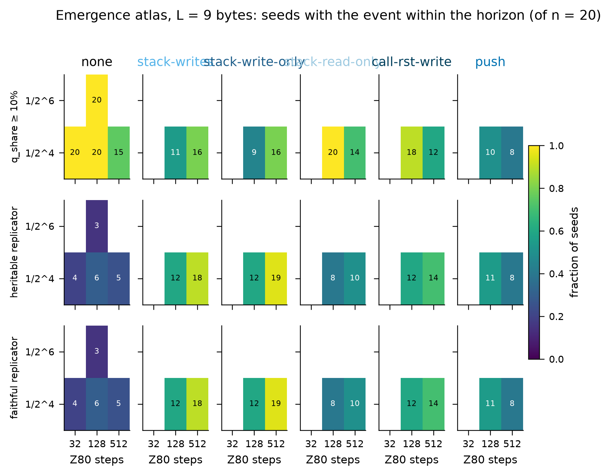
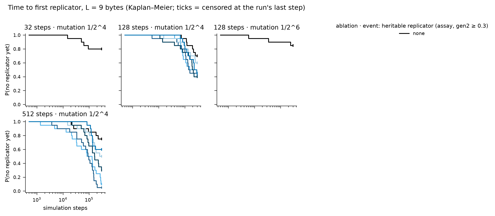

# Instruction-set ablation atlas — results

Batches: runs/stageD. Pre-registration and change log: `experiments/PLAN.md`; review: `experiments/REVIEW.md`. Emergence events: `tq_10` = quasispecies occupancy ≥ 10% (pre-registered primary; fires on zero-byte floods as well as replicators); `t_rep` = first top-3 exemplar with share ≥ 0.5% that is heritable (assay gen2 ≥ 0.3); `t_faith` = additionally ≥ 50% of partners became ≥ 75% copies. Times are Kaplan–Meier medians censored at each run's last step; sampling is every 500 steps, so 500 is the resolution floor.

## Pre-registered hypotheses

## Emergence grids

### L = 9

| ablation | 32 steps · 1/2^4 | 32 steps · 1/2^6 | 128 steps · 1/2^4 | 128 steps · 1/2^6 | 512 steps · 1/2^4 | 512 steps · 1/2^6 |
|---|---|---|---|---|---|---|
| call-rst-write | – | – | 18/20 · **12/20** (192,000) · 12/20 | – | 12/20 · **14/20** (160,500) · 14/20 | – |
| none | 20/20 · **4/20** (NR) · 4/20 | – | 20/20 · **6/20** (NR) · 6/20 | 20/20 · **3/20** (NR) · 3/20 | 15/20 · **5/20** (NR) · 5/20 | – |
| push | – | – | 10/20 · **11/20** (226,500) · 11/20 | – | 8/20 · **8/20** (NR) · 8/20 | – |
| stack-read-only | – | – | 20/20 · **8/20** (NR) · 8/20 | – | 14/20 · **10/20** (252,000) · 10/20 | – |
| stack-write-only | – | – | 9/20 · **12/20** (138,500) · 12/20 | – | 16/20 · **19/20** (90,000) · 19/20 | – |
| stack-writes | – | – | 11/20 · **12/20** (152,000) · 12/20 | – | 16/20 · **18/20** (82,500) · 18/20 | – |

Each cell: seeds reaching q_share ≥ 10% (pre-registered) · **seeds with a heritable replicator** (KM median step, NR = not reached within the horizon) · seeds with a faithful replicator.

## Succession (census takeover times, family at 300k steps and at the last step)

| label            |   tape |   steps |   k |   n |   stopped_early |   last_step_min | final_at_last    | family_300k      |   stack_takeover_n |   stack_takeover_med |   ldir_takeover_n |   ldir_takeover_med |   ldir_invasions_complete |   ldir_invasions_censored |   ldir_invasion_med_steps |
|:-----------------|-------:|--------:|----:|----:|----------------:|----------------:|:-----------------|:-----------------|-------------------:|---------------------:|------------------:|--------------------:|--------------------------:|--------------------------:|--------------------------:|
| call-rst-write   |      9 |     128 |   4 |  20 |               0 |          300000 | ldir:12, none:8  | ldir:12, none:8  |                  0 |                  nan |                12 |              106000 |                        12 |                         0 |                      8000 |
| call-rst-write   |      9 |     512 |   4 |  20 |               0 |          300000 | ldir:14, none:6  | ldir:14, none:6  |                  0 |                  nan |                14 |               95250 |                        14 |                         0 |                     10750 |
| none             |      9 |      32 |   4 |  20 |               0 |          300000 | none:16, ldir:4  | none:16, ldir:4  |                  0 |                  nan |                 4 |               55750 |                         4 |                         0 |                     42000 |
| none             |      9 |     128 |   4 |  20 |               0 |          300000 | none:14, ldir:6  | none:14, ldir:6  |                  0 |                  nan |                 6 |              159000 |                         5 |                         1 |                     30500 |
| none             |      9 |     128 |   6 |  20 |               0 |          300000 | none:17, ldir:3  | none:17, ldir:3  |                  0 |                  nan |                 3 |               35500 |                         1 |                         2 |                     29500 |
| none             |      9 |     512 |   4 |  20 |               0 |          300000 | none:15, ldir:5  | none:15, ldir:5  |                  0 |                  nan |                 5 |               96000 |                         5 |                         0 |                     25500 |
| push             |      9 |     128 |   4 |  20 |               0 |          300000 | ldir:12, none:8  | ldir:12, none:8  |                  0 |                  nan |                12 |              144500 |                        11 |                         1 |                     31500 |
| push             |      9 |     512 |   4 |  20 |               0 |          300000 | none:11, ldir:9  | none:11, ldir:9  |                  0 |                  nan |                 9 |              135500 |                         8 |                         1 |                     21250 |
| stack-read-only  |      9 |     128 |   4 |  20 |               0 |          300000 | none:12, ldir:8  | none:12, ldir:8  |                  0 |                  nan |                 8 |              103000 |                         8 |                         0 |                     19250 |
| stack-read-only  |      9 |     512 |   4 |  20 |               0 |          300000 | ldir:10, none:10 | ldir:10, none:10 |                  0 |                  nan |                10 |               63250 |                        10 |                         0 |                     17500 |
| stack-write-only |      9 |     128 |   4 |  20 |               0 |          300000 | ldir:11, none:9  | ldir:11, none:9  |                  0 |                  nan |                11 |              106500 |                        10 |                         1 |                     41500 |
| stack-write-only |      9 |     512 |   4 |  20 |               0 |          300000 | ldir:19, none:1  | ldir:19, none:1  |                  0 |                  nan |                19 |               91500 |                        19 |                         0 |                     24000 |
| stack-writes     |      9 |     128 |   4 |  20 |               0 |          300000 | ldir:13, none:7  | ldir:13, none:7  |                  0 |                  nan |                13 |               85500 |                        13 |                         0 |                     11500 |
| stack-writes     |      9 |     512 |   4 |  20 |               0 |          300000 | ldir:18, none:2  | ldir:18, none:2  |                  0 |                  nan |                18 |               82750 |                        16 |                         2 |                     15250 |

## Replicator zoo — runs/stageD

## call-rst-write · L=9 · 128 steps · mutation 1/2^4
**first** (12 seeds)
- 8× `b0 1d ed b0 1d ed b0 1d ed` — [DEC E ; LDIR] ×3
- 1× `ab 5e ab 07 fa ed b0 e3 00` — LD r,(HL) ; JP M,nn ; EX (SP),rr
- 1× `16 06 ed b0 f8 05 16 06 ed` — LD r,n ; LDIR ; RET M ; LD r,n
- 1× `63 ae d2 a4 56 5f ed b0 f3` — JP NC,nn ; LDIR
- 1× `87 5e 3b 08 d2 ed b0 21 c2` — LD r,(HL) ; EX rr,rr' ; JP NC,nn ; LD rr,nn

**final** (12 seeds)
- 4× `3f cc 3d 5e c3 ed b0 de 6e` — LD r,(HL) ; JP nn
- 2× `cf f4 42 5e d2 ed b0 27 9a` — LD r,(HL) ; JP NC,nn
- 2× `99 9d 51 5e ca ed b0 09 f6` — LD r,(HL) ; JP Z,nn
- 1× `e7 be 7c 11 d4 1e c3 ed b0` — LD rr,nn ; JP nn
- 1× `99 9c c0 5e d2 ed b0 54 91` — RET NZ ; LD r,(HL) ; JP NC,nn
- 1× `cf c1 f3 5e d2 ed b0 2b 9e` — POP rr ; LD r,(HL) ; JP NC,nn

## call-rst-write · L=9 · 512 steps · mutation 1/2^4
**first** (14 seeds)
- 10× `b0 1d ed b0 1d ed b0 1d ed` — [DEC E ; LDIR] ×3
- 1× `51 c3 aa 43 a0 f0 5e ed b0` — JP nn ; RET P ; LD r,(HL) ; LDIR
- 1× `99 5e d2 fe 95 a3 40 ed b0` — LD r,(HL) ; JP NC,nn ; LDIR
- 1× `3f 89 5e c3 0b ed b0 80 00` — LD r,(HL) ; JP nn
- 1× `41 11 8f 07 c3 ed b0 b7 82` — LD rr,nn ; JP nn

**final** (14 seeds)
- 2× `1d ed b0 1d ed b0 1d ed b0` — [DEC E ; LDIR] ×3
- 1× `cf 09 5a 5e c3 ed b0 e0 d4` — LD r,(HL) ; JP nn ; RET PO
- 1× `51 fc d4 5e c2 ed b0 f7 b3` — LD r,(HL) ; JP NZ,nn
- 1× `3f 61 4d 5e c3 ed b0 8f 90` — LD r,(HL) ; JP nn
- 1× `06 f0 1d 56 c3 ed b0 65 c7` — LD r,n ; LD r,(HL) ; JP nn
- 1× `51 c3 a7 5e ed b0 7d d4 40` — JP nn ; LDIR

## none · L=9 · 32 steps · mutation 1/2^4
**first** (4 seeds)
- 4× `1d ed b0 1d ed b0 1d ed b0` — [DEC E ; LDIR] ×3

**final** (4 seeds)
- 2× `1d ed b0 1d ed b0 1d ed b0` — [DEC E ; LDIR] ×3
- 1× `51 7f 13 5e c3 ed b0 f7 88` — LD r,(HL) ; JP nn ; RST 30
- 1× `99 8b a1 5e ca ed b0 50 61` — LD r,(HL) ; JP Z,nn

## none · L=9 · 128 steps · mutation 1/2^4
**first** (6 seeds)
- 5× `1d ed b0 1d ed b0 1d ed b0` — [DEC E ; LDIR] ×3
- 1× `fe 8d 1e e1 c2 29 29 ed b0` — LD r,n ; JP NZ,nn ; LDIR

**final** (6 seeds)
- 2× `1d ed b0 1d ed b0 1d ed b0` — [DEC E ; LDIR] ×3
- 1× `f3 60 0d 5e e2 ed b0 e6 38` — LD r,(HL) ; JP PO,nn
- 1× `51 59 85 5e c3 ed b0 77 30` — LD r,(HL) ; JP nn ; LD (HL),r ; JR NC,d
- 1× `00 3b 1e 2d c3 ed b0 92 03` — LD r,n ; JP nn
- 1× `de 8a 1d 56 c3 ed b0 71 ef` — LD r,(HL) ; JP nn ; LD (HL),r ; RST 28

## none · L=9 · 128 steps · mutation 1/2^6
**first** (3 seeds)
- 3× `b0 1d ed b0 1d ed b0 1d ed` — [DEC E ; LDIR] ×3

**final** (3 seeds)
- 3× `1d ed b0 1d ed b0 1d ed b0` — [DEC E ; LDIR] ×3

## none · L=9 · 512 steps · mutation 1/2^4
**first** (5 seeds)
- 4× `1d ed b0 1d ed b0 1d ed b0` — [DEC E ; LDIR] ×3
- 1× `c3 11 83 49 40 ed b0 d8 8c` — JP nn ; LDIR ; RET C

**final** (5 seeds)
- 1× `06 d2 1d 56 d2 ed b0 ae d9` — LD r,n ; LD r,(HL) ; JP NC,nn ; EXX
- 1× `bd 4b 61 5e ca ed b0 c3 5a` — LD r,(HL) ; JP Z,nn ; JP nn
- 1× `1e 2d 1e ab c3 ed b0 3f a6` — LD r,n×2 ; JP nn
- 1× `3f 5e c3 76 ed b0 db 25 82` — LD r,(HL) ; JP nn
- 1× `9a d1 28 ed b0 ea 94 59 26` — POP rr ; JR Z,d ; JP PE,nn ; LD r,n

## push · L=9 · 128 steps · mutation 1/2^4
**first** (11 seeds)
- 9× `1d ed b0 1d ed b0 1d ed b0` — [DEC E ; LDIR] ×3
- 1× `1e 87 d3 eb d2 d3 df ed b0` — LD r,n ; JP NC,nn ; LDIR
- 1× `3f 5e 95 d2 1e b7 ed b0 78` — LD r,(HL) ; JP NC,nn ; LDIR

**final** (12 seeds)
- 1× `fd 8b 1e 3f 55 eb 10 ed b0` — LD r,n ; EX rr,rr ; DJNZ d
- 1× `bd 08 84 5e c3 ed b0 5b 76` — EX rr,rr' ; LD r,(HL) ; JP nn
- 1× `00 14 ab 11 6a 1e c3 ed b0` — LD rr,nn ; JP nn
- 1× `5a 48 1e bd f2 ed b0 7a 3d` — LD r,n ; JP P,nn
- 1× `87 c3 71 5e ed b0 42 8b 54` — JP nn ; LDIR
- 1× `1d ed b0 1d ed b0 1d ed b0` — [DEC E ; LDIR] ×3

## push · L=9 · 512 steps · mutation 1/2^4
**first** (8 seeds)
- 8× `1d ed b0 1d ed b0 1d ed b0` — [DEC E ; LDIR] ×3

**final** (9 seeds)
- 4× `1d ed b0 1d ed b0 1d ed b0` — [DEC E ; LDIR] ×3
- 2× `ab a2 5e 6a c3 ed b0 58 a2` — LD r,(HL) ; JP nn
- 1× `06 c1 56 1d e2 ed b0 e6 b8` — LD r,n ; LD r,(HL) ; JP PO,nn
- 1× `a8 b3 1e 99 f2 ed b0 65 7c` — LD r,n ; JP P,nn
- 1× `1e 3f c2 2e ed b0 1d 14 0e` — LD r,n ; JP NZ,nn ; LD r,n

## stack-read-only · L=9 · 128 steps · mutation 1/2^4
**first** (8 seeds)
- 8× `1d ed b0 1d ed b0 1d ed b0` — [DEC E ; LDIR] ×3

**final** (8 seeds)
- 2× `87 b3 fb 5e c3 ed b0 9e d0` — LD r,(HL) ; JP nn
- 1× `bd 1e 5f 5e d2 ed b0 b4 23` — LD r,n ; LD r,(HL) ; JP NC,nn
- 1× `1d ed b0 1d ed b0 1d ed b0` — [DEC E ; LDIR] ×3
- 1× `57 3f 56 1d e2 ed b0 c1 a5` — LD r,(HL) ; JP PO,nn
- 1× `7d 8b 1e 75 c3 ed b0 a2 b7` — LD r,n ; JP nn
- 1× `00 95 74 11 ce 1e c3 ed b0` — LD (HL),r ; LD rr,nn ; JP nn

## stack-read-only · L=9 · 512 steps · mutation 1/2^4
**first** (10 seeds)
- 8× `1d ed b0 1d ed b0 1d ed b0` — [DEC E ; LDIR] ×3
- 1× `06 fb d2 ce 11 5d 57 ed b0` — LD r,n ; JP NC,nn ; LDIR
- 1× `11 6d 1d 3e ed b0 c3 ca 00` — LD rr,nn ; LD r,n ; JP nn

**final** (10 seeds)
- 1× `99 c3 cb 5e ed b0 ae 02 ae` — JP nn ; LDIR ; LD (BC),r
- 1× `3c b8 1d 56 c3 ed b0 a4 58` — LD r,(HL) ; JP nn
- 1× `ab 83 07 5e ca ed b0 78 16` — LD r,(HL) ; JP Z,nn ; LD r,n
- 1× `99 49 5c 5e f2 ed b0 21 b0` — LD r,(HL) ; JP P,nn ; LD rr,nn
- 1× `54 1e 09 bd e2 ed b0 1d 94` — LD r,n ; JP PO,nn
- 1× `00 0a 1e 87 f2 ed b0 b6 d3` — LD r,(BC) ; LD r,n ; JP P,nn

## stack-write-only · L=9 · 128 steps · mutation 1/2^4
**first** (12 seeds)
- 11× `1d ed b0 1d ed b0 1d ed b0` — [DEC E ; LDIR] ×3
- 1× `3f 93 5e 56 e2 ed b0 6a 05` — LD r,(HL)×2 ; JP PO,nn

**final** (12 seeds)
- 4× `1d ed b0 1d ed b0 1d ed b0` — [DEC E ; LDIR] ×3
- 1× `e3 78 1e 75 f2 ed b0 ec 66` — LD r,n ; JP P,nn ; LD r,(HL)
- 1× `ee 8f bb 11 21 1e c3 ed b0` — LD rr,nn ; JP nn
- 1× `ab a4 79 5e f2 ed b0 1d 64` — LD r,(HL) ; JP P,nn
- 1× `be 16 d0 f9 16 1e c3 ed b0` — LD r,n ; LD SP,HL ; LD r,n ; JP nn
- 1× `ab 8d 50 5e ca ed b0 20 83` — LD r,(HL) ; JP Z,nn ; JR NZ,d

## stack-write-only · L=9 · 512 steps · mutation 1/2^4
**first** (19 seeds)
- 16× `1d ed b0 1d ed b0 1d ed b0` — [DEC E ; LDIR] ×3
- 1× `00 11 2a b0 ed b0 ed 11 11` — LD rr,nn ; LDIR ; LD rr,nn
- 1× `09 cc d2 05 5e 07 ed b0 e9` — JP NC,nn ; LDIR ; JP (HL)
- 1× `8f 11 8f 07 ca ed b0 7a a7` — LD rr,nn ; JP Z,nn

**final** (19 seeds)
- 3× `87 fc 54 5e ca ed b0 3b 00` — LD r,(HL) ; JP Z,nn
- 2× `1d ed b0 1d ed b0 1d ed b0` — [DEC E ; LDIR] ×3
- 2× `45 48 1d 56 c3 ed b0 ed fd` — LD r,(HL) ; JP nn
- 1× `00 72 b9 11 ba 1e c3 ed b0` — LD (HL),r ; LD rr,nn ; JP nn
- 1× `a7 db 46 11 17 1e c3 ed b0` — LD rr,nn ; JP nn
- 1× `f1 3b 57 86 16 1e c3 ed b0` — POP rr ; LD r,n ; JP nn

## stack-writes · L=9 · 128 steps · mutation 1/2^4
**first** (12 seeds)
- 9× `1d ed b0 1d ed b0 1d ed b0` — [DEC E ; LDIR] ×3
- 1× `56 1b 00 11 1d 4c 20 ed b0` — LD r,(HL) ; LD rr,nn ; JR NZ,d
- 1× `99 5e 81 d4 e2 ed b0 70 90` — LD r,(HL) ; JP PO,nn ; LD (HL),r
- 1× `99 6b 66 c3 5c 3b ed b0 4e` — LD r,(HL) ; JP nn ; LDIR ; LD r,(HL)

**final** (13 seeds)
- 2× `99 c7 d7 5e ca ed b0 24 ad` — LD r,(HL) ; JP Z,nn
- 2× `1d ed b0 1d ed b0 1d ed b0` — [DEC E ; LDIR] ×3
- 1× `09 5e fc f8 b3 ed b0 4e e6` — LD r,(HL) ; LDIR ; LD r,(HL)
- 1× `95 93 1e 51 c3 ed b0 2a 91` — LD r,n ; JP nn ; LD rr,(nn)
- 1× `5c 37 36 5c 16 1e c3 ed b0` — LD (HL),n ; LD r,n ; JP nn
- 1× `51 51 00 5e c3 ed b0 2c aa` — LD r,(HL) ; JP nn

## stack-writes · L=9 · 512 steps · mutation 1/2^4
**first** (18 seeds)
- 16× `1d ed b0 1d ed b0 1d ed b0` — [DEC E ; LDIR] ×3
- 1× `bd 4e b1 5e 20 f0 e7 ed b0` — LD r,(HL)×2 ; JR NZ,d ; LDIR
- 1× `11 b7 18 d2 41 1a 6d ed b0` — LD rr,nn ; JP NC,nn ; LDIR

**final** (18 seeds)
- 5× `bd 42 9d 5e ca ed b0 ed d5` — LD r,(HL) ; JP Z,nn
- 3× `1d ed b0 1d ed b0 1d ed b0` — [DEC E ; LDIR] ×3
- 2× `bd 17 8d 5e ca ed b0 5e f6` — LD r,(HL) ; JP Z,nn ; LD r,(HL)
- 2× `7b 7c c5 7a 16 1e c3 ed b0` — LD r,n ; JP nn
- 2× `ab d7 37 5e f2 ed b0 b9 a1` — LD r,(HL) ; JP P,nn
- 1× `d6 dd 1e cf e2 ed b0 3e cd` — LD r,n ; JP PO,nn ; LD r,n
