# Instruction-set ablation atlas — results

Batches: runs/stageE. Pre-registration and change log: `experiments/PLAN.md`; review: `experiments/REVIEW.md`. Emergence events: `tq_10` = quasispecies occupancy ≥ 10% (pre-registered primary; fires on zero-byte floods as well as replicators); `t_rep` = first top-3 exemplar with share ≥ 0.5% that is heritable (assay gen2 ≥ 0.3); `t_faith` = additionally ≥ 50% of partners became ≥ 75% copies. Times are Kaplan–Meier medians censored at each run's last step; sampling is every 500 steps, so 500 is the resolution floor.

## Pre-registered hypotheses

## Emergence grids

### L = 3

| ablation | 128 steps · 1/2^4 |
|---|---|
| none@nominal | 10/10 · **0/10** (NR) · 0/10 |
| stack-write-only@nominal | 0/10 · **0/10** (NR) · 0/10 |

Each cell: seeds reaching q_share ≥ 10% (pre-registered) · **seeds with a heritable replicator** (KM median step, NR = not reached within the horizon) · seeds with a faithful replicator.

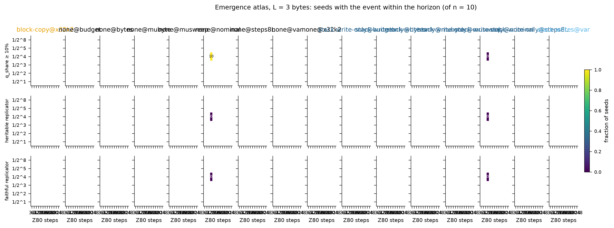

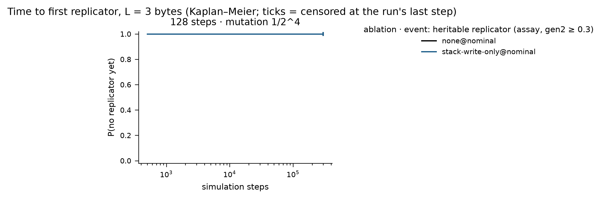

### L = 4

| ablation | 32 steps · 1/2^4 | 128 steps · 1/2^4 |
|---|---|---|
| none@bytes | – | 1/10 · **1/10** (NR) · 1/10 |
| none@mubyte | – | 0/10 · **0/10** (NR) · 0/10 |
| none@nominal | – | 0/10 · **0/10** (NR) · 0/10 |
| none@steps8L | 1/10 · **1/10** (NR) · 1/10 | – |
| stack-write-only@bytes | – | 0/10 · **3/10** (NR) · 3/10 |
| stack-write-only@mubyte | – | 1/10 · **1/10** (NR) · 1/10 |
| stack-write-only@nominal | – | 0/10 · **0/10** (NR) · 0/10 |
| stack-write-only@steps8L | 0/10 · **1/10** (NR) · 1/10 | – |

Each cell: seeds reaching q_share ≥ 10% (pre-registered) · **seeds with a heritable replicator** (KM median step, NR = not reached within the horizon) · seeds with a faithful replicator.

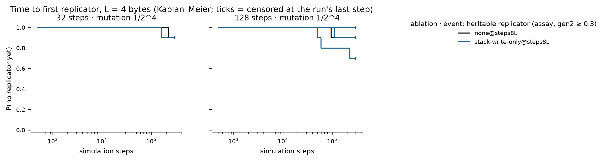

### L = 5

| ablation | 128 steps · 1/2^4 |
|---|---|
| none@nominal | 10/10 · **9/10** (49,000) · 9/10 |
| stack-write-only@nominal | 8/10 · **8/10** (161,000) · 8/10 |

Each cell: seeds reaching q_share ≥ 10% (pre-registered) · **seeds with a heritable replicator** (KM median step, NR = not reached within the horizon) · seeds with a faithful replicator.

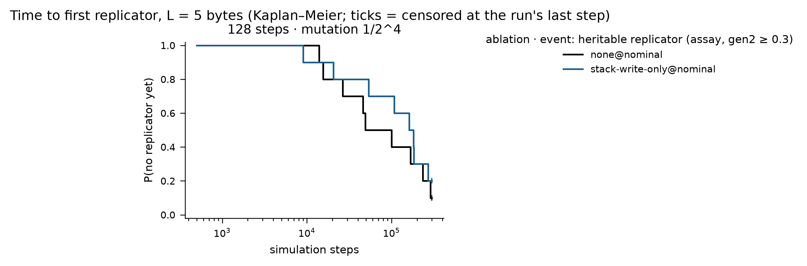

### L = 6

| ablation | 128 steps · 1/2^4 |
|---|---|
| none@nominal | 9/10 · **9/10** (151,500) · 4/10 |
| stack-write-only@nominal | 10/10 · **10/10** (107,500) · 5/10 |

Each cell: seeds reaching q_share ≥ 10% (pre-registered) · **seeds with a heritable replicator** (KM median step, NR = not reached within the horizon) · seeds with a faithful replicator.

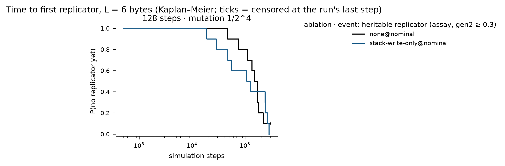

### L = 7

| ablation | 128 steps · 1/2^4 |
|---|---|
| none@nominal | 0/10 · **0/10** (NR) · 0/10 |
| stack-write-only@nominal | 5/10 · **5/10** (265,500) · 5/10 |

Each cell: seeds reaching q_share ≥ 10% (pre-registered) · **seeds with a heritable replicator** (KM median step, NR = not reached within the horizon) · seeds with a faithful replicator.

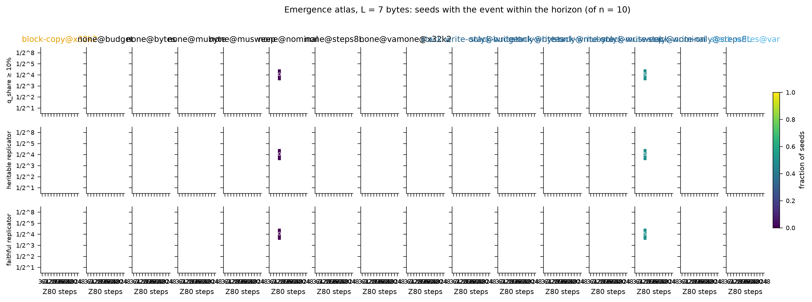

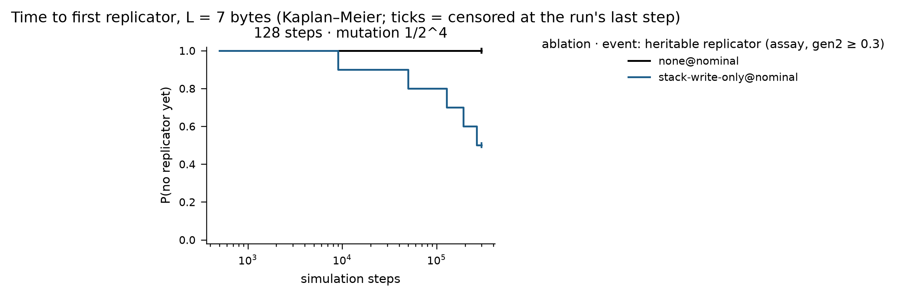

### L = 8

| ablation | 128 steps · 1/2^4 |
|---|---|
| none@nominal | 10/10 · **10/10** (500) · 10/10 |
| stack-write-only@nominal | 3/10 · **6/10** (105,000) · 6/10 |

Each cell: seeds reaching q_share ≥ 10% (pre-registered) · **seeds with a heritable replicator** (KM median step, NR = not reached within the horizon) · seeds with a faithful replicator.

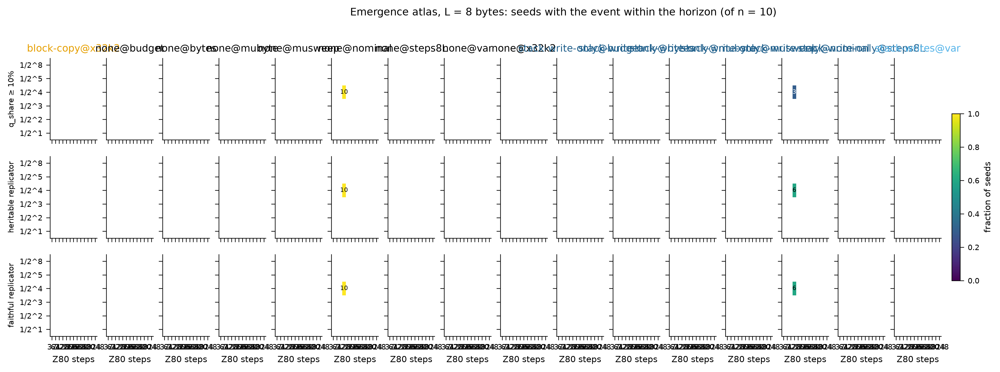

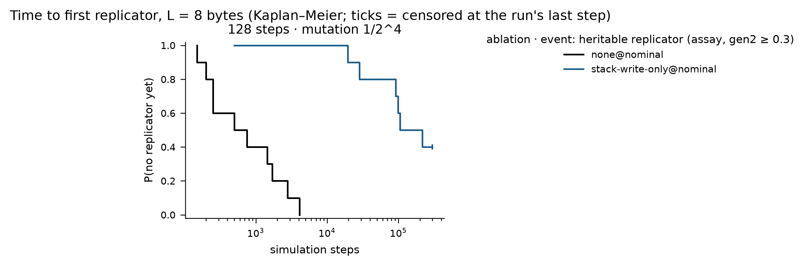

### L = 9

| ablation | 72 steps · 1/2^4 | 128 steps · 1/2^4 |
|---|---|---|
| none@bytes | – | 10/10 · **6/10** (172,500) · 6/10 |
| none@mubyte | – | 10/10 · **1/10** (NR) · 1/10 |
| none@nominal | – | 10/10 · **4/10** (NR) · 4/10 |
| none@steps8L | 10/10 · **2/10** (NR) · 2/10 | – |
| none@var | – | 10/10 · **3/10** (NR) · 3/10 |
| stack-write-only@bytes | – | 8/10 · **10/10** (52,500) · 10/10 |
| stack-write-only@mubyte | – | 7/10 · **7/10** (175,000) · 7/10 |
| stack-write-only@nominal | – | 7/10 · **9/10** (108,000) · 9/10 |
| stack-write-only@steps8L | 4/10 · **8/10** (63,500) · 8/10 | – |

Each cell: seeds reaching q_share ≥ 10% (pre-registered) · **seeds with a heritable replicator** (KM median step, NR = not reached within the horizon) · seeds with a faithful replicator.

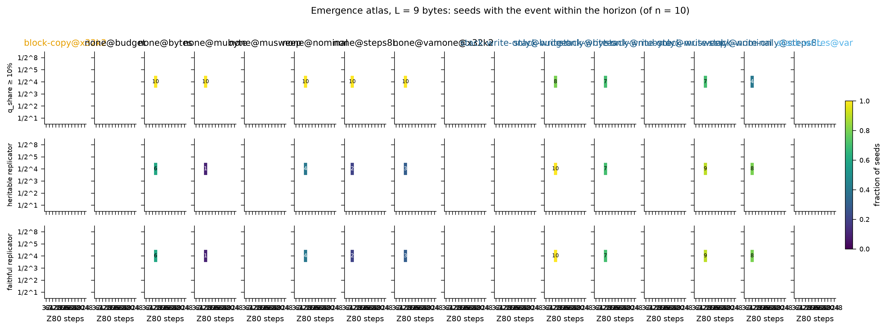

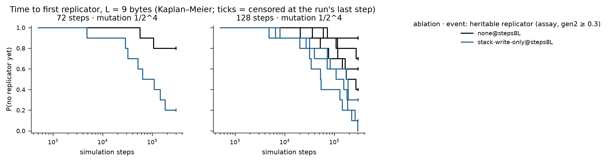

### L = 10

| ablation | 128 steps · 1/2^4 |
|---|---|
| none@nominal | 1/10 · **4/10** (NR) · 4/10 |
| stack-write-only@nominal | 5/10 · **8/10** (189,500) · 8/10 |

Each cell: seeds reaching q_share ≥ 10% (pre-registered) · **seeds with a heritable replicator** (KM median step, NR = not reached within the horizon) · seeds with a faithful replicator.

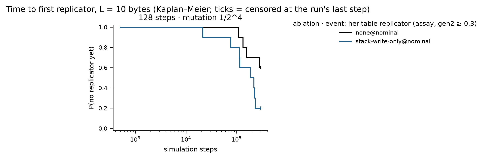

### L = 12

| ablation | 128 steps · 1/2^4 |
|---|---|
| none@nominal | 3/10 · **6/10** (245,500) · 6/10 |
| stack-write-only@nominal | 4/10 · **10/10** (42,000) · 9/10 |

Each cell: seeds reaching q_share ≥ 10% (pre-registered) · **seeds with a heritable replicator** (KM median step, NR = not reached within the horizon) · seeds with a faithful replicator.

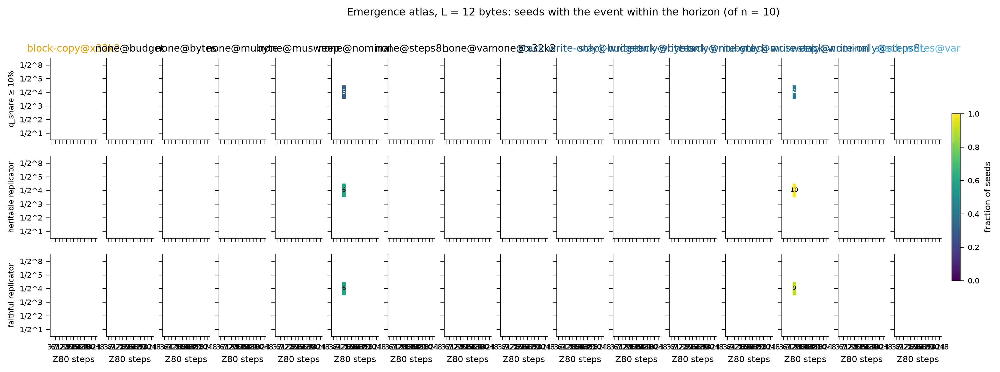

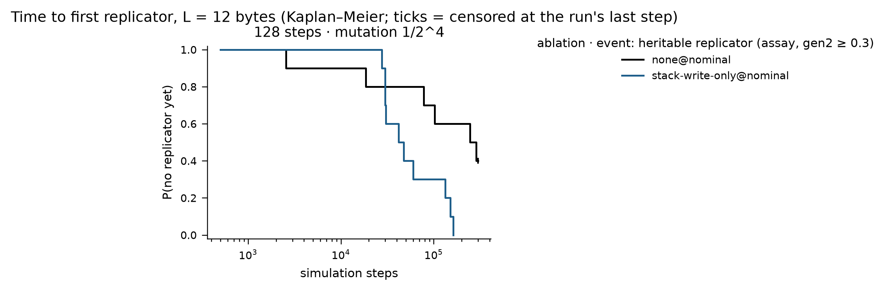

### L = 16

| ablation | 32 steps · 1/2^2 | 32 steps · 1/2^4 | 128 steps · 1/2^2 | 128 steps · 1/2^4 |
|---|---|---|---|---|
| block-copy@x32k2 | 0/20 · **0/20** (NR) · 0/20 | – | – | – |
| none@bytes | – | – | – | 10/10 · **10/10** (150) · 10/10 |
| none@mubyte | – | – | – | 10/10 · **10/10** (200) · 10/10 |
| none@nominal | – | – | – | 10/10 · **10/10** (200) · 10/10 |
| none@steps8L | – | – | – | 10/10 · **10/10** (150) · 10/10 |
| none@var | – | – | – | 6/10 · **10/10** (150) · 10/10 |
| none@x32k2 | 0/20 · **18/20** (71,000) · 18/20 | – | – | – |
| stack-write-only@bytes | – | – | – | 0/10 · **9/10** (58,000) · 9/10 |
| stack-write-only@mubyte | – | – | – | 1/10 · **8/10** (85,500) · 8/10 |
| stack-write-only@nominal | – | – | – | 2/10 · **10/10** (33,000) · 10/10 |
| stack-write-only@steps8L | – | – | – | 3/10 · **9/10** (27,000) · 9/10 |
| stack-writes@var | – | – | – | 2/10 · **8/10** (86,500) · 8/10 |

Each cell: seeds reaching q_share ≥ 10% (pre-registered) · **seeds with a heritable replicator** (KM median step, NR = not reached within the horizon) · seeds with a faithful replicator.

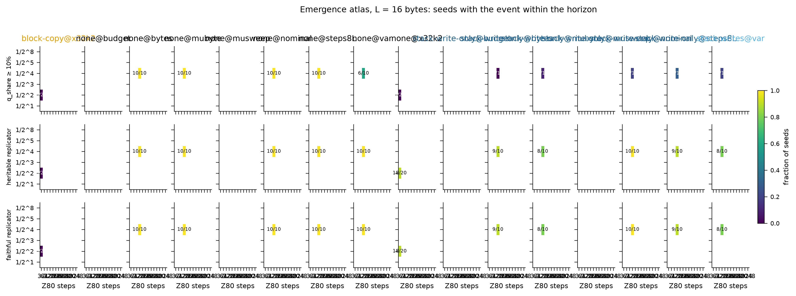

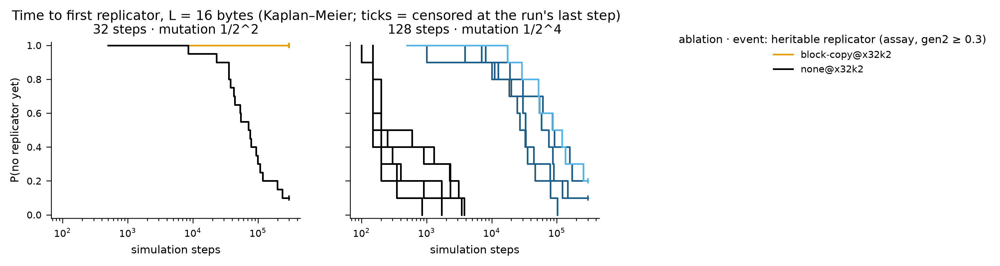

### L = 18

| ablation | 128 steps · 1/2^4 |
|---|---|
| none@nominal | 10/10 · **10/10** (2,100) · 10/10 |
| stack-write-only@nominal | 7/10 · **7/10** (41,000) · 7/10 |

Each cell: seeds reaching q_share ≥ 10% (pre-registered) · **seeds with a heritable replicator** (KM median step, NR = not reached within the horizon) · seeds with a faithful replicator.

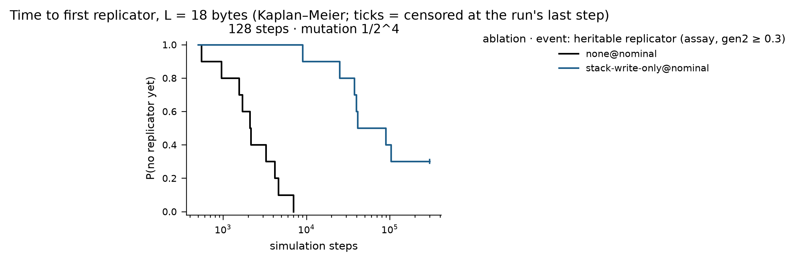

### L = 20

| ablation | 128 steps · 1/2^4 |
|---|---|
| none@nominal | 10/10 · **10/10** (950) · 10/10 |
| stack-write-only@nominal | 10/10 · **10/10** (31,000) · 10/10 |

Each cell: seeds reaching q_share ≥ 10% (pre-registered) · **seeds with a heritable replicator** (KM median step, NR = not reached within the horizon) · seeds with a faithful replicator.

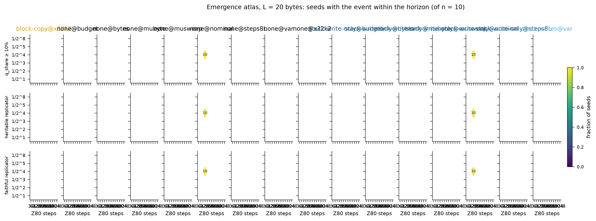

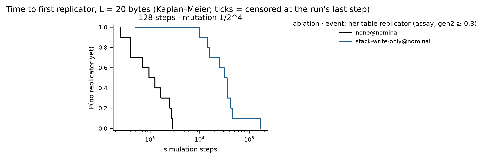

### L = 24

| ablation | 128 steps · 1/2^4 |
|---|---|
| none@nominal | 10/10 · **10/10** (250) · 10/10 |
| stack-write-only@nominal | 8/10 · **8/10** (16,000) · 8/10 |

Each cell: seeds reaching q_share ≥ 10% (pre-registered) · **seeds with a heritable replicator** (KM median step, NR = not reached within the horizon) · seeds with a faithful replicator.

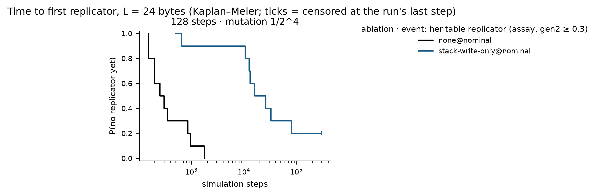

### L = 25

| ablation | 128 steps · 1/2^4 | 200 steps · 1/2^4 |
|---|---|---|
| none@bytes | 10/10 · **10/10** (900) · 10/10 | – |
| none@mubyte | 10/10 · **10/10** (1,000) · 10/10 | – |
| none@nominal | 10/10 · **10/10** (900) · 10/10 | – |
| none@steps8L | – | 10/10 · **10/10** (900) · 10/10 |
| stack-write-only@bytes | 8/10 · **10/10** (53,500) · 10/10 | – |
| stack-write-only@mubyte | 8/10 · **10/10** (17,000) · 10/10 | – |
| stack-write-only@nominal | 8/10 · **10/10** (56,500) · 10/10 | – |
| stack-write-only@steps8L | – | 9/10 · **10/10** (23,500) · 10/10 |

Each cell: seeds reaching q_share ≥ 10% (pre-registered) · **seeds with a heritable replicator** (KM median step, NR = not reached within the horizon) · seeds with a faithful replicator.

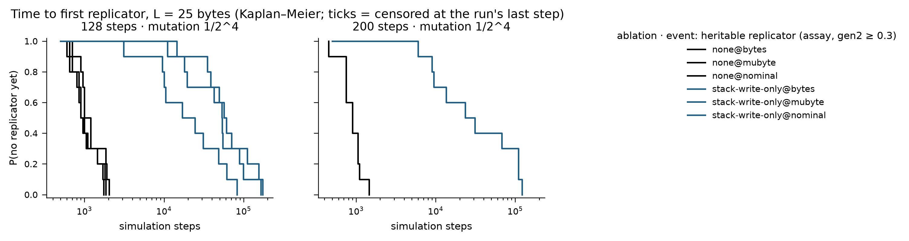

### L = 32

| ablation | 128 steps · 1/2^4 |
|---|---|
| none@nominal | 10/10 · **10/10** (350) · 10/10 |
| stack-write-only@nominal | 9/10 · **10/10** (51,500) · 10/10 |

Each cell: seeds reaching q_share ≥ 10% (pre-registered) · **seeds with a heritable replicator** (KM median step, NR = not reached within the horizon) · seeds with a faithful replicator.

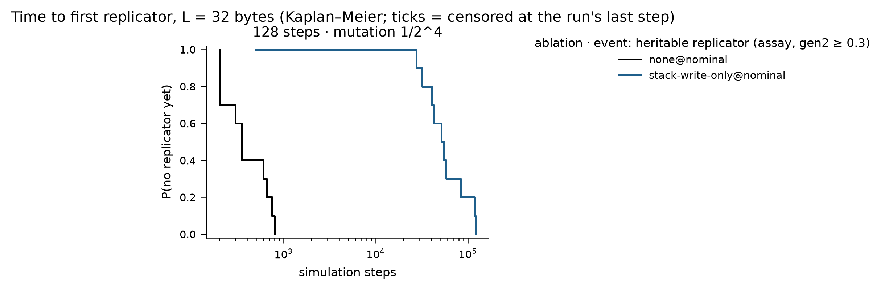

### L = 36

| ablation | 128 steps · 1/2^4 | 288 steps · 1/2^4 |
|---|---|---|
| none@bytes | 10/10 · **10/10** (800) · 10/10 | – |
| none@mubyte | 10/10 · **10/10** (650) · 10/10 | – |
| none@nominal | 10/10 · **10/10** (500) · 10/10 | – |
| none@steps8L | – | 10/10 · **10/10** (200) · 10/10 |
| stack-write-only@bytes | 10/10 · **10/10** (15,500) · 10/10 | – |
| stack-write-only@mubyte | 8/10 · **10/10** (14,500) · 10/10 | – |
| stack-write-only@nominal | 10/10 · **10/10** (8,500) · 10/10 | – |
| stack-write-only@steps8L | – | 6/10 · **10/10** (26,000) · 10/10 |

Each cell: seeds reaching q_share ≥ 10% (pre-registered) · **seeds with a heritable replicator** (KM median step, NR = not reached within the horizon) · seeds with a faithful replicator.

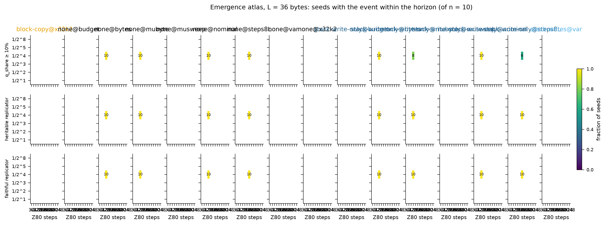

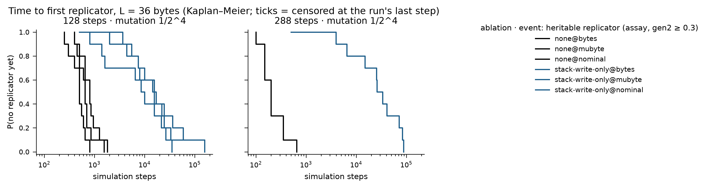

### L = 49

| ablation | 128 steps · 1/2^4 | 392 steps · 1/2^4 |
|---|---|---|
| none@bytes | 10/10 · **10/10** (1,200) · 10/10 | – |
| none@mubyte | 10/10 · **10/10** (1,700) · 10/10 | – |
| none@nominal | 10/10 · **10/10** (1,100) · 10/10 | – |
| none@steps8L | – | 10/10 · **10/10** (150) · 10/10 |
| stack-write-only@bytes | 6/10 · **7/10** (39,500) · 7/10 | – |
| stack-write-only@mubyte | 1/10 · **10/10** (10,500) · 10/10 | – |
| stack-write-only@nominal | 1/10 · **7/10** (46,500) · 7/10 | – |
| stack-write-only@steps8L | – | 4/10 · **10/10** (22,000) · 10/10 |

Each cell: seeds reaching q_share ≥ 10% (pre-registered) · **seeds with a heritable replicator** (KM median step, NR = not reached within the horizon) · seeds with a faithful replicator.

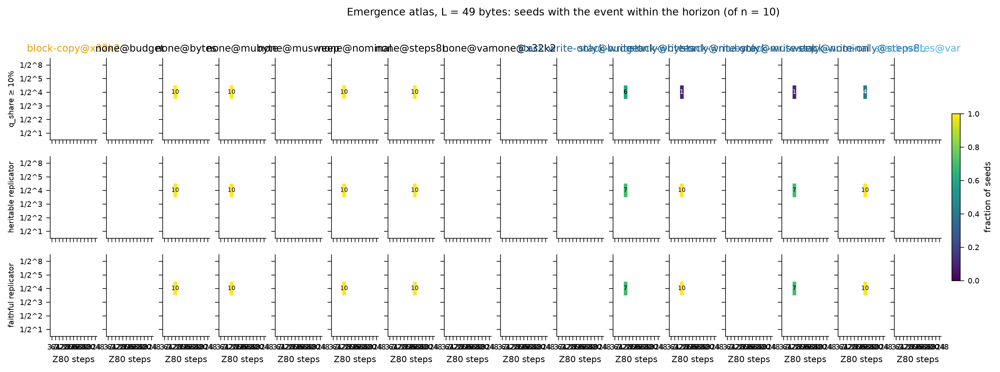

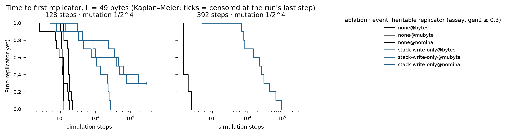

### L = 50

| ablation | 128 steps · 1/2^4 |
|---|---|
| none@nominal | 10/10 · **10/10** (500) · 10/10 |
| stack-write-only@nominal | 9/10 · **10/10** (18,500) · 10/10 |

Each cell: seeds reaching q_share ≥ 10% (pre-registered) · **seeds with a heritable replicator** (KM median step, NR = not reached within the horizon) · seeds with a faithful replicator.

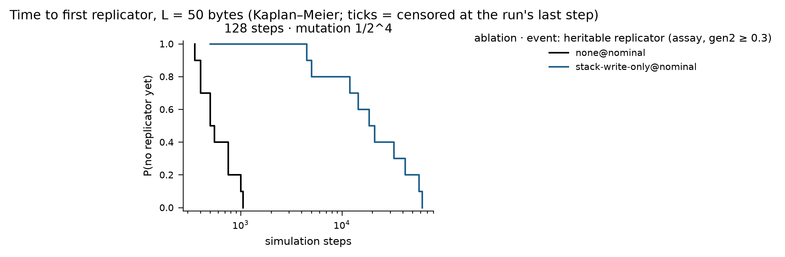

### L = 64

| ablation | 128 steps · 1/2^4 | 512 steps · 1/2^4 |
|---|---|---|
| none@bytes | 10/10 · **10/10** (1,500) · 10/10 | – |
| none@mubyte | 10/10 · **10/10** (1,400) · 10/10 | – |
| none@nominal | 10/10 · **10/10** (750) · 10/10 | – |
| none@steps8L | – | 10/10 · **10/10** (100) · 10/10 |
| stack-write-only@bytes | 8/10 · **10/10** (49,500) · 10/10 | – |
| stack-write-only@mubyte | 9/10 · **10/10** (20,000) · 10/10 | – |
| stack-write-only@nominal | 7/10 · **10/10** (22,500) · 10/10 | – |
| stack-write-only@steps8L | – | 7/10 · **8/10** (17,500) · 8/10 |

Each cell: seeds reaching q_share ≥ 10% (pre-registered) · **seeds with a heritable replicator** (KM median step, NR = not reached within the horizon) · seeds with a faithful replicator.

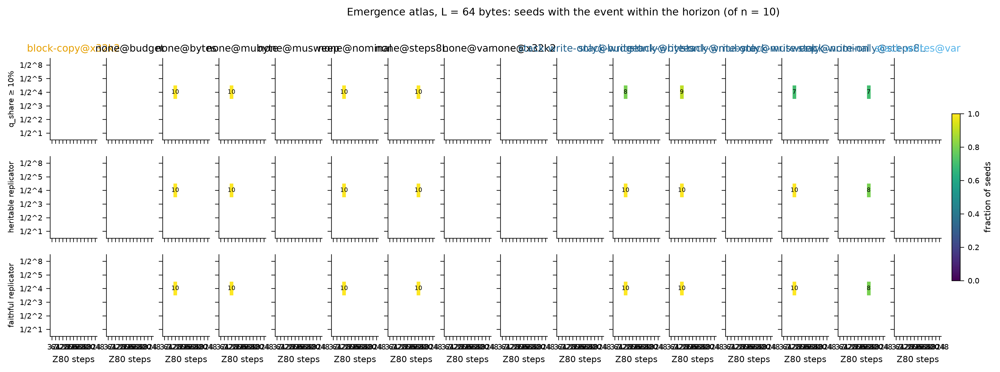

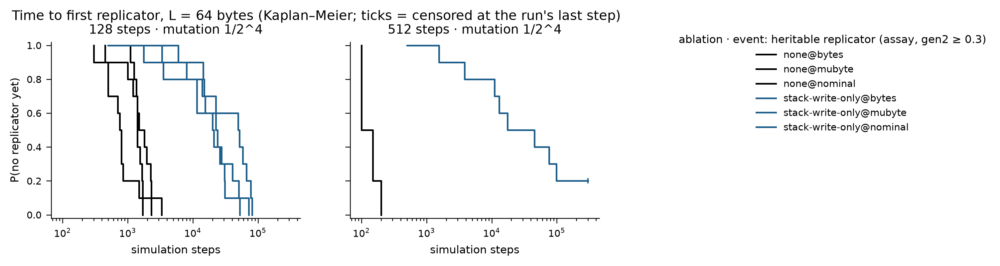

### L = 81

| ablation | 128 steps · 1/2^4 | 648 steps · 1/2^4 |
|---|---|---|
| none@bytes | 10/10 · **10/10** (700) · 10/10 | – |
| none@mubyte | 8/10 · **7/10** (2,950) · 7/10 | – |
| none@nominal | 10/10 · **10/10** (950) · 10/10 | – |
| none@steps8L | – | 10/10 · **10/10** (150) · 10/10 |
| stack-write-only@bytes | 8/10 · **10/10** (7,500) · 10/10 | – |
| stack-write-only@mubyte | 0/10 · **2/10** (NR) · 1/10 | – |
| stack-write-only@nominal | 1/10 · **8/10** (13,000) · 3/10 | – |
| stack-write-only@steps8L | – | 6/10 · **10/10** (28,000) · 10/10 |

Each cell: seeds reaching q_share ≥ 10% (pre-registered) · **seeds with a heritable replicator** (KM median step, NR = not reached within the horizon) · seeds with a faithful replicator.

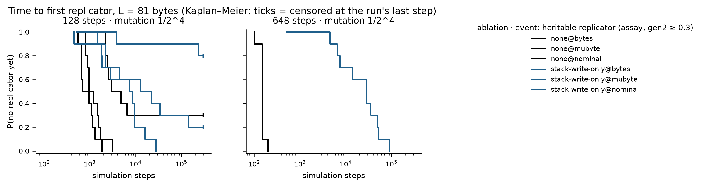

### L = 100

| ablation | 32 steps · 1/2^1 | 32 steps · 1/2^2 | 32 steps · 1/2^3 | 32 steps · 1/2^4 | 32 steps · 1/2^5 | 32 steps · 1/2^8 | 64 steps · 1/2^1 | 64 steps · 1/2^2 | 64 steps · 1/2^3 | 64 steps · 1/2^4 | 64 steps · 1/2^5 | 64 steps · 1/2^8 | 128 steps · 1/2^1 | 128 steps · 1/2^2 | 128 steps · 1/2^3 | 128 steps · 1/2^4 | 128 steps · 1/2^5 | 128 steps · 1/2^8 | 256 steps · 1/2^1 | 256 steps · 1/2^2 | 256 steps · 1/2^3 | 256 steps · 1/2^4 | 256 steps · 1/2^5 | 256 steps · 1/2^8 | 800 steps · 1/2^1 | 800 steps · 1/2^2 | 800 steps · 1/2^3 | 800 steps · 1/2^4 | 800 steps · 1/2^5 | 800 steps · 1/2^8 | 1024 steps · 1/2^1 | 1024 steps · 1/2^2 | 1024 steps · 1/2^3 | 1024 steps · 1/2^4 | 1024 steps · 1/2^5 | 1024 steps · 1/2^8 | 2048 steps · 1/2^1 | 2048 steps · 1/2^2 | 2048 steps · 1/2^3 | 2048 steps · 1/2^4 | 2048 steps · 1/2^5 | 2048 steps · 1/2^8 |
|---|---|---|---|---|---|---|---|---|---|---|---|---|---|---|---|---|---|---|---|---|---|---|---|---|---|---|---|---|---|---|---|---|---|---|---|---|---|---|---|---|---|---|
| none@budget | – | – | – | 0/10 · **0/10** (NR) · 0/10 | – | – | – | – | – | 10/10 · **0/10** (NR) · 0/10 | – | – | – | – | – | – | – | – | – | – | – | 10/10 · **10/10** (450) · 10/10 | – | – | – | – | – | – | – | – | – | – | – | 10/10 · **10/10** (150) · 10/10 | – | – | – | – | – | 10/10 · **10/10** (100) · 10/10 | – | – |
| none@bytes | – | – | – | – | – | – | – | – | – | – | – | – | – | – | – | 10/10 · **10/10** (2,150) · 10/10 | – | – | – | – | – | – | – | – | – | – | – | – | – | – | – | – | – | – | – | – | – | – | – | – | – | – |
| none@mubyte | – | – | – | – | – | – | – | – | – | – | – | – | – | – | – | 10/10 · **10/10** (3,950) · 5/10 | – | – | – | – | – | – | – | – | – | – | – | – | – | – | – | – | – | – | – | – | – | – | – | – | – | – |
| none@musweep | – | – | – | – | – | – | – | – | – | – | – | – | 10/10 · **9/10** (12,000) · 2/10 | 10/10 · **10/10** (2,450) · 8/10 | 10/10 · **10/10** (2,100) · 8/10 | – | 9/10 · **10/10** (1,050) · 10/10 | 10/10 · **10/10** (950) · 9/10 | – | – | – | – | – | – | – | – | – | – | – | – | – | – | – | – | – | – | – | – | – | – | – | – |
| none@nominal | – | – | – | – | – | – | – | – | – | – | – | – | – | – | – | 8/10 · **10/10** (1,650) · 9/10 | – | – | – | – | – | – | – | – | – | – | – | – | – | – | – | – | – | – | – | – | – | – | – | – | – | – |
| none@steps8L | – | – | – | – | – | – | – | – | – | – | – | – | – | – | – | – | – | – | – | – | – | – | – | – | – | – | – | 10/10 · **10/10** (150) · 10/10 | – | – | – | – | – | – | – | – | – | – | – | – | – | – |
| stack-write-only@budget | – | – | – | 0/10 · **0/10** (NR) · 0/10 | – | – | – | – | – | 0/10 · **0/10** (NR) · 0/10 | – | – | – | – | – | – | – | – | – | – | – | 9/10 · **10/10** (7,500) · 10/10 | – | – | – | – | – | – | – | – | – | – | – | 8/10 · **10/10** (6,500) · 10/10 | – | – | – | – | – | 9/10 · **10/10** (2,950) · 10/10 | – | – |
| stack-write-only@bytes | – | – | – | – | – | – | – | – | – | – | – | – | – | – | – | 9/10 · **10/10** (3,850) · 6/10 | – | – | – | – | – | – | – | – | – | – | – | – | – | – | – | – | – | – | – | – | – | – | – | – | – | – |
| stack-write-only@mubyte | – | – | – | – | – | – | – | – | – | – | – | – | – | – | – | 8/10 · **10/10** (16,500) · 0/10 | – | – | – | – | – | – | – | – | – | – | – | – | – | – | – | – | – | – | – | – | – | – | – | – | – | – |
| stack-write-only@musweep | – | – | – | – | – | – | – | – | – | – | – | – | 9/10 · **9/10** (9,500) · 0/10 | 9/10 · **10/10** (15,500) · 0/10 | 8/10 · **10/10** (6,000) · 0/10 | – | 9/10 · **10/10** (1,050) · 0/10 | 10/10 · **10/10** (1,250) · 7/10 | – | – | – | – | – | – | – | – | – | – | – | – | – | – | – | – | – | – | – | – | – | – | – | – |
| stack-write-only@nominal | – | – | – | – | – | – | – | – | – | – | – | – | – | – | – | 6/10 · **10/10** (2,150) · 1/10 | – | – | – | – | – | – | – | – | – | – | – | – | – | – | – | – | – | – | – | – | – | – | – | – | – | – |
| stack-write-only@steps8L | – | – | – | – | – | – | – | – | – | – | – | – | – | – | – | – | – | – | – | – | – | – | – | – | – | – | – | 8/10 · **9/10** (17,000) · 9/10 | – | – | – | – | – | – | – | – | – | – | – | – | – | – |

Each cell: seeds reaching q_share ≥ 10% (pre-registered) · **seeds with a heritable replicator** (KM median step, NR = not reached within the horizon) · seeds with a faithful replicator.

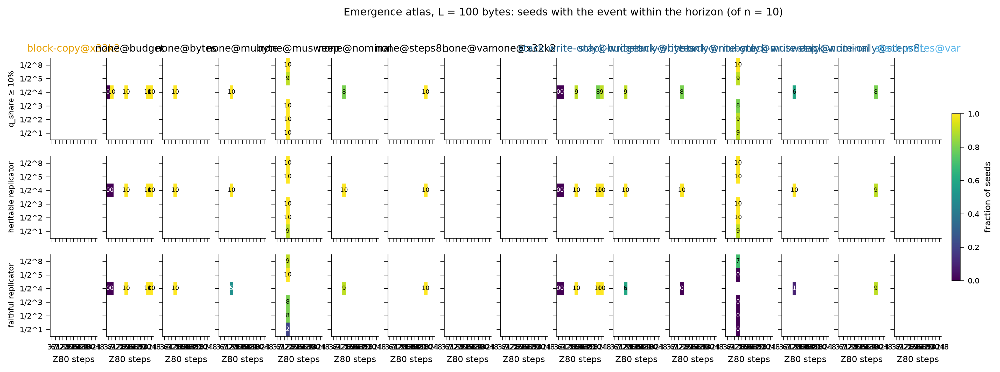

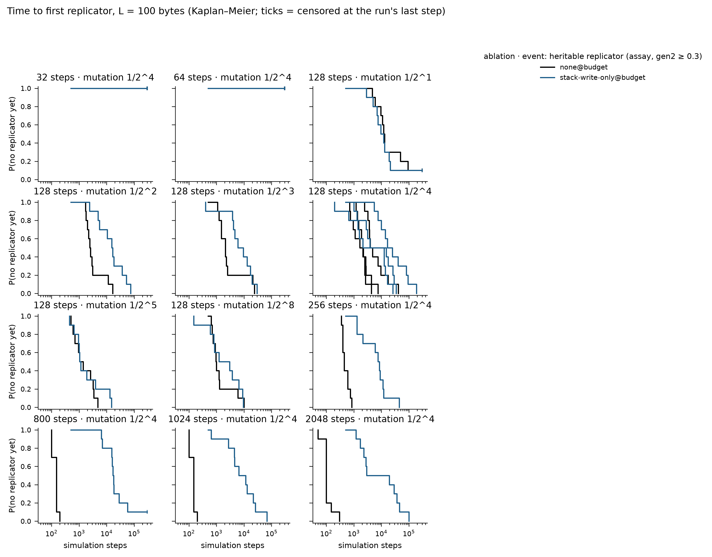

## Succession (census takeover times, family at 300k steps and at the last step)

| label                    |   tape |   steps |   k |   n |   stopped_early |   last_step_min | final_at_last                    | family_300k                      |   stack_takeover_n |   stack_takeover_med |   ldir_takeover_n |   ldir_takeover_med |   ldir_invasions_complete |   ldir_invasions_censored |   ldir_invasion_med_steps |
|:-------------------------|-------:|--------:|----:|----:|----------------:|----------------:|:---------------------------------|:---------------------------------|-------------------:|---------------------:|------------------:|--------------------:|--------------------------:|--------------------------:|--------------------------:|
| block-copy@x32k2         |     16 |      32 |   2 |  20 |               0 |          300000 | none:20                          | none:20                          |                  0 |                  nan |                 0 |                 nan |                         0 |                         0 |                       nan |
| none@budget              |    100 |      32 |   4 |  10 |               0 |          300000 | rst:8, ldir:2                    | rst:8, ldir:2                    |                  0 |                  nan |                 2 |              128750 |                         2 |                         0 |                      1000 |
| none@budget              |    100 |      64 |   4 |  10 |               0 |          300000 | ldir:6, flooded:3, push:1        | ldir:6, flooded:3, push:1        |                  1 |               189000 |                 7 |              149500 |                         7 |                         0 |                      1000 |
| none@budget              |    100 |     256 |   4 |  10 |               0 |          300000 | push:10                          | push:10                          |                 10 |                 1075 |                 0 |                 nan |                         0 |                         0 |                       nan |
| none@budget              |    100 |    1024 |   4 |  10 |               0 |          300000 | push:10                          | push:10                          |                 10 |                  500 |                 0 |                 nan |                         0 |                         0 |                       nan |
| none@budget              |    100 |    2048 |   4 |  10 |               0 |          300000 | push:10                          | push:10                          |                 10 |                  425 |                 0 |                 nan |                         0 |                         0 |                       nan |
| none@bytes               |      4 |     128 |   4 |  10 |               0 |          300000 | none:10                          | none:10                          |                  0 |                  nan |                 0 |                 nan |                         0 |                         1 |                       nan |
| none@bytes               |      9 |     128 |   4 |  10 |               0 |          300000 | ldir:7, none:3                   | ldir:7, none:3                   |                  0 |                  nan |                 7 |              110000 |                         7 |                         0 |                      4500 |
| none@bytes               |     16 |     128 |   4 |  10 |               0 |          300000 | ex_sp:10                         | ex_sp:10                         |                 10 |                 7750 |                 0 |                 nan |                         0 |                         0 |                       nan |
| none@bytes               |     25 |     128 |   4 |  10 |               0 |          300000 | push:10                          | push:10                          |                 10 |                 2250 |                 0 |                 nan |                         0 |                         0 |                       nan |
| none@bytes               |     36 |     128 |   4 |  10 |               0 |          300000 | push:10                          | push:10                          |                 10 |                 1525 |                 0 |                 nan |                         0 |                         0 |                       nan |
| none@bytes               |     49 |     128 |   4 |  10 |               0 |          300000 | push:10                          | push:10                          |                 10 |                 1400 |                 0 |                 nan |                         0 |                         0 |                       nan |
| none@bytes               |     64 |     128 |   4 |  10 |               0 |          300000 | push:10                          | push:10                          |                 10 |                 2175 |                 0 |                 nan |                         0 |                         0 |                       nan |
| none@bytes               |     81 |     128 |   4 |  10 |               0 |          300000 | push:10                          | push:10                          |                 10 |                 1275 |                 0 |                 nan |                         0 |                         0 |                       nan |
| none@bytes               |    100 |     128 |   4 |  10 |               0 |          300000 | push:10                          | push:10                          |                 10 |                 3025 |                 0 |                 nan |                         0 |                         0 |                       nan |
| none@mubyte              |      4 |     128 |   4 |  10 |               0 |          300000 | none:10                          | none:10                          |                  0 |                  nan |                 0 |                 nan |                         0 |                         0 |                       nan |
| none@mubyte              |      9 |     128 |   4 |  10 |               0 |          300000 | none:9, ldir:1                   | none:9, ldir:1                   |                  0 |                  nan |                 1 |               72500 |                         1 |                         0 |                      2000 |
| none@mubyte              |     16 |     128 |   4 |  10 |               0 |          300000 | ex_sp:9, ldir:1                  | ex_sp:9, ldir:1                  |                  9 |                 4700 |                 1 |                5500 |                         1 |                         0 |                      3100 |
| none@mubyte              |     25 |     128 |   4 |  10 |               0 |          300000 | push:10                          | push:10                          |                 10 |                 2300 |                 0 |                 nan |                         0 |                         0 |                       nan |
| none@mubyte              |     36 |     128 |   4 |  10 |               0 |          300000 | push:8, ldir:2                   | push:8, ldir:2                   |                 10 |                 1350 |                 2 |              263750 |                         2 |                         0 |                      2000 |
| none@mubyte              |     49 |     128 |   4 |  10 |               0 |          300000 | push:8, ldir:2                   | push:8, ldir:2                   |                 10 |                 1650 |                 2 |               72500 |                         2 |                         0 |                      2250 |
| none@mubyte              |     64 |     128 |   4 |  10 |               0 |          300000 | ldir:7, push:3                   | ldir:7, push:3                   |                 10 |                 2100 |                 7 |              173000 |                         7 |                         0 |                      2000 |
| none@mubyte              |     81 |     128 |   4 |  10 |               0 |          300000 | ldir:6, push:4                   | ldir:6, push:4                   |                 10 |                 1650 |                 6 |                8750 |                         6 |                         0 |                      1675 |
| none@mubyte              |    100 |     128 |   4 |  10 |               0 |          300000 | ldir:10                          | ldir:10                          |                  6 |                 2750 |                10 |                8300 |                        10 |                         0 |                      1325 |
| none@musweep             |    100 |     128 |   1 |  10 |               0 |          300000 | ldir:10                          | ldir:10                          |                  8 |                 3125 |                10 |                6500 |                        10 |                         0 |                      1350 |
| none@musweep             |    100 |     128 |   2 |  10 |               0 |          300000 | ldir:5, push:5                   | ldir:5, push:5                   |                  8 |                 3300 |                 5 |               64500 |                         5 |                         0 |                      1100 |
| none@musweep             |    100 |     128 |   3 |  10 |               0 |          300000 | push:8, ldir:2                   | push:8, ldir:2                   |                  8 |                 3250 |                 2 |                1650 |                         2 |                         0 |                      1250 |
| none@musweep             |    100 |     128 |   5 |  10 |               0 |          300000 | push:8, ldir:2                   | push:8, ldir:2                   |                 10 |                 3450 |                 2 |                3250 |                         2 |                         0 |                      1525 |
| none@musweep             |    100 |     128 |   8 |  10 |               0 |          300000 | push:7, ldir:3                   | push:7, ldir:3                   |                 10 |                 3200 |                 3 |                1000 |                         3 |                         0 |                       950 |
| none@nominal             |      3 |     128 |   4 |  10 |               0 |          300000 | none:10                          | none:10                          |                  0 |                  nan |                 0 |                 nan |                         0 |                         0 |                       nan |
| none@nominal             |      4 |     128 |   4 |  10 |               0 |          300000 | none:10                          | none:10                          |                  0 |                  nan |                 0 |                 nan |                         0 |                         0 |                       nan |
| none@nominal             |      5 |     128 |   4 |  10 |               0 |          300000 | ldir:9, none:1                   | ldir:9, none:1                   |                  0 |                  nan |                 9 |               49500 |                         0 |                         9 |                       nan |
| none@nominal             |      6 |     128 |   4 |  10 |               0 |          300000 | ldir:9, none:1                   | ldir:9, none:1                   |                  0 |                  nan |                 9 |              152500 |                         0 |                         9 |                       nan |
| none@nominal             |      7 |     128 |   4 |  10 |               0 |          300000 | none:10                          | none:10                          |                  0 |                  nan |                 0 |                 nan |                         0 |                         0 |                       nan |
| none@nominal             |      8 |     128 |   4 |  10 |               0 |          300000 | ldir:5, ex_sp:3, ld_hl:1, none:1 | ldir:5, ex_sp:3, ld_hl:1, none:1 |                  3 |               204000 |                 6 |               99750 |                         3 |                         3 |                     15000 |
| none@nominal             |      9 |     128 |   4 |  10 |               0 |          300000 | none:6, ldir:4                   | none:6, ldir:4                   |                  0 |                  nan |                 4 |              112500 |                         4 |                         0 |                     17750 |
| none@nominal             |     10 |     128 |   4 |  10 |               0 |          300000 | none:7, ldir:3                   | none:7, ldir:3                   |                  0 |                  nan |                 3 |              151000 |                         3 |                         0 |                      5000 |
| none@nominal             |     12 |     128 |   4 |  10 |               0 |          300000 | ldir:6, none:4                   | ldir:6, none:4                   |                  0 |                  nan |                 6 |               75750 |                         6 |                         0 |                      3750 |
| none@nominal             |     16 |     128 |   4 |  10 |               0 |          300000 | ex_sp:9, ldir:1                  | ex_sp:9, ldir:1                  |                 10 |                 5850 |                 1 |               42500 |                         1 |                         0 |                      1500 |
| none@nominal             |     18 |     128 |   4 |  10 |               0 |          300000 | ldir:8, none:2                   | ldir:8, none:2                   |                  9 |                12500 |                 8 |              102250 |                         8 |                         0 |                      1750 |
| none@nominal             |     20 |     128 |   4 |  10 |               0 |          300000 | none:8, ldir:2                   | none:8, ldir:2                   |                  9 |                18500 |                 2 |               58000 |                         2 |                         0 |                      2250 |
| none@nominal             |     24 |     128 |   4 |  10 |               0 |          300000 | push:6, ldir:3, ex_sp:1          | push:6, ldir:3, ex_sp:1          |                 10 |                 1000 |                 3 |               19500 |                         3 |                         0 |                      2000 |
| none@nominal             |     25 |     128 |   4 |  10 |               0 |          300000 | push:8, ldir:2                   | push:8, ldir:2                   |                 10 |                 2075 |                 2 |              225750 |                         2 |                         0 |                      1250 |
| none@nominal             |     32 |     128 |   4 |  10 |               0 |          300000 | push:9, ldir:1                   | push:9, ldir:1                   |                 10 |                  975 |                 1 |              295000 |                         1 |                         0 |                      2000 |
| none@nominal             |     36 |     128 |   4 |  10 |               0 |          300000 | push:9, ldir:1                   | push:9, ldir:1                   |                 10 |                 1250 |                 1 |                1350 |                         1 |                         0 |                      1750 |
| none@nominal             |     49 |     128 |   4 |  10 |               0 |          300000 | push:8, ldir:2                   | push:8, ldir:2                   |                 10 |                 1300 |                 2 |              237750 |                         2 |                         0 |                      2000 |
| none@nominal             |     50 |     128 |   4 |  10 |               0 |          300000 | push:10                          | push:10                          |                 10 |                 1375 |                 0 |                 nan |                         0 |                         0 |                       nan |
| none@nominal             |     64 |     128 |   4 |  10 |               0 |          300000 | push:10                          | push:10                          |                 10 |                 1675 |                 0 |                 nan |                         0 |                         0 |                       nan |
| none@nominal             |     81 |     128 |   4 |  10 |               0 |          300000 | push:7, ldir:3                   | push:7, ldir:3                   |                  9 |                 1400 |                 3 |                1400 |                         3 |                         0 |                      1600 |
| none@nominal             |    100 |     128 |   4 |  10 |               0 |          300000 | ldir:5, push:5                   | ldir:5, push:5                   |                  6 |                 2900 |                 5 |                1900 |                         5 |                         0 |                      1100 |
| none@steps8L             |      4 |      32 |   4 |  10 |               0 |          300000 | none:10                          | none:10                          |                  0 |                  nan |                 0 |                 nan |                         0 |                         1 |                       nan |
| none@steps8L             |      9 |      72 |   4 |  10 |               0 |          300000 | none:8, ldir:2                   | none:8, ldir:2                   |                  0 |                  nan |                 2 |               82500 |                         2 |                         0 |                     43500 |
| none@steps8L             |     16 |     128 |   4 |  10 |               0 |          300000 | ex_sp:10                         | ex_sp:10                         |                 10 |                 4525 |                 0 |                 nan |                         0 |                         0 |                       nan |
| none@steps8L             |     25 |     200 |   4 |  10 |               0 |          300000 | push:9, ldir:1                   | push:9, ldir:1                   |                  9 |                 2300 |                 1 |                1450 |                         1 |                         0 |                      1250 |
| none@steps8L             |     36 |     288 |   4 |  10 |               0 |          300000 | ldir:8, push:2                   | ldir:8, push:2                   |                 10 |                  700 |                 8 |               38500 |                         8 |                         0 |                      1750 |
| none@steps8L             |     49 |     392 |   4 |  10 |               0 |          300000 | push:10                          | push:10                          |                 10 |                  450 |                 0 |                 nan |                         0 |                         0 |                       nan |
| none@steps8L             |     64 |     512 |   4 |  10 |               0 |          300000 | push:9, ldir:1                   | push:9, ldir:1                   |                 10 |                  425 |                 1 |               24000 |                         1 |                         0 |                      3500 |
| none@steps8L             |     81 |     648 |   4 |  10 |               0 |          300000 | push:9, ldir:1                   | push:9, ldir:1                   |                 10 |                  400 |                 1 |              298500 |                         0 |                         1 |                       nan |
| none@steps8L             |    100 |     800 |   4 |  10 |               0 |          300000 | push:10                          | push:10                          |                 10 |                  500 |                 0 |                 nan |                         0 |                         0 |                       nan |
| none@var                 |      9 |     128 |   4 |  10 |               0 |          300000 | none:7, ldir:3                   | none:7, ldir:3                   |                  0 |                  nan |                 3 |              117500 |                         2 |                         1 |                     72500 |
| none@var                 |     16 |     128 |   4 |  10 |               0 |          300000 | ldir:9, ex_sp:1                  | ldir:9, ex_sp:1                  |                  1 |                 2050 |                 9 |                1100 |                         9 |                         0 |                      1650 |
| none@x32k2               |     16 |      32 |   2 |  20 |               0 |          300000 | ldir:18, none:2                  | ldir:18, none:2                  |                  0 |                  nan |                18 |               51250 |                         0 |                        18 |                       nan |
| stack-write-only@budget  |    100 |      32 |   4 |  10 |               0 |          300000 | rst:7, ldir:3                    | rst:7, ldir:3                    |                  0 |                  nan |                 3 |              205500 |                         3 |                         0 |                      1000 |
| stack-write-only@budget  |    100 |      64 |   4 |  10 |               0 |          300000 | ldir:10                          | ldir:10                          |                  4 |                58750 |                10 |               38000 |                        10 |                         0 |                      1000 |
| stack-write-only@budget  |    100 |     256 |   4 |  10 |               0 |          300000 | ldir:10                          | ldir:10                          |                  1 |                 8500 |                10 |                3600 |                        10 |                         0 |                      1125 |
| stack-write-only@budget  |    100 |    1024 |   4 |  10 |               0 |          300000 | ldir:10                          | ldir:10                          |                  0 |                  nan |                10 |                7500 |                        10 |                         0 |                      1000 |
| stack-write-only@budget  |    100 |    2048 |   4 |  10 |               0 |          300000 | ldir:10                          | ldir:10                          |                  4 |                27250 |                10 |                4525 |                        10 |                         0 |                      1000 |
| stack-write-only@bytes   |      4 |     128 |   4 |  10 |               0 |          300000 | none:10                          | none:10                          |                  0 |                  nan |                 0 |                 nan |                         0 |                         0 |                       nan |
| stack-write-only@bytes   |      9 |     128 |   4 |  10 |               0 |          300000 | ldir:10                          | ldir:10                          |                  0 |                  nan |                10 |               56000 |                        10 |                         0 |                      8000 |
| stack-write-only@bytes   |     16 |     128 |   4 |  10 |               0 |          300000 | ldir:10                          | ldir:10                          |                  0 |                  nan |                10 |               26500 |                        10 |                         0 |                      1500 |
| stack-write-only@bytes   |     25 |     128 |   4 |  10 |               0 |          300000 | ldir:10                          | ldir:10                          |                  0 |                  nan |                10 |               51250 |                        10 |                         0 |                      1000 |
| stack-write-only@bytes   |     36 |     128 |   4 |  10 |               0 |          300000 | ldir:10                          | ldir:10                          |                  0 |                  nan |                10 |               13250 |                        10 |                         0 |                      1000 |
| stack-write-only@bytes   |     49 |     128 |   4 |  10 |               0 |          300000 | ldir:10                          | ldir:10                          |                  2 |                44250 |                10 |               37500 |                        10 |                         0 |                       650 |
| stack-write-only@bytes   |     64 |     128 |   4 |  10 |               0 |          300000 | ldir:10                          | ldir:10                          |                  6 |                55750 |                10 |               50250 |                        10 |                         0 |                       500 |
| stack-write-only@bytes   |     81 |     128 |   4 |  10 |               0 |          300000 | ldir:10                          | ldir:10                          |                  5 |                28500 |                10 |                5300 |                        10 |                         0 |                       825 |
| stack-write-only@bytes   |    100 |     128 |   4 |  10 |               0 |          300000 | ldir:10                          | ldir:10                          |                  7 |                42500 |                10 |                8800 |                        10 |                         0 |                       500 |
| stack-write-only@mubyte  |      4 |     128 |   4 |  10 |               0 |          300000 | none:10                          | none:10                          |                  0 |                  nan |                 0 |                 nan |                         0 |                         1 |                       nan |
| stack-write-only@mubyte  |      9 |     128 |   4 |  10 |               0 |          300000 | ldir:7, none:3                   | ldir:7, none:3                   |                  0 |                  nan |                 7 |               72000 |                         6 |                         1 |                     17500 |
| stack-write-only@mubyte  |     16 |     128 |   4 |  10 |               0 |          300000 | ldir:10                          | ldir:10                          |                  0 |                  nan |                10 |               31750 |                        10 |                         0 |                      1250 |
| stack-write-only@mubyte  |     25 |     128 |   4 |  10 |               0 |          300000 | ldir:10                          | ldir:10                          |                  0 |                  nan |                10 |               21250 |                        10 |                         0 |                      1000 |
| stack-write-only@mubyte  |     36 |     128 |   4 |  10 |               0 |          300000 | ldir:10                          | ldir:10                          |                  0 |                  nan |                10 |                9250 |                        10 |                         0 |                      1250 |
| stack-write-only@mubyte  |     49 |     128 |   4 |  10 |               0 |          300000 | ldir:10                          | ldir:10                          |                  1 |                28000 |                10 |                8750 |                        10 |                         0 |                      1450 |
| stack-write-only@mubyte  |     64 |     128 |   4 |  10 |               0 |          300000 | ldir:10                          | ldir:10                          |                  0 |                  nan |                10 |                6250 |                        10 |                         0 |                      1225 |
| stack-write-only@mubyte  |     81 |     128 |   4 |  10 |               0 |          300000 | ldir:10                          | ldir:10                          |                  0 |                  nan |                10 |                2050 |                        10 |                         0 |                      1300 |
| stack-write-only@mubyte  |    100 |     128 |   4 |  10 |               0 |          300000 | ldir:10                          | ldir:10                          |                  0 |                  nan |                10 |                1275 |                        10 |                         0 |                      1075 |
| stack-write-only@musweep |    100 |     128 |   1 |  10 |               0 |          300000 | ldir:10                          | ldir:10                          |                  2 |                43475 |                10 |                1775 |                        10 |                         0 |                      1025 |
| stack-write-only@musweep |    100 |     128 |   2 |  10 |               0 |          300000 | ldir:10                          | ldir:10                          |                  0 |                  nan |                10 |                1350 |                        10 |                         0 |                      1075 |
| stack-write-only@musweep |    100 |     128 |   3 |  10 |               0 |          300000 | ldir:10                          | ldir:10                          |                  1 |               219500 |                10 |                1725 |                        10 |                         0 |                      1100 |
| stack-write-only@musweep |    100 |     128 |   5 |  10 |               0 |          300000 | ldir:10                          | ldir:10                          |                  2 |                 1700 |                10 |                1250 |                        10 |                         0 |                       950 |
| stack-write-only@musweep |    100 |     128 |   8 |  10 |               0 |          300000 | ldir:10                          | ldir:10                          |                  7 |                61000 |                10 |                1325 |                        10 |                         0 |                      1000 |
| stack-write-only@nominal |      3 |     128 |   4 |  10 |               0 |          300000 | none:10                          | none:10                          |                  0 |                  nan |                 0 |                 nan |                         0 |                         0 |                       nan |
| stack-write-only@nominal |      4 |     128 |   4 |  10 |               0 |          300000 | none:10                          | none:10                          |                  0 |                  nan |                 0 |                 nan |                         0 |                         0 |                       nan |
| stack-write-only@nominal |      5 |     128 |   4 |  10 |               0 |          300000 | ldir:8, none:2                   | ldir:8, none:2                   |                  0 |                  nan |                 8 |              135250 |                         0 |                         8 |                       nan |
| stack-write-only@nominal |      6 |     128 |   4 |  10 |               0 |          300000 | ldir:10                          | ldir:10                          |                  0 |                  nan |                10 |              117750 |                         8 |                         2 |                     16750 |
| stack-write-only@nominal |      7 |     128 |   4 |  10 |               0 |          300000 | none:5, ldir:5                   | none:5, ldir:5                   |                  0 |                  nan |                 5 |              128500 |                         5 |                         0 |                     10000 |
| stack-write-only@nominal |      8 |     128 |   4 |  10 |               0 |          300000 | ldir:7, none:3                   | ldir:7, none:3                   |                  0 |                  nan |                 7 |               90500 |                         6 |                         1 |                     16250 |
| stack-write-only@nominal |      9 |     128 |   4 |  10 |               0 |          300000 | ldir:9, none:1                   | ldir:9, none:1                   |                  0 |                  nan |                 9 |              101000 |                         8 |                         1 |                      4000 |
| stack-write-only@nominal |     10 |     128 |   4 |  10 |               0 |          300000 | ldir:8, none:2                   | ldir:8, none:2                   |                  0 |                  nan |                 8 |              128750 |                         8 |                         0 |                      2500 |
| stack-write-only@nominal |     12 |     128 |   4 |  10 |               0 |          300000 | ldir:10                          | ldir:10                          |                  0 |                  nan |                10 |               29250 |                        10 |                         0 |                      3500 |
| stack-write-only@nominal |     16 |     128 |   4 |  10 |               0 |          300000 | ldir:9, rst:1                    | ldir:9, rst:1                    |                  1 |                26000 |                10 |               30750 |                        10 |                         0 |                      1500 |
| stack-write-only@nominal |     18 |     128 |   4 |  10 |               0 |          300000 | ldir:10                          | ldir:10                          |                  0 |                  nan |                10 |               34000 |                        10 |                         0 |                      1750 |
| stack-write-only@nominal |     20 |     128 |   4 |  10 |               0 |          300000 | ldir:10                          | ldir:10                          |                  0 |                  nan |                10 |               30250 |                        10 |                         0 |                      1000 |
| stack-write-only@nominal |     24 |     128 |   4 |  10 |               0 |          300000 | ldir:10                          | ldir:10                          |                  0 |                  nan |                10 |                5750 |                        10 |                         0 |                      1325 |
| stack-write-only@nominal |     25 |     128 |   4 |  10 |               0 |          300000 | ldir:10                          | ldir:10                          |                  0 |                  nan |                10 |               59500 |                        10 |                         0 |                      1500 |
| stack-write-only@nominal |     32 |     128 |   4 |  10 |               0 |          300000 | ldir:10                          | ldir:10                          |                  2 |               100500 |                10 |               47000 |                        10 |                         0 |                      1250 |
| stack-write-only@nominal |     36 |     128 |   4 |  10 |               0 |          300000 | ldir:10                          | ldir:10                          |                  0 |                  nan |                10 |                7500 |                        10 |                         0 |                      1100 |
| stack-write-only@nominal |     49 |     128 |   4 |  10 |               0 |          300000 | ldir:10                          | ldir:10                          |                  2 |               119500 |                10 |               10000 |                        10 |                         0 |                      1000 |
| stack-write-only@nominal |     50 |     128 |   4 |  10 |               0 |          300000 | ldir:10                          | ldir:10                          |                  0 |                  nan |                10 |               15250 |                        10 |                         0 |                      1100 |
| stack-write-only@nominal |     64 |     128 |   4 |  10 |               0 |          300000 | ldir:10                          | ldir:10                          |                  1 |                28000 |                10 |               12750 |                        10 |                         0 |                      1000 |
| stack-write-only@nominal |     81 |     128 |   4 |  10 |               0 |          300000 | ldir:10                          | ldir:10                          |                  0 |                  nan |                10 |                1775 |                        10 |                         0 |                       950 |
| stack-write-only@nominal |    100 |     128 |   4 |  10 |               0 |          300000 | ldir:10                          | ldir:10                          |                  2 |                 1775 |                10 |                1575 |                        10 |                         0 |                       950 |
| stack-write-only@steps8L |      4 |      32 |   4 |  10 |               0 |          300000 | none:10                          | none:10                          |                  0 |                  nan |                 0 |                 nan |                         0 |                         0 |                       nan |
| stack-write-only@steps8L |      9 |      72 |   4 |  10 |               0 |          300000 | ldir:8, none:2                   | ldir:8, none:2                   |                  0 |                  nan |                 8 |               52750 |                         8 |                         0 |                      5000 |
| stack-write-only@steps8L |     16 |     128 |   4 |  10 |               0 |          300000 | ldir:10                          | ldir:10                          |                  0 |                  nan |                10 |               23500 |                        10 |                         0 |                      1500 |
| stack-write-only@steps8L |     25 |     200 |   4 |  10 |               0 |          300000 | ldir:10                          | ldir:10                          |                  0 |                  nan |                10 |               28000 |                        10 |                         0 |                      1000 |
| stack-write-only@steps8L |     36 |     288 |   4 |  10 |               0 |          300000 | ldir:10                          | ldir:10                          |                  0 |                  nan |                10 |               30000 |                        10 |                         0 |                      1000 |
| stack-write-only@steps8L |     49 |     392 |   4 |  10 |               0 |          300000 | ldir:10                          | ldir:10                          |                  0 |                  nan |                10 |               22750 |                        10 |                         0 |                      1250 |
| stack-write-only@steps8L |     64 |     512 |   4 |  10 |               0 |          300000 | ldir:10                          | ldir:10                          |                  4 |                74250 |                10 |               10500 |                        10 |                         0 |                      1000 |
| stack-write-only@steps8L |     81 |     648 |   4 |  10 |               0 |          300000 | ldir:10                          | ldir:10                          |                  0 |                  nan |                10 |               23000 |                        10 |                         0 |                      1000 |
| stack-write-only@steps8L |    100 |     800 |   4 |  10 |               0 |          300000 | ldir:10                          | ldir:10                          |                  1 |                58000 |                10 |               13000 |                        10 |                         0 |                      1000 |
| stack-writes@var         |     16 |     128 |   4 |  10 |               0 |          300000 | ldir:10                          | ldir:10                          |                  0 |                  nan |                10 |               34750 |                        10 |                         0 |                      1500 |

## Replicator zoo — runs/stageE

## none@budget · L=100 · 256 steps · mutation 1/2^4
**first** (10 seeds)
- 10× `01 c5 01 c5 01 c5 01 c5 01 c5 01 c5 01 c5 01 c5 01 c5 01 c5 …` — [LD rr,nn ; PUSH rr] ×50

**final** (10 seeds)
- 10× `c2 c5 01 c5 01 c5 01 c5 c2 c5 c2 c5 01 c5 01 c5 01 c5 c2 c5 …` — [JP NZ,nn ; PUSH rr ; LD rr,nn ; PUSH rr ; JP NZ,nn ; PUSH rr ; LD rr,nn ; PUSH rr ; LD rr,nn ; PUSH rr] ×10

## none@budget · L=100 · 1024 steps · mutation 1/2^4
**first** (10 seeds)
- 10× `01 c5 01 c5 01 c5 01 c5 01 c5 01 c5 01 c5 01 c5 01 c5 01 c5 …` — [LD rr,nn ; PUSH rr] ×50

**final** (10 seeds)
- 10× `01 c5 01 c5 01 c5 01 c5 01 c5 01 c5 01 c5 01 c5 01 c5 01 c5 …` — [LD rr,nn ; PUSH rr] ×50

## none@budget · L=100 · 2048 steps · mutation 1/2^4
**first** (10 seeds)
- 10× `01 c5 01 c5 01 c5 01 c5 01 c5 01 c5 01 c5 01 c5 01 c5 01 c5 …` — [LD rr,nn ; PUSH rr] ×50

**final** (10 seeds)
- 6× `c2 c5 01 c5 01 c5 01 c5 c2 c5 c2 c5 01 c5 01 c5 01 c5 c2 c5 …` — [JP NZ,nn ; PUSH rr ; LD rr,nn ; PUSH rr ; JP NZ,nn ; PUSH rr ; LD rr,nn ; PUSH rr ; LD rr,nn ; PUSH rr] ×10
- 4× `01 c5 01 c5 01 c5 01 c5 01 c5 01 c5 01 c5 01 c5 01 c5 01 c5 …` — [LD rr,nn ; PUSH rr] ×50

## none@bytes · L=4 · 128 steps · mutation 1/2^4
**first** (1 seeds)
- 1× `54 5e ed b0` — LD r,(HL) ; LDIR

**final** (1 seeds)
- 1× `6c 5e ed b0` — LD r,(HL) ; LDIR

## none@bytes · L=9 · 128 steps · mutation 1/2^4
**first** (6 seeds)
- 3× `1d ed b0 1d ed b0 1d ed b0` — [DEC E ; LDIR] ×3
- 1× `87 5e ea 80 ed b0 c3 fd b0` — LD r,(HL) ; JP PE,nn ; JP nn
- 1× `bd 0a c1 5f e2 ed b0 d9 00` — LD r,(BC) ; POP rr ; JP PO,nn ; EXX
- 1× `09 5e 0d 73 e2 ed b0 0b 75` — LD r,(HL) ; LD (HL),r ; JP PO,nn ; LD (HL),r

**final** (7 seeds)
- 2× `87 5e ca 2e ed b0 47 af 49` — LD r,(HL) ; JP Z,nn
- 1× `1e 87 e2 76 ed b0 bd b5 de` — LD r,n ; JP PO,nn
- 1× `99 6b eb 5e c3 ed b0 b8 d1` — EX rr,rr ; LD r,(HL) ; JP nn ; POP rr
- 1× `00 1e 1b 6c c2 ed b0 9d 76` — LD r,n ; JP NZ,nn
- 1× `3f 28 44 5e c2 ed b0 90 93` — JR Z,d ; LD r,(HL) ; JP NZ,nn
- 1× `00 70 1e 2d c3 ed b0 f2 85` — LD (HL),r ; LD r,n ; JP nn ; JP P,nn

## none@bytes · L=16 · 128 steps · mutation 1/2^4
**first** (10 seeds)
- 10× `01 c5 01 c5 01 c5 01 c5 01 c5 01 c5 01 c5 01 c5` — [LD rr,nn ; PUSH rr] ×8

**final** (10 seeds)
- 10× `ad e3 21 e3 21 c0 ad c0 ad e3 21 e3 21 c0 ad c0` — [EX (SP),rr ; LD rr,nn ; RET NZ ; XOR L ; RET NZ ; XOR L] ×2

## none@bytes · L=25 · 128 steps · mutation 1/2^4
**first** (10 seeds)
- 10× `01 c5 01 c5 01 c5 01 c5 01 c5 01 c5 01 c5 01 c5 01 c5 01 c5 …` — [LD rr,nn ; PUSH rr] ×12+1B

**final** (10 seeds)
- 10× `c5 01 c5 01 c5 01 c5 01 c5 01 c5 01 c5 01 c5 01 c5 01 c5 01 …` — [LD rr,nn ; PUSH rr] ×12+1B

## none@bytes · L=36 · 128 steps · mutation 1/2^4
**first** (10 seeds)
- 10× `01 c5 01 c5 01 c5 01 c5 01 c5 01 c5 01 c5 01 c5 01 c5 01 c5 …` — [LD rr,nn ; PUSH rr] ×18

**final** (10 seeds)
- 7× `01 c5 01 c5 01 c5 01 c5 01 c5 01 c5 01 c5 01 c5 01 c5 01 c5 …` — [LD rr,nn ; PUSH rr] ×18
- 3× `11 d5 11 d5 11 d5 11 d5 11 10 f0 d5 11 d5 11 d5 11 d5 11 d5 …` — [DJNZ d ; PUSH rr ; LD rr,nn ; PUSH rr ; LD rr,nn ; PUSH rr ; LD rr,nn] ×2+8B

## none@bytes · L=49 · 128 steps · mutation 1/2^4
**first** (10 seeds)
- 9× `01 c5 01 c5 01 c5 01 c5 01 c5 01 c5 01 c5 01 c5 01 c5 01 c5 …` — [LD rr,nn ; PUSH rr] ×24+1B
- 1× `e5 2a e5 2a e5 2a e5 2a e5 2a e5 2a e5 2a e5 2a e5 2a e5 2a …` — [LD rr,(nn) ; PUSH rr] ×24+1B

**final** (10 seeds)
- 10× `c5 01 c5 01 c5 01 c5 01 c5 01 c5 01 c5 01 c5 01 c5 01 c5 01 …` — [LD rr,nn ; PUSH rr] ×24+1B

## none@bytes · L=64 · 128 steps · mutation 1/2^4
**first** (10 seeds)
- 10× `11 d5 11 d5 11 d5 11 d5 11 d5 11 d5 11 d5 11 d5 11 d5 11 d5 …` — [LD rr,nn ; PUSH rr] ×32

**final** (10 seeds)
- 10× `11 d5 11 d5 11 d5 11 d5 11 d5 11 d5 11 d5 11 d5 11 d5 11 d5 …` — [LD rr,nn ; PUSH rr] ×32

## none@bytes · L=81 · 128 steps · mutation 1/2^4
**first** (10 seeds)
- 10× `e5 21 e5 21 e5 21 e5 21 e5 21 e5 21 e5 21 e5 21 e5 21 e5 21 …` — [LD rr,nn ; PUSH rr] ×40+1B

**final** (10 seeds)
- 10× `e5 21 e5 21 e5 21 e5 21 e5 21 e5 21 e5 21 e5 21 e5 21 e5 21 …` — [LD rr,nn ; PUSH rr] ×40+1B

## none@bytes · L=100 · 128 steps · mutation 1/2^4
**first** (10 seeds)
- 8× `01 c5 01 c5 01 c5 01 c5 01 c5 01 c5 01 c5 01 c5 01 c5 01 c5 …` — [LD rr,nn ; PUSH rr] ×50
- 1× `cd bb cd bb cd bb cd bb cd bb cd bb cd bb cd bb cd bb cd bb …` — [CALL nn ; CP E] ×50
- 1× `cd b9 cd b9 cd b9 cd b9 cd b9 cd b9 cd b9 cd b9 cd b9 cd b9 …` — [CALL nn ; CP C] ×50

**final** (8 seeds)
- 6× `c2 c5 01 c5 01 c5 01 c5 c2 c5 c2 c5 01 c5 01 c5 01 c5 c2 c5 …` — [JP NZ,nn ; PUSH rr ; LD rr,nn ; PUSH rr ; JP NZ,nn ; PUSH rr ; LD rr,nn ; PUSH rr ; LD rr,nn ; PUSH rr] ×10
- 1× `01 c5 c2 c5 01 c5 01 c5 c2 c5 01 c5 01 c5 c2 c5 01 c5 01 c5 …` — [JP NZ,nn ; PUSH rr ; LD rr,nn ; PUSH rr ; LD rr,nn ; PUSH rr] ×16+4B
- 1× `01 c5 e2 c5 01 c5 01 c5 e2 c5 01 c5 01 c5 e2 c5 01 c5 01 c5 …` — [JP PO,nn ; PUSH rr ; LD rr,nn ; PUSH rr ; LD rr,nn ; PUSH rr] ×16+4B

## none@mubyte · L=9 · 128 steps · mutation 1/2^4
**first** (1 seeds)
- 1× `51 1c ae 5f ed b0 74 8c 99` — LDIR ; LD (HL),r

**final** (1 seeds)
- 1× `99 9e 9b 5e c3 ed b0 6d 9e` — LD r,(HL) ; JP nn

## none@mubyte · L=16 · 128 steps · mutation 1/2^4
**first** (10 seeds)
- 10× `01 c5 01 c5 01 c5 01 c5 01 c5 01 c5 01 c5 01 c5` — [LD rr,nn ; PUSH rr] ×8

**final** (10 seeds)
- 9× `ad e3 21 e3 21 c0 ad c0 ad e3 21 e3 21 c0 ad c0` — [EX (SP),rr ; LD rr,nn ; RET NZ ; XOR L ; RET NZ ; XOR L] ×2
- 1× `b0 1e 24 ed b0 1e 24 ed b0 1e 24 ed b0 1e 24 ed` — [LD r,n ; LDIR] ×4

## none@mubyte · L=25 · 128 steps · mutation 1/2^4
**first** (10 seeds)
- 10× `01 c5 01 c5 01 c5 01 c5 01 c5 01 c5 01 c5 01 c5 01 c5 01 c5 …` — [LD rr,nn ; PUSH rr] ×12+1B

**final** (10 seeds)
- 10× `d5 11 d5 11 d5 11 d5 11 d5 11 d5 11 d5 11 d5 11 d5 11 d5 11 …` — [LD rr,nn ; PUSH rr] ×12+1B

## none@mubyte · L=36 · 128 steps · mutation 1/2^4
**first** (10 seeds)
- 10× `01 c5 01 c5 01 c5 01 c5 01 c5 01 c5 01 c5 01 c5 01 c5 01 c5 …` — [LD rr,nn ; PUSH rr] ×18

**final** (10 seeds)
- 6× `21 e5 21 e5 21 e5 21 e5 21 e5 21 e5 21 e5 21 e5 21 e5 21 e5 …` — [LD rr,nn ; PUSH rr] ×18
- 1× `11 76 47 7e ed b0 11 76 47 7e ed b0 11 76 47 7e ed b0 11 76 …` — [LD r,(HL) ; LDIR ; LD rr,nn] ×6
- 1× `56 cf 6a 0b 74 11 2b 68 5a ed b8 14 00 14 00 14 56 8b 56 cf …` — [ADC A,E ; LD r,(HL) ; RST 08 ; LD r,r ; DEC BC ; LD (HL),r ; LD rr,nn ; LD r,r ; LDDR ; INC D ; NOP ; INC D ; NOP ; INC D ; LD r,(HL)] ×2
- 1× `11 d5 11 d5 11 d5 11 d5 11 d5 11 00 00 d5 11 d5 11 d5 11 d5 …` — [LD rr,nn ; NOP ; NOP ; PUSH rr ; LD rr,nn ; PUSH rr ; LD rr,nn ; PUSH rr] ×2+8B
- 1× `b0 85 11 4e d8 ed b0 85 11 4e d8 ed b0 85 11 4e d8 ed b0 85 …` — [ADD A,L ; LD rr,nn ; LDIR] ×6

## none@mubyte · L=49 · 128 steps · mutation 1/2^4
**first** (10 seeds)
- 10× `01 c5 01 c5 01 c5 01 c5 01 c5 01 c5 01 c5 01 c5 01 c5 01 c5 …` — [LD rr,nn ; PUSH rr] ×24+1B

**final** (9 seeds)
- 8× `e5 21 e5 21 e5 21 e5 21 e5 21 e5 21 e5 21 e5 21 e5 21 e5 21 …` — [LD rr,nn ; PUSH rr] ×24+1B
- 1× `f9 d1 ed b0 4c 5c 06 41 92 e3 92 a7 a6 a7 9b fa af fa b0 00 …` — LD SP,HL ; POP rr ; LDIR ; LD r,n ; EX (SP),rr ; JP M,nn ; JP (HL) ; JP M,nn ; RET PE ; LD rr,nn ; LD (BC),r

## none@mubyte · L=64 · 128 steps · mutation 1/2^4
**first** (10 seeds)
- 10× `11 d5 11 d5 11 d5 11 d5 11 d5 11 d5 11 d5 11 d5 11 d5 11 d5 …` — [LD rr,nn ; PUSH rr] ×32

**final** (10 seeds)
- 3× `84 5e ed b0 84 5e ed b0 84 5e ed b0 84 5e ed b0 84 5e ed b0 …` — [ADD A,H ; LD r,(HL) ; LDIR] ×16
- 2× `21 e5 21 e5 21 e5 21 e5 21 e5 21 e5 21 e5 21 e5 21 e5 21 e5 …` — [LD rr,nn ; PUSH rr] ×32
- 1× `04 5e ed b0 04 5e ed b0 04 5e ed b0 04 5e ed b0 04 5e ed b0 …` — [INC B ; LD r,(HL) ; LDIR] ×16
- 1× `b0 62 7c 07 11 88 7d ed b0 62 7c 07 11 88 7d ed b0 62 7c 07 …` — [LD r,r ; LD r,r ; RLCA ; LD rr,nn ; LDIR] ×8
- 1× `64 21 10 74 ed b8 bc c0 be f4 a3 90 de c8 90 00 64 21 10 74 …` — [CALL P,nn ; SBC A,n ; SUB B ; NOP ; LD r,r ; LD rr,nn ; LDDR ; CP H ; RET NZ ; CP (HL)] ×4
- 1× `94 21 90 e8 c2 a4 28 ed b8 3f f5 12 2d b8 29 e6 94 21 90 e8 …` — [ADD HL,HL ; AND n ; LD rr,nn ; JP NZ,nn ; LDDR ; CCF ; PUSH rr ; LD (DE),r ; DEC L ; CP B] ×4

## none@mubyte · L=81 · 128 steps · mutation 1/2^4
**first** (7 seeds)
- 7× `c5 01 c5 01 c5 01 c5 01 c5 01 c5 01 c5 01 c5 01 c5 01 c5 01 …` — [LD rr,nn ; PUSH rr] ×40+1B

**final** (4 seeds)
- 4× `e5 21 e5 21 e5 21 e5 21 e5 21 e5 21 e5 21 e5 21 e5 21 e5 21 …` — [LD rr,nn ; PUSH rr] ×40+1B

## none@mubyte · L=100 · 128 steps · mutation 1/2^4
**first** (10 seeds)
- 5× `01 c5 01 c5 01 c5 01 c5 01 c5 01 c5 01 c5 01 c5 01 c5 01 c5 …` — [LD rr,nn ; PUSH rr] ×50
- 1× `1e 05 ed b0 56 1e 05 ed b0 56 1e 05 ed b0 56 1e 05 ed b0 56 …` — [LD r,(HL) ; LD r,n ; LDIR] ×20
- 1× `1e 05 54 ed b0 1e 05 54 ed b0 1e 05 54 ed b0 1e 05 54 ed b0 …` — [LD r,n ; LD r,r ; LDIR] ×20
- 1× `1e cc ed b0 1e cc ed b0 1e cc ed b0 1e cc ed b0 1e cc ed b0 …` — [LD r,n ; LDIR] ×25
- 1× `05 5e ed b0 04 05 5e ed b0 04 05 5e ed b0 04 05 5e ed b0 04 …` — [DEC B ; LD r,(HL) ; LDIR ; INC B] ×20
- 1× `1e cd 1a ed b0 1e cd 1a ed b0 1e cd 1a ed b0 1e cd 1a ed b0 …` — [LD r,(DE) ; LDIR ; LD r,n] ×20

## none@musweep · L=100 · 128 steps · mutation 1/2^1
**first** (9 seeds)
- 3× `1e cc ed b0 1e cc ed b0 1e cc ed b0 1e cc ed b0 1e cc ed b0 …` — [LD r,n ; LDIR] ×25
- 2× `b0 11 cd 32 ed b0 11 cd 32 ed b0 11 cd 32 ed b0 11 cd 32 ed …` — [LD rr,nn ; LDIR] ×20
- 2× `01 c5 01 c5 01 c5 01 c5 01 c5 01 c5 01 c5 01 c5 01 c5 01 c5 …` — [LD rr,nn ; PUSH rr] ×50
- 1× `1e cd 69 ed b0 1e cd 69 ed b0 1e cd 69 ed b0 1e cd 69 ed b0 …` — [LD r,n ; LD r,r ; LDIR] ×20
- 1× `1e 05 ed b0 1e 1e 05 ed b0 1e 1e 05 ed b0 1e 1e 05 ed b0 1e …` — [DEC B ; LDIR ; LD r,n] ×20

## none@musweep · L=100 · 128 steps · mutation 1/2^2
**first** (10 seeds)
- 8× `01 c5 01 c5 01 c5 01 c5 01 c5 01 c5 01 c5 01 c5 01 c5 01 c5 …` — [LD rr,nn ; PUSH rr] ×50
- 1× `05 5e ed b0 8f 05 5e ed b0 8f 05 5e ed b0 8f 05 5e ed b0 8f …` — [ADC A,A ; DEC B ; LD r,(HL) ; LDIR] ×20
- 1× `1e cd ed b0 eb 1e cd ed b0 eb 1e cd ed b0 eb 1e cd ed b0 eb …` — [EX rr,rr ; LD r,n ; LDIR] ×20

**final** (5 seeds)
- 4× `01 c5 01 c5 01 c5 01 c5 01 c5 01 c5 01 c5 01 c5 01 c5 01 c5 …` — [LD rr,nn ; PUSH rr] ×50
- 1× `01 c5 01 71 e9 c5 01 c5 01 71 e9 c5 01 c5 01 71 e9 c5 01 c5 …` — [JP (HL) ; PUSH rr ; LD rr,nn ; LD (HL),r] ×16+4B

## none@musweep · L=100 · 128 steps · mutation 1/2^3
**first** (10 seeds)
- 8× `01 c5 01 c5 01 c5 01 c5 01 c5 01 c5 01 c5 01 c5 01 c5 01 c5 …` — [LD rr,nn ; PUSH rr] ×50
- 1× `00 b3 1e 0a d8 29 02 ed b0 44 00 b3 1e 0a d8 29 02 ed b0 44 …` — [ADD HL,HL ; LD (BC),r ; LDIR ; LD r,r ; NOP ; OR E ; LD r,n ; RET C] ×10
- 1× `11 4a 51 bd ed b0 89 25 ab bb 11 4a 51 bd ed b0 89 25 ab bb …` — [ADC A,C ; DEC H ; XOR E ; CP E ; LD rr,nn ; CP L ; LDIR] ×10

**final** (8 seeds)
- 6× `c2 c5 01 c5 01 c5 01 c5 c2 c5 c2 c5 01 c5 01 c5 01 c5 c2 c5 …` — [JP NZ,nn ; PUSH rr ; LD rr,nn ; PUSH rr ; JP NZ,nn ; PUSH rr ; LD rr,nn ; PUSH rr ; LD rr,nn ; PUSH rr] ×10
- 2× `11 d5 11 d5 11 d5 11 d5 11 d5 11 d5 11 d5 11 d5 11 d5 11 d5 …` — [LD rr,nn ; PUSH rr] ×50

## none@musweep · L=100 · 128 steps · mutation 1/2^5
**first** (10 seeds)
- 10× `01 c5 01 c5 01 c5 01 c5 01 c5 01 c5 01 c5 01 c5 01 c5 01 c5 …` — [LD rr,nn ; PUSH rr] ×50

**final** (8 seeds)
- 8× `c2 c5 01 c5 01 c5 01 c5 c2 c5 c2 c5 01 c5 01 c5 01 c5 c2 c5 …` — [JP NZ,nn ; PUSH rr ; LD rr,nn ; PUSH rr ; JP NZ,nn ; PUSH rr ; LD rr,nn ; PUSH rr ; LD rr,nn ; PUSH rr] ×10

## none@musweep · L=100 · 128 steps · mutation 1/2^8
**first** (10 seeds)
- 9× `01 c5 01 c5 01 c5 01 c5 01 c5 01 c5 01 c5 01 c5 01 c5 01 c5 …` — [LD rr,nn ; PUSH rr] ×50
- 1× `ac 51 00 51 ac 1b 00 1b ac 1b ac 51 00 51 ac 1b 00 1b ac 1b …` — [AND n ; LD r,r ; RL A ; OR L ; RLA ; LD r,n ; XOR H ; DEC DE ; NOP ; DEC DE ; XOR H ; DEC DE ; XOR H ; LD r,r ; XOR H ; LD r,r ; NOP ; LD r,r ; XOR H ; DEC DE ; NOP ; DEC DE ; XOR H ; DEC DE ; XOR H ; LD r,r ; NOP ; LD r,r ; XOR H ; DEC DE ; NOP ; DEC DE ; XOR H ; DEC DE ; XOR H ; LD r,r ; NOP ; LDIR ; LD r,r ; NOP ; LD r,r ; OR H ; XOR A ; XOR A ; NOP ; INC B] ×2

**final** (7 seeds)
- 4× `c2 c5 01 c5 01 c5 01 c5 c2 c5 c2 c5 01 c5 01 c5 01 c5 c2 c5 …` — [JP NZ,nn ; PUSH rr ; LD rr,nn ; PUSH rr ; JP NZ,nn ; PUSH rr ; LD rr,nn ; PUSH rr ; LD rr,nn ; PUSH rr] ×10
- 3× `01 c5 c2 c5 01 c5 01 c5 c2 c5 01 c5 01 c5 c2 c5 01 c5 01 c5 …` — [JP NZ,nn ; PUSH rr ; LD rr,nn ; PUSH rr ; LD rr,nn ; PUSH rr] ×16+4B

## none@nominal · L=5 · 128 steps · mutation 1/2^4
**first** (9 seeds)
- 1× `c3 1d ed b0 4e` — JP nn ; LD r,(HL)
- 1× `c2 ee 1d ed b0` — JP NZ,nn ; LDIR
- 1× `f2 1d ed b0 0d` — JP P,nn
- 1× `e2 1d ed b0 ac` — JP PO,nn
- 1× `1d 63 ed b0 1e` — LDIR ; LD r,n
- 1× `1d 90 ca ed b0` — JP Z,nn

**final** (9 seeds)
- 6× `00 1d c3 ed b0` — JP nn
- 1× `c2 1d ed b0 a9` — JP NZ,nn
- 1× `00 1d d2 ed b0` — JP NC,nn
- 1× `e2 1d ed b0 2b` — JP PO,nn

## none@nominal · L=6 · 128 steps · mutation 1/2^4
**first** (9 seeds)
- 3× `14 ed b0 62 14 ed` — LDIR
- 3× `15 ed b8 44 15 ed` — LDDR
- 1× `1d ed b0 1d ed b0` — [DEC E ; LDIR] ×2
- 1× `1e 2a bf ed b0 ce` — LD r,n ; LDIR
- 1× `4e ed b0 3d 6a d0` — LD r,(HL) ; LDIR ; RET NC

**final** (2 seeds)
- 1× `d2 76 5e ed b0 95` — JP NC,nn ; LDIR
- 1× `1e a2 e2 1c ed b0` — LD r,n ; JP PO,nn

## none@nominal · L=8 · 128 steps · mutation 1/2^4
**first** (10 seeds)
- 10× `01 c5 01 c5 01 c5 01 c5` — [LD rr,nn ; PUSH rr] ×4

**final** (10 seeds)
- 3× `bc e3 21 e3 21 f0 bc f0` — EX (SP),rr ; LD rr,nn ; RET P×2
- 1× `28 da 5e c3 76 c7 ed b0` — JR Z,d ; LD r,(HL) ; JP nn ; LDIR
- 1× `a4 5e ed b0 a4 5e ed b0` — [AND H ; LD r,(HL) ; LDIR] ×2
- 1× `c3 11 98 f5 ed b0 43 e0` — JP nn ; PUSH rr ; LDIR ; RET PO
- 1× `68 21 68 e6 c2 75 ed b8` — LD rr,nn ; JP NZ,nn
- 1× `c3 11 f8 d9 ed b0 86 a8` — JP nn ; EXX ; LDIR

## none@nominal · L=9 · 128 steps · mutation 1/2^4
**first** (4 seeds)
- 2× `1d ed b0 1d ed b0 1d ed b0` — [DEC E ; LDIR] ×3
- 1× `3f 5e 38 f3 6d ea 8f ed b0` — LD r,(HL) ; JR C,d ; JP PE,nn
- 1× `3f fd 5e 00 e2 ed b0 78 81` — LD r,(IY+d) ; JP PO,nn

**final** (4 seeds)
- 1× `84 1f 56 1d d2 ed b0 7e 86` — LD r,(HL) ; JP NC,nn ; LD r,(HL)
- 1× `09 5e 18 f2 68 dc ed b0 4e` — LD r,(HL) ; JR d ; CALL C,nn ; LD r,(HL)
- 1× `00 48 1e 99 70 ed b0 57 e9` — LD r,n ; LD (HL),r ; LDIR ; JP (HL)
- 1× `86 ac 1e ab c3 ed b0 a2 b4` — LD r,n ; JP nn

## none@nominal · L=10 · 128 steps · mutation 1/2^4
**first** (4 seeds)
- 1× `b0 1e b9 00 ed b0 1e b9 00 ed` — [LD r,n ; NOP ; LDIR] ×2
- 1× `01 c5 01 c5 01 c5 01 c5 01 c5` — [LD rr,nn ; PUSH rr] ×5
- 1× `19 5e ed b0 6e 19 5e ed b0 6e` — [ADD HL,DE ; LD r,(HL) ; LDIR ; LD r,(HL)] ×2
- 1× `19 5e ed b0 c3 19 5e ed b0 c3` — [JP nn ; LDIR] ×2

**final** (3 seeds)
- 1× `1e 6e c3 b0 bb 1c 44 0a ed b0` — LD r,n ; JP nn ; LD r,(BC) ; LDIR
- 1× `d2 76 5e ed b0 8f 41 93 57 9b` — JP NC,nn ; LDIR
- 1× `05 6e eb ed b0 05 6e eb ed b0` — [DEC B ; LD r,(HL) ; EX rr,rr ; LDIR] ×2

## none@nominal · L=12 · 128 steps · mutation 1/2^4
**first** (6 seeds)
- 1× `14 14 ed b0 14 14 ed b0 14 14 ed b0` — [INC D ; INC D ; LDIR] ×3
- 1× `1e 06 ed b0 7c 76 1e 06 ed b0 7c 76` — [HALT ; LD r,n ; LDIR ; LD r,r] ×2
- 1× `b3 1e 94 4e 56 fb 20 ed 28 ed b0 f8` — LD r,n ; LD r,(HL)×2 ; JR NZ,d ; JR Z,d ; RET M
- 1× `62 56 ed b0 62 56 ed b0 62 56 ed b0` — [LD r,(HL) ; LDIR ; LD r,r] ×3
- 1× `ae 68 5f ed b0 d8 ae 68 5f ed b0 d8` — [LD r,r ; LD r,r ; LDIR ; RET C ; XOR (HL)] ×2
- 1× `56 ed b0 5e 29 c8 eb 5d 56 ed b0 5e` — LD r,(HL) ; LDIR ; LD r,(HL) ; RET Z ; EX rr,rr ; LD r,(HL) ; LDIR ; LD r,(HL)

**final** (6 seeds)
- 1× `54 fb 3b 5e e2 ed b0 55 bc 1e 76 71` — LD r,(HL) ; JP PO,nn ; LD r,n ; LD (HL),r
- 1× `b0 1e 7c ed b0 1e 7c ed b0 1e 7c ed` — [LD r,n ; LDIR] ×3
- 1× `3d 11 64 86 81 ed b0 7e b8 c3 e4 3b` — LD rr,nn ; LDIR ; LD r,(HL) ; JP nn
- 1× `66 5e c2 c4 ed b0 66 5e c2 c4 ed b0` — [JP NZ,nn ; OR B ; LD r,(HL) ; LD r,(HL)] ×2
- 1× `ae 5f ed b0 cb 88 ae 5f ed b0 cb 88` — [LD r,r ; LDIR ; RES 1,B ; XOR (HL)] ×2
- 1× `1e 3c 18 f1 9c ed b0 78 00 0a b3 18` — LD r,n ; JR d ; LDIR ; LD r,(BC) ; JR d

## none@nominal · L=16 · 128 steps · mutation 1/2^4
**first** (10 seeds)
- 10× `01 c5 01 c5 01 c5 01 c5 01 c5 01 c5 01 c5 01 c5` — [LD rr,nn ; PUSH rr] ×8

**final** (10 seeds)
- 9× `ad e3 21 e3 21 c0 ad c0 ad e3 21 e3 21 c0 ad c0` — [EX (SP),rr ; LD rr,nn ; RET NZ ; XOR L ; RET NZ ; XOR L] ×2
- 1× `ac 1e 70 c3 2d 2c f3 26 a6 c8 3e 87 1a ed b0 61` — LD r,n ; JP nn ; LD r,n ; RET Z ; LD r,n ; LD r,(DE) ; LDIR

## none@nominal · L=18 · 128 steps · mutation 1/2^4
**first** (10 seeds)
- 8× `01 c5 01 c5 01 c5 01 c5 01 c5 01 c5 01 c5 01 c5 01 c5` — [LD rr,nn ; PUSH rr] ×9
- 1× `b0 d2 46 6f 15 ed b0 d2 46 6f 15 ed b0 d2 46 6f 15 ed` — [DEC D ; LDIR ; JP NC,nn] ×3
- 1× `e5 2a e5 2a e5 2a e5 2a e5 2a e5 2a e5 2a e5 2a e5 2a` — [LD rr,(nn) ; PUSH rr] ×9

**final** (10 seeds)
- 5× `b0 62 14 ed b0 62 14 ed b0 62 14 ed b0 62 14 ed b0 62` — [INC D ; LDIR ; LD r,r] ×4+2B
- 2× `e5 2a e5 2a e5 2a e5 2a e5 2a e5 2a e5 2a e5 2a e5 2a` — [LD rr,(nn) ; PUSH rr] ×9
- 2× `1d ed b0 1d ed b0 1d ed b0 1d ed b0 1d ed b0 1d ed b0` — [DEC E ; LDIR] ×6
- 1× `1e b2 00 78 c3 af e5 72 c5 d9 28 ed b8 00 00 00 1e 00` — LD r,n ; JP nn ; LD (HL),r ; PUSH rr ; EXX ; JR Z,d ; LD r,n

## none@nominal · L=20 · 128 steps · mutation 1/2^4
**first** (10 seeds)
- 10× `11 d5 11 d5 11 d5 11 d5 11 d5 11 d5 11 d5 11 d5 11 d5 11 d5` — [LD rr,nn ; PUSH rr] ×10

**final** (10 seeds)
- 8× `21 e5 21 e5 21 e5 21 e5 21 e5 21 e5 21 e5 21 e5 21 e5 21 e5` — [LD rr,nn ; PUSH rr] ×10
- 2× `1e 04 ed b0 1e 04 ed b0 1e 04 ed b0 1e 04 ed b0 1e 04 ed b0` — [LD r,n ; LDIR] ×5

## none@nominal · L=24 · 128 steps · mutation 1/2^4
**first** (10 seeds)
- 10× `01 c5 01 c5 01 c5 01 c5 01 c5 01 c5 01 c5 01 c5 01 c5 01 c5 …` — [LD rr,nn ; PUSH rr] ×12

**final** (10 seeds)
- 6× `01 c5 01 18 f8 c5 01 c5 01 18 f8 c5 01 c5 01 18 f8 c5 01 c5 …` — [JR d ; PUSH rr ; LD rr,nn] ×4
- 1× `88 5e d4 f4 ed b8 a0 76 0c 08 18 6e d4 a1 d2 aa 88 37 ed 37 …` — LD r,(HL) ; CALL NC,nn ; EX rr,rr' ; JR d ; CALL NC,nn
- 1× `1e 04 ed b0 1e 04 ed b0 1e 04 ed b0 1e 04 ed b0 1e 04 ed b0 …` — [LD r,n ; LDIR] ×6
- 1× `11 18 2e 20 ed b8 3e 56 11 18 2e 20 ed b8 3e 56 11 18 2e 20 …` — [CP B ; LD r,n ; LD rr,nn ; JR NZ,d] ×3
- 1× `21 e5 21 e5 21 e5 21 e5 21 e5 21 e5 21 e5 21 e5 21 e5 21 e5 …` — [LD rr,nn ; PUSH rr] ×12

## none@nominal · L=25 · 128 steps · mutation 1/2^4
**first** (10 seeds)
- 10× `c5 01 c5 01 c5 01 c5 01 c5 01 c5 01 c5 01 c5 01 c5 01 c5 01 …` — [LD rr,nn ; PUSH rr] ×12+1B

**final** (10 seeds)
- 8× `e5 21 e5 21 e5 21 e5 21 e5 21 e5 21 e5 21 e5 21 e5 21 e5 21 …` — [LD rr,nn ; PUSH rr] ×12+1B
- 1× `b0 43 1d ed b0 b0 43 1d ed b0 b0 43 1d ed b0 b0 43 1d ed b0 …` — [DEC E ; LDIR ; OR B ; LD r,r] ×5
- 1× `b0 b0 23 55 ed b0 b0 23 55 ed b0 b0 23 55 ed b0 b0 23 55 ed …` — [INC HL ; LD r,r ; LDIR ; OR B] ×5

## none@nominal · L=32 · 128 steps · mutation 1/2^4
**first** (10 seeds)
- 10× `01 c5 01 c5 01 c5 01 c5 01 c5 01 c5 01 c5 01 c5 01 c5 01 c5 …` — [LD rr,nn ; PUSH rr] ×16

**final** (10 seeds)
- 9× `01 c5 01 c5 01 c5 01 c5 01 c5 01 c5 01 c5 01 c5 01 c5 01 c5 …` — [LD rr,nn ; PUSH rr] ×16
- 1× `38 23 11 88 78 ed b0 99 38 23 11 88 78 ed b0 99 38 23 11 88 …` — [JR C,d ; LD rr,nn ; LDIR ; SBC A,C] ×4

## none@nominal · L=36 · 128 steps · mutation 1/2^4
**first** (10 seeds)
- 10× `11 d5 11 d5 11 d5 11 d5 11 d5 11 d5 11 d5 11 d5 11 d5 11 d5 …` — [LD rr,nn ; PUSH rr] ×18

**final** (10 seeds)
- 6× `11 d5 11 d5 11 d5 11 d5 11 10 f0 d5 11 d5 11 d5 11 d5 11 d5 …` — [DJNZ d ; PUSH rr ; LD rr,nn ; PUSH rr ; LD rr,nn ; PUSH rr ; LD rr,nn] ×2+8B
- 3× `01 c5 01 c5 01 c5 01 c5 01 c5 01 c5 01 c5 01 c5 01 c5 01 c5 …` — [LD rr,nn ; PUSH rr] ×18
- 1× `1e 4c ed b0 1e 4c ed b0 1e 4c ed b0 1e 4c ed b0 1e 4c ed b0 …` — [LD r,n ; LDIR] ×9

## none@nominal · L=49 · 128 steps · mutation 1/2^4
**first** (10 seeds)
- 9× `01 c5 01 c5 01 c5 01 c5 01 c5 01 c5 01 c5 01 c5 01 c5 01 c5 …` — [LD rr,nn ; PUSH rr] ×24+1B
- 1× `2a e5 2a e5 2a e5 2a e5 2a e5 2a e5 2a e5 2a e5 2a e5 2a e5 …` — [LD rr,(nn) ; PUSH rr] ×24+1B

**final** (9 seeds)
- 8× `d5 11 d5 11 d5 11 d5 11 d5 11 d5 11 d5 11 d5 11 d5 11 d5 11 …` — [LD rr,nn ; PUSH rr] ×24+1B
- 1× `11 15 46 ed b0 31 ff 11 15 46 ed b0 31 ff 11 15 46 ed b0 31 …` — [DEC D ; LD r,(HL) ; LDIR ; LD rr,nn] ×7

## none@nominal · L=50 · 128 steps · mutation 1/2^4
**first** (10 seeds)
- 10× `01 c5 01 c5 01 c5 01 c5 01 c5 01 c5 01 c5 01 c5 01 c5 01 c5 …` — [LD rr,nn ; PUSH rr] ×25

**final** (10 seeds)
- 10× `01 c5 01 c5 01 c5 01 c5 01 20 f0 c5 01 c5 01 c5 01 c5 01 c5 …` — [JR NZ,d ; PUSH rr ; LD rr,nn ; PUSH rr ; LD rr,nn ; PUSH rr ; LD rr,nn] ×3+8B

## none@nominal · L=64 · 128 steps · mutation 1/2^4
**first** (10 seeds)
- 10× `21 e5 21 e5 21 e5 21 e5 21 e5 21 e5 21 e5 21 e5 21 e5 21 e5 …` — [LD rr,nn ; PUSH rr] ×32

**final** (10 seeds)
- 10× `21 e5 21 e5 21 e5 21 e5 21 e5 21 e5 21 e5 21 e5 21 e5 21 e5 …` — [LD rr,nn ; PUSH rr] ×32

## none@nominal · L=81 · 128 steps · mutation 1/2^4
**first** (10 seeds)
- 9× `c5 01 c5 01 c5 01 c5 01 c5 01 c5 01 c5 01 c5 01 c5 01 c5 01 …` — [LD rr,nn ; PUSH rr] ×40+1B
- 1× `ee 02 1b ee fb 57 ae ed b0 ee 02 1b ee fb 57 ae ed b0 ee 02 …` — [DEC DE ; XOR n ; LD r,r ; XOR (HL) ; LDIR ; XOR n] ×9

**final** (8 seeds)
- 7× `e5 21 e5 21 e5 21 e5 21 e5 21 e5 21 e5 21 e5 21 e5 21 e5 21 …` — [LD rr,nn ; PUSH rr] ×40+1B
- 1× `ed 9c 6e 15 ed b8 21 0a 11 74 f5 5c 13 ff fb 44 00 6a 43 ec …` — LD r,(HL) ; LDDR ; LD rr,nn ; LD (HL),r ; PUSH rr ; RST 38 ; CALL PE,nn ; LD r,(HL) ; LD r,n ; LD rr,nn×7 ; LD r,n ; LD rr,nn×3

## none@nominal · L=100 · 128 steps · mutation 1/2^4
**first** (10 seeds)
- 9× `01 c5 01 c5 01 c5 01 c5 01 c5 01 c5 01 c5 01 c5 01 c5 01 c5 …` — [LD rr,nn ; PUSH rr] ×50
- 1× `ae 2e 0c ed b8 f6 8e 75 ae ba 2e 75 ae ba 2e 75 ae 2e 0c ed …` — LD r,n ; LDDR ; LD (HL),r ; LD r,n×3 ; (LDDR ; LD (HL),r ; LD r,n ; LD r,n)×6 ; LDDR ; LD (HL),r ; LD r,n

**final** (5 seeds)
- 5× `c2 c5 01 c5 01 c5 01 c5 c2 c5 c2 c5 01 c5 01 c5 01 c5 c2 c5 …` — [JP NZ,nn ; PUSH rr ; LD rr,nn ; PUSH rr ; JP NZ,nn ; PUSH rr ; LD rr,nn ; PUSH rr ; LD rr,nn ; PUSH rr] ×10

## none@steps8L · L=4 · 32 steps · mutation 1/2^4
**first** (1 seeds)
- 1× `44 5e ed b0` — LD r,(HL) ; LDIR

**final** (1 seeds)
- 1× `7c 5e ed b0` — LD r,(HL) ; LDIR

## none@steps8L · L=9 · 72 steps · mutation 1/2^4
**first** (2 seeds)
- 1× `1d ed b0 1d ed b0 1d ed b0` — [DEC E ; LDIR] ×3
- 1× `fa ed b0 16 d5 28 fa ed b0` — JP M,nn ; LD r,n ; JR Z,d ; LDIR

**final** (2 seeds)
- 1× `92 88 1e e1 e2 ed b0 21 39` — LD r,n ; JP PO,nn ; LD rr,nn
- 1× `de 15 49 11 2b 1e c3 ed b0` — LD rr,nn ; JP nn

## none@steps8L · L=16 · 128 steps · mutation 1/2^4
**first** (10 seeds)
- 10× `01 c5 01 c5 01 c5 01 c5 01 c5 01 c5 01 c5 01 c5` — [LD rr,nn ; PUSH rr] ×8

**final** (10 seeds)
- 10× `ad e3 21 e3 21 c0 ad c0 ad e3 21 e3 21 c0 ad c0` — [EX (SP),rr ; LD rr,nn ; RET NZ ; XOR L ; RET NZ ; XOR L] ×2

## none@steps8L · L=25 · 200 steps · mutation 1/2^4
**first** (10 seeds)
- 9× `c5 01 c5 01 c5 01 c5 01 c5 01 c5 01 c5 01 c5 01 c5 01 c5 01 …` — [LD rr,nn ; PUSH rr] ×12+1B
- 1× `1d ed b0 00 1d 1d ed b0 00 1d 1d ed b0 00 1d 1d ed b0 00 1d …` — [DEC E ; DEC E ; LDIR ; NOP] ×5

**final** (10 seeds)
- 9× `c5 01 c5 01 c5 01 c5 01 c5 01 c5 01 c5 01 c5 01 c5 01 c5 01 …` — [LD rr,nn ; PUSH rr] ×12+1B
- 1× `b0 0f eb 1d ed b0 0f eb 1d ed b0 0f eb 1d ed b0 0f eb 1d ed …` — [DEC E ; LDIR ; RRCA ; EX rr,rr] ×5

## none@steps8L · L=36 · 288 steps · mutation 1/2^4
**first** (10 seeds)
- 10× `01 c5 01 c5 01 c5 01 c5 01 c5 01 c5 01 c5 01 c5 01 c5 01 c5 …` — [LD rr,nn ; PUSH rr] ×18

**final** (10 seeds)
- 3× `1e 04 ed b0 1e 04 ed b0 1e 04 ed b0 1e 04 ed b0 1e 04 ed b0 …` — [LD r,n ; LDIR] ×9
- 2× `11 d5 11 d5 11 d5 11 d5 11 d5 11 d5 11 d5 11 d5 11 d5 11 d5 …` — [LD rr,nn ; PUSH rr] ×18
- 1× `21 00 c3 ed b8 6a ca 43 21 00 c3 ed b8 6a ca 43 21 00 c3 ed …` — [JP Z,nn ; NOP ; JP nn ; LD r,r] ×4+4B
- 1× `11 6e f2 ed b8 00 0c e3 81 d3 62 33 05 a6 2b a5 11 00 11 6e …` — [ADD A,C ; OUT (n),A ; INC SP ; DEC B ; AND (HL) ; DEC HL ; AND L ; LD rr,nn ; LD r,(HL) ; JP P,nn ; NOP ; INC C ; EX (SP),rr] ×2
- 1× `14 14 ed b0 14 14 ed b0 14 14 ed b0 14 14 ed b0 14 14 ed b0 …` — [INC D ; INC D ; LDIR] ×9
- 1× `11 6e f2 ed b8 c8 9b 19 6a 1e 88 02 14 d9 ed 10 11 50 11 6e …` — [ADD HL,DE ; LD r,r ; LD r,n ; LD (BC),r ; INC D ; EXX ; NOP (ED) ; LD rr,nn ; LD r,(HL) ; JP P,nn ; RET Z ; SBC A,E] ×2

## none@steps8L · L=49 · 392 steps · mutation 1/2^4
**first** (10 seeds)
- 10× `c5 01 c5 01 c5 01 c5 01 c5 01 c5 01 c5 01 c5 01 c5 01 c5 01 …` — [LD rr,nn ; PUSH rr] ×24+1B

**final** (10 seeds)
- 5× `e5 2a e5 2a e5 2a e5 2a e5 2a e5 2a e5 2a e5 2a e5 2a e5 2a …` — [LD rr,(nn) ; PUSH rr] ×24+1B
- 5× `d5 11 d5 11 d5 11 d5 11 d5 11 d5 11 d5 11 d5 11 d5 11 d5 11 …` — [LD rr,nn ; PUSH rr] ×24+1B

## none@steps8L · L=64 · 512 steps · mutation 1/2^4
**first** (10 seeds)
- 10× `01 c5 01 c5 01 c5 01 c5 01 c5 01 c5 01 c5 01 c5 01 c5 01 c5 …` — [LD rr,nn ; PUSH rr] ×32

**final** (10 seeds)
- 9× `21 e5 21 e5 21 e5 21 e5 21 e5 21 e5 21 e5 21 e5 21 e5 21 e5 …` — [LD rr,nn ; PUSH rr] ×32
- 1× `26 00 21 90 5f cf 68 df ed b8 49 9a 7d 4f 35 41 26 00 21 90 …` — [DEC (HL) ; LD r,r ; LD r,n ; LD rr,nn ; RST 08 ; LD r,r ; RST 18 ; LDDR ; LD r,r ; SBC A,D ; LD r,r ; LD r,r] ×4

## none@steps8L · L=81 · 648 steps · mutation 1/2^4
**first** (10 seeds)
- 10× `01 c5 01 c5 01 c5 01 c5 01 c5 01 c5 01 c5 01 c5 01 c5 01 c5 …` — [LD rr,nn ; PUSH rr] ×40+1B

**final** (10 seeds)
- 6× `d5 11 d5 11 d5 11 d5 11 d5 11 d5 11 d5 11 d5 11 d5 11 d5 11 …` — [LD rr,nn ; PUSH rr] ×40+1B
- 4× `c5 01 c5 01 c5 01 c5 01 c5 01 c5 01 18 f0 c5 01 c5 01 c5 01 …` — [JR d ; PUSH rr ; LD rr,nn ; PUSH rr ; LD rr,nn ; PUSH rr ; LD rr,nn] ×5+11B

## none@steps8L · L=100 · 800 steps · mutation 1/2^4
**first** (10 seeds)
- 10× `01 c5 01 c5 01 c5 01 c5 01 c5 01 c5 01 c5 01 c5 01 c5 01 c5 …` — [LD rr,nn ; PUSH rr] ×50

**final** (10 seeds)
- 10× `01 c5 01 c5 01 c5 01 c5 01 c5 01 c5 01 c5 01 c5 01 c5 01 c5 …` — [LD rr,nn ; PUSH rr] ×50

## none@var · L=9 · 128 steps · mutation 1/2^4
**first** (3 seeds)
- 3× `1d ed b0 1d ed b0 1d ed b0` — [DEC E ; LDIR] ×3

**final** (3 seeds)
- 1× `f1 d1 ee 4f c3 ed b0 68 b2` — POP rr×2 ; JP nn
- 1× `1d ed b0 1d ed b0 1d ed b0` — [DEC E ; LDIR] ×3
- 1× `ab 8d f9 5e f2 ed b0 b4 72` — LD SP,HL ; LD r,(HL) ; JP P,nn ; LD (HL),r

## none@var · L=16 · 128 steps · mutation 1/2^4
**first** (10 seeds)
- 10× `01 c5 01 c5 01 c5 01 c5 01 c5 01 c5 01 c5 01 c5` — [LD rr,nn ; PUSH rr] ×8

**final** (10 seeds)
- 1× `1b e1 a1 d0 88 0d ee 2f 4e b4 99 9d 76 19 ed b8` — POP rr ; RET NC ; LD r,(HL) ; LDDR
- 1× `1b e1 19 f0 3f 06 ed b8 79 79 1a c6 59 63 59 c0` — POP rr ; RET P ; LD r,n ; LD r,(DE) ; RET NZ
- 1× `ad e3 21 e3 21 c0 ad c0 ad e3 21 e3 21 c0 ad c0` — [EX (SP),rr ; LD rr,nn ; RET NZ ; XOR L ; RET NZ ; XOR L] ×2
- 1× `1d e1 19 d0 09 06 ed b8 10 45 31 d7 b8 17 d7 10` — POP rr ; RET NC ; LD r,n ; DJNZ d ; LD rr,nn ; RST 10 ; DJNZ d
- 1× `5c e1 ab c8 0a c6 ed b8 5c e1 ab c8 0a c6 ed b8` — [ADD A,n ; CP B ; LD r,r ; POP rr ; XOR E ; RET Z ; LD r,(BC)] ×2
- 1× `b1 e1 1a c8 64 06 ed b8 b1 e1 1a c8 64 06 ed b8` — [CP B ; OR C ; POP rr ; LD r,(DE) ; RET Z ; LD r,r ; LD r,n] ×2

## none@x32k2 · L=16 · 32 steps · mutation 1/2^2
**first** (18 seeds)
- 4× `24 5e ed b0 24 5e ed b0 24 5e ed b0 24 5e ed b0` — [INC H ; LD r,(HL) ; LDIR] ×4
- 4× `04 5e ed b0 04 5e ed b0 04 5e ed b0 04 5e ed b0` — [INC B ; LD r,(HL) ; LDIR] ×4
- 4× `a4 5e ed b0 a4 5e ed b0 a4 5e ed b0 a4 5e ed b0` — [AND H ; LD r,(HL) ; LDIR] ×4
- 3× `84 5e ed b0 84 5e ed b0 84 5e ed b0 84 5e ed b0` — [ADD A,H ; LD r,(HL) ; LDIR] ×4
- 3× `64 5e ed b0 64 5e ed b0 64 5e ed b0 64 5e ed b0` — [LD r,(HL) ; LDIR ; LD r,r] ×4

**final** (18 seeds)
- 6× `44 5e ed b0 44 5e ed b0 44 5e ed b0 44 5e ed b0` — [LD r,(HL) ; LDIR ; LD r,r] ×4
- 5× `04 5e ed b0 04 5e ed b0 04 5e ed b0 04 5e ed b0` — [INC B ; LD r,(HL) ; LDIR] ×4
- 4× `a4 5e ed b0 a4 5e ed b0 a4 5e ed b0 a4 5e ed b0` — [AND H ; LD r,(HL) ; LDIR] ×4
- 2× `24 5e ed b0 24 5e ed b0 24 5e ed b0 24 5e ed b0` — [INC H ; LD r,(HL) ; LDIR] ×4
- 1× `84 5e ed b0 84 5e ed b0 84 5e ed b0 84 5e ed b0` — [ADD A,H ; LD r,(HL) ; LDIR] ×4

## stack-write-only@budget · L=100 · 256 steps · mutation 1/2^4
**first** (10 seeds)
- 1× `55 ed 63 a0 00 00 ca 27 00 03 b7 1e 19 01 be fa ed b0 63 a0 …` — [AND B ; NOP ; NOP ; JP Z,nn ; LD r,r ; LD (nn),rr ; NOP ; JP Z,nn ; INC BC ; OR A ; LD r,n ; LD rr,nn ; LDIR ; LD r,r] ×4
- 1× `b0 00 04 03 7b 16 5d ed b0 00 04 03 7b 16 5d ed b0 00 04 03 …` — [INC B ; INC BC ; LD r,r ; LD r,n ; LDIR ; NOP] ×12+4B
- 1× `8d 1e 0a fd 89 68 ed b0 2b ef 8d 1e 0a fd 89 68 ed b0 2b ef …` — [ADC A,C ; LD r,r ; LDIR ; DEC HL ; ADC A,L ; LD r,n] ×10
- 1× `05 5e ed b0 05 05 5e ed b0 05 05 5e ed b0 05 05 5e ed b0 05 …` — [DEC B ; DEC B ; LD r,(HL) ; LDIR] ×20
- 1× `dc bd 0d 5e dd 1a 32 2e bd 4a a0 ed b0 31 03 21 5a d4 ff 33 …` — [AND B ; LDIR ; LD rr,nn ; LD r,r ; INC SP ; CP L ; DEC C ; LD r,(HL) ; LD r,(DE) ; LD (nn),r ; LD r,r] ×5
- 1× `b0 01 05 f3 b0 01 05 f3 5a 52 1a 91 b0 01 82 ff 11 31 f6 ed …` — [LD r,(DE) ; SUB C ; OR B ; LD rr,nn ; LD rr,nn ; LDIR ; LD rr,nn ; LD r,r ; OR B ; LD rr,nn ; OR B ; LD rr,nn ; LD r,r ; LD r,r] ×4

**final** (10 seeds)
- 2× `1e cc ed b0 1e cc ed b0 1e cc ed b0 1e cc ed b0 1e cc ed b0 …` — [LD r,n ; LDIR] ×25
- 1× `16 5d ed b0 63 3b b9 33 16 5d ed b0 63 3b b9 33 16 5d ed b0 …` — [CP C ; INC SP ; LD r,n ; LDIR ; LD r,r ; DEC SP] ×12+4B
- 1× `05 5e ed b0 5e 05 5e ed b0 5e 05 5e ed b0 5e 05 5e ed b0 5e …` — [DEC B ; LD r,(HL) ; LDIR ; LD r,(HL)] ×20
- 1× `04 5e ed b0 04 5e ed b0 04 5e ed b0 04 5e ed b0 04 5e ed b0 …` — [INC B ; LD r,(HL) ; LDIR] ×25
- 1× `11 1d 15 ed b0 11 1d 15 ed b0 11 1d 15 ed b0 11 1d 15 ed b0 …` — [LD rr,nn ; LDIR] ×20
- 1× `cd 5e ed b0 5e cd 5e ed b0 5e cd 5e ed b0 5e cd 5e ed b0 5e …` — [LD r,(HL) ; LD r,(HL) ; LDIR] ×20

## stack-write-only@budget · L=100 · 1024 steps · mutation 1/2^4
**first** (10 seeds)
- 2× `b0 14 ed b0 b0 14 ed b0 b0 14 ed b0 b0 14 ed b0 b0 14 ed b0 …` — [INC D ; LDIR ; OR B] ×25
- 1× `56 ed b0 ed 56 00 a3 00 56 ed b0 ed 56 00 a3 00 56 ed b0 ed …` — [AND E ; NOP ; LD r,(HL) ; LDIR ; IM 1 ; NOP] ×12+4B
- 1× `11 3a f2 ed b0 03 70 05 32 b1 11 3a f2 ed b0 03 70 05 32 b1 …` — [DEC B ; LD (nn),r ; LD r,(nn) ; OR B ; INC BC ; LD (HL),r] ×10
- 1× `b0 ff 56 b0 56 3f b0 ed b0 ff 56 b0 56 3f b0 ed b0 ff 56 b0 …` — [CCF ; OR B ; LDIR ; LD r,(HL) ; OR B ; LD r,(HL)] ×12+4B
- 1× `ed ed 15 ed b0 16 ed ed ed ed 15 ed b0 16 ed ed ed ed 15 ed …` — [LD r,n ; NOP (ED) ; NOP (ED) ; LDIR] ×12+4B
- 1× `b0 95 00 4e 56 a2 b0 ed b0 95 00 4e 56 a2 b0 ed b0 95 00 4e …` — [AND D ; OR B ; LDIR ; SUB L ; NOP ; LD r,(HL) ; LD r,(HL)] ×12+4B

**final** (10 seeds)
- 3× `1e 04 ed b0 1e 04 ed b0 1e 04 ed b0 1e 04 ed b0 1e 04 ed b0 …` — [LD r,n ; LDIR] ×25
- 2× `b0 11 fd 43 ed b0 11 fd 43 ed b0 11 fd 43 ed b0 11 fd 43 ed …` — [LD rr,nn ; LDIR] ×20
- 1× `da ec f1 78 56 ed b0 f6 da ec f1 78 56 ed b0 f6 da ec f1 78 …` — [LD r,(HL) ; LDIR ; OR n ; POP rr ; LD r,r] ×12+4B
- 1× `5d 98 9c 4f 56 ed b0 f5 5d 98 9c 4f 56 ed b0 f5 5d 98 9c 4f …` — [LD r,(HL) ; LDIR ; LD r,r ; SBC A,B ; SBC A,H ; LD r,r] ×12+4B
- 1× `16 f3 ed b0 cf 5d 64 eb 16 f3 ed b0 cf 5d 64 eb 16 f3 ed b0 …` — [EX rr,rr ; LD r,n ; LDIR ; LD r,r ; LD r,r] ×12+4B
- 1× `5d ac f7 a6 56 ed b0 94 5d ac f7 a6 56 ed b0 94 5d ac f7 a6 …` — [AND (HL) ; LD r,(HL) ; LDIR ; SUB H ; LD r,r ; XOR H] ×12+4B

## stack-write-only@budget · L=100 · 2048 steps · mutation 1/2^4
**first** (10 seeds)
- 1× `a1 1e d2 ff 55 ed b0 6e 71 90 a1 1e d2 ff 55 ed b0 6e 71 90 …` — [AND C ; LD r,n ; LD r,r ; LDIR ; LD r,(HL) ; LD (HL),r ; SUB B] ×10
- 1× `fa 35 ad 05 ff fd bf 03 b5 4f bf bf b0 00 5e f9 61 cd 00 9d …` — [ADC A,H ; INC D ; INC D ; LD (HL),r ; LD r,r ; AND H ; ADD IY,BC ; SCF ; JP M,nn ; DEC B ; CP A ; INC BC ; OR L ; LD r,r ; CP A ; CP A ; OR B ; NOP ; LD r,(HL) ; LD SP,HL ; LD r,r ; NOP ; SBC A,L ; NOP ; LDIR ; NOP ; NOP ; ADC A,L ; SBC A,B ; SBC A,C ; NOP ; JP (HL) ; OR B ; AND B ; RES 6,B ; DEC D ; NOP ; INC (HL) ; CP n] ×2
- 1× `32 b0 b0 de 9c 1e 0a 09 ed b0 32 b0 b0 de 9c 1e 0a 09 ed b0 …` — [ADD HL,BC ; LDIR ; LD (nn),r ; SBC A,n ; LD r,n] ×10
- 1× `41 d4 c1 d1 87 ed b0 41 d4 c1 d1 87 ed b0 ca 40 41 dd bf b0 …` — [ADD A,A ; LDIR ; JP Z,nn ; CP A ; OR B ; LD r,r ; POP rr ; POP rr ; ADD A,A ; LDIR ; LD r,r ; POP rr ; POP rr] ×5
- 1× `01 b3 b0 ff ff 11 b0 08 b0 98 b0 ea b0 7e b0 3e b0 ff ff 1c …` — [CPL ; OR B ; LDIR ; LD rr,nn ; LD rr,nn ; OR B ; SBC A,B ; OR B ; JP PE,nn ; OR B ; LD r,n ; INC E ; RLA] ×4
- 1× `b0 b0 29 1d 1d b0 b0 b0 29 1d ed 1d 00 b0 29 1d b0 1d b0 1d …` — [ADD A,L ; LD r,(HL) ; OR B ; OR B ; OR B ; ADD HL,HL ; DEC E ; NOP (ED) ; OR B ; OR B ; ADD HL,HL ; DEC E ; OR B ; DEC E ; OR B ; OR B ; OR B ; ADD HL,HL ; DEC E ; DEC E ; OR B ; OR B ; OR B ; ADD HL,HL ; DEC E ; NOP (ED) ; NOP ; OR B ; ADD HL,HL ; DEC E ; OR B ; DEC E ; OR B ; DEC E ; AND B ; ADD HL,HL ; LDIR ; OR B ; ADD HL,HL ; DEC E ; NOP (ED) ; DEC E ; DEC E ; OR B ; LD r,r ; ADD HL,HL] ×2

**final** (10 seeds)
- 4× `1e 04 ed b0 1e 04 ed b0 1e 04 ed b0 1e 04 ed b0 1e 04 ed b0 …` — [LD r,n ; LDIR] ×25
- 2× `11 d5 6b ed b0 11 d5 6b ed b0 11 d5 6b ed b0 11 d5 6b ed b0 …` — [LD rr,nn ; LDIR] ×20
- 1× `04 5e ed b0 04 5e ed b0 04 5e ed b0 04 5e ed b0 04 5e ed b0 …` — [INC B ; LD r,(HL) ; LDIR] ×25
- 1× `b0 d1 46 b2 c1 d1 5d ed b0 d1 46 b2 c1 d1 5d ed b0 d1 46 b2 …` — [LD r,(HL) ; OR D ; POP rr ; POP rr ; LD r,r ; LDIR ; POP rr] ×12+4B
- 1× `56 ed b0 9a 5d 80 5d 80 56 ed b0 9a 5d 80 5d 80 56 ed b0 9a …` — [ADD A,B ; LD r,(HL) ; LDIR ; SBC A,D ; LD r,r ; ADD A,B ; LD r,r] ×12+4B
- 1× `56 ed b0 c0 5d 3c 6d 4c 56 ed b0 c0 5d 3c 6d 4c 56 ed b0 c0 …` — [INC A ; LD r,r ; LD r,r ; LD r,(HL) ; LDIR ; RET NZ ; LD r,r] ×12+4B

## stack-write-only@bytes · L=4 · 128 steps · mutation 1/2^4
**first** (3 seeds)
- 3× `84 5e ed b0` — LD r,(HL) ; LDIR

**final** (3 seeds)
- 3× `4c 5e ed b0` — LD r,(HL) ; LDIR

## stack-write-only@bytes · L=9 · 128 steps · mutation 1/2^4
**first** (10 seeds)
- 10× `1d ed b0 1d ed b0 1d ed b0` — [DEC E ; LDIR] ×3

**final** (10 seeds)
- 2× `d3 17 1e e1 c3 ed b0 25 ce` — LD r,n ; JP nn
- 1× `ab af 8a 5e c3 ed b0 1c 52` — LD r,(HL) ; JP nn
- 1× `bd c0 5b 5e ca ed b0 72 e9` — RET NZ ; LD r,(HL) ; JP Z,nn ; LD (HL),r ; JP (HL)
- 1× `99 cc 29 5e ca ed b0 10 33` — LD r,(HL) ; JP Z,nn ; DJNZ d
- 1× `1d ed b0 1d ed b0 1d ed b0` — [DEC E ; LDIR] ×3
- 1× `87 ef 7c 5e f2 ed b0 13 bd` — LD r,(HL) ; JP P,nn

## stack-write-only@bytes · L=16 · 128 steps · mutation 1/2^4
**first** (9 seeds)
- 2× `24 5e ed b0 24 5e ed b0 24 5e ed b0 24 5e ed b0` — [INC H ; LD r,(HL) ; LDIR] ×4
- 1× `44 5e ed b0 44 5e ed b0 44 5e ed b0 44 5e ed b0` — [LD r,(HL) ; LDIR ; LD r,r] ×4
- 1× `00 2e 50 7a 67 d5 71 00 4e 00 f5 c2 ed ed b8 00` — LD r,n ; LD (HL),r ; LD r,(HL) ; JP NZ,nn
- 1× `68 5e 81 46 e2 ed b0 de 68 5e 81 46 e2 ed b0 de` — [ADD A,C ; LD r,(HL) ; JP PO,nn ; SBC A,n ; LD r,(HL)] ×2
- 1× `04 5e ed b0 04 5e ed b0 04 5e ed b0 04 5e ed b0` — [INC B ; LD r,(HL) ; LDIR] ×4
- 1× `84 5e ed b0 84 5e ed b0 84 5e ed b0 84 5e ed b0` — [ADD A,H ; LD r,(HL) ; LDIR] ×4

**final** (10 seeds)
- 1× `11 30 5b c3 ae 2e 58 5a 46 73 6c d4 99 1e ed b0` — LD rr,nn ; JP nn ; LD r,(HL) ; LD (HL),r ; LD r,n
- 1× `cd 0b 4e 5d cb dd ed b8 cd 0b 4e 5d cb dd ed b8` — [DEC BC ; LD r,(HL) ; LD r,r ; SET 3,L ; LDDR] ×2
- 1× `b0 5e c3 0c 71 6e 1d b9 9b 40 47 d1 ed b0 07 8c` — LD r,(HL) ; JP nn ; LD r,(HL) ; POP rr ; LDIR
- 1× `28 d9 5e ed b0 03 38 8a 28 d9 5e ed b0 03 38 8a` — [INC BC ; JR C,d ; JR Z,d ; LD r,(HL) ; LDIR] ×2
- 1× `e4 5e ed b0 e4 5e ed b0 e4 5e ed b0 e4 5e ed b0` — [LD r,(HL) ; LDIR] ×4
- 1× `90 5e c3 6e f8 28 4f ee 51 89 ef 53 78 b8 ed b0` — LD r,(HL) ; JP nn ; JR Z,d ; LDIR

## stack-write-only@bytes · L=25 · 128 steps · mutation 1/2^4
**first** (10 seeds)
- 1× `eb 56 ed b0 56 eb 56 ed b0 56 eb 56 ed b0 56 eb 56 ed b0 56 …` — [EX rr,rr ; LD r,(HL) ; LDIR ; LD r,(HL)] ×5
- 1× `91 11 b5 f9 b5 f9 45 ea 16 53 ed e3 78 01 18 00 be 6a 18 fe …` — LD rr,nn ; LD SP,HL ; JP PE,nn ; LD rr,nn ; JR d ; LDIR
- 1× `1d 00 ed b0 b0 1d 00 ed b0 b0 1d 00 ed b0 b0 1d 00 ed b0 b0 …` — [DEC E ; NOP ; LDIR ; OR B] ×5
- 1× `b0 68 b0 14 ed b0 68 b0 14 ed b0 68 b0 14 ed b0 68 b0 14 ed …` — [INC D ; LDIR ; LD r,r ; OR B] ×5
- 1× `00 1e ff ed b0 00 1e ff ed b0 00 1e ff ed b0 00 1e ff ed b0 …` — [LD r,n ; LDIR ; NOP] ×5
- 1× `1d 8d ed b0 1d 1d 8d ed b0 1d 1d 8d ed b0 1d 1d 8d ed b0 1d …` — [ADC A,L ; LDIR ; DEC E ; DEC E] ×5

**final** (10 seeds)
- 4× `14 1b ed b0 14 14 1b ed b0 14 14 1b ed b0 14 14 1b ed b0 14 …` — [DEC DE ; LDIR ; INC D ; INC D] ×5
- 1× `ff eb 1d ed b0 ff eb 1d ed b0 ff eb 1d ed b0 ff eb 1d ed b0 …` — [DEC E ; LDIR ; EX rr,rr] ×5
- 1× `1d ed b0 c1 ac 1d ed b0 c1 ac 1d ed b0 c1 ac 1d ed b0 c1 ac …` — [DEC E ; LDIR ; POP rr ; XOR H] ×5
- 1× `b0 1d ed b0 1d b0 1d ed b0 1d b0 1d ed b0 1d b0 1d ed b0 1d …` — [DEC E ; LDIR ; DEC E ; OR B] ×5
- 1× `29 1d ed b0 b0 29 1d ed b0 b0 29 1d ed b0 b0 29 1d ed b0 b0 …` — [ADD HL,HL ; DEC E ; LDIR ; OR B] ×5
- 1× `1d ed b0 70 2f 1d ed b0 70 2f 1d ed b0 70 2f 1d ed b0 70 2f …` — [CPL ; DEC E ; LDIR ; LD (HL),r] ×5

## stack-write-only@bytes · L=36 · 128 steps · mutation 1/2^4
**first** (10 seeds)
- 1× `b0 00 11 06 00 ed b0 00 11 06 00 ed b0 00 11 06 00 ed b0 00 …` — [LD rr,nn ; LDIR ; NOP] ×6
- 1× `11 69 ff 92 6d 68 f8 ed b0 11 69 ff 92 6d 68 f8 ed b0 11 69 …` — [LD r,r ; LD r,r ; RET M ; LDIR ; LD rr,nn ; SUB D] ×4
- 1× `1e 06 0f ed b0 47 1e 06 0f ed b0 47 1e 06 0f ed b0 47 1e 06 …` — [LD r,n ; RRCA ; LDIR ; LD r,r] ×6
- 1× `ea 78 74 f7 45 5e 00 df 85 e4 df c0 c6 bf ed b0 a8 b6 ea 78 …` — [ADD A,L ; RET NZ ; ADD A,n ; LDIR ; XOR B ; OR (HL) ; JP PE,nn ; LD r,r ; LD r,(HL) ; NOP] ×2
- 1× `ac 96 5f 01 fc 25 ed b0 dc ed de 7d ac 96 5f 01 fc 25 ed b0 …` — [LD r,r ; LD rr,nn ; LDIR ; NOP (ED) ; LD r,r ; XOR H ; SUB (HL)] ×3
- 1× `b0 00 b0 65 11 6a 00 b0 00 05 65 11 6a ef ed b0 00 b0 b0 00 …` — [DEC B ; LD r,r ; LD rr,nn ; LDIR ; NOP ; OR B ; OR B ; NOP ; OR B ; LD r,r ; LD rr,nn ; OR B ; NOP] ×2

**final** (10 seeds)
- 7× `1e 4c ed b0 1e 4c ed b0 1e 4c ed b0 1e 4c ed b0 1e 4c ed b0 …` — [LD r,n ; LDIR] ×9
- 1× `04 5e ed b0 04 5e ed b0 04 5e ed b0 04 5e ed b0 04 5e ed b0 …` — [INC B ; LD r,(HL) ; LDIR] ×9
- 1× `ae ec 5e 57 ed b0 ae ec 5e 57 ed b0 ae ec 5e 57 ed b0 ae ec …` — [LD r,(HL) ; LD r,r ; LDIR ; XOR (HL)] ×6
- 1× `b0 81 11 56 8e ed b0 81 11 56 8e ed b0 81 11 56 8e ed b0 81 …` — [ADD A,C ; LD rr,nn ; LDIR] ×6

## stack-write-only@bytes · L=49 · 128 steps · mutation 1/2^4
**first** (7 seeds)
- 1× `15 1b ff b0 b0 a4 b0 b0 b0 d4 b0 b0 b0 b0 b0 b0 b0 b0 b0 46 …` — LD r,(HL) ; LDIR
- 1× `b0 b0 b0 b0 7d ed 15 ed 6a 15 ed b0 b0 b0 b0 7d ed 15 ed 6a …` — LDIR×4
- 1× `fd f9 68 fe 27 7c 04 c1 69 01 01 fe b2 0b ed 3f da fd 02 38 …` — LD SP,IY ; POP rr ; LD rr,nn ; JP C,nn ; JR C,d ; JP NZ,nn ; LD rr,nn ; DEC (HL) ; LDIR ; POP rr ; LD rr,nn
- 1× `48 b0 11 7d 95 7d b1 b0 0d ed b0 47 7d ed b0 7d 35 b0 80 e0 …` — LD rr,nn ; LDIR×2 ; DEC (HL) ; RET PO ; LDIR×3 ; JR NC,d ; JP Z,nn
- 1× `b0 b0 b0 b0 b0 d6 b0 d6 b0 1c 1c 15 60 ed b0 b0 b0 b0 b0 d6 …` — [DEC D ; LD r,r ; LDIR ; OR B ; OR B ; OR B ; OR B ; SUB n ; SUB n ; INC E ; INC E] ×3+7B
- 1× `fe e4 ae 04 1d 57 e2 f1 f3 00 00 fe c6 f7 75 f5 f3 57 f3 b0 …` — JP PO,nn ; LD (HL),r ; LD r,(HL) ; JP PO,nn ; LDIR ; JP PO,nn

**final** (7 seeds)
- 1× `53 a6 11 15 46 ed b0 53 a6 11 15 46 ed b0 53 a6 11 15 46 ed …` — [AND (HL) ; LD rr,nn ; LDIR ; LD r,r] ×7
- 1× `b0 27 a0 11 15 d9 ed b0 27 a0 11 15 d9 ed b0 27 a0 11 15 d9 …` — [AND B ; LD rr,nn ; LDIR ; DAA] ×7
- 1× `07 5e e5 b6 ed b0 3a 07 5e e5 b6 ed b0 3a 07 5e e5 b6 ed b0 …` — [LD r,(nn) ; OR (HL) ; LDIR] ×7
- 1× `11 53 64 ed b0 ac 11 11 53 64 ed b0 ac 11 11 53 64 ed b0 ac …` — [LD r,r ; LDIR ; XOR H ; LD rr,nn] ×7
- 1× `11 15 d9 ed b0 1d e2 11 15 d9 ed b0 1d e2 11 15 d9 ed b0 1d …` — [DEC E ; JP PO,nn ; EXX ; LDIR] ×7
- 1× `90 11 d9 15 ed b0 2b 90 11 d9 15 ed b0 2b 90 11 d9 15 ed b0 …` — [DEC HL ; SUB B ; LD rr,nn ; LDIR] ×7

## stack-write-only@bytes · L=64 · 128 steps · mutation 1/2^4
**first** (10 seeds)
- 1× `2e c0 aa 01 a1 ca 42 16 cc 12 31 2e 2e 67 a4 a4 cb 66 a9 b2 …` — LD r,n ; LD rr,nn ; LD r,n ; LD (DE),r ; LD rr,nn ; LD (BC),r ; JR Z,d ; LD (HL),n ; LDDR ; LD r,n×3 ; RET ; LD r,(HL) ; JP C,nn ; LD SP,HL ; LD r,(HL)
- 1× `00 02 06 90 00 1a f8 9d a5 68 72 79 ed b8 17 96 00 02 06 90 …` — [AND L ; LD r,r ; LD (HL),r ; LD r,r ; LDDR ; RLA ; SUB (HL) ; NOP ; LD (BC),r ; LD r,n ; NOP ; LD r,(DE) ; RET M ; SBC A,L] ×4
- 1× `00 00 fe 25 df 4d 83 21 1b b7 11 fb 03 20 ce 09 c3 12 63 e3 …` — [ADD A,E ; LD rr,nn ; LD rr,nn ; JR NZ,d ; ADD HL,BC ; JP nn ; LDDR ; XOR L ; SBC A,B ; LD r,r ; LD r,r ; EX rr,rr ; JR NC,d ; LD r,r ; NOP ; NOP ; CP n ; LD r,r] ×2
- 1× `1e 20 52 00 00 42 de 20 52 00 1b 42 1e 20 52 f2 00 42 1e 20 …` — [ADC A,B ; ADC A,B ; OR B ; NOP ; LD r,n ; LD r,r ; NOP ; NOP ; LD r,r ; SBC A,n ; LD r,r ; NOP ; DEC DE ; LD r,r ; LD r,n ; LD r,r ; JP P,nn ; LD r,n ; LD r,r ; NOP ; NOP ; LD r,r ; DEC H ; LDIR ; NOP] ×2
- 1× `06 00 ae f1 fc 84 00 0a b0 0c 29 12 06 fc 84 29 12 7a 80 00 …` — LD r,n ; POP rr ; LD r,(BC) ; LD (DE),r ; LD r,n ; LD (DE),r ; EX rr,rr ; LD (DE),r ; LD r,(HL) ; LD r,(BC) ; LD (DE),r×2 ; LD r,n ; LD (DE),r ; EX rr,rr ; LDIR
- 1× `b0 b0 b0 2a 2a 76 04 e3 eb ed b0 b0 b0 2a 2a 8a b0 b0 b0 2a …` — [EX rr,rr ; LDIR ; OR B ; OR B ; LD rr,(nn) ; OR B ; OR B ; OR B ; LD rr,(nn) ; INC B] ×4

**final** (10 seeds)
- 1× `7c 21 f4 f8 93 8f 8c 4c ce 12 e7 21 10 c3 ed b8 7c 21 f4 f8 …` — [ADC A,A ; ADC A,H ; LD r,r ; ADC A,n ; LD rr,nn ; LDDR ; LD r,r ; LD rr,nn ; SUB E] ×4
- 1× `7c dd aa 04 01 75 3c 6b 5e 68 c3 ba 4c 3d 46 d9 5c 93 0b 39 …` — LD rr,nn ; LD r,(HL) ; JP nn ; LD r,(HL) ; EXX ; RET PO ; LD r,(HL) ; POP rr ; LD r,(HL) ; LD (nn),rr ; LD (HL),n ; RET NC ; LD r,(BC) ; LD (HL),r ; JP C,nn ; LD r,n ; LDDR
- 1× `00 45 21 90 f2 87 91 27 61 5d 3d 58 d8 ed b8 9b 00 45 21 90 …` — [ADD A,A ; SUB C ; DAA ; LD r,r ; LD r,r ; DEC A ; LD r,r ; RET C ; LDDR ; SBC A,E ; NOP ; LD r,r ; LD rr,nn] ×4
- 1× `11 88 73 ed b0 87 d5 c3 11 88 73 ed b0 87 d5 c3 11 88 73 ed …` — [ADD A,A ; JP nn ; LD (HL),r ; LDIR] ×8
- 1× `cb e3 b6 cf ed b0 84 4d e2 82 75 51 81 0b 92 45 cb e3 b6 cf …` — [ADD A,C ; DEC BC ; SUB D ; LD r,r ; SET 4,E ; OR (HL) ; LDIR ; ADD A,H ; LD r,r ; JP PO,nn ; LD r,r] ×4
- 1× `cb f3 ed b0 d0 06 7e 2a a4 d8 12 eb 2d 34 a3 ab 33 2a 5d c5 …` — LDIR ; RET NC ; LD r,n ; LD rr,(nn) ; LD (DE),r ; EX rr,rr ; INC (HL) ; LD rr,(nn) ; LD (HL),n ; LD r,n ; LD (HL),r ; JR d ; RES 5,(HL) ; DJNZ d ; LD rr,(nn) ; RET Z ; INC (HL) ; RET PO ; JR Z,d ; JP M,nn

## stack-write-only@bytes · L=81 · 128 steps · mutation 1/2^4
**first** (10 seeds)
- 1× `25 55 1e ed ef 90 ed b0 11 3d 73 c3 e7 60 09 f6 f8 38 cb 44 …` — LD r,n ; LDIR ; LD rr,nn ; JP nn ; JR C,d ; LD r,(HL) ; LD r,n ; LDIR ; LD rr,nn ; JP nn ; JR NC,d ; RET ; LD r,(HL) ; JP NZ,nn ; POP rr ; LDIR
- 1× `0d 05 01 b0 db ff ff 0d 05 01 b0 db 11 00 cf 9a ed b0 0d 05 …` — [DEC B ; LD rr,nn ; DEC C ; DEC B ; LD rr,nn ; LD rr,nn ; SBC A,D ; LDIR ; DEC C] ×4+9B
- 1× `01 a2 79 56 b0 ec fb 00 0a 8d 01 03 55 ce e0 01 02 f9 5a c8 …` — [ADC A,L ; LD rr,nn ; ADC A,n ; LD rr,nn ; LD r,r ; RET Z ; NOP ; DAA ; SUB C ; INC D ; LDIR ; LD rr,nn ; LD r,(HL) ; OR B ; EI ; NOP ; LD r,(BC)] ×3
- 1× `ff 00 7b 90 c1 00 7b 90 c1 1e b4 ed b0 ff 00 7b 90 c1 ff 00 …` — [LD r,n ; LDIR ; NOP ; LD r,r ; SUB B ; POP rr ; NOP ; LD r,r ; SUB B ; POP rr ; NOP ; LD r,r ; SUB B ; POP rr] ×4+9B
- 1× `f3 b8 b9 b6 4b 5e ed b0 90 f5 dd ad f3 f5 dd ce f3 a1 b9 b6 …` — LD r,(HL) ; LDIR ; LD r,(HL) ; LD r,n×2 ; LDIR ; LD r,(nn) ; LD r,(HL)×2 ; LDIR ; LD (HL),r ; LD r,n×2 ; LDIR
- 1× `88 00 00 00 00 00 00 b9 fa 66 29 60 da 78 3a 15 bd 2e ed d5 …` — JP M,nn ; JP C,nn ; LD r,n ; LDDR ; LD rr,nn ; JR Z,d ; LD r,n ; LD rr,nn ; POP rr ; RET M

**final** (5 seeds)
- 1× `1e bd 0c 41 ed b0 58 93 45 ee 0b 82 00 00 f7 84 ec d1 4e b0 …` — [ADD A,D ; NOP ; NOP ; ADD A,H ; POP rr ; LD r,(HL) ; OR B ; LD r,r ; RET P ; JR Z,d ; LD (HL),r ; SUB B ; NOP ; LD r,n ; INC C ; LD r,r ; LDIR ; LD r,r ; SUB E ; LD r,r ; XOR n] ×3
- 1× `14 1c 14 ed b0 59 b7 c6 7f 3e 0a 41 ff 38 75 14 d6 b0 59 b7 …` — [ADD A,n ; AND E ; JP nn ; XOR D ; INC D ; INC E ; INC D ; LDIR ; LD r,r ; OR A ; ADD A,n ; LD r,n ; LD r,r ; JR C,d ; INC D ; SUB n ; LD r,r ; OR A] ×3
- 1× `f3 5e ed b0 10 a6 91 4d 67 8c 2d f0 ed 55 a9 18 db 2c ca 5e …` — LD r,(HL) ; LDIR ; DJNZ d ; RET P ; RETN ; JR d ; JP Z,nn ; LD (DE),r ; RET NC ; LD rr,nn ; JP (HL) ; LD (HL),r ; LD rr,nn ; LD (HL),r ; LD r,(HL) ; JP PO,nn ; POP rr ; LD r,(DE) ; RET Z ; LD r,(HL) ; EX rr,rr ; LD (DE),r ; LD rr,nn
- 1× `ef b4 15 2e 4b af c4 ff ed b8 64 da bf d4 2e 4b af 20 ef 0f …` — LD r,n ; LDDR ; JP C,nn ; LD r,n ; JR NZ,d ; EXX ; JP PE,nn ; LD rr,nn ; LD r,n×6
- 1× `ed 7c 84 6e b0 ce 00 15 ed b8 e8 0e 88 09 ab 42 7c b8 d3 ab …` — LD r,(HL) ; LDDR ; RET PE ; LD r,n ; (POP rr ; OUTD)×2 ; OUTD ; RET P ; OUTD×3

## stack-write-only@bytes · L=100 · 128 steps · mutation 1/2^4
**first** (10 seeds)
- 1× `f8 57 f8 00 fd d6 08 eb 6a 01 39 e4 4f ab 2b 94 00 71 1a ab …` — [ADC A,C ; DI ; OR L ; NOP ; LD (HL),r ; NOP ; RET M ; RET M ; LD r,r ; RET M ; NOP ; SUB n ; EX rr,rr ; LD r,r ; LD rr,nn ; LD r,r ; XOR E ; DEC HL ; SUB H ; NOP ; LD (HL),r ; LD r,(DE) ; XOR E ; LD r,r ; INC E ; INC BC ; NOP ; LD r,r ; LD r,r ; LDIR ; NOP ; DEC B ; LD r,r ; XOR A ; SBC A,(HL) ; DEC D ; LD r,r ; RET M ; NOP ; INC SP] ×2
- 1× `06 0d e4 ff 2d 06 fa 00 fa fe fd 06 0d e4 ff c5 95 00 26 1e …` — [ADC A,A ; SUB (HL) ; AND D ; LD r,r ; SUB B ; LDIR ; LD r,(HL) ; DEC L ; LD r,n ; NOP ; JP M,nn ; LD r,n ; DEC L ; LD r,n ; NOP ; JP M,nn ; LD r,n ; SUB L ; NOP ; LD r,n ; LD r,(HL) ; JP NC,nn ; LD (nn),rr ; LD r,r ; CP (HL) ; LD r,r] ×2
- 1× `b0 79 32 00 78 a5 1e dd 7e a6 1b ed b0 b0 b0 79 32 00 78 a5 …` — [AND (HL) ; DEC DE ; LDIR ; OR B ; OR B ; LD r,r ; LD (nn),r ; AND L ; OR B ; LD r,r ; LD (nn),r ; AND L ; LD r,n ; LD r,(HL)] ×5
- 1× `00 00 fa 65 02 00 d5 00 6d 57 fd 11 fa 65 02 00 01 00 fa 99 …` — [DJNZ d ; LD r,n ; SBC A,C ; SCF ; XOR L ; NOP ; LD r,r ; LD (BC),r ; NOP ; LD rr,nn ; JP M,nn ; NOP ; NOP ; LD r,r ; LD r,r ; LD rr,nn ; LD (BC),r ; NOP ; LD rr,nn ; SBC A,C ; SCF ; XOR L ; NOP ; LD r,r ; LD (BC),r ; LD rr,nn ; LD r,r ; NOP ; LDIR ; OR A ; NOP] ×2
- 1× `14 9a ed b0 31 f3 fc ee 14 9a ed b0 56 00 bd ff 14 9a ed b0 …` — [CP L ; INC D ; SBC A,D ; LDIR ; LD rr,nn ; XOR n ; SBC A,D ; LDIR ; LD r,(HL) ; NOP] ×6+4B
- 1× `f7 fe b5 dd 00 43 03 1e fc 1b 4e ed 7b 3c 00 c4 00 01 bf 32 …` — [ADC A,(HL) ; LD rr,nn ; LD r,(HL) ; CP n ; NOP ; LD r,r ; INC BC ; LD r,n ; DEC DE ; LD r,(HL) ; LD rr,(nn) ; NOP ; LD rr,nn ; CP E ; LD r,r ; CP n ; SUB A ; LD r,r ; NOP ; LD r,(HL) ; RLA ; XOR n ; DEC DE ; LD r,(HL) ; LDIR ; RLCA ; JP NZ,nn ; OR B ; RLCA ; JP NZ,nn] ×2

**final** (1 seeds)
- 1× `fa bb b7 5e 5e ed b0 27 2a 53 12 0b 4f b2 31 20 f3 f8 4f 76 …` — [ADC A,H ; DEC BC ; LD r,r ; SBC A,L ; LD r,r ; JR d ; ADD HL,DE ; JP M,nn ; LD r,(HL) ; LD r,(HL) ; LDIR ; DAA ; LD rr,(nn) ; DEC BC ; LD r,r ; OR D ; LD rr,nn ; RET M ; LD r,r ; HALT ; LD r,r ; LD r,r ; LD r,r ; LD (BC),r ; LD r,r ; AND D ; LD (HL),r ; NOP (ED) ; LD r,(HL) ; SUB B ; LD SP,HL ; LD rr,(nn) ; LD r,r ; RRA ; OR E] ×2

## stack-write-only@mubyte · L=4 · 128 steps · mutation 1/2^4
**first** (1 seeds)
- 1× `84 5e ed b0` — LD r,(HL) ; LDIR

**final** (1 seeds)
- 1× `6c 5e ed b0` — LD r,(HL) ; LDIR

## stack-write-only@mubyte · L=9 · 128 steps · mutation 1/2^4
**first** (7 seeds)
- 4× `1d ed b0 1d ed b0 1d ed b0` — [DEC E ; LDIR] ×3
- 1× `13 48 15 15 ed b0 f2 a0 da` — LDIR ; JP P,nn
- 1× `bd fa 80 69 5e ed b0 00 70` — JP M,nn ; LD r,(HL) ; LDIR ; LD (HL),r
- 1× `09 56 5e 9b ed b0 6f 00 00` — LD r,(HL)×2 ; LDIR

**final** (7 seeds)
- 3× `1d ed b0 1d ed b0 1d ed b0` — [DEC E ; LDIR] ×3
- 1× `13 ab 15 15 d2 ed b0 08 07` — JP NC,nn ; EX rr,rr'
- 1× `50 3d f3 1e bd eb 30 ed b0` — LD r,n ; EX rr,rr ; JR NC,d
- 1× `ab d1 a8 5e ca ed b0 ef 76` — POP rr ; LD r,(HL) ; JP Z,nn
- 1× `33 1e 3f ba c3 ed b0 bf b2` — LD r,n ; JP nn

## stack-write-only@mubyte · L=16 · 128 steps · mutation 1/2^4
**first** (8 seeds)
- 2× `44 5e ed b0 44 5e ed b0 44 5e ed b0 44 5e ed b0` — [LD r,(HL) ; LDIR ; LD r,r] ×4
- 1× `a4 5e ed b0 a4 5e ed b0 a4 5e ed b0 a4 5e ed b0` — [AND H ; LD r,(HL) ; LDIR] ×4
- 1× `24 5e ed b0 24 5e ed b0 24 5e ed b0 24 5e ed b0` — [INC H ; LD r,(HL) ; LDIR] ×4
- 1× `e4 5e ed b0 e4 5e ed b0 e4 5e ed b0 e4 5e ed b0` — [LD r,(HL) ; LDIR] ×4
- 1× `48 6e eb f8 ed b0 09 3d 48 6e eb f8 ed b0 09 3d` — [ADD HL,BC ; DEC A ; LD r,r ; LD r,(HL) ; EX rr,rr ; RET M ; LDIR] ×2
- 1× `b0 1e e4 ed b0 1e e4 ed b0 1e e4 ed b0 1e e4 ed` — [LD r,n ; LDIR] ×4

**final** (10 seeds)
- 1× `b0 5e c3 2e 78 d7 23 a5 21 e0 77 18 48 f3 ed b0` — LD r,(HL) ; JP nn ; LD rr,nn ; JR d ; LDIR
- 1× `b0 5e c3 8e 01 0b 4f 33 f7 e0 5f d8 26 14 ed b0` — LD r,(HL) ; JP nn ; RET PO ; RET C ; LD r,n ; LDIR
- 1× `11 90 15 d3 b3 8d da f6 6d 86 d2 c2 ee dd ed b0` — LD rr,nn ; JP C,nn ; JP NC,nn ; LDIR
- 1× `48 c3 c3 5e ed b0 10 95 48 c3 c3 5e ed b0 10 95` — [DJNZ d ; LD r,r ; JP nn ; LDIR] ×2
- 1× `64 5e ed b0 64 5e ed b0 64 5e ed b0 64 5e ed b0` — [LD r,(HL) ; LDIR ; LD r,r] ×4
- 1× `b0 5e c3 2d 14 ac 61 37 29 30 4b b8 52 ed b0 95` — LD r,(HL) ; JP nn ; JR NC,d ; LDIR

## stack-write-only@mubyte · L=25 · 128 steps · mutation 1/2^4
**first** (10 seeds)
- 1× `87 1d bd ed b0 87 1d bd ed b0 87 1d bd ed b0 87 1d bd ed b0 …` — [ADD A,A ; DEC E ; CP L ; LDIR] ×5
- 1× `b0 14 ed a1 ed b0 14 ed a1 ed b0 14 ed a1 ed b0 14 ed a1 ed …` — [CPI ; LDIR ; INC D] ×5
- 1× `ab 14 b0 ed b0 ab 14 b0 b0 ed b0 ab 14 b0 ed b0 ab b0 ab ab …` — LDIR×3 ; OUTD
- 1× `1d 60 ed b0 46 1d 60 ed b0 46 1d 60 ed b0 46 1d 60 ed b0 46 …` — [DEC E ; LD r,r ; LDIR ; LD r,(HL)] ×5
- 1× `9b 5e b0 ed b0 9b 5e b0 ed b0 9b 5e b0 ed b0 9b 5e b0 ed b0 …` — [LD r,(HL) ; OR B ; LDIR ; SBC A,E] ×5
- 1× `1e ff ed b0 61 1e ff ed b0 61 1e ff ed b0 61 1e ff ed b0 61 …` — [LD r,n ; LDIR ; LD r,r] ×5

**final** (10 seeds)
- 4× `14 1b ed b0 14 14 1b ed b0 14 14 1b ed b0 14 14 1b ed b0 14 …` — [DEC DE ; LDIR ; INC D ; INC D] ×5
- 2× `1d ed b0 1d ed 1d ed b0 1d ed 1d ed b0 1d ed 1d ed b0 1d ed …` — [DEC E ; NOP (ED) ; LDIR] ×5
- 1× `c3 1d ed b0 d6 c3 1d ed b0 d6 c3 1d ed b0 d6 c3 1d ed b0 d6 …` — [DEC E ; LDIR ; SUB n] ×5
- 1× `b0 00 23 55 ed b0 00 23 55 ed b0 00 23 55 ed b0 00 23 55 ed …` — [INC HL ; LD r,r ; LDIR ; NOP] ×5
- 1× `1d ed b0 86 01 1d ed b0 86 01 1d ed b0 86 01 1d ed b0 86 01 …` — [ADD A,(HL) ; LD rr,nn ; OR B] ×5
- 1× `eb 1d 4e ed b0 eb 1d 4e ed b0 eb 1d 4e ed b0 eb 1d 4e ed b0 …` — [DEC E ; LD r,(HL) ; LDIR ; EX rr,rr] ×5

## stack-write-only@mubyte · L=36 · 128 steps · mutation 1/2^4
**first** (10 seeds)
- 1× `b0 04 1e 06 a6 ed b0 04 1e 06 a6 ed b0 04 1e 06 a6 ed b0 04 …` — [AND (HL) ; LDIR ; INC B ; LD r,n] ×6
- 1× `03 ef ed b0 15 c8 15 3e 03 ef ed b0 15 c8 15 3e 03 ef ed b0 …` — [DEC D ; LD r,n ; LDIR ; DEC D ; RET Z] ×4+4B
- 1× `2e 04 ed b8 2e 04 ed b8 2e 04 ed b8 2e 04 ed b8 2e 04 ed b8 …` — [LD r,n ; LDDR] ×9
- 1× `04 5e ed b0 04 5e ed b0 04 5e ed b0 04 5e ed b0 04 5e ed b0 …` — [INC B ; LD r,(HL) ; LDIR] ×9
- 1× `b0 0b 1e 06 b7 ed b0 0b 1e 06 b7 ed b0 0b 1e 06 b7 ed b0 0b …` — [DEC BC ; LD r,n ; OR A ; LDIR] ×6
- 1× `b8 cb d5 ed b8 cb d5 ed b8 cb d5 ed b8 cb d5 ed b8 cb d5 ed …` — [LDDR ; SET 2,L] ×9

**final** (10 seeds)
- 5× `1e 94 ed b0 1e 94 ed b0 1e 94 ed b0 1e 94 ed b0 1e 94 ed b0 …` — [LD r,n ; LDIR] ×9
- 3× `14 14 ed b0 14 14 ed b0 14 14 ed b0 14 14 ed b0 14 14 ed b0 …` — [INC D ; INC D ; LDIR] ×9
- 1× `4c 5e ed b0 4c 5e ed b0 4c 5e ed b0 4c 5e ed b0 4c 5e ed b0 …` — [LD r,(HL) ; LDIR ; LD r,r] ×9
- 1× `dc 5e ed b0 dc 5e ed b0 dc 5e ed b0 dc 5e ed b0 dc 5e ed b0 …` — [LD r,(HL) ; LDIR] ×9

## stack-write-only@mubyte · L=49 · 128 steps · mutation 1/2^4
**first** (10 seeds)
- 2× `15 ed b0 60 b0 60 b0 60 b0 60 b0 60 b0 60 15 ed b0 60 b0 60 …` — LDIR×4
- 1× `91 1e 07 a4 ed b0 91 91 1e 07 a4 ed b0 91 91 1e 07 a4 ed b0 …` — [AND H ; LDIR ; SUB C ; SUB C ; LD r,n] ×7
- 1× `11 5b 1d 15 ed b0 b0 11 5b 1d 15 ed b0 b0 11 5b 1d 15 ed b0 …` — [DEC D ; LDIR ; OR B ; LD rr,nn] ×7
- 1× `63 67 6b 33 d1 ed b0 63 67 6b 33 d1 ed b0 63 67 6b 33 d1 ed …` — [INC SP ; POP rr ; LDIR ; LD r,r ; LD r,r ; LD r,r] ×7
- 1× `ef 11 1b a3 ed b0 ea ef 11 1b a3 ed b0 ea ef 11 1b a3 ed b0 …` — [AND E ; LDIR ; JP PE,nn ; DEC DE] ×7
- 1× `99 15 5e 15 ed b0 15 99 15 5e 15 ed b0 15 99 15 5e 15 ed b0 …` — [DEC D ; LD r,(HL) ; DEC D ; LDIR ; DEC D ; SBC A,C] ×7

**final** (10 seeds)
- 1× `81 7f 1f 1e 69 ed b0 81 7f 1f 1e 69 ed b0 81 7f 1f 1e 69 ed …` — [ADD A,C ; LD r,r ; RRA ; LD r,n ; LDIR] ×7
- 1× `98 98 1a 1e cb ed b0 98 98 1a 1e cb ed b0 98 98 1a 1e cb ed …` — [LD r,(DE) ; LD r,n ; LDIR ; SBC A,B ; SBC A,B] ×7
- 1× `1e 5d 15 ed 15 ed b0 1e 5d 15 ed 15 ed b0 1e 5d 15 ed 15 ed …` — [DEC D ; NOP (ED) ; LDIR ; LD r,n] ×7
- 1× `cf 86 b7 1e 69 ed b0 cf 86 b7 1e 69 ed b0 cf 86 b7 1e 69 ed …` — [ADD A,(HL) ; OR A ; LD r,n ; LDIR] ×7
- 1× `1e cb ed b0 b0 e5 80 1e cb ed b0 b0 e5 80 1e cb ed b0 b0 e5 …` — [ADD A,B ; LD r,n ; LDIR ; OR B] ×7
- 1× `1b d5 05 16 da ed b0 1b d5 05 16 da ed b0 1b d5 05 16 da ed …` — [DEC B ; LD r,n ; LDIR ; DEC DE] ×7

## stack-write-only@mubyte · L=64 · 128 steps · mutation 1/2^4
**first** (10 seeds)
- 3× `1e 84 ed b0 1e 84 ed b0 1e 84 ed b0 1e 84 ed b0 1e 84 ed b0 …` — [LD r,n ; LDIR] ×16
- 3× `04 5e ed b0 04 5e ed b0 04 5e ed b0 04 5e ed b0 04 5e ed b0 …` — [INC B ; LD r,(HL) ; LDIR] ×16
- 1× `88 5e f8 ed b0 7b 72 5f 88 5e f8 ed b0 7b 72 5f 88 5e f8 ed …` — [ADC A,B ; LD r,(HL) ; RET M ; LDIR ; LD r,r ; LD (HL),r ; LD r,r] ×8
- 1× `cb 5b eb 21 88 66 ed b8 cb 5b eb 21 88 66 ed b8 cb 5b eb 21 …` — [BIT 3,E ; EX rr,rr ; LD rr,nn ; LDDR] ×8
- 1× `1e 88 89 f1 44 40 ed b0 1e 88 89 f1 44 40 ed b0 1e 88 89 f1 …` — [ADC A,C ; POP rr ; LD r,r ; LD r,r ; LDIR ; LD r,n] ×8
- 1× `5d 63 01 88 42 09 ed b8 5d 63 01 88 42 09 ed b8 5d 63 01 88 …` — [ADD HL,BC ; LDDR ; LD r,r ; LD r,r ; LD rr,nn] ×8

**final** (10 seeds)
- 4× `1e 04 ed b0 1e 04 ed b0 1e 04 ed b0 1e 04 ed b0 1e 04 ed b0 …` — [LD r,n ; LDIR] ×16
- 2× `04 5e ed b0 04 5e ed b0 04 5e ed b0 04 5e ed b0 04 5e ed b0 …` — [INC B ; LD r,(HL) ; LDIR] ×16
- 1× `08 c1 58 ed b0 2f fe 77 08 c1 58 ed b0 2f fe 77 08 c1 58 ed …` — [CP n ; EX rr,rr' ; POP rr ; LD r,r ; LDIR ; CPL] ×8
- 1× `84 5e ed b0 84 5e ed b0 84 5e ed b0 84 5e ed b0 84 5e ed b0 …` — [ADD A,H ; LD r,(HL) ; LDIR] ×16
- 1× `41 5f cb dd eb 51 ed b0 41 5f cb dd eb 51 ed b0 41 5f cb dd …` — [EX rr,rr ; LD r,r ; LDIR ; LD r,r ; LD r,r ; SET 3,L] ×8
- 1× `08 c1 58 ed b0 45 a8 0d 08 c1 58 ed b0 45 a8 0d 08 c1 58 ed …` — [DEC C ; EX rr,rr' ; POP rr ; LD r,r ; LDIR ; LD r,r ; XOR B] ×8

## stack-write-only@mubyte · L=81 · 128 steps · mutation 1/2^4
**first** (2 seeds)
- 1× `45 56 ed b0 44 b0 45 56 ed b0 44 b0 45 56 ed b0 44 b0 45 56 …` — [LD r,(HL) ; LDIR ; LD r,r ; OR B ; LD r,r] ×13+3B
- 1× `b0 a9 5a 16 e7 ed b0 a9 5a 16 e7 ed b0 a9 5a 16 e7 ed b0 a9 …` — [LD r,n ; LDIR ; XOR C ; LD r,r] ×13+3B

**final** (3 seeds)
- 1× `00 70 7b 33 82 db 70 7d 15 2e 4b 96 ed b8 3b 28 b3 23 7b 48 …` — LD (HL),r ; LD r,n ; LDDR ; JR Z,d ; LD (HL),r ; INC (HL) ; LD (HL),r ; LD r,n ; LD (HL),r×7
- 1× `15 2e 32 85 a5 ff 00 82 3c f9 2e 4b ed b8 df 3c 9f 08 58 ed …` — LD r,n ; LD SP,HL ; LD r,n ; LDDR ; EX rr,rr' ; JP M,nn ; EXX ; LD r,n×6
- 1× `53 f5 15 2e 4b ed b8 53 f5 15 2e 4b ed 85 53 f5 84 2e 4b 53 …` — LD r,n ; LDDR ; LD r,n×3 ; (LDDR ; LD r,n)×8 ; LDDR

## stack-write-only@mubyte · L=100 · 128 steps · mutation 1/2^4
**first** (10 seeds)
- 4× `1e 04 ed b0 1e 04 ed b0 1e 04 ed b0 1e 04 ed b0 1e 04 ed b0 …` — [LD r,n ; LDIR] ×25
- 1× `1e cd ed b0 3f 1e cd ed b0 3f 1e cd ed b0 3f 1e cd ed b0 3f …` — [CCF ; LD r,n ; LDIR] ×20
- 1× `11 6d 74 ed b0 11 6d 74 ed b0 11 6d 74 ed b0 11 6d 74 ed b0 …` — [LD rr,nn ; LDIR] ×20
- 1× `c1 50 ed b0 c1 50 ed b0 c1 50 ed b0 c1 50 ed b0 c1 50 ed b0 …` — [LD r,r ; LDIR ; POP rr] ×25
- 1× `cd 5e ed b0 56 cd 5e ed b0 56 cd 5e ed b0 56 cd 5e ed b0 56 …` — [LD r,(HL) ; LD r,(HL) ; LDIR] ×20
- 1× `1e cd ed b0 86 1e cd ed b0 86 1e cd ed b0 86 1e cd ed b0 86 …` — [ADD A,(HL) ; LD r,n ; LDIR] ×20

## stack-write-only@musweep · L=100 · 128 steps · mutation 1/2^1
**first** (9 seeds)
- 4× `11 05 af ed b0 11 05 af ed b0 11 05 af ed b0 11 05 af ed b0 …` — [LD rr,nn ; LDIR] ×20
- 3× `1e cc ed b0 1e cc ed b0 1e cc ed b0 1e cc ed b0 1e cc ed b0 …` — [LD r,n ; LDIR] ×25
- 1× `1e cd d7 ed b0 1e cd d7 ed b0 1e cd d7 ed b0 1e cd d7 ed b0 …` — [LD r,n ; LDIR] ×20
- 1× `05 5e ed b0 d3 05 5e ed b0 d3 05 5e ed b0 d3 05 5e ed b0 d3 …` — [LD r,(HL) ; LDIR ; OUT (n),A] ×20

## stack-write-only@musweep · L=100 · 128 steps · mutation 1/2^2
**first** (10 seeds)
- 3× `1e cc ed b0 1e cc ed b0 1e cc ed b0 1e cc ed b0 1e cc ed b0 …` — [LD r,n ; LDIR] ×25
- 1× `05 5e ed b0 a2 05 5e ed b0 a2 05 5e ed b0 a2 05 5e ed b0 a2 …` — [AND D ; DEC B ; LD r,(HL) ; LDIR] ×20
- 1× `05 5e ed b0 f0 05 5e ed b0 f0 05 5e ed b0 f0 05 5e ed b0 f0 …` — [DEC B ; LD r,(HL) ; LDIR ; RET P] ×20
- 1× `b0 6a d1 d1 ed b0 2b da da b0 b0 6a d1 d1 ed b0 2b da da b0 …` — [DEC HL ; JP C,nn ; OR B ; LD r,r ; POP rr ; POP rr ; LDIR] ×10
- 1× `05 5e ed b0 88 05 5e ed b0 88 05 5e ed b0 88 05 5e ed b0 88 …` — [ADC A,B ; DEC B ; LD r,(HL) ; LDIR] ×20
- 1× `2e 04 ed b8 2e 04 ed b8 2e 04 ed b8 2e 04 ed b8 2e 04 ed b8 …` — [LD r,n ; LDDR] ×25

## stack-write-only@musweep · L=100 · 128 steps · mutation 1/2^3
**first** (10 seeds)
- 1× `11 45 6a ed b0 11 45 6a ed b0 11 45 6a ed b0 11 45 6a ed b0 …` — [LD rr,nn ; LDIR] ×20
- 1× `05 5e ed b0 04 05 5e ed b0 04 05 5e ed b0 04 05 5e ed b0 04 …` — [DEC B ; LD r,(HL) ; LDIR ; INC B] ×20
- 1× `14 11 7b f8 48 1d 79 ed b0 1d 14 11 7b f8 48 1d 79 ed b0 1d …` — [DEC E ; INC D ; LD rr,nn ; LD r,r ; DEC E ; LD r,r ; LDIR] ×10
- 1× `00 d1 d1 0a 00 d1 ed b0 b0 7f 00 d1 d1 0a 00 d1 ed b0 b0 7f …` — [LD r,(BC) ; NOP ; POP rr ; LDIR ; OR B ; LD r,r ; NOP ; POP rr ; POP rr] ×10
- 1× `8b 11 2a 67 ed b0 99 fa a0 1d 8b 11 2a 67 ed b0 99 fa a0 1d …` — [ADC A,E ; LD rr,nn ; LDIR ; SBC A,C ; JP M,nn] ×10
- 1× `b0 20 01 e5 11 b0 ac ed b0 20 01 e5 11 b0 ac ed b0 20 01 e5 …` — [JR NZ,d ; LD rr,nn ; LDIR] ×12+4B

## stack-write-only@musweep · L=100 · 128 steps · mutation 1/2^5
**first** (10 seeds)
- 1× `11 01 81 9e ed b0 e1 2d 31 3e 32 a4 eb f6 29 22 6f f3 91 cd …` — [AND H ; EX rr,rr ; OR n ; LD (nn),rr ; SUB C ; LD rr,nn ; LD rr,nn ; LD rr,nn ; LDIR ; POP rr ; DEC L ; LD rr,nn] ×4
- 1× `00 1e cd ed b0 00 1e cd ed b0 00 1e cd ed b0 00 1e cd ed b0 …` — [LD r,n ; LDIR ; NOP] ×20
- 1× `00 b7 01 d1 16 21 24 27 16 5a 00 8f ed b0 b0 02 d8 7f b7 01 …` — [ADC A,A ; LDIR ; OR B ; LD (BC),r ; RET C ; LD r,r ; OR A ; LD rr,nn ; LD rr,nn ; LD rr,nn ; LD r,n ; NOP] ×5
- 1× `18 1a 19 b0 35 32 35 ed 11 34 35 ed b0 35 19 b0 35 00 00 35 …` — [ADD HL,DE ; OR B ; DEC (HL) ; LD (nn),r ; LD rr,nn ; LDIR ; DEC (HL) ; ADD HL,DE ; OR B ; DEC (HL) ; NOP ; NOP ; DEC (HL) ; JR d] ×5
- 1× `b0 40 8c e5 16 c1 8d ed b0 40 8c e5 16 c1 8d ed b0 40 8c e5 …` — [ADC A,H ; LD r,n ; ADC A,L ; LDIR ; LD r,r] ×12+4B
- 1× `11 7c 03 59 00 0a 0a 93 93 4b e3 2b 00 14 3f ed b0 d9 19 00 …` — [ADD HL,DE ; NOP ; DJNZ d ; DJNZ d ; LD rr,nn ; LD r,r ; NOP ; LD r,(BC) ; LD r,(BC) ; SUB E ; SUB E ; LD r,r ; DEC HL ; NOP ; INC D ; CCF ; LDIR ; EXX] ×4

## stack-write-only@musweep · L=100 · 128 steps · mutation 1/2^8
**first** (10 seeds)
- 1× `ff 77 0b ba 6f 6f 35 15 3f ef ed b0 21 25 4f 00 f9 83 23 28 …` — LD (HL),r ; DEC (HL) ; (LDIR ; LD rr,nn ; LD SP,HL ; JR Z,d)×2 ; LD (HL),r×2 ; LDIR ; LD (HL),r ; LD r,n ; LD (HL),r ; DEC (HL) ; LDIR ; LD rr,nn ; LD SP,HL ; JR Z,d
- 1× `32 16 2c 77 16 87 6f 14 cf 05 b6 92 2e f1 8a ed b8 37 1c 53 …` — [ADC A,D ; LDDR ; SCF ; INC E ; LD r,r ; LD r,r ; SBC A,D ; LD r,n ; LD (nn),r ; LD (HL),r ; LD r,n ; LD r,r ; INC D ; DEC B ; OR (HL) ; SUB D ; LD r,n] ×4
- 1× `88 d1 88 d1 d7 0a ed b0 64 a1 bc f4 b0 b0 64 a1 a0 95 b0 64 …` — [ADC A,B ; POP rr ; ADC A,B ; POP rr ; LD r,(BC) ; LDIR ; LD r,r ; AND C ; CP H ; OR B ; OR B ; LD r,r ; AND C ; AND B ; SUB L ; OR B ; LD r,r ; AND C ; AND B ; SUB L ; LD r,r ; OR B] ×4
- 1× `fa fe fe fe 14 b0 34 89 1e fa fe fe fe 9c 00 b0 35 ed b0 e9 …` — [ADC A,C ; LD r,n ; CP n ; CP n ; NOP ; OR B ; DEC (HL) ; LDIR ; JP (HL) ; CP n ; XOR A ; AND C ; LD rr,(nn) ; OUT (n),A ; OR B ; XOR E ; OR B ; CP n ; CP n ; LD (HL),r ; CPL ; CP n ; CP n ; CP n ; INC D ; JP M,nn ; CP n ; OR B ; INC (HL)] ×2
- 1× `00 f4 0b 57 ab 1c 0b 57 3c 1a ab 51 00 a2 ed b0 04 f4 ab 51 …` — [AND D ; LDIR ; INC B ; NOP ; DEC BC ; LD r,r ; XOR E ; INC E ; DEC BC ; LD r,r ; INC A ; LD r,(DE) ; XOR E ; LD r,r ; NOP ; AND D ; LDIR ; INC B ; XOR E ; LD r,r ; NOP] ×4
- 1× `28 ed b8 c2 00 7b 2f 2e 28 ed b8 c2 00 7b 2f 2e 28 ed b8 c2 …` — [CPL ; LD r,n ; LDDR ; JP NZ,nn] ×12+4B

**final** (1 seeds)
- 1× `1e fa 63 ed b0 38 fe 36 12 e7 b0 4b 49 f7 45 2b 67 ed f4 2d …` — [ADD A,(HL) ; CP H ; LD r,n ; LD r,r ; LDIR ; JR C,d ; LD (HL),n ; OR B ; LD r,r ; LD r,r ; LD r,r ; DEC HL ; LD r,r ; NOP (ED) ; DEC L ; AND H ; LD r,r ; LD r,(HL) ; LD r,r ; LD r,r ; RET ; RET PO ; XOR L ; LD r,r ; DEC A ; LD (HL),r ; CP B ; LD r,(HL) ; JR NC,d ; JP C,nn ; OR E ; RLCA ; LD r,r ; LD (HL),r ; LD r,(HL) ; AND H ; ADD A,L ; OR A] ×2

## stack-write-only@nominal · L=5 · 128 steps · mutation 1/2^4
**first** (8 seeds)
- 1× `1d 00 c2 ed b0` — JP NZ,nn
- 1× `c3 1d ed b0 f3` — JP nn
- 1× `1d ab ed b0 2a` — LDIR ; LD rr,(nn)
- 1× `1d ed b0 97 76` — LDIR
- 1× `1e b9 d2 ed b0` — LD r,n ; JP NC,nn
- 1× `1d ed b0 b2 11` — LDIR ; LD rr,nn

**final** (8 seeds)
- 4× `00 1d c3 ed b0` — JP nn
- 3× `00 1d d2 ed b0` — JP NC,nn
- 1× `e2 1d ed b0 a7` — JP PO,nn

## stack-write-only@nominal · L=6 · 128 steps · mutation 1/2^4
**first** (10 seeds)
- 4× `b8 d5 15 ed b8 d5` — LDDR
- 2× `b0 b0 14 ed b0 b0` — LDIR
- 1× `7e 5e c2 04 ed b0` — LD r,(HL)×2 ; JP NZ,nn
- 1× `1d ed b0 1d ed b0` — [DEC E ; LDIR] ×2
- 1× `1e 1e ed b8 1e 1e` — LD r,n ; LDDR ; LD r,n
- 1× `1e f6 ed b0 2e de` — LD r,n ; LDIR ; LD r,n

## stack-write-only@nominal · L=7 · 128 steps · mutation 1/2^4
**first** (5 seeds)
- 1× `11 e7 00 ed b0 76 21` — LD rr,nn ; LDIR ; LD rr,nn
- 1× `5b 4d c8 ac 5e ed b0` — RET Z ; LD r,(HL) ; LDIR
- 1× `58 d1 f0 ed b0 77 5b` — POP rr ; RET P ; LDIR ; LD (HL),r
- 1× `f5 67 5e d2 b0 ed b0` — LD r,(HL) ; JP NC,nn
- 1× `8d f1 d1 c3 17 ed b0` — POP rr×2 ; JP nn

**final** (5 seeds)
- 1× `1e bd f2 ed b0 13 a7` — LD r,n ; JP P,nn
- 1× `af 4b f2 30 5e ed b0` — JP P,nn ; LDIR
- 1× `97 d1 f0 ed b0 00 00` — POP rr ; RET P ; LDIR
- 1× `93 5e ca ed b0 ae 05` — LD r,(HL) ; JP Z,nn
- 1× `1d 14 e2 ed b0 91 48` — JP PO,nn

## stack-write-only@nominal · L=8 · 128 steps · mutation 1/2^4
**first** (6 seeds)
- 1× `a4 5e ed b0 a4 5e ed b0` — [AND H ; LD r,(HL) ; LDIR] ×2
- 1× `b0 1e 54 ed b0 1e 54 ed` — [LD r,n ; LDIR] ×2
- 1× `d4 5e ed b0 d4 5e ed b0` — [LD r,(HL) ; LDIR] ×2
- 1× `98 a7 d2 d4 5e a8 ed b0` — JP NC,nn ; LDIR
- 1× `78 22 5e ed b0 c8 00 00` — LD (nn),rr ; RET Z
- 1× `a8 55 5e 00 ca a6 ed b0` — LD r,(HL) ; JP Z,nn

**final** (7 seeds)
- 1× `78 5e e2 84 ed b0 18 ee` — LD r,(HL) ; JP PO,nn ; JR d
- 1× `1e b8 c2 16 59 eb ed b0` — LD r,n ; JP NZ,nn ; EX rr,rr ; LDIR
- 1× `c3 11 08 f4 ed b0 f4 04` — JP nn ; LDIR
- 1× `28 fa 5e ed b0 35 59 6a` — JR Z,d ; LD r,(HL) ; LDIR ; DEC (HL)
- 1× `28 bc 6e eb ed b0 ac 61` — JR Z,d ; LD r,(HL) ; EX rr,rr ; LDIR
- 1× `08 c3 c3 5e ed b0 31 17` — EX rr,rr' ; JP nn ; LDIR ; LD rr,nn

## stack-write-only@nominal · L=9 · 128 steps · mutation 1/2^4
**first** (9 seeds)
- 5× `1d ed b0 1d ed b0 1d ed b0` — [DEC E ; LDIR] ×3
- 1× `b0 20 fe 16 de ed b0 20 fe` — JR NZ,d ; LD r,n ; LDIR ; JR NZ,d
- 1× `3f 5e 9b b0 9b 20 ef ed b0` — LD r,(HL) ; JR NZ,d ; LDIR
- 1× `cf 5e c2 e2 ed b0 ac 50 53` — LD r,(HL) ; JP NZ,nn
- 1× `1e 99 de ed b0 8b 18 e9 d2` — LD r,n ; JR d ; JP NC,nn

**final** (9 seeds)
- 2× `87 55 d7 5e e2 ed b0 17 b0` — LD r,(HL) ; JP PO,nn
- 2× `1d ed b0 1d ed b0 1d ed b0` — [DEC E ; LDIR] ×3
- 1× `cf 9d bc 5e c3 ed b0 38 c4` — LD r,(HL) ; JP nn ; JR C,d
- 1× `87 41 5d 5e c3 ed b0 53 7b` — LD r,(HL) ; JP nn
- 1× `cf 9c 9d 5e f2 ed b0 ad 78` — LD r,(HL) ; JP P,nn
- 1× `99 eb 5e ff ca ed b0 f4 e5` — EX rr,rr ; LD r,(HL) ; JP Z,nn

## stack-write-only@nominal · L=10 · 128 steps · mutation 1/2^4
**first** (8 seeds)
- 1× `e6 53 5e 18 f0 ed b0 96 c8 44` — LD r,(HL) ; JR d ; LDIR ; RET Z
- 1× `11 ad ed b0 12 11 ad ed b0 12` — [LD (DE),r ; LD rr,nn ; OR B] ×2
- 1× `01 c4 ed d2 46 11 d6 06 ed b0` — LD rr,nn ; JP NC,nn ; LDIR
- 1× `11 46 a0 c3 84 ed b0 d2 37 2e` — LD rr,nn ; JP nn ; JP NC,nn
- 1× `7d 5e ed b0 6d 7d 5e ed b0 6d` — [LD r,(HL) ; LDIR ; LD r,r ; LD r,r] ×2
- 1× `1e a5 ed b0 2e 1e a5 ed b0 2e` — [AND L ; LDIR ; LD r,n] ×2

**final** (8 seeds)
- 1× `e6 f2 5e 18 f0 ed b0 cb 06 09` — LD r,(HL) ; JR d ; LDIR ; RLC (HL)
- 1× `11 8a 3e 18 f1 cb ed b0 23 11` — LD rr,nn ; JR d ; LD rr,nn
- 1× `d2 76 5e ed b0 a6 f9 f8 5d 0d` — JP NC,nn ; LDIR ; LD SP,HL ; RET M
- 1× `6e eb ed b0 2c 6e eb ed b0 2c` — [EX rr,rr ; LDIR ; INC L ; LD r,(HL)] ×2
- 1× `d2 76 5e ed b0 ee 35 67 81 91` — JP NC,nn ; LDIR
- 1× `c2 16 1e d2 ed b0 fb 7b 66 b2` — JP NZ,nn ; JP NC,nn ; LD r,(HL)

## stack-write-only@nominal · L=12 · 128 steps · mutation 1/2^4
**first** (10 seeds)
- 1× `b0 11 ee 3b d2 ed b0 11 ee 3b d2 ed` — [JP NC,nn ; LD rr,nn] ×2
- 1× `1e 36 ed b0 27 db 1e 36 ed b0 27 db` — [DAA ; IN A,(n) ; LD (HL),n ; OR B] ×2
- 1× `b0 1f 23 5e c3 ed b0 1f 23 5e c3 ed` — [INC HL ; LD r,(HL) ; JP nn ; RRA] ×2
- 1× `66 5c d4 ed b0 ad 66 5c d4 ed b0 ad` — [LD r,(HL) ; LD r,r ; LDIR ; XOR L] ×2
- 1× `b0 17 1e 36 f2 ed b0 17 1e 36 f2 ed` — [JP P,nn ; RLA ; LD r,n] ×2
- 1× `04 5e ed b0 04 5e ed b0 04 5e ed b0` — [INC B ; LD r,(HL) ; LDIR] ×3

**final** (9 seeds)
- 1× `e4 49 07 5e c3 ed b0 9c 0f 9e 27 82` — LD r,(HL) ; JP nn
- 1× `3c 63 1e 84 c3 ed b0 c4 b1 98 11 b4` — LD r,n ; JP nn ; LD rr,nn
- 1× `6c 5e 25 79 c3 ed b0 bb 3b 36 23 c3` — LD r,(HL) ; JP nn ; LD (HL),n ; JP nn
- 1× `66 5c ed b0 e9 32 66 5c ed b0 e9 32` — [JP (HL) ; LD (nn),r ; LDIR] ×2
- 1× `60 4f 1e 0c d2 ed b0 be 7d 07 bd 6b` — LD r,n ; JP NC,nn
- 1× `b0 1f 23 5e f2 ed b0 1f 23 5e f2 ed` — [INC HL ; LD r,(HL) ; JP P,nn ; RRA] ×2

## stack-write-only@nominal · L=16 · 128 steps · mutation 1/2^4
**first** (10 seeds)
- 3× `a4 5e ed b0 a4 5e ed b0 a4 5e ed b0 a4 5e ed b0` — [AND H ; LD r,(HL) ; LDIR] ×4
- 1× `28 fd 5e da 55 59 ed b0 28 fd 5e da 55 59 ed b0` — [JP C,nn ; LDIR ; JR Z,d ; LD r,(HL)] ×2
- 1× `ff bd 1e b0 00 b0 3a 03 e8 0b f2 cc ed b0 67 bd` — LD r,n ; LD r,(nn) ; JP P,nn
- 1× `dd 8d 1e a8 ca ed b0 7f dd 8d 1e a8 ca ed b0 7f` — [ADC A,L ; LD r,n ; JP Z,nn ; LD r,r] ×2
- 1× `b0 1e c4 ed b0 1e c4 ed b0 1e c4 ed b0 1e c4 ed` — [LD r,n ; LDIR] ×4
- 1× `bd af b1 ed b1 ed b8 00 bd af b1 ed b1 ed b8 00` — [CP L ; XOR A ; OR C ; CPIR ; LDDR ; NOP] ×2

**final** (10 seeds)
- 1× `11 70 e6 c3 8e fc 27 d5 0b f8 4f cc 49 ca ed b0` — LD rr,nn ; JP nn ; RET M ; JP Z,nn
- 1× `28 28 5e ed b0 77 31 f3 28 28 5e ed b0 77 31 f3` — [JR Z,d ; LDIR ; LD (HL),r ; LD rr,nn] ×2
- 1× `90 5e c3 6e d9 05 84 87 6d 25 da f8 25 bb ed b0` — LD r,(HL) ; JP nn ; JP C,nn ; LDIR
- 1× `19 1e 08 8e ed b0 1e b0 19 1e 08 8e ed b0 1e b0` — [ADC A,(HL) ; LDIR ; LD r,n ; ADD HL,DE ; LD r,n] ×2
- 1× `1e 70 d2 6e 0b ad 16 e2 cf 57 e9 9d 7c 47 ed b0` — LD r,n ; JP NC,nn ; LD r,n ; JP (HL) ; LDIR
- 1× `b0 1e 24 ed b0 1e 24 ed b0 1e 24 ed b0 1e 24 ed` — [LD r,n ; LDIR] ×4

## stack-write-only@nominal · L=18 · 128 steps · mutation 1/2^4
**first** (7 seeds)
- 3× `1d ed b0 1d ed b0 1d ed b0 1d ed b0 1d ed b0 1d ed b0` — [DEC E ; LDIR] ×6
- 2× `14 ed b0 e3 14 ed b0 e3 14 ed b0 e3 14 ed b0 e3 14 ed` — [INC D ; LDIR] ×4+2B
- 1× `14 ed b8 89 14 ed b8 89 14 ed b8 89 14 ed b8 89 14 ed` — [ADC A,C ; INC D ; LDDR] ×4+2B
- 1× `b8 00 15 ed b8 00 15 ed b8 00 15 ed b8 00 15 ed b8 00` — [DEC D ; LDDR ; NOP] ×4+2B

**final** (10 seeds)
- 7× `14 ed b0 62 14 ed b0 62 14 ed b0 62 14 ed b0 62 14 ed` — [INC D ; LDIR ; LD r,r] ×4+2B
- 1× `1e b2 18 fa 44 e5 a2 21 b8 91 1f 56 d8 eb ed b8 1e 8e` — LD r,n ; JR d ; LD rr,nn ; LD r,(HL) ; RET C ; EX rr,rr ; LDDR ; LD r,n
- 1× `1e fa 92 e2 ed b8 6a a0 2f 25 3a 01 04 91 e3 70 1e fa` — LD r,n ; JP PO,nn ; LD r,(nn) ; LD (HL),r ; LD r,n
- 1× `fa c8 e4 5e 18 f5 68 16 b5 43 d7 ed b8 5b 00 d0 fa 16` — JP M,nn ; LD r,(HL) ; JR d ; LD r,n ; LDDR ; RET NC ; JP M,nn

## stack-write-only@nominal · L=20 · 128 steps · mutation 1/2^4
**first** (10 seeds)
- 2× `1e 7c ed b0 1e 7c ed b0 1e 7c ed b0 1e 7c ed b0 1e 7c ed b0` — [LD r,n ; LDIR] ×5
- 1× `b0 21 b0 fc 00 14 75 ed b0 21 b0 fc 00 14 75 ed b0 21 b0 fc` — [INC D ; LD (HL),r ; LDIR ; LD rr,nn ; NOP] ×2+4B
- 1× `b0 ff d7 00 1e 30 dd ed b0 ff d7 00 1e 30 dd ed b0 ff d7 00` — [DD prefix ; LDIR ; NOP ; LD r,n] ×2+4B
- 1× `1e 34 ed b8 1e 34 ed b8 1e 34 ed b8 1e 34 ed b8 1e 34 ed b8` — [LD r,n ; LDDR] ×5
- 1× `14 0a ed b0 14 a9 88 14 14 0a ed b0 14 a9 88 14 14 0a ed b0` — [ADC A,B ; INC D ; INC D ; LD r,(BC) ; LDIR ; INC D ; XOR C] ×2+4B
- 1× `56 00 ed b0 5d c5 9c 44 56 00 ed b0 5d c5 9c 44 56 00 ed b0` — [LD r,(HL) ; NOP ; LDIR ; LD r,r ; SBC A,H ; LD r,r] ×2+4B

**final** (10 seeds)
- 8× `1e 04 ed b0 1e 04 ed b0 1e 04 ed b0 1e 04 ed b0 1e 04 ed b0` — [LD r,n ; LDIR] ×5
- 1× `04 5e ed b0 04 5e ed b0 04 5e ed b0 04 5e ed b0 04 5e ed b0` — [INC B ; LD r,(HL) ; LDIR] ×5
- 1× `b0 cb d3 ed b0 cb d3 ed b0 cb d3 ed b0 cb d3 ed b0 cb d3 ed` — [LDIR ; SET 2,E] ×5

## stack-write-only@nominal · L=24 · 128 steps · mutation 1/2^4
**first** (8 seeds)
- 1× `b0 a7 16 f6 5a ed b0 a7 16 f6 5a ed b0 a7 16 f6 5a ed b0 a7 …` — [AND A ; LD r,n ; LD r,r ; LDIR] ×4
- 1× `e8 16 00 5e 80 53 ed b0 e8 16 00 5e 80 53 ed b0 e8 16 00 5e …` — [ADD A,B ; LD r,r ; LDIR ; RET PE ; LD r,n ; LD r,(HL)] ×3
- 1× `28 77 5e 14 4d ed b0 4f 28 77 5e 14 4d ed b0 4f 28 77 5e 14 …` — [INC D ; LD r,r ; LDIR ; LD r,r ; JR Z,d ; LD r,(HL)] ×3
- 1× `f8 01 ed c0 00 5e ed b0 f8 01 ed c0 00 5e ed b0 f8 01 ed c0 …` — [LD r,(HL) ; LDIR ; RET M ; LD rr,nn ; NOP] ×3
- 1× `66 5c 4f ed b0 68 66 5c 4f ed b0 68 66 5c 4f ed b0 68 66 5c …` — [LD r,(HL) ; LD r,r ; LD r,r ; LDIR ; LD r,r] ×4
- 1× `14 1e e8 af ad ed b0 05 14 1e e8 af ad ed b0 05 14 1e e8 af …` — [DEC B ; INC D ; LD r,n ; XOR A ; XOR L ; LDIR] ×3

**final** (8 seeds)
- 5× `1e f4 ed b0 1e f4 ed b0 1e f4 ed b0 1e f4 ed b0 1e f4 ed b0 …` — [LD r,n ; LDIR] ×6
- 1× `f4 5e ed b0 f4 5e ed b0 f4 5e ed b0 f4 5e ed b0 f4 5e ed b0 …` — [LD r,(HL) ; LDIR] ×6
- 1× `94 5e ed b0 94 5e ed b0 94 5e ed b0 94 5e ed b0 94 5e ed b0 …` — [LD r,(HL) ; LDIR ; SUB H] ×6
- 1× `14 65 cb dd ed b8 06 cb 14 65 cb dd ed b8 06 cb 14 65 cb dd …` — [INC D ; LD r,r ; SET 3,L ; LDDR ; LD r,n] ×3

## stack-write-only@nominal · L=25 · 128 steps · mutation 1/2^4
**first** (10 seeds)
- 1× `3b 1d ed b0 1d 3b 1d ed b0 1d 3b 1d ed b0 1d 3b 1d ed b0 1d …` — [DEC E ; DEC SP ; DEC E ; LDIR] ×5
- 1× `b3 1d ed b0 83 b3 1d ed b0 83 b3 1d ed b0 83 b3 1d ed b0 83 …` — [ADD A,E ; OR E ; DEC E ; LDIR] ×5
- 1× `2d eb 3c ed b0 2d eb 3c ed b0 2d eb 3c ed b0 2d eb 3c ed b0 …` — [DEC L ; EX rr,rr ; INC A ; LDIR] ×5
- 1× `b0 95 23 14 ed b0 95 23 14 ed b0 95 23 14 ed b0 95 23 14 ed …` — [INC D ; LDIR ; SUB L ; INC HL] ×5
- 1× `3d 62 5f ed b0 3d 62 5f ed b0 3d 62 5f ed b0 3d 62 5f ed b0 …` — [DEC A ; LD r,r ; LD r,r ; LDIR] ×5
- 1× `b0 11 51 81 ed b0 11 51 81 ed b0 11 51 81 ed b0 11 51 81 ed …` — [LD rr,nn ; LDIR] ×5

**final** (10 seeds)
- 2× `1d ed b0 1d ed 1d ed b0 1d ed 1d ed b0 1d ed 1d ed b0 1d ed …` — [DEC E ; NOP (ED) ; LDIR] ×5
- 1× `ed 23 1d ed b0 ed 23 1d ed b0 ed 23 1d ed b0 ed 23 1d ed b0 …` — [DEC E ; LDIR ; NOP (ED)] ×5
- 1× `2d eb ed b0 b0 2d eb ed b0 b0 2d eb ed b0 b0 2d eb ed b0 b0 …` — [DEC L ; EX rr,rr ; LDIR ; OR B] ×5
- 1× `9f 23 55 ed b0 9f 23 55 ed b0 9f 23 55 ed b0 9f 23 55 ed b0 …` — [INC HL ; LD r,r ; LDIR ; SBC A,A] ×5
- 1× `d6 97 5f ed b0 d6 97 5f ed b0 d6 97 5f ed b0 d6 97 5f ed b0 …` — [LD r,r ; LDIR ; SUB n] ×5
- 1× `b0 34 23 55 ed b0 34 23 55 ed b0 34 23 55 ed b0 34 23 55 ed …` — [INC (HL) ; INC HL ; LD r,r ; LDIR] ×5

## stack-write-only@nominal · L=32 · 128 steps · mutation 1/2^4
**first** (10 seeds)
- 2× `b0 1e 84 ed b0 1e 84 ed b0 1e 84 ed b0 1e 84 ed b0 1e 84 ed …` — [LD r,n ; LDIR] ×8
- 1× `c8 5e 85 af 87 ed b0 b0 c8 5e 85 af 87 ed b0 b0 c8 5e 85 af …` — [ADD A,A ; LDIR ; OR B ; RET Z ; LD r,(HL) ; ADD A,L ; XOR A] ×4
- 1× `b8 d4 01 35 10 00 35 cc 9a 68 a0 8a fa 6b ed ed b8 d4 01 35 …` — [ADC A,D ; JP M,nn ; LDDR ; LD rr,nn ; NOP ; DEC (HL) ; SBC A,D ; LD r,r ; AND B] ×2
- 1× `cb e3 ed b0 b0 ef 00 03 00 13 b0 00 00 e5 72 ed cb e3 ed b0 …` — [INC BC ; NOP ; INC DE ; OR B ; NOP ; NOP ; LD (HL),r ; NOP (ED) ; LDIR ; OR B ; NOP] ×2
- 1× `cb e3 a3 3d 00 d5 d6 b7 fe 0e 67 ed b0 53 b4 6b cb e3 a3 3d …` — [AND E ; DEC A ; NOP ; SUB n ; CP n ; LD r,r ; LDIR ; LD r,r ; OR H ; LD r,r ; SET 4,E] ×2
- 1× `84 5e ed b0 84 5e ed b0 84 5e ed b0 84 5e ed b0 84 5e ed b0 …` — [ADD A,H ; LD r,(HL) ; LDIR] ×8

**final** (10 seeds)
- 2× `1e 04 ed b0 1e 04 ed b0 1e 04 ed b0 1e 04 ed b0 1e 04 ed b0 …` — [LD r,n ; LDIR] ×8
- 2× `b0 cb d3 ed b0 cb d3 ed b0 cb d3 ed b0 cb d3 ed b0 cb d3 ed …` — [LDIR ; SET 2,E] ×8
- 1× `04 5e ed b0 04 5e ed b0 04 5e ed b0 04 5e ed b0 04 5e ed b0 …` — [INC B ; LD r,(HL) ; LDIR] ×8
- 1× `84 5e ed b0 84 5e ed b0 84 5e ed b0 84 5e ed b0 84 5e ed b0 …` — [ADD A,H ; LD r,(HL) ; LDIR] ×8
- 1× `44 5e ed b0 44 5e ed b0 44 5e ed b0 44 5e ed b0 44 5e ed b0 …` — [LD r,(HL) ; LDIR ; LD r,r] ×8
- 1× `b8 cf 11 88 ca eb a1 ed b8 cf 11 88 ca eb a1 ed b8 cf 11 88 …` — [AND C ; LDDR ; LD rr,nn ; EX rr,rr] ×4

## stack-write-only@nominal · L=36 · 128 steps · mutation 1/2^4
**first** (10 seeds)
- 1× `b0 b5 0d 38 ee ef e3 00 11 cc ba ed b0 b5 0d 38 ee ef e3 00 …` — [DEC C ; JR C,d ; NOP ; LD rr,nn ; LDIR ; OR L] ×3
- 1× `b0 b0 b0 b0 1e 08 85 ed b0 b0 b0 b0 1e 08 85 ed b0 b0 b0 b0 …` — [ADD A,L ; LDIR ; OR B ; OR B ; OR B ; LD r,n] ×4+4B
- 1× `51 51 5e 27 86 ed b0 bd ac 51 51 5e 27 86 ed b0 bd ac 51 51 …` — [ADD A,(HL) ; LDIR ; CP L ; XOR H ; LD r,r ; LD r,r ; LD r,(HL) ; DAA] ×4
- 1× `4e 5e ed b0 53 05 4e 5e ed b0 53 05 4e 5e ed b0 53 05 4e 5e …` — [DEC B ; LD r,(HL) ; LD r,(HL) ; LDIR ; LD r,r] ×6
- 1× `e4 fa 35 ff 53 5e aa 67 ed b0 ed 4f e4 fa 35 ff 53 5e aa 67 …` — [JP M,nn ; LD r,r ; LD r,(HL) ; XOR D ; LD r,r ; LDIR ; LD R,A] ×3
- 1× `b0 4b 1e 4e 6d ed b0 4b 1e 4e 6d ed b0 4b 1e 4e 6d ed b0 4b …` — [LD r,n ; LD r,r ; LDIR ; LD r,r] ×6

**final** (10 seeds)
- 5× `1e 94 ed b0 1e 94 ed b0 1e 94 ed b0 1e 94 ed b0 1e 94 ed b0 …` — [LD r,n ; LDIR] ×9
- 3× `04 5e ed b0 04 5e ed b0 04 5e ed b0 04 5e ed b0 04 5e ed b0 …` — [INC B ; LD r,(HL) ; LDIR] ×9
- 1× `14 14 ed b0 14 14 ed b0 14 14 ed b0 14 14 ed b0 14 14 ed b0 …` — [INC D ; INC D ; LDIR] ×9
- 1× `dc 5e ed b0 dc 5e ed b0 dc 5e ed b0 dc 5e ed b0 dc 5e ed b0 …` — [LD r,(HL) ; LDIR] ×9

## stack-write-only@nominal · L=49 · 128 steps · mutation 1/2^4
**first** (7 seeds)
- 1× `11 fb 6b d5 ed b0 cd 11 fb 6b d5 ed b0 cd 11 fb 6b d5 ed b0 …` — [LD rr,nn ; LDIR] ×7
- 1× `7a 11 15 15 ed b0 b0 7a 11 15 15 ed b0 b0 7a 11 15 15 ed b0 …` — [LD r,r ; LD rr,nn ; LDIR ; OR B] ×7
- 1× `b0 1b 0a 16 16 9b ed b0 1b 0a 16 16 9b ed b0 1b 0a 16 16 9b …` — [DEC DE ; LD r,(BC) ; LD r,n ; SBC A,E ; LDIR] ×7
- 1× `11 e7 ee 8e a8 ed b0 11 e7 ee 8e a8 ed b0 11 e7 ee 8e a8 ed …` — [ADC A,(HL) ; XOR B ; LDIR ; LD rr,nn] ×7
- 1× `69 5e 00 c4 ed b0 7e 69 5e 00 c4 ed b0 7e 69 5e 00 c4 ed b0 …` — [LD r,(HL) ; LD r,r ; LD r,(HL) ; NOP ; LDIR] ×7
- 1× `d1 69 00 d7 d1 ed b0 d1 69 00 d7 d1 ed b0 d1 69 00 d7 d1 ed …` — [LD r,r ; NOP ; POP rr ; LDIR ; POP rr] ×7

**final** (7 seeds)
- 1× `11 e1 f3 ed b0 8d 4f 11 e1 f3 ed b0 8d 4f 11 e1 f3 ed b0 8d …` — [ADC A,L ; LD r,r ; LD rr,nn ; LDIR] ×7
- 1× `11 77 46 ed b0 14 d5 11 77 46 ed b0 14 d5 11 77 46 ed b0 14 …` — [INC D ; LD rr,nn ; LDIR] ×7
- 1× `b0 1b 85 43 16 da ed b0 1b 85 43 16 da ed b0 1b 85 43 16 da …` — [ADD A,L ; LD r,r ; LD r,n ; LDIR ; DEC DE] ×7
- 1× `11 e7 2a ed b0 b0 96 11 e7 2a ed b0 b0 96 11 e7 2a ed b0 b0 …` — [LD rr,nn ; LDIR ; OR B ; SUB (HL)] ×7
- 1× `07 53 69 8d 5e ed b0 07 53 69 8d 5e ed b0 07 53 69 8d 5e ed …` — [ADC A,L ; LD r,(HL) ; LDIR ; RLCA ; LD r,r ; LD r,r] ×7
- 1× `1e cb ed b0 33 7a 1e 1e cb ed b0 33 7a 1e 1e cb ed b0 33 7a …` — [INC SP ; LD r,r ; LD r,n ; SET 5,L ; OR B] ×7

## stack-write-only@nominal · L=50 · 128 steps · mutation 1/2^4
**first** (10 seeds)
- 1× `b0 ff 19 10 ff 11 76 e8 00 ed b0 ff 19 10 ff 11 76 e8 00 ed …` — [ADD HL,DE ; DJNZ d ; LD rr,nn ; NOP ; LDIR] ×5
- 1× `00 a5 1b 5e 03 ff ff 1b 59 df 5b b0 db 88 5b ed b0 f3 88 b2 …` — [ADC A,B ; OR D ; LDIR ; NOP ; NOP ; AND L ; DEC DE ; LD r,(HL) ; INC BC ; DEC DE ; LD r,r ; LD r,r ; OR B ; IN A,(n) ; LD r,r ; LDIR ; DI] ×2
- 1× `6e 6f b0 00 00 00 87 5e ed b0 6e 6f b0 00 00 00 87 5e ed b0 …` — [ADD A,A ; LD r,(HL) ; LDIR ; LD r,(HL) ; LD r,r ; OR B ; NOP ; NOP ; NOP] ×5
- 1× `11 01 36 01 00 00 00 00 00 ed b0 04 f0 ff 78 00 00 00 00 00 …` — [INC B ; RET P ; LD r,r ; NOP ; NOP ; NOP ; NOP ; NOP ; NOP ; LDIR ; INC B ; RET P ; LD rr,nn ; LD rr,nn ; NOP ; NOP ; NOP ; LDIR] ×2
- 1× `1e 32 aa d7 16 87 00 fb ed b0 1e 32 aa d7 16 87 00 fb ed b0 …` — [EI ; LDIR ; LD r,n ; XOR D ; LD r,n ; NOP] ×5
- 1× `1e d2 ae f3 bd ed b0 a3 eb 0b 1e d2 ae f3 bd ed b0 a3 eb 0b …` — [AND E ; EX rr,rr ; DEC BC ; LD r,n ; XOR (HL) ; DI ; CP L ; LDIR] ×5

**final** (10 seeds)
- 2× `1e 69 ed b0 b0 1e 69 ed b0 b0 1e 69 ed b0 b0 1e 69 ed b0 b0 …` — [LD r,n ; LDIR ; OR B] ×10
- 1× `11 ad 16 ed b0 11 ad 16 ed b0 11 ad 16 ed b0 11 ad 16 ed b0 …` — [LD rr,nn ; LDIR] ×10
- 1× `69 5e ed b0 52 69 5e ed b0 52 69 5e ed b0 52 69 5e ed b0 52 …` — [LD r,(HL) ; LDIR ; LD r,r ; LD r,r] ×10
- 1× `69 5e ed b0 b8 69 5e ed b0 b8 69 5e ed b0 b8 69 5e ed b0 b8 …` — [CP B ; LD r,r ; LD r,(HL) ; LDIR] ×10
- 1× `1e cd ed b0 55 1e cd ed b0 55 1e cd ed b0 55 1e cd ed b0 55 …` — [LD r,n ; LDIR ; LD r,r] ×10
- 1× `69 5e ed b0 5e 69 5e ed b0 5e 69 5e ed b0 5e 69 5e ed b0 5e …` — [LD r,(HL) ; LD r,r ; LD r,(HL) ; LDIR] ×10

## stack-write-only@nominal · L=64 · 128 steps · mutation 1/2^4
**first** (10 seeds)
- 1× `88 5e 9d ed b0 f1 02 47 88 5e 9d ed b0 f1 02 47 88 5e 9d ed …` — [ADC A,B ; LD r,(HL) ; SBC A,L ; LDIR ; POP rr ; LD (BC),r ; LD r,r] ×8
- 1× `b8 2a 86 ff 21 20 b9 ed 21 20 b9 ed b8 c8 4a 21 b8 b9 ed 02 …` — [ADC A,A ; LD rr,(nn) ; EX rr,rr ; ADD A,A ; NOP (ED) ; LD r,r ; LD r,r ; CP B ; LD rr,(nn) ; LD rr,nn ; NOP (ED) ; JR NZ,d ; LDDR ; RET Z ; LD r,r ; LD rr,nn ; NOP (ED)] ×2
- 1× `1e 84 ed b0 1e 84 ed b0 1e 84 ed b0 1e 84 ed b0 1e 84 ed b0 …` — [LD r,n ; LDIR] ×16
- 1× `11 88 ed b0 7a d8 b0 ed 11 88 ed b0 7a d8 b0 ed 11 88 ed b0 …` — [ADC A,B ; LDIR ; LD r,r ; RET C ; OR B ; NOP (ED)] ×8
- 1× `88 5e 92 ed b0 f9 b0 39 88 5e 92 ed b0 f9 b0 39 88 5e 92 ed …` — [ADC A,B ; LD r,(HL) ; SUB D ; LDIR ; LD SP,HL ; OR B ; ADD HL,SP] ×8
- 1× `f8 88 69 21 90 2e be ed b8 21 1e 53 09 bf 85 94 f8 88 69 21 …` — [ADC A,B ; LD r,r ; LD rr,nn ; CP (HL) ; LDDR ; LD rr,nn ; ADD HL,BC ; CP A ; ADD A,L ; SUB H ; RET M] ×4

**final** (10 seeds)
- 3× `04 5e ed b0 04 5e ed b0 04 5e ed b0 04 5e ed b0 04 5e ed b0 …` — [INC B ; LD r,(HL) ; LDIR] ×16
- 2× `1e 84 ed b0 1e 84 ed b0 1e 84 ed b0 1e 84 ed b0 1e 84 ed b0 …` — [LD r,n ; LDIR] ×16
- 1× `88 86 5e ed b0 fb 1b 88 88 86 5e ed b0 fb 1b 88 88 86 5e ed …` — [ADC A,B ; ADC A,B ; ADD A,(HL) ; LD r,(HL) ; LDIR ; EI ; DEC DE] ×8
- 1× `84 5e ed b0 84 5e ed b0 84 5e ed b0 84 5e ed b0 84 5e ed b0 …` — [ADD A,H ; LD r,(HL) ; LDIR] ×16
- 1× `b8 fc eb 21 08 1c 50 ed b8 fc eb 21 08 1c 50 ed b8 fc eb 21 …` — [EX rr,rr ; LD rr,nn ; LD r,r ; LDDR] ×8
- 1× `eb 21 88 55 ed ff ed b8 eb 21 88 55 ed ff ed b8 eb 21 88 55 …` — [EX rr,rr ; LD rr,nn ; NOP (ED) ; LDDR] ×8

## stack-write-only@nominal · L=81 · 128 steps · mutation 1/2^4
**first** (8 seeds)
- 1× `8a 33 44 00 1b 79 b0 1f 00 00 8a 33 16 33 44 f0 00 aa 00 3e …` — [ADC A,D ; INC SP ; LD r,n ; LD r,r ; RET P ; NOP ; XOR D ; NOP ; LD r,n ; LDIR ; OR B ; LD r,r ; OR B ; LD r,r ; ADC A,D ; INC SP ; LD r,r ; NOP ; DEC DE ; LD r,r ; OR B ; RRA ; NOP ; NOP] ×3
- 1× `ee 8b 47 ba f1 00 d1 ed b0 ee 8b 47 ba f1 00 d1 ed b0 ee 8b …` — [CP D ; POP rr ; NOP ; POP rr ; LDIR ; XOR n ; LD r,r] ×9
- 1× `a8 82 82 82 96 7f 57 ed b0 82 a8 82 82 82 96 7f 57 ed b0 82 …` — [ADD A,D ; ADD A,D ; ADD A,D ; SUB (HL) ; LD r,r ; LD r,r ; LDIR ; ADD A,D ; XOR B] ×8+1B
- 1× `11 1b 75 a5 b6 8b ed b0 c6 11 1b 75 a5 b6 8b ed b0 c6 11 1b …` — [ADC A,E ; LDIR ; ADD A,n ; DEC DE ; LD (HL),r ; AND L ; OR (HL)] ×9
- 1× `bd 43 6c e8 00 00 00 7b bf ff fb b0 00 63 5e e2 bd d1 ed b0 …` — [ADD A,L ; CP L ; LD r,r ; LD r,r ; RET PE ; NOP ; NOP ; NOP ; LD r,r ; CP A ; EI ; OR B ; NOP ; LD r,r ; LD r,(HL) ; JP PO,nn ; LDIR ; NOP ; OR B ; NOP ; LD r,r] ×3
- 1× `63 6a 45 d1 5e 4d ed b0 ac 63 6a 45 d1 5e 4d ed b0 ac 63 6a …` — [LD r,(HL) ; LD r,r ; LDIR ; XOR H ; LD r,r ; LD r,r ; LD r,r ; POP rr] ×9

**final** (4 seeds)
- 1× `4b 6e 15 ed b8 2c 2c b9 b2 4b 6e b6 4b 2c b9 b2 4b 08 15 9d …` — LD r,(HL) ; LDDR ; LD r,(HL) ; EX rr,rr' ; LD r,n ; LD r,(HL) ; RET NC ; JP NC,nn ; (LD r,(HL) ; LDDR)×7
- 1× `32 ed c5 a0 57 2e 4b 15 ed b8 8b ed 60 25 75 78 97 b1 d2 b8 …` — LD (nn),r ; LD r,n ; LDDR ; LD (HL),r ; JP NC,nn ; LD r,(HL) ; POP rr ; LD (HL),r ; (LD r,n ; LD (nn),r)×6 ; LD r,n
- 1× `00 f1 2e 50 1d 55 2f c9 34 83 92 e2 cf ec cb d5 80 83 bd 15 …` — POP rr ; LD r,n ; RET ; INC (HL) ; JP PO,nn ; JP (HL) ; RET M ; LD rr,nn ; RET NC ; LD r,(HL) ; (LD r,n ; POP rr)×5 ; LD r,n
- 1× `ed 6e 19 19 90 b4 96 fe 6e 19 19 90 b4 96 fe 6e 19 19 90 0e …` — LD r,n ; LD (HL),n ; LD r,n ; LDDR ; JP P,nn ; JR NZ,d

## stack-write-only@nominal · L=100 · 128 steps · mutation 1/2^4
**first** (10 seeds)
- 1× `d7 56 c1 f5 d7 7b c4 ed b0 c4 88 69 00 a2 ff c1 d7 56 c1 f5 …` — [ADC A,B ; LD r,r ; NOP ; AND D ; POP rr ; LD r,(HL) ; POP rr ; CP n ; LD r,(HL) ; POP rr ; LD r,r ; LDIR ; ADC A,B ; LD r,r ; NOP ; AND D ; POP rr ; LD r,(HL) ; POP rr ; LD r,r ; LDIR] ×2+20B
- 1× `32 16 7f 61 16 87 6f 14 cf 3f cd 92 2e f1 8a ed b8 37 1c f3 …` — [ADC A,D ; LDDR ; SCF ; INC E ; DI ; LD r,r ; ADC A,n ; LD r,r ; LD (nn),r ; LD r,r ; LD r,n ; LD r,r ; INC D ; CCF ; SUB D ; LD r,n] ×4
- 1× `11 62 7f ed b0 ba b0 23 fd 0d 11 62 7f ed b0 ba b0 23 fd 0d …` — [CP D ; OR B ; INC HL ; DEC C ; LD rr,nn ; LDIR] ×10
- 1× `b0 c7 31 59 e6 b5 48 1e 0a ed b0 c7 31 59 e6 b5 48 1e 0a ed …` — [LD r,n ; LDIR ; LD rr,nn ; OR L ; LD r,r] ×10
- 1× `00 2b fd 23 b4 3c d3 00 05 f3 05 bb 50 ed b0 b0 48 ea ca fd …` — [CP E ; LD r,r ; LDIR ; OR B ; LD r,r ; JP PE,nn ; OR B ; OR B ; LD r,r ; JP PE,nn ; DEC HL ; INC IY ; OR H ; INC A ; OUT (n),A ; DEC B ; DI ; DEC B] ×4
- 1× `d5 1d 1d 5e 1d 1d 1d ed b0 36 d5 1d 1d 5e 1d 1d 1d ed b0 36 …` — [DEC E ; DEC E ; DEC E ; LDIR ; LD (HL),n ; DEC E ; DEC E ; LD r,(HL)] ×10

## stack-write-only@steps8L · L=4 · 32 steps · mutation 1/2^4
**first** (1 seeds)
- 1× `04 5e ed b0` — LD r,(HL) ; LDIR

**final** (1 seeds)
- 1× `5c 5e ed b0` — LD r,(HL) ; LDIR

## stack-write-only@steps8L · L=9 · 72 steps · mutation 1/2^4
**first** (8 seeds)
- 6× `1d ed b0 1d ed b0 1d ed b0` — [DEC E ; LDIR] ×3
- 1× `1e 4e ed b0 53 6a 1e 4e ed` — LD r,n ; LDIR ; LD r,n
- 1× `11 2d 5a f9 c2 ed b0 5b 00` — LD rr,nn ; LD SP,HL ; JP NZ,nn

**final** (8 seeds)
- 2× `ab 8f 85 5e ca ed b0 13 ec` — LD r,(HL) ; JP Z,nn
- 1× `00 09 1e e1 c3 ed b0 a7 3e` — LD r,n ; JP nn ; LD r,n
- 1× `bd 8d 29 5e f2 ed b0 86 04` — LD r,(HL) ; JP P,nn
- 1× `99 4b 3d 5e c3 ed b0 44 dd` — LD r,(HL) ; JP nn
- 1× `1b cf d9 5e c2 ed b0 54 40` — EXX ; LD r,(HL) ; JP NZ,nn
- 1× `41 48 1e cf f2 ed b0 b2 3a` — LD r,n ; JP P,nn ; LD r,(nn)

## stack-write-only@steps8L · L=16 · 128 steps · mutation 1/2^4
**first** (9 seeds)
- 2× `24 5e ed b0 24 5e ed b0 24 5e ed b0 24 5e ed b0` — [INC H ; LD r,(HL) ; LDIR] ×4
- 1× `2e 48 eb ed b0 5d 3a 7d 2e 48 eb ed b0 5d 3a 7d` — [EX rr,rr ; LDIR ; LD r,r ; LD r,(nn) ; LD r,r] ×2
- 1× `d1 b0 a0 00 3e 6f d1 2b a6 00 48 2c ca ed b0 69` — POP rr ; LD r,n ; POP rr ; JP Z,nn
- 1× `e8 96 e4 5e ed b0 1b 49 e8 96 e4 5e ed b0 1b 49` — [DEC DE ; LD r,r ; RET PE ; SUB (HL) ; LD r,(HL) ; LDIR] ×2
- 1× `98 ed b1 fd a7 ed b8 00 98 ed b1 fd a7 ed b8 00` — [AND A ; LDDR ; NOP ; SBC A,B ; CPIR] ×2
- 1× `84 5e ed b0 84 5e ed b0 84 5e ed b0 84 5e ed b0` — [ADD A,H ; LD r,(HL) ; LDIR] ×4

**final** (10 seeds)
- 1× `50 5e c3 cb d4 a8 6e fc f0 47 19 ed b0 fc cd 5f` — LD r,(HL) ; JP nn ; LD r,(HL) ; RET P ; LDIR
- 1× `21 e8 73 19 eb ed b0 80 21 e8 73 19 eb ed b0 80` — [ADD A,B ; LD rr,nn ; ADD HL,DE ; EX rr,rr ; LDIR] ×2
- 1× `1e 90 d2 c6 14 f6 9f b7 54 fd 19 83 ed b0 df 27` — LD r,n ; JP NC,nn ; LDIR
- 1× `c4 5e ed b0 c4 5e ed b0 c4 5e ed b0 c4 5e ed b0` — [LD r,(HL) ; LDIR] ×4
- 1× `b0 1e 24 ed b0 1e 24 ed b0 1e 24 ed b0 1e 24 ed` — [LD r,n ; LDIR] ×4
- 1× `e8 ed b1 b1 58 ed b8 e4 d1 1e 57 81 5c b1 00 73` — RET PE ; LDDR ; POP rr ; LD r,n ; LD (HL),r

## stack-write-only@steps8L · L=25 · 200 steps · mutation 1/2^4
**first** (10 seeds)
- 1× `b0 c0 1d 4c ed b0 c0 1d 4c ed b0 c0 1d 4c ed b0 c0 1d 4c ed …` — [DEC E ; LD r,r ; LDIR ; RET NZ] ×5
- 1× `b0 d2 1d 1d ed b0 d2 1d 1d ed b0 d2 1d 1d ed b0 d2 1d 1d ed …` — [JP NC,nn ; LDIR] ×5
- 1× `b0 1b 85 55 ed b0 1b 85 55 ed b0 1b 85 55 ed b0 1b 85 55 ed …` — [ADD A,L ; LD r,r ; LDIR ; DEC DE] ×5
- 1× `1e ff ff ed b0 1e ff ff ed b0 1e ff ff ed b0 1e ff ff ed b0 …` — [LD r,n ; LDIR] ×5
- 1× `b0 1d ed b0 ed b0 1d ed b0 ed b0 1d ed b0 ed b0 1d ed b0 ed …` — [DEC E ; LDIR ; LDIR] ×5
- 1× `84 1d 40 ed b0 84 1d 40 ed b0 84 1d 40 ed b0 84 1d 40 ed b0 …` — [ADD A,H ; DEC E ; LD r,r ; LDIR] ×5

**final** (10 seeds)
- 2× `b0 1d ed b0 1d b0 1d ed b0 1d b0 1d ed b0 1d b0 1d ed b0 1d …` — [DEC E ; LDIR ; DEC E ; OR B] ×5
- 2× `1d ed 1d ed b0 1d ed 1d ed b0 1d ed 1d ed b0 1d ed 1d ed b0 …` — [DEC E ; NOP (ED) ; LDIR] ×5
- 1× `2d eb ed b0 b0 2d eb ed b0 b0 2d eb ed b0 b0 2d eb ed b0 b0 …` — [DEC L ; EX rr,rr ; LDIR ; OR B] ×5
- 1× `b0 1b 54 ed b0 b0 1b 54 ed b0 b0 1b 54 ed b0 b0 1b 54 ed b0 …` — [DEC DE ; LD r,r ; LDIR ; OR B] ×5
- 1× `b0 b0 23 55 ed b0 b0 23 55 ed b0 b0 23 55 ed b0 b0 23 55 ed …` — [INC HL ; LD r,r ; LDIR ; OR B] ×5
- 1× `1d ed b0 eb b4 1d ed b0 eb b4 1d ed b0 eb b4 1d ed b0 eb b4 …` — [DEC E ; LDIR ; EX rr,rr ; OR H] ×5

## stack-write-only@steps8L · L=36 · 288 steps · mutation 1/2^4
**first** (10 seeds)
- 1× `cb dd ed b8 06 9b 12 4b cb dd ed b8 06 9b 12 4b cb dd ed b8 …` — [LD (DE),r ; LD r,r ; SET 3,L ; LDDR ; LD r,n] ×4+4B
- 1× `11 06 00 00 ed b0 11 06 00 00 ed b0 11 06 00 00 ed b0 11 06 …` — [LD rr,nn ; NOP ; LDIR] ×6
- 1× `96 5e 61 ed b0 d4 96 5e 61 ed b0 d4 96 5e 61 ed b0 d4 96 5e …` — [LD r,(HL) ; LD r,r ; LDIR ; SUB (HL)] ×6
- 1× `01 21 ed b8 f2 ff 01 1f 21 01 21 ed b8 f2 ff 01 1f 21 01 21 …` — [JP P,nn ; RRA ; LD rr,nn ; LDDR] ×4
- 1× `00 01 08 54 00 b0 58 ed b0 34 00 65 00 01 08 54 00 b0 58 ed …` — [INC (HL) ; NOP ; LD r,r ; NOP ; LD rr,nn ; NOP ; OR B ; LD r,r ; LDIR] ×3
- 1× `23 39 ed b0 23 39 ed b0 23 39 ed b0 23 39 ed b0 23 39 ed b0 …` — [ADD HL,SP ; LDIR ; INC HL] ×9

**final** (10 seeds)
- 3× `1e 04 ed b0 1e 04 ed b0 1e 04 ed b0 1e 04 ed b0 1e 04 ed b0 …` — [LD r,n ; LDIR] ×9
- 2× `14 14 ed b0 14 14 ed b0 14 14 ed b0 14 14 ed b0 14 14 ed b0 …` — [INC D ; INC D ; LDIR] ×9
- 1× `b8 cb d5 ed b8 cb d5 ed b8 cb d5 ed b8 cb d5 ed b8 cb d5 ed …` — [LDDR ; SET 2,L] ×9
- 1× `11 76 06 ed b8 dd e3 e3 fd 13 6d bb 6d f5 e1 57 11 2a 11 76 …` — [CP B ; INC DE ; LD r,r ; CP E ; LD r,r ; POP rr ; LD r,r ; LD rr,nn ; HALT ; LD r,n] ×2
- 1× `04 5e ed b0 04 5e ed b0 04 5e ed b0 04 5e ed b0 04 5e ed b0 …` — [INC B ; LD r,(HL) ; LDIR] ×9
- 1× `11 76 aa ed b0 d3 11 76 aa ed b0 d3 11 76 aa ed b0 d3 11 76 …` — [HALT ; XOR D ; LDIR ; OUT (n),A] ×6

## stack-write-only@steps8L · L=49 · 392 steps · mutation 1/2^4
**first** (10 seeds)
- 2× `15 ed b0 56 b0 56 b0 56 15 ed b0 56 15 ed b0 56 15 ed b0 56 …` — [DEC D ; LDIR ; LD r,(HL)] ×6+1B
- 1× `56 15 ed b0 56 15 ed b0 56 15 ed b0 56 15 ed b0 56 b0 56 b0 …` — (LD r,(HL) ; LDIR)×4 ; LD r,(HL)×3 ; LDIR ; LD r,(HL)×4 ; LDIR ; LD r,(HL)×2 ; (LDIR ; LD r,(HL))×3
- 1× `00 46 4a 56 ff 8c 8c 69 bf 5d 16 af ed b0 00 46 4a 56 ff 8c …` — [ADC A,H ; ADC A,H ; LD r,r ; CP A ; LD r,r ; LD r,n ; LDIR ; NOP ; LD r,(HL) ; LD r,r ; LD r,(HL)] ×3+7B
- 1× `1e cb ed b0 d6 83 4e 1e cb ed b0 d6 83 4e 1e cb ed b0 d6 83 …` — [LD r,(HL) ; LD r,n ; LDIR ; SUB n] ×7
- 1× `b0 b0 16 b0 15 ed b0 b0 b0 b0 16 b0 15 ed b0 b0 16 b0 15 ed …` — [DEC D ; LDIR ; OR B ; LD r,n ; DEC D ; LDIR ; OR B ; OR B ; OR B ; LD r,n] ×3+7B
- 1× `9c 9c 7c f4 fb 62 b0 15 ed b0 95 21 9c 9c 7c f4 fb 62 b0 15 …` — (LDIR ; LD rr,nn)×4

**final** (9 seeds)
- 1× `1a 11 15 d9 ed b0 2c 1a 11 15 d9 ed b0 2c 1a 11 15 d9 ed b0 …` — [INC L ; LD r,(DE) ; LD rr,nn ; LDIR] ×7
- 1× `b0 ae c3 42 1e cb ed b0 ae c3 42 1e cb ed b0 ae c3 42 1e cb …` — [JP nn ; SET 5,L ; OR B ; XOR (HL)] ×7
- 1× `58 1e cb ed b0 38 4f 58 1e cb ed b0 38 4f 58 1e cb ed b0 38 …` — [JR C,d ; LD r,r ; LD r,n ; LDIR] ×7
- 1× `1e 07 ed b0 b0 b0 e9 1e 07 ed b0 b0 b0 e9 1e 07 ed b0 b0 b0 …` — [JP (HL) ; LD r,n ; LDIR ; OR B ; OR B] ×7
- 1× `89 11 15 d9 ed b0 1c 89 11 15 d9 ed b0 1c 89 11 15 d9 ed b0 …` — [ADC A,C ; LD rr,nn ; LDIR ; INC E] ×7
- 1× `00 72 11 77 d9 ed b0 00 72 11 77 d9 ed b0 00 72 11 77 d9 ed …` — [LD (HL),r ; LD rr,nn ; LDIR ; NOP] ×7

## stack-write-only@steps8L · L=64 · 512 steps · mutation 1/2^4
**first** (8 seeds)
- 1× `00 3b ed 53 1c 53 ed 71 e8 71 7a 71 7a 00 86 00 73 11 20 ed …` — [ADC HL,SP ; LD (HL),r ; NOP ; NOP ; LD (HL),r ; NOP (ED) ; DEC SP ; LD (nn),rr ; OUT (C),0 ; RET PE ; LD (HL),r ; LD r,r ; LD (HL),r ; LD r,r ; NOP ; ADD A,(HL) ; NOP ; LD (HL),r ; LD rr,nn ; JR NZ,d ; OR B ; LDIR] ×2
- 1× `37 cb e5 02 b1 ed b8 9f bf 68 ec 79 2d 1d 55 f3 37 cb e5 02 …` — [CP A ; LD r,r ; LD r,r ; DEC L ; DEC E ; LD r,r ; DI ; SCF ; SET 4,L ; LD (BC),r ; OR C ; LDDR ; SBC A,A] ×4
- 1× `18 00 01 90 18 77 19 09 54 3e 37 72 ed b8 29 b2 18 00 01 90 …` — [ADD HL,BC ; LD r,r ; LD r,n ; LD (HL),r ; LDDR ; ADD HL,HL ; OR D ; JR d ; LD rr,nn ; LD (HL),r ; ADD HL,DE] ×4
- 1× `34 ac 41 9c 59 d8 eb cb e5 ed b8 72 59 a4 c2 18 34 ac 41 9c …` — [AND H ; JP NZ,nn ; XOR H ; LD r,r ; SBC A,H ; LD r,r ; RET C ; EX rr,rr ; SET 4,L ; LDDR ; LD (HL),r ; LD r,r] ×4
- 1× `b8 cb d5 ed b8 cb d5 ed b8 cb d5 ed b8 cb d5 ed b8 cb d5 ed …` — [LDDR ; SET 2,L] ×16
- 1× `cb ed b8 ed b8 fe 1e d8 cb ed b8 ee ef 30 cb ce cb ed b8 00 …` — [ADC A,n ; LDDR ; NOP ; NOP (ED) ; SET 1,(HL) ; RLC D ; CP B ; LDDR ; CP (HL) ; SET 1,E ; SET 5,L ; CP B ; LDDR ; CP n ; RET C ; SET 5,L ; CP B ; XOR n ; JR NC,d] ×2

**final** (10 seeds)
- 1× `11 08 9a ed b0 e9 0d c3 11 08 9a ed b0 e9 0d c3 11 08 9a ed …` — [DEC C ; JP nn ; SBC A,D ; LDIR ; JP (HL)] ×8
- 1× `1a 97 8c 17 a1 01 5f af 81 06 03 5d cb e5 ed b8 1a 97 8c 17 …` — [ADC A,H ; RLA ; AND C ; LD rr,nn ; ADD A,C ; LD r,n ; LD r,r ; SET 4,L ; LDDR ; LD r,(DE) ; SUB A] ×4
- 1× `96 5d cb ed ed b8 a4 58 04 f0 00 09 1f 62 5a 97 79 61 4e 58 …` — [ADC A,B ; SUB C ; ADC A,H ; ADD HL,DE ; CP H ; XOR H ; SUB (HL) ; LD r,r ; SET 5,L ; LDDR ; AND H ; LD r,r ; INC B ; RET P ; NOP ; ADD HL,BC ; RRA ; LD r,r ; LD r,r ; SUB A ; LD r,r ; LD r,r ; LD r,(HL) ; LD r,r ; XOR L ; OR E ; CCF ; ADC A,L ; POP rr] ×2
- 1× `a9 5d cb dd ed b8 26 8b a9 5d cb dd ed b8 26 8b a9 5d cb dd …` — [LD r,n ; XOR C ; LD r,r ; SET 3,L ; LDDR] ×8
- 1× `a7 a6 33 5d cb dd ed b8 a7 a6 33 5d cb dd ed b8 a7 a6 33 5d …` — [AND (HL) ; INC SP ; LD r,r ; SET 3,L ; LDDR ; AND A] ×8
- 1× `05 1b 49 52 21 bf 2b c3 bc e2 8e 0c b8 de fb a7 eb c8 d5 97 …` — LD rr,nn ; JP nn ; EX rr,rr ; RET Z ; JP C,nn ; POP rr ; DJNZ d ; LD r,(HL) ; LD (DE),r ; LD (HL),r ; JR NZ,d ; LD r,n×2

## stack-write-only@steps8L · L=81 · 648 steps · mutation 1/2^4
**first** (10 seeds)
- 1× `eb b0 eb b0 eb b0 5f b0 16 b0 ed b0 b0 b0 b0 b0 b0 b0 b0 b0 …` — EX rr,rr×3 ; LD r,n ; LDIR ; EX rr,rr×3 ; LD r,n ; LDIR ; EX rr,rr×3 ; LD r,n ; LDIR ; EX rr,rr×3 ; LD r,n ; LDIR
- 1× `00 00 11 75 d8 ee 90 ed b0 00 00 11 75 d8 ee 90 ed b0 00 00 …` — [LD rr,nn ; XOR n ; LDIR ; NOP ; NOP] ×9
- 1× `a4 6c a4 19 b0 56 2b ed b0 20 b0 f8 f2 b0 34 8d 2e 2b b0 20 …` — [ADC A,L ; LD r,n ; OR B ; JR NZ,d ; OR B ; JR NZ,d ; OR B ; LD r,(HL) ; DEC HL ; AND H ; LD r,r ; AND H ; ADD HL,DE ; OR B ; LD r,(HL) ; DEC HL ; LDIR ; JR NZ,d ; RET M ; JP P,nn] ×3
- 1× `b0 1d fb 1d 16 89 2c 07 ed b0 1d fb 1d 16 89 2c 07 ed b0 1d …` — [DEC E ; EI ; DEC E ; LD r,n ; INC L ; RLCA ; LDIR] ×9
- 1× `0c 94 ba ed 6e 8c ed b0 7f b1 a3 d8 16 54 0d 6f d3 c9 15 a0 …` — [ADC A,H ; LDIR ; LD r,r ; OR C ; AND E ; RET C ; LD r,n ; DEC C ; LD r,r ; OUT (n),A ; DEC D ; AND B ; JP (HL) ; LD (HL),r ; LD r,(HL) ; LD r,r ; JR Z,d ; INC C ; SUB H ; CP D ; IM 0] ×3
- 1× `b0 58 b0 2c 8d 56 ed b0 de b0 58 b0 2c 8d 56 ed b0 de b0 58 …` — [ADC A,L ; LD r,(HL) ; LDIR ; SBC A,n ; LD r,r ; OR B ; INC L] ×9

**final** (10 seeds)
- 1× `16 45 ed b0 7d 59 16 45 ed b0 7d 59 16 45 ed b0 7d 59 16 45 …` — [LD r,n ; LDIR ; LD r,r ; LD r,r] ×13+3B
- 1× `e4 11 03 45 ed b0 d0 68 51 e4 11 03 45 ed b0 d0 68 51 e4 11 …` — [LD r,r ; LD r,r ; LD rr,nn ; LDIR ; RET NC] ×9
- 1× `63 b0 c7 93 63 56 5e ed b0 63 b0 c7 93 63 56 5e ed b0 63 b0 …` — [LD r,(HL) ; LD r,(HL) ; LDIR ; LD r,r ; OR B ; SUB E ; LD r,r] ×9
- 1× `1d 16 44 ed b0 1d 16 44 ed b0 1d 16 44 ed b0 1d 16 44 ed b0 …` — (LD r,n ; LDIR)×16
- 1× `b0 29 ec b0 e4 de 55 5f ed b0 29 ec b0 e4 de 55 5f ed b0 29 …` — [ADD HL,HL ; OR B ; SBC A,n ; LD r,r ; LDIR] ×9
- 1× `6d fa 10 03 2c 56 ed b0 6d 6d fa 10 03 2c 56 ed b0 6d 6d fa …` — [INC L ; LD r,(HL) ; LDIR ; LD r,r ; LD r,r ; JP M,nn] ×9

## stack-write-only@steps8L · L=100 · 800 steps · mutation 1/2^4
**first** (9 seeds)
- 1× `0a 00 5e fd 0a 01 ed ff ed b0 0a 00 5e fd 0a 01 ed ff ed b0 …` — [LD r,(BC) ; LD rr,nn ; LDIR ; LD r,(BC) ; NOP ; LD r,(HL)] ×10
- 1× `b0 b8 a6 16 16 ba 8c ed b0 b8 a6 16 16 ba 8c ed b0 b8 a6 16 …` — [ADC A,H ; LDIR ; CP B ; AND (HL) ; LD r,n ; CP D] ×12+4B
- 1× `1e 04 ed b0 1e 04 ed b0 1e 04 ed b0 1e 04 ed b0 1e 04 ed b0 …` — [LD r,n ; LDIR] ×25
- 1× `56 be ed b0 ff 56 be 90 56 be ed b0 ff 56 be 90 56 be ed b0 …` — [CP (HL) ; LDIR ; LD r,(HL) ; CP (HL) ; SUB B ; LD r,(HL)] ×12+4B
- 1× `fa 2e b4 83 b4 f6 d5 5e 31 2b 9c 00 2f 82 ff ff 43 fc 04 ff …` — [ADD A,D ; LD r,r ; INC B ; LD r,n ; NOP ; ADD HL,HL ; LDIR ; LD (HL),r ; LD rr,(nn) ; NOP ; NOP ; OR H ; LD r,n ; NOP ; JP M,nn ; NOP ; LD rr,nn ; NOP ; NOP ; NOP ; LD rr,(nn) ; JP M,nn ; ADD A,E ; OR H ; OR n ; LD r,(HL) ; LD rr,nn ; NOP ; CPL] ×2
- 1× `b0 37 0f be 1e 0a d6 e4 bd ed b0 37 0f be 1e 0a d6 e4 bd ed …` — [CP (HL) ; LD r,n ; SUB n ; CP L ; LDIR ; SCF ; RRCA] ×10

**final** (10 seeds)
- 3× `04 5e ed b0 04 5e ed b0 04 5e ed b0 04 5e ed b0 04 5e ed b0 …` — [INC B ; LD r,(HL) ; LDIR] ×25
- 3× `b0 1e 04 ed b0 1e 04 ed b0 1e 04 ed b0 1e 04 ed b0 1e 04 ed …` — [LD r,n ; LDIR] ×25
- 1× `b0 54 f5 b4 16 a8 59 ed b0 54 f5 b4 16 a8 59 ed b0 54 f5 b4 …` — [LD r,n ; LD r,r ; LDIR ; LD r,r ; OR H] ×12+4B
- 1× `da c6 f0 93 56 ed b0 41 da c6 f0 93 56 ed b0 41 da c6 f0 93 …` — [JP C,nn ; SUB E ; LD r,(HL) ; LDIR ; LD r,r] ×12+4B
- 1× `16 e8 18 98 be 1a 2f 57 9c b5 3b 3a 66 e9 4f 87 dd b8 32 60 …` — LD r,n ; JR d ; LD r,(DE) ; LD r,(nn) ; LD (nn),r ; LD (DE),r ; RET NC ; JP nn ; LD rr,nn ; LDDR ; LD rr,nn ; POP rr ; EX rr,rr' ; LD r,n ; LD (HL),r ; RET PE×2 ; EX rr,rr' ; JP P,nn ; LD rr,nn ; LD (HL),r ; POP rr ; LD r,n×2
- 1× `b0 c0 c1 ac c1 f3 50 ed b0 c0 c1 ac c1 f3 50 ed b0 c0 c1 ac …` — [DI ; LD r,r ; LDIR ; RET NZ ; POP rr ; XOR H ; POP rr] ×12+4B

## stack-writes@var · L=16 · 128 steps · mutation 1/2^4
**first** (8 seeds)
- 1× `08 5e ed b0 0a 5b 43 b0 08 5e ed b0 0a 5b 43 b0` — [LD r,(BC) ; LD r,r ; LD r,r ; OR B ; LD r,(HL) ; LDIR] ×2
- 1× `c8 61 5e f2 65 ed b0 fc c8 61 5e f2 65 ed b0 fc` — [JP P,nn ; OR B ; LD r,r ; LD r,(HL)] ×2
- 1× `a4 5e ed b0 a4 5e ed b0 a4 5e ed b0 a4 5e ed b0` — [AND H ; LD r,(HL) ; LDIR] ×4
- 1× `b0 1e a4 ed b0 1e a4 ed b0 1e a4 ed b0 1e a4 ed` — [LD r,n ; LDIR] ×4
- 1× `00 5d 2e 08 24 b4 ed b8 00 5d 2e 08 24 b4 ed b8` — [INC H ; OR H ; LDDR ; NOP ; LD r,r ; LD r,n] ×2
- 1× `c3 01 a8 ff 0a 59 ed b0 c3 01 a8 ff 0a 59 ed b0` — [JP nn ; LD r,(BC) ; LD r,r ; LDIR] ×2

**final** (10 seeds)
- 1× `d0 5e f2 2b ef b2 4c 4f f8 58 1e ed b0 bd 2d 95` — LD r,(HL) ; JP P,nn ; LD r,n
- 1× `28 0e 5e ed b0 ec 11 97 28 0e 5e ed b0 ec 11 97` — [LD r,n ; LDIR ; LD rr,nn] ×2
- 1× `50 5e d2 2e dd bb ad 7e ef b1 d2 19 1e 7c ed b0` — (LD r,(HL) ; JP NC,nn)×2 ; LDIR
- 1× `1e 70 c3 ae 06 89 c5 6f de 10 1e 60 a2 e9 ed b0` — LD r,n ; JP nn ; LD r,n ; JP (HL) ; LDIR
- 1× `d0 5e c3 ee 25 36 d0 9e cf d2 60 d8 cf f6 ed b0` — LD r,(HL) ; JP nn ; LD (HL),n ; JP NC,nn
- 1× `b8 c3 c3 21 28 c3 d1 ed b8 c3 c3 21 28 c3 d1 ed` — [JP nn ; JR Z,d ; LDDR] ×2
