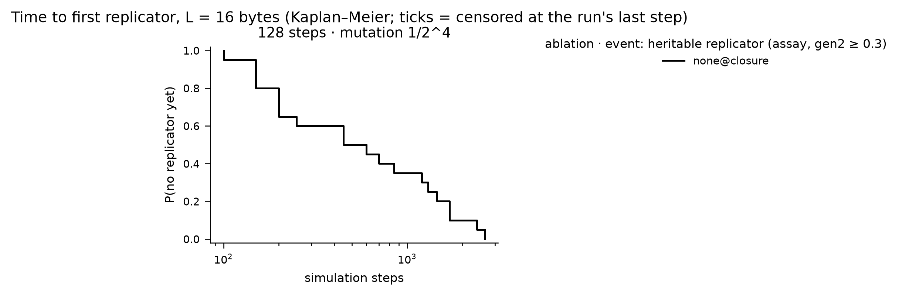
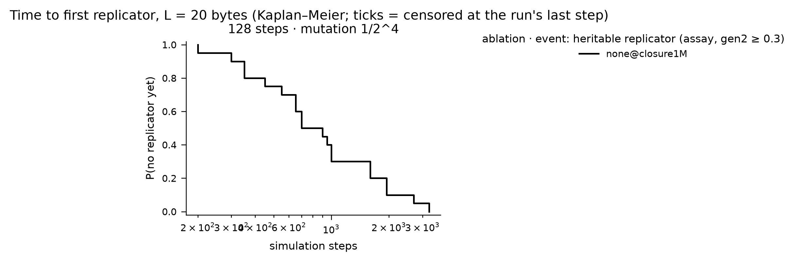
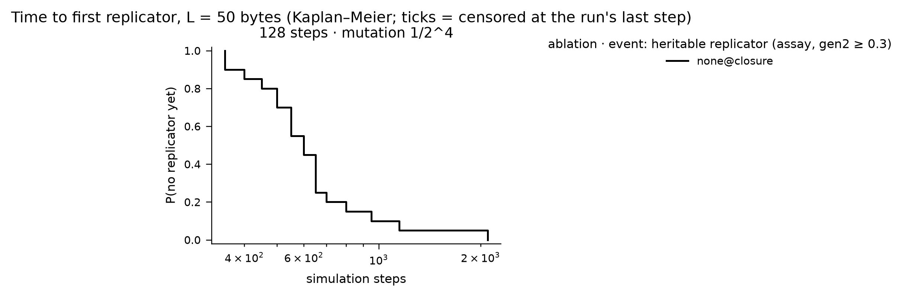
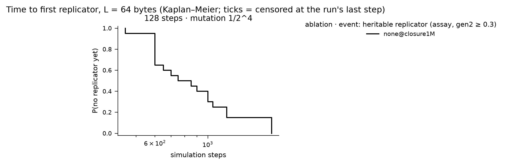

# Instruction-set ablation atlas — results

Batches: runs/stageG. Pre-registration and change log: `experiments/PLAN.md`; review: `experiments/REVIEW.md`. Emergence events: `tq_10` = quasispecies occupancy ≥ 10% (pre-registered primary; fires on zero-byte floods as well as replicators); `t_rep` = first top-3 exemplar with share ≥ 0.5% that is heritable (assay gen2 ≥ 0.3); `t_faith` = additionally ≥ 50% of partners became ≥ 75% copies. Times are Kaplan–Meier medians censored at each run's last step; sampling is every 500 steps, so 500 is the resolution floor.

## Pre-registered hypotheses

## Emergence grids

### L = 16

| ablation | 128 steps · 1/2^4 |
|---|---|
| none@closure | 20/20 · **20/20** (450) · 20/20 |

Each cell: seeds reaching q_share ≥ 10% (pre-registered) · **seeds with a heritable replicator** (KM median step, NR = not reached within the horizon) · seeds with a faithful replicator.

### L = 20

| ablation | 128 steps · 1/2^4 |
|---|---|
| none@closure1M | 19/20 · **20/20** (700) · 20/20 |

Each cell: seeds reaching q_share ≥ 10% (pre-registered) · **seeds with a heritable replicator** (KM median step, NR = not reached within the horizon) · seeds with a faithful replicator.

### L = 50

| ablation | 128 steps · 1/2^4 |
|---|---|
| none@closure | 20/20 · **20/20** (600) · 20/20 |

Each cell: seeds reaching q_share ≥ 10% (pre-registered) · **seeds with a heritable replicator** (KM median step, NR = not reached within the horizon) · seeds with a faithful replicator.

### L = 64

| ablation | 128 steps · 1/2^4 |
|---|---|
| none@closure1M | 20/20 · **20/20** (750) · 20/20 |

Each cell: seeds reaching q_share ≥ 10% (pre-registered) · **seeds with a heritable replicator** (KM median step, NR = not reached within the horizon) · seeds with a faithful replicator.

## Succession (census takeover times, family at 300k steps and at the last step)

| label          |   tape |   steps |   k |   n |   stopped_early |   last_step_min | final_at_last           | family_300k             |   stack_takeover_n |   stack_takeover_med |   ldir_takeover_n |   ldir_takeover_med |   ldir_invasions_complete |   ldir_invasions_censored |   ldir_invasion_med_steps |
|:---------------|-------:|--------:|----:|----:|----------------:|----------------:|:------------------------|:------------------------|-------------------:|---------------------:|------------------:|--------------------:|--------------------------:|--------------------------:|--------------------------:|
| none@closure   |     16 |     128 |   4 |  20 |               0 |          300000 | ex_sp:17, ldir:3        | ex_sp:17, ldir:3        |                 20 |                 8500 |                 3 |               43500 |                         3 |                         0 |                      1500 |
| none@closure   |     50 |     128 |   4 |  20 |               0 |          300000 | push:20                 | push:20                 |                 20 |                 1350 |                 0 |                 nan |                         0 |                         0 |                       nan |
| none@closure1M |     20 |     128 |   4 |  20 |               0 |         1000000 | ldir:16, push:3, none:1 | ldir:10, push:5, none:5 |                 17 |                18000 |                16 |              247500 |                        16 |                         0 |                      2000 |
| none@closure1M |     64 |     128 |   4 |  20 |               0 |         1000000 | push:13, ldir:7         | push:17, ldir:3         |                 20 |                 1750 |                 7 |              419000 |                         6 |                         0 |                      1000 |

## Replicator zoo — runs/stageG

## none@closure · L=16 · 128 steps · mutation 1/2^4
**first** (20 seeds)
- 20× `01 c5 01 c5 01 c5 01 c5 01 c5 01 c5 01 c5 01 c5` — [LD rr,nn ; PUSH rr] ×8

**final** (20 seeds)
- 17× `ad e3 21 e3 21 c0 ad c0 ad e3 21 e3 21 c0 ad c0` — [EX (SP),rr ; LD rr,nn ; RET NZ ; XOR L ; RET NZ ; XOR L] ×2
- 1× `1e 50 f9 c3 8e 4e f6 b5 e9 d2 5b 01 20 ce ed b0` — LD r,n ; LD SP,HL ; JP nn ; JP (HL) ; JP NC,nn ; JR NZ,d ; LDIR
- 1× `28 19 5e ed b0 aa 6b b4 28 19 5e ed b0 aa 6b b4` — [JR Z,d ; LD r,(HL) ; LDIR ; XOR D ; LD r,r ; OR H] ×2
- 1× `50 5e c3 eb 12 ee 8a 51 0b 0d db ed b0 ad 4d a9` — LD r,(HL) ; JP nn

## none@closure · L=50 · 128 steps · mutation 1/2^4
**first** (20 seeds)
- 20× `01 c5 01 c5 01 c5 01 c5 01 c5 01 c5 01 c5 01 c5 01 c5 01 c5 …` — [LD rr,nn ; PUSH rr] ×25

**final** (20 seeds)
- 20× `21 e5 21 e5 21 e5 21 e5 21 20 f0 e5 21 e5 21 e5 21 e5 21 e5 …` — [JR NZ,d ; PUSH rr ; LD rr,nn ; PUSH rr ; LD rr,nn ; PUSH rr ; LD rr,nn] ×3+8B

## none@closure1M · L=20 · 128 steps · mutation 1/2^4
**first** (20 seeds)
- 20× `01 c5 01 c5 01 c5 01 c5 01 c5 01 c5 01 c5 01 c5 01 c5 01 c5` — [LD rr,nn ; PUSH rr] ×10

**final** (20 seeds)
- 8× `1e a4 ed b0 1e a4 ed b0 1e a4 ed b0 1e a4 ed b0 1e a4 ed b0` — [LD r,n ; LDIR] ×5
- 3× `b0 11 5d d9 ed b0 11 5d d9 ed b0 11 5d d9 ed b0 11 5d d9 ed` — [LD rr,nn ; LDIR] ×4
- 2× `21 e5 21 e5 21 4e 10 e5 21 e5 21 e5 21 e5 21 4e 10 e5 21 e5` — [DJNZ d ; LD rr,nn ; PUSH rr ; LD rr,nn ; LD r,(HL)] ×2
- 2× `a4 5e ed b0 a4 5e ed b0 a4 5e ed b0 a4 5e ed b0 a4 5e ed b0` — [AND H ; LD r,(HL) ; LDIR] ×5
- 1× `21 e5 21 e5 21 fd 20 e5 21 e5 21 e5 21 e5 21 fd 20 e5 21 e5` — [JR NZ,d ; LD rr,nn ; PUSH rr ; LD rr,nn] ×2
- 1× `1e 9c 10 f6 6b c2 03 33 76 9c ed b8 08 48 e3 bc 1e ef aa 5c` — LD r,n ; DJNZ d ; JP NZ,nn ; LDDR ; EX rr,rr' ; EX (SP),rr ; LD r,n

## none@closure1M · L=64 · 128 steps · mutation 1/2^4
**first** (20 seeds)
- 20× `01 c5 01 c5 01 c5 01 c5 01 c5 01 c5 01 c5 01 c5 01 c5 01 c5 …` — [LD rr,nn ; PUSH rr] ×32

**final** (20 seeds)
- 12× `01 c5 01 c5 01 c5 01 c5 01 c5 01 c5 01 c5 01 c5 01 c5 01 c5 …` — [LD rr,nn ; PUSH rr] ×32
- 3× `84 5e ed b0 84 5e ed b0 84 5e ed b0 84 5e ed b0 84 5e ed b0 …` — [ADD A,H ; LD r,(HL) ; LDIR] ×16
- 1× `d5 d5 11 73 e9 d5 11 d5 11 73 e9 d5 11 d5 11 d5 11 d5 11 73 …` — [JP (HL) ; PUSH rr ; LD rr,nn ; LD (HL),r] ×10+4B
- 1× `08 5e 50 ed b0 bd 2b 0f 08 5e 50 ed b0 bd 2b 0f 08 5e 50 ed …` — [CP L ; DEC HL ; RRCA ; EX rr,rr' ; LD r,(HL) ; LD r,r ; LDIR] ×8
- 1× `b8 4b 2c cf ef ec ae 83 ab f9 0d 2e 90 03 19 ed b8 4b 2c cf …` — [ADD HL,DE ; LDDR ; LD r,r ; INC L ; RST 08 ; RST 28 ; CALL PE,nn ; XOR E ; LD SP,HL ; DEC C ; LD r,n ; INC BC] ×4
- 1× `04 5e ed b0 04 5e ed b0 04 5e ed b0 04 5e ed b0 04 5e ed b0 …` — [INC B ; LD r,(HL) ; LDIR] ×16
