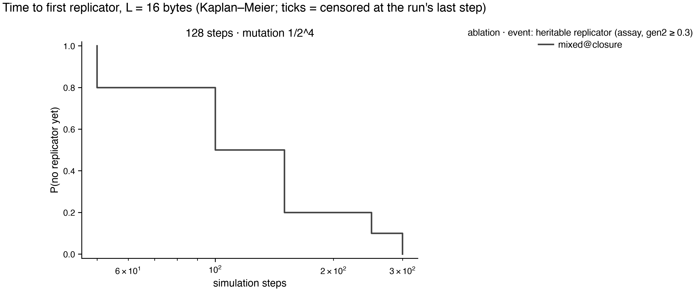

# Instruction-set ablation atlas — results

Batches: runs/stageH. Pre-registration and change log: `experiments/PLAN.md`; review: `experiments/REVIEW.md`. Emergence events: `tq_10` = quasispecies occupancy ≥ 10% (pre-registered primary; fires on zero-byte floods as well as replicators); `t_rep` = first top-3 exemplar with share ≥ 0.5% that is heritable (assay gen2 ≥ 0.3); `t_faith` = additionally ≥ 50% of partners became ≥ 75% copies. Times are Kaplan–Meier medians censored at each run's last step; sampling is every 500 steps, so 500 is the resolution floor.

## Pre-registered hypotheses

## Emergence grids

### L = 16

| ablation | 128 steps · 1/2^4 |
|---|---|
| mixed@closure | 10/10 · **10/10** (100) · 10/10 |

Each cell: seeds reaching q_share ≥ 10% (pre-registered) · **seeds with a heritable replicator** (KM median step, NR = not reached within the horizon) · seeds with a faithful replicator.

## Succession (census takeover times, family at 300k steps and at the last step)

| label         |   tape |   steps |   k |   n |   stopped_early |   last_step_min | final_at_last           | family_300k             |   stack_takeover_n |   stack_takeover_med |   ldir_takeover_n |   ldir_takeover_med |   ldir_invasions_complete |   ldir_invasions_censored |   ldir_invasion_med_steps |
|:--------------|-------:|--------:|----:|----:|----------------:|----------------:|:------------------------|:------------------------|-------------------:|---------------------:|------------------:|--------------------:|--------------------------:|--------------------------:|--------------------------:|
| mixed@closure |     16 |     128 |   4 |  10 |               0 |          300000 | push:5, ex_sp:4, ldir:1 | push:5, ex_sp:4, ldir:1 |                 10 |                  175 |                 1 |                 350 |                         1 |                         0 |                       100 |

## Replicator zoo — runs/stageH

## mixed@closure · L=16 · 128 steps · mutation 1/2^4
**first** (10 seeds)
- 10× `01 c5 01 c5 01 c5 01 c5 01 c5 01 c5 01 c5 01 c5` — [LD rr,nn ; PUSH rr] ×8

**final** (10 seeds)
- 5× `01 c5 01 c5 01 c5 01 c5 01 c5 01 c5 01 c5 01 c5` — [LD rr,nn ; PUSH rr] ×8
- 3× `b5 e3 21 e3 21 e0 b5 e0 b5 e3 21 e3 21 e0 b5 e0` — [EX (SP),rr ; LD rr,nn ; RET PO ; OR L ; RET PO ; OR L] ×2
- 1× `bd e3 21 e3 21 c0 bd c0 bd e3 21 e3 21 c0 bd c0` — [CP L ; EX (SP),rr ; LD rr,nn ; RET NZ ; CP L ; RET NZ] ×2
- 1× `b0 5e c2 30 eb ed b0 9c f3 d0 95 d6 00 36 14 60` — LD r,(HL) ; JP NZ,nn ; LDIR ; RET NC ; LD (HL),n
