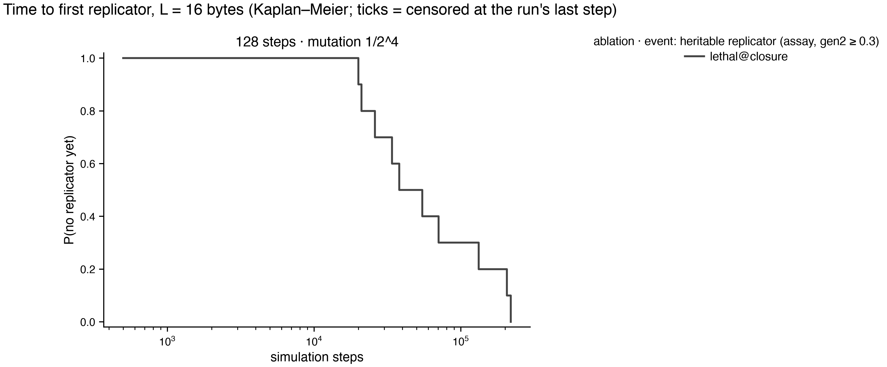

# Instruction-set ablation atlas — results

Batches: runs/stageI. Pre-registration and change log: `experiments/PLAN.md`; review: `experiments/REVIEW.md`. Emergence events: `tq_10` = quasispecies occupancy ≥ 10% (pre-registered primary; fires on zero-byte floods as well as replicators); `t_rep` = first top-3 exemplar with share ≥ 0.5% that is heritable (assay gen2 ≥ 0.3); `t_faith` = additionally ≥ 50% of partners became ≥ 75% copies. Times are Kaplan–Meier medians censored at each run's last step; sampling is every 500 steps, so 500 is the resolution floor.

## Pre-registered hypotheses

## Emergence grids

### L = 16

| ablation | 128 steps · 1/2^4 |
|---|---|
| lethal@closure | 0/10 · **10/10** (38,000) · 10/10 |

Each cell: seeds reaching q_share ≥ 10% (pre-registered) · **seeds with a heritable replicator** (KM median step, NR = not reached within the horizon) · seeds with a faithful replicator.

## Succession (census takeover times, family at 300k steps and at the last step)

| label          |   tape |   steps |   k |   n |   stopped_early |   last_step_min | final_at_last   | family_300k   |   stack_takeover_n |   stack_takeover_med |   ldir_takeover_n |   ldir_takeover_med |   ldir_invasions_complete |   ldir_invasions_censored |   ldir_invasion_med_steps |
|:---------------|-------:|--------:|----:|----:|----------------:|----------------:|:----------------|:--------------|-------------------:|---------------------:|------------------:|--------------------:|--------------------------:|--------------------------:|--------------------------:|
| lethal@closure |     16 |     128 |   4 |  10 |               0 |          300000 | ldir:10         | ldir:10       |                  0 |                  nan |                10 |               29500 |                        10 |                         0 |                      1000 |

## Replicator zoo — runs/stageI

## lethal@closure · L=16 · 128 steps · mutation 1/2^4
**first** (10 seeds)
- 1× `84 5e ed b0 84 5e ed b0 84 5e ed b0 84 5e ed b0` — [ADD A,H ; LD r,(HL) ; LDIR] ×4
- 1× `a8 6e eb a0 ed b0 28 56 a8 6e eb a0 ed b0 28 56` — [AND B ; LDIR ; JR Z,d ; XOR B ; LD r,(HL) ; EX rr,rr] ×2
- 1× `31 a4 02 d1 e8 9e ed b0 31 a4 02 d1 e8 9e ed b0` — [LD rr,nn ; POP rr ; RET PE ; SBC A,(HL) ; LDIR] ×2
- 1× `a4 5e ed b0 a4 5e ed b0 a4 5e ed b0 a4 5e ed b0` — [AND H ; LD r,(HL) ; LDIR] ×4
- 1× `b7 11 88 d9 69 ed b0 a0 b7 11 88 d9 69 ed b0 a0` — [AND B ; OR A ; LD rr,nn ; LD r,r ; LDIR] ×2
- 1× `11 68 4f ed b0 9b 11 dc 11 68 4f ed b0 9b 11 dc` — [LD r,r ; LD r,r ; LDIR ; SBC A,E ; LD rr,nn] ×2

**final** (10 seeds)
- 2× `44 5e ed b0 44 5e ed b0 44 5e ed b0 44 5e ed b0` — [LD r,(HL) ; LDIR ; LD r,r] ×4
- 1× `c8 6e eb ed b0 ee b6 4e c8 6e eb ed b0 ee b6 4e` — [EX rr,rr ; LDIR ; XOR n ; LD r,(HL) ; RET Z ; LD r,(HL)] ×2
- 1× `11 48 da ed b0 44 c8 11 11 48 da ed b0 44 c8 11` — [JP C,nn ; LD r,r ; RET Z ; LD rr,nn] ×2
- 1× `a4 5e ed b0 a4 5e ed b0 a4 5e ed b0 a4 5e ed b0` — [AND H ; LD r,(HL) ; LDIR] ×4
- 1× `11 e8 da ed b0 58 6e 9b 11 e8 da ed b0 58 6e 9b` — [LD r,(HL) ; SBC A,E ; LD rr,nn ; LDIR ; LD r,r] ×2
- 1× `11 c8 b7 ed b0 4a 0c 77 11 c8 b7 ed b0 4a 0c 77` — [INC C ; LD (HL),r ; LD rr,nn ; LDIR ; LD r,r] ×2
